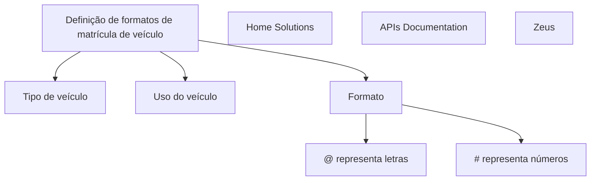

# Definição de Formatos de Matrícula (Placa) de Veículo

## 1. Metadados do Documento
- **Arquivo de Origem:** `Não identificado`
- **Tipo de Documento:** `Apresentação Executiva`
- **Domínio / Sistema:** `Definição de formatos de matrícula (placa) de veículo`
- **Público-Alvo:** `Não identificado`
- **Data/Versão Identificada:** `Não identificada`

---

## 2. Resumo Executivo & Contexto de Negócio

O conteúdo apresenta um tema de definição de formatos de matrícula, também identificada como placa, para veículos. O objetivo textual indica a necessidade de definir propriedades associadas ao formato de matrícula de veículo.

As propriedades explicitamente listadas são tipo de veículo, uso do veículo e formato. O formato é descrito por uma convenção na qual `@` representa letras e `#` representa números.

O material também contém os termos `CF`, `Home Solutions`, `APIs Documentation` e `Zeus`, sem detalhar se representam sistemas, módulos, links de navegação, ambientes ou responsáveis pelo processo.

Não há detalhamento sobre regras de validação, exemplos completos de placas, contratos de API, persistência de dados, fluxos operacionais ou responsabilidades entre sistemas.

---

## 3. Arquitetura, Componentes & Tecnologias Envolvidas

Os únicos elementos técnicos ou sistêmicos citados no conteúdo são `Home Solutions`, `APIs Documentation` e `Zeus`. O texto não informa a função, a arquitetura, as integrações ou as tecnologias utilizadas por esses elementos.



> **Nota de Análise:** O diagrama representa exclusivamente os conceitos e rótulos presentes no conteúdo. O documento não estabelece relações técnicas entre `Home Solutions`, `APIs Documentation`, `Zeus` e a definição de formatos de matrícula.

---

## 4. Regras de Negócio, Especificações Funcionais & Processos

1. O documento trata da definição de formatos de matrícula, ou placa, de veículo.
2. A definição possui propriedades associadas.
3. Uma propriedade de definição é o **tipo de veículo**.
4. Outra propriedade de definição é o **uso do veículo**.
5. Outra propriedade de definição é o **formato**.
6. A convenção do campo ou propriedade **formato** determina que:
   - `@` representa letras.
   - `#` representa números.
7. O conteúdo apresenta o valor ou rótulo `CF`, mas não informa seu significado, sua relação com o formato de matrícula ou sua utilização operacional.

> **Nota de Análise:** O documento não especifica formatos concretos de matrícula, quantidades de caracteres, obrigatoriedade das propriedades, critérios de validação, combinações permitidas de letras e números, nem comportamentos para valores inválidos.

---

## 5. Tabelas de Parâmetros, Ambientes e Estruturas de Dados

| Item / Parâmetro | Descrição / Função | Tipo / Valores / Formato | Ambiente / Observações |
| :--- | :--- | :--- | :--- |
| Definição de formatos de matrícula | Tema central do conteúdo; refere-se à definição de formatos de placa de veículo. | Não especificado | Não especificado |
| Tipo de veículo | Propriedade de definição citada para o formato de matrícula. | Não especificado | O documento não lista tipos de veículo. |
| Uso do veículo | Propriedade de definição citada para o formato de matrícula. | Não especificado | O documento não lista usos de veículo. |
| Formato | Propriedade usada para representar letras e números em uma matrícula. | `@` para letras; `#` para números | Não há exemplo completo de formato. |
| `@` | Símbolo de representação de letras. | Letras | Aplicável à propriedade de formato. |
| `#` | Símbolo de representação de números. | Números | Aplicável à propriedade de formato. |
| `CF` | Termo apresentado isoladamente. | Não especificado | Significado e finalidade não detalhados. |
| Home Solutions | Termo citado no conteúdo. | Não especificado | Pode corresponder a rótulo de navegação ou sistema; o documento não esclarece. |
| APIs Documentation | Termo citado no conteúdo. | Não especificado | O documento não descreve APIs, endpoints ou contratos. |
| Zeus | Termo citado no conteúdo. | Não especificado | Função, ambiente e integração não detalhados. |

---

## 6. Bateria de Perguntas & Respostas para RAG (FAQ Sintético)

### P1: Qual é o objetivo principal do documento?
**R:** O documento trata da definição de formatos de matrícula, também chamada de placa, para veículos. O conteúdo indica que essa definição possui propriedades relacionadas ao veículo e ao formato da matrícula.

### P2: Quais propriedades são citadas para a definição de formato de matrícula?
**R:** As propriedades citadas são tipo de veículo, uso do veículo e formato.

### P3: O que o símbolo `@` representa no formato de matrícula?
**R:** Conforme o documento, o símbolo `@` representa letras no formato de matrícula de veículo.

### P4: O que o símbolo `#` representa no formato de matrícula?
**R:** Conforme o documento, o símbolo `#` representa números no formato de matrícula de veículo.

### P5: O documento fornece um exemplo completo de formato de placa?
**R:** Não. O documento apresenta apenas a convenção de que `@` representa letras e `#` representa números, sem fornecer um padrão completo de matrícula.

### P6: Quais tipos de veículo são suportados pela definição de formatos?
**R:** O documento cita a propriedade tipo de veículo, mas não informa quais tipos de veículo são suportados.

### P7: Quais usos de veículo são considerados na definição de matrícula?
**R:** O documento cita a propriedade uso do veículo, mas não detalha valores, categorias ou regras associadas ao uso do veículo.

### P8: O que significa o termo `CF` no documento?
**R:** O documento contém o termo `CF`, mas não fornece definição, contexto funcional ou vínculo explícito com a matrícula, o veículo ou o formato.

### P9: O documento descreve APIs para consultar ou cadastrar formatos de matrícula?
**R:** Não. Embora o texto contenha o rótulo `APIs Documentation`, não há endpoints, métodos HTTP, contratos JSON, parâmetros ou exemplos de integração descritos.

### P10: Qual é o papel de Home Solutions e Zeus na definição de formatos de matrícula?
**R:** O conteúdo cita `Home Solutions` e `Zeus`, mas não informa seus papéis, responsabilidades, integrações ou relação técnica com a definição de formatos de matrícula.

---

## 7. Glossário de Termos, Siglas & Conceitos-Chave

- **Matrícula (placa):** Identificação de veículo mencionada como objeto da definição de formatos.
- **Tipo de veículo:** Propriedade de definição citada no documento, sem valores detalhados.
- **Uso do veículo:** Propriedade de definição citada no documento, sem valores detalhados.
- **Formato:** Propriedade que utiliza `@` para letras e `#` para números.
- **`@`:** Marcador de letras no formato.
- **`#`:** Marcador de números no formato.
- **CF:** Termo citado sem definição no conteúdo.
- **Home Solutions:** Termo citado sem função definida no conteúdo.
- **APIs Documentation:** Rótulo citado sem documentação técnica associada no conteúdo.
- **Zeus:** Termo citado sem definição de função, tecnologia ou integração.

---

## 8. Notas Críticas, Riscos & Limitações

- O documento é fragmentário e não apresenta detalhamento adicional para as propriedades de tipo de veículo, uso do veículo e formato.
- Não existem exemplos completos de formatos de matrícula.
- Não há regras de validação, mensagens de erro, campos obrigatórios, precedência entre regras ou critérios de aceitação.
- Não há definição para o termo `CF`.
- Os termos `Home Solutions`, `APIs Documentation` e `Zeus` são citados sem contexto técnico ou funcional.
- Não há informações sobre ambientes, URLs, autenticação, logs, servidores, bancos de dados, APIs ou contratos de integração.

---

## 9. Conteúdo Bruto Estruturado (Referência Fiel)

```text
--- [PÁGINA 1 DE 1] ---

Imagen LOGO
EN CONSTRUCCIÓN
DEFINICIÓN de formatos de matrícula (placa)
de vehículo
Objetivo
Propiedades de definición
Propiedades de definición
Tipo de vehículo
tipo de vehículo
Uso
uso del vehiculo
Formato
formato @->letras #->numeros
 /
 CF
Home Solutions APIs Documentation Zeus
EN
```
