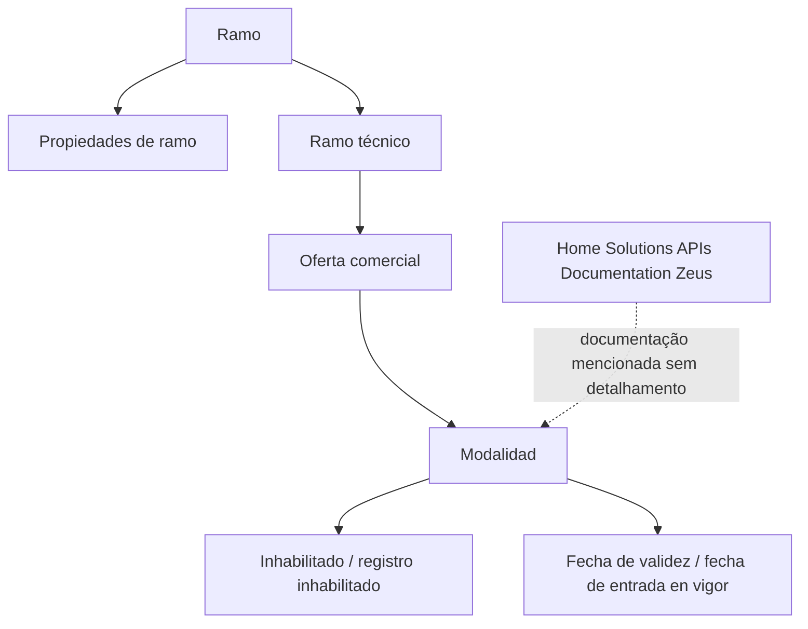

# Definição de Modalidades por Ramo — Documento em Construção

## 1. Metadados do Documento
- **Arquivo de Origem:** Não identificado
- **Tipo de Documento:** Especificação Técnica / Apresentação Executiva
- **Domínio / Sistema:** Definição de modalidades por ramo; Home Solutions APIs Documentation Zeus
- **Público-Alvo:** Desenvolvedores, Arquitetos, Negócio
- **Data/Versão Identificada:** Não identificada

---

## 2. Resumo Executivo & Contexto de Negócio

O conteúdo apresenta uma definição em construção para modalidades associadas a ramos. Os termos extraídos relacionam propriedades de ramo, ramo técnico, oferta comercial e modalidade, indicando um possível modelo de classificação ou configuração de produtos por ramo.

O documento também registra os estados “Inhabilitado” e “registro inhabilitado”, além de referências a “Fecha de validez” e “fecha de entrada en vigor”. Esses elementos indicam que a configuração possui controle de disponibilidade e vigência temporal.

Há menção a “CF”, “Home Solutions APIs Documentation Zeus” e “EN”. Entretanto, o material não descreve o significado de “CF”, o papel de Zeus, contratos de APIs, métodos HTTP, estruturas JSON, ambientes ou responsabilidades dos componentes.

> **Nota de Análise:** O documento apresenta apenas termos e tópicos resumidos; não há detalhamento adicional sobre regras de associação entre ramo, ramo técnico, oferta comercial e modalidade.

---

## 3. Arquitetura, Componentes & Tecnologias Envolvidas

Os elementos identificados são:

- **Ramo**
- **Propriedades de ramo**
- **Ramo técnico**
- **Oferta comercial**
- **Modalidade**
- **Estado Inhabilitado**
- **Registro inhabilitado**
- **Fecha de validez**
- **Fecha de entrada en vigor**
- **CF**
- **Home Solutions APIs Documentation Zeus**
- **EN**

O texto sugere uma relação conceitual entre propriedades de ramo, ramo técnico, oferta comercial e modalidade. Contudo, não descreve uma arquitetura de software, integração técnica, persistência de dados, APIs ou fluxo operacional completo.



---

## 4. Regras de Negócio, Especificações Funcionais & Processos

1. O documento trata da **definição de modalidades por ramo**.
2. O conceito de **ramo** possui **propriedades de ramo** explicitamente mencionadas.
3. O conceito de **ramo técnico** é citado como elemento relacionado ao ramo.
4. A **oferta comercial** é mencionada em conjunto com ramo técnico e modalidade.
5. A **modalidade** é um conceito central do material.
6. Existe um estado identificado como **Inhabilitado**.
7. Existe também a referência a **registro inhabilitado**, sem explicação sobre a diferença entre esse registro e o estado “Inhabilitado”.
8. São mencionados os atributos ou conceitos de vigência:
   - **Fecha de validez**
   - **fecha de entrada en vigor**
9. O documento menciona **CF**, mas não define seu significado.
10. O documento menciona **Home Solutions APIs Documentation Zeus**, mas não especifica endpoints, autenticação, payloads, tecnologias ou integração.

> **Nota de Análise:** Não foram identificadas condições de validação, cálculos, transições de estado, critérios de habilitação, regras de data, nem responsabilidades de usuários ou sistemas.

---

## 5. Tabelas de Parâmetros, Ambientes e Estruturas de Dados

| Item / Parâmetro | Descrição / Função | Tipo / Valores / Formato | Ambiente / Observações |
| :--- | :--- | :--- | :--- |
| Ramo | Conceito de ramo citado no documento. | Não especificado | Possui referência a propriedades de ramo. |
| Propriedades de ramo | Propriedades associadas ao ramo. | Não especificado | O documento não enumera propriedades. |
| Ramo técnico | Conceito técnico de ramo. | Não especificado | Relação detalhada com ramo não informada. |
| Oferta comercial | Elemento comercial mencionado. | Não especificado | Relação detalhada com modalidade não informada. |
| Modalidade | Modalidade definida por ramo, conforme o título do conteúdo. | Não especificado | Não há lista de modalidades. |
| Inhabilitado | Estado ou condição mencionada. | `Inhabilitado` | Sem regra de ativação ou efeito descritos. |
| Registro inhabilitado | Registro em condição inabilitada. | `registro inhabilitado` | Diferença para “Inhabilitado” não especificada. |
| Fecha de validez | Data de validade mencionada. | Data; formato não especificado | Sem regra de cálculo ou validação. |
| Fecha de entrada en vigor | Data de entrada em vigor mencionada. | Data; formato não especificado | Sem regra de cálculo ou validação. |
| CF | Sigla ou referência identificada. | Não especificado | Significado não definido no conteúdo. |
| Home Solutions APIs Documentation Zeus | Referência a documentação de APIs Zeus. | Não especificado | Não há URLs, métodos HTTP ou contratos técnicos. |
| EN | Sigla ou marcador identificado. | `EN` | Significado não definido no conteúdo. |

---

## 6. Bateria de Perguntas & Respostas para RAG (FAQ Sintético)

### P1: Qual é o objetivo do documento?
**R:** O objetivo identificado é a definição de modalidades por ramo. O conteúdo não fornece detalhamento adicional sobre como essa definição deve ser implementada ou operada.

### P2: Quais conceitos de negócio são mencionados na definição de modalidades?
**R:** O documento menciona ramo, propriedades de ramo, ramo técnico, oferta comercial e modalidade.

### P3: O documento define quais são as propriedades de ramo?
**R:** Não. O documento apenas menciona “Propiedades de ramo”, sem enumerar ou explicar quais propriedades pertencem ao ramo.

### P4: Qual é a relação entre ramo técnico e oferta comercial?
**R:** O ramo técnico e a oferta comercial são citados no mesmo conteúdo, mas o documento não descreve explicitamente a relação funcional, técnica ou de dados entre ambos.

### P5: O que significa o estado “Inhabilitado”?
**R:** O documento menciona “Inhabilitado”, mas não define o comportamento, as condições de entrada, os efeitos operacionais ou os critérios para saída desse estado.

### P6: O que é “registro inhabilitado”?
**R:** “registro inhabilitado” é um termo presente no conteúdo. Não há explicação sobre quais registros podem ser inabilitados, nem sobre a diferença entre esse termo e o estado “Inhabilitado”.

### P7: Quais datas de vigência são mencionadas?
**R:** O material menciona “Fecha de validez” e “fecha de entrada en vigor”. Não são fornecidos formatos de data, regras de validação, precedência ou comportamento para períodos expirados.

### P8: O documento apresenta APIs para Home Solutions ou Zeus?
**R:** Não. O material menciona “Home Solutions APIs Documentation Zeus”, mas não apresenta URLs, endpoints, métodos HTTP, mecanismos de autenticação, contratos JSON ou fluxos de integração.

### P9: O significado de “CF” está definido?
**R:** Não. “CF” aparece no conteúdo, porém não possui definição contextual no material fornecido.

### P10: O que significa “EN” no documento?
**R:** O termo “EN” é apresentado sem definição. O conteúdo não permite determinar se “EN” representa idioma, ambiente, sigla de sistema ou outro conceito.

---

## 7. Glossário de Termos, Siglas & Conceitos-Chave

- **CF:** Sigla mencionada no documento sem significado definido.
- **EN:** Marcador ou sigla mencionada no documento sem significado definido.
- **Fecha de entrada en vigor:** Data de entrada em vigor mencionada no conteúdo.
- **Fecha de validez:** Data de validade mencionada no conteúdo.
- **Home Solutions APIs Documentation Zeus:** Referência textual a documentação de APIs Zeus relacionada a Home Solutions.
- **Inhabilitado:** Estado ou condição de inabilitação mencionada no documento.
- **Modalidade:** Conceito central associado à definição por ramo.
- **Oferta comercial:** Conceito comercial mencionado no conteúdo.
- **Ramo:** Entidade ou conceito de classificação referido no documento.
- **Ramo técnico:** Conceito técnico de ramo mencionado no documento.
- **Registro inhabilitado:** Registro descrito como inabilitado.

---

## 8. Notas Críticas, Riscos & Limitações

- O conteúdo está identificado como **“EN CONSTRUCCIÓN”**, indicando material em elaboração.
- Não há arquivo de origem, data, versão, autoria ou responsável identificados.
- Não há detalhamento de arquitetura, sistemas, tecnologias, ambientes ou integrações.
- Não há contratos de API, URLs, métodos HTTP, credenciais, formatos de mensagem ou códigos de erro.
- Não há definição das propriedades de ramo, modalidades, ofertas comerciais ou regras de associação.
- Não há especificação do significado de **CF** e **EN**.
- Não há explicação sobre a diferença entre **Inhabilitado** e **registro inhabilitado**.
- Não há regras para datas de validade ou entrada em vigor.

---

## 9. Conteúdo Bruto Estruturado (Referência Fiel)

```text
--- [PÁGINA 1 DE 1] ---

Imagen LOGO
EN CONSTRUCCIÓN
DEFINICIÓN de modalidades por ramo
Objetivo
Propiedades de ramo
Propiedades de ramo
Ramo
ramo técnico
Oferta comercial
modalidad
Inhabilitado
registro inhabilitado
Fecha de validez
fecha de entrada en vigor
 /
 CF
Home Solutions APIs Documentation Zeus
EN
```
