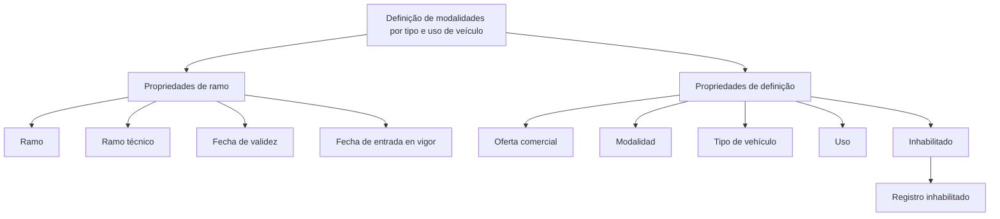

# Definição de Modalidades por Tipo e Uso de Veículo

## 1. Metadados do Documento
- **Arquivo de Origem:** Não identificado
- **Tipo de Documento:** Especificação Técnica
- **Domínio / Sistema:** Definição de modalidades por tipo e uso de veículo; Home Solutions APIs Documentation Zeus
- **Público-Alvo:** Desenvolvedores, Arquitetos, Negócio
- **Data/Versão Identificada:** Não identificada

---

## 2. Resumo Executivo & Contexto de Negócio

O documento apresenta uma definição de modalidades baseada em características de veículo. O objetivo explicitado é a **“DEFINICIÓN de modalidades por tipo y uso de vehículo”**, relacionando propriedades de ramo e propriedades de definição.

As propriedades de ramo citadas são **Ramo**, **ramo técnico**, **Fecha de validez** e **fecha de entrada en vigor**. As propriedades de definição citadas são **Oferta comercial**, **modalidad**, **Tipo de vehículo**, **Uso** e **Inhabilitado**.

A estrutura indica que a modalidade comercial está associada ao tipo e ao uso do veículo, sob condições relacionadas ao ramo e à vigência. Também existe o atributo de inabilitação, descrito como **“registro inhabilitado”**, que representa o estado de indisponibilidade de um registro.

O texto menciona **Home Solutions APIs Documentation Zeus**, mas não descreve APIs, endpoints, métodos HTTP, contratos JSON, autenticação, ambientes, versões ou fluxos de integração.  

> **Nota de Análise:** O documento contém tópicos resumidos e não detalha regras de precedência, obrigatoriedade dos campos, formatos, valores permitidos ou comportamento operacional do status “Inhabilitado”.

---

## 3. Arquitetura, Componentes & Tecnologias Envolvidas

Os elementos identificados no documento são:

| Componente / Conceito | Papel identificado no documento |
| :--- | :--- |
| Definição de modalidades | Tema e objetivo central do documento |
| Ramo | Propriedade de ramo |
| Ramo técnico | Propriedade de ramo |
| Fecha de validez | Propriedade de ramo relacionada à validade |
| Fecha de entrada en vigor | Propriedade de ramo relacionada à entrada em vigor |
| Oferta comercial | Propriedade de definição |
| Modalidad | Propriedade de definição |
| Tipo de vehículo | Propriedade de definição |
| Uso | Propriedade de definição |
| Inhabilitado | Propriedade de definição; indica registro inabilitado |
| Home Solutions APIs Documentation Zeus | Referência textual presente no documento |



---

## 4. Regras de Negócio, Especificações Funcionais & Processos

1. O documento estabelece que a definição de modalidades considera **tipo de veículo** e **uso do veículo**.
2. A definição é organizada em dois grupos de propriedades:
   - **Propriedades de ramo**.
   - **Propriedades de definição**.
3. As propriedades de ramo incluem:
   - Ramo.
   - Ramo técnico.
   - Data de validade.
   - Data de entrada em vigor.
4. As propriedades de definição incluem:
   - Oferta comercial.
   - Modalidade.
   - Tipo de veículo.
   - Uso.
   - Estado de inabilitação.
5. O campo **Inhabilitado** é associado à descrição **“registro inhabilitado”**.
6. O documento não especifica:
   - Regras para determinar uma modalidade a partir de combinações de ramo, oferta comercial, tipo de veículo e uso.
   - Valores permitidos para ramo, ramo técnico, modalidade, tipo de veículo ou uso.
   - Formato das datas de validade e de entrada em vigor.
   - Critérios para habilitar ou inabilitar um registro.
   - Comportamento de registros inabilitados em consultas, cotações, ofertas ou integrações.

---

## 5. Tabelas de Parâmetros, Ambientes e Estruturas de Dados

| Item / Parâmetro | Descrição / Função | Tipo / Valores / Formato | Ambiente / Observações |
| :--- | :--- | :--- | :--- |
| Ramo | Propriedade de ramo. | Não especificado. | Sem detalhamento adicional. |
| Ramo técnico | Propriedade de ramo. | Não especificado. | Sem detalhamento adicional. |
| Fecha de validez | Propriedade de ramo relacionada à validade. | Data; formato não especificado. | O documento usa o termo em espanhol. |
| Fecha de entrada en vigor | Propriedade de ramo relacionada à entrada em vigor. | Data; formato não especificado. | O documento usa o termo em espanhol. |
| Oferta comercial | Propriedade de definição. | Não especificado. | Sem detalhamento adicional. |
| Modalidad | Propriedade de definição. | Não especificado. | Associada ao objetivo de definição de modalidades. |
| Tipo de vehículo | Propriedade de definição. | Não especificado. | Elemento central da definição de modalidades. |
| Uso | Propriedade de definição; também descrita como “uso del vehiculo”. | Não especificado. | Elemento central da definição de modalidades. |
| Inhabilitado | Propriedade de definição para indicar indisponibilidade. | Não especificado. | Descrita como “registro inhabilitado”. |
| Home Solutions APIs Documentation Zeus | Referência textual a documentação ou contexto de APIs. | Não especificado. | Não há detalhes técnicos sobre APIs. |

---

## 6. Bateria de Perguntas & Respostas para RAG (FAQ Sintético)

### P1: Qual é o objetivo do documento?
**R:** O objetivo apresentado é a definição de modalidades por tipo e uso de veículo.

### P2: Quais são as propriedades de ramo listadas?
**R:** As propriedades de ramo listadas são: Ramo, ramo técnico, Fecha de validez e fecha de entrada en vigor.

### P3: Quais são as propriedades de definição listadas?
**R:** As propriedades de definição são: Oferta comercial, modalidad, Tipo de vehículo, Uso e Inhabilitado.

### P4: Quais atributos estão diretamente relacionados à definição de modalidades?
**R:** O documento relaciona a definição de modalidades ao tipo de veículo e ao uso do veículo. Também lista oferta comercial e modalidade como propriedades de definição.

### P5: O que significa o atributo “Inhabilitado” no documento?
**R:** O atributo “Inhabilitado” é descrito como “registro inhabilitado”. O documento não apresenta critérios adicionais para determinar quando um registro deve ser inabilitado.

### P6: O documento informa o formato da data de validade?
**R:** Não. O documento cita “Fecha de validez” como propriedade de ramo, mas não informa formato, fuso horário, precisão ou regras de cálculo da data.

### P7: O que representa “fecha de entrada en vigor”?
**R:** “Fecha de entrada en vigor” é uma propriedade de ramo citada no documento. O texto não detalha seu formato nem como ela interage com a data de validade.

### P8: O documento descreve endpoints ou contratos da referência Home Solutions APIs Documentation Zeus?
**R:** Não. A expressão “Home Solutions APIs Documentation Zeus” aparece no conteúdo, mas não há endpoints, métodos HTTP, contratos JSON, mecanismos de autenticação ou detalhes de integração.

### P9: O documento define valores permitidos para tipo de veículo e uso?
**R:** Não. O documento apenas cita “Tipo de vehículo” e “Uso” como propriedades de definição, sem fornecer catálogos, códigos, valores permitidos ou regras de validação.

### P10: Há uma regra documentada para selecionar uma modalidade comercial?
**R:** Não. O documento lista “Oferta comercial” e “modalidad”, mas não especifica critérios, precedência, algoritmo ou condições para selecionar uma modalidade.

---

## 7. Glossário de Termos, Siglas & Conceitos-Chave

- **Ramo:** Propriedade de ramo listada no documento; não há definição adicional.
- **Ramo técnico:** Propriedade de ramo listada no documento; não há definição adicional.
- **Fecha de validez:** Termo apresentado como propriedade de ramo relacionada à validade.
- **Fecha de entrada en vigor:** Termo apresentado como propriedade de ramo relacionada à entrada em vigor.
- **Oferta comercial:** Propriedade de definição listada no documento.
- **Modalidad:** Propriedade de definição vinculada ao objetivo de definição de modalidades.
- **Tipo de vehículo:** Tipo de veículo; propriedade de definição.
- **Uso:** Uso do veículo; propriedade de definição.
- **Inhabilitado:** Estado relacionado a “registro inhabilitado”.
- **Home Solutions APIs Documentation Zeus:** Referência textual apresentada no documento, sem expansão ou descrição técnica adicional.

---

## 8. Notas Críticas, Riscos & Limitações

- O arquivo de origem, a data, a versão e a autoria não foram identificados no conteúdo fornecido.
- Não existem detalhes sobre contratos técnicos, APIs, integrações, tecnologias, repositórios, logs, servidores ou ambientes.
- Não há regras formais de validação, obrigatoriedade, precedência ou combinação entre propriedades.
- Não são fornecidos catálogos de ramos, modalidades, tipos de veículo, usos ou ofertas comerciais.
- O status **Inhabilitado** não possui regra de ativação, impacto funcional ou processo de reabilitação documentado.
- As datas citadas não possuem formato, timezone, semântica de intervalo ou regra de vigência definida.

---

## 9. Conteúdo Bruto Estruturado (Referência Fiel)

```text
--- [PÁGINA 1 DE 2] ---

Imagen LOGO
EN CONSTRUCCIÓN
DEFINICIÓN de modalidades por tipo y uso de
vehículo
Objetivo
Propiedades de ramo
Propiedades de definición
Propiedades de ramo
Ramo
ramo técnico
Fecha de validez
fecha de entrada en vigor
Propiedades de definición
Oferta comercial
modalidad
Tipo de vehículo
 /
 CF
Home Solutions APIs Documentation Zeus
EN


--- [PÁGINA 2 DE 2] ---

tipo de vehículo
Uso
uso del vehiculo
Inhabilitado
registro inhabilitado
```
