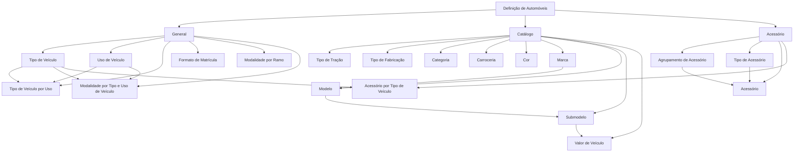

# Definições e Catálogos de Automóveis: Veículos, Modalidades e Acessórios

## 1. Metadados do Documento
- **Arquivo de Origem:** Não identificado — texto bruto fornecido pelo solicitante
- **Tipo de Documento:** Especificação Funcional
- **Domínio / Sistema:** Definição de automóveis; ramos de automóvel
- **Público-Alvo:** Não identificado
- **Data/Versão Identificada:** Não identificada

---

## 2. Resumo Executivo & Contexto de Negócio

O documento descreve uma estrutura de definições para o domínio de automóveis, organizada em níveis funcionais relacionados à configuração de veículos, modalidades e acessórios. O conteúdo estabelece os elementos que intervêm na definição de automóveis e informa que existe uma ordem para sua realização, embora não detalhe explicitamente a sequência operacional entre todos os níveis.

O nível **General** reúne definições gerais necessárias para ramos de automóvel. Nesse contexto, são definidos tipos de veículo, usos de veículo, combinações entre tipo e uso de veículo, formatos de matrícula, modalidades por ramo e modalidades condicionadas pelo tipo e uso do veículo.

O nível **Catálogo** concentra cadastros e classificações de dados de veículos. Os catálogos abrangem tipo de tração, tipo de fabricação, categoria, carroceria, cor, marca, modelo, submodelo e valor de veículo. O valor de veículo é registrado por ano e vinculado à marca, modelo e submodelo.

O nível **Acessório** trata das definições de acessórios de automóvel. A estrutura inclui agrupamento de acessório, tipo de acessório, acessórios permitidos e identificação dos acessórios permitidos conforme o tipo de veículo. O documento não apresenta contratos técnicos, APIs, telas, persistência de dados, responsabilidades de sistemas ou regras de validação detalhadas.

---

## 3. Arquitetura, Componentes & Tecnologias Envolvidas

O conteúdo não descreve uma arquitetura de software, infraestrutura, integrações, microsserviços, APIs, bancos de dados ou tecnologias específicas. A estrutura abaixo representa exclusivamente a hierarquia funcional extraída do documento.



**Nota de Análise:** O documento apresenta uma estrutura funcional e cadastral, mas não detalha a implementação técnica dos componentes, suas interfaces ou o fluxo transacional entre os níveis.

---

## 4. Regras de Negócio, Especificações Funcionais & Processos

### 4.1 Estrutura geral de definição de automóveis

- A definição de automóveis é composta por elementos que intervêm na definição e por uma ordem de realização.
- O documento afirma que existe uma ordem para realizar as definições, mas não informa a sequência detalhada entre **General**, **Catálogo** e **Acessório**.
- As definições gerais são necessárias para ramos de automóvel.

### 4.2 Definições do nível General

1. **Tipo de Veículo**
   - Define os tipos de veículos que podem ser segurados.

2. **Uso de Veículo**
   - Define os usos de veículos permitidos.

3. **Tipo de Veículo por Uso**
   - Define o tipo de veículo conforme o uso do veículo.

4. **Formato de Matrícula**
   - Define o formato que as matrículas dos veículos devem possuir.

5. **Modalidade por Ramo**
   - Define as modalidades permitidas.

6. **Modalidade por Tipo e Uso de Veículo**
   - Define as modalidades permitidas conforme o tipo e o uso do veículo.

### 4.3 Catálogos de dados de veículos

1. **Tipo de Tração**
   - Define os diferentes tipos de tração que os veículos podem possuir.

2. **Tipo de Fabricação**
   - Define os tipos de fabricação dos veículos.

3. **Categoria**
   - Define as categorias dos veículos.

4. **Carroceria**
   - Define os tipos de carroceria que os veículos podem possuir.

5. **Cor**
   - Identifica as cores que os veículos podem possuir.

6. **Marca**
   - Registra as diferentes marcas de veículos.

7. **Modelo**
   - Registra os modelos de veículos de cada marca identificada.

8. **Submodelo**
   - Registra os submodelos das diferentes marcas e modelos identificados.

9. **Valor de Veículo**
   - Registra o valor do veículo por ano.
   - O valor é definido conforme marca, modelo e submodelo.

### 4.4 Definições de acessórios de automóvel

1. **Agrupamento de Acessório**
   - Define um agrupamento para os acessórios.

2. **Tipo de Acessório**
   - Define uma tipologia para classificar os acessórios.

3. **Acessório**
   - Define os acessórios permitidos.
   - Os acessórios são classificados por tipo e agrupamento.

4. **Acessório por Tipo de Veículo**
   - Identifica os acessórios permitidos conforme o tipo de veículo.

**Nota de Análise:** O documento não especifica quais tipos, usos, modalidades, marcas, acessórios ou valores são permitidos. Também não detalha critérios de validação, obrigatoriedade de campos, regras de exclusividade, vigência, aprovação ou manutenção dos cadastros.

---

## 5. Tabelas de Parâmetros, Ambientes e Estruturas de Dados

| Item / Parâmetro | Descrição / Função | Tipo / Valores / Formato | Ambiente / Observações |
| :--- | :--- | :--- | :--- |
| General | Nível com definições gerais necessárias para ramos de automóvel. | Nível funcional. | Não há ambiente técnico identificado. |
| Tipo de Veículo | Define os tipos de veículos que podem ser segurados. | Valores não detalhados. | Relaciona-se a Tipo de Veículo por Uso, Modalidade por Tipo e Uso de Veículo e Acessório por Tipo de Veículo. |
| Uso de Veículo | Define os usos de veículos permitidos. | Valores não detalhados. | Relaciona-se a Tipo de Veículo por Uso e Modalidade por Tipo e Uso de Veículo. |
| Tipo de Veículo por Uso | Define o tipo de veículo conforme o uso do veículo. | Combinação entre tipo e uso; formato não detalhado. | Regras de combinação não detalhadas. |
| Formato de Matrícula | Define o formato obrigatório das matrículas dos veículos. | Formato não informado. | Não há exemplos de matrícula nem regras de validação. |
| Modalidade por Ramo | Define as modalidades permitidas. | Valores não detalhados. | O ramo específico não é detalhado além da referência a automóvel. |
| Modalidade por Tipo e Uso de Veículo | Define modalidades permitidas conforme tipo e uso de veículo. | Combinação entre modalidade, tipo e uso; formato não detalhado. | Critérios de permissão não detalhados. |
| Catálogo | Reúne definições dos diferentes catálogos de dados de veículos. | Nível funcional. | Inclui tração, fabricação, categoria, carroceria, cor, marca, modelo, submodelo e valor. |
| Tipo de Tração | Define os diferentes tipos de tração dos veículos. | Valores não detalhados. | Não há lista de tipos de tração. |
| Tipo de Fabricação | Define os tipos de fabricação dos veículos. | Valores não detalhados. | Não há lista de tipos de fabricação. |
| Categoria | Define categorias de veículos. | Valores não detalhados. | Não há lista de categorias. |
| Carroceria | Define tipos de carroceria que os veículos podem possuir. | Valores não detalhados. | Não há lista de carrocerias. |
| Cor | Identifica cores que os veículos podem possuir. | Valores não detalhados. | Não há lista de cores. |
| Marca | Registra as diferentes marcas de veículos. | Cadastro de marca; estrutura não detalhada. | Serve de base para o registro de modelos. |
| Modelo | Registra os modelos de veículos de cada marca identificada. | Cadastro vinculado à marca; estrutura não detalhada. | A cardinalidade entre marca e modelo não é especificada. |
| Submodelo | Registra submodelos de marcas e modelos identificados. | Cadastro vinculado a marca e modelo; estrutura não detalhada. | A cardinalidade entre modelo e submodelo não é especificada. |
| Valor de Veículo | Registra o valor anual de veículos conforme marca, modelo e submodelo. | Valor por ano; formato monetário não detalhado. | Não há moeda, vigência, fonte ou método de cálculo informado. |
| Acessório | Nível com definições de acessórios de automóvel. | Nível funcional. | Inclui agrupamento, tipo, acessório e acessório por tipo de veículo. |
| Agrupamento de Acessório | Define uma agrupação dos acessórios. | Valores não detalhados. | Utilizado na classificação de acessórios. |
| Tipo de Acessório | Define uma tipologia para classificação dos acessórios. | Valores não detalhados. | Utilizado na classificação de acessórios. |
| Acessório | Define acessórios permitidos classificados por tipo e agrupamento. | Cadastro de acessório; estrutura não detalhada. | Relação com tipo e agrupamento de acessório. |
| Acessório por Tipo de Veículo | Identifica acessórios permitidos para cada tipo de veículo. | Relação entre acessório e tipo de veículo; formato não detalhado. | Critérios de permissão não detalhados. |

---

## 6. Bateria de Perguntas & Respostas para RAG (FAQ Sintético)

### P1: Qual é o objetivo do nível General na definição de automóveis?
**R:** O nível **General** concentra definições gerais necessárias para ramos de automóvel. Ele inclui tipo de veículo, uso de veículo, tipo de veículo por uso, formato de matrícula, modalidade por ramo e modalidade por tipo e uso de veículo.

### P2: O que é definido em Tipo de Veículo?
**R:** **Tipo de Veículo** define os tipos de veículos que podem ser segurados. O documento não apresenta a lista dos tipos de veículos permitidos.

### P3: Como o documento trata a relação entre tipo de veículo e uso de veículo?
**R:** A relação é tratada no item **Tipo de Veículo por Uso**, cuja finalidade é definir o tipo de veículo conforme o uso do veículo. O documento não detalha as combinações permitidas nem os critérios de validação dessa relação.

### P4: Onde são definidas as modalidades permitidas para automóveis?
**R:** As modalidades permitidas são tratadas em dois itens: **Modalidade por Ramo**, que define modalidades permitidas, e **Modalidade por Tipo e Uso de Veículo**, que define modalidades permitidas segundo o tipo e o uso do veículo.

### P5: Como o formato da matrícula de um veículo é tratado?
**R:** O item **Formato de Matrícula** define o formato que as matrículas dos veículos devem possuir. O documento não informa exemplos, máscara, comprimento, caracteres permitidos ou regras de validação.

### P6: Quais dados de veículo fazem parte do nível Catálogo?
**R:** O nível **Catálogo** inclui tipo de tração, tipo de fabricação, categoria, carroceria, cor, marca, modelo, submodelo e valor de veículo.

### P7: Como é definido o valor de um veículo?
**R:** O item **Valor de Veículo** registra o valor do veículo por ano, conforme marca, modelo e submodelo. O documento não identifica moeda, origem do valor, período de vigência ou método de cálculo.

### P8: Qual é a relação entre marca, modelo e submodelo?
**R:** O documento estabelece que as marcas de veículos são registradas em **Marca**; os modelos de cada marca identificada são registrados em **Modelo**; e os submodelos das marcas e modelos identificados são registrados em **Submodelo**.

### P9: Como os acessórios de automóvel são classificados?
**R:** Os acessórios são classificados por **tipo de acessório** e **agrupamento de acessório**. O item **Acessório** define os acessórios permitidos utilizando essa classificação.

### P10: Como identificar acessórios permitidos para um tipo de veículo?
**R:** O item **Acessório por Tipo de Veículo** identifica os acessórios permitidos segundo o tipo de veículo. O documento não informa quais acessórios são permitidos para cada tipo de veículo.

### P11: O documento descreve APIs, serviços ou contratos JSON para os cadastros de automóveis?
**R:** Não. O documento descreve conceitos funcionais de definição e catálogo, mas não detalha APIs, métodos HTTP, contratos JSON, modelos de persistência, integrações ou tecnologias de implementação.

---

## 7. Glossário de Termos, Siglas & Conceitos-Chave

- **General:** Nível que reúne definições gerais necessárias para ramos de automóvel.
- **Tipo de Veículo:** Definição dos tipos de veículos que podem ser segurados.
- **Uso de Veículo:** Definição dos usos de veículos permitidos.
- **Tipo de Veículo por Uso:** Definição do tipo de veículo conforme seu uso.
- **Formato de Matrícula:** Definição do formato que as matrículas dos veículos devem possuir.
- **Modalidade por Ramo:** Definição das modalidades permitidas.
- **Modalidade por Tipo e Uso de Veículo:** Definição de modalidades permitidas conforme tipo e uso de veículo.
- **Catálogo:** Conjunto de definições de catálogos de dados de veículos.
- **Tipo de Tração:** Classificação dos tipos de tração que veículos podem possuir.
- **Tipo de Fabricação:** Classificação dos tipos de fabricação dos veículos.
- **Categoria:** Definição de categorias de veículos.
- **Carroceria:** Definição de tipos de carroceria dos veículos.
- **Marca:** Registro das diferentes marcas de veículos.
- **Modelo:** Registro de modelos de veículos associados a marcas identificadas.
- **Submodelo:** Registro de submodelos associados a marcas e modelos identificados.
- **Valor de Veículo:** Registro do valor anual de veículos conforme marca, modelo e submodelo.
- **Agrupamento de Acessório:** Agrupação aplicável aos acessórios de automóvel.
- **Tipo de Acessório:** Tipologia utilizada para classificar acessórios.
- **Acessório por Tipo de Veículo:** Identificação de acessórios permitidos conforme o tipo de veículo.

---

## 8. Notas Críticas, Riscos & Limitações

- O documento informa que há uma ordem para realizar a definição de automóveis, mas não descreve essa ordem.
- Não há detalhe sobre sistemas, arquitetura técnica, integrações, tecnologias, ambientes, URLs, servidores, logs ou mecanismos de segurança.
- Não são informados os valores permitidos para tipos de veículo, usos, modalidades, tipos de tração, tipos de fabricação, categorias, carrocerias, cores ou acessórios.
- O documento não especifica regras de obrigatoriedade, validação, exclusividade, relacionamento, versionamento, vigência, auditoria ou aprovação dos cadastros.
- Não há detalhamento sobre a moeda, fórmula, origem, periodicidade de atualização ou vigência do valor de veículo.
- Não são apresentados métodos HTTP, contratos JSON, modelos de dados, interfaces ou fluxos transacionais.
- A referência textual a “RS”, “Inicio”, “Soluciones”, “APIs”, “Documentación”, “Zeus” e “ES” aparece no conteúdo bruto, mas o documento não esclarece seu significado ou relação funcional com as definições de automóveis.

---

## 9. Conteúdo Bruto Estruturado (Referência Fiel)

```text
--- [PÁGINA 1 DE 3] ---

DEFINICIÓN DE AUTOMÓVILES
 Elementos que intervienen en la definición y orden en el que se debe
realizar.
GENERAL
En este nivel se encuentran definiciones generales que son necesarias
para ramos de automóvil
TIPO DE VEHÍCULO 
Definición de los tipos de vehículos que se
pueden asegurar.
USO DE VEHÍCULO 
Definición de los usos de vehículos
permitidos.
TIPO DE VEHÍCULO POR USO 
Definición del tipo de vehículo según el uso.
FORMATO DE MATRÍCULA
Definición del formato que deben tener las
matrículas de los vehículos.
 / 
 RS
Inicio Soluciones APIs Documentación Zeus
ES


--- [PÁGINA 2 DE 3] ---

MODALIDAD POR RAMO
Definición de las modalidades permitidas.
MODALIDAD POR TIPO Y USO DE
VEHÍCULO
Definición de las modalidades permitidas
según el tipo y el uso del vehículo.
CATÁLOGO
Son definiciones de los distintos catálogos de datos de vehículos
TIPO DE TRACCIÓN
Definir los distintos tipo de tracción que
pueden tener los vehículos.
TIPO DE FABRICACIÓN
Definir los tipos de fabricación de los
vehículos.
CATEGORÍA
Definición de las categorías de los vehículos.
CARROCERÍA
Definición de los tipos de carrocerías que
pueden tener los vehículos.
COLOR
Identificación de los colores que pueden tener
los vehículos.
MARCA
Registrar las distintas marcas de vehículos.
MODELO
Registrar los modelos de los vehículos de
cada marca identificada.
SUBMODELO
Registrar los submodelos de las distintas
marcas y modelos identificados.
VALOR DE VEHÍCULO
Registrar el valor, por año, de los vehículos
según la marca, modelo y submodelo.


--- [PÁGINA 3 DE 3] ---

ACCESORIO
En este nivel se encuentran definiciones de accesorios de automóvil
AGRUPAMIENTO DE ACCESORIO
Definir una agrupación de los accesorios.
TIPO DE ACCESORIO
Definir una tipología para clasificar los
accesorios.
ACCESORIO
Definir los accesorios permitidos, clasificados
por tipo y agrupamiento.
ACCESORIO POR TIPO DE VEHÍCULO
Identificar los accesorios permitidos según el
tipo de vehículo.
```
