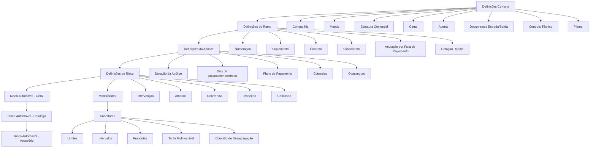

# Definição do Ramo Automóvel no Reef.core: Estrutura de Configuração de Emissão, Riscos e Coberturas

## 1. Metadados do Documento
- **Arquivo de Origem:** Não identificado no texto fornecido
- **Tipo de Documento:** Arquitetura de Software / Guia Funcional de Configuração
- **Domínio / Sistema:** Reef.core — Emissão de seguros no ramo automóvel
- **Público-Alvo:** Analistas funcionais, configuradores de produto, desenvolvedores, arquitetos e operação de seguros
- **Data/Versão Identificada:** Não identificada

---

## 2. Resumo Executivo & Contexto de Negócio

O documento descreve a estrutura de definições necessária para configurar o **ramo automóvel** no sistema **Reef.core**. A organização apresentada é hierárquica: inicia em definições comuns à companhia, passa por definições compartilhadas do ramo, configurações de apólice e risco, catálogos específicos de automóvel e, por fim, definições de cobertura.

O objetivo funcional é permitir que uma seguradora defina as regras, dados mestres, restrições, documentos, intervenientes, valores, modalidades, comissões, tarifas, franquias e condições necessárias para emitir e administrar apólices de seguro automóvel.

A configuração suporta variações por cliente ou colaborador por meio de **contratos** e **subcontratos**. Essas variações podem alterar valores, grupos de valores e condições da definição padrão do ramo, incluindo dias de carência, planos de pagamento, atributos, limites, intervalos, franquias, tarifas e comissões.

O documento também evidencia controles para o ciclo operacional da apólice: emissão, cotação rápida, inspeção, validações técnicas, documentos obrigatórios, anulação por falta de pagamento, revalorização ou depreciação de riscos e cálculo de preços por tarifa multivariável.

> **Nota de Análise:** O material descreve conceitos, níveis de configuração e objetivos funcionais, mas não detalha telas, APIs, contratos JSON, métodos HTTP, persistência, integrações técnicas ou regras de cálculo numéricas.

---

## 3. Arquitetura, Componentes & Tecnologias Envolvidas

Os componentes funcionais identificados estão organizados nos seguintes níveis:

1. **Comum:** definições corporativas reutilizáveis, como companhia, moeda, estrutura comercial, canal, agente, conceito económico, documentos, controlo técnico e integração Platea.
2. **Ramo:** características gerais das apólices do ramo, numeração, suplementos, contratos, subcontratos, carência, cotação rápida, contexto, marcas e documentos.
3. **Apólice:** regras aplicáveis a todos os riscos da apólice, incluindo duração, datas de efeito, moeda, coasseguro, escala, intervenções, cláusulas, textos anexos e planos de pagamento.
4. **Risco:** definições aplicáveis a cada risco segurado, incluindo atributos, ocorrências, modalidades, comissões, inspeções e ramo contabilístico múltiplo.
5. **Risco Automóvel — Geral:** tipos e usos de veículos, matrícula e modalidades permitidas.
6. **Risco Automóvel — Catálogo:** catálogos de características de veículos, marcas, modelos, submodelos e valores por ano.
7. **Risco Automóvel — Acessório:** agrupamentos, tipos e acessórios permitidos por tipo de veículo.
8. **Cobertura:** regras de cobertura, atributos, limites, intervalos, franquias, conceitos de desagregação, tarifas e comissões.



> **Nota de Análise:** O documento cita a integração com **Platea**, mas não especifica o mecanismo de integração, dados trocados, protocolos, autenticação ou responsabilidades do ativo integrado.

---

## 4. Regras de Negócio, Especificações Funcionais & Processos

### 4.1 Definições comuns

- A **companhia** representa a entidade ou entidades com as quais serão criadas as apólices e os demais elementos associados.
- A **moeda** define as divisas utilizadas pelo Reef.core nas operações da companhia.
- A **estrutura comercial** determina a organização territorial da companhia.
- A **estrutura de produto** organiza os ramos comercializados.
- O **canal** define as vias pelas quais a nova produção chega à companhia.
- O **quadro de comissão** define agrupadores que determinam as comissões a pagar aos agentes.
- O **agente** representa terceiros que atuam como intermediários entre o cliente e a companhia.
- O **conceito económico** representa conceitos que compõem a informação económica do recibo.
- Os **documentos de entrada/saída** definem documentos que devem ser gerados em operações e documentos requeridos para executar operações.
- O **controlo técnico** contém parâmetros de validação que permitem ou impedem a finalização de uma operação.
- **Platea** contém definições necessárias para integração com a aplicação Platea.

### 4.2 Definições do ramo

- A **numeração** define os elementos que compõem e a ordem do número de apólice e do número de orçamento.
- O **ramo** fixa características gerais das apólices, tais como dias por ano, coletivos, cláusulas e tipo de apólice temporal.
- O **suplemento** define os tipos de modificações que uma apólice pode sofrer, incluindo anulação, reabilitação e renovação.
- O **contrato** altera a definição do ramo para um ou mais clientes e pode definir valores concretos ou vários valores permitidos.
- O **subcontrato** altera as condições de um contrato e, consequentemente, a definição do ramo. O documento apresenta como exemplo diferentes condições aplicáveis a um grupo empresarial.
- A **apólice grupo** é um conjunto de apólices independentes — individuais, coletivas ou multirriscos — sujeito a alguma exceção de contrato e/ou subcontrato em relação à definição padrão do ramo.
- A **apólice cliente** é uma chave adicional associável a uma apólice para unir diversas apólices de um cliente ou colaborador.
- Os **dias de carência** são adicionados à data de efeito de um recibo para determinar quando a apólice deve seguir para o processo de anulação por falta de pagamento.
- Os **dias de carência de contrato** e os **dias de carência de subcontrato** alteram a definição específica para cliente ou colaborador.
- A **anulação por falta de pagamento** define parâmetros utilizados para determinar quais apólices devem ser anuladas por falta de pagamento.
- A **cotação rápida** devolve o preço de várias simulações com um mínimo de informação requerida do cliente. A configuração determina:
  - quais simulações terão preço;
  - quais informações serão solicitadas;
  - quais informações não serão solicitadas;
  - qual valor será utilizado nas informações não solicitadas para permitir o cálculo do preço.
- O **contexto** permite criar ambientes nos quais determinados atributos não são mostrados.
- A **marca** fixa eventos com um nível de gravidade que pode desencadear ações sobre apólices:
  - ação reativa: a apólice já está em carteira;
  - ação proativa: a apólice ainda não foi criada.

### 4.3 Regras aplicáveis à apólice

- Os **meses de duração mínimo/máximo** definem a quantidade mínima e/ou máxima de meses de vigência permitida para uma apólice.
- Os **dias de adiantamento/atraso** definem quantos dias anteriores ou posteriores à data atual podem ser usados como data de efeito na criação ou alteração de uma apólice.
- A definição de **moeda, decimais e importe mínimo** estabelece:
  - moedas em que apólices podem ser emitidas;
  - impacto sobre capitais, prémios, comissões e recibos;
  - importes mínimos para geração de recibos.
- O **quadro de coasseguro** estabelece previamente as companhias participantes no risco, com conhecimento do cliente, para utilização posterior nas emissões de apólice.
- A **escala** determina a parcela de prémio de uma apólice não anual quando o cálculo não deve ser proporcional ao tempo.
- A **intervenção** define figuras que podem participar na contratação, como tomador, segurado e condutor.
- A **cláusula** estabelece estipulações contratuais que especificam, ampliam, derrogam ou modificam o conteúdo do seguro.
- O **texto anexo** define se estipulações contratuais podem ser incluídas manualmente em uma apólice.
- O **plano de pagamento** define como o pagamento do seguro será fracionado.
- O **plano de pagamento cliente** permite estabelecer planos de pagamento por cliente e aplicá-los mesmo que o ramo não disponha deles.
- A **revalorização/depreciação** define como o valor de um risco é aumentado ou reduzido.

### 4.4 Regras aplicáveis a risco, veículo e cobertura

- O **controlo técnico** pode interromper a contratação ou permitir que uma ou mais pessoas determinem se o seguro é aceitável para a seguradora.
- O **atributo** representa uma característica necessária disponível no Reef.core. O documento exemplifica um atributo para registrar desconto que afeta apólice, risco ou cobertura.
- A **ocorrência** é um conjunto de atributos cuja solicitação é realizada “n” vezes. O exemplo apresentado é o armazenamento, na apólice, de matérias cujo transporte é limitado em quantidade.
- O **ramo contabilístico múltiplo** permite definir ramos contabilísticos pelo conteúdo de algum atributo.
- A **modalidade** é um agrupamento de coberturas comercializado como pacote.
- A **comissão** representa a remuneração por intermediar a contratação do seguro. Existem diferentes tipos de comissão conforme a forma de intervenção do agente, além de exceções.
- A **inspeção** define quando e como inspecionar riscos contratados. As inspeções podem ocorrer antes da contratação ou durante o processo de contratação.
- O **limite** define o importe máximo contratado para o período de vigência do seguro e/ou o importe máximo aplicável por prestação durante o período de vigência. Os importes são pré-fixados.
- O **intervalo** define somas seguradas entre um limite inferior e um limite superior.
- A **franquia** define os valores pelos quais o segurado responde em caso de sinistro. A redução de prémio aplicável pode estar definida na própria franquia.
- O **conceito de desagregação** define o detalhe necessário para separar a informação económica de uma cobertura.
- A **tarifa multivariável** é o meio pelo qual o cálculo é determinado; a definição centra-se no conceito de fator, que é o conceito pelo qual um cálculo é realizado.

---

## 5. Tabelas de Parâmetros, Ambientes e Estruturas de Dados

| Item / Parâmetro | Descrição / Função | Tipo / Valores / Formato | Ambiente / Observações |
| :--- | :--- | :--- | :--- |
| Companhia | Entidade com a qual apólices e demais elementos são criados | Entidade ou entidades | Definição comum |
| Moeda | Divisas usadas nas operações da companhia | Moedas de emissão | Afeta capitais, prémios, comissões e recibos |
| Estrutura comercial | Organização territorial da companhia | Organização territorial | Definição comum |
| Canal | Vias de entrada da nova produção | Canais comerciais | Definição comum |
| Agente | Intermediário entre cliente e companhia | Terceiro intermediário | Definição comum |
| Quadro de comissão | Agrupadores para comissões de agentes | Agrupadores | Definição comum |
| Conceito económico | Informação económica do recibo | Conceitos económicos | Definição comum |
| Controlo técnico | Parâmetros de validação ou aceitabilidade | Condições de validação | Pode impedir finalização ou contratação |
| Numeração | Composição e ordem dos números de apólice e orçamento | Elementos ordenados | Nível de ramo |
| Suplemento | Modificações possíveis na apólice | Anulação, reabilitação, renovação, entre outras | Nível de ramo |
| Contrato | Alteração de definição por cliente | Valores concretos ou grupos de valores | Aplicável a um ou mais clientes |
| Subcontrato | Alteração das condições de contrato | Valores concretos ou grupos de valores | Pode representar condições de grupo empresarial |
| Dias de carência | Dias adicionados ao efeito do recibo | Número de dias | Usado para anulação por falta de pagamento |
| Cotação rápida | Simulações de preço com informação mínima | Simulações, campos solicitados e valores padrão | Nível de ramo |
| Contexto | Ocultação de atributos em ambientes | Atributos a não mostrar | Nível de ramo |
| Marca | Evento com gravidade e ação sobre apólice | Reativa ou proativa | Carteira existente ou apólice ainda não criada |
| Meses duração mínimo/máximo | Limites de vigência da apólice | Quantidade mínima e/ou máxima de meses | Nível de apólice |
| Dias de adiantamento/atraso | Janela permitida para data de efeito | Dias anteriores ou posteriores à data atual | Criação ou modificação de apólice |
| Importe mínimo | Valor mínimo para gerar recibo | Importe mínimo | Nível de apólice |
| Quadro de coasseguro | Companhias participantes no risco | Companhias predefinidas | Utilização posterior em emissão |
| Escala | Parcela de prémio para apólice não anual | Escala de prémio | Quando cálculo não é proporcional ao tempo |
| Intervenção | Figuras participantes da contratação | Tomador, segurado, condutor, entre outros | Apólice e risco |
| Plano de pagamento | Fracionamento do pagamento do seguro | Plano de pagamento | Pode existir por ramo, contrato ou cliente |
| Atributo | Característica necessária disponível no Reef.core | Dados de apólice, risco ou cobertura | Pode ter variações por contrato e subcontrato |
| Ocorrência | Grupo repetível de atributos | Repetição “n” vezes | Exemplo: matérias com limite de transporte |
| Modalidade | Pacote comercial de coberturas | Agrupamento de coberturas | Nível de risco |
| Tipo de veículo | Tipos de veículos seguráveis | Catálogo | Risco automóvel — geral |
| Uso de veículo | Usos permitidos de veículos | Catálogo | Risco automóvel — geral |
| Formato de matrícula | Formato exigido para matrículas | Formato de matrícula | Risco automóvel — geral |
| Tipo de tração | Tipos de tração de veículos | Catálogo | Risco automóvel — catálogo |
| Marca, modelo e submodelo | Identificação comercial de veículos | Catálogos relacionados | Risco automóvel — catálogo |
| Valor de veículo | Valor anual por marca, modelo e submodelo | Valor por ano | Risco automóvel — catálogo |
| Acessório | Acessórios permitidos | Classificados por tipo e agrupamento | Pode variar por tipo de veículo |
| Limite | Máximo contratado ou máximo por prestação | Importes pré-fixados | Cobertura |
| Intervalo | Faixa de soma segurada | Limite inferior e superior | Cobertura |
| Franquia | Valor sob responsabilidade do segurado em sinistro | Quantidade definida | Pode conter redução de prémio |
| Tarifa multivariável | Meio de determinação de cálculo | Fatores de cálculo | Cobertura |

---

## 6. Bateria de Perguntas & Respostas para RAG (FAQ Sintético)

### P1: Qual é a finalidade da definição de ramo automóvel no Reef.core?
**R:** A definição de ramo automóvel no Reef.core organiza os elementos necessários para configurar a emissão e a gestão de seguros automóveis. A estrutura inclui definições comuns, regras do ramo, apólice, risco, catálogos de veículos, acessórios e coberturas.

### P2: O que um contrato pode alterar na definição de um ramo?
**R:** Um contrato pode alterar a definição de um ramo para um ou mais clientes. O contrato pode determinar valores concretos ou vários valores permitidos para condições aplicáveis àquele cliente ou grupo de clientes.

### P3: Qual é a diferença entre contrato e subcontrato?
**R:** O contrato altera a definição do ramo para um ou mais clientes. O subcontrato altera as condições de um contrato e, por consequência, também altera a definição do ramo. O documento cita como exemplo condições específicas para um grupo empresarial.

### P4: Como funciona a cotação rápida?
**R:** A cotação rápida devolve preços para várias simulações usando a menor quantidade possível de informação requerida do cliente. A configuração define as simulações precificadas, os campos solicitados, os campos não solicitados e os valores utilizados nos campos não solicitados.

### P5: Como o Reef.core determina a anulação por falta de pagamento?
**R:** Os dias de carência são adicionados à data de efeito de um recibo para determinar quando ele deve seguir ao processo de anulação por falta de pagamento. A definição de anulação por falta de pagamento contém os parâmetros usados para identificar as apólices que devem ser anuladas.

### P6: Para que servem os contextos na configuração do ramo?
**R:** Os contextos permitem criar ambientes nos quais determinados atributos não são mostrados. O documento não detalha critérios de seleção dos atributos nem mecanismos técnicos de controle de visibilidade.

### P7: O que é uma ocorrência?
**R:** Uma ocorrência é o mesmo conceito de atributo, mas solicitado repetidas vezes, ou “n” vezes. É um conjunto de atributos cuja coleta pode ocorrer diversas vezes; o documento exemplifica matérias cujo transporte é limitado em quantidade.

### P8: Como são configuradas as modalidades no ramo automóvel?
**R:** A modalidade é definida como um agrupamento de coberturas que, juntas, formam um pacote comercializável. O ramo automóvel também permite definir modalidades por ramo e modalidades conforme o tipo e o uso do veículo.

### P9: O que o catálogo de veículos contém?
**R:** O catálogo de veículos inclui tipo de tração, tipo de fabricação, categoria, carroçaria, cor, marcas, modelos, submodelos e valor de veículo por ano, marca, modelo e submodelo.

### P10: Qual é a função da franquia em uma cobertura?
**R:** A franquia estabelece os valores pelos quais o segurado responde em caso de sinistro. O documento informa que a redução de prémio aplicável pode estar definida na própria franquia.

### P11: Como a tarifa multivariável é definida?
**R:** A tarifa multivariável é o meio usado para determinar um cálculo. A definição é centrada no conceito de fator, entendido no documento como o conceito pelo qual um cálculo é realizado.

### P12: Quando uma inspeção pode ser realizada?
**R:** As inspeções dos riscos contratados podem ser realizadas antes da contratação ou durante o processo de contratação. O documento não especifica critérios de obrigatoriedade, responsáveis ou resultados possíveis da inspeção.

---

## 7. Glossário de Termos, Siglas & Conceitos-Chave

- **Reef.core:** Sistema mencionado como responsável por disponibilizar atributos e realizar operações de companhia, apólice, risco, prémio, comissão e recibo.
- **Ramo:** Definição de características gerais das apólices de um produto ou linha de seguros.
- **Apólice:** Contrato de seguro configurado no ramo, sujeito a regras de vigência, pagamento, intervenções, cláusulas e riscos.
- **Risco:** Elemento segurado dentro da apólice; no ramo automóvel, relaciona-se ao veículo e suas características.
- **Cobertura:** Obrigação principal em um contrato de seguro; influencia emissão e prestações.
- **Contrato:** Condição que altera a definição de um ramo para um ou mais clientes.
- **Subcontrato:** Condição que altera um contrato e, consequentemente, a definição do ramo.
- **Suplemento:** Tipo de modificação possível em uma apólice, como anulação, reabilitação ou renovação.
- **Recibo:** Elemento económico associado à apólice; possui efeito utilizado no cálculo da carência.
- **Coasseguro:** Participação prévia de companhias no risco, com conhecimento do cliente.
- **Tomador:** Figura de cliente que pode intervir na contratação.
- **Segurado:** Figura de cliente protegida pelo contrato de seguro.
- **Franquia:** Quantidade pela qual o segurado responde em caso de sinistro.
- **Sinistro:** Evento que aciona uma prestação ou responsabilidade no âmbito do seguro.
- **Tarifa multivariável:** Meio de cálculo baseado em fatores.
- **Platea:** Aplicação ou ativo externo citado como objeto de integração.
- **Ramo contabilístico múltiplo:** Possibilidade de definir ramos contabilísticos conforme o conteúdo de um atributo.

---

## 8. Notas Críticas, Riscos & Limitações

- O documento não identifica arquivo original, autor, data, versão, responsáveis ou ciclo de aprovação.
- O documento não apresenta valores concretos de parâmetros, moedas, escalas, limites, intervalos, tarifas, franquias ou períodos de carência.
- A integração com Platea é citada, mas não há contratos de integração, fluxos de dados, autenticação, tratamento de erro ou responsabilidades definidas.
- Não há detalhamento de métodos HTTP, APIs, formatos de payload, persistência, eventos ou tecnologias de implementação.
- As regras de controlo técnico, aceitação de risco e anulação por falta de pagamento são apresentadas conceitualmente; critérios operacionais específicos não são informados.
- A descrição de tarifação multivariável não apresenta fórmulas, fatores concretos, regras de arredondamento, precedência de regras ou exemplos de cálculo.
- O material indica links “Accede al documento” e “Accede al vídeo”, mas os conteúdos desses documentos e vídeos não foram fornecidos.

---

## 9. Conteúdo Bruto Estruturado (Referência Fiel)

```text
--- [PÁGINAS 1 A 2 DE 15] ---

DEFINICIÓN DE RAMO AUTOMÓVIL
Elementos que intervienen en la definición y orden en el que se debe realizar.

COMÚN
En este nivel se encuentran definiciones que no son exclusivas del módulo de emisión, pero son necesarias para poder realizar la definición.

COMPAÑÍA
Definición de la entidad o entidades con las que se van a crear las pólizas y por consiguiente el resto de elementos.

MONEDA
Definición de las divisas con las que Reef.core va a realizar las distintas operaciones de la compañía.

ESTRUCTURA COMERCIAL
Definición de como se va a establecer la organización territorial de la compañía.

ESTRUCTURA PRODUCTO / RS
Definición de como estarán organizados los ramos que se comercializan.

CANAL
Definición de las distintas vías por las que llegará la nueva producción a la compañía.

CUADRO COMISIÓN
Definición de los agrupadores que determinan las comisiones que se van a pagar a los agentes.

AGENTE
Definición de los terceros que ejercerán de intermediarios entre el cliente y la compañía.

CONCEPTO ECONÓMICO
Definición de los conceptos que formarán parte de la información económica del recibo.

DOCUMENTOS DE ENTRADA/SALIDA
Definición de los documentos que deben salir cuando se realiza una operación y de los documentos que son necesarios solicitar cuando se realiza una operación.

CONTROL TÉCNICO
Definición de los parámetros necesarios para realizar validaciones que permitan o no finalizar la operación.

PLATEA
Definición necesaria para la integración con esta aplicación.

--- [PÁGINAS 3 A 4 DE 15] ---

RAMO
Son definiciones que siendo del módulo de emisión, no son exclusivas del ramo que se está definiendo.

NUMERACIÓN
Determinar que elementos formarán y en que orden el número de póliza y el número de presupuesto.

RAMO
Fija las características generales con las que contarán las pólizas, como días por año, colectivos, cláusulas, tipo de póliza temporal, etc.

SUPLEMENTO
Tipos de modificaciones que podrán sufrir las pólizas: anulación, rehabilitación, renovación, etc.

CONTRATO
Condiciones que alteran la definición de un ramo. Estas condiciones aplican siempre a uno o varios clientes. También se pueden determinar valores concretos o varios valores permitidos.

SUBCONTRATO
Condiciones que alteran las condiciones de un contrato y, por consiguiente alteran la definición de un ramo. Un ejemplo puede ser las distintas condiciones que rigen a un grupo empresarial. Al igual que el contrato, se pueden determinar valores o grupos de valores posibles.

PÓLIZA GRUPO
Conjunto de pólizas independientes. Estas pueden ser individuales, colectivas o multiriesgo. Siempre el conjunto está sujeto a algún tipo de excepción — contrato y/o subcontrato — sobre la definición del ramo estándar.

PÓLIZA CLIENTE
Clave adicional que puede asociarse a una póliza y que puede unir varias pólizas de un cliente o colaborador.

DÍAS DE GRACIA
Número de días que se adicionan al efecto de un recibo para determinar que debe pasar al proceso de anulación por falta de pago.

DÍAS DE GRACIA CONTRATO / SUBCONTRATO
Alteración de la definición específica para un cliente o colaborador.

ANULACIÓN FALTA PAGO
Parámetros que tendrá en cuenta este proceso a la hora de determinar qué pólizas deben anularse por falta de pago.

COTIZACIÓN RÁPIDA
Proceso que devuelve el precio de varias simulaciones con un mínimo de información requerida al cliente. Se definen simulaciones, información solicitada, información no solicitada y valores para la información no solicitada.

CONTEXTO
Se pueden crear entornos en los que determinar que información — atributos — no mostrar.

MARCA
Fijar eventos con un nivel de gravedad que puede desencadenar acciones sobre pólizas. Las acciones pueden ser reactivas — la póliza ya está en cartera — o proactivas — la póliza aún no ha sido creada.

--- [PÁGINAS 5 A 7 DE 15] ---

PÓLIZA
En este nivel se encuentran definiciones que afectarán a todos los posibles riesgos de la póliza.

MESES DURACIÓN MÍNIMO/MÁXIMO
Se fija el número máximo y/o mínimo de meses de vigencia que una póliza puede disponer.

DÍAS DE ADELANTO/ATRASO
Con cuantos días previos o posteriores al día de hoy se puede fijar el efecto en la creación o modificación de una póliza.

MONEDA, DECIMALES E IMPORTE MÍNIMO
Determina las posibles monedas en las que se emitirán las pólizas. Afecta a capitales, primas, comisiones y recibos.
Se establecen los importes mínimos para generar un recibo.

CUADRO COASEGURO
Se establecen de forma previa aquellas compañías que participarán en el riesgo con el conocimiento del cliente. Esta definición previa es para uso posterior en las emisiones de póliza.

ESCALA
Se establece cual será la porción de prima cuando una póliza no es anual y no se desea que el cálculo sea proporcional al tiempo.

INTERVENCIÓN
Definición de aquellas figuras que podrán intervenir en la contratación. Estas figuras se refieren a clientes y son del tipo tomador, asegurado, conductor, etc.

CLÁUSULA
Establecer diferentes estipulaciones contractuales que precisan, amplían, derogan o modifican el contenido del seguro.

TEXTO ANEXO
Fijar si es posible incluir de forma manual en una póliza diferentes estipulaciones contractuales.

PLAN DE PAGO
Definir como se va a fraccionar el pago del seguro.

PLAN DE PAGO CLIENTE
Establecer planes de pago por cliente y aplicarlos aunque el ramo no disponga de él.

REVALORIZACIÓN/DEPRECIACIÓN
Fijar como se incrementa o decrementa el valor de un riesgo.

--- [PÁGINAS 8 A 11 DE 15] ---

ATRIBUTO
Son características que sea necesario disponer y de las que Reef.core dispone; por ejemplo, disponer de un lugar donde se registre un descuento que afecta a la póliza o al riesgo.

OCURRENCIA
Es el mismo concepto de atributo, pero la solicitud de esos atributos se realiza “n” veces. Es decir, es un conjunto de atributos cuya petición se realiza varias veces.

RIESGO
Definiciones que afectan a cada uno de los posibles riesgos de la póliza.

RAMO CONTABLE MULTIPLE
Posibilidad de definir ramos contables por el contenido de algún atributo.

MODALIDAD
Agrupación de coberturas que juntas se convierten en un paquete a comercializar.

COMISIÓN
Establecer la remuneración por intermediar en la contratación de un seguro. Existen distintos tipos de comisiones dependiendo de como interviene el agente, así como excepciones.

INSPECCIÓN
Definición de cuando y como realizar inspecciones a los riesgos contratados. Las inspecciones pueden ser previas a la contratación o en el proceso de contratación.

RIESGO AUTOMÓVIL - GENERAL
En este nivel se encuentran definiciones generales que son necesarias para ramos de automóvil:
- Tipo de vehículo.
- Uso de vehículo.
- Tipo de vehículo por uso.
- Formato de matrícula.
- Modalidad por ramo.
- Modalidad por tipo y uso de vehículo.

RIESGO AUTOMÓVIL - CATÁLOGO
Son definiciones de los distintos catálogos de datos de vehículo:
- Tipo de tracción.
- Tipo de fabricación.
- Categoría.
- Carrocería.
- Color.
- Marcas de vehículo.
- Modelos de vehículo.
- Submodelos de vehículo.
- Valor de vehículo por año, marca, modelo y submodelo.

RIESGO AUTOMÓVIL - ACCESORIO
En este nivel se encuentran definiciones de accesorios de automóvil:
- Agrupamiento de accesorio.
- Tipo de accesorio.
- Accesorio.
- Accesorio por tipo de vehículo.

--- [PÁGINAS 12 A 15 DE 15] ---

COBERTURA
Definiciones que afectan a cada una de las coberturas definidas.

COBERTURA
Obligación principal en un contrato de seguro. Existen diversos tipos de cobertura que determinan el comportamiento tanto en el proceso de emisión, como en el proceso de prestaciones.

ATRIBUTO
Son características que sea necesario disponer y de las que Reef.core dispone, por ejemplo disponer de un lugar donde se registre un descuento que afecta a la cobertura.

OCURRENCIA
Es el mismo concepto de atributo, pero la solicitud de esos atributos se realiza “n” veces.

LÍMITE
Estipulación del importe máximo contratado por el periodo de vigencia del seguro y/o importe máximo aplicable por cada una de las prestaciones realizadas durante el periodo de vigencia. Estos importes están prefijados.

INTERVALO
Establecimiento de sumas aseguradas entre dos límites, uno inferior y otro superior.

FRANQUICIA
Establecer las cantidades por las que el asegurado responde en caso de siniestro. Existe la posibilidad que la reducción de la prima a aplicar se encuentre definida en la propia franquicia.

CONCEPTO DESGLOSE
Definición del detalle necesario de segregación de la información económica de una cobertura.

TARIFA MULTIVARIABLE
Medio por el que se determina el cálculo. La definición se centra en el concepto factor, que es el concepto por el que se realiza un cálculo.

Las siguientes definiciones admiten alteración específica para cliente o colaborador mediante contrato y/o subcontrato según se indica en el documento:
- Documentos de entrada/salida.
- Meses de duración mínimo/máximo.
- Días de adelanto/atraso.
- Intervención.
- Plan de pago.
- Atributo.
- Límite.
- Intervalo.
- Franquicia.
- Tarifa multivariable.
- Comisión.
```
