# Definição de Ramo Vida no Reef.core — Estrutura de Configuração de Apólices, Riscos e Coberturas

## 1. Metadados do Documento
- **Arquivo de Origem:** Não informado
- **Tipo de Documento:** Apresentação Executiva
- **Domínio / Sistema:** Reef.core — definição de ramos de seguros, emissão, apólices, riscos e coberturas
- **Público-Alvo:** Desenvolvedores, Arquitetos, Operação e Negócio
- **Data/Versão Identificada:** Não identificada

---

## 2. Resumo Executivo & Contexto de Negócio

O documento descreve os elementos de parametrização necessários para a definição de um ramo de seguros no sistema Reef.core. O conteúdo organiza essas definições em camadas funcionais: elementos comuns à companhia, elementos do ramo, configurações de apólice, configurações por risco e definições específicas de cobertura.

A estrutura apresentada busca sustentar a criação e a operação de apólices de seguro, determinando características como companhia, moeda, estrutura comercial, canal, agentes, comissões, documentos, controles técnicos, numeração, contratos, subcontratos, prazos, pagamento, intervenções, atributos, modalidades, tarifas e limites.

O documento enfatiza que contratos e subcontratos permitem alterar a configuração padrão de um ramo para clientes, colaboradores ou grupos empresariais específicos. Essa capacidade de exceção aparece em múltiplos níveis da modelagem, incluindo dias de graça, planos de pagamento, atributos, intervenções, tarifas, franquias, intervalos e documentos.

A configuração também inclui mecanismos operacionais para validação e governança de subscrição. Controles técnicos podem paralisar a contratação ou exigir que uma ou mais pessoas determinem se um seguro é assumível pela seguradora. Marcas podem registrar eventos com nível de gravidade e acionar ações reativas sobre apólices já existentes ou proativas antes da criação da apólice.

**Nota de Análise:** embora o título extraído indique “Definición de Ramo Vida”, a página 7 afirma que determinadas definições exclusivas de “VIDA” são para ramos do tipo negócio automóvel, citando matrículas, marcas e modelos. O documento não explica essa aparente inconsistência terminológica.

---

## 3. Arquitetura, Componentes & Tecnologias Envolvidas

O documento não apresenta arquitetura técnica de infraestrutura, integrações por protocolo, contratos de API, bancos de dados, URLs, ambientes, portas ou versões de tecnologia. A arquitetura recuperável é uma arquitetura funcional de parametrização do Reef.core.

Os principais componentes e níveis funcionais identificados são:

- **Comum:** definições transversais necessárias para configurar a companhia e operar o ramo.
- **Ramo:** definições do módulo de emissão que não são exclusivas de um ramo individual.
- **Apólice:** definições aplicáveis a todos os riscos possíveis de uma apólice.
- **Risco:** definições aplicáveis a cada risco existente em uma apólice.
- **Cobertura:** definições aplicáveis a cada cobertura configurada.
- **Contrato e Subcontrato:** mecanismos de exceção e alteração da definição padrão do ramo.
- **Platea:** ativo ou aplicação integrada ao Reef.core; o documento não detalha o modelo de integração.
- **Controle Técnico:** mecanismo de validação e decisão sobre a continuidade da contratação.
- **Documentos de Entrada/Saída:** configuração de documentos gerados e exigidos durante operações de seguro.

```mermaid
graph TD
    RC[Reef.core<br/>Definição de Ramo] --> COM[Comum]
    RC --> RAMO[Ramo]
    RC --> POL[Apólice]
    RC --> RISCO[Risco]
    RC --> COB[Cobertura]

    COM --> COMP[Companhia]
    COM --> MOEDA[Moeda]
    COM --> EC[Estrutura Comercial]
    COM --> EP[Estrutura Produto]
    COM --> CANAL[Canal]
    COM --> QC[Quadro Comissão]
    COM --> AG[Agente]
    COM --> CE[Conceito Económico]
    COM --> DOC[Documentos de Entrada/Saída]
    COM --> CT[Controle Técnico]
    COM --> PLATEA[Platea]

    RAMO --> NUM[Numeração]
    RAMO --> RG[Características Gerais do Ramo]
    RAMO --> SUP[Suplemento]
    RAMO --> CONTRATO[Contrato]
    CONTRATO --> SUB[Subcontrato]
    RAMO --> PG[Apólice Grupo]
    RAMO --> PC[Apólice Cliente]
    RAMO --> DG[Dias de Graça]
    RAMO --> AFP[Anulação por Falta de Pagamento]
    RAMO --> CR[Cotização Rápida]
    RAMO --> CONTEXTO[Contexto]
    RAMO --> MARCA[Marca]

    POL --> DUR[Meses de Duração]
    POL --> DATA[Dias de Adiantamento/Atraso]
    POL --> MDI[Moeda, Decimais e Importe Mínimo]
    POL --> COAS[Quadro Coasseguro]
    POL --> ESC[Escala]
    POL --> INT[Intervenção]
    POL --> CLA[Cláusula]
    POL --> TEXTO[Texto Anexo]
    POL --> PP[Plano de Pagamento]
    POL --> REVAL[Revalorização/Depreciação]
    POL --> ATRP[Atributo]
    POL --> OCP[Ocorrência]

    RISCO --> INTR[Intervenção]
    RISCO --> ATRR[Atributo]
    RISCO --> OCR[Ocorrência]
    RISCO --> RCM[Ramo Contábil Múltiplo]
    RISCO --> MOD[Modalidade]
    RISCO --> COMIS[Comissão]
    RISCO --> INS[Inspeção]

    COB --> COBDEF[Definição de Cobertura]
    COB --> ATRC[Atributo]
    COB --> OCC[Ocorrência]
    COB --> LIM[Limite]
    COB --> INTERV[Intervalo]
    COB --> FRAN[Franquia]
    COB --> CD[Conceito Desglose]
    COB --> TM[Tarifa Multivariável]

    CONTRATO -. altera definição específica .-> RAMO
    SUB -. altera condições do contrato .-> CONTRATO
```



**Nota de Análise:** o documento lista a integração com **Platea**, mas não especifica interfaces, eventos, autenticação, protocolos, métodos HTTP, formatos de mensagem ou responsabilidades técnicas do ativo integrado.

---

## 4. Regras de Negócio, Especificações Funcionais & Processos

### 4.1. Definições comuns

1. **Companhia**
   - Define a entidade ou as entidades com as quais as apólices serão criadas.
   - A definição da companhia também sustenta a criação dos demais elementos associados às apólices.

2. **Moeda**
   - Define as divisas utilizadas pelo Reef.core nas diferentes operações da companhia.

3. **Estrutura comercial**
   - Define como será estabelecida a organização territorial da companhia.

4. **Estrutura de produto**
   - Define como os ramos comercializados serão organizados.

5. **Canal**
   - Define as vias pelas quais a nova produção chegará à companhia.

6. **Quadro de comissão**
   - Define agrupadores que determinam as comissões a pagar aos agentes.

7. **Agente**
   - Define os terceiros que atuarão como intermediários entre o cliente e a companhia.

8. **Conceito económico**
   - Define os conceitos que farão parte da informação económica do recibo.

9. **Documentos de entrada/saída**
   - Define documentos que devem ser produzidos quando uma operação é realizada.
   - Define documentos que devem ser solicitados para permitir a realização de uma operação.

10. **Controle técnico**
    - Define parâmetros necessários para executar validações que permitam ou impeçam a finalização de uma operação.

11. **Platea**
    - Contém definições necessárias ou relacionadas à integração com a aplicação ou ativo Platea.
    - O documento não apresenta detalhamento técnico adicional sobre essa integração.

### 4.2. Regras e definições no nível de ramo

1. **Numeração**
   - Determina quais elementos formarão o número de apólice e o número de orçamento.
   - Determina a ordem desses elementos.

2. **Ramo**
   - Fixa características gerais das apólices.
   - Exemplos explicitamente citados: dias por ano, coletivos, cláusulas e tipo de apólice temporal.

3. **Suplemento**
   - Define os tipos de modificações que as apólices podem sofrer.
   - Exemplos: anulação, reabilitação e renovação.

4. **Contrato**
   - Define condições que alteram a definição de um ramo.
   - As condições de contrato aplicam-se sempre a um ou vários clientes.
   - Permite determinar valores concretos ou diversos valores permitidos.

5. **Subcontrato**
   - Define condições que alteram as condições de um contrato e, consequentemente, alteram a definição de um ramo.
   - Pode representar condições específicas aplicáveis a um grupo empresarial.
   - Permite determinar valores concretos ou grupos de valores possíveis.

6. **Apólice grupo**
   - Representa um conjunto de apólices independentes.
   - As apólices podem ser individuais, coletivas ou multirriscos.
   - O conjunto de apólices está sempre sujeito a algum tipo de exceção, por contrato e/ou subcontrato, em relação à definição padrão do ramo.

7. **Apólice cliente**
   - É uma chave adicional associável a uma apólice.
   - Pode unir várias apólices de um cliente ou colaborador.

8. **Dias de graça**
   - Define a quantidade de dias adicionada ao efeito de um recibo.
   - A quantidade de dias é usada para determinar quando uma apólice deve seguir ao processo de anulação por falta de pagamento.

9. **Dias de graça contrato e dias de graça subcontrato**
   - Alteram a definição específica de dias de graça para um cliente ou colaborador.

10. **Anulação por falta de pagamento**
    - Define os parâmetros considerados pelo processo que determina quais apólices devem ser anuladas por falta de pagamento.

11. **Cotização rápida**
    - Processo que retorna o preço de várias simulações utilizando um mínimo de informações requeridas do cliente.
    - Define:
      - quais simulações serão utilizadas para precificação;
      - quais informações serão solicitadas;
      - quais informações não serão solicitadas;
      - o valor utilizado na precificação para informações não solicitadas.

12. **Contexto**
    - Permite criar ambientes nos quais determinados atributos não devem ser exibidos.

13. **Marca**
    - Define eventos com um nível de gravidade.
    - Uma marca pode desencadear ações sobre apólices:
      - **Reativas:** quando a apólice já está em carteira.
      - **Proativas:** quando a apólice ainda não foi criada.

14. **Documentos de entrada/saída por contrato**
    - Altera a definição específica de documentos para um cliente ou colaborador.

### 4.3. Regras e definições no nível de apólice

1. **Meses de duração mínimo/máximo**
   - Define o número mínimo e/ou máximo de meses de vigência permitido para uma apólice.

2. **Meses de duração mínimo/máximo contrato**
   - Altera a configuração de duração para um cliente ou colaborador.

3. **Dias de adiantamento/atraso**
   - Define quantos dias antes ou depois da data atual podem ser usados para estabelecer a data de efeito na criação ou modificação de uma apólice.

4. **Dias de adiantamento/atraso contrato**
   - Altera essa definição para um cliente ou colaborador.

5. **Moeda, decimais e importe mínimo**
   - Define as moedas possíveis para emissão de apólices.
   - Afeta capitais, prémios, comissões e recibos.

6. **Importe mínimo**
   - Define os valores mínimos necessários para gerar um recibo.

7. **Quadro de coasseguro**
   - Define previamente as companhias que participarão de um risco com conhecimento do cliente.
   - Essa definição prévia será usada posteriormente nas emissões de apólice.

8. **Escala**
   - Define a porção de prémio para uma apólice não anual quando não se deseja cálculo proporcional ao tempo.

9. **Intervenção**
   - Define figuras que podem intervir na contratação.
   - As figuras são clientes e podem incluir tomador, segurado, condutor e outras figuras não detalhadas.

10. **Intervenção contrato**
    - Altera a definição de intervenção para um cliente ou colaborador.

11. **Cláusula**
    - Estabelece estipulações contratuais que precisam, ampliam, derrogam ou modificam o conteúdo do seguro.

12. **Texto anexo**
    - Define se é possível incluir manualmente em uma apólice estipulações contratuais que precisam, ampliam, derrogam ou modificam o conteúdo do seguro.

13. **Plano de pagamento**
    - Define como o pagamento do seguro será fracionado.

14. **Plano de pagamento contrato**
    - Altera o plano de pagamento para um cliente ou colaborador.

15. **Plano de pagamento cliente**
    - Permite estabelecer planos de pagamento por cliente.
    - Permite aplicar esses planos mesmo quando o ramo não dispõe de um plano de pagamento.

16. **Revalorização/depreciação**
    - Define como o valor de um risco será incrementado ou reduzido.

17. **Controle técnico no nível de apólice**
    - Define condições que podem paralisar a contratação.
    - Pode determinar que uma ou mais pessoas avaliem se o seguro é assumível pela seguradora.

18. **Atributo**
    - Representa características necessárias para a operação e disponíveis no Reef.core.
    - Exemplo citado: local onde é registrado um desconto que afeta a apólice.

19. **Atributo contrato e atributo subcontrato**
    - Alteram a definição de atributo para cliente ou colaborador.

20. **Controle técnico atributo**
    - Configura condições de controle técnico aplicáveis a atributos.

21. **Ocorrência**
    - É o mesmo conceito de atributo, mas a solicitação dos atributos ocorre “n” vezes.
    - Uma ocorrência é um conjunto de atributos cuja solicitação pode ser repetida.
    - Exemplo citado: armazenamento, na apólice, de uma série de matérias cujo transporte é limitado em quantidade.

### 4.4. Regras e definições no nível de risco

1. **Risco**
   - Agrupa definições que afetam cada um dos riscos possíveis de uma apólice.

2. **Vida**
   - O documento afirma que contém definições exclusivas para ramos do tipo negócio automóvel.
   - Exemplos citados: definição de matrículas, marcas e modelos.
   - Não há explicação adicional para a associação entre “Vida” e negócio automóvel.

3. **Intervenção, atributo, ocorrência e controle técnico atributo**
   - Aplicam-se também ao risco, com a mesma finalidade geral apresentada no nível de apólice.
   - O exemplo de atributo no risco é o registro de um desconto que afeta o risco.

4. **Ramo contábil múltiplo**
   - Permite definir ramos contábeis pelo conteúdo de algum atributo.

5. **Modalidade**
   - É uma agrupação de coberturas que, em conjunto, constitui um pacote comercializável.

6. **Cláusula e texto anexo**
   - Aplicam-se ao risco para definir ou incluir estipulações contratuais.

7. **Comissão**
   - Define a remuneração pela intermediação na contratação de um seguro.
   - Existem tipos diferentes de comissão, dependendo de como o agente intervém.
   - Existem exceções, sem detalhamento adicional.

8. **Comissão contrato**
   - Altera a definição específica de comissão para cliente ou colaborador.

9. **Inspeção**
   - Define quando e como realizar inspeções sobre riscos contratados.
   - As inspeções podem ocorrer antes da contratação ou durante o processo de contratação.

### 4.5. Regras e definições no nível de cobertura

1. **Cobertura**
   - É a obrigação principal em um contrato de seguro.
   - Existem diversos tipos de cobertura.
   - Os tipos de cobertura determinam comportamentos tanto no processo de emissão quanto no processo de prestações.

2. **Contrato e subcontrato**
   - Alteram a definição de ramo e podem afetar as condições aplicáveis às coberturas.

3. **Controle técnico**
   - Define condições que podem paralisar a contratação ou exigir decisão sobre a assumibilidade do seguro pela seguradora.

4. **Atributo**
   - Representa características necessárias disponíveis no Reef.core.
   - Exemplo citado: local de registro de desconto que afeta a cobertura.

5. **Atributo contrato e atributo subcontrato**
   - Alteram a definição do atributo para cliente ou colaborador.

6. **Ocorrência**
   - Representa atributos solicitados repetidamente, “n” vezes.

7. **Limite**
   - Define o importe máximo contratado para o período de vigência do seguro e/ou o importe máximo aplicável por cada prestação realizada durante a vigência.
   - Os importes são pré-fixados.

8. **Limite contrato**
   - Altera a definição de limite para cliente ou colaborador.

9. **Intervalo**
   - Estabelece somas seguradas entre dois limites: um inferior e um superior.

10. **Intervalo contrato e intervalo subcontrato**
    - Alteram a definição de intervalo para cliente ou colaborador.

11. **Franquia**
    - Define os valores pelos quais o segurado responde em caso de sinistro.
    - A redução de prémio aplicável pode estar definida na própria franquia.

12. **Franquia contrato**
    - Altera a definição de franquia para cliente ou colaborador.

13. **Conceito desglose**
    - Define o detalhamento necessário para segregação da informação económica de uma cobertura.

14. **Tarifa multivariável**
    - É o meio usado para determinar o cálculo.
    - A definição centra-se no conceito de fator, que é o conceito pelo qual o cálculo é realizado.

15. **Tarifa multivariável contrato e tarifa multivariável subcontrato**
    - Alteram a definição da tarifa para cliente ou colaborador.

16. **Cláusula, comissão e comissão contrato**
    - Aplicam-se também no nível de cobertura, conforme as definições gerais apresentadas.

---

## 5. Tabelas de Parâmetros, Ambientes e Estruturas de Dados

| Item / Parâmetro | Descrição / Função | Tipo / Valores / Formato | Ambiente / Observações |
| :--- | :--- | :--- | :--- |
| Companhia | Define entidades com as quais são criadas apólices e demais elementos. | Entidade ou entidades | Nível comum |
| Moeda | Define divisas usadas pelo Reef.core nas operações da companhia. | Divisas não especificadas | Nível comum |
| Estrutura comercial | Define a organização territorial da companhia. | Organização territorial | Nível comum |
| Estrutura de produto | Define a organização dos ramos comercializados. | Organização de ramos | Nível comum |
| Canal | Define vias de chegada de nova produção à companhia. | Canais não especificados | Nível comum |
| Quadro de comissão | Define agrupadores que determinam comissões de agentes. | Agrupadores | Nível comum |
| Agente | Define intermediários entre cliente e companhia. | Terceiros intermediários | Nível comum |
| Conceito económico | Define conceitos da informação económica do recibo. | Conceitos económicos | Nível comum |
| Documentos de entrada/saída | Define documentos gerados e exigidos em operações. | Documentos de operação | Nível comum, ramo e contrato |
| Controle técnico | Define validações que permitem ou impedem finalizar uma operação. | Parâmetros e condições | Comum, apólice, risco e cobertura |
| Platea | Define elementos relacionados à integração com Platea. | Não especificado | Sem detalhes técnicos |
| Numeração | Determina elementos e ordem do número de apólice e orçamento. | Elementos ordenados | Nível ramo |
| Ramo | Fixa características gerais das apólices. | Dias por ano, coletivos, cláusulas, tipo temporal | Nível ramo |
| Suplemento | Define modificações permitidas em apólices. | Anulação, reabilitação, renovação | Nível ramo |
| Contrato | Altera a definição de ramo para um ou vários clientes. | Valores concretos ou valores permitidos | Mecanismo de exceção |
| Subcontrato | Altera condições de contrato e, consequentemente, do ramo. | Valores ou grupos de valores | Pode representar grupo empresarial |
| Apólice grupo | Conjunto de apólices independentes sujeito a exceções. | Individual, coletiva ou multirriscos | Associada a contrato/subcontrato |
| Apólice cliente | Chave adicional para unir apólices de cliente ou colaborador. | Chave adicional | Nível ramo |
| Dias de graça | Dias adicionados ao efeito de recibo para determinar anulação por falta de pagamento. | Número de dias | Possui variações por contrato e subcontrato |
| Anulação por falta de pagamento | Determina quais apólices devem ser anuladas por falta de pagamento. | Parâmetros não especificados | Nível ramo |
| Cotização rápida | Precifica várias simulações com mínimo de informação do cliente. | Simulações, dados solicitados e valores padrão | Nível ramo |
| Contexto | Define ambientes onde atributos não são exibidos. | Ambientes e atributos | Nível ramo |
| Marca | Define eventos com gravidade que desencadeiam ações sobre apólices. | Reativa ou proativa | Nível ramo |
| Meses de duração mínimo/máximo | Define prazo mínimo e/ou máximo de vigência de uma apólice. | Número de meses | Nível apólice |
| Dias de adiantamento/atraso | Define janela antes/depois da data atual para fixar efeito de criação ou modificação. | Número de dias | Nível apólice |
| Moeda, decimais e importe mínimo | Define moedas de emissão e afeta capitais, prémios, comissões e recibos. | Moeda, decimais, importe mínimo | Nível apólice |
| Importe mínimo | Define o valor mínimo para gerar um recibo. | Valor não especificado | Nível apólice |
| Quadro de coasseguro | Define previamente companhias participantes em um risco. | Companhias participantes | Uso posterior em emissão |
| Escala | Define porção de prémio em apólices não anuais sem proporcionalidade temporal. | Escala não especificada | Nível apólice |
| Intervenção | Define figuras de clientes na contratação. | Tomador, segurado, condutor e outras | Apólice e risco |
| Cláusula | Define estipulações que precisam, ampliam, derrogam ou modificam o seguro. | Estipulações contratuais | Apólice, risco e cobertura |
| Texto anexo | Define inclusão manual de estipulações na apólice. | Inclusão manual permitida ou não | Apólice e risco |
| Plano de pagamento | Define fracionamento do pagamento do seguro. | Plano não especificado | Possui variação por contrato e cliente |
| Plano de pagamento cliente | Permite plano por cliente mesmo sem plano no ramo. | Plano de pagamento | Nível apólice |
| Revalorização/depreciação | Define incremento ou redução do valor de um risco. | Regras não especificadas | Nível apólice |
| Atributo | Característica necessária disponível no Reef.core. | Dados ou campos não especificados | Apólice, risco e cobertura |
| Ocorrência | Conjunto de atributos solicitado repetidamente. | Repetição “n” vezes | Apólice, risco e cobertura |
| Ramo contábil múltiplo | Permite definir ramos contábeis pelo conteúdo de atributo. | Conteúdo de atributo | Nível risco |
| Modalidade | Agrupa coberturas em pacote comercializável. | Agrupação de coberturas | Nível risco |
| Comissão | Define remuneração pela intermediação de seguro. | Tipos conforme intervenção do agente; exceções | Risco e cobertura |
| Inspeção | Define quando e como inspecionar riscos contratados. | Prévia ou durante contratação | Nível risco |
| Cobertura | Obrigação principal de contrato de seguro. | Tipos não especificados | Nível cobertura |
| Limite | Define importe máximo por vigência e/ou prestação. | Importes pré-fixados | Nível cobertura |
| Intervalo | Define soma segurada entre limite inferior e superior. | Dois limites | Nível cobertura |
| Franquia | Define montante sob responsabilidade do segurado em sinistro. | Pode incluir redução de prémio | Nível cobertura |
| Conceito desglose | Define detalhamento para segregação económica da cobertura. | Estrutura de detalhe não especificada | Nível cobertura |
| Tarifa multivariável | Determina cálculo centrado no conceito de fator. | Fator de cálculo | Nível cobertura |

---

## 6. Bateria de Perguntas & Respostas para RAG (FAQ Sintético)

### P1: Qual é o objetivo da definição de ramo no Reef.core?
**R:** A definição de ramo no Reef.core organiza as parametrizações necessárias para criar e operar apólices de seguro. O modelo inclui definições comuns, características do ramo, regras de apólice, regras de risco, regras de cobertura e mecanismos de exceção por contrato e subcontrato.

### P2: Como contratos e subcontratos alteram a definição padrão de um ramo?
**R:** Um contrato contém condições que alteram a definição de um ramo para um ou vários clientes e pode estabelecer valores concretos ou diversos valores permitidos. Um subcontrato altera as condições de um contrato e, consequentemente, a definição do ramo; o documento cita como exemplo condições aplicáveis a um grupo empresarial. Ambos aparecem como mecanismos de alteração específica para diversos elementos, como atributos, tarifas, franquias, intervalos, planos de pagamento e dias de graça.

### P3: O que são dias de graça e como eles se relacionam com anulação por falta de pagamento?
**R:** Dias de graça são a quantidade de dias adicionada ao efeito de um recibo para determinar quando uma apólice deve entrar no processo de anulação por falta de pagamento. O processo de anulação por falta de pagamento usa parâmetros para determinar quais apólices devem ser anuladas. O documento também prevê alterações de dias de graça por contrato e por subcontrato.

### P4: O que a cotização rápida configura no Reef.core?
**R:** A cotização rápida é um processo que retorna o preço de várias simulações usando um mínimo de informação requerida do cliente. A configuração define as simulações utilizadas para cálculo de preço, os dados solicitados ao cliente, os dados que não serão solicitados e os valores que devem ser considerados para os dados não solicitados.

### P5: Qual é a finalidade do controle técnico?
**R:** O controle técnico define condições e parâmetros de validação que podem permitir ou impedir a finalização de uma operação. Em níveis de apólice, risco ou cobertura, o controle técnico pode paralisar a contratação ou exigir que uma ou mais pessoas determinem se o seguro é assumível pela seguradora.

### P6: Qual é a diferença entre atributo e ocorrência?
**R:** Um atributo é uma característica necessária disponível no Reef.core, como o local de registro de um desconto que afeta apólice, risco ou cobertura. Uma ocorrência é o mesmo conceito de atributo quando a solicitação deve ser repetida “n” vezes, constituindo um conjunto de atributos solicitado diversas vezes. O documento exemplifica ocorrência com o armazenamento de matérias cujo transporte possui limitação de quantidade.

### P7: Como o documento define plano de pagamento?
**R:** O plano de pagamento define como o pagamento do seguro será fracionado. Há alterações por contrato e uma configuração de plano de pagamento por cliente. O plano de pagamento cliente pode ser aplicado mesmo quando o ramo não dispõe de um plano de pagamento próprio.

### P8: O que é uma modalidade no nível de risco?
**R:** Modalidade é uma agrupação de coberturas que, reunidas, se convertem em um pacote a ser comercializado. O documento não detalha critérios de elegibilidade, regras de preço ou limites específicos para modalidades.

### P9: Como são definidos limites, intervalos e franquias de cobertura?
**R:** O limite define o importe máximo contratado no período de vigência do seguro e/ou o importe máximo aplicável a cada prestação durante a vigência; os importes são pré-fixados. O intervalo define somas seguradas entre um limite inferior e um superior. A franquia estabelece os valores pelos quais o segurado responde em caso de sinistro e pode conter a redução de prémio aplicável. Limites, intervalos e franquias possuem variações por contrato; intervalos também possuem variação por subcontrato.

### P10: Qual é o papel da tarifa multivariável?
**R:** A tarifa multivariável é o meio usado para determinar um cálculo. A definição está centrada no conceito de fator, que é o conceito pelo qual o cálculo é realizado. O documento prevê tarifas multivariáveis específicas por contrato e por subcontrato, mas não informa fórmulas, fatores concretos ou regras matemáticas.

### P11: Como documentos de entrada e saída são usados em operações de seguro?
**R:** Documentos de entrada e saída definem documentos que devem acompanhar ou ser gerados por uma operação e documentos que devem estar disponíveis para permitir a operação. O documento apresenta o exemplo de geração de documentos durante a emissão de uma nova apólice e de exigência de carteira de habilitação para emitir uma apólice de automóvel.

### P12: Para que servem as marcas no processo de seguro?
**R:** Marcas permitem fixar eventos com nível de gravidade que podem desencadear ações sobre apólices. Essas ações podem ser reativas, quando a apólice já está em carteira, ou proativas, quando a apólice ainda não foi criada.

---

## 7. Glossário de Termos, Siglas & Conceitos-Chave

- **Reef.core:** Sistema citado como responsável por realizar operações da companhia e disponibilizar atributos necessários à configuração de seguros.
- **Ramo:** Nível de definição que fixa características gerais das apólices e organiza configurações relacionadas à emissão.
- **Apólice:** Contrato de seguro cujas definições podem abranger vigência, moeda, pagamento, intervenções, cláusulas e atributos.
- **Risco:** Elemento da apólice ao qual podem ser aplicadas intervenções, atributos, ocorrências, modalidades, comissões e inspeções.
- **Cobertura:** Obrigação principal em um contrato de seguro; seus tipos influenciam emissão e prestações.
- **Contrato:** Conjunto de condições que altera a definição de um ramo para um ou vários clientes.
- **Subcontrato:** Conjunto de condições que altera um contrato e, consequentemente, a definição do ramo.
- **Suplemento:** Tipo de modificação que uma apólice pode sofrer, incluindo anulação, reabilitação e renovação.
- **Cotização rápida:** Processo que retorna preços para múltiplas simulações com informação mínima do cliente.
- **Controle técnico:** Configuração de validações que pode impedir a contratação ou requerer decisão sobre a assumibilidade do seguro.
- **Atributo:** Característica necessária disponível no Reef.core, aplicável a apólice, risco ou cobertura.
- **Ocorrência:** Conjunto repetível de atributos, solicitado “n” vezes.
- **Intervenção:** Figura de cliente que participa da contratação, como tomador, segurado ou condutor.
- **Tomador:** Figura de cliente citada como possível interveniente na contratação.
- **Segurado:** Figura de cliente citada como possível interveniente na contratação.
- **Condutor:** Figura de cliente citada como possível interveniente na contratação.
- **Quadro de comissão:** Agrupador que determina comissões a pagar a agentes.
- **Coasseguro:** Participação pré-definida de companhias em um risco, com conhecimento do cliente.
- **Escala:** Configuração da porção de prémio para apólice não anual quando não se deseja proporcionalidade temporal.
- **Franquia:** Montante pelo qual o segurado responde em caso de sinistro.
- **Ramo contábil múltiplo:** Possibilidade de definir ramos contábeis segundo o conteúdo de um atributo.
- **Conceito desglose:** Detalhamento necessário para segregação de informação económica de uma cobertura.
- **Tarifa multivariável:** Meio de cálculo centrado no conceito de fator.
- **Platea:** Aplicação ou ativo citado como integrado, sem especificação técnica no documento.
- **Recibo:** Elemento de informação económica e de cobrança usado, entre outros fins, na determinação de dias de graça e importes mínimos.
- **Prémio:** Valor de seguro citado em configurações de moeda, escala, franquia e tarifação.
- **Prestação:** Processo ou valor aplicável no contexto de coberturas e limites, sem definição adicional.
- **Marca:** Evento com nível de gravidade capaz de desencadear ações reativas ou proativas sobre apólices.

---

## 8. Notas Críticas, Riscos & Limitações

- O arquivo de origem, a data, a versão, o autor e o histórico de aprovação não foram informados no conteúdo extraído.
- O documento é predominantemente uma visão de catálogo funcional. Não apresenta contratos de integração, esquemas de dados, APIs, autenticação, infraestrutura, ambientes, URLs, portas, versões de software ou procedimentos operacionais detalhados.
- A integração com **Platea** é citada, mas não há informação sobre o sentido dos fluxos, tecnologias envolvidas, dependências, mensagens ou responsabilidades de cada sistema.
- A tarifa multivariável é associada ao conceito de fator, mas o documento não apresenta fórmulas, variáveis, pesos, regras de cálculo, precedência ou exemplos numéricos.
- O documento menciona controles técnicos que podem paralisar contratação ou exigir avaliação humana, mas não informa condições concretas, perfis autorizados, workflow de aprovação ou trilha de auditoria.
- O documento cita múltiplas configurações por contrato, subcontrato e cliente, mas não especifica regras de precedência entre definição padrão, contrato, subcontrato e exceções por cliente.
- Há uma inconsistência textual: o documento é identificado como “Definición de Ramo Vida”, porém atribui a “VIDA” exemplos de matrículas, marcas e modelos, que são descritos como exclusivos de negócio automóvel.
- Diversas referências “Accede al documento” indicam a existência de documentação complementar não fornecida. Essas referências podem conter detalhes essenciais não presentes na extração atual.
- Não há definição explícita de requisitos de auditoria, segurança, retenção documental, autorização, confidencialidade ou proteção de dados pessoais.

---

## 9. Conteúdo Bruto Estruturado (Referência Fiel)

```text
--- [PÁGINA 1 DE 12] ---

DEFINICIÓN DE RAMO VIDA
 Elementos que intervienen en la definición y orden en el que se debe
realizar.
COMÚN
En este nivel se encuentran definiciones que no son exclusivas del
módulo de emisión, pero son necesarias para poder realizar la
definición. Entre otras definiciones se encuentra:
COMPAÑÍA
Definición de la entidad o entidades con las
que se van a crear las pólizas y por
consiguiente el resto de elementos
 Accede al documento
MONEDA
Definición de las divisas con las que
Reef.core va a realizar las distintas
operaciones de la compañía
 Accede al documento
ESTRUCTURA COMERCIAL
 ESTRUCTURA PRODUCTO
 / 
 RS
Inicio Soluciones APIs Documentación Zeus
ES


--- [PÁGINA 2 DE 12] ---

Definición de como se va a establecer la
organización territorial de la compañía
 Accede al documento
Definición de como estarán organizados los
ramos que se comercializan
 Accede al documento
CANAL
Definición de las distintas vías por las que
llegará la nueva producción a la compañía
 Accede al documento
CUADRO COMISIÓN
Definición de los agrupadores que determinan
las comisiones que se van a pagar a los
agentes
 Accede al documento
AGENTE
Definición de los terceros que ejercerán de
intermediarios entre el cliente y la compañía
 Accede al documento
CONCEPTO ECONÓMICO
Definición de los conceptos que formarán
parte de la información económica del recibo
 Accede al documento
DOCUMENTOS DE ENTRADA/SALIDA
Definición de los documentos que deben salir
cuando se realiza una operación y de los
documentos que son necesarios solicitar
cuando se realiza una operación
 Accede al documento
CONTROL TÉCNICO
Definición de los parámetros necesarios para
realizar validaciones que permitan o no
finalizar la operación
 Accede al documento
PLATEA
Definición necesaria para la integración con
esta aplicación
 Accede al documento
RAMO
Son definiciones que siendo del módulo de emisión, no son exclusivas
del ramo que se está definiendo. Por ejemplo:


--- [PÁGINA 3 DE 12] ---

NUMERACIÓN
Determinar que elementos formarán y en que
orden el número de póliza y el número de
presupuesto
 Accede al documento
RAMO
Fija las características generales con las que
contarán las pólizas, como días por año,
colectivos, cláusulas, tipo de póliza temporal,
etc.
 Accede al documento
SUPLEMENTO
Tipos de modificaciones que podrán sufrir las
pólizas (anulación, rehabilitación, renovación,
etc.)
 Accede al documento
CONTRATO
Condiciones que alteran la definición de un
ramo. Estas condiciones aplican siempre a
uno o varios clientes. También se pueden
determinar valores concretos o varios valores
permitidos
 Accede al documento
SUBCONTRATO
Condiciones que alteran las condiciones de
un contrato y, por consiguiente alteran la
definición de un ramo. Un ejemplo puede ser
las distintas condiciones que rigen a un grupo
empresarial. Al igual que el contrato, se
pueden determinar valores o grupos de
valores posibles
 Accede al documento
PÓLIZA GRUPO
Conjunto de pólizas independientes. Estas,
pueden ser individuales, colectivas o multi-
riesgo. Siempre el conjunto está sujeto a
algún tipo de excepción (contrato y/o
subcontrato) sobre la definición del ramo
estándar
 Accede al documento
PÓLIZA CLIENTE
Clave adicional que puede asociarse a una
póliza y que puede unir varias pólizas de un
cliente o colaborador
 Accede al documento
DÍAS DE GRACIA
Número de días que se adicionan al efecto de
un recibo para determinar que debe pasar al
proceso de anulación por falta de pago
 Accede al documento
DÍAS DE GRACIA CONTRATO
Alteración de la definición específica para un
cliente o colaborador
DÍAS DE GRACIA SUBCONTRATO
Alteración de la definición específica para un
cliente o colaborador


--- [PÁGINA 4 DE 12] ---

Accede al documento
  Accede al documento
ANULACIÓN FALTA PAGO
Parámetros que tendrá en cuenta este
proceso a la hora de determinar qué pólizas
deben anularse por falta de pago
 Accede al documento
COTIZACIÓN RÁPIDA
Proceso que devuelve el precio de varias
simulaciones con un mínimo de información
requerida al cliente. En este punto se define
las simulaciones con las que se dará precio,
qué información se solicitará y qué
información no se solicita al cliente y, para
aquella información que no será solicitada,
determinar el valor con el que se contará pra
dar precio
 Accede al documento
CONTEXTO
Se pueden crear entornos en los que
determinar que información (atributos) no
mostrar
 Accede al documento
PLATEA
Definiciones relacionadas con la integración
con este activo
 Accede al documento
MARCA
Fijar eventos con un nivel de gravedad que
puede desencadenar acciones sobre pólizas.
Estas acciones pueden ser reactivas (la póliza
ya está en cartera) o proactivas (la póliza aún
no ha sido creada)
 Accede al documento
DOCUMENTOS DE ENTRADA/SALIDA
Determinar aquellos documentos que deben
acompañar a una operación (por ejemplo, que
documentos se generan cuando se emite una
nueva póliza) y documentos que son
necesarios disponer para poder realizar una
operación (por ejemplo, para emitir una póliza
de automóvil es necesario disponer de la
licencia de conducir)
 Accede al documento
DOCUMENTOS DE ENTRADA/SALIDA
CONTRATO
Alteración de la definición específica para un
cliente o colaborador


--- [PÁGINA 5 DE 12] ---

Accede al documento
PÓLIZA
En este nivel se encuentran definiciones que afectarán a todos los
posibles riesgos de la póliza. Entre otros se define:
MESES DURACIÓN MÍNIMO/MÁXIMO
Se fija el número máximo y/o mínimo de
meses de vigencia que una póliza puede
disponer
 Accede al documento
MESES DURACIÓN MÍNIMO/MÁXIMO
CONTRATO
Alteración de la definición específica para un
cliente o colaborador
 Accede al documento
DÍAS DE ADELANTO/ATRASO
Con cuantos días previos o posteriores al día
de hoy se puede fijar el efecto en la creación
o modificación de una póliza
 Accede al documento
DÍAS DE ADELANTO/ATRASO CONTRATO
Alteración de la definición específica para un
cliente o colaborador
 Accede al documento
MONEDA, DECIMALES E IMPORTE
MÍNIMO
Determina las posibles monedas en las que
se emitirán las pólizas. Afecta a capitales,
primas, comisiones y recibos
 Accede al documento
IMPORTE MÍNIMO
Se establecen los importes mínimos para
generar un recibo
 Accede al documento
CUADRO COASEGURO
Se establecen de forma previa aquellas
compañías que participarán en el riesgo con
el conocimiento del cliente. Esta definición
previa es para uso posterior en las emisiones
de póliza
ESCALA
Se establece cual será la porción de prima
cuando una póliza no es anual y no se desea
que el cálculo sea proporcional al tiempo
 Accede al documento


--- [PÁGINA 6 DE 12] ---

Accede al documento
INTERVENCIÓN
Definición de aquellas figuras que podrán
intervenir en la contratación. Estas figuras se
refieren a clientes y son del tipo tomador,
asegurado, conductor, etc.
 Accede al documento
INTERVENCIÓN CONTRATO
Alteración de la definición específica para un
cliente o colaborador
 Accede al documento
CLÁUSULA
Establecer diferentes estipulaciones
contractuales que precisan, amplían, derogan
o modifican el contenido del seguro
 Accede al documento
TEXTO ANEXO
Fijar si es posible incluir de forma manual en
una póliza diferentes estipulaciones
contractuales que precisan, amplían, derogan
o modifican el contenido del seguro
 Accede al documento
PLAN DE PAGO
Definir como se va a fraccionar el pago del
seguro
 Accede al documento
PLAN DE PAGO CONTRATO
Alteración de la definición específica para un
cliente o colaborador
 Accede al documento
PLAN DE PAGO CLIENTE
Establecer planes de pago por cliente y
aplicarlos aunque el ramo no disponga de él
 Accede al documento
REVALORIZACIÓN/DEPRECIACIÓN
Fijar como se incrementa o decrementa el
valor de un riesgo
 Accede al documento
CONTRATO
Condiciones que alteran la definición de un
ramo. Estas condiciones aplican siempre a
uno o varios clientes. También se pueden
determinar valores concretos o varios valores
permitidos
 Accede al documento
SUBCONTRATO
Condiciones que alteran las condiciones de
un contrato y, por consiguiente alteran la
definición de un ramo. Un ejemplo puede ser
las distintas condiciones que rigen a un grupo
empresarial. Al igual que el contrato, se
pueden determinar valores o grupos de
valores posibles


--- [PÁGINA 7 DE 12] ---

Accede al documento
CONTROL TÉCNICO
Definición de en qué condiciones se puede
paralizar la contratación o hacer que una o
varias personas puedan determinar si el
seguro es asumible por la aseguradora
 Accede al documento
ATRIBUTO
Son características que sea necesario
disponer y de las que Reef.core dispone, por
ejemplo disponer de un lugar donde se
registre un descuento que afecta a la póliza
 Accede al documento
ATRIBUTO CONTRATO
Alteración de la definición específica para un
cliente o colaborador
 Accede al documento
ATRIBUTO SUBCONTRATO
Alteración de la definición específica para un
cliente o colaborador
 Accede al documento
CONTROL TÉCNICO ATRIBUTO
Definición de en qué condiciones se puede
paralizar la contratación o hacer que una o
varias personas puedan determinar si el
seguro es asumible por la aseguradora
 Accede al documento
OCURRENCIA
Es el mismo concepto de atributo, pero la
solicitud de esos atributos se realiza "n"
veces. Es decir, es un conjunto de atributos
que su petición se realiza varias veces. Por
ejemplo si fuera almacenar en la póliza una
serie de materias que su transporte está
limitado en cantidad
 Accede al documento
RIESGO
Definiciones que afectan a cada uno de los posibles riesgos de la póliza.
Por ejemplo:
VIDA
Son definiciones exclusivas para ramos del
tipo de negocio automóvil. Como por ejemplo,
INTERVENCIÓN
Definición de aquellas figuras que podrán
intervenir en la contratación. Estas figuras se


--- [PÁGINA 8 DE 12] ---

la definición de matrículas, marcas, modelos,
etc.
 Accede al documento
refieren a clientes y son del tipo tomador,
asegurado, conductor, etc.
 Accede al documento
INTERVENCIÓN CONTRATO
Alteración de la definición específica para un
cliente o colaborador
 Accede al documento
ATRIBUTO
Son características que sea necesario
disponer y de las que Reef.core dispone, por
ejemplo disponer de un lugar donde se
registre un descuento que afecta al riesgo
 Accede al documento
ATRIBUTO CONTRATO
Alteración de la definición específica para un
cliente o colaborador
 Accede al documento
ATRIBUTO SUBCONTRATO
Alteración de la definición específica para un
cliente o colaborador
 Accede al documento
CONTROL TÉCNICO ATRIBUTO
Definición de en qué condiciones se puede
paralizar la contratación o hacer que una o
varias personas puedan determinar si el
seguro es asumible por la aseguradora
 Accede al documento
OCURRENCIA
Es el mismo concepto de atributo, pero la
solicitud de esos atributos se realiza "n"
veces. Es decir, es un conjunto de atributos
que su petición se realiza varias veces. Por
ejemplo si fuera almacenar en la póliza una
serie de materias que su transporte está
limitado en cantidad
 Accede al documento
RAMO CONTABLE MULTIPLE
Posibilidad de definir ramos contables po el
contenido de algún atributo
 Accede al documento
MODALIDAD
Agrupación de coberturas que juntas se
convierten en un paquete a comercializar
 Accede al documento
CLÁUSULA
Establecer diferentes estipulaciones
contractuales que precisan, amplían, derogan
TEXTO ANEXO
Fijar si es posible incluir de forma manual en
una póliza diferentes estipulaciones


--- [PÁGINA 9 DE 12] ---

o modifican el contenido del seguro
 Accede al documento
contractuales que precisan, amplían, derogan
o modifican el contenido del seguro
 Accede al documento
COMISIÓN
Establecer la remuneración por intermediar en
la contratación de un seguro. Existen distintos
tipos de comisiones dependiendo de como
interviene el agente, así como excepciones
 Accede al documento
COMISIÓN CONTRATO
Alteración de la definición específica para un
cliente o colaborador
 Accede al documento
INSPECCIÓN
Definición de cuando y como realizar
inspecciones a los riesgos contratados. las
inspecciones pueden ser previas a la
contratación o en el proceso de contratación
 Accede al documento
COBERTURA
Definiciones que afectan a cada una de las coberturas definidas. Por
ejemplo:
COBERTURA
Obligación principal en un contrato de seguro.
Existen diversos tipos de cobertura que
determinan el comportamiento tanto en el
proceso de emisión, como en el proceso de
prestaciones
 Accede al documento
CONTRATO
Condiciones que alteran la definición de un
ramo. Estas condiciones aplican siempre a
uno o varios clientes. También se pueden
determinar valores concretos o varios valores
permitidos
 Accede al documento
SUBCONTRATO
 CONTROL TÉCNICO


--- [PÁGINA 10 DE 12] ---

Condiciones que alteran las condiciones de
un contrato y, por consiguiente alteran la
definición de un ramo. Un ejemplo puede ser
las distintas condiciones que rigen a un grupo
empresarial. Al igual que el contrato, se
pueden determinar valores o grupos de
valores posibles
 Accede al documento
Definición de en qué condiciones se puede
paralizar la contratación o hacer que una o
varias personas puedan determinar si el
seguro es asumible por la aseguradora
 Accede al documento
ATRIBUTO
Son características que sea necesario
disponer y de las que Reef.core dispone, por
ejemplo disponer de un lugar donde se
registre un descuento que afecta a la
cobertura
 Accede al documento
ATRIBUTO CONTRATO
Alteración de la definición específica para un
cliente o colaborador
 Accede al documento
ATRIBUTO SUBCONTRATO
Alteración de la definición específica para un
cliente o colaborador
 Accede al documento
OCURRENCIA
Es el mismo concepto de atributo, pero la
solicitud de esos atributos se realiza "n"
veces. Es decir, es un conjunto de atributos
que su petición se realiza varias veces. Por
ejemplo si fuera almacenar en la póliza una
serie de materias que su transporte está
limitado en cantidad
 Accede al documento
LÍMITE
Estipulación del importe máximo contratado
por el periodo de vigencia del seguro y/o
importe máximo aplicable por cada uno de las
prestaciones realizadas durante le periodo de
vigencia. Estos importes están prefijados
 Accede al documento
LÍMITE CONTRATO
Alteración de la definición específica para un
cliente o colaborador
 Accede al documento
INTERVALO
 INTERVALO CONTRATO


--- [PÁGINA 11 DE 12] ---

Establecimiento de sumas aseguradas entre
dos límites, uno inferior y otro superior
 Accede al documento
Alteración de la definición específica para un
cliente o colaborador
 Accede al documento
INTERVALO SUBCONTRATO
Alteración de la definición específica para un
cliente o colaborador
 Accede al documento
FRANQUICIA
Establecer las cantidades por las que el
asegurado responde en caso de siniestro.
Existe la posibilidad que la reducción de la
prima a aplicar se encuentre definida en la
propia franquicia
 Accede al documento
FRANQUICIA CONTRATO
Alteración de la definición específica para un
cliente o colaborador
 Accede al documento
CONCEPTO DESGLOSE
Definición del detalle necesario de
segregación de la información económica de
una cobertura
 Accede al documento
TARIFA MULTIVARIABLE
Medio por el que se determina el cálculo. La
definición se centra en el concepto factor que
es el concepto por el que se realiza un cálculo
 Accede al documento
TARIFA MULTIVARIABLE CONTRATO
Alteración de la definición específica para un
cliente o colaborador
 Accede al documento
TARIFA MULTIVARIABLE SUBCONTRATO
Alteración de la definición específica para un
cliente o colaborador
 Accede al documento
CLÁUSULA
Establecer diferentes estipulaciones
contractuales que precisan, amplían, derogan
o modifican el contenido del seguro
 Accede al documento
COMISIÓN
Establecer la remuneración por intermediar en
la contratación de un seguro. Existen distintos
COMISIÓN CONTRATO
Alteración de la definición específica para un
cliente o colaborador


--- [PÁGINA 12 DE 12] ---

tipos de comisiones dependiendo de como
interviene el agente, así como excepciones
 Accede al documento
 Accede al documento
```
