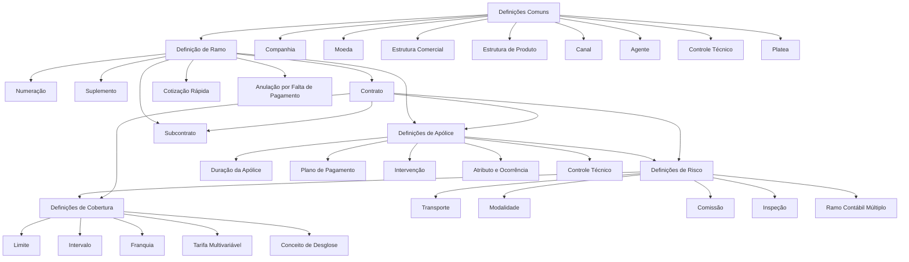

# Definição de Ramo Transporte no Reef.core: Estrutura de Configuração de Emissão, Apólices, Riscos e Coberturas

## 1. Metadados do Documento
- **Arquivo de Origem:** `Não identificado — conteúdo bruto fornecido na solicitação`
- **Tipo de Documento:** Especificação Funcional
- **Domínio / Sistema:** Reef.core — definição de ramos de seguros, com foco em Transporte
- **Público-Alvo:** Analistas funcionais, configuradores de produto, arquitetos, desenvolvedores e operação de seguros
- **Data/Versão Identificada:** Não identificada

---

## 2. Resumo Executivo & Contexto de Negócio

O documento descreve os elementos que participam da definição de um ramo de seguros no sistema Reef.core e a ordem conceitual em que essas definições devem ser realizadas. Embora o título mencione o ramo Transporte, o conteúdo apresenta uma estrutura de configuração aplicável a múltiplos níveis do processo de emissão: definições comuns, ramo, apólice, risco e cobertura.

No nível **Comum**, o Reef.core concentra cadastros e definições transversais necessários para a operação de seguros, tais como companhia, moeda, estrutura comercial, estrutura de produto, canal, quadro de comissão, agente, conceito econômico, documentos de entrada e saída, controle técnico e integração com Platea. Esses elementos suportam a criação de apólices e dos demais componentes de negócio.

O nível **Ramo** estabelece as características gerais das apólices associadas a uma linha de negócio. Entre os elementos descritos estão numeração, suplemento, contrato, subcontrato, apólice grupo, apólice cliente, dias de graça, anulação por falta de pagamento, cotização rápida, contexto, documentos e eventos de marca. Contratos e subcontratos permitem alterar a definição padrão do ramo para clientes, colaboradores ou grupos empresariais específicos.

O nível **Apólice** contém definições que afetam todos os riscos incluídos em uma apólice, como duração mínima e máxima, limites de antecedência ou atraso para vigência, moeda de emissão, valores mínimos para recibos, coasseguro, escala, intervenções, cláusulas, textos anexos, planos de pagamento, revalorização/depreciação, controles técnicos, atributos e ocorrências.

Os níveis **Risco** e **Cobertura** detalham a configuração granular de cada risco segurado e de cada cobertura contratada. O documento também identifica conceitos de tarifação, comissão, inspeção, limites, intervalos, franquias e segregação econômica. Não são fornecidos métodos HTTP, contratos de integração, telas, valores numéricos, regras de cálculo detalhadas, versões do Reef.core ou URLs de ambiente.

---

## 3. Arquitetura, Componentes & Tecnologias Envolvidas

O documento descreve uma arquitetura funcional hierárquica de configuração no Reef.core. Não há tecnologias de infraestrutura, linguagens de programação, protocolos, endpoints, servidores ou ferramentas de CI/CD identificados no conteúdo fornecido.

### Componentes e níveis funcionais identificados

| Componente / Nível | Papel no documento |
| :--- | :--- |
| Reef.core | Sistema citado como responsável por realizar operações com moedas e por disponibilizar atributos necessários à definição de apólices, riscos e coberturas. |
| Comum | Nível de definições não exclusivas do módulo de emissão, mas necessárias para definir ramos e operações. |
| Ramo | Nível de características gerais das apólices e de definições aplicáveis à linha de negócio. |
| Apólice | Nível de definições que afetam todos os riscos possíveis de uma apólice. |
| Risco | Nível de definições aplicáveis a cada risco possível de uma apólice. |
| Cobertura | Nível de definições aplicáveis a cada cobertura definida no contrato de seguro. |
| Contrato | Condições que alteram a definição de um ramo para um ou mais clientes. |
| Subcontrato | Condições que alteram um contrato e, consequentemente, a definição de um ramo, como para grupos empresariais. |
| Platea | Aplicação ou ativo externo cuja integração exige definições específicas. |
| Marca | Conceito associado à definição de eventos com níveis de gravidade que podem desencadear ações sobre apólices. |



> **Nota de Análise:** O documento menciona Platea como aplicação ou ativo de integração, mas não detalha mecanismos de integração, contratos, mensagens, APIs, autenticação ou fluxos de comunicação.

> **Nota de Análise:** O texto descreve “Transporte” como definições exclusivas para ramos do tipo de negócio automóvel, citando matrículas, marcas e modelos como exemplos. Essa associação é reproduzida fielmente, embora o título do documento trate de “Ramo Transporte”.

---

## 4. Regras de Negócio, Especificações Funcionais & Processos

### 4.1. Definições comuns

1. A **companhia** define a entidade ou as entidades com as quais serão criadas as apólices e, consequentemente, os demais elementos.
2. A **moeda** define as divisas com as quais o Reef.core realizará as operações da companhia.
3. A **estrutura comercial** define como será estabelecida a organização territorial da companhia.
4. A **estrutura de produto** define como estarão organizados os ramos comercializados.
5. O **canal** define as diferentes vias pelas quais a nova produção chegará à companhia.
6. O **quadro de comissão** define os agrupadores que determinam as comissões a pagar aos agentes.
7. O **agente** representa os terceiros que exercem intermediação entre cliente e companhia.
8. O **conceito econômico** define os conceitos que integrarão as informações econômicas do recibo.
9. Os **documentos de entrada/saída** definem:
   - Os documentos que devem ser gerados quando uma operação é realizada.
   - Os documentos que devem ser solicitados para permitir uma operação.
10. O **controle técnico** define parâmetros para validações que permitem ou impedem a conclusão de uma operação.
11. As definições de **Platea** são necessárias para a integração com essa aplicação.

### 4.2. Definições no nível de ramo

1. A **numeração** determina os elementos que formarão e a ordem do número de apólice e do número de orçamento.
2. O **ramo** fixa características gerais das apólices, incluindo dias por ano, coletivos, cláusulas e tipo de apólice temporal.
3. O **suplemento** define os tipos de modificações que podem afetar apólices, incluindo anulação, reabilitação e renovação.
4. O **contrato** altera a definição de um ramo para um ou mais clientes e pode determinar valores concretos ou diversos valores permitidos.
5. O **subcontrato** altera as condições de um contrato e, portanto, altera a definição de um ramo. Pode representar condições aplicáveis a um grupo empresarial e admitir valores ou grupos de valores possíveis.
6. A **apólice grupo** é um conjunto de apólices independentes, que podem ser individuais, coletivas ou multirriscos. Esse conjunto está sujeito a alguma exceção, por contrato e/ou subcontrato, sobre a definição padrão do ramo.
7. A **apólice cliente** é uma chave adicional associável à apólice, capaz de ligar diversas apólices de um cliente ou colaborador.
8. Os **dias de graça** são dias adicionados ao efeito de um recibo para determinar quando a apólice deve seguir ao processo de anulação por falta de pagamento.
9. Os **dias de graça de contrato** e os **dias de graça de subcontrato** alteram a definição específica para um cliente ou colaborador.
10. A **anulação por falta de pagamento** define parâmetros considerados pelo processo que determina quais apólices devem ser anuladas por inadimplência.
11. A **cotização rápida** é o processo que devolve o preço de várias simulações usando o mínimo de informação requerida do cliente. A configuração define:
    - As simulações para as quais haverá precificação.
    - As informações que serão solicitadas ao cliente.
    - As informações que não serão solicitadas ao cliente.
    - O valor considerado na precificação para cada informação que não será solicitada.
12. O **contexto** permite criar ambientes nos quais determinados atributos não são apresentados.
13. A definição de **marca** fixa eventos com níveis de gravidade capazes de desencadear ações sobre apólices:
    - Ações reativas: a apólice já está em carteira.
    - Ações proativas: a apólice ainda não foi criada.
14. Os **documentos de entrada/saída do contrato** alteram a definição específica para um cliente ou colaborador.

### 4.3. Definições no nível de apólice

1. Os **meses de duração mínimo/máximo** definem o número mínimo e/ou máximo de meses de vigência permitidos para uma apólice.
2. Os **meses de duração mínimo/máximo de contrato** alteram a definição específica para cliente ou colaborador.
3. Os **dias de adiantamento/atraso** definem quantos dias antes ou depois da data atual podem ser usados para fixar o efeito na criação ou na modificação de uma apólice.
4. Os **dias de adiantamento/atraso de contrato** alteram a definição específica para cliente ou colaborador.
5. A **moeda** determina as possíveis moedas de emissão de apólices e afeta capitais, prêmios, comissões e recibos.
6. O **importe mínimo** estabelece os importes mínimos necessários para gerar um recibo.
7. O **quadro de coasseguro** define previamente as companhias participantes do risco com conhecimento do cliente. A definição prévia será usada posteriormente na emissão de apólices.
8. A **escala** estabelece a parcela de prêmio para uma apólice não anual quando não se deseja cálculo proporcional ao tempo.
9. A **intervenção** define as figuras que podem participar da contratação, relativas a clientes, como tomador, segurado e condutor.
10. A **intervenção de contrato** altera a definição específica para cliente ou colaborador.
11. A **cláusula** estabelece estipulações contratuais que precisam, ampliam, derrogam ou modificam o conteúdo do seguro.
12. O **texto anexo** define se é possível incluir manualmente em uma apólice estipulações contratuais que precisam, ampliam, derrogam ou modificam o conteúdo do seguro.
13. O **plano de pagamento** define como o pagamento do seguro será fracionado.
14. O **plano de pagamento de contrato** altera a definição específica para cliente ou colaborador.
15. O **plano de pagamento cliente** permite estabelecer planos de pagamento por cliente e aplicá-los mesmo quando o ramo não dispõe desse plano.
16. A **revalorização/depreciação** fixa como o valor de um risco será incrementado ou decrementado.
17. O **controle técnico** define condições para paralisar a contratação ou fazer com que uma ou mais pessoas determinem se o seguro é assumível pela seguradora.
18. O **atributo** é uma característica que precisa estar disponível no Reef.core. Um exemplo é o local de registro de um desconto que afeta a apólice.
19. O **atributo de contrato** e o **atributo de subcontrato** alteram a definição específica para cliente ou colaborador.
20. O **controle técnico de atributo** define condições em que a contratação pode ser paralisada ou em que pessoas podem determinar a aceitação do seguro pela seguradora.
21. A **ocorrência** possui o mesmo conceito de atributo, mas sua solicitação acontece “n” vezes. Uma ocorrência representa um conjunto de atributos requerido repetidamente, como matérias cujo transporte é limitado em quantidade.

### 4.4. Definições no nível de risco

1. O nível de **risco** contém definições que afetam cada risco possível de uma apólice.
2. **Transporte** corresponde a definições exclusivas para ramos do tipo de negócio automóvel, com exemplos como matrículas, marcas e modelos.
3. A **intervenção** define figuras de clientes que podem participar da contratação, como tomador, segurado e condutor.
4. A **intervenção de contrato** altera a definição específica para cliente ou colaborador.
5. O **atributo** representa característica necessária e disponível no Reef.core, como local de registro de desconto que afeta o risco.
6. O **atributo de contrato** e o **atributo de subcontrato** alteram a definição específica para cliente ou colaborador.
7. O **controle técnico de atributo** define condições para paralisar contratação ou determinar a assumibilidade do seguro.
8. A **ocorrência** é um conjunto de atributos solicitado “n” vezes.
9. O **ramo contábil múltiplo** permite definir ramos contábeis pelo conteúdo de algum atributo.
10. A **modalidade** é um agrupamento de coberturas que, reunidas, se tornam um pacote comercializável.
11. A **cláusula** e o **texto anexo** definem estipulações contratuais e a possibilidade de inseri-las manualmente.
12. A **comissão** estabelece a remuneração pela intermediação na contratação de seguro. Existem diferentes tipos de comissão, conforme a participação do agente, além de exceções.
13. A **comissão de contrato** altera a definição específica para cliente ou colaborador.
14. A **inspeção** define quando e como devem ser realizadas inspeções em riscos contratados. As inspeções podem ocorrer antes da contratação ou durante o processo de contratação.

### 4.5. Definições no nível de cobertura

1. A **cobertura** é a obrigação principal em um contrato de seguro.
2. Existem diversos tipos de cobertura que determinam o comportamento no processo de emissão e no processo de prestações.
3. O **contrato** e o **subcontrato** podem alterar a definição de ramo para clientes, colaboradores ou grupos empresariais.
4. O **controle técnico** define condições para paralisar a contratação ou permitir que pessoas determinem se o seguro é assumível.
5. O **atributo** representa características que devem estar disponíveis no Reef.core, como o registro de desconto que afeta a cobertura.
6. O **atributo de contrato** e o **atributo de subcontrato** alteram a definição específica para cliente ou colaborador.
7. A **ocorrência** representa atributos requeridos repetidamente.
8. O **limite** define:
   - O importe máximo contratado durante a vigência do seguro.
   - E/ou o importe máximo aplicável a cada prestação durante o período de vigência.
   - Os importes são previamente fixados.
9. O **limite de contrato** altera a definição específica para cliente ou colaborador.
10. O **intervalo** estabelece somas seguradas entre um limite inferior e um limite superior.
11. O **intervalo de contrato** e o **intervalo de subcontrato** alteram a definição específica para cliente ou colaborador.
12. A **franquia** estabelece as quantidades pelas quais o segurado responde em caso de sinistro.
13. A franquia pode conter a definição da redução de prêmio a ser aplicada.
14. A **franquia de contrato** altera a definição específica para cliente ou colaborador.
15. O **conceito de desglose** define o detalhe necessário para segregação das informações econômicas de uma cobertura.
16. A **tarifa multivariável** é o meio pelo qual o cálculo é determinado. A definição é centrada no conceito de fator, entendido como o conceito pelo qual se realiza um cálculo.
17. A **tarifa multivariável de contrato** e a **tarifa multivariável de subcontrato** alteram a definição específica para cliente ou colaborador.
18. A **comissão** estabelece a remuneração por intermediar a contratação de seguro, incluindo tipos de comissão conforme a participação do agente e exceções.
19. A **comissão de contrato** altera a definição específica para cliente ou colaborador.

---

## 5. Tabelas de Parâmetros, Ambientes e Estruturas de Dados

### 5.1. Definições comuns

| Item / Parâmetro | Descrição / Função | Tipo / Valores / Formato | Ambiente / Observações |
| :--- | :--- | :--- | :--- |
| Companhia | Define a entidade ou entidades com as quais serão criadas apólices e demais elementos. | Entidade de negócio | Nível Comum |
| Moeda | Define as divisas usadas pelo Reef.core nas operações da companhia. | Divisas não especificadas | Nível Comum |
| Estrutura comercial | Define a organização territorial da companhia. | Estrutura organizacional | Nível Comum |
| Estrutura de produto | Define a organização dos ramos comercializados. | Estrutura de produto | Nível Comum |
| Canal | Define as vias pelas quais a nova produção chegará à companhia. | Canais não especificados | Nível Comum |
| Quadro comissão | Define agrupadores que determinam comissões a pagar a agentes. | Agrupadores | Nível Comum |
| Agente | Define terceiros intermediários entre cliente e companhia. | Terceiro / intermediário | Nível Comum |
| Conceito econômico | Define conceitos da informação econômica do recibo. | Conceitos econômicos | Nível Comum |
| Documentos de entrada/saída | Define documentos gerados e documentos requeridos em operações. | Documentos não especificados | Nível Comum |
| Controle técnico | Define parâmetros de validação para permitir ou não concluir uma operação. | Parâmetros de validação | Nível Comum |
| Platea | Define elementos necessários para integração com Platea. | Integração não detalhada | Nível Comum |

### 5.2. Definições de ramo

| Item / Parâmetro | Descrição / Função | Tipo / Valores / Formato | Ambiente / Observações |
| :--- | :--- | :--- | :--- |
| Numeração | Determina elementos e ordem do número de apólice e de orçamento. | Estrutura de numeração | Nível Ramo |
| Ramo | Fixa características gerais de apólices. | Dias por ano, coletivos, cláusulas, tipo de apólice temporal | Nível Ramo |
| Suplemento | Define modificações possíveis nas apólices. | Anulação, reabilitação, renovação e outros não especificados | Nível Ramo |
| Contrato | Altera a definição do ramo para um ou mais clientes. | Valores concretos ou múltiplos valores permitidos | Nível Ramo |
| Subcontrato | Altera condições de contrato e a definição do ramo. | Valores ou grupos de valores possíveis | Pode aplicar-se a grupos empresariais |
| Apólice grupo | Conjunto de apólices independentes sujeito a exceção da definição padrão do ramo. | Individual, coletiva ou multirriscos | Exceção por contrato e/ou subcontrato |
| Apólice cliente | Chave adicional para associar diversas apólices de cliente ou colaborador. | Chave adicional | Nível Ramo |
| Dias de graça | Dias adicionados ao efeito do recibo para determinar anulação por falta de pagamento. | Quantidade de dias não especificada | Nível Ramo |
| Anulação falta pagamento | Define parâmetros para identificar apólices a anular por falta de pagamento. | Parâmetros não especificados | Nível Ramo |
| Cotização rápida | Devolve preço de várias simulações com mínimo de informação requerida. | Simulações, dados solicitados e valores padrão | Nível Ramo |
| Contexto | Permite configurar ambientes nos quais atributos não são mostrados. | Atributos ocultos | Nível Ramo |
| Marca | Define eventos de gravidade capazes de desencadear ações sobre apólices. | Ações reativas ou proativas | Nível Ramo |

### 5.3. Definições de apólice

| Item / Parâmetro | Descrição / Função | Tipo / Valores / Formato | Ambiente / Observações |
| :--- | :--- | :--- | :--- |
| Meses duração mínimo/máximo | Define vigência mínima e/ou máxima da apólice. | Número de meses | Nível Apólice |
| Dias de adiantamento/atraso | Define dias antes ou depois da data atual para efeito de criação ou alteração. | Número de dias | Nível Apólice |
| Moeda | Determina moedas de emissão. | Afeta capitais, prêmios, comissões e recibos | Nível Apólice |
| Importe mínimo | Define importes mínimos para gerar recibo. | Valores não especificados | Nível Apólice |
| Quadro coasseguro | Define previamente companhias participantes do risco. | Companhias não especificadas | Uso posterior em emissões |
| Escala | Define parcela de prêmio para apólice não anual sem cálculo proporcional ao tempo. | Regra de escala | Nível Apólice |
| Intervenção | Define figuras participantes na contratação. | Tomador, segurado, condutor e outros não especificados | Nível Apólice |
| Cláusula | Estabelece estipulações que modificam conteúdo do seguro. | Estipulações contratuais | Nível Apólice |
| Texto anexo | Define inclusão manual de estipulações em apólice. | Inclusão manual | Nível Apólice |
| Plano de pagamento | Define fracionamento do pagamento do seguro. | Plano não especificado | Nível Apólice |
| Plano de pagamento cliente | Permite aplicar plano por cliente mesmo que ramo não o possua. | Plano por cliente | Nível Apólice |
| Revalorização/depreciação | Define incremento ou decremento do valor de risco. | Regra não especificada | Nível Apólice |
| Controle técnico | Define paralisação de contratação ou avaliação de assumibilidade. | Condições de aceitação | Nível Apólice |
| Atributo | Característica disponível no Reef.core necessária à definição. | Exemplo: desconto que afeta apólice | Nível Apólice |
| Ocorrência | Conjunto de atributos solicitado repetidamente. | Repetição “n” vezes | Nível Apólice |

### 5.4. Definições de risco e cobertura

| Item / Parâmetro | Descrição / Função | Tipo / Valores / Formato | Ambiente / Observações |
| :--- | :--- | :--- | :--- |
| Transporte | Definições exclusivas de ramos do tipo automóvel. | Matrículas, marcas, modelos | Nível Risco |
| Ramo contábil múltiplo | Permite definir ramos contábeis pelo conteúdo de atributo. | Conteúdo de atributo | Nível Risco |
| Modalidade | Agrupa coberturas em pacote comercializável. | Agrupamento de coberturas | Nível Risco |
| Comissão | Define remuneração por intermediação na contratação. | Tipos dependem da intervenção do agente; inclui exceções | Níveis Risco e Cobertura |
| Inspeção | Define quando e como inspecionar riscos contratados. | Prévia à contratação ou durante contratação | Nível Risco |
| Cobertura | Obrigação principal em contrato de seguro. | Diversos tipos não detalhados | Nível Cobertura |
| Limite | Define importe máximo contratado e/ou por prestação. | Importes previamente fixados | Nível Cobertura |
| Intervalo | Define soma segurada entre limite inferior e superior. | Limite inferior e superior | Nível Cobertura |
| Franquia | Define valores pelos quais segurado responde no sinistro. | Pode definir redução de prêmio | Nível Cobertura |
| Conceito desglose | Define detalhamento para segregação de informação econômica da cobertura. | Estrutura de segregação | Nível Cobertura |
| Tarifa multivariável | Meio para determinar cálculo, centrado em fator. | Fator de cálculo | Nível Cobertura |

---

## 6. Bateria de Perguntas & Respostas para RAG (FAQ Sintético)

### P1: Qual é o objetivo das definições comuns no Reef.core?
**R:** As definições comuns reúnem elementos que não são exclusivos do módulo de emissão, mas são necessários para configurar um ramo e viabilizar a criação de apólices e demais elementos. Incluem companhia, moeda, estrutura comercial, estrutura de produto, canal, comissão, agente, conceito econômico, documentos, controle técnico e integração com Platea.

### P2: O que um contrato altera na definição de um ramo?
**R:** Um contrato estabelece condições que alteram a definição de um ramo para um ou mais clientes. O documento informa que contratos podem determinar valores concretos ou diversos valores permitidos para a configuração aplicável.

### P3: Qual é a diferença entre contrato e subcontrato?
**R:** O contrato altera a definição de um ramo para um ou mais clientes. O subcontrato altera as condições de um contrato e, consequentemente, altera a definição do ramo. O subcontrato pode representar condições específicas de um grupo empresarial e também pode determinar valores ou grupos de valores possíveis.

### P4: Como funciona a cotização rápida no Reef.core?
**R:** A cotização rápida devolve o preço de várias simulações usando o mínimo de informação requerida do cliente. A configuração define as simulações precificadas, os dados solicitados, os dados não solicitados e os valores considerados na precificação para informações que não forem solicitadas.

### P5: Para que servem os dias de graça?
**R:** Dias de graça são dias adicionados ao efeito de um recibo para determinar quando a apólice deve ser encaminhada ao processo de anulação por falta de pagamento. O documento também prevê alterações dessa definição por contrato e por subcontrato.

### P6: O que o controle técnico pode fazer no processo de contratação?
**R:** O controle técnico define parâmetros e condições para validações que podem permitir ou impedir a conclusão de uma operação. Nos níveis de apólice, risco e cobertura, pode paralisar a contratação ou permitir que uma ou mais pessoas avaliem se o seguro é assumível pela seguradora.

### P7: O que é uma ocorrência na configuração de apólice, risco ou cobertura?
**R:** Ocorrência é um conjunto de atributos cuja solicitação é realizada “n” vezes. O documento cita como exemplo o armazenamento, na apólice, de uma série de matérias cujo transporte é limitado em quantidade.

### P8: Qual é a finalidade do quadro de coasseguro?
**R:** O quadro de coasseguro estabelece previamente as companhias que participarão do risco com conhecimento do cliente. Essa definição prévia é utilizada posteriormente nas emissões de apólice.

### P9: Como o documento define modalidade no nível de risco?
**R:** Modalidade é o agrupamento de coberturas que, reunidas, tornam-se um pacote a ser comercializado.

### P10: O que é o limite de uma cobertura?
**R:** Limite é a estipulação do importe máximo contratado durante a vigência do seguro e/ou do importe máximo aplicável a cada prestação realizada nesse período. Os importes são previamente fixados.

### P11: Como a franquia afeta uma cobertura?
**R:** A franquia estabelece os valores pelos quais o segurado responde em caso de sinistro. O documento também informa que a redução de prêmio aplicável pode estar definida na própria franquia.

### P12: Como a tarifa multivariável determina um cálculo?
**R:** A tarifa multivariável é o meio pelo qual um cálculo é determinado. Sua definição se concentra no conceito de fator, entendido como o conceito por meio do qual o cálculo é realizado.

### P13: O que são documentos de entrada e saída em uma operação de seguro?
**R:** Documentos de entrada e saída definem os documentos que devem ser gerados quando ocorre uma operação e os documentos que devem estar disponíveis ou ser solicitados para permitir sua realização. O documento exemplifica que a emissão de uma nova apólice pode gerar documentos e que, para emitir uma apólice de automóvel, pode ser necessário dispor da carteira de motorista.

### P14: Qual é o papel de marca na definição do ramo?
**R:** Marca fixa eventos com nível de gravidade que podem desencadear ações sobre apólices. Essas ações podem ser reativas, quando a apólice já está em carteira, ou proativas, quando a apólice ainda não foi criada.

---

## 7. Glossário de Termos, Siglas & Conceitos-Chave

- **Reef.core:** Sistema citado no documento como responsável por operações com moedas e por disponibilizar atributos utilizados na configuração de apólices, riscos e coberturas.
- **Ramo:** Definição de linha de negócio de seguros, contendo características gerais aplicáveis às apólices.
- **Apólice:** Documento ou contrato de seguro; no documento, representa um nível de configuração que afeta todos os riscos possíveis.
- **Risco:** Nível de configuração aplicável a cada risco possível de uma apólice.
- **Cobertura:** Obrigação principal em um contrato de seguro, com comportamento no processo de emissão e de prestações.
- **Contrato:** Condição que altera a definição de ramo para um ou mais clientes.
- **Subcontrato:** Condição que altera um contrato e a definição de ramo correspondente.
- **Suplemento:** Tipo de modificação possível em uma apólice, como anulação, reabilitação ou renovação.
- **Cotização rápida:** Processo que precifica várias simulações com o mínimo de informações requeridas do cliente.
- **Controle técnico:** Definição de parâmetros ou condições que permitem, impedem ou paralisam uma operação ou contratação.
- **Atributo:** Característica necessária e disponível no Reef.core, usada em configurações de apólice, risco ou cobertura.
- **Ocorrência:** Conjunto de atributos solicitado repetidamente.
- **Coasseguro:** Participação prévia de diversas companhias em um risco, conhecida pelo cliente.
- **Intervenção:** Figura participante na contratação, como tomador, segurado ou condutor.
- **Franquia:** Valor pelo qual o segurado responde em caso de sinistro.
- **Tarifa multivariável:** Meio de determinar cálculo baseado no conceito de fator.
- **Conceito de desglose:** Detalhe necessário para segregação da informação econômica de uma cobertura.
- **Platea:** Aplicação ou ativo cuja integração requer definições no Reef.core.

---

## 8. Notas Críticas, Riscos & Limitações

- O conteúdo fornecido não identifica o arquivo de origem, autor, data, versão, organização proprietária ou histórico de alterações.
- O documento não apresenta valores configuráveis, exemplos completos de parametrização, fórmulas de cálculo, limites numéricos, moedas específicas ou códigos de produto.
- Não há detalhamento técnico sobre arquitetura de software, bancos de dados, APIs, protocolos, endpoints, autenticação, logs, ambientes ou deployment.
- Platea é citado como integração, mas não são descritos contratos, fluxos, dados trocados ou dependências técnicas dessa integração.
- O documento menciona o módulo de emissão e diversos processos de negócio, mas não detalha fluxos operacionais ponta a ponta para emissão, alteração, renovação, reabilitação ou anulação.
- O texto associa “Transporte” a definições exclusivas de ramos do tipo automóvel, incluindo matrículas, marcas e modelos, sem esclarecer a relação entre o ramo Transporte e a classificação de negócio automóvel.
- O documento contém texto aparentemente extraído de slides e apresenta fragmentos repetidos, quebras de linha e possíveis erros de extração, como “pra”, “po” e “le”.
- Não são definidos os critérios específicos de aprovação, responsáveis, perfis de usuário ou matrizes de autorização para controles técnicos e decisões de assumibilidade.
- Não há detalhamento adicional sobre os diferentes tipos de comissão, exceções aplicáveis, fatores de tarifa multivariável ou critérios para inspeções.

---

## 9. Conteúdo Bruto Estruturado (Referência Fiel)

```text
--- [PÁGINA 1 DE 10] ---

DEFINICIÓN DE RAMO TRANSPORTE
 Elementos que intervienen en la definición y orden en el que se debe
realizar.
COMÚN
En este nivel se encuentran definiciones que no son exclusivas del
módulo de emisión, pero son necesarias para poder realizar la
definición. Entre otras definiciones se encuentra:
COMPAÑÍA 
Definición de la entidad o entidades con las
que se van a crear las pólizas y por
consiguiente el resto de elementos
MONEDA 
Definición de las divisas con las que
Reef.core va a realizar las distintas
operaciones de la compañía
ESTRUCTURA COMERCIAL 
 ESTRUCTURA PRODUCTO 
 / 
 RS
Inicio Soluciones APIs Documentación Zeus
ES


--- [PÁGINA 2 DE 10] ---

Definición de como se va a establecer la
organización territorial de la compañía
Definición de como estarán organizados los
ramos que se comercializan
CANAL 
Definición de las distintas vías por las que
llegará la nueva producción a la compañía
CUADRO COMISIÓN 
Definición de los agrupadores que determinan
las comisiones que se van a pagar a los
agentes
AGENTE 
Definición de los terceros que ejercerán de
intermediarios entre el cliente y la compañía
CONCEPTO ECONÓMICO 
Definición de los conceptos que formarán
parte de la información económica del recibo
DOCUMENTOS DE ENTRADA/SALIDA 
Definición de los documentos que deben salir
cuando se realiza una operación y de los
documentos que son necesarios solicitar
cuando se realiza una operación
CONTROL TÉCNICO 
Definición de los parámetros necesarios para
realizar validaciones que permitan o no
finalizar la operación
PLATEA 
Definición necesaria para la integración con
esta aplicación
RAMO
Son definiciones que siendo del módulo de emisión, no son exclusivas
del ramo que se está definiendo. Por ejemplo:
NUMERACIÓN 
Determinar que elementos formarán y en que
orden el número de póliza y el número de
presupuesto
RAMO 
Fija las características generales con las que
contarán las pólizas, como días por año,
colectivos, cláusulas, tipo de póliza temporal,
etc.


--- [PÁGINA 3 DE 10] ---

SUPLEMENTO 
Tipos de modificaciones que podrán sufrir las
pólizas (anulación, rehabilitación, renovación,
etc.)
CONTRATO
Condiciones que alteran la definición de un
ramo. Estas condiciones aplican siempre a
uno o varios clientes. También se pueden
determinar valores concretos o varios valores
permitidos
SUBCONTRATO
Condiciones que alteran las condiciones de
un contrato y, por consiguiente alteran la
definición de un ramo. Un ejemplo puede ser
las distintas condiciones que rigen a un grupo
empresarial. Al igual que el contrato, se
pueden determinar valores o grupos de
valores posibles
PÓLIZA GRUPO
Conjunto de pólizas independientes. Estas,
pueden ser individuales, colectivas o multi-
riesgo. Siempre el conjunto está sujeto a
algún tipo de excepción (contrato y/o
subcontrato) sobre la definición del ramo
estándar
PÓLIZA CLIENTE
Clave adicional que puede asociarse a una
póliza y que puede unir varias pólizas de un
cliente o colaborador
DÍAS DE GRACIA
Número de días que se adicionan al efecto de
un recibo para determinar que debe pasar al
proceso de anulación por falta de pago
DÍAS DE GRACIA CONTRATO
Alteración de la definición específica para un
cliente o colaborador
DÍAS DE GRACIA SUBCONTRATO
Alteración de la definición específica para un
cliente o colaborador
ANULACIÓN FALTA PAGO
Parámetros que tendrá en cuenta este
proceso a la hora de determinar qué pólizas
deben anularse por falta de pago
COTIZACIÓN RÁPIDA
Proceso que devuelve el precio de varias
simulaciones con un mínimo de información
requerida al cliente. En este punto se define
las simulaciones con las que se dará precio,
qué información se solicitará y qué
información no se solicita al cliente y, para
aquella información que no será solicitada,


--- [PÁGINA 4 DE 10] ---

determinar el valor con el que se contará pra
dar precio
CONTEXTO
Se pueden crear entornos en los que
determinar que información (atributos) no
mostrar
PLATEA
Definiciones relacionadas con la integración
con este activo
[MARCA][marca]
Fijar eventos con un nivel de gravedad que
puede desencadenar acciones sobre pólizas.
Estas acciones pueden ser reactivas (la póliza
ya está en cartera) o proactivas (la póliza aún
no ha sido creada)
DOCUMENTOS DE ENTRADA/SALIDA 
Determinar aquellos documentos que deben
acompañar a una operación (por ejemplo, que
documentos se generan cuando se emite una
nueva póliza) y documentos que son
necesarios disponer para poder realizar una
operación (por ejemplo, para emitir una póliza
de automóvil es necesario disponer de la
licencia de conducir)
DOCUMENTOS DE ENTRADA/SALIDA
CONTRATO
Alteración de la definición específica para un
cliente o colaborador
PÓLIZA
En este nivel se encuentran definiciones que afectarán a todos los
posibles riesgos de la póliza. Entre otros se define:
MESES DURACIÓN MÍNIMO/MÁXIMO
Se fija el número máximo y/o mínimo de
meses de vigencia que una póliza puede
disponer
MESES DURACIÓN MÍNIMO/MÁXIMO
CONTRATO
Alteración de la definición específica para un
cliente o colaborador
DÍAS DE ADELANTO/ATRASO
 DÍAS DE ADELANTO/ATRASO CONTRATO


--- [PÁGINA 5 DE 10] ---

Con cuantos días previos o posteriores al día
de hoy se puede fijar el efecto en la creación
o modificación de una póliza
Alteración de la definición específica para un
cliente o colaborador
MONEDA 
Determina las posibles monedas en las que
se emitirán las pólizas. Afecta a capitales,
primas, comisiones y recibos
IMPORTE MÍNIMO
Se establecen los importes mínimos para
generar un recibo
CUADRO COASEGURO
Se establecen de forma previa aquellas
compañías que participarán en el riesgo con
el conocimiento del cliente. Esta definición
previa es para uso posterior en las emisiones
de póliza
ESCALA
Se establece cual será la porción de prima
cuando una póliza no es anual y no se desea
que el cálculo sea proporcional al tiempo
INTERVENCIÓN
Definición de aquellas figuras que podrán
intervenir en la contratación. Estas figuras se
refieren a clientes y son del tipo tomador,
asegurado, conductor, etc.
INTERVENCIÓN CONTRATO
Alteración de la definición específica para un
cliente o colaborador
CLÁUSULA
Establecer diferentes estipulaciones
contractuales que precisan, amplían, derogan
o modifican el contenido del seguro
TEXTO ANEXO
Fijar si es posible incluir de forma manual en
una póliza diferentes estipulaciones
contractuales que precisan, amplían, derogan
o modifican el contenido del seguro
PLAN DE PAGO 
Definir como se va a fraccionar el pago del
seguro
PLAN DE PAGO CONTRATO
Alteración de la definición específica para un
cliente o colaborador
PLAN DE PAGO CLIENTE
 REVALORIZACIÓN/DEPRECIACIÓN


--- [PÁGINA 6 DE 10] ---

Establecer planes de pago por cliente y
aplicarlos aunque el ramo no disponga de él
Fijar como se incrementa o decrementa el
valor de un riesgo
CONTRATO
Condiciones que alteran la definición de un
ramo. Estas condiciones aplican siempre a
uno o varios clientes. También se pueden
determinar valores concretos o varios valores
permitidos
SUBCONTRATO
Condiciones que alteran las condiciones de
un contrato y, por consiguiente alteran la
definición de un ramo. Un ejemplo puede ser
las distintas condiciones que rigen a un grupo
empresarial. Al igual que el contrato, se
pueden determinar valores o grupos de
valores posibles
CONTROL TÉCNICO
Definición de en qué condiciones se puede
paralizar la contratación o hacer que una o
varias personas puedan determinar si el
seguro es asumible por la aseguradora
ATRIBUTO
Son características que sea necesario
disponer y de las que Reef.core dispone, por
ejemplo disponer de un lugar donde se
registre un descuento que afecta a la póliza
ATRIBUTO CONTRATO
Alteración de la definición específica para un
cliente o colaborador
ATRIBUTO SUBCONTRATO
Alteración de la definición específica para un
cliente o colaborador
CONTROL TÉCNICO ATRIBUTO
Definición de en qué condiciones se puede
paralizar la contratación o hacer que una o
varias personas puedan determinar si el
seguro es asumible por la aseguradora
OCURRENCIA
Es el mismo concepto de atributo, pero la
solicitud de esos atributos se realiza "n"
veces. Es decir, es un conjunto de atributos
que su petición se realiza varias veces. Por
ejemplo si fuera almacenar en la póliza una
serie de materias que su transporte está
limitado en cantidad
RIESGO


--- [PÁGINA 7 DE 10] ---

Definiciones que afectan a cada uno de los posibles riesgos de la póliza.
Por ejemplo:
TRANSPORTE 
Son definiciones exclusivas para ramos del
tipo de negocio automóvil. Como por ejemplo,
la definición de matrículas, marcas, modelos,
etc.
INTERVENCIÓN
Definición de aquellas figuras que podrán
intervenir en la contratación. Estas figuras se
refieren a clientes y son del tipo tomador,
asegurado, conductor, etc.
INTERVENCIÓN CONTRATO
Alteración de la definición específica para un
cliente o colaborador
ATRIBUTO
Son características que sea necesario
disponer y de las que Reef.core dispone, por
ejemplo disponer de un lugar donde se
registre un descuento que afecta al riesgo
ATRIBUTO CONTRATO
Alteración de la definición específica para un
cliente o colaborador
ATRIBUTO SUBCONTRATO
Alteración de la definición específica para un
cliente o colaborador
CONTROL TÉCNICO ATRIBUTO
Definición de en qué condiciones se puede
paralizar la contratación o hacer que una o
varias personas puedan determinar si el
seguro es asumible por la aseguradora
OCURRENCIA
Es el mismo concepto de atributo, pero la
solicitud de esos atributos se realiza "n"
veces. Es decir, es un conjunto de atributos
que su petición se realiza varias veces. Por
ejemplo si fuera almacenar en la póliza una
serie de materias que su transporte está
limitado en cantidad
RAMO CONTABLE MULTIPLE
Posibilidad de definir ramos contables po el
contenido de algún atributo
MODALIDAD
Agrupación de coberturas que juntas se
convierten en un paquete a comercializar
CLÁUSULA
 TEXTO ANEXO


--- [PÁGINA 8 DE 10] ---

Establecer diferentes estipulaciones
contractuales que precisan, amplían, derogan
o modifican el contenido del seguro
Fijar si es posible incluir de forma manual en
una póliza diferentes estipulaciones
contractuales que precisan, amplían, derogan
o modifican el contenido del seguro
COMISIÓN
Establecer la remuneración por intermediar en
la contratación de un seguro. Existen distintos
tipos de comisiones dependiendo de como
interviene el agente, así como excepciones
COMISIÓN CONTRATO
Alteración de la definición específica para un
cliente o colaborador
INSPECCIÓN
Definición de cuando y como realizar
inspecciones a los riesgos contratados. las
inspecciones pueden ser previas a la
contratación o en el proceso de contratación
COBERTURA
Definiciones que afectan a cada una de las coberturas definidas. Por
ejemplo:
COBERTURA 
Obligación principal en un contrato de seguro.
Existen diversos tipos de cobertura que
determinan el comportamiento tanto en el
proceso de emisión, como en el proceso de
prestaciones
CONTRATO
Condiciones que alteran la definición de un
ramo. Estas condiciones aplican siempre a
uno o varios clientes. También se pueden
determinar valores concretos o varios valores
permitidos
SUBCONTRATO
Condiciones que alteran las condiciones de
un contrato y, por consiguiente alteran la
definición de un ramo. Un ejemplo puede ser
las distintas condiciones que rigen a un grupo
CONTROL TÉCNICO
Definición de en qué condiciones se puede
paralizar la contratación o hacer que una o
varias personas puedan determinar si el
seguro es asumible por la aseguradora


--- [PÁGINA 9 DE 10] ---

empresarial. Al igual que el contrato, se
pueden determinar valores o grupos de
valores posibles
ATRIBUTO
Son características que sea necesario
disponer y de las que Reef.core dispone, por
ejemplo disponer de un lugar donde se
registre un descuento que afecta a la
cobertura
ATRIBUTO CONTRATO
Alteración de la definición específica para un
cliente o colaborador
ATRIBUTO SUBCONTRATO
Alteración de la definición específica para un
cliente o colaborador
OCURRENCIA
Es el mismo concepto de atributo, pero la
solicitud de esos atributos se realiza "n"
veces. Es decir, es un conjunto de atributos
que su petición se realiza varias veces. Por
ejemplo si fuera almacenar en la póliza una
serie de materias que su transporte está
limitado en cantidad
LÍMITE
Estipulación del importe máximo contratado
por el periodo de vigencia del seguro y/o
importe máximo aplicable por cada uno de las
prestaciones realizadas durante le periodo de
vigencia. Estos importes están prefijados
LÍMITE CONTRATO
Alteración de la definición específica para un
cliente o colaborador
INTERVALO
Establecimiento de sumas aseguradas entre
dos límites, uno inferior y otro superior
INTERVALO CONTRATO
Alteración de la definición específica para un
cliente o colaborador
INTERVALO SUBCONTRATO
Alteración de la definición específica para un
cliente o colaborador
FRANQUICIA
Establecer las cantidades por las que el
asegurado responde en caso de siniestro.
Existe la posibilidad que la reducción de la


--- [PÁGINA 10 DE 10] ---

prima a aplicar se encuentre definida en la
propia franquicia
FRANQUICIA CONTRATO
Alteración de la definición específica para un
cliente o colaborador
CONCEPTO DESGLOSE 
Definición del detalle necesario de
segregación de la información económica de
una cobertura
TARIFA MULTIVARIABLE
Medio por el que se determina el cálculo. La
definición se centra en el concepto factor que
es el concepto por el que se realiza un cálculo
TARIFA MULTIVARIABLE CONTRATO
Alteración de la definición específica para un
cliente o colaborador
TARIFA MULTIVARIABLE SUBCONTRATO
Alteración de la definición específica para un
cliente o colaborador
CLÁUSULA
Establecer diferentes estipulaciones
contractuales que precisan, amplían, derogan
o modifican el contenido del seguro
COMISIÓN
Establecer la remuneración por intermediar en
la contratación de un seguro. Existen distintos
tipos de comisiones dependiendo de como
interviene el agente, así como excepciones
COMISIÓN CONTRATO
Alteración de la definición específica para un
cliente o colaborador
```
