# Definição de Ramo Saúde no Reef.core: Estrutura de Configuração para Emissão de Seguros

## 1. Metadados do Documento
- **Arquivo de Origem:** Não informado no conteúdo bruto fornecido.
- **Tipo de Documento:** Apresentação funcional/técnica (inferido pela estrutura paginada e navegação “Inicio Soluciones APIs Documentación Zeus”).
- **Domínio / Sistema:** Reef.core — definição e configuração de ramos de seguro, com referência ao ramo Saúde.
- **Público-Alvo:** Arquitetos, desenvolvedores, analistas funcionais, equipes de produto e operação de seguros.
- **Data/Versão Identificada:** Não identificada.

---

## 2. Resumo Executivo & Contexto de Negócio

O documento descreve os elementos e a ordem conceitual envolvidos na definição de um ramo de seguros no Reef.core, especificamente sob o título “Definición de Ramo Salud”. A estrutura apresentada organiza configurações necessárias para criar e operar apólices, desde definições corporativas comuns até configurações específicas de cobertura.

A configuração é segmentada em níveis funcionais: **Comum**, **Ramo**, **Póliza**, **Riesgo** e **Cobertura**. Cada nível representa um escopo distinto de parametrização: definições compartilhadas por toda a companhia, características do ramo, regras aplicáveis à apólice, atributos de riscos segurados e condições específicas de coberturas.

O modelo prevê mecanismos de especialização por **Contrato** e **Subcontrato**. Contratos alteram a definição de um ramo para um ou mais clientes, enquanto subcontratos alteram condições de um contrato, como condições aplicáveis a grupos empresariais. Diversos elementos também possuem variações específicas para contrato e subcontrato.

O documento enfatiza controles funcionais relevantes para emissão e manutenção de seguros: numeração, vigência, dias de carência, anulação por falta de pagamento, cotação rápida, documentos de entrada e saída, moedas, planos de pagamento, atributos, ocorrências, inspeções, comissões, franquias, limites e tarifas multivariáveis.

Não são apresentados contratos de APIs, métodos HTTP, modelos de dados técnicos, ambientes, URLs, servidores, versões de software ou parâmetros numéricos concretos. O conteúdo define conceitos e pontos de configuração, não detalhes de implementação técnica.

---

## 3. Arquitetura, Componentes & Tecnologias Envolvidas

O documento cita o **Reef.core** como sistema responsável por suportar operações da companhia, incluindo moedas, atributos e configuração de emissão de seguros. Também menciona integração com a aplicação ou ativo **PLATEA**.

A arquitetura funcional é hierárquica. O nível **Comum** contém elementos compartilhados; os níveis **Ramo**, **Póliza**, **Riesgo** e **Cobertura** progressivamente especializam a definição do produto de seguro. Contrato e Subcontrato funcionam como mecanismos transversais de alteração das configurações padrão.

```mermaid
graph TD
    RC[Reef.core]
    RC --> C[Común]
    RC --> R[Ramo]
    R --> P[Póliza]
    P --> RG[Riesgo]
    RG --> CB[Cobertura]

    C --> C1[Compañía]
    C --> C2[Moneda]
    C --> C3[Estructura Comercial]
    C --> C4[Estructura Producto]
    C --> C5[Canal]
    C --> C6[Cuadro Comisión]
    C --> C7[Agente]
    C --> C8[Concepto Económico]
    C --> C9[Documentos de Entrada/Salida]
    C --> C10[Control Técnico]
    C --> C11[PLATEA]

    R --> R1[Numeración]
    R --> R2[Características generales]
    R --> R3[Suplemento]
    R --> R4[Contrato]
    R --> R5[Subcontrato]
    R --> R6[Póliza Grupo]
    R --> R7[Póliza Cliente]
    R --> R8[Días de Gracia]
    R --> R9[Anulación Falta Pago]
    R --> R10[Cotización Rápida]
    R --> R11[Contexto]
    R --> R12[Marca]
    R --> R13[Documentos Entrada/Salida]

    P --> P1[Duración mínima/máxima]
    P --> P2[Días de adelanto/atraso]
    P --> P3[Moneda]
    P --> P4[Importe mínimo]
    P --> P5[Cuadro coaseguro]
    P --> P6[Escala]
    P --> P7[Intervención]
    P --> P8[Cláusula]
    P --> P9[Texto anexo]
    P --> P10[Plan de pago]
    P --> P11[Revalorización/Depreciación]
    P --> P12[Control técnico]
    P --> P13[Atributo]
    P --> P14[Ocurrencia]

    RG --> RG1[Intervención]
    RG --> RG2[Atributo]
    RG --> RG3[Control técnico atributo]
    RG --> RG4[Ocurrencia]
    RG --> RG5[Ramo contable múltiple]
    RG --> RG6[Modalidad]
    RG --> RG7[Cláusula]
    RG --> RG8[Texto anexo]
    RG --> RG9[Comisión]
    RG --> RG10[Inspección]

    CB --> CB1[Cobertura]
    CB --> CB2[Control técnico]
    CB --> CB3[Atributo]
    CB --> CB4[Ocurrencia]
    CB --> CB5[Límite]
    CB --> CB6[Intervalo]
    CB --> CB7[Franquicia]
    CB --> CB8[Concepto desglose]
    CB --> CB9[Tarifa multivariable]
    CB --> CB10[Cláusula]
    CB --> CB11[Comisión]

    R4 -.altera definición estándar.-> R
    R5 -.altera condiciones de contrato.-> R4
    C11 -.integración.-> PL[PLATEA]
    R11 -.integración.-> PL
```



> **Nota de Análise:** O documento menciona Reef.core e PLATEA, mas não detalha interfaces de integração, protocolos, endpoints, autenticação, formatos de mensagem ou responsabilidades técnicas entre os sistemas.

---

## 4. Regras de Negócio, Especificações Funcionais & Processos

### 4.1 Organização funcional da definição de ramo

A definição de ramo é estruturada por escopo:

1. **Común:** definições necessárias para configurar operações da companhia, não exclusivas do módulo de emissão.
2. **Ramo:** definições do módulo de emissão que não são exclusivas do ramo que está sendo definido.
3. **Póliza:** definições que afetam todos os riscos possíveis de uma apólice.
4. **Riesgo:** definições que afetam cada risco possível da apólice.
5. **Cobertura:** definições que afetam cada cobertura definida.

### 4.2 Regras de especialização por Contrato e Subcontrato

- **Contrato** contém condições que alteram a definição de um ramo.
- As condições de contrato aplicam-se sempre a um ou mais clientes.
- Um contrato pode determinar valores concretos ou diversos valores permitidos.
- **Subcontrato** altera as condições de um contrato e, consequentemente, altera a definição de um ramo.
- O documento apresenta como exemplo de subcontrato as condições distintas aplicáveis a um grupo empresarial.
- Um subcontrato também pode determinar valores concretos ou grupos de valores possíveis.
- Alterações de configuração podem ser específicas para cliente ou colaborador, conforme diversas entradas identificadas com o sufixo **CONTRATO**.

### 4.3 Regras de emissão e administração de apólices

- **Numeração:** determina quais elementos compõem e em que ordem são formados o número da apólice e o número do orçamento.
- **Características gerais do ramo:** o ramo fixa características das apólices, incluindo dias por ano, coletivos, cláusulas e tipo de apólice temporária.
- **Suplemento:** define tipos de modificações possíveis para apólices, incluindo anulação, reabilitação e renovação.
- **Póliza Grupo:** representa um conjunto de apólices independentes, individuais, coletivas ou multirriscos, sempre sujeito a alguma exceção por contrato e/ou subcontrato sobre a definição padrão do ramo.
- **Póliza Cliente:** é uma chave adicional associável a uma apólice, capaz de unir várias apólices de um cliente ou colaborador.
- **Meses de duração mínimo/máximo:** define o número mínimo e/ou máximo de meses de vigência de uma apólice.
- **Días de Adelanto/Atraso:** determina quantos dias antes ou depois da data atual podem ser utilizados para fixar o efeito na criação ou modificação de uma apólice.
- **Moneda:** determina moedas possíveis para emissão; afeta capitais, prêmios, comissões e recibos.
- **Importe Mínimo:** estabelece valores mínimos para gerar um recibo.
- **Cuadro Coaseguro:** define previamente companhias que participarão do risco com conhecimento do cliente; essa configuração será usada posteriormente em emissões de apólice.
- **Escala:** define a parcela de prêmio para apólices não anuais quando o cálculo não deve ser proporcional ao tempo.
- **Plan de Pago:** define o fracionamento do pagamento do seguro.
- **Plan de Pago Cliente:** permite estabelecer planos de pagamento por cliente e aplicá-los mesmo que o ramo não disponha deles.
- **Revalorización/Depreciación:** define como o valor de um risco é incrementado ou reduzido.

### 4.4 Regras de inadimplência, carência e anulação

- **Días de Gracia:** número de dias adicionados ao efeito de um recibo para determinar quando a apólice deve seguir ao processo de anulação por falta de pagamento.
- **Días de Gracia Contrato:** alteração específica da definição para cliente ou colaborador.
- **Días de Gracia Subcontrato:** alteração específica da definição para cliente ou colaborador.
- **Anulación Falta Pago:** define parâmetros considerados pelo processo ao determinar quais apólices devem ser anuladas por falta de pagamento.

### 4.5 Cotação, contexto e documentos

- **Cotización Rápida:** processo que retorna o preço de várias simulações com o mínimo de informações requeridas do cliente.
- A configuração de cotação rápida define:
  - Quais simulações receberão preço.
  - Quais informações serão solicitadas.
  - Quais informações não serão solicitadas.
  - Qual valor será utilizado para precificar informações não solicitadas.
- **Contexto:** permite criar ambientes nos quais determinados atributos não devem ser exibidos.
- **Documentos de Entrada/Salida:** define documentos que devem ser gerados em uma operação e documentos que precisam estar disponíveis para realizar uma operação.
- Exemplo explicitamente fornecido: para emitir uma apólice de automóvel, é necessário dispor da carteira de motorista.

### 4.6 Controle técnico, atributos e ocorrências

- **Control Técnico:** define condições em que a contratação pode ser paralisada ou em que uma ou mais pessoas podem determinar se o seguro é assumível pela seguradora.
- **Atributo:** representa uma característica necessária e disponível no Reef.core.
- O documento fornece como exemplo um local para registrar um desconto que afeta uma apólice, um risco ou uma cobertura, conforme o nível de definição.
- **Control Técnico Atributo:** define condições em que a contratação pode ser paralisada ou uma ou mais pessoas podem determinar se o seguro é assumível pela seguradora.
- **Ocurrencia:** possui o mesmo conceito de atributo, mas sua solicitação ocorre “n” vezes; representa um conjunto de atributos solicitado repetidamente.
- Exemplo: armazenar em uma apólice uma série de matérias cujo transporte é limitado em quantidade.

### 4.7 Regras aplicáveis a riscos

- **Intervención:** define figuras que podem intervir na contratação. As figuras referem-se a clientes e podem ser tomador, segurado, condutor, entre outras.
- **Ramo Contable Multiple:** permite definir ramos contábeis pelo conteúdo de algum atributo.
- **Modalidad:** agrupamento de coberturas que, conjuntamente, tornam-se um pacote comercializável.
- **Comisión:** estabelece a remuneração por intermediar a contratação de um seguro. Existem tipos distintos de comissão conforme a forma de intervenção do agente e exceções.
- **Inspección:** define quando e como realizar inspeções dos riscos contratados; inspeções podem ocorrer antes da contratação ou durante o processo de contratação.

### 4.8 Regras aplicáveis a coberturas

- **Cobertura:** obrigação principal em um contrato de seguro. Existem diversos tipos de cobertura que determinam comportamento tanto no processo de emissão quanto no processo de prestações.
- **Límite:** estipula o valor máximo contratado para o período de vigência do seguro e/ou o valor máximo aplicável a cada prestação durante o período de vigência. Os valores são pré-fixados.
- **Intervalo:** estabelece somas asseguradas entre dois limites: inferior e superior.
- **Franquicia:** estabelece valores pelos quais o segurado responde em caso de sinistro. A redução de prêmio aplicável pode estar definida na própria franquia.
- **Concepto Desglose:** define o detalhamento necessário para segregação da informação econômica de uma cobertura.
- **Tarifa Multivariable:** meio de determinação do cálculo; a definição centra-se no conceito de fator, que é o conceito pelo qual se realiza um cálculo.

---

## 5. Tabelas de Parâmetros, Ambientes e Estruturas de Dados

| Item / Parâmetro | Descrição / Função | Tipo / Valores / Formato | Ambiente / Observações |
| :--- | :--- | :--- | :--- |
| Compañía | Define a entidade ou entidades com as quais serão criadas apólices e os demais elementos. | Entidade corporativa. | Nível Común. |
| Moneda | Define divisas para operações da companhia; em apólice, define moedas de emissão. | Moedas não especificadas. | Afeta capitais, prêmios, comissões e recibos. |
| Estructura Comercial | Define a organização territorial da companhia. | Estrutura organizacional. | Nível Común. |
| Estructura Producto | Define como estarão organizados os ramos comercializados. | Estrutura de produto. | Nível Común. |
| Canal | Define vias pelas quais a nova produção chegará à companhia. | Canal de produção. | Nível Común. |
| Cuadro Comisión | Define agrupadores que determinam comissões a pagar a agentes. | Agrupadores de comissão. | Nível Común. |
| Agente | Define terceiros intermediários entre cliente e companhia. | Intermediário. | Nível Común. |
| Concepto Económico | Define conceitos da informação econômica do recibo. | Conceito econômico. | Nível Común. |
| Documentos de Entrada/Salida | Define documentos emitidos em operações e documentos requeridos para executá-las. | Documentos de operação. | Presente nos níveis Común e Ramo. |
| Control Técnico | Define parâmetros e condições de validação da operação ou aceitação do seguro. | Regras de controle. | Presente em Común, Póliza e Cobertura. |
| PLATEA | Configuração necessária ou relacionada à integração com PLATEA. | Integração. | Não há detalhes técnicos de integração. |
| Numeración | Determina elementos e ordem do número de apólice e orçamento. | Regra de composição. | Nível Ramo. |
| Ramo | Fixa características gerais das apólices. | Características do ramo. | Inclui dias por ano, coletivos, cláusulas e tipo de apólice temporária. |
| Suplemento | Define modificações possíveis de apólices. | Tipos de modificação. | Exemplos: anulação, reabilitação e renovação. |
| Contrato | Altera a definição do ramo para um ou mais clientes. | Condição de exceção. | Pode determinar valores concretos ou múltiplos valores permitidos. |
| Subcontrato | Altera condições de contrato e, consequentemente, a definição do ramo. | Condição de exceção subordinada. | Exemplo: condições de grupo empresarial. |
| Póliza Grupo | Agrupa apólices independentes sujeitas a exceções. | Conjunto de apólices. | Pode conter apólices individuais, coletivas ou multirriscos. |
| Póliza Cliente | Chave adicional para associar várias apólices. | Chave de associação. | Cliente ou colaborador. |
| Días de Gracia | Dias adicionados ao efeito do recibo antes do processo de anulação. | Número de dias. | Relacionado à falta de pagamento. |
| Anulación Falta Pago | Define parâmetros de anulação por inadimplência. | Processo de seleção de apólices. | Nível Ramo. |
| Cotización Rápida | Retorna preços de várias simulações com informações mínimas. | Processo de cotação. | Define dados solicitados, não solicitados e valores default de precificação. |
| Contexto | Permite ocultar determinados atributos. | Ambiente/contexto de exibição. | Nível Ramo. |
| Marca | Fixa eventos com nível de gravidade capazes de desencadear ações sobre apólices. | Evento e gravidade. | Ações reativas ou proativas. O rótulo aparece como “[MARCA][marca]”. |
| Meses Duración Mínimo/Máximo | Define vigência mínima e/ou máxima da apólice. | Número de meses. | Nível Póliza. |
| Días de Adelanto/Atraso | Define antecedência ou atraso permitido para efeito de criação ou modificação. | Número de dias. | Nível Póliza. |
| Importe Mínimo | Estabelece valores mínimos para geração de recibo. | Valor monetário não especificado. | Nível Póliza. |
| Cuadro Coaseguro | Define previamente companhias participantes do risco. | Configuração de co-seguro. | Uso posterior na emissão de apólices. |
| Escala | Define parcela de prêmio para apólice não anual sem proporcionalidade temporal. | Regra de cálculo. | Nível Póliza. |
| Intervención | Define figuras participantes na contratação. | Tomador, segurado, condutor, entre outros. | Presente em Póliza e Riesgo. |
| Cláusula | Define estipulações contratuais que esclarecem, ampliam, derrogam ou modificam o seguro. | Estipulação contratual. | Presente em Póliza, Riesgo e Cobertura. |
| Texto Anexo | Define possibilidade de inclusão manual de estipulações contratuais. | Texto manual. | Presente em Póliza e Riesgo. |
| Plan de Pago | Define fracionamento do pagamento do seguro. | Plano de pagamento. | Possui variações para contrato e cliente. |
| Plan de Pago Cliente | Define e aplica planos de pagamento específicos por cliente. | Plano por cliente. | Pode ser aplicado mesmo sem plano no ramo. |
| Revalorización/Depreciación | Define incremento ou redução de valor de um risco. | Regra de atualização de valor. | Nível Póliza. |
| Atributo | Característica necessária e disponível no Reef.core. | Atributo. | Pode afetar apólice, risco ou cobertura. |
| Ocurrencia | Conjunto de atributos solicitado repetidamente. | Repetição “n” de atributos. | Exemplo: matérias transportadas limitadas em quantidade. |
| Ramo Contable Multiple | Define ramos contábeis pelo conteúdo de atributo. | Regra contábil. | Nível Riesgo. |
| Modalidad | Agrupa coberturas para formar pacote comercializável. | Pacote de coberturas. | Nível Riesgo. |
| Comisión | Define remuneração pela intermediação do seguro. | Comissão e exceções. | Depende da forma de intervenção do agente. |
| Inspección | Define quando e como inspecionar riscos. | Processo de inspeção. | Pode ocorrer antes ou durante a contratação. |
| Cobertura | Obrigação principal em contrato de seguro. | Tipo de cobertura. | Afeta emissão e prestações. |
| Límite | Define valor máximo por vigência e/ou prestação. | Valores pré-fixados. | Nível Cobertura. |
| Intervalo | Define soma assegurada entre limite inferior e superior. | Faixa de valores. | Possui variantes por contrato e subcontrato. |
| Franquicia | Define parcela de responsabilidade do segurado em sinistro. | Valor de franquia. | Pode conter redução de prêmio. |
| Concepto Desglose | Define detalhe de segregação da informação econômica de cobertura. | Estrutura econômica. | Nível Cobertura. |
| Tarifa Multivariable | Define cálculo baseado no conceito de fator. | Regra/fator de cálculo. | Possui variantes por contrato e subcontrato. |

> **Nota de Análise:** O documento não informa valores concretos, formatos de campo, tipos técnicos, códigos de moeda, tabelas físicas, bancos de dados, endpoints, URLs, servidores ou ambientes de implantação.

---

## 6. Bateria de Perguntas & Respostas para RAG (FAQ Sintético)

### P1: Qual é a finalidade da definição de ramo no Reef.core?
**R:** A definição de ramo organiza os elementos necessários para configurar produtos de seguro e emitir apólices no Reef.core. O documento estrutura essas definições nos níveis Común, Ramo, Póliza, Riesgo e Cobertura.

### P2: Como Contrato e Subcontrato alteram um ramo de seguro?
**R:** Contrato contém condições que alteram a definição de um ramo para um ou mais clientes e pode determinar valores concretos ou vários valores permitidos. Subcontrato altera condições de um contrato e, consequentemente, a definição do ramo; o documento cita grupos empresariais como exemplo de aplicação.

### P3: O que é Cotización Rápida no contexto do ramo?
**R:** Cotización Rápida é um processo que retorna o preço de várias simulações com o mínimo de informações requeridas do cliente. A configuração determina quais simulações serão precificadas, quais dados serão solicitados, quais não serão solicitados e qual valor será utilizado para precificar dados não informados.

### P4: Como o processo de anulação por falta de pagamento é configurado?
**R:** Días de Gracia define a quantidade de dias adicionados ao efeito de um recibo para determinar quando uma apólice deve seguir ao processo de anulação por falta de pagamento. Anulación Falta Pago define os parâmetros considerados pelo processo para determinar quais apólices devem ser anuladas.

### P5: O que Numeración define em um ramo?
**R:** Numeración determina quais elementos formarão e em que ordem serão montados o número da apólice e o número do orçamento.

### P6: Quais dados de apólice são afetados pela configuração de Moneda?
**R:** A configuração de Moneda determina as moedas possíveis para emissão de apólices e afeta capitais, prêmios, comissões e recibos.

### P7: Qual é a diferença entre Atributo e Ocurrencia?
**R:** Atributo é uma característica necessária e disponível no Reef.core. Ocurrencia possui o mesmo conceito básico, mas corresponde a um conjunto de atributos cuja solicitação é realizada repetidamente “n” vezes, como no exemplo de várias matérias transportadas com limitação de quantidade.

### P8: Como o Control Técnico pode influenciar a contratação?
**R:** Control Técnico define em quais condições a contratação pode ser paralisada ou em quais condições uma ou mais pessoas podem determinar se o seguro é assumível pela seguradora. O documento também apresenta Control Técnico Atributo nos níveis de apólice e risco.

### P9: O que é uma Modalidad no nível de risco?
**R:** Modalidad é um agrupamento de coberturas que, juntas, tornam-se um pacote a ser comercializado.

### P10: Como funcionam os limites e intervalos de cobertura?
**R:** Límite estipula o importe máximo contratado para o período de vigência do seguro e/ou o importe máximo aplicável para cada prestação realizada durante a vigência; esses valores são pré-fixados. Intervalo estabelece somas asseguradas entre dois limites, um inferior e outro superior.

### P11: O que a Franquicia estabelece?
**R:** Franquicia estabelece os valores pelos quais o segurado responde em caso de sinistro. O documento informa que a redução de prêmio aplicável pode estar definida na própria franquia.

### P12: Para que serve o Cuadro Coaseguro?
**R:** Cuadro Coaseguro estabelece previamente as companhias que participarão do risco com conhecimento do cliente. Essa definição prévia é destinada ao uso posterior em emissões de apólice.

### P13: Como são definidos documentos de entrada e saída?
**R:** Documentos de Entrada/Salida define documentos que devem ser gerados em uma operação e documentos que devem estar disponíveis para que uma operação seja realizada. O documento cita como exemplo a necessidade de carteira de motorista para emitir uma apólice de automóvel.

### P14: O que Tarifa Multivariable define?
**R:** Tarifa Multivariable é o meio pelo qual se determina um cálculo. Sua definição é centrada no conceito de fator, entendido como o conceito pelo qual o cálculo é realizado.

---

## 7. Glossário de Termos, Siglas & Conceitos-Chave

- **Reef.core:** Sistema citado como suporte para operações da companhia e disponibilidade de atributos.
- **PLATEA:** Aplicação ou ativo mencionado como alvo de definições de integração.
- **Común:** Nível de definições compartilhadas, não exclusivas do módulo de emissão.
- **Ramo:** Nível de configuração com características gerais das apólices e definições de emissão.
- **Póliza:** Apólice de seguro; nível que afeta todos os riscos possíveis da apólice.
- **Riesgo:** Risco segurado; nível que afeta cada risco possível da apólice.
- **Cobertura:** Obrigação principal em contrato de seguro; influencia emissão e prestações.
- **Contrato:** Condição que altera a definição de ramo para um ou mais clientes.
- **Subcontrato:** Condição que altera um contrato e, por consequência, a definição de ramo.
- **Suplemento:** Tipo de modificação que uma apólice pode sofrer, como anulação, reabilitação ou renovação.
- **Recibo:** Elemento econômico citado na configuração de moeda, conceito econômico, valor mínimo e dias de carência.
- **Días de Gracia:** Dias adicionados ao efeito do recibo antes de encaminhar a apólice para anulação por falta de pagamento.
- **Cotización Rápida:** Processo de precificação de múltiplas simulações com informação mínima requerida.
- **Control Técnico:** Configuração de validações e condições de interrupção ou aceitação de contratação.
- **Atributo:** Característica necessária disponível no Reef.core.
- **Ocurrencia:** Conjunto repetível de atributos solicitado “n” vezes.
- **Intervención:** Figura de cliente que participa da contratação, como tomador, segurado ou condutor.
- **Coaseguro:** Participação pré-configurada de companhias no risco.
- **Franquicia:** Valor de responsabilidade do segurado em caso de sinistro.
- **Tarifa Multivariable:** Mecanismo de cálculo baseado no conceito de fator.
- **Concepto Desglose:** Detalhamento para segregação de informação econômica de cobertura.

---

## 8. Notas Críticas, Riscos & Limitações

- O documento não apresenta valores de parâmetros, regras numéricas, exemplos completos de cálculo, modelos de dados ou regras de precedência entre configurações padrão, contrato e subcontrato.
- Não há detalhamento técnico sobre a integração com PLATEA, incluindo protocolos, APIs, eventos, formatos de mensagens, autenticação ou tratamento de falhas.
- O termo apresentado como **“[MARCA][marca]”** parece estar corrompido ou incompleto no conteúdo extraído; a funcionalidade descrita envolve eventos de gravidade capazes de desencadear ações reativas ou proativas sobre apólices.
- Não são informados os critérios específicos usados pelo Control Técnico para aprovar, recusar ou paralisar uma contratação.
- Não são definidos os fatores, fórmulas ou variáveis concretas da Tarifa Multivariable.
- Não há definição de ambientes, servidores, URLs, logs, permissões, perfis de acesso, integrações externas adicionais ou procedimentos operacionais.
- O conteúdo descreve conceitos e pontos de parametrização; não detalha métodos HTTP, contratos JSON, esquemas de persistência ou interfaces técnicas expostas pelo Reef.core.

---

## 9. Conteúdo Bruto Estruturado (Referência Fiel)

```text
--- [PÁGINA 1 DE 10] ---

DEFINICIÓN DE RAMO SALUD
 Elementos que intervienen en la definición y orden en el que se debe
realizar.
COMÚN
En este nivel se encuentran definiciones que no son exclusivas del
módulo de emisión, pero son necesarias para poder realizar la
definición. Entre otras definiciones se encuentra:
COMPAÑÍA 
Definición de la entidad o entidades con las
que se van a crear las pólizas y por
consiguiente el resto de elementos
MONEDA 
Definición de las divisas con las que
Reef.core va a realizar las distintas
operaciones de la compañía
ESTRUCTURA COMERCIAL 
 ESTRUCTURA PRODUCTO 
 / 
 RS
Inicio Soluciones APIs Documentación Zeus
ES


--- [PÁGINA 2 DE 10] ---

Definición de como se va a establecer la
organización territorial de la compañía
Definición de como estarán organizados los
ramos que se comercializan
CANAL 
Definición de las distintas vías por las que
llegará la nueva producción a la compañía
CUADRO COMISIÓN 
Definición de los agrupadores que determinan
las comisiones que se van a pagar a los
agentes
AGENTE 
Definición de los terceros que ejercerán de
intermediarios entre el cliente y la compañía
CONCEPTO ECONÓMICO 
Definición de los conceptos que formarán
parte de la información económica del recibo
DOCUMENTOS DE ENTRADA/SALIDA 
Definición de los documentos que deben salir
cuando se realiza una operación y de los
documentos que son necesarios solicitar
cuando se realiza una operación
CONTROL TÉCNICO 
Definición de los parámetros necesarios para
realizar validaciones que permitan o no
finalizar la operación
PLATEA 
Definición necesaria para la integración con
esta aplicación
RAMO
Son definiciones que siendo del módulo de emisión, no son exclusivas
del ramo que se está definiendo. Por ejemplo:
NUMERACIÓN 
Determinar que elementos formarán y en que
orden el número de póliza y el número de
presupuesto
RAMO 
Fija las características generales con las que
contarán las pólizas, como días por año,
colectivos, cláusulas, tipo de póliza temporal,
etc.


--- [PÁGINA 3 DE 10] ---

SUPLEMENTO 
Tipos de modificaciones que podrán sufrir las
pólizas (anulación, rehabilitación, renovación,
etc.)
CONTRATO
Condiciones que alteran la definición de un
ramo. Estas condiciones aplican siempre a
uno o varios clientes. También se pueden
determinar valores concretos o varios valores
permitidos
SUBCONTRATO
Condiciones que alteran las condiciones de
un contrato y, por consiguiente alteran la
definición de un ramo. Un ejemplo puede ser
las distintas condiciones que rigen a un grupo
empresarial. Al igual que el contrato, se
pueden determinar valores o grupos de
valores posibles
PÓLIZA GRUPO
Conjunto de pólizas independientes. Estas,
pueden ser individuales, colectivas o multi-
riesgo. Siempre el conjunto está sujeto a
algún tipo de excepción (contrato y/o
subcontrato) sobre la definición del ramo
estándar
PÓLIZA CLIENTE
Clave adicional que puede asociarse a una
póliza y que puede unir varias pólizas de un
cliente o colaborador
DÍAS DE GRACIA
Número de días que se adicionan al efecto de
un recibo para determinar que debe pasar al
proceso de anulación por falta de pago
DÍAS DE GRACIA CONTRATO
Alteración de la definición específica para un
cliente o colaborador
DÍAS DE GRACIA SUBCONTRATO
Alteración de la definición específica para un
cliente o colaborador
ANULACIÓN FALTA PAGO
Parámetros que tendrá en cuenta este
proceso a la hora de determinar qué pólizas
deben anularse por falta de pago
COTIZACIÓN RÁPIDA
Proceso que devuelve el precio de varias
simulaciones con un mínimo de información
requerida al cliente. En este punto se define
las simulaciones con las que se dará precio,
qué información se solicitará y qué
información no se solicita al cliente y, para
aquella información que no será solicitada,


--- [PÁGINA 4 DE 10] ---

determinar el valor con el que se contará pra
dar precio
CONTEXTO
Se pueden crear entornos en los que
determinar que información (atributos) no
mostrar
PLATEA
Definiciones relacionadas con la integración
con este activo
[MARCA][marca]
Fijar eventos con un nivel de gravedad que
puede desencadenar acciones sobre pólizas.
Estas acciones pueden ser reactivas (la póliza
ya está en cartera) o proactivas (la póliza aún
no ha sido creada)
DOCUMENTOS DE ENTRADA/SALIDA 
Determinar aquellos documentos que deben
acompañar a una operación (por ejemplo, que
documentos que se generan cuando se emite una
nueva póliza) y documentos que son
necesarios disponer para poder realizar una
operación (por ejemplo, para emitir una póliza
de automóvil es necesario disponer de la
licencia de conducir)
DOCUMENTOS DE ENTRADA/SALIDA
CONTRATO
Alteración de la definición específica para un
cliente o colaborador
PÓLIZA
En este nivel se encuentran definiciones que afectarán a todos los
posibles riesgos de la póliza. Entre otros se define:
MESES DURACIÓN MÍNIMO/MÁXIMO
Se fija el número máximo y/o mínimo de
meses de vigencia que una póliza puede
disponer
MESES DURACIÓN MÍNIMO/MÁXIMO
CONTRATO
Alteración de la definición específica para un
cliente o colaborador
DÍAS DE ADELANTO/ATRASO
 DÍAS DE ADELANTO/ATRASO CONTRATO


--- [PÁGINA 5 DE 10] ---

Con cuantos días previos o posteriores al día
de hoy se puede fijar el efecto en la creación
o modificación de una póliza
Alteración de la definición específica para un
cliente o colaborador
MONEDA 
Determina las posibles monedas en las que
se emitirán las pólizas. Afecta a capitales,
primas, comisiones y recibos
IMPORTE MÍNIMO
Se establecen los importes mínimos para
generar un recibo
CUADRO COASEGURO
Se establecen de forma previa aquellas
compañías que participarán en el riesgo con
el conocimiento del cliente. Esta definición
previa es para uso posterior en las emisiones
de póliza
ESCALA
Se establece cual será la porción de prima
cuando una póliza no es anual y no se desea
que el cálculo sea proporcional al tiempo
INTERVENCIÓN
Definición de aquellas figuras que podrán
intervenir en la contratación. Estas figuras se
refieren a clientes y son del tipo tomador,
asegurado, conductor, etc.
INTERVENCIÓN CONTRATO
Alteración de la definición específica para un
cliente o colaborador
CLÁUSULA
Establecer diferentes estipulaciones
contractuales que precisan, amplían, derogan
o modifican el contenido del seguro
TEXTO ANEXO
Fijar si es posible incluir de forma manual en
una póliza diferentes estipulaciones
contractuales que precisan, amplían, derogan
o modifican el contenido del seguro
PLAN DE PAGO 
Definir como se va a fraccionar el pago del
seguro
PLAN DE PAGO CONTRATO
Alteración de la definición específica para un
cliente o colaborador
PLAN DE PAGO CLIENTE
 REVALORIZACIÓN/DEPRECIACIÓN


--- [PÁGINA 6 DE 10] ---

Establecer planes de pago por cliente y
aplicarlos aunque el ramo no disponga de él
Fijar como se incrementa o decrementa el
valor de un riesgo
CONTRATO
Condiciones que alteran la definición de un
ramo. Estas condiciones aplican siempre a
uno o varios clientes. También se pueden
determinar valores concretos o varios valores
permitidos
SUBCONTRATO
Condiciones que alteran las condiciones de
un contrato y, por consiguiente alteran la
definición de un ramo. Un ejemplo puede ser
las distintas condiciones que rigen a un grupo
empresarial. Al igual que el contrato, se
pueden determinar valores o grupos de
valores posibles
CONTROL TÉCNICO
Definición de en qué condiciones se puede
paralizar la contratación o hacer que una o
varias personas puedan determinar si el
seguro es asumible por la aseguradora
ATRIBUTO
Son características que sea necesario
disponer y de las que Reef.core dispone, por
ejemplo disponer de un lugar donde se
registre un descuento que afecta a la póliza
ATRIBUTO CONTRATO
Alteración de la definición específica para un
cliente o colaborador
ATRIBUTO SUBCONTRATO
Alteración de la definición específica para un
cliente o colaborador
CONTROL TÉCNICO ATRIBUTO
Definición de en qué condiciones se puede
paralizar la contratación o hacer que una o
varias personas puedan determinar si el
seguro es asumible por la aseguradora
OCURRENCIA
Es el mismo concepto de atributo, pero la
solicitud de esos atributos se realiza "n"
veces. Es decir, es un conjunto de atributos
que su petición se realiza varias veces. Por
ejemplo si fuera almacenar en la póliza una
serie de materias que su transporte está
limitado en cantidad
RIESGO


--- [PÁGINA 7 DE 10] ---

Definiciones que afectan a cada uno de los posibles riesgos de la póliza.
Por ejemplo:
INTERVENCIÓN
Definición de aquellas figuras que podrán
intervenir en la contratación. Estas figuras se
refieren a clientes y son del tipo tomador,
asegurado, conductor, etc.
INTERVENCIÓN CONTRATO
Alteración de la definición específica para un
cliente o colaborador
ATRIBUTO
Son características que sea necesario
disponer y de las que Reef.core dispone, por
ejemplo disponer de un lugar donde se
registre un descuento que afecta al riesgo
ATRIBUTO CONTRATO
Alteración de la definición específica para un
cliente o colaborador
ATRIBUTO SUBCONTRATO
Alteración de la definición específica para un
cliente o colaborador
CONTROL TÉCNICO ATRIBUTO
Definición de en qué condiciones se puede
paralizar la contratación o hacer que una o
varias personas puedan determinar si el
seguro es asumible por la aseguradora
OCURRENCIA
Es el mismo concepto de atributo, pero la
solicitud de esos atributos se realiza "n"
veces. Es decir, es un conjunto de atributos
que su petición se realiza varias veces. Por
ejemplo si fuera almacenar en la póliza una
serie de materias que su transporte está
limitado en cantidad
RAMO CONTABLE MULTIPLE
Posibilidad de definir ramos contables po el
contenido de algún atributo
MODALIDAD
Agrupación de coberturas que juntas se
convierten en un paquete a comercializar
CLÁUSULA
Establecer diferentes estipulaciones
contractuales que precisan, amplían, derogan
o modifican el contenido del seguro


--- [PÁGINA 8 DE 10] ---

TEXTO ANEXO
Fijar si es posible incluir de forma manual en
una póliza diferentes estipulaciones
contractuales que precisan, amplían, derogan
o modifican el contenido del seguro
COMISIÓN
Establecer la remuneración por intermediar en
la contratación de un seguro. Existen distintos
tipos de comisiones dependiendo de como
interviene el agente, así como excepciones
COMISIÓN CONTRATO
Alteración de la definición específica para un
cliente o colaborador
INSPECCIÓN
Definición de cuando y como realizar
inspecciones a los riesgos contratados. las
inspecciones pueden ser previas a la
contratación o en el proceso de contratación
COBERTURA
Definiciones que afectan a cada una de las coberturas definidas. Por
ejemplo:
COBERTURA 
Obligación principal en un contrato de seguro.
Existen diversos tipos de cobertura que
determinan el comportamiento tanto en el
proceso de emisión, como en el proceso de
prestaciones
CONTRATO
Condiciones que alteran la definición de un
ramo. Estas condiciones aplican siempre a
uno o varios clientes. También se pueden
determinar valores concretos o varios valores
permitidos
SUBCONTRATO
Condiciones que alteran las condiciones de
un contrato y, por consiguiente alteran la
definición de un ramo. Un ejemplo puede ser
las distintas condiciones que rigen a un grupo
empresarial. Al igual que el contrato, se
pueden determinar valores o grupos de
valores posibles
CONTROL TÉCNICO
Definición de en qué condiciones se puede
paralizar la contratación o hacer que una o
varias personas puedan determinar si el
seguro es asumible por la aseguradora


--- [PÁGINA 9 DE 10] ---

ATRIBUTO
Son características que sea necesario
disponer y de las que Reef.core dispone, por
ejemplo disponer de un lugar donde se
registre un descuento que afecta a la
cobertura
ATRIBUTO CONTRATO
Alteración de la definición específica para un
cliente o colaborador
ATRIBUTO SUBCONTRATO
Alteración de la definición específica para un
cliente o colaborador
OCURRENCIA
Es el mismo concepto de atributo, pero la
solicitud de esos atributos se realiza "n"
veces. Es decir, es un conjunto de atributos
que su petición se realiza varias veces. Por
ejemplo si fuera almacenar en la póliza una
serie de materias que su transporte está
limitado en cantidad
LÍMITE
Estipulación del importe máximo contratado
por el periodo de vigencia del seguro y/o
importe máximo aplicable por cada uno de las
prestaciones realizadas durante le periodo de
vigencia. Estos importes están prefijados
LÍMITE CONTRATO
Alteración de la definición específica para un
cliente o colaborador
INTERVALO
Establecimiento de sumas aseguradas entre
dos límites, uno inferior y otro superior
INTERVALO CONTRATO
Alteración de la definición específica para un
cliente o colaborador
INTERVALO SUBCONTRATO
Alteración de la definición específica para un
cliente o colaborador
FRANQUICIA
Establecer las cantidades por las que el
asegurado responde en caso de siniestro.
Existe la posibilidad que la reducción de la
prima a aplicar se encuentre definida en la
propia franquicia
FRANQUICIA CONTRATO
 CONCEPTO DESGLOSE


--- [PÁGINA 10 DE 10] ---

Alteración de la definición específica para un
cliente o colaborador
Definición del detalle necesario de
segregación de la información económica de
una cobertura
TARIFA MULTIVARIABLE
Medio por el que se determina el cálculo. La
definición se centra en el concepto factor que
es el concepto por el que se realiza un cálculo
TARIFA MULTIVARIABLE CONTRATO
Alteración de la definición específica para un
cliente o colaborador
TARIFA MULTIVARIABLE SUBCONTRATO
Alteración de la definición específica para un
cliente o colaborador
CLÁUSULA
Establecer diferentes estipulaciones
contractuales que precisan, amplían, derogan
o modifican el contenido del seguro
COMISIÓN
Establecer la remuneración por intermediar en
la contratación de un seguro. Existen distintos
tipos de comisiones dependiendo de como
interviene el agente, así como excepciones
COMISIÓN CONTRATO
Alteración de la definición específica para un
cliente o colaborador
```
