# Definição de Ramos Gerais no Reef.core: Estrutura de Configuração de Emissão de Seguros

## 1. Metadados do Documento
- **Arquivo de Origem:** Não identificado no conteúdo extraído
- **Tipo de Documento:** Arquitetura de Software / Especificação Funcional
- **Domínio / Sistema:** Reef.core — módulo de emissão e definição de ramos de seguros
- **Público-Alvo:** Analistas funcionais, configuradores de produto, desenvolvedores, arquitetos e equipes de operação de seguros
- **Data/Versão Identificada:** Não identificada

---

## 2. Resumo Executivo & Contexto de Negócio

O documento descreve os elementos envolvidos na **definição de ramos gerais** no Reef.core e a ordem em que essas definições devem ser realizadas. O foco está na parametrização de informações necessárias para emissão, contratação, manutenção e controle de apólices de seguro.

A configuração é organizada em níveis funcionais: **Comum**, **Ramo**, **Póliza**, **Riesgo** e **Cobertura**. Cada nível concentra definições aplicáveis ao respectivo escopo, desde parâmetros corporativos compartilhados até condições específicas de uma cobertura contratada.

O nível **Comum** contém definições não exclusivas do módulo de emissão, mas indispensáveis para estruturar operações de seguro. Entre elas estão companhia, moeda, estrutura comercial, estrutura de produto, canal, agente, documentos, controle técnico e integração com Platea.

Os níveis seguintes permitem especializar a definição do ramo por meio de contratos, subcontratos, atributos, intervenções, cláusulas, limites, franquias, tarifas e comissões. Contratos e subcontratos são mecanismos recorrentes para alterar configurações de um ramo para clientes, colaboradores ou grupos empresariais específicos.

O documento não apresenta detalhes técnicos de implementação, APIs, métodos HTTP, persistência, interfaces de usuário, contratos JSON, URLs ou ambientes de infraestrutura. O conteúdo descreve exclusivamente conceitos funcionais e elementos de parametrização do domínio de seguros no Reef.core.

---

## 3. Arquitetura, Componentes & Tecnologias Envolvidas

O documento cita o **Reef.core** como sistema responsável por disponibilizar definições utilizadas nas operações de seguro. O módulo de emissão utiliza definições comuns e específicas de ramo para compor regras de apólices, riscos e coberturas.

Também são citados:
- **Platea:** aplicação ou ativo externo para o qual existem definições de integração.
- **Zeus:** termo exibido na navegação textual do material, sem detalhamento funcional ou técnico.
- **Inicio / Soluciones / APIs / Documentación / Zeus / ES:** elementos de navegação presentes no conteúdo extraído; o documento não esclarece se representam módulos, portais ou menus.

```mermaid
graph TD
    ReefCore[Reef.core]

    ReefCore --> Comun[Comum]
    ReefCore --> Ramo[Ramo]
    Ramo --> Poliza[Póliza]
    Poliza --> Riesgo[Riesgo]
    Riesgo --> Cobertura[Cobertura]

    Comun --> Compania[Compañía]
    Comun --> MonedaComun[Moneda]
    Comun --> EstructuraComercial[Estructura Comercial]
    Comun --> EstructuraProducto[Estructura Producto]
    Comun --> Canal[Canal]
    Comun --> CuadroComision[Cuadro Comisión]
    Comun --> Agente[Agente]
    Comun --> ConceptoEconomico[Concepto Económico]
    Comun --> DocumentosComun[Documentos de Entrada/Salida]
    Comun --> ControlTecnicoComun[Control Técnico]
    Comun --> PlateaComun[Platea]

    Ramo --> Numeracion[Numeración]
    Ramo --> RamoBase[Características del Ramo]
    Ramo --> Suplemento[Suplemento]
    Ramo --> ContratoRamo[Contrato]
    Ramo --> SubcontratoRamo[Subcontrato]
    Ramo --> PolizaGrupo[Póliza Grupo]
    Ramo --> PolizaCliente[Póliza Cliente]
    Ramo --> DiasGracia[Días de Gracia]
    Ramo --> AnulacionFaltaPago[Anulación Falta Pago]
    Ramo --> CotizacionRapida[Cotización Rápida]
    Ramo --> Contexto[Contexto]
    Ramo --> Marca[Marca]
    Ramo --> DocumentosRamo[Documentos de Entrada/Salida]

    Poliza --> Duracion[Meses de Duración]
    Poliza --> AdelantoAtraso[Días de Adelanto/Atraso]
    Poliza --> MonedaPoliza[Moneda]
    Poliza --> ImporteMinimo[Importe Mínimo]
    Poliza --> Coaseguro[Cuadro Coaseguro]
    Poliza --> Escala[Escala]
    Poliza --> IntervencionPoliza[Intervención]
    Poliza --> ClausulaPoliza[Cláusula]
    Poliza --> TextoAnexoPoliza[Texto Anexo]
    Poliza --> PlanPago[Plan de Pago]
    Poliza --> Revalorizacion[Revalorización/Depreciación]
    Poliza --> ControlTecnicoPoliza[Control Técnico]
    Poliza --> AtributoPoliza[Atributo]
    Poliza --> OcurrenciaPoliza[Ocurrencia]

    Riesgo --> IntervencionRiesgo[Intervención]
    Riesgo --> AtributoRiesgo[Atributo]
    Riesgo --> ControlTecnicoAtributoRiesgo[Control Técnico Atributo]
    Riesgo --> OcurrenciaRiesgo[Ocurrencia]
    Riesgo --> RamoContableMultiple[Ramo Contable Múltiple]
    Riesgo --> Modalidad[Modalidad]
    Riesgo --> ClausulaRiesgo[Cláusula]
    Riesgo --> TextoAnexoRiesgo[Texto Anexo]
    Riesgo --> ComisionRiesgo[Comisión]
    Riesgo --> Inspeccion[Inspección]

    Cobertura --> CoberturaBase[Definición de Cobertura]
    Cobertura --> ContratoCobertura[Contrato]
    Cobertura --> SubcontratoCobertura[Subcontrato]
    Cobertura --> ControlTecnicoCobertura[Control Técnico]
    Cobertura --> AtributoCobertura[Atributo]
    Cobertura --> OcurrenciaCobertura[Ocurrencia]
    Cobertura --> Limite[Límite]
    Cobertura --> Intervalo[Intervalo]
    Cobertura --> Franquicia[Franquicia]
    Cobertura --> ConceptoDesglose[Concepto Desglose]
    Cobertura --> TarifaMultivariable[Tarifa Multivariable]
    Cobertura --> ClausulaCobertura[Cláusula]
    Cobertura --> ComisionCobertura[Comisión]

    PlateaComun -. integración no detallada .-> Platea[Platea]
```



> **Nota de Análise:** o documento menciona a integração com Platea, mas não descreve protocolos, interfaces, fluxos de dados, mensagens, APIs ou responsabilidades técnicas da integração.

> **Nota de Análise:** o documento apresenta uma estrutura hierárquica de definição funcional, não uma arquitetura técnica de implantação, microsserviços ou infraestrutura.

---

## 4. Regras de Negócio, Especificações Funcionais & Processos

### 4.1. Nível Comum

O nível **Comum** reúne definições que não são exclusivas do módulo de emissão, mas são necessárias para realizar a definição dos ramos.

1. **Compañía:** define a entidade ou entidades com as quais as apólices serão criadas e, consequentemente, os demais elementos relacionados.
2. **Moneda:** define as divisas com as quais o Reef.core realizará as diferentes operações da companhia.
3. **Estructura Comercial:** define como será estabelecida a organização territorial da companhia.
4. **Estructura Producto:** define como estarão organizados os ramos comercializados.
5. **Canal:** define as diferentes vias pelas quais a nova produção chegará à companhia.
6. **Cuadro Comisión:** define os agrupadores que determinam as comissões a serem pagas aos agentes.
7. **Agente:** define terceiros que atuarão como intermediários entre cliente e companhia.
8. **Concepto Económico:** define os conceitos que farão parte das informações econômicas do recibo.
9. **Documentos de Entrada/Salida:** define documentos que devem ser emitidos durante uma operação e documentos que devem ser solicitados para uma operação.
10. **Control Técnico:** define parâmetros de validação que permitem ou impedem a finalização de uma operação.
11. **Platea:** representa definições necessárias para a integração com a aplicação Platea.

### 4.2. Nível Ramo

O nível **Ramo** contém definições pertencentes ao módulo de emissão, mas não exclusivas de um ramo específico.

1. **Numeración:** determina os elementos que formarão, e a ordem em que formarão, o número de apólice e o número de orçamento.
2. **Ramo:** estabelece características gerais das apólices, tais como dias por ano, coletivos, cláusulas e tipo de apólice temporal.
3. **Suplemento:** define os tipos de modificações que uma apólice poderá sofrer, incluindo anulação, reabilitação e renovação.
4. **Contrato:** estabelece condições que alteram a definição de um ramo para um ou mais clientes. Um contrato pode determinar valores concretos ou vários valores permitidos.
5. **Subcontrato:** altera condições de um contrato e, consequentemente, a definição de um ramo. O documento exemplifica condições aplicáveis a um grupo empresarial. Um subcontrato também pode definir valores ou grupos de valores possíveis.
6. **Póliza Grupo:** representa um conjunto de apólices independentes, que podem ser individuais, coletivas ou multirriscos. O conjunto está sujeito a alguma exceção, por contrato e/ou subcontrato, em relação à definição padrão do ramo.
7. **Póliza Cliente:** corresponde a uma chave adicional associável a uma apólice, capaz de unir várias apólices de um cliente ou colaborador.
8. **Días de Gracia:** define a quantidade de dias adicionada ao efeito de um recibo para determinar quando a apólice deve seguir ao processo de anulação por falta de pagamento.
9. **Días de Gracia Contrato:** altera a definição de dias de graça especificamente para um cliente ou colaborador.
10. **Días de Gracia Subcontrato:** altera a definição de dias de graça especificamente para um cliente ou colaborador.
11. **Anulación Falta Pago:** define os parâmetros utilizados pelo processo que determina quais apólices devem ser anuladas por falta de pagamento.
12. **Cotización Rápida:** processo que devolve o preço de várias simulações usando um mínimo de informações exigidas ao cliente. A configuração define as simulações utilizadas para precificação, as informações solicitadas, as informações não solicitadas e os valores considerados quando uma informação não é solicitada.
13. **Contexto:** permite criar ambientes nos quais determinados atributos não são mostrados.
14. **Platea:** reúne definições relacionadas à integração com o ativo Platea.
15. **Marca:** permite fixar eventos com nível de gravidade capaz de desencadear ações sobre apólices. As ações podem ser:
    - **Reativas:** quando a apólice já está em carteira.
    - **Proativas:** quando a apólice ainda não foi criada.
16. **Documentos de Entrada/Salida:** determina documentos que devem acompanhar uma operação e documentos necessários para realizar uma operação. O documento exemplifica:
    - geração de documentos durante a emissão de uma nova apólice;
    - obrigatoriedade de carteira de habilitação para emitir uma apólice de automóvel.
17. **Documentos de Entrada/Salida Contrato:** altera a definição específica para um cliente ou colaborador.

### 4.3. Nível Póliza

O nível **Póliza** contém definições que afetam todos os riscos possíveis de uma apólice.

1. **Meses Duración Mínimo/Máximo:** fixa a quantidade máxima e/ou mínima de meses de vigência permitida para uma apólice.
2. **Meses Duración Mínimo/Máximo Contrato:** altera a definição de duração para um cliente ou colaborador.
3. **Días de Adelanto/Atraso:** define quantos dias antes ou depois da data atual podem ser usados para fixar o efeito na criação ou modificação de uma apólice.
4. **Días de Adelanto/Atraso Contrato:** altera a definição de dias de adiantamento ou atraso para um cliente ou colaborador.
5. **Moneda:** determina as moedas possíveis para emissão de apólices. A moeda afeta capitais, prêmios, comissões e recibos.
6. **Importe Mínimo:** estabelece os valores mínimos necessários para gerar um recibo.
7. **Cuadro Coaseguro:** estabelece previamente as companhias que participarão do risco com conhecimento do cliente. A definição prévia será utilizada posteriormente na emissão das apólices.
8. **Escala:** define a parcela de prêmio aplicável quando uma apólice não é anual e não se deseja cálculo proporcional ao tempo.
9. **Intervención:** define as figuras que podem intervir na contratação. Essas figuras se referem a clientes, por exemplo tomador, segurado e condutor.
10. **Intervención Contrato:** altera a definição de intervenção para um cliente ou colaborador.
11. **Cláusula:** estabelece estipulações contratuais que especificam, ampliam, derrogam ou modificam o conteúdo do seguro.
12. **Texto Anexo:** define se é possível incluir manualmente em uma apólice estipulações contratuais que especificam, ampliam, derrogam ou modificam o conteúdo do seguro.
13. **Plan de Pago:** define como o pagamento do seguro será fracionado.
14. **Plan de Pago Contrato:** altera a definição de plano de pagamento para um cliente ou colaborador.
15. **Plan de Pago Cliente:** permite estabelecer planos de pagamento por cliente e aplicá-los mesmo quando o ramo não dispõe de plano de pagamento.
16. **Revalorización/Depreciación:** define como o valor de um risco é incrementado ou decrementado.
17. **Control Técnico:** define condições que podem paralisar a contratação ou permitir que uma ou mais pessoas determinem se o seguro pode ser assumido pela seguradora.
18. **Atributo:** representa características que o Reef.core deve possuir ou registrar. O documento apresenta como exemplo um local para registrar um desconto que afeta a apólice.
19. **Atributo Contrato:** altera a definição de atributo para um cliente ou colaborador.
20. **Atributo Subcontrato:** altera a definição de atributo para um cliente ou colaborador.
21. **Control Técnico Atributo:** define condições nas quais a contratação pode ser paralisada ou nas quais uma ou mais pessoas podem determinar se o seguro é assumível pela seguradora.
22. **Ocurrencia:** representa o mesmo conceito de atributo, mas solicitado “n” vezes. Corresponde a um conjunto de atributos cuja solicitação é realizada várias vezes. O documento exemplifica o armazenamento, na apólice, de matérias cujo transporte é limitado em quantidade.

### 4.4. Nível Riesgo

O nível **Riesgo** contém definições que afetam cada um dos riscos possíveis de uma apólice.

1. **Intervención:** define figuras que podem intervir na contratação, como tomador, segurado e condutor.
2. **Intervención Contrato:** altera a definição de intervenção para um cliente ou colaborador.
3. **Atributo:** representa características necessárias no Reef.core; o exemplo fornecido é um local para registrar um desconto que afeta o risco.
4. **Atributo Contrato:** altera a definição de atributo para um cliente ou colaborador.
5. **Atributo Subcontrato:** altera a definição de atributo para um cliente ou colaborador.
6. **Control Técnico Atributo:** define condições nas quais a contratação pode ser paralisada ou o seguro pode ser avaliado quanto à sua aceitação pela seguradora.
7. **Ocurrencia:** representa um conjunto de atributos solicitado várias vezes; o documento usa o exemplo de matérias cujo transporte é limitado em quantidade.
8. **Ramo Contable Multiple:** permite definir ramos contábeis com base no conteúdo de algum atributo.
9. **Modalidad:** representa uma agrupação de coberturas que juntas se convertem em um pacote comercializável.
10. **Cláusula:** estabelece estipulações contratuais que especificam, ampliam, derrogam ou modificam o conteúdo do seguro.
11. **Texto Anexo:** define se estipulações contratuais podem ser incluídas manualmente em uma apólice.
12. **Comisión:** estabelece a remuneração pela intermediação na contratação de um seguro. Existem diferentes tipos de comissão conforme a forma de intervenção do agente e também exceções.
13. **Comisión Contrato:** altera a definição de comissão para um cliente ou colaborador.
14. **Inspección:** define quando e como realizar inspeções nos riscos contratados. As inspeções podem ocorrer antes da contratação ou durante o processo de contratação.

### 4.5. Nível Cobertura

O nível **Cobertura** contém definições aplicáveis a cada cobertura definida.

1. **Cobertura:** representa a obrigação principal em um contrato de seguro. Existem tipos diferentes de cobertura que determinam o comportamento no processo de emissão e no processo de prestações.
2. **Contrato:** estabelece condições que alteram a definição de um ramo para um ou mais clientes, podendo determinar valores concretos ou vários valores permitidos.
3. **Subcontrato:** altera condições de um contrato e, consequentemente, a definição do ramo. Pode definir valores ou grupos de valores possíveis.
4. **Control Técnico:** define condições que podem paralisar a contratação ou permitir avaliação de assumibilidade do seguro pela seguradora.
5. **Atributo:** representa características que precisam estar disponíveis no Reef.core. O exemplo é um local para registrar um desconto que afeta a cobertura.
6. **Atributo Contrato:** altera a definição de atributo para um cliente ou colaborador.
7. **Atributo Subcontrato:** altera a definição de atributo para um cliente ou colaborador.
8. **Ocurrencia:** representa um conjunto de atributos solicitado várias vezes.
9. **Límite:** estipula o valor máximo contratado para o período de vigência do seguro e/ou o valor máximo aplicável a cada prestação realizada durante o período de vigência. Os valores são predefinidos.
10. **Límite Contrato:** altera a definição de limite para um cliente ou colaborador.
11. **Intervalo:** estabelece somas seguradas entre dois limites: um inferior e um superior.
12. **Intervalo Contrato:** altera a definição de intervalo para um cliente ou colaborador.
13. **Intervalo Subcontrato:** altera a definição de intervalo para um cliente ou colaborador.
14. **Franquicia:** estabelece os valores pelos quais o segurado responde em caso de sinistro. A redução de prêmio aplicável pode estar definida na própria franquia.
15. **Franquicia Contrato:** altera a definição específica para um cliente ou colaborador.
16. **Concepto Desglose:** define o detalhamento necessário para segregação da informação econômica de uma cobertura.
17. **Tarifa Multivariable:** é o meio pelo qual se determina o cálculo. A definição é centrada no conceito de fator, que é o conceito pelo qual um cálculo é realizado.
18. **Tarifa Multivariable Contrato:** altera a definição de tarifa multivariável para um cliente ou colaborador.
19. **Tarifa Multivariable Subcontrato:** altera a definição de tarifa multivariável para um cliente ou colaborador.
20. **Cláusula:** estabelece estipulações contratuais que especificam, ampliam, derrogam ou modificam o conteúdo do seguro.
21. **Comisión:** estabelece remuneração por intermediar a contratação de seguro, incluindo tipos de comissão conforme a intervenção do agente e exceções.
22. **Comisión Contrato:** altera a definição de comissão para um cliente ou colaborador.

---

## 5. Tabelas de Parâmetros, Ambientes e Estruturas de Dados

| Item / Parâmetro | Descrição / Função | Tipo / Valores / Formato | Ambiente / Observações |
| :--- | :--- | :--- | :--- |
| Compañía | Define as entidades com as quais serão criadas apólices e demais elementos. | Entidade ou entidades | Nível Comum |
| Moneda — Comum | Define as divisas usadas pelo Reef.core nas operações da companhia. | Divisa / moeda | Nível Comum |
| Estructura Comercial | Define a organização territorial da companhia. | Estrutura organizacional | Nível Comum |
| Estructura Producto | Define como os ramos comercializados estarão organizados. | Estrutura de produto | Nível Comum |
| Canal | Define as vias pelas quais a nova produção chegará à companhia. | Canal de entrada | Nível Comum |
| Cuadro Comisión | Define agrupadores que determinam comissões de agentes. | Agrupadores de comissão | Nível Comum |
| Agente | Define terceiros intermediários entre cliente e companhia. | Terceiro / intermediário | Nível Comum |
| Concepto Económico | Define conceitos da informação econômica do recibo. | Conceito econômico | Nível Comum |
| Documentos de Entrada/Salida | Define documentos gerados e documentos exigidos nas operações. | Documento de entrada ou saída | Níveis Comum e Ramo |
| Control Técnico | Define parâmetros e condições de validação e aceitação. | Parâmetros de controle | Níveis Comum, Póliza e Cobertura |
| Platea | Define elementos ligados à integração com Platea. | Integração não detalhada | Níveis Comum e Ramo |
| Numeración | Determina elementos e ordem do número de apólice e de orçamento. | Composição e ordenação | Nível Ramo |
| Ramo | Define características gerais das apólices. | Dias por ano, coletivos, cláusulas, tipo temporal | Nível Ramo |
| Suplemento | Define modificações permitidas para apólices. | Anulação, reabilitação, renovação, entre outras | Nível Ramo |
| Contrato | Altera a definição de ramo para um ou mais clientes. | Valores concretos ou valores permitidos | Ramo, Póliza, Cobertura e elementos associados |
| Subcontrato | Altera condições de contrato e a definição de ramo. | Valores ou grupos de valores possíveis | Ramo, Póliza, Riesgo e Cobertura |
| Póliza Grupo | Agrupa apólices independentes sujeitas a exceções. | Individual, coletiva ou multirriscos | Nível Ramo |
| Póliza Cliente | Chave adicional que pode unir várias apólices de cliente ou colaborador. | Chave de associação | Nível Ramo |
| Días de Gracia | Adiciona dias ao efeito do recibo antes da anulação por falta de pagamento. | Número de dias | Nível Ramo |
| Anulación Falta Pago | Define parâmetros de seleção de apólices anuláveis por falta de pagamento. | Parâmetros de processo | Nível Ramo |
| Cotización Rápida | Retorna preço de diversas simulações com informações mínimas do cliente. | Simulações, informações requeridas, valores padrão | Nível Ramo |
| Contexto | Permite criar ambientes que ocultam atributos. | Ambiente / visibilidade de atributos | Nível Ramo |
| Marca | Associa eventos de gravidade a ações sobre apólices. | Ações reativas ou proativas | Nível Ramo |
| Meses Duración Mínimo/Máximo | Define duração mínima e/ou máxima da vigência de uma apólice. | Quantidade de meses | Nível Póliza |
| Días de Adelanto/Atraso | Define dias antes ou depois da data atual aceitos para o efeito da criação ou alteração. | Número de dias | Nível Póliza |
| Moneda — Póliza | Define moedas possíveis de emissão. | Afeta capitais, prêmios, comissões e recibos | Nível Póliza |
| Importe Mínimo | Define valor mínimo para geração de recibo. | Valor monetário | Nível Póliza |
| Cuadro Coaseguro | Define previamente companhias participantes do risco. | Companhias participantes | Uso posterior na emissão |
| Escala | Define parcela de prêmio para apólices não anuais sem cálculo proporcional ao tempo. | Regra de cálculo de prêmio | Nível Póliza |
| Intervención | Define figuras participantes na contratação. | Tomador, segurado, condutor e outras figuras | Níveis Póliza e Riesgo |
| Cláusula | Define estipulações que especificam, ampliam, derrogam ou modificam o seguro. | Estipulação contratual | Níveis Póliza, Riesgo e Cobertura |
| Texto Anexo | Permite ou não inclusão manual de estipulações contratuais. | Configuração de inclusão manual | Níveis Póliza e Riesgo |
| Plan de Pago | Define fracionamento do pagamento do seguro. | Plano de parcelamento | Nível Póliza |
| Plan de Pago Cliente | Define plano de pagamento por cliente, mesmo sem plano no ramo. | Plano específico por cliente | Nível Póliza |
| Revalorización/Depreciación | Define incremento ou decremento do valor de um risco. | Regra de valorização | Nível Póliza |
| Atributo | Característica necessária ou registrada no Reef.core. | Campo / característica | Níveis Póliza, Riesgo e Cobertura |
| Control Técnico Atributo | Define condições de paralisação da contratação ou avaliação de assumibilidade. | Regra de controle técnico | Níveis Póliza e Riesgo |
| Ocurrencia | Conjunto de atributos solicitado repetidamente. | Repetição “n” vezes | Níveis Póliza, Riesgo e Cobertura |
| Ramo Contable Multiple | Define ramos contábeis pelo conteúdo de atributo. | Regra baseada em atributo | Nível Riesgo |
| Modalidad | Agrupa coberturas em pacote comercializável. | Pacote de coberturas | Nível Riesgo |
| Comisión | Define remuneração por intermediação e exceções. | Tipos de comissão segundo intervenção do agente | Níveis Riesgo e Cobertura |
| Inspección | Define quando e como inspecionar riscos contratados. | Pré-contratação ou processo de contratação | Nível Riesgo |
| Cobertura | Obrigação principal em contrato de seguro. | Tipos de cobertura | Nível Cobertura |
| Límite | Define valor máximo por vigência e/ou por prestação. | Importes predefinidos | Nível Cobertura |
| Intervalo | Define somas seguradas entre limite inferior e superior. | Dois limites | Nível Cobertura |
| Franquicia | Define valores pelos quais o segurado responde em sinistro. | Valor de franquia; pode definir redução de prêmio | Nível Cobertura |
| Concepto Desglose | Define detalhamento para segregação da informação econômica. | Estrutura de segregação | Nível Cobertura |
| Tarifa Multivariable | Define cálculo centrado no conceito de fator. | Fator de cálculo | Nível Cobertura |

---

## 6. Bateria de Perguntas & Respostas para RAG (FAQ Sintético)

### P1: O que é definido no nível Comum do Reef.core?
**R:** O nível Comum reúne definições necessárias para a configuração de ramos, mas que não são exclusivas do módulo de emissão. Inclui companhia, moeda, estrutura comercial, estrutura de produto, canal, quadro de comissão, agente, conceito econômico, documentos de entrada e saída, controle técnico e definições de integração com Platea.

### P2: Qual é a função de Numeración na definição de um ramo?
**R:** Numeración determina quais elementos compõem o número de apólice e o número de orçamento, além de estabelecer a ordem em que esses elementos devem ser utilizados.

### P3: Como Contrato e Subcontrato alteram a definição de um ramo?
**R:** Contrato estabelece condições que alteram a definição de um ramo para um ou mais clientes, podendo determinar valores concretos ou vários valores permitidos. Subcontrato altera as condições de um contrato e, por consequência, a definição do ramo; o documento exemplifica sua aplicação a diferentes condições de um grupo empresarial.

### P4: Como funciona o processo de Días de Gracia?
**R:** Días de Gracia define a quantidade de dias adicionada ao efeito de um recibo para determinar quando uma apólice deve entrar no processo de anulação por falta de pagamento. Existem também variações de dias de graça para contrato e subcontrato, aplicáveis especificamente a clientes ou colaboradores.

### P5: O que é Cotización Rápida no Reef.core?
**R:** Cotización Rápida é um processo que devolve o preço de várias simulações com um mínimo de informações solicitadas ao cliente. A definição configura quais simulações fornecerão preço, quais informações serão solicitadas, quais não serão solicitadas e quais valores serão considerados para dados não solicitados.

### P6: Que tipos de ações podem ser desencadeadas por Marca?
**R:** Marca permite definir eventos com um nível de gravidade que pode desencadear ações sobre apólices. As ações podem ser reativas, quando a apólice já está em carteira, ou proativas, quando a apólice ainda não foi criada.

### P7: Quais informações são afetadas pela moeda no nível de Póliza?
**R:** No nível Póliza, Moneda determina as moedas possíveis para emissão de apólices e afeta capitais, prêmios, comissões e recibos.

### P8: Para que serve Cuadro Coaseguro?
**R:** Cuadro Coaseguro estabelece previamente as companhias que participarão de um risco com conhecimento do cliente. Essa definição prévia é utilizada posteriormente nas emissões de apólices.

### P9: Qual é a diferença entre Atributo e Ocurrencia?
**R:** Atributo representa uma característica que precisa estar disponível ou registrada no Reef.core, como um local para registrar desconto que afeta apólice, risco ou cobertura. Ocurrencia corresponde ao mesmo conceito, mas para atributos solicitados repetidamente “n” vezes, formando um conjunto de atributos de repetição.

### P10: O que é Modalidad no nível Riesgo?
**R:** Modalidad é uma agrupação de coberturas que, em conjunto, se transforma em um pacote disponível para comercialização.

### P11: Quando uma inspeção pode ocorrer para um risco contratado?
**R:** Inspección define quando e como realizar inspeções dos riscos contratados. Segundo o documento, uma inspeção pode ocorrer antes da contratação ou durante o processo de contratação.

### P12: Como Límite e Intervalo funcionam em uma cobertura?
**R:** Límite define o valor máximo contratado para o período de vigência do seguro e/ou o valor máximo aplicável a cada prestação durante esse período, com valores predefinidos. Intervalo estabelece somas seguradas entre dois limites: um limite inferior e outro superior.

### P13: O que é Franquicia em uma cobertura de seguro?
**R:** Franquicia estabelece os valores pelos quais o segurado responde em caso de sinistro. O documento também informa que a redução de prêmio aplicável pode estar definida na própria franquia.

### P14: Qual é o objetivo de Tarifa Multivariable?
**R:** Tarifa Multivariable é o meio pelo qual se determina um cálculo. Sua definição é centrada no conceito de fator, que representa o conceito pelo qual o cálculo é realizado.

### P15: O documento detalha APIs ou contratos técnicos da integração com Platea?
**R:** Não. O documento apenas menciona que existem definições necessárias ou relacionadas à integração com Platea. Não são informados métodos HTTP, endpoints, protocolos, formatos de mensagens, contratos de dados ou mecanismos técnicos de integração.

---

## 7. Glossário de Termos, Siglas & Conceitos-Chave

- **Reef.core:** sistema citado como responsável por disponibilizar definições utilizadas em operações da companhia e emissão de seguros.
- **Ramo:** nível de definição que fixa características gerais de apólices e comportamentos do produto de seguro.
- **Póliza:** apólice de seguro.
- **Riesgo:** risco segurável ou elemento de risco pertencente a uma apólice.
- **Cobertura:** obrigação principal em um contrato de seguro; seu tipo determina comportamentos nos processos de emissão e prestações.
- **Contrato:** conjunto de condições que altera a definição de ramo para um ou mais clientes.
- **Subcontrato:** conjunto de condições que altera um contrato e, consequentemente, a definição do ramo.
- **Póliza Grupo:** conjunto de apólices independentes sujeito a exceções em relação à definição padrão do ramo.
- **Póliza Cliente:** chave adicional que pode relacionar várias apólices de cliente ou colaborador.
- **Suplemento:** tipo de modificação permitida em uma apólice, como anulação, reabilitação ou renovação.
- **Recibo:** documento ou informação econômica associada ao seguro; é citado nos contextos de moeda, conceito econômico, valor mínimo e falta de pagamento.
- **Días de Gracia:** dias adicionados ao efeito de um recibo para determinar a passagem ao processo de anulação por falta de pagamento.
- **Anulación Falta Pago:** processo que determina quais apólices devem ser anuladas por falta de pagamento.
- **Cotización Rápida:** processo de precificação de múltiplas simulações com informações mínimas.
- **Control Técnico:** definição de parâmetros ou condições para validação, paralisação da contratação ou avaliação de aceitabilidade do seguro.
- **Atributo:** característica que deve estar disponível ou registrada no Reef.core e que pode afetar apólice, risco ou cobertura.
- **Ocurrencia:** conjunto repetível de atributos solicitado múltiplas vezes.
- **Intervención:** definição das figuras que participam na contratação, como tomador, segurado e condutor.
- **Tomador:** figura de cliente que pode intervir na contratação; o documento não fornece definição adicional.
- **Asegurado:** figura de cliente que pode intervir na contratação; o documento não fornece definição adicional.
- **Coaseguro:** participação pré-definida de companhias em um risco, com conhecimento do cliente.
- **Cláusula:** estipulação contratual que especifica, amplia, derroga ou modifica o conteúdo do seguro.
- **Texto Anexo:** configuração para permitir inclusão manual de estipulações contratuais em uma apólice.
- **Plan de Pago:** definição do fracionamento do pagamento do seguro.
- **Revalorización/Depreciación:** definição de como o valor de um risco é incrementado ou decrementado.
- **Ramo Contable Multiple:** possibilidade de definir ramos contábeis com base no conteúdo de atributo.
- **Modalidad:** pacote comercializável composto por agrupação de coberturas.
- **Comisión:** remuneração pela intermediação na contratação de seguros.
- **Inspección:** definição de quando e como inspecionar riscos contratados.
- **Límite:** valor máximo contratado por vigência e/ou por prestação.
- **Intervalo:** faixa de soma segurada entre limite inferior e limite superior.
- **Franquicia:** valor pelo qual o segurado responde em caso de sinistro.
- **Concepto Desglose:** detalhe necessário para segregar a informação econômica de uma cobertura.
- **Tarifa Multivariable:** mecanismo de cálculo centrado no conceito de fator.
- **Platea:** aplicação ou ativo referido em definições de integração, sem detalhes técnicos adicionais.
- **Zeus:** termo presente na navegação extraída do documento, sem definição funcional adicional.

---

## 8. Notas Críticas, Riscos & Limitações

- O material não identifica nome de arquivo, autor, organização, data, versão, classificação de confidencialidade ou histórico de alterações.
- O documento não especifica a ordem completa e formal de execução das definições, embora indique que existem elementos e uma ordem para a definição de ramos gerais.
- Não há parâmetros concretos, valores numéricos, formatos de campos, códigos, identificadores, moedas específicas, regras de precedência ou exemplos de configurações completas.
- Não são descritas APIs, microsserviços, bancos de dados, eventos, filas, protocolos, autenticação, autorização, URLs, servidores, portas ou ambientes técnicos.
- Platea é citada como dependência de integração, mas não há detalhamento sobre responsabilidade, direção do fluxo, dados integrados ou contrato de comunicação.
- Zeus é exibido no texto extraído como elemento de navegação, mas não recebe explicação funcional.
- As regras de precedência entre configurações padrão de ramo, contrato, subcontrato, cliente e demais níveis não são explicitadas.
- O documento menciona que controles técnicos podem paralisar contratação ou influenciar a avaliação de assumibilidade, mas não especifica critérios, atores responsáveis, aprovações ou fluxos de decisão.
- A tarifa multivariável é descrita como baseada em fator, mas não há fórmula, conjunto de fatores, pesos, validações ou exemplos de cálculo.
- A qualidade do texto bruto contém duplicações e pequenas inconsistências de transcrição, como “pra”, “po” e “le”, que foram preservadas na seção de referência fiel.

---

## 9. Conteúdo Bruto Estruturado (Referência Fiel)

```text
--- [PÁGINA 1 DE 10] ---

DEFINICIÓN DE RAMOS GENERALES
 Elementos que intervienen en la definición y orden en el que se debe
realizar.
COMÚN
En este nivel se encuentran definiciones que no son exclusivas del
módulo de emisión, pero son necesarias para poder realizar la
definición. Entre otras definiciones se encuentra:
COMPAÑÍA 
Definición de la entidad o entidades con las
que se van a crear las pólizas y por
consiguiente el resto de elementos
MONEDA 
Definición de las divisas con las que
Reef.core va a realizar las distintas
operaciones de la compañía
ESTRUCTURA COMERCIAL 
 ESTRUCTURA PRODUCTO 
 / 
 RS
Inicio Soluciones APIs Documentación Zeus
ES


--- [PÁGINA 2 DE 10] ---

Definición de como se va a establecer la
organización territorial de la compañía
Definición de como estarán organizados los
ramos que se comercializan
CANAL 
Definición de las distintas vías por las que
llegará la nueva producción a la compañía
CUADRO COMISIÓN 
Definición de los agrupadores que determinan
las comisiones que se van a pagar a los
agentes
AGENTE 
Definición de los terceros que ejercerán de
intermediarios entre el cliente y la compañía
CONCEPTO ECONÓMICO 
Definición de los conceptos que formarán
parte de la información económica del recibo
DOCUMENTOS DE ENTRADA/SALIDA 
Definición de los documentos que deben salir
cuando se realiza una operación y de los
documentos que son necesarios solicitar
cuando se realiza una operación
CONTROL TÉCNICO 
Definición de los parámetros necesarios para
realizar validaciones que permitan o no
finalizar la operación
PLATEA 
Definición necesaria para la integración con
esta aplicación
RAMO
Son definiciones que siendo del módulo de emisión, no son exclusivas
del ramo que se está definiendo. Por ejemplo:
NUMERACIÓN 
Determinar que elementos formarán y en que
orden el número de póliza y el número de
presupuesto
RAMO 
Fija las características generales con las que
contarán las pólizas, como días por año,
colectivos, cláusulas, tipo de póliza temporal,
etc.


--- [PÁGINA 3 DE 10] ---

SUPLEMENTO 
Tipos de modificaciones que podrán sufrir las
pólizas (anulación, rehabilitación, renovación,
etc.)
CONTRATO
Condiciones que alteran la definición de un
ramo. Estas condiciones aplican siempre a
uno o varios clientes. También se pueden
determinar valores concretos o varios valores
permitidos
SUBCONTRATO
Condiciones que alteran las condiciones de
un contrato y, por consiguiente alteran la
definición de un ramo. Un ejemplo puede ser
las distintas condiciones que rigen a un grupo
empresarial. Al igual que el contrato, se
pueden determinar valores o grupos de
valores posibles
PÓLIZA GRUPO
Conjunto de pólizas independientes. Estas,
pueden ser individuales, colectivas o multi-
riesgo. Siempre el conjunto está sujeto a
algún tipo de excepción (contrato y/o
subcontrato) sobre la definición del ramo
estándar
PÓLIZA CLIENTE
Clave adicional que puede asociarse a una
póliza y que puede unir varias pólizas de un
cliente o colaborador
DÍAS DE GRACIA
Número de días que se adicionan al efecto de
un recibo para determinar que debe pasar al
proceso de anulación por falta de pago
DÍAS DE GRACIA CONTRATO
Alteración de la definición específica para un
cliente o colaborador
DÍAS DE GRACIA SUBCONTRATO
Alteración de la definición específica para un
cliente o colaborador
ANULACIÓN FALTA PAGO
Parámetros que tendrá en cuenta este
proceso a la hora de determinar qué pólizas
deben anularse por falta de pago
COTIZACIÓN RÁPIDA
Proceso que devuelve el precio de varias
simulaciones con un mínimo de información
requerida al cliente. En este punto se define
las simulaciones con las que se dará precio,
qué información se solicitará y qué
información no se solicita al cliente y, para
aquella información que no será solicitada,


--- [PÁGINA 4 DE 10] ---

determinar el valor con el que se contará pra
dar precio
CONTEXTO
Se pueden crear entornos en los que
determinar que información (atributos) no
mostrar
PLATEA
Definiciones relacionadas con la integración
con este activo
[MARCA][marca]
Fijar eventos con un nivel de gravedad que
puede desencadenar acciones sobre pólizas.
Estas acciones pueden ser reactivas (la póliza
ya está en cartera) o proactivas (la póliza aún
no ha sido creada)
DOCUMENTOS DE ENTRADA/SALIDA 
Determinar aquellos documentos que deben
acompañar a una operación (por ejemplo, que
documentos se generan cuando se emite una
nueva póliza) y documentos que son
necesarios disponer para poder realizar una
operación (por ejemplo, para emitir una póliza
de automóvil es necesario disponer de la
licencia de conducir)
DOCUMENTOS DE ENTRADA/SALIDA
CONTRATO
Alteración de la definición específica para un
cliente o colaborador
PÓLIZA
En este nivel se encuentran definiciones que afectarán a todos los
posibles riesgos de la póliza. Entre otros se define:
MESES DURACIÓN MÍNIMO/MÁXIMO
Se fija el número máximo y/o mínimo de
meses de vigencia que una póliza puede
disponer
MESES DURACIÓN MÍNIMO/MÁXIMO
CONTRATO
Alteración de la definición específica para un
cliente o colaborador
DÍAS DE ADELANTO/ATRASO
 DÍAS DE ADELANTO/ATRASO CONTRATO


--- [PÁGINA 5 DE 10] ---

Con cuantos días previos o posteriores al día
de hoy se puede fijar el efecto en la creación
o modificación de una póliza
Alteración de la definición específica para un
cliente o colaborador
MONEDA 
Determina las posibles monedas en las que
se emitirán las pólizas. Afecta a capitales,
primas, comisiones y recibos
IMPORTE MÍNIMO
Se establecen los importes mínimos para
generar un recibo
CUADRO COASEGURO
Se establecen de forma previa aquellas
compañías que participarán en el riesgo con
el conocimiento del cliente. Esta definición
previa es para uso posterior en las emisiones
de póliza
ESCALA
Se establece cual será la porción de prima
cuando una póliza no es anual y no se desea
que el cálculo sea proporcional al tiempo
INTERVENCIÓN
Definición de aquellas figuras que podrán
intervenir en la contratación. Estas figuras se
refieren a clientes y son del tipo tomador,
asegurado, conductor, etc.
INTERVENCIÓN CONTRATO
Alteración de la definición específica para un
cliente o colaborador
CLÁUSULA
Establecer diferentes estipulaciones
contractuales que precisan, amplían, derogan
o modifican el contenido del seguro
TEXTO ANEXO
Fijar si es posible incluir de forma manual en
una póliza diferentes estipulaciones
contractuales que precisan, amplían, derogan
o modifican el contenido del seguro
PLAN DE PAGO 
Definir como se va a fraccionar el pago del
seguro
PLAN DE PAGO CONTRATO
Alteración de la definición específica para un
cliente o colaborador
PLAN DE PAGO CLIENTE
 REVALORIZACIÓN/DEPRECIACIÓN


--- [PÁGINA 6 DE 10] ---

Establecer planes de pago por cliente y
aplicarlos aunque el ramo no disponga de él
Fijar como se incrementa o decrementa el
valor de un riesgo
CONTRATO
Condiciones que alteran la definición de un
ramo. Estas condiciones aplican siempre a
uno o varios clientes. También se pueden
determinar valores concretos o varios valores
permitidos
SUBCONTRATO
Condiciones que alteran las condiciones de
un contrato y, por consiguiente alteran la
definición de un ramo. Un ejemplo puede ser
las distintas condiciones que rigen a un grupo
empresarial. Al igual que el contrato, se
pueden determinar valores o grupos de
valores posibles
CONTROL TÉCNICO
Definición de en qué condiciones se puede
paralizar la contratación o hacer que una o
varias personas puedan determinar si el
seguro es asumible por la aseguradora
ATRIBUTO
Son características que sea necesario
disponer y de las que Reef.core dispone, por
ejemplo disponer de un lugar donde se
registre un descuento que afecta a la póliza
ATRIBUTO CONTRATO
Alteración de la definición específica para un
cliente o colaborador
ATRIBUTO SUBCONTRATO
Alteración de la definición específica para un
cliente o colaborador
CONTROL TÉCNICO ATRIBUTO
Definición de en qué condiciones se puede
paralizar la contratación o hacer que una o
varias personas puedan determinar si el
seguro es asumible por la aseguradora
OCURRENCIA
Es el mismo concepto de atributo, pero la
solicitud de esos atributos se realiza "n"
veces. Es decir, es un conjunto de atributos
que su petición se realiza varias veces. Por
ejemplo si fuera almacenar en la póliza una
serie de materias que su transporte está
limitado en cantidad
RIESGO


--- [PÁGINA 7 DE 10] ---

Definiciones que afectan a cada uno de los posibles riesgos de la póliza.
Por ejemplo:
INTERVENCIÓN
Definición de aquellas figuras que podrán
intervenir en la contratación. Estas figuras se
refieren a clientes y son del tipo tomador,
asegurado, conductor, etc.
INTERVENCIÓN CONTRATO
Alteración de la definición específica para un
cliente o colaborador
ATRIBUTO
Son características que sea necesario
disponer y de las que Reef.core dispone, por
ejemplo disponer de un lugar donde se
registre un descuento que afecta al riesgo
ATRIBUTO CONTRATO
Alteración de la definición específica para un
cliente o colaborador
ATRIBUTO SUBCONTRATO
Alteración de la definición específica para un
cliente o colaborador
CONTROL TÉCNICO ATRIBUTO
Definición de en qué condiciones se puede
paralizar la contratación o hacer que una o
varias personas puedan determinar si el
seguro es asumible por la aseguradora
OCURRENCIA
Es el mismo concepto de atributo, pero la
solicitud de esos atributos se realiza "n"
veces. Es decir, es un conjunto de atributos
que su petición se realiza varias veces. Por
ejemplo si fuera almacenar en la póliza una
serie de materias que su transporte está
limitado en cantidad
RAMO CONTABLE MULTIPLE
Posibilidad de definir ramos contables po el
contenido de algún atributo
MODALIDAD
Agrupación de coberturas que juntas se
convierten en un paquete a comercializar
CLÁUSULA
Establecer diferentes estipulaciones
contractuales que precisan, amplían, derogan
o modifican el contenido del seguro


--- [PÁGINA 8 DE 10] ---

TEXTO ANEXO
Fijar si es posible incluir de forma manual en
una póliza diferentes estipulaciones
contractuales que precisan, amplían, derogan
o modifican el contenido del seguro
COMISIÓN
Establecer la remuneración por intermediar en
la contratación de un seguro. Existen distintos
tipos de comisiones dependiendo de como
interviene el agente, así como excepciones
COMISIÓN CONTRATO
Alteración de la definición específica para un
cliente o colaborador
INSPECCIÓN
Definición de cuando y como realizar
inspecciones a los riesgos contratados. las
inspecciones pueden ser previas a la
contratación o en el proceso de contratación
COBERTURA
Definiciones que afectan a cada una de las coberturas definidas. Por
ejemplo:
COBERTURA 
Obligación principal en un contrato de seguro.
Existen diversos tipos de cobertura que
determinan el comportamiento tanto en el
proceso de emisión, como en el proceso de
prestaciones
CONTRATO
Condiciones que alteran la definición de un
ramo. Estas condiciones aplican siempre a
uno o varios clientes. También se pueden
determinar valores concretos o varios valores
permitidos
SUBCONTRATO
Condiciones que alteran las condiciones de
un contrato y, por consiguiente alteran la
definición de un ramo. Un ejemplo puede ser
las distintas condiciones que rigen a un grupo
empresarial. Al igual que el contrato, se
pueden determinar valores o grupos de
valores posibles
CONTROL TÉCNICO
Definición de en qué condiciones se puede
paralizar la contratación o hacer que una o
varias personas puedan determinar si el
seguro es asumible por la aseguradora


--- [PÁGINA 9 DE 10] ---

ATRIBUTO
Son características que sea necesario
disponer y de las que Reef.core dispone, por
ejemplo disponer de un lugar donde se
registre un descuento que afecta a la
cobertura
ATRIBUTO CONTRATO
Alteración de la definición específica para un
cliente o colaborador
ATRIBUTO SUBCONTRATO
Alteración de la definición específica para un
cliente o colaborador
OCURRENCIA
Es el mismo concepto de atributo, pero la
solicitud de esos atributos se realiza "n"
veces. Es decir, es un conjunto de atributos
que su petición se realiza varias veces. Por
ejemplo si fuera almacenar en la póliza una
serie de materias que su transporte está
limitado en cantidad
LÍMITE
Estipulación del importe máximo contratado
por el periodo de vigencia del seguro y/o
importe máximo aplicable por cada uno de las
prestaciones realizadas durante le periodo de
vigencia. Estos importes están prefijados
LÍMITE CONTRATO
Alteración de la definición específica para un
cliente o colaborador
INTERVALO
Establecimiento de sumas aseguradas entre
dos límites, uno inferior y otro superior
INTERVALO CONTRATO
Alteración de la definición específica para un
cliente o colaborador
INTERVALO SUBCONTRATO
Alteración de la definición específica para un
cliente o colaborador
FRANQUICIA
Establecer las cantidades por las que el
asegurado responde en caso de siniestro.
Existe la posibilidad que la reducción de la
prima a aplicar se encuentre definida en la
propia franquicia
FRANQUICIA CONTRATO
 CONCEPTO DESGLOSE


--- [PÁGINA 10 DE 10] ---

Alteración de la definición específica para un
cliente o colaborador
Definición del detalle necesario de
segregación de la información económica de
una cobertura
TARIFA MULTIVARIABLE
Medio por el que se determina el cálculo. La
definición se centra en el concepto factor que
es el concepto por el que se realiza un cálculo
TARIFA MULTIVARIABLE CONTRATO
Alteración de la definición específica para un
cliente o colaborador
TARIFA MULTIVARIABLE SUBCONTRATO
Alteración de la definición específica para un
cliente o colaborador
CLÁUSULA
Establecer diferentes estipulaciones
contractuales que precisan, amplían, derogan
o modifican el contenido del seguro
COMISIÓN
Establecer la remuneración por intermediar en
la contratación de un seguro. Existen distintos
tipos de comisiones dependiendo de como
interviene el agente, así como excepciones
COMISIÓN CONTRATO
Alteración de la definición específica para un
cliente o colaborador
```
