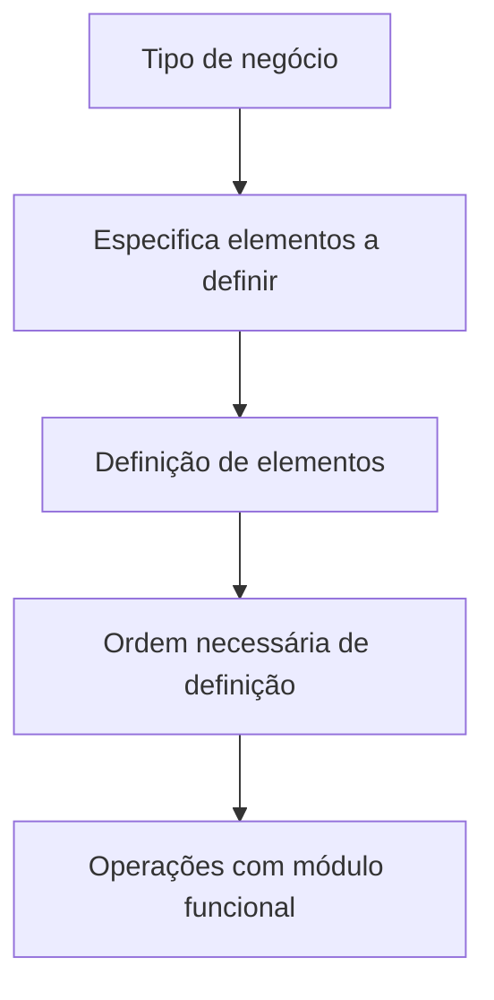

# Definición de Conceptos de Emisión para Operaciones con un Módulo Funcional

## 1. Metadados do Documento
- **Arquivo de Origem:** Não identificado
- **Tipo de Documento:** Não identificado; conteúdo aparenta ser documentação de conceitos funcionais
- **Domínio / Sistema:** Emissão; Home Solutions APIs Documentation Zeus; CF
- **Público-Alvo:** Não identificado
- **Data/Versão Identificada:** Não identificada

---

## 2. Resumo Executivo & Contexto de Negócio

O conteúdo apresenta uma definição de conceitos de emissão. O documento informa que determinados elementos precisam ser definidos, bem como a ordem necessária para que seja possível realizar operações com um módulo funcional.

A organização da documentação é orientada por tipo de negócio. Segundo o texto, o tipo de negócio especifica quais elementos devem ser definidos para a realização das operações.

O trecho também contém as referências textuais “CF”, “Home Solutions APIs Documentation Zeus” e “EN”. Contudo, o conteúdo não explica a função, expansão, relacionamento técnico ou escopo dessas referências.

> **Nota de Análise:** O conteúdo fornecido consiste em uma única página com descrição conceitual resumida. Não há detalhamento de APIs, métodos HTTP, contratos, componentes técnicos, ambientes, parâmetros operacionais ou fluxos completos.

---

## 3. Arquitetura, Componentes & Tecnologias Envolvidas

Os elementos identificados explicitamente no conteúdo são:

- Conceitos de emissão.
- Módulo funcional.
- Tipos de negócio.
- Referência “CF”.
- Referência “Home Solutions APIs Documentation Zeus”.
- Marcador “EN”.

O documento estabelece uma relação conceitual entre tipo de negócio, definição de elementos e realização de operações em um módulo funcional. Não há arquitetura de software, tecnologias, microsserviços, integrações, bancos de dados ou interfaces descritos.



> **Nota de Análise:** O diagrama representa exclusivamente a relação conceitual declarada no texto; não representa uma arquitetura técnica ou fluxo de integração.

---

## 4. Regras de Negócio, Especificações Funcionais & Processos

1. Para realizar operações com um módulo funcional, é necessário definir elementos.
2. A definição dos elementos exige o seguimento de uma ordem necessária.
3. A documentação é organizada por tipo de negócio.
4. Cada tipo de negócio especifica quais elementos devem ser definidos.

O conteúdo não informa:

- Quais são os tipos de negócio existentes.
- Quais elementos correspondem a cada tipo de negócio.
- Qual é a ordem concreta de definição dos elementos.
- Quais operações podem ser realizadas no módulo funcional.
- Quais validações, exceções, cálculos, permissões ou regras condicionais se aplicam.
- Qual é o significado operacional de “CF”, “Zeus” ou “EN”.

---

## 5. Tabelas de Parâmetros, Ambientes e Estruturas de Dados

| Item / Parâmetro | Descrição / Função | Tipo / Valores / Formato | Ambiente / Observações |
| :--- | :--- | :--- | :--- |
| Conceitos de emissão | Tema central apresentado no documento. | Não especificado | O documento não detalha os conceitos individuais. |
| Elementos a definir | Elementos necessários para permitir operações com um módulo funcional. | Não especificado | A lista de elementos não foi fornecida. |
| Ordem de definição | Ordem necessária para definição dos elementos. | Não especificada | A sequência concreta não foi fornecida. |
| Tipo de negócio | Critério de organização da documentação e especificação de elementos. | Não especificado | Os tipos de negócio não são enumerados. |
| Módulo funcional | Módulo no qual podem ser realizadas operações após as definições necessárias. | Não especificado | Não há nome, tecnologia ou funcionalidades detalhadas. |
| CF | Referência textual presente no documento. | `CF` | Significado não definido no conteúdo. |
| Home Solutions APIs Documentation Zeus | Referência textual presente no documento. | Texto | Não há explicação sobre produto, sistema ou documentação associada. |
| EN | Marcador textual presente no documento. | `EN` | Significado não definido no conteúdo. |

---

## 6. Bateria de Perguntas & Respostas para RAG (FAQ Sintético)

### P1: Qual é o objetivo da documentação de conceitos de emissão?
**R:** O objetivo declarado é definir os elementos e a ordem necessária para que possam ser realizadas operações com um módulo funcional.

### P2: O que deve ser definido antes de realizar operações com um módulo funcional?
**R:** O documento informa que elementos devem ser definidos previamente. Entretanto, o conteúdo não lista quais são esses elementos.

### P3: Por que a ordem de definição dos elementos é importante?
**R:** A ordem é apresentada como necessária para realizar operações com um módulo funcional. O documento não fornece a sequência concreta nem explica as consequências de executar as definições em outra ordem.

### P4: Como a documentação está organizada?
**R:** A documentação está organizada por tipo de negócio.

### P5: Qual é a relação entre tipo de negócio e elementos de emissão?
**R:** O tipo de negócio especifica quais elementos devem ser definidos. O conteúdo não apresenta os tipos de negócio nem o mapeamento entre cada tipo e seus respectivos elementos.

### P6: Quais operações estão disponíveis no módulo funcional?
**R:** O documento afirma que existem operações realizáveis com um módulo funcional, mas não identifica quais operações são suportadas.

### P7: O documento detalha APIs, endpoints ou contratos de integração?
**R:** Não. Embora o texto contenha a referência “Home Solutions APIs Documentation Zeus”, não há detalhes sobre APIs, endpoints, métodos HTTP, contratos JSON, autenticação ou fluxos de integração.

### P8: O que significa a sigla CF no documento?
**R:** O conteúdo apresenta a referência “CF”, mas não define sua expansão ou significado operacional.

### P9: O que é Zeus no contexto do documento?
**R:** “Zeus” aparece na expressão “Home Solutions APIs Documentation Zeus”. O documento não explica se Zeus é um sistema, produto, plataforma, ambiente ou repositório documental.

### P10: Existe informação sobre ambientes, servidores ou URLs?
**R:** Não. O conteúdo não fornece nomes de ambientes, URLs, servidores, portas, credenciais, rotas de log ou configurações técnicas.

### P11: Há detalhes sobre regras de validação ou critérios de negócio?
**R:** Há apenas a regra geral de que os elementos devem ser definidos em uma ordem necessária e que essa definição depende do tipo de negócio. Não há critérios de validação ou condições adicionais descritos.

---

## 7. Glossário de Termos, Siglas & Conceitos-Chave

- **Emisión:** Tema de emissão abordado pelo documento; não há definição adicional fornecida.
- **Módulo funcional:** Módulo no qual podem ser realizadas operações após a definição dos elementos necessários.
- **Tipo de negócio:** Critério que organiza a documentação e especifica quais elementos devem ser definidos.
- **CF:** Sigla ou referência textual presente no conteúdo; significado não definido.
- **Home Solutions APIs Documentation Zeus:** Referência textual presente no conteúdo; sem explicação adicional.
- **EN:** Marcador textual presente no conteúdo; significado não definido.

---

## 8. Notas Críticas, Riscos & Limitações

- O conteúdo não identifica o arquivo de origem, autor, data, versão ou público-alvo.
- Não há lista de tipos de negócio, elementos de emissão ou ordem de configuração.
- Não há detalhamento de regras funcionais, critérios de validação, exceções ou fluxos operacionais.
- Não há informação sobre APIs, contratos, tecnologias, ambientes, URLs, servidores ou logs.
- As referências “CF”, “Home Solutions APIs Documentation Zeus” e “EN” não possuem definição no trecho fornecido.
- Qualquer interpretação sobre sistemas, integrações, siglas ou procedimentos adicionais não é sustentada pelo conteúdo original.

---

## 9. Conteúdo Bruto Estruturado (Referência Fiel)

```text
--- [PÁGINA 1 DE 1] ---

DEFINICIÓN de CONCEPTOS de EMISIÓN
Elementos que se han de definir así como el orden necesario a seguir con el fin de poder
realizar operaciones con un módulo funcional. Esta documentación está organizada por tipo de
negocio ya que este, especifica qué elementos se definen.
TIPOS DE NEGOCIO
 
 
 
 / 
 CF
Home Solutions APIs Documentation Zeus
EN
```
