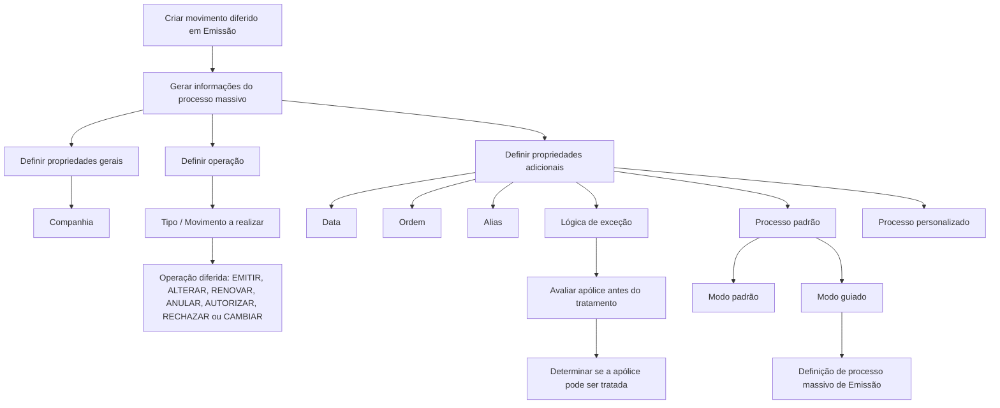

# Criação de Movimento Diferido em Emissão: Processo Massivo, Tipos de Operação e Propriedades

## 1. Metadados do Documento
- **Arquivo de Origem:** Não identificado — conteúdo bruto extraído fornecido pelo usuário
- **Tipo de Documento:** Especificação Técnica / Manual Funcional
- **Domínio / Sistema:** Emissão — criação de processos massivos e movimentos diferidos
- **Público-Alvo:** Analistas funcionais, desenvolvedores, operadores e equipes de negócio
- **Data/Versão Identificada:** Não identificada

---

## 2. Resumo Executivo & Contexto de Negócio

O documento descreve a ação **“Crear movimiento diferido en Emisión”**, apresentada como o primeiro passo obrigatório para criar um processo massivo. A ação gera as informações necessárias para executar posteriormente um movimento de forma diferida no contexto de emissão.

A definição de um processo massivo requer propriedades gerais, propriedades que determinam a operação e propriedades adicionais. As propriedades gerais identificam a companhia onde a operação será lançada, enquanto as propriedades de operação definem o tipo de movimento diferido a ser executado.

O documento lista movimentos para criação de propostas, apólices, aplicações, renovações, suplementos, cancelamentos por falta de pagamento, regularização de vida, suspensão de aportação pactada, recibos impagados e ações de controle técnico. Cada movimento está associado a uma ou mais operações, como **EMITIR**, **ALTERAR**, **RENOVAR**, **ANULAR**, **AUTORIZAR**, **RECHAZAR** ou **CAMBIAR recibo prima gestor**.

A configuração também admite data, ordem, alias, lógica de negócio de exceção, aplicação de processo padrão e processo personalizado. Esses atributos permitem diferenciar processos criados no mesmo dia, identificá-los funcionalmente, excluir elementos do tratamento massivo e selecionar entre modos de execução padrão ou guiado.

O conteúdo não detalha interfaces técnicas, APIs, métodos HTTP, contratos JSON, persistência de dados, integrações externas, mecanismos de execução assíncrona ou regras de autorização de usuários.

---

## 3. Arquitetura, Componentes & Tecnologias Envolvidas

O documento não apresenta tecnologias, servidores, URLs, microsserviços, bases de dados ou ferramentas de integração. A estrutura identificada é funcional e descreve a configuração de um processo massivo de emissão.

### Componentes funcionais identificados

| Componente | Função identificada |
| :--- | :--- |
| Ação “Crear movimiento diferido en Emisión” | Gera a informação necessária para executar um movimento de forma diferida. |
| Processo massivo | Processo criado a partir da ação obrigatória de criação de movimento diferido. |
| Companhia | Entidade na qual a operação diferida será lançada. |
| Tipo / Movimento a realizar | Determina a operação que será executada de forma diferida. |
| Data | Possui relevância variável conforme o tipo de operação. |
| Ordem | Diferencia mais de um processo massivo criado na mesma data. |
| Alias | Descrição funcional do processo massivo definido. |
| Objeto exceção | Lógica de negócio que determina elementos excluídos do processo. |
| Processo padrão | Define o modo padrão de criação do processo massivo: padrão ou guiado. |
| Processo personalizado | Chave que vincula um processo personalizado ao processo massivo criado. |
| Definição de processo massivo de Emissão | Necessária para o modo guiado. |



> **Nota de Análise:** O documento descreve relações funcionais entre propriedades e operações, mas não fornece uma arquitetura técnica de software, contratos de integração ou componentes de infraestrutura.

---

## 4. Regras de Negócio, Especificações Funcionais & Processos

### 4.1. Criação de movimento diferido

1. A ação de criar movimento diferido em Emissão constitui o primeiro passo para criar um processo massivo.
2. A realização dessa ação é obrigatória.
3. A ação gera as informações necessárias para permitir a execução diferida de um movimento.
4. A configuração deve indicar informações para propriedades gerais, propriedades que determinam a operação e propriedades adicionais à operação.

### 4.2. Propriedade geral: Companhia

- A propriedade **Compañía** identifica a entidade na qual a operação diferida será lançada.

### 4.3. Propriedade de operação: Movimento a realizar

A propriedade **Movimiento a realizar** determina qual operação será executada de forma diferida. Os movimentos documentados são:

- **Carga de presupuesto:** gera uma nova proposta e executa a operação **EMITIR presupuesto**.
- **Carga de póliza:** gera uma nova apólice e executa a operação **EMITIR póliza**.
- **Carga de aplicación:** gera uma nova apólice com as condições de sua apólice marco e executa a operação **EMITIR aplicación**.
- **Conversión de renovaciones:** gera uma nova apólice simulando o processo de renovação; embora uma nova apólice seja criada, a operação executada é **RENOVAR póliza**, e não criar apólice.
- **Presupuesto de suplemento:** gera uma proposta de nova modificação e executa **EMITIR presupuesto de suplemento**.
- **Presupuesto de suplemento aplicación:** gera uma proposta de nova modificação de aplicação e executa **EMITIR declaración**.
- **Suplemento:** gera uma nova modificação para uma apólice e executa **ALTERAR póliza**.
- **Suplemento de aplicación:** gera uma nova modificação para uma aplicação e executa **ALTERAR aplicación**.
- **Renovación:** gera um novo período de vigência para uma apólice e executa **RENOVAR póliza**.
- **Anulación por falta de pago:** gera um ou vários suplementos por apólice que cancelam total ou parcialmente a apólice, suplemento ou suplementos quando recibos de novas apólices ou novos suplementos não foram pagos pelo cliente.
- **Alterar póliza desde presupuesto:** gera uma nova modificação de apólice usando as informações contidas em um orçamento de suplemento e executa **ALTERAR póliza**.
- **Alterar aplicación desde presupuesto:** gera uma nova modificação de aplicação usando as informações contidas em um orçamento de suplemento e executa **ALTERAR aplicación**.
- **Autoriza o rechaza control técnico póliza:** permite autorizar ou rejeitar apólices/aplicações com erros, quando uma pessoa deve decidir se a operação será permitida.
- **Autoriza o rechaza control técnico presupuesto:** permite autorizar ou rejeitar orçamentos com erros, quando uma pessoa deve decidir se a operação será permitida.
- **Autoriza o rechaza control técnico pre-renovación:** permite autorizar ou rejeitar pré-renovações com erros, quando uma pessoa deve decidir se a operação será permitida.
- **Regularización vida:** gera uma nova modificação para uma apólice, permitindo o cálculo do prêmio de risco em apólices Unit Linked; executa **ALTERAR póliza**.
- **Suspensión aportación pactada:** gera uma nova modificação de apólice para suspender o plano periódico de aportação quando existe determinado número de aportações não pagas pelo cliente; executa **ALTERAR póliza**.
- **Recibos impagados:** altera o gestor de cobrança de um ou vários recibos por apólice devido ao não pagamento; executa **CAMBIAR recibo prima gestor**.

### 4.4. Regras específicas para anulação por falta de pagamento

O processo **Anulación por falta de pago** pode gerar as seguintes operações:

- **ANULAR póliza**
- **ANULAR aplicación**
- **ANULAR póliza modificación**
- **ANULAR aplicación modificación**

O processo pode cancelar:

- Totalmente a apólice.
- Parcialmente um suplemento ou vários suplementos.

A causa descrita é a falta de pagamento de recibos gerados tanto para novas apólices quanto para novos suplementos.

### 4.5. Regras específicas para controles técnicos

#### Controle técnico de apólice

O processo **Autoriza o rechaza control técnico póliza** pode gerar:

- **AUTORIZAR póliza**
- **AUTORIZAR aplicación**
- **RECHAZAR póliza**
- **RECHAZAR aplicación**

#### Controle técnico de orçamento

O processo **Autoriza o rechaza control técnico presupuesto** pode gerar:

- **AUTORIZAR presupuesto**
- **AUTORIZAR declaración**
- **RECHAZAR presupuesto**
- **RECHAZAR declaración**

#### Controle técnico de pré-renovação

O processo **Autoriza o rechaza control técnico pre-renovación** pode gerar:

- **AUTORIZAR pre-renovación**
- **RECHAZAR pre-renovación**

### 4.6. Regras relativas à data

A relevância da propriedade **Fecha** depende da operação configurada.

- Para **Cancelación por falta de pago**, a data indica o dia em que um recibo deve estar cobrado. Se o recibo não estiver cobrado nessa data, ele passa ao processo de cancelamento.
- Para **Renovación**, a data determina quando a apólice deve estar vencida. Se uma apólice estiver vencida nessa data, ela passa ao processo de renovação.

### 4.7. Regras relativas à ordem

- O sistema permite criar mais de um processo massivo na mesma data.
- A propriedade **Orden** diferencia um processo de outro quando ambos são criados no mesmo dia.
- O valor **0** é reservado e não deve ser utilizado.

### 4.8. Regras relativas ao alias

- A propriedade **Alias** permite criar uma descrição para que o processo massivo definido contenha informação concreta.
- O documento apresenta como exemplo um processo massivo de renovação da carteira de agosto, que poderia receber o alias **“Renovación de agosto”**.

### 4.9. Lógica de negócio de exceção

- A propriedade **Lógica de negocio de excepción (Objeto excepción)** permite associar uma lógica de negócio ao processo massivo.
- A lógica é responsável por determinar os elementos que serão excluídos do processo definido.
- Em uma renovação massiva de carteira, essa lógica pode excluir a carteira de um cliente que será estudada e renovada manualmente.
- A lógica é executada imediatamente antes do tratamento da apólice.
- Em um processo massivo de renovação, a lógica é executada antes da renovação da apólice.
- A lógica deve determinar se a apólice pode ou não ser tratada no processo massivo.

### 4.10. Modos de criação do processo massivo

O sistema admite dois modos de criação de processo massivo:

1. **Estándar**
   - Processo livre.
   - Cada usuário determina quais passos realiza e em qual ordem, quando a ordenação puder ser estabelecida.

2. **Guiado**
   - Processo guiado que determina especificamente os passos a seguir.
   - Requer uma **DEFINICIÓN de proceso masivo de Emisión**.

### 4.11. Processo personalizado

- A propriedade **Proceso personalizado** é a chave que vincula ao processo massivo o processo personalizado associado.
- Esse atributo determina o modo que o processo massivo seguirá.

---

## 5. Tabelas de Parâmetros, Ambientes e Estruturas de Dados

| Item / Parâmetro | Descrição / Função | Tipo / Valores / Formato | Ambiente / Observações |
| :--- | :--- | :--- | :--- |
| Compañía | Entidade na qual será lançada a operação diferida. | Entidade / companhia | Não detalhado. |
| Movimiento a realizar | Determina a operação executada de forma diferida. | Lista de movimentos massivos documentados | A operação correspondente depende do movimento selecionado. |
| Fecha | Data com relevância dependente da operação. | Data | Usada para cancelamento por falta de pagamento e renovação, conforme regras específicas. |
| Orden | Diferencia processos massivos criados na mesma data. | Valor numérico; `0` reservado | O valor `0` não deve ser utilizado. |
| Alias | Descrição concreta para identificar o processo massivo. | Texto descritivo | Exemplo documentado: “Renovación de agosto”. |
| Objeto excepción | Associa lógica de negócio para excluir elementos do processo massivo. | Lógica de negócio | Executada imediatamente antes de tratar a apólice. |
| Proceso estándar | Define o modo de criação do processo massivo. | `Estándar` ou `Guiado` | O modo guiado requer definição de processo massivo de Emissão. |
| Proceso personalizado | Chave de associação de processo personalizado. | Chave | Determina o modo seguido pelo processo massivo. |

### Movimentos e operações associadas

| Movimento | Resultado funcional | Operação executada |
| :--- | :--- | :--- |
| CARGA DE PRESUPUESTO | Gera uma nova proposta. | EMITIR presupuesto |
| CARGA DE PÓLIZA | Gera uma nova apólice. | EMITIR póliza |
| CARGA DE APLICACIÓN | Gera uma nova apólice com condições da apólice marco. | EMITIR aplicación |
| CONVERSIÓN DE RENOVACIONES | Gera nova apólice simulando renovação. | RENOVAR póliza |
| PRESUPUESTO DE SUPLEMENTO | Gera proposta de nova modificação. | EMITIR presupuesto de suplemento |
| PRESUPUESTO DE SUPLEMENTO APLICACIÓN | Gera proposta de nova modificação de aplicação. | EMITIR declaración |
| SUPLEMENTO | Gera nova modificação em apólice. | ALTERAR póliza |
| SUPLEMENTO DE APLICACIÓN | Gera nova modificação em aplicação. | ALTERAR aplicación |
| RENOVACIÓN | Gera novo período de vigência da apólice. | RENOVAR póliza |
| ANULACIÓN POR FALTA DE PAGO | Cancela total ou parcialmente apólice, suplemento ou suplementos por falta de pagamento. | ANULAR póliza; ANULAR aplicación; ANULAR póliza modificación; ANULAR aplicación modificación |
| ALTERAR PÓLIZA DESDE PRESUPUESTO | Gera modificação de apólice a partir de orçamento de suplemento. | ALTERAR póliza |
| ALTERAR APLICACIÓN DESDE PRESUPUESTO | Gera modificação de aplicação a partir de orçamento de suplemento. | ALTERAR aplicación |
| AUTORIZA O RECHAZA CONTROL TÉCNICO PÓLIZA | Autoriza ou rejeita apólices/aplicações com erros. | AUTORIZAR póliza; AUTORIZAR aplicación; RECHAZAR póliza; RECHAZAR aplicación |
| AUTORIZA O RECHAZA CONTROL TÉCNICO PRESUPUESTO | Autoriza ou rejeita orçamentos com erros. | AUTORIZAR presupuesto; AUTORIZAR declaración; RECHAZAR presupuesto; RECHAZAR declaración |
| AUTORIZA O RECHAZA CONTROL TÉCNICO PRE-RENOVACIÓN | Autoriza ou rejeita pré-renovações com erros. | AUTORIZAR pre-renovación; RECHAZAR pre-renovación |
| REGULARIZACIÓN VIDA | Gera modificação para cálculo de prêmio de risco em Unit Linked. | ALTERAR póliza |
| SUSPENSIÓN APORTACIÓN PACTADA | Suspende plano periódico de aportação após aportações não pagas. | ALTERAR póliza |
| RECIBOS IMPAGADOS | Altera gestor de cobrança de recibos não pagos. | CAMBIAR recibo prima gestor |

---

## 6. Bateria de Perguntas & Respostas para RAG (FAQ Sintético)

### P1: Qual é o objetivo da ação “Crear movimiento diferido en Emisión”?
**R:** A ação “Crear movimiento diferido en Emisión” gera as informações necessárias para realizar um movimento de forma diferida. Segundo o documento, essa ação é o primeiro passo e é obrigatória para criar um processo massivo.

### P2: Quais propriedades devem ser informadas ao criar um processo massivo?
**R:** O documento organiza as propriedades em três grupos: propriedades gerais, propriedades que determinam a operação a realizar e propriedades adicionais à operação. Entre os atributos descritos estão companhia, movimento a realizar, data, ordem, alias, lógica de negócio de exceção, processo padrão e processo personalizado.

### P3: Para que serve a propriedade Compañía?
**R:** A propriedade Compañía identifica a entidade na qual a operação em diferido será lançada.

### P4: Qual operação é executada pela conversão de renovações?
**R:** A conversão de renovações gera uma nova apólice simulando um processo de renovação. Embora uma nova apólice seja criada, a operação executada é RENOVAR póliza, e não CRIAR póliza.

### P5: O que acontece no processo de anulação por falta de pagamento?
**R:** O processo gera um ou vários suplementos por apólice para cancelar totalmente a apólice ou parcialmente um suplemento ou suplementos, quando recibos originados por novas apólices ou novos suplementos não foram pagos pelo cliente. As operações possíveis são ANULAR póliza, ANULAR aplicación, ANULAR póliza modificación e ANULAR aplicación modificación.

### P6: Como a data é utilizada na cancelamento por falta de pagamento?
**R:** No processo de cancelamento por falta de pagamento, a data indica o dia em que um recibo deve estar cobrado. Caso o recibo não esteja cobrado nessa data, ele passa para o processo de cancelamento.

### P7: Como a data é utilizada no processo de renovação?
**R:** No processo de renovação, a data determina quando a apólice deve estar vencida. Se uma apólice estiver vencida nessa data, ela passa ao processo de renovação.

### P8: Qual é a finalidade da propriedade Orden?
**R:** A propriedade Orden permite diferenciar processos massivos criados na mesma data. O sistema permite mais de um processo massivo no mesmo dia, mas o valor zero é reservado e não deve ser utilizado.

### P9: Quando a lógica de negócio de exceção é executada?
**R:** A lógica de negócio de exceção é executada imediatamente antes de tratar a apólice. Em um processo massivo de renovação, por exemplo, a lógica é executada antes de renovar a apólice e deve determinar se a apólice pode ou não ser tratada no processo massivo.

### P10: Qual é a finalidade do Objeto excepción?
**R:** O Objeto excepción permite associar uma lógica de negócio que determina quais elementos serão excluídos do processo massivo. O documento exemplifica a exclusão de uma carteira de cliente que será objeto de estudo e renovação manual.

### P11: Quais são os modos disponíveis para criar um processo massivo?
**R:** O sistema permite dois modos: Estándar e Guiado. No modo Estándar, o processo é livre e cada usuário define os passos e, quando possível, sua ordem. No modo Guiado, os passos são determinados especificamente e é necessária uma DEFINICIÓN de proceso masivo de Emisión.

### P12: O que determina a propriedade Proceso personalizado?
**R:** A propriedade Proceso personalizado é uma chave que vincula ao processo massivo o processo personalizado associado. Esse atributo determina o modo que o processo massivo seguirá.

### P13: O que é executado pelo processo Recibos impagados?
**R:** O processo Recibos impagados altera o gestor de cobrança de um ou vários recibos por apólice devido ao não pagamento desses recibos. A operação executada é CAMBIAR recibo prima gestor.

---

## 7. Glossário de Termos, Siglas & Conceitos-Chave

- **Alias:** Descrição que adiciona informação concreta ao processo massivo definido.
- **Anulación por falta de pago:** Processo que cancela total ou parcialmente apólice, suplemento ou suplementos por falta de pagamento de recibos.
- **Aplicación:** Entidade funcional citada em operações de emissão, alteração, anulação, autorização e rejeição.
- **Compañía:** Entidade na qual a operação diferida será lançada.
- **Control técnico:** Processo de autorização ou rejeição de apólices, aplicações, orçamentos ou pré-renovações que apresentam erros.
- **Declaración:** Operação citada para emissão, autorização ou rejeição no contexto de aplicação/orçamento.
- **Emisión:** Contexto funcional da criação de movimentos diferidos e processos massivos.
- **Fecha:** Data cuja relevância depende da operação configurada.
- **Movimiento diferido:** Movimento configurado para execução posterior.
- **Objeto excepción:** Lógica de negócio associada a um processo massivo para determinar elementos excluídos.
- **Orden:** Propriedade que diferencia processos massivos criados na mesma data.
- **Póliza:** Apólice; entidade tratada por operações de emissão, alteração, renovação, anulação, autorização e rejeição.
- **Presupuesto:** Proposta ou orçamento tratado por operações de emissão, autorização ou rejeição.
- **Proceso estándar:** Modo padrão de criação de processo massivo, podendo ser Estándar ou Guiado.
- **Proceso masivo:** Processo criado a partir da ação obrigatória de criar movimento diferido.
- **Proceso personalizado:** Chave que vincula o processo personalizado associado ao processo massivo.
- **Recibo:** Elemento de cobrança cujo pagamento pode influenciar cancelamentos ou alteração de gestor de cobrança.
- **Renovación:** Processo que gera um novo período de vigência para uma apólice.
- **Suplemento:** Nova modificação de uma apólice ou aplicação.
- **Unit Linked:** Tipo de apólice citado no processo Regularización Vida, no qual é permitido o cálculo da prima de risco.

---

## 8. Notas Críticas, Riscos & Limitações

- O valor **0** para a propriedade **Orden** é reservado e não deve ser utilizado.
- A lógica de exceção precisa determinar corretamente se uma apólice pode ser tratada no processo massivo, pois é executada imediatamente antes do tratamento da apólice.
- A data possui semântica operacional dependente do movimento configurado; para cancelamento por falta de pagamento, ela é a data-limite de cobrança, enquanto para renovação ela representa a data em que a apólice deve estar vencida.
- O modo guiado depende de uma **DEFINICIÓN de proceso masivo de Emisión**.
- O documento não detalha critérios para a quantidade de aportações não pagas necessária para acionar a suspensão de aportação pactada.
- O documento não especifica o conteúdo, formato, implementação ou mecanismo de associação da lógica de negócio de exceção.
- O documento não informa como processos massivos são agendados, executados, monitorados, cancelados ou auditados.
- O documento não apresenta APIs, URLs, ambientes, tecnologias, integrações, modelos de dados ou permissões de acesso.
- **Nota de Análise:** O conteúdo descreve regras funcionais e movimentos de negócio, mas não detalha métodos HTTP, contratos JSON, eventos, filas, persistência ou componentes técnicos responsáveis pela execução diferida.

---

## 9. Conteúdo Bruto Estruturado (Referência Fiel)

```text
--- [PÁGINA 1 DE 6] ---

CREAR movimiento diferido en Emisión
(enlace con visión técnica)
¿En que consiste?
Esta acción supone el primer paso que se debe realizar para crear un proceso masivo. Esta acción
además, es obligatoria realizarla.
Objetivo
Genera la información necesaria que permitirá realizar un movimiento que se ejecutará de forma
diferida.
Proceso a seguir
En este caso hay indicar información a las siguientes propiedades:
 /
 CF
Home Solutions APIs Documentation Zeus
EN


--- [PÁGINA 2 DE 6] ---

Propiedades generales
Propiedades que determinan la operación a realizar
Propiedades adicionales a la operación
Propiedades generales
Compañía
Entidad en la que se lanzará la operación en diferido.
Propiedades que determinan la operación a realizar (Tipo)
Movimiento a realizar
Determina la operación que se realizará en diferido. Los posibles movimientos se encuentran
detalladas a continuación.
CARGA DE PRESUPUESTO
Genera un nueva propuesta, por lo que la operación que se ejecuta es EMITIR presupuesto.
CARGA DE PÓLIZA


--- [PÁGINA 3 DE 6] ---

Genera una nueva póliza. La operación que se ejecuta es EMITIR póliza.
CARGA DE APLICACIÓN
Genera una nueva póliza con las condiciones de su póliza marco. La operación que se ejecuta es
EMITIR aplicación.
CONVERSIÓN DE RENOVACIONES
Genera una póliza nueva simulando el proceso de renovación. Esto significa que, aunque se crea
una nueva póliza, la operación que se ejecuta no es de CREAR póliza, sino que se ejecuta la
operación RENOVAR póliza.
PRESUPUESTO DE SUPLEMENTO
Genera una propuesta de nueva modificación. La operación que se ejecuta es EMITIR presupuesto
de suplemento.
PRESUPUESTO DE SUPLEMENTO APLICACIÓN
Genera una propuesta de nueva modificación de aplicación. La operación que se ejecuta es EMITIR
declaración.
SUPLEMENTO
Genera una nueva modificación a una póliza. La operación que se ejecuta es ALTERAR póliza.
SUPLEMENTO DE APLICACIÓN
Genera una nueva modificación a una aplicación. La operación que se ejecuta es ALTERAR
aplicación.
RENOVACIÓN
Genera un nuevo periodo de vigencia a una póliza. La operación que se ejecuta es RENOVAR
póliza.
ANULACIÓN POR FALTA DE PAGO
Genera uno o varios suplementos (por póliza),que cancelan total (la póliza) o parcialmente (el
suplemento o los suplementos) la póliza debido a que los recibos generados tanto por nuevas
pólizas, como por nuevos suplementos, el cliente no los ha pagado. Este proceso puede generar
distintas operaciones:
ANULAR póliza
ANULAR aplicación
ANULAR póliza modificación
ANULAR aplicación modificación
ALTERAR PÓLIZA DESDE PRESUPUESTO


--- [PÁGINA 4 DE 6] ---

Genera una nueva modificación a una póliza con la información contenida en un presupuesto de un
suplemento. La operación que se ejecuta es ALTERAR póliza.
ALTERAR APLICACIÓN DESDE PRESUPUESTO
Genera una nueva modificación de una aplicación con la información contenida en un presupuesto
de un suplemento. La operación que se ejecuta es ALTERAR aplicación.
AUTORIZA O RECHAZA CONTROL TÉCNICO PÓLIZA
Permite la autorización o el rechazo de aquellas pólizas/aplicaciones que tienen errores y estos
errores cuando se producen, alguna persona debe determinar si se permite o no la operación. El
proceso puede generar distintas operaciones:
AUTORIZAR póliza
AUTORIZAR aplicación
RECHAZAR póliza
RECHAZAR aplicación
AUTORIZA O RECHAZA CONTROL TÉCNICO PRESUPUESTO
Permite la autorización o el rechazo de aquellos presupuestos que tienen errores y estos errores
cuando se producen, alguna persona debe determinar si se permite o no la operación. El proceso
puede generar distintas operaciones:
AUTORIZAR presupuesto
AUTORIZAR declaración
RECHAZAR presupuesto
RECHAZAR declaración
AUTORIZA O RECHAZA CONTROL TÉCNICO PRE-RENOVACIÓN
Permite la autorización o el rechazo de aquellas renovaciones previas que tienen errores y estos
errores cuando se producen, alguna persona debe determinar si se permite o no la operación. El
proceso puede generar distintas operaciones:
AUTORIZAR pre-renovación
RECHAZAR pre-renovación
REGULARIZACIÓN VIDA
Genera una nueva modificación a una póliza que permite el cálculo de la prima de riego en pólizas de
Unit Linked. La operación que se ejecuta es ALTERAR póliza.
SUSPENSIÓN APORTACIÓN PACTADA


--- [PÁGINA 5 DE 6] ---

Genera una nueva modificación a una póliza suspendiendo el plan de aportación periódico cuando
existe un número de aportaciones que el cliente no ha pagado. La operación que se ejecuta es
ALTERAR póliza.
RECIBOS IMPAGADOS
Realiza el cambio de gestor de cobro a uno o varios recibos (por póliza) debido a que dichos recibos
no han sido pagados. La operación que se ejecuta es CAMBIAR recibo prima gestor
Fecha
Esta fecha dependiendo de la operación a realizar tiene mayor o menor relevancia a la hora de
detallarla.
Por ejemplo, para el proceso:
Cancelación por falta de pago. Indica el día en el que un recibo debe estar cobrado. Si un recibo
no se encuentra cobrado a esa fecha, pasará al proceso de cancelación.
Renovación. Determina cuando la póliza debe estar vencida. Si una póliza está vencida a esa
fecha, pasa al proceso de renovación
Propiedades adicionales a la operación
Orden
El sistema permite crear más de un proceso masivo en una misma fecha. Esta propiedad es la que
diferencia un proceso de otro en un mismo día. El valor cero (0) está reservado y no se debe utilizar.
Alias
Permite crear una descripción que haga que el proceso masivo definido contenga información
concreta.
Por ejemplo, si se define un proceso masivo que renueve la cartera del mes de agosto, se puede
especificar esta propiedad con esta información (Renovación de agosto).
Lógica de negocio de excepción (Objeto excepción)
En este punto se puede asociar una lógica de negocio. Esta lógica estará encargada de determinar
que elementos se excluyen del proceso que se está definiendo.
Por ejemplo, si se va a crear un proceso masivo con la renovación de la cartera de un mes y se
desea que la cartera de un cliente quede excepcionada del proceso masivo porque se va a realizar
un estudio y posterior renovación manual, se puede utilizar una lógica que haga esta tarea.
Esta lógica será lanzada justo antes de tratar la póliza. Es decir, si se está ejecutando un proceso
masivo de renovación, esta lógica será lanzada antes de renovar la póliza. La lógica debe determinar


--- [PÁGINA 6 DE 6] ---

si la póliza puede o no tratarse en el proceso masivo.
Aplica proceso estándar (Proceso estándar)
El sistema permite dos modos en la creación de un proceso masivo:
Estándar: Este proceso es libre. Cada usuario determina que pasos y en que orden (si se puede
establecer) realiza la creación del proceso masivo
Guiado: Este proceso, como su nombre indica está guiado y determina específicamente que
pasos hay que seguir. para ello, necesita de una DEFINICIÓN de proceso masivo de Emisión
Proceso personalizado
Clave que enlaza el proceso personalizado que se asoció a proceso masivo que se está creando.
Este atributo determina el modo que seguirá este proceso masivo.
```
