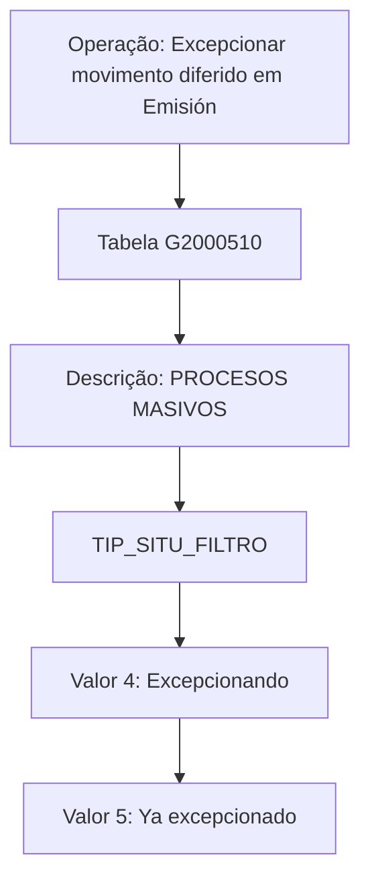

# Exceção de Movimento Diferido em Emissão — Visão Técnica e Modelo de Dados

## 1. Metadados do Documento
- **Arquivo de Origem:** Não identificado no conteúdo fornecido
- **Tipo de Documento:** Especificação Técnica
- **Domínio / Sistema:** Emissão; processos massivos
- **Público-Alvo:** Desenvolvedores, Arquitetos e Operação
- **Data/Versão Identificada:** Não identificada

---

## 2. Resumo Executivo & Contexto de Negócio

O documento descreve a visão técnica para **excepcionar movimento diferido em Emissão**. O conteúdo concentra-se no modelo de dados envolvido na operação e identifica a tabela `G2000510`, descrita como **PROCESOS MASIVOS**.

A especificação apresenta os campos da tabela `G2000510` e indica, para cada coluna, se ocorre mudança de valor, o valor/motivo aplicável e se o preenchimento é obrigatório. A maior parte dos campos listados não muda de valor e possui valor/motivo `N.A.`.

A exceção possui uma regra explícita para `TIP_SITU_FILTRO`: o campo assume diferentes valores conforme o momento da operação. Durante a exceção, o valor é `4 - Excepcionando`; após a conclusão, o valor é `5 - Ya excepcionado`.

O texto menciona `CF`, `Home Solutions APIs Documentation Zeus` e `EN`, mas não apresenta contexto suficiente para estabelecer relações arquiteturais, contratos de API, métodos HTTP, URLs, ambientes ou responsabilidades desses termos.

---

## 3. Arquitetura, Componentes & Tecnologias Envolvidas

| Componente / Termo | Papel sustentado pelo documento | Detalhamento disponível |
| :--- | :--- | :--- |
| Emisión | Contexto da operação de exceção de movimento diferido | Não detalhado |
| `G2000510` | Tabela envolvida na operação | Descrita como `PROCESOS MASIVOS` |
| `TIP_SITU_FILTRO` | Campo que representa a situação/filtro da operação | Possui valores de estado `4` e `5` |
| `CF` | Termo presente na extração | Não detalhado |
| Home Solutions APIs Documentation Zeus | Texto presente na extração | Não detalhado |
| `EN` | Termo presente na extração | Não detalhado |



> **Nota de Análise:** O documento identifica a tabela `G2000510`, porém não detalha tecnologia de banco de dados, chaves, relacionamentos, transações, processos executores, APIs ou contratos de integração.

---

## 4. Regras de Negócio, Especificações Funcionais & Processos

1. A operação analisada é denominada **“Excepcionar movimiento diferido en Emisión”**.
2. A tabela envolvida na operação é `G2000510`, com a descrição `PROCESOS MASIVOS`.
3. As colunas `COD_CIA`, `FEC_TRATAMIENTO`, `NUM_ORDEN`, `TIP_MVTO_BATCH`, `MCA_RECALCULA_FECHA` e `COD_USR` são indicadas como obrigatórias.
4. As colunas `TXT_ALIAS`, `NOM_PRG_EXCEPCION`, `TIP_FECHA_BASE`, `FEC_ACTU`, `TXT_MCA_PROCESO_ESTANDAR` e `IDN_PROCESO_PERSONALIZADO` são indicadas como não obrigatórias.
5. Para os campos listados, a coluna **CAMBIA VALOR** possui valor `N`, exceto para `TIP_SITU_FILTRO`, que possui valor `S`.
6. Para `TIP_SITU_FILTRO`, o valor depende do momento operacional:
   - Durante a exceção: `4 - Excepcionando`.
   - Posteriormente: `5 - Ya excepcionado`.
7. Para os demais campos, o documento registra `N.A.` em **MOTIVO/VALOR**, sem especificar valor alternativo, regra de cálculo ou mecanismo de atualização.

---

## 5. Tabelas de Parâmetros, Ambientes e Estruturas de Dados

| Item / Parâmetro | Descrição / Função | Tipo / Valores / Formato | Ambiente / Observações |
| :--- | :--- | :--- | :--- |
| `G2000510` | Tabela envolvida na operação | `PROCESOS MASIVOS` | Não informado |
| `COD_CIA` | Coluna da tabela `G2000510` | Cambia valor: `N`; motivo/valor: `N.A.`; obrigatória: `SI` | Não informado |
| `FEC_TRATAMIENTO` | Coluna da tabela `G2000510` | Cambia valor: `N`; motivo/valor: `N.A.`; obrigatória: `SI` | Não informado |
| `NUM_ORDEN` | Coluna da tabela `G2000510` | Cambia valor: `N`; motivo/valor: `N.A.`; obrigatória: `SI` | Não informado |
| `TIP_MVTO_BATCH` | Coluna da tabela `G2000510` | Cambia valor: `N`; motivo/valor: `N.A.`; obrigatória: `SI` | Não informado |
| `TXT_ALIAS` | Coluna da tabela `G2000510` | Cambia valor: `N`; motivo/valor: `N.A.`; obrigatória: `NO` | Não informado |
| `TIP_SITU_FILTRO` | Situação/filtro da operação | Cambia valor: `S`; `4 - Excepcionando`; `5 - Ya excepcionado`; obrigatória: `SI` | Valores dependem do momento da operação |
| `NOM_PRG_EXCEPCION` | Coluna da tabela `G2000510` | Cambia valor: `N`; motivo/valor: `N.A.`; obrigatória: `NO` | Não informado |
| `MCA_RECALCULA_FECHA` | Coluna da tabela `G2000510` | Cambia valor: `N`; motivo/valor: `N.A.`; obrigatória: `SI` | Não informado |
| `TIP_FECHA_BASE` | Coluna da tabela `G2000510` | Cambia valor: `N`; motivo/valor: `N.A.`; obrigatória: `NO` | Não informado |
| `COD_USR` | Coluna da tabela `G2000510` | Cambia valor: `N`; motivo/valor: `N.A.`; obrigatória: `SI` | Não informado |
| `FEC_ACTU` | Coluna da tabela `G2000510` | Cambia valor: `N`; motivo/valor: `N.A.`; obrigatória: `NO` | Não informado |
| `TXT_MCA_PROCESO_ESTANDAR` | Coluna da tabela `G2000510` | Cambia valor: `N`; motivo/valor: `N.A.`; obrigatória: `NO` | Não informado |
| `IDN_PROCESO_PERSONALIZADO` | Coluna da tabela `G2000510` | Cambia valor: `N`; motivo/valor: `N.A.`; obrigatória: `NO` | Não informado |

---

## 6. Bateria de Perguntas & Respostas para RAG (FAQ Sintético)

### P1: Qual tabela participa da operação de exceção de movimento diferido em Emissão?
**R:** A tabela identificada no documento é `G2000510`, descrita como `PROCESOS MASIVOS`.

### P2: Qual campo registra o estado da exceção na tabela `G2000510`?
**R:** O campo `TIP_SITU_FILTRO` registra a situação/filtro da operação. O documento indica que esse campo muda de valor conforme o momento da exceção.

### P3: Qual é o valor de `TIP_SITU_FILTRO` durante a execução da exceção?
**R:** Durante a exceção, `TIP_SITU_FILTRO` deve assumir o valor `4 - Excepcionando`.

### P4: Qual é o valor de `TIP_SITU_FILTRO` após a exceção?
**R:** Posteriormente à exceção, `TIP_SITU_FILTRO` deve assumir o valor `5 - Ya excepcionado`.

### P5: Quais campos obrigatórios são listados para a operação em `G2000510`?
**R:** O documento marca como obrigatórios `COD_CIA`, `FEC_TRATAMIENTO`, `NUM_ORDEN`, `TIP_MVTO_BATCH`, `TIP_SITU_FILTRO`, `MCA_RECALCULA_FECHA` e `COD_USR`.

### P6: Quais campos não obrigatórios são listados na tabela `G2000510`?
**R:** O documento marca como não obrigatórios `TXT_ALIAS`, `NOM_PRG_EXCEPCION`, `TIP_FECHA_BASE`, `FEC_ACTU`, `TXT_MCA_PROCESO_ESTANDAR` e `IDN_PROCESO_PERSONALIZADO`.

### P7: Quais colunas possuem indicação de que não mudam de valor?
**R:** As colunas `COD_CIA`, `FEC_TRATAMIENTO`, `NUM_ORDEN`, `TIP_MVTO_BATCH`, `TXT_ALIAS`, `NOM_PRG_EXCEPCION`, `MCA_RECALCULA_FECHA`, `TIP_FECHA_BASE`, `COD_USR`, `FEC_ACTU`, `TXT_MCA_PROCESO_ESTANDAR` e `IDN_PROCESO_PERSONALIZADO` possuem `N` na coluna **CAMBIA VALOR**.

### P8: O documento informa quais APIs ou métodos HTTP são utilizados na exceção?
**R:** Não. Embora a extração contenha o texto `Home Solutions APIs Documentation Zeus`, o documento não apresenta APIs, endpoints, métodos HTTP, contratos JSON ou mecanismos de integração associados à operação.

### P9: O documento define o significado técnico das siglas e nomes de coluna?
**R:** Não. O documento lista nomes como `COD_CIA`, `COD_USR`, `MCA_RECALCULA_FECHA` e `IDN_PROCESO_PERSONALIZADO`, mas não fornece expansão, tipo de dado, domínio de valores ou semântica técnica adicional.

---

## 7. Glossário de Termos, Siglas & Conceitos-Chave

- **Emisión:** Contexto no qual ocorre a operação de exceção de movimento diferido.
- **`G2000510`:** Tabela envolvida na operação, descrita como `PROCESOS MASIVOS`.
- **PROCESOS MASIVOS:** Descrição atribuída à tabela `G2000510`.
- **`TIP_SITU_FILTRO`:** Coluna cuja situação/valor varia durante a operação de exceção.
- **Excepcionando:** Estado associado ao valor `4` de `TIP_SITU_FILTRO`.
- **Ya excepcionado:** Estado associado ao valor `5` de `TIP_SITU_FILTRO`.
- **`N.A.`:** Valor exibido no documento para campos sem motivo/valor especificado.
- **`SI` / `NO`:** Indicadores de obrigatoriedade apresentados no documento.
- **`CF`:** Termo citado na extração sem definição.
- **Home Solutions APIs Documentation Zeus:** Texto citado na extração sem descrição funcional ou técnica.
- **`EN`:** Termo citado na extração sem definição.

---

## 8. Notas Críticas, Riscos & Limitações

- O documento não informa o nome do arquivo de origem, autor, versão ou data.
- Não há definição de tipos de dados, tamanho de colunas, chaves primárias, índices, chaves estrangeiras ou relacionamentos da tabela `G2000510`.
- Não são descritos o mecanismo técnico que altera `TIP_SITU_FILTRO`, o responsável pela execução da operação ou critérios de reversão.
- Não há informações sobre ambientes, servidores, URLs, logs, permissões, agendamentos, APIs ou contratos de integração.
- A interpretação de termos como `COD_CIA`, `TIP_MVTO_BATCH`, `MCA_RECALCULA_FECHA` e `CF` não deve ser expandida além do que está explicitamente presente no conteúdo.
- **Nota de Análise:** O documento lista a tabela `G2000510` e seus campos, porém não detalha métodos HTTP, contratos JSON, tecnologias de persistência ou serviços responsáveis pela operação.

---

## 9. Conteúdo Bruto Estruturado (Referência Fiel)

```text
--- [PÁGINA 1 DE 3] ---

EXCEPCIONAR movimiento diferido en
Emisión (visión técnica)
Modelo de datos involucrado
Las tablas que intervienen en esta operación son:
G2000510
TABLA DESCRIPCIÓN
G2000510 PROCESOS MASIVOS
COLUMNA CAMBIA
VALOR
MOTIVO/VALOR OBLIGATORIA
COD_CIA N N.A. SI
FEC_TRATAMIENTO N N.A. SI
 / 
 CF
Home Solutions APIs Documentation Zeus
EN


--- [PÁGINA 2 DE 3] ---

COLUMNA CAMBIA
VALOR
MOTIVO/VALOR OBLIGATORIA
NUM_ORDEN N N.A. SI
TIP_MVTO_BATCH N N.A. SI
TXT_ALIAS N N.A. NO
TIP_SITU_FILTRO S En esta
operación toma
varios valores
dependiendo del
momento. Los
valores son 4-
Excepcionando y
posteriormente
5-Ya
excepcionado
SI
NOM_PRG_EXCEPCION N N.A. NO
MCA_RECALCULA_FECHA N N.A. SI
TIP_FECHA_BASE N N.A. NO


--- [PÁGINA 3 DE 3] ---

COLUMNA CAMBIA
VALOR
MOTIVO/VALOR OBLIGATORIA
COD_USR N N.A. SI
FEC_ACTU N N.A. NO
TXT_MCA_PROCESO_ESTANDAR N N.A. NO
IDN_PROCESO_PERSONALIZADO N N.A. NO
```
