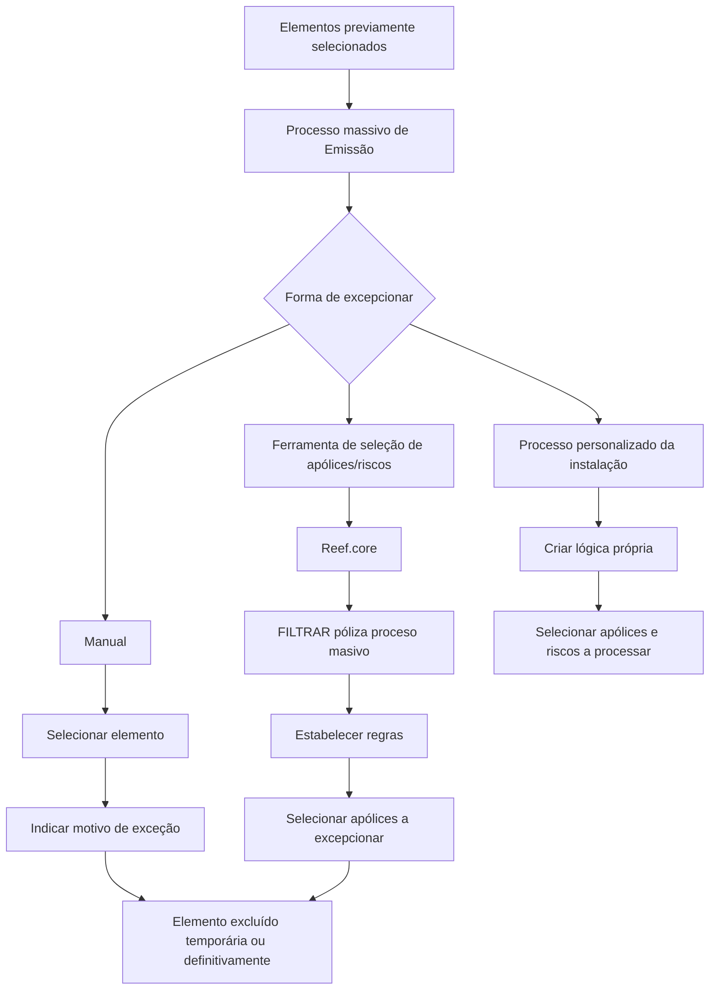

# Exceção de Elementos Candidatos em Emissão — Visão Técnica

## 1. Metadados do Documento
- **Arquivo de Origem:** `Não identificado`
- **Tipo de Documento:** `Procedimento`
- **Domínio / Sistema:** `Emissão; Reef.core`
- **Público-Alvo:** `Não explicitamente identificado`
- **Data/Versão Identificada:** `Não identificada`

---

## 2. Resumo Executivo & Contexto de Negócio

O documento descreve como excepcionar elementos candidatos durante um processo massivo de Emissão. Excepcionar consiste em excluir, de forma temporária ou definitiva, um ou mais elementos previamente selecionados para esse processo massivo.

Todo elemento excluído do processo massivo deve possuir um motivo de exceção. Os motivos de exceção precisam ser definidos previamente, embora o documento não informe a estrutura, o catálogo, a manutenção ou os critérios desses motivos.

O objetivo declarado é apresentar as formas disponíveis para excluir elementos já selecionados. O documento identifica três abordagens: exceção manual, ferramenta de seleção de apólices/riscos e processo personalizado da instalação.

A ferramenta disponível em Reef.core permite estabelecer regras para selecionar apólices que serão excepcionadas do processo massivo. Como alternativa final, cada instalação pode criar lógicas próprias para selecionar as apólices e os riscos que serão processados.

---

## 3. Arquitetura, Componentes & Tecnologias Envolvidas

Os componentes e conceitos citados são:

| Componente / Conceito | Papel descrito no documento |
| :--- | :--- |
| Emissão | Processo no qual elementos candidatos podem ser excepcionados. |
| Processo massivo | Processo que contém elementos previamente selecionados e do qual elementos podem ser excluídos. |
| Motivo de exceção | Informação obrigatória para qualquer elemento excluído do processo massivo; deve ser previamente definida. |
| Reef.core | Possui uma funcionalidade para estabelecer regras que selecionam apólices a excepcionar. |
| Ferramenta de seleção de apólices/riscos | Mecanismo citado para selecionar apólices ou riscos para exceção. |
| FILTRAR póliza proceso masivo | Utilidade citada em Reef.core para configurar regras de seleção de apólices excepcionadas. |
| Instalação | Pode criar lógica própria para selecionar apólices e riscos a processar. |
| Home Solutions APIs Documentation Zeus | Texto presente na extração original; o documento não explica sua relação funcional com o processo. |



> **Nota de Análise:** O documento não especifica interfaces, métodos HTTP, contratos JSON, integrações técnicas, persistência de dados, autenticação ou fluxos detalhados entre Reef.core e outros sistemas.

---

## 4. Regras de Negócio, Especificações Funcionais & Processos

### Conceito de exceção

A exceção de elementos candidatos em Emissão consiste em excluir temporária ou definitivamente um ou mais elementos de um processo massivo para o qual esses elementos já tenham sido selecionados.

### Regra obrigatória de motivo de exceção

Todo elemento que precise ser excluído do processo massivo deve possuir um motivo de exceção.

| Regra | Condição | Resultado |
| :--- | :--- | :--- |
| Obrigatoriedade de motivo | Um elemento precisa ser excluído do processo massivo. | O elemento deve ter um motivo de exceção indicado. |
| Pré-definição de motivos | Antes da utilização dos motivos no processo de exceção. | Os motivos de exceção devem estar previamente definidos. |
| Alcance da exclusão | O elemento é excepcionado. | A exclusão pode ser temporária ou definitiva. |

### Formas de excepcionar elementos

O documento lista três formas de exceção em um processo massivo:

1. **Manual**
2. **Ferramenta de seleção de apólices a excepcionar**
3. **Processo personalizado da instalação**

### Processo manual

No processo manual, o usuário deve selecionar o elemento e informar o motivo da exceção, seguindo a sequência de telas indicada no documento original.

| Etapa | Ação |
| :--- | :--- |
| 1 | Selecionar o elemento candidato. |
| 2 | Indicar o motivo da exceção. |
| 3 | Excluir o elemento do processo massivo, de forma temporária ou definitiva, conforme o conceito descrito. |

> **Nota de Análise:** A extração não contém as telas, os campos, os botões ou a sequência visual detalhada do processo manual.

### Ferramenta de seleção de apólices/riscos

O documento cita uma utilidade em Reef.core que permite estabelecer regras para selecionar as apólices que serão excepcionadas do processo massivo. A funcionalidade é identificada como **FILTRAR póliza proceso masivo**.

| Etapa | Ação |
| :--- | :--- |
| 1 | Acessar a utilidade de Reef.core citada no documento. |
| 2 | Estabelecer regras para seleção de apólices. |
| 3 | Identificar as apólices que devem ser excepcionadas do processo massivo. |

> **Nota de Análise:** O documento não detalha os atributos disponíveis para filtragem, operadores de regras, critérios de seleção, comportamento de conflitos, persistência das regras ou a relação operacional entre apólices e riscos.

### Processo personalizado da instalação

Como última opção, a instalação pode criar suas próprias lógicas para selecionar as apólices e os riscos a processar.

| Aspecto | Informação extraída |
| :--- | :--- |
| Alternativa | Processo personalizado da instalação. |
| Responsável pela lógica | A própria instalação. |
| Objeto da seleção | Apólices e riscos a processar. |
| Detalhamento técnico | Não informado no documento. |

---

## 5. Tabelas de Parâmetros, Ambientes e Estruturas de Dados

| Item / Parâmetro | Descrição / Função | Tipo / Valores / Formato | Ambiente / Observações |
| :--- | :--- | :--- | :--- |
| Elemento candidato | Elemento previamente selecionado para um processo massivo de Emissão. | Não detalhado. | Pode ser excluído do processo massivo. |
| Exceção | Exclusão de um ou mais elementos do processo massivo. | Temporária ou definitiva. | Aplicável aos elementos previamente selecionados. |
| Motivo de exceção | Justificativa obrigatória para excluir um elemento. | Deve ser previamente definido. | O documento não apresenta catálogo ou formato. |
| Apólice | Entidade selecionável para exceção por regras em Reef.core. | Não detalhado. | Citada na ferramenta de seleção. |
| Risco | Entidade que pode ser selecionada por lógica personalizada da instalação. | Não detalhado. | Citado no processo personalizado. |
| `FILTRAR póliza proceso masivo` | Utilidade de Reef.core para estabelecer regras de seleção de apólices a excepcionar. | Nome funcional citado no documento. | O funcionamento detalhado não é informado. |
| Reef.core | Sistema no qual existe a utilidade de filtragem citada. | Sistema / plataforma. | Não há versão, URL ou ambiente identificado. |
| Home Solutions APIs Documentation Zeus | Texto presente na extração literal. | Não detalhado. | Não é possível determinar sua função a partir do conteúdo. |

---

## 6. Bateria de Perguntas & Respostas para RAG (FAQ Sintético)

### P1: O que significa excepcionar elementos candidatos em Emissão?
**R:** Excepcionar elementos candidatos em Emissão significa excluir, temporária ou definitivamente, um ou mais elementos que já foram selecionados para um processo massivo.

### P2: Todo elemento excluído de um processo massivo precisa ter um motivo?
**R:** Sim. O documento determina que qualquer elemento necessário de excluir do processo massivo deve possuir um motivo de exceção.

### P3: Os motivos de exceção podem ser criados no momento da exclusão?
**R:** O documento informa que os motivos de exceção devem ser previamente definidos. Não há detalhamento sobre como esses motivos são cadastrados ou mantidos.

### P4: Quais são as formas disponíveis para excepcionar elementos de um processo massivo?
**R:** O documento apresenta três formas: exceção manual, uso da ferramenta de seleção de apólices a excepcionar e processo personalizado da instalação.

### P5: Como funciona a exceção manual de um elemento?
**R:** A exceção manual consiste em selecionar o elemento e indicar o motivo da exceção. O documento menciona uma sequência de telas, mas a extração não contém detalhes dessas telas.

### P6: Qual sistema possui a utilidade para definir regras de seleção de apólices excepcionadas?
**R:** A utilidade é mencionada como existente em Reef.core. Ela permite estabelecer regras que selecionam as apólices a serem excepcionadas do processo massivo.

### P7: O que é a funcionalidade “FILTRAR póliza proceso masivo”?
**R:** “FILTRAR póliza proceso masivo” é a utilidade citada em Reef.core para estabelecer regras que selecionam as apólices que serão excepcionadas do processo massivo. O documento não detalha seus filtros, campos ou operadores.

### P8: A ferramenta de Reef.core seleciona riscos ou apólices?
**R:** O texto descreve que a utilidade em Reef.core estabelece regras para selecionar apólices que serão excepcionadas do processo massivo. O título da seção menciona “apólices/riscos”, mas a explicação detalhada da utilidade refere-se especificamente a apólices.

### P9: O que uma instalação pode fazer quando as opções manual e de ferramenta não forem suficientes?
**R:** A instalação pode criar suas próprias lógicas para selecionar as apólices e os riscos a processar. O documento não especifica requisitos técnicos, linguagem, pontos de extensão ou governança dessa lógica.

### P10: A exceção sempre remove o elemento de forma definitiva?
**R:** Não. A exceção pode excluir o elemento temporária ou definitivamente do processo massivo.

---

## 7. Glossário de Termos, Siglas & Conceitos-Chave

- **Emissão:** Contexto de processo no qual há elementos candidatos que podem ser excepcionados.
- **Elemento candidato:** Elemento previamente selecionado para participação em um processo massivo.
- **Exceção / Excepcionar:** Exclusão temporária ou definitiva de um ou mais elementos de um processo massivo.
- **Motivo de exceção:** Justificativa obrigatória associada à exclusão de um elemento; deve estar previamente definida.
- **Processo massivo:** Processo que opera sobre elementos previamente selecionados e do qual elementos podem ser excluídos.
- **Reef.core:** Sistema citado como possuidor de uma utilidade para configurar regras de seleção de apólices a excepcionar.
- **Apólice:** Entidade que pode ser selecionada para exceção por regras configuradas em Reef.core.
- **Risco:** Entidade citada como selecionável por lógica personalizada da instalação.
- **Instalação:** Contexto que pode criar lógica própria para selecionar apólices e riscos a processar.
- **FILTRAR póliza proceso masivo:** Nome da utilidade de Reef.core citada para seleção de apólices excepcionadas.

---

## 8. Notas Críticas, Riscos & Limitações

- O documento não identifica arquivo de origem, versão, data, autor, ambiente ou público-alvo.
- As sequências de telas mencionadas para os processos manual e de filtragem não estão presentes na extração textual.
- Não há catálogo de motivos de exceção, campos obrigatórios, regras de validação, permissões ou trilha de auditoria descritos.
- Não são informados critérios, sintaxe, operadores, campos ou exemplos das regras configuráveis na utilidade de Reef.core.
- O documento menciona apólices e riscos, mas não define suas estruturas de dados nem o relacionamento entre essas entidades.
- O processo personalizado da instalação é citado sem detalhamento de arquitetura, tecnologia, interfaces ou responsabilidades operacionais.
- O texto “Home Solutions APIs Documentation Zeus” aparece na extração, porém sem contexto suficiente para estabelecer sua função no procedimento.

---

## 9. Conteúdo Bruto Estruturado (Referência Fiel)

```text
--- [PÁGINA 1 DE 6] ---

EXCEPCIONAR elementos candidatos en
Emisión (enlace con visión técnica)
¿En que consiste?
Excluir temporal o definitivamente uno o varios elementos del proceso masivo del que han sido
seleccionados. Hay que indicar que cualquier elemento que sea necesario excluir del proceso
masivo, debe de contar con un motivo de excepción. Estos motivos deben ser previamente definidos.
Objetivo
Conocer las formas en las que se puede excluir elementos seleccionados previamente.
Proceso a seguir
Existen tres formas en las que los elementos puedan ser excepcionados de un proceso masivo:
1. Manualmente
2. Herramienta de selección de pólizas a excepcionar
3. Proceso personalizado de la instalación
Manualmente
Es decir, seleccionando el elemento e indicando el motivo de la excepción, según secuencia que se
muestra a continuación:
 /
 CF
Home Solutions APIs Documentation Zeus
EN


--- [PÁGINA 2 DE 6] ---

[Página em branco ou apenas elementos visuais/imagem]


--- [PÁGINA 3 DE 6] ---

Herramienta de selección de pólizas/riesgos


--- [PÁGINA 4 DE 6] ---

Existe una utilizad en Reef.core que permite establecer las reglas que seleccionen las pólizas que
serán excepcionadas del proceso masivo FILTRAR póliza proceso masivo. Los pasos a seguir se
muestran en la siguiente secuencia de pantallas:


--- [PÁGINA 5 DE 6] ---

Proceso personalizado de la instalación


--- [PÁGINA 6 DE 6] ---

Como última opción, la instalación puede crear sus propias lógicas que seleccionen las pólizas y
riesgos a procesar.
```
