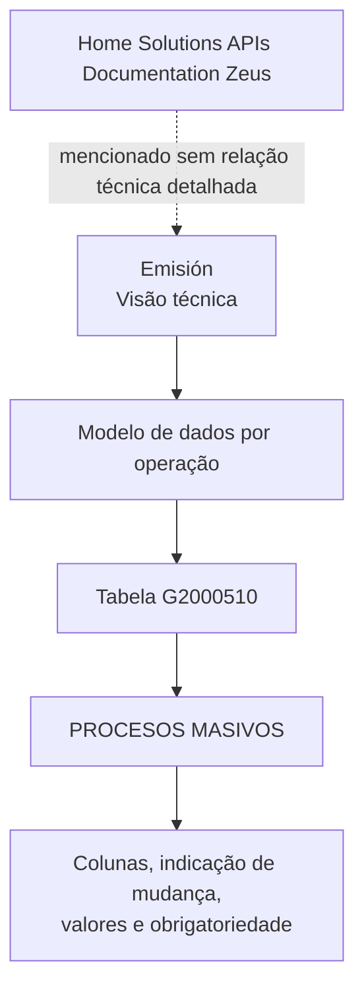

# Alterações Candidatas em Emissão — Visão Técnica do Modelo de Dados G2000510

## 1. Metadados do Documento
- **Arquivo de Origem:** `Não identificado no conteúdo fornecido`
- **Tipo de Documento:** `Especificação Técnica`
- **Domínio / Sistema:** `Emisión; Home Solutions APIs Documentation Zeus`
- **Público-Alvo:** `Desenvolvedores, Arquitetos e Analistas Técnicos`
- **Data/Versão Identificada:** `Não identificada`

---

## 2. Resumo Executivo & Contexto de Negócio

O conteúdo descreve uma visão técnica para identificar elementos candidatos a alteração no contexto de **Emisión**. O foco documentado é o modelo de dados envolvido por operação, apresentado por meio da tabela **G2000510 — PROCESOS MASIVOS**.

A especificação enumera colunas da tabela G2000510 e indica, para cada coluna, se ela muda (`CAMBIA`), o valor ou motivo associado (`VALOR MOTIVO/VALOR`) e se o preenchimento é obrigatório (`OBLIGATORIA`). A maior parte das colunas listadas não muda e possui valor `N.A.`.

A exceção funcional explicitamente detalhada é a coluna `TIP_SITU_FILTRO`. A coluna `TIP_SITU_FILTRO` muda e pode assumir valores distintos conforme o momento da operação: `2-Filtrando` e, posteriormente, `3-Ya filtrado`.

O documento menciona “Home Solutions APIs Documentation Zeus”, mas não apresenta contratos de API, métodos HTTP, URLs, ambientes, tecnologias de implementação ou relacionamentos técnicos entre componentes. A extração disponível concentra-se exclusivamente na identificação de atributos do modelo de dados G2000510.

---

## 3. Arquitetura, Componentes & Tecnologias Envolvidas

Os elementos explicitamente citados são:

| Componente / Elemento | Classificação | Descrição fundamentada no conteúdo |
| :--- | :--- | :--- |
| Emisión | Contexto funcional | Área em que são indicados elementos candidatos a mudanças, sob visão técnica. |
| G2000510 | Tabela / modelo de dados | Tabela identificada como `PROCESOS MASIVOS`. |
| PROCESOS MASIVOS | Descrição da tabela | Descrição associada à tabela G2000510. |
| Home Solutions APIs Documentation Zeus | Referência documental / sistema citado | Texto presente na extração, sem detalhamento adicional. |



> **Nota de Análise:** O conteúdo não detalha arquitetura de software, microsserviços, protocolos, APIs, bancos de dados além da referência à tabela G2000510, nem tecnologias utilizadas.

---

## 4. Regras de Negócio, Especificações Funcionais & Processos

1. A visão técnica deve indicar os elementos candidatos a mudanças no contexto de **Emisión**.
2. O modelo de dados que intervém por operação é apresentado pela tabela **G2000510 — PROCESOS MASIVOS**.
3. As colunas `COD_CIA`, `FEC_TRATAMIENTO`, `NUM_ORDEN`, `TIP_MVTO_BATCH`, `MCA_RECALCULA_FECHA` e `COD_USR` estão marcadas como obrigatórias.
4. As colunas `TXT_ALIAS`, `NOM_PRG_EXCEPCION`, `TIP_FECHA_BASE`, `FEC_ACTU`, `TXT_MCA_PROCESO_ESTANDAR` e `IDN_PROCESO_PERSONALIZADO` estão marcadas como não obrigatórias.
5. A coluna `TIP_SITU_FILTRO` está marcada como obrigatória e possui comportamento variável conforme o momento da operação:
   - Valor `2-Filtrando` durante a etapa de filtragem.
   - Valor `3-Ya filtrado` posteriormente, após a filtragem.
6. A coluna `TIP_SITU_FILTRO` é a única coluna apresentada com `CAMBIA = S`.
7. Todas as demais colunas apresentadas possuem `CAMBIA = N`.
8. Para as colunas com `CAMBIA = N`, o documento informa `N.A.` no campo de motivo/valor, exceto `TIP_SITU_FILTRO`, que possui valores operacionais detalhados.

---

## 5. Tabelas de Parâmetros, Ambientes e Estruturas de Dados

### Tabela G2000510 — PROCESOS MASIVOS

| Item / Parâmetro | Descrição / Função | Tipo / Valores / Formato | Ambiente / Observações |
| :--- | :--- | :--- | :--- |
| `COD_CIA` | Coluna da tabela G2000510. | `CAMBIA: N`; valor/motivo: `N.A.`; obrigatória: `SI`. | Não detalhado. |
| `FEC_TRATAMIENTO` | Coluna da tabela G2000510. | `CAMBIA: N`; valor/motivo: `N.A.`; obrigatória: `SI`. | Não detalhado. |
| `NUM_ORDEN` | Coluna da tabela G2000510. | `CAMBIA: N`; valor/motivo: `N.A.`; obrigatória: `SI`. | Não detalhado. |
| `TIP_MVTO_BATCH` | Coluna da tabela G2000510. | `CAMBIA: N`; valor/motivo: `N.A.`; obrigatória: `SI`. | Não detalhado. |
| `TXT_ALIAS` | Coluna da tabela G2000510. | `CAMBIA: N`; valor/motivo: `N.A.`; obrigatória: `NO`. | Não detalhado. |
| `TIP_SITU_FILTRO` | Situação do filtro na operação. | `CAMBIA: S`; valores: `2-Filtrando` e posteriormente `3-Ya filtrado`; obrigatória: `SI`. | Assume valores diferentes conforme o momento da operação. |
| `NOM_PRG_EXCEPCION` | Coluna da tabela G2000510. | `CAMBIA: N`; valor/motivo: `N.A.`; obrigatória: `NO`. | Não detalhado. |
| `MCA_RECALCULA_FECHA` | Coluna da tabela G2000510. | `CAMBIA: N`; valor/motivo: `N.A.`; obrigatória: `SI`. | Não detalhado. |
| `TIP_FECHA_BASE` | Coluna da tabela G2000510. | `CAMBIA: N`; valor/motivo: `N.A.`; obrigatória: `NO`. | Não detalhado. |
| `COD_USR` | Coluna da tabela G2000510. | `CAMBIA: N`; valor/motivo: `N.A.`; obrigatória: `SI`. | Não detalhado. |
| `FEC_ACTU` | Coluna da tabela G2000510. | `CAMBIA: N`; valor/motivo: `N.A.`; obrigatória: `NO`. | Não detalhado. |
| `TXT_MCA_PROCESO_ESTANDAR` | Coluna da tabela G2000510. | `CAMBIA: N`; valor/motivo: `N.A.`; obrigatória: `NO`. | Não detalhado. |
| `IDN_PROCESO_PERSONALIZADO` | Coluna da tabela G2000510. | `CAMBIA: N`; valor/motivo: `N.A.`; obrigatória: `NO`. | Não detalhado. |

### Valores de situação de filtro

| Parâmetro | Momento operacional | Valor indicado | Obrigatoriedade |
| :--- | :--- | :--- | :--- |
| `TIP_SITU_FILTRO` | Durante a filtragem | `2-Filtrando` | `SI` |
| `TIP_SITU_FILTRO` | Posteriormente à filtragem | `3-Ya filtrado` | `SI` |

---

## 6. Bateria de Perguntas & Respostas para RAG (FAQ Sintético)

### P1: Qual é a tabela de dados envolvida na operação descrita para Emisión?
**R:** A tabela de dados identificada no documento é `G2000510`, cuja descrição é `PROCESOS MASIVOS`.

### P2: Qual coluna da tabela G2000510 é marcada como passível de alteração?
**R:** A coluna `TIP_SITU_FILTRO` é a única coluna apresentada com `CAMBIA = S`. As demais colunas listadas possuem `CAMBIA = N`.

### P3: Quais valores a coluna TIP_SITU_FILTRO pode assumir?
**R:** A coluna obrigatória `TIP_SITU_FILTRO` pode assumir o valor `2-Filtrando` durante a etapa de filtragem e, posteriormente, o valor `3-Ya filtrado`.

### P4: TIP_SITU_FILTRO é um campo obrigatório?
**R:** Sim. A coluna `TIP_SITU_FILTRO` está marcada como obrigatória com o valor `SI`.

### P5: COD_CIA é obrigatório e sofre alteração?
**R:** `COD_CIA` é obrigatório (`SI`), mas não sofre alteração (`CAMBIA = N`). O campo de motivo/valor está indicado como `N.A.`.

### P6: Quais colunas obrigatórias estão listadas na tabela G2000510?
**R:** As colunas obrigatórias listadas são `COD_CIA`, `FEC_TRATAMIENTO`, `NUM_ORDEN`, `TIP_MVTO_BATCH`, `TIP_SITU_FILTRO`, `MCA_RECALCULA_FECHA` e `COD_USR`.

### P7: Quais colunas não obrigatórias estão listadas na tabela G2000510?
**R:** As colunas não obrigatórias listadas são `TXT_ALIAS`, `NOM_PRG_EXCEPCION`, `TIP_FECHA_BASE`, `FEC_ACTU`, `TXT_MCA_PROCESO_ESTANDAR` e `IDN_PROCESO_PERSONALIZADO`.

### P8: O documento especifica APIs, métodos HTTP ou contratos JSON para Home Solutions APIs Documentation Zeus?
**R:** Não. O documento contém a referência textual “Home Solutions APIs Documentation Zeus”, mas não detalha APIs, métodos HTTP, contratos JSON, URLs, tecnologias ou integrações associadas.

### P9: Qual é a regra de transição apresentada para a situação de filtro?
**R:** A situação de filtro é representada por `TIP_SITU_FILTRO`: durante a filtragem, o valor indicado é `2-Filtrando`; posteriormente, após a filtragem, o valor indicado é `3-Ya filtrado`.

### P10: MCA_RECALCULA_FECHA sofre alteração na especificação?
**R:** Não. `MCA_RECALCULA_FECHA` possui `CAMBIA = N`, valor/motivo `N.A.` e é obrigatória (`SI`).

---

## 7. Glossário de Termos, Siglas & Conceitos-Chave

- **Emisión:** Contexto funcional mencionado para identificação de elementos candidatos a mudanças sob visão técnica.
- **G2000510:** Identificador da tabela apresentada no documento.
- **PROCESOS MASIVOS:** Descrição associada à tabela G2000510.
- **CAMBIA:** Indicador que informa se a coluna muda; os valores identificados são `S` e `N`.
- **S:** Valor de `CAMBIA` associado a uma coluna que muda.
- **N:** Valor de `CAMBIA` associado a uma coluna que não muda.
- **N.A.:** Valor exibido no campo “MOTIVO/VALOR” para diversas colunas sem valor adicional detalhado.
- **TIP_SITU_FILTRO:** Coluna obrigatória que registra a situação de filtragem.
- **2-Filtrando:** Valor de `TIP_SITU_FILTRO` durante a etapa de filtragem.
- **3-Ya filtrado:** Valor de `TIP_SITU_FILTRO` posteriormente à etapa de filtragem.
- **Home Solutions APIs Documentation Zeus:** Referência textual presente no documento, sem explicação adicional.

---

## 8. Notas Críticas, Riscos & Limitações

- O arquivo de origem, data, versão e autoria não estão identificados no conteúdo fornecido.
- O conteúdo não define tipos físicos de dados, tamanho de campos, chaves, índices, relacionamentos entre tabelas ou regras de integridade da tabela G2000510.
- A documentação não descreve os gatilhos que fazem `TIP_SITU_FILTRO` transitar entre `2-Filtrando` e `3-Ya filtrado`.
- Não há detalhamento sobre validações, tratamento de erro, auditoria, persistência, processamento batch ou responsáveis pela atualização das colunas.
- A referência a “Home Solutions APIs Documentation Zeus” não contém detalhes suficientes para identificar uma API, integração, ambiente ou contrato técnico.
- Não há URLs, servidores, logs, versões de software, portas, tecnologias ou dependências externas descritas.

---

## 9. Conteúdo Bruto Estruturado (Referência Fiel)

```text
--- [PÁGINA 1 DE 3] ---

INDICAR CAMBIOS elementos candidatos en
Emisión (visión técnica)
Modelo de datos involucrado
El modelo de datos que intervienen por operación se muestra a continuación
G2000510
TABLA DESCRIPCIÓN
G2000510 PROCESOS MASIVOS
COLUMNA CAMBIA
VALOR
MOTIVO/VALOR OBLIGATORIA
COD_CIA N N.A. SI
FEC_TRATAMIENTO N N.A. SI
 /
 CF
Home Solutions APIs Documentation Zeus
EN


--- [PÁGINA 2 DE 3] ---

COLUMNA CAMBIA
VALOR
MOTIVO/VALOR OBLIGATORIA
NUM_ORDEN N N.A. SI
TIP_MVTO_BATCH N N.A. SI
TXT_ALIAS N N.A. NO
TIP_SITU_FILTRO S En esta
operación toma
varios valores
dependiendo del
momento. Los
valores son 2-
Filtrando y
posteriormente
3-Ya filtrado
SI
NOM_PRG_EXCEPCION N N.A. NO
MCA_RECALCULA_FECHA N N.A. SI
TIP_FECHA_BASE N N.A. NO


--- [PÁGINA 3 DE 3] ---

COLUMNA CAMBIA
VALOR
MOTIVO/VALOR OBLIGATORIA
COD_USR N N.A. SI
FEC_ACTU N N.A. NO
TXT_MCA_PROCESO_ESTANDAR N N.A. NO
IDN_PROCESO_PERSONALIZADO N N.A. NO
```
