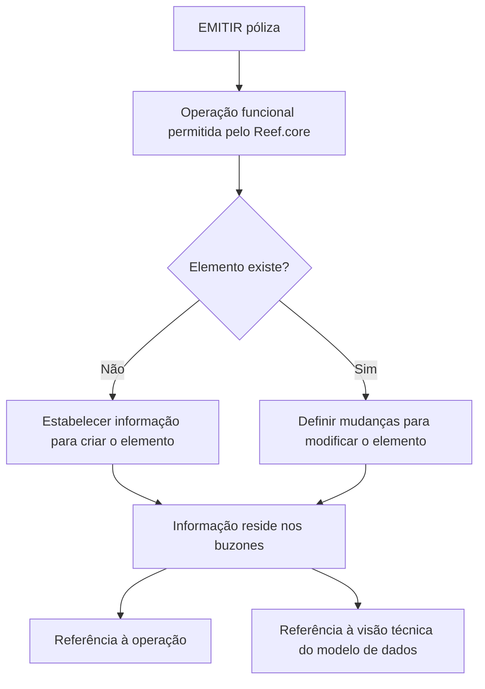

# Indicar Cambios de Elementos Candidatos en Emisión

## 1. Metadados do Documento
- **Arquivo de Origem:** Não identificado
- **Tipo de Documento:** Procedimento
- **Domínio / Sistema:** Reef.core / Emisión
- **Público-Alvo:** Desenvolvedores, Arquitetos, Operação e Negócio
- **Data/Versão Identificada:** Não identificada

---

## 2. Resumo Executivo & Contexto de Negócio

O documento descreve o procedimento para indicar informações de elementos candidatos no contexto de **Emisión**. O objetivo é estabelecer informações para criação de um elemento inexistente ou definir mudanças para um elemento já existente.

A operação funcional permitida pelo **Reef.core** é executada em modo diferido. Nesse modelo, as informações a criar ou modificar não residem imediatamente no elemento final, mas nos denominados **buzones**.

O processo busca permitir que cada operação identifique as informações afetadas, viabilizando a criação ou modificação do elemento correspondente. O texto também declara que a documentação disponibiliza enlaces para a operação e para a versão técnica que especifica o modelo de dados associado às informações criadas ou modificadas.

A única operação explicitamente identificada é **EMITIR póliza**. O conteúdo fornecido não detalha campos, contratos, endpoints, métodos HTTP, regras de validação ou estrutura dos buzones.

---

## 3. Arquitetura, Componentes & Tecnologias Envolvidas

### Componentes e conceitos identificados

| Componente / Termo | Papel descrito |
| :--- | :--- |
| **Reef.core** | Sistema que permite realizar operações funcionais em modo diferido. |
| **Emisión** | Contexto funcional no qual são indicados candidatos e mudanças de elementos. |
| **Buzones** | Local onde reside a informação a criar ou modificar no fluxo diferido. |
| **EMITIR póliza** | Operação funcional listada no documento. |
| **Visión Técnica** | Referência à versão técnica que especifica o modelo de dados para informações criadas ou modificadas. |
| **Home Solutions APIs Documentation Zeus** | Texto presente na referência da operação; o documento não explica sua função ou relação técnica com Reef.core. |



**Nota de Análise:** O documento menciona Reef.core, buzones, a operação **EMITIR póliza** e uma visão técnica, mas não detalha interfaces, integrações, tecnologias de implementação, métodos HTTP, contratos JSON, estruturas de dados ou ambientes.

---

## 4. Regras de Negócio, Especificações Funcionais & Processos

1. A indicação de mudanças de elementos candidatos em **Emisión** deve estabelecer:
   - A informação necessária quando o elemento não existe.
   - As mudanças necessárias quando o elemento já existe.

2. O objetivo funcional é conhecer quais informações são afetadas por cada operação, para criar ou modificar um elemento.

3. A informação a estabelecer ou modificar depende da operação funcional que o **Reef.core** permite realizar em modo diferido.

4. A diferenciação do modo diferido é que a informação reside nos chamados **buzones**.

5. A informação apresentada possui:
   - Enlaces para a operação.
   - Enlaces para a versão técnica que especifica o modelo de dados contendo a informação a criar ou modificar.

6. A operação identificada na tabela é:
   - **EMITIR póliza**.

7. Não há detalhamento adicional sobre:
   - Critérios para determinar a inexistência ou existência de um elemento.
   - Estrutura, localização ou mecanismo de processamento dos buzones.
   - Modelo de dados técnico associado à operação **EMITIR póliza**.
   - Conteúdo acessível pelo enlace **Acceder / CF**.
   - Relação entre **Home Solutions APIs Documentation Zeus** e a operação descrita.

---

## 5. Tabelas de Parâmetros, Ambientes e Estruturas de Dados

| Item / Parâmetro | Descrição / Função | Tipo / Valores / Formato | Ambiente / Observações |
| :--- | :--- | :--- | :--- |
| Elemento candidato | Elemento a ser criado ou modificado. | Não especificado. | A criação ocorre quando o elemento não existe; a modificação ocorre quando o elemento existe. |
| Informação a estabelecer | Informação aplicável à criação de elemento inexistente. | Não especificado. | Depende da operação funcional em modo diferido. |
| Mudanças a realizar | Alterações aplicáveis a elemento existente. | Não especificado. | Depende da operação funcional em modo diferido. |
| Buzones | Local de residência da informação a criar ou modificar. | Não especificado. | Característica distintiva do modo diferido. |
| Operação funcional | Operação permitida pelo Reef.core. | **EMITIR póliza**. | Possui referência para operação e visão técnica. |
| Visión Técnica | Especificação do modelo de dados da informação criada ou modificada. | Não especificado. | O conteúdo da visão técnica não foi fornecido. |
| Acceder / CF | Referência apresentada para a operação EMITIR póliza. | Texto de enlace. | Destino e conteúdo não especificados. |
| Home Solutions APIs Documentation Zeus | Texto apresentado no rodapé/referência do conteúdo. | Não especificado. | Sem detalhamento de função, ambiente ou integração. |

---

## 6. Bateria de Perguntas & Respostas para RAG (FAQ Sintético)

### P1: Qual é o propósito de indicar cambios de elementos candidatos em Emisión?
**R:** O propósito é estabelecer a informação necessária para criar um elemento quando ele não existe ou definir as mudanças necessárias para modificar um elemento quando ele já existe.

### P2: Qual é o objetivo do processo descrito para Reef.core?
**R:** O objetivo é conhecer quais informações afetam cada operação, com a intenção de criar ou modificar um elemento.

### P3: Quando uma informação deve ser estabelecida em vez de modificada?
**R:** A informação deve ser estabelecida quando o elemento não existe. Quando o elemento já existe, devem ser definidas as mudanças a realizar.

### P4: De que depende a informação a estabelecer ou modificar?
**R:** A informação depende da operação funcional que o Reef.core permite realizar em modo diferido.

### P5: Onde reside a informação no modo diferido do Reef.core?
**R:** No modo diferido, a informação a criar ou modificar reside nos denominados buzones.

### P6: Qual é a diferença destacada entre o fluxo normal e o modo diferido?
**R:** A diferença explicitamente indicada é que, no modo diferido, a informação reside nos buzones. O documento não descreve outro fluxo para comparação.

### P7: Que tipo de referência acompanha as informações apresentadas?
**R:** As informações possuem enlaces para a operação correspondente e enlaces para a versão técnica que especifica o modelo de dados contendo a informação a criar ou modificar.

### P8: Qual operação funcional é explicitamente listada no documento?
**R:** A operação explicitamente listada é **EMITIR póliza**.

### P9: O documento informa quais campos ou contratos técnicos são usados na operação EMITIR póliza?
**R:** Não. O documento lista a operação **EMITIR póliza**, mas não detalha campos, métodos HTTP, contratos JSON, endpoints ou o modelo de dados técnico.

### P10: O que a visão técnica deve especificar?
**R:** A visão técnica deve especificar o modelo de dados que contém a informação a criar ou modificar.

---

## 7. Glossário de Termos, Siglas & Conceitos-Chave

- **Emisión:** Contexto funcional citado para a indicação de mudanças de elementos candidatos.
- **Reef.core:** Sistema mencionado como responsável por permitir operações funcionais em modo diferido.
- **Modo diferido:** Modalidade na qual a informação a criar ou modificar reside nos denominados buzones.
- **Buzones:** Repositórios ou locais denominados pelo documento como residência da informação em modo diferido; a implementação não é detalhada.
- **EMITIR póliza:** Operação funcional listada no documento.
- **Póliza:** Termo presente no nome da operação; o documento não fornece definição adicional.
- **Visión Técnica:** Referência à versão técnica que especifica o modelo de dados da informação a criar ou modificar.
- **CF:** Sigla presente no enlace `Acceder / CF`; significado não informado.
- **Zeus:** Termo presente em `Home Solutions APIs Documentation Zeus`; significado e função não informados.

---

## 8. Notas Críticas, Riscos & Limitações

- O arquivo de origem, data, versão e autoria não foram identificados no conteúdo fornecido.
- A operação **EMITIR póliza** é citada, mas não possui detalhamento funcional ou técnico suficiente para implementação.
- O documento não especifica a estrutura, o ciclo de vida, o mecanismo de persistência ou o processamento dos **buzones**.
- O conteúdo não apresenta modelos de dados, nomes de campos, tipos, regras de validação, APIs, URLs, ambientes, credenciais ou rotas de log.
- O destino e o conteúdo dos enlaces `Acceder / CF` não estão disponíveis no texto extraído.
- **Nota de Análise:** O documento cita `Home Solutions APIs Documentation Zeus`, porém não descreve como esse item se relaciona com Reef.core, Emisión ou a operação EMITIR póliza.

---

## 9. Conteúdo Bruto Estruturado (Referência Fiel)

```text
--- [PÁGINA 1 DE 1] ---

INDICAR CAMBIOS elementos candidatos en
Emisión
¿En que consiste?
Establecer la información (en el caso que el elemento no exista) o los cambios a realizar (en el caso
que el elemento exista) que se deben aplicar.
Objetivo
Conocer que información afecta a cada operación con la intención de crear o modificar un elemento.
Proceso a seguir
La información a establecer (en el caso que el elemento no exista) o a modificar (en el caso que el
elemento exista), depende de la operación funcional que Reef.core permita realizar en modo diferido.
La diferencia radica que la información residirá en los denominados buzones. La información
mostrada a continuación cuenta con enlaces a la operación y enlaces a la versión técnica que
especifica el modelo de datos que contiene la información a crear o modificar.
OPERACIÓN VISIÓN TÉCNICA
EMITIR póliza Acceder
 / 
 CF
Home Solutions APIs Documentation Zeus
EN
```
