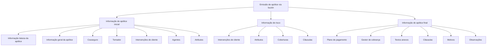

# Emissão de Apólice via Buzón — Visão Técnica e Modelo de Dados

## 1. Metadados do Documento
- **Arquivo de Origem:** Não identificado
- **Tipo de Documento:** Especificação Técnica
- **Domínio / Sistema:** Emissão de apólice — buzón
- **Público-Alvo:** Desenvolvedores, Arquitetos e Analistas Funcionais
- **Data/Versão Identificada:** Não identificada

---

## 2. Resumo Executivo & Contexto de Negócio

O documento apresenta uma visão técnica em construção para o processo de **emissão de apólice por buzón**, com foco no modelo de dados envolvido. O conteúdo organiza informações que participam da criação e da modificação de apólices.

A estrutura apresentada divide os dados em três grupos principais: **informação inicial de apólice**, **informação de risco** e **informação final de apólice**. Cada grupo contém entidades ou domínios funcionais que devem ser acessados tanto em operações de criação quanto de modificação.

O documento aponta que o modelo de dados do buzón está disponível por meio de enlaces, identificados visualmente como “Acceder”. Também são citadas referências a **CF**, **Home Solutions APIs Documentation** e **Zeus**, sem explicação adicional sobre suas responsabilidades ou interfaces.

Não há detalhamento de métodos HTTP, contratos JSON, entidades físicas, relacionamentos de banco de dados, regras de validação, URLs completas ou sequência transacional de emissão. A informação disponível limita-se à classificação dos blocos de dados necessários ao processo.

---

## 3. Arquitetura, Componentes & Tecnologias Envolvidas

### Componentes e referências citadas

| Componente / Referência | Papel identificado no documento | Detalhamento disponível |
| :--- | :--- | :--- |
| Buzón | Contexto do modelo de dados utilizado na emissão de apólice | O documento informa que o modelo de dados interveniente está disponível em enlaces. |
| Emissão de apólice | Processo técnico tratado pelo documento | Abrange criação e modificação de informações de apólice e risco. |
| CF | Referência exibida no material | Não detalhada. |
| Home Solutions APIs Documentation | Referência documental exibida no material | Não detalhada. |
| Zeus | Referência exibida no material | Não detalhada. |

### Fluxo lógico de informações identificado



> **Nota de Análise:** O diagrama representa somente o agrupamento lógico apresentado no documento. O material não especifica ordem de chamadas, dependências entre entidades, protocolos de integração ou fluxos de persistência.

---

## 4. Regras de Negócio, Especificações Funcionais & Processos

### Processo coberto

O documento aborda a emissão de apólice em uma visão técnica, considerando duas modalidades operacionais:

1. **Criação**
2. **Modificação**

As duas modalidades estão associadas aos três blocos de informação:

1. Informação de apólice inicial.
2. Informação de risco.
3. Informação de apólice final.

### Informação de apólice inicial

A informação inicial de apólice inclui:

- Informação básica da apólice.
- Informação geral da apólice.
- Coaseguro.
- Tomador.
- Intervenções de cliente.
- Agentes.
- Atributos.

O documento marca cada um desses elementos como acessível tanto em criação quanto em modificação.

### Informação de risco

A informação de risco inclui:

- Intervenções de cliente.
- Atributos.
- Coberturas.
- Cláusulas.

O conteúdo bruto apresenta “Intervenciones de cliente” duas vezes na seção de informação de risco. Não há explicação que permita determinar se a repetição representa dois conjuntos distintos de intervenções, uma duplicidade de extração ou um item repetido visualmente no material original.

### Informação de apólice final

A informação final de apólice inclui:

- Plano de pagamento.
- Gestor de cobrança.
- Textos anexos.
- Cláusulas.
- Motivos.
- Observações.

O documento indica acesso para criação e modificação de cada item listado.

> **Nota de Análise:** O documento não descreve regras de validação, obrigatoriedade de campos, cálculos, transições de estado, tratamento de erro, critérios de elegibilidade, mecanismos de autenticação ou contratos de APIs.

---

## 5. Tabelas de Parâmetros, Ambientes e Estruturas de Dados

| Item / Parâmetro | Descrição / Função | Tipo / Valores / Formato | Ambiente / Observações |
| :--- | :--- | :--- | :--- |
| Operação | Modalidade de manutenção de informações da apólice | Criação; Modificação | Ambas aparecem para todos os itens listados. |
| Informação básica da apólice | Dados iniciais classificados como informação de apólice | Não especificado | Acessível em criação e modificação. |
| Informação geral da apólice | Dados gerais classificados como informação de apólice | Não especificado | Acessível em criação e modificação. |
| Coaseguro | Informação de coaseguro da apólice | Não especificado | Acessível em criação e modificação. |
| Tomador | Informação do tomador da apólice | Não especificado | Acessível em criação e modificação. |
| Intervenções de cliente — apólice inicial | Informações de intervenções de cliente na fase inicial | Não especificado | Acessível em criação e modificação. |
| Agentes | Informações de agentes | Não especificado | Acessível em criação e modificação. |
| Atributos — apólice inicial | Atributos da apólice na fase inicial | Não especificado | Acessível em criação e modificação. |
| Intervenções de cliente — risco | Informações de intervenções de cliente relacionadas ao risco | Não especificado | O item aparece repetido no conteúdo bruto. |
| Atributos — risco | Atributos relacionados ao risco | Não especificado | Acessível em criação e modificação. |
| Coberturas | Informações de cobertura associadas ao risco | Não especificado | Acessível em criação e modificação. |
| Cláusulas — risco | Cláusulas relacionadas ao risco | Não especificado | Acessível em criação e modificação. |
| Plano de pagamento | Informações do plano de pagamento | Não especificado | Acessível em criação e modificação. |
| Gestor de cobrança | Informações do gestor de cobrança | Não especificado | Acessível em criação e modificação. |
| Textos anexos | Textos anexos da apólice | Não especificado | Acessível em criação e modificação. |
| Cláusulas — apólice final | Cláusulas na informação final de apólice | Não especificado | Acessível em criação e modificação. |
| Motivos | Motivos associados à apólice | Não especificado | Acessível em criação e modificação. |
| Observações | Observações associadas à apólice | Não especificado | Acessível em criação e modificação. |
| CF | Referência exibida no documento | Não especificado | Sem detalhamento adicional. |
| Home Solutions APIs Documentation | Referência de documentação exibida | Não especificado | Sem URL ou conteúdo detalhado. |
| Zeus | Referência exibida no documento | Não especificado | Sem detalhamento adicional. |

---

## 6. Bateria de Perguntas & Respostas para RAG (FAQ Sintético)

### P1: Qual é o objetivo do documento sobre emissão de apólice por buzón?
**R:** O documento apresenta uma visão técnica, ainda identificada como “em construção”, do modelo de dados envolvido na emissão de apólice por buzón. O conteúdo organiza as informações em apólice inicial, risco e apólice final.

### P2: Quais operações são previstas para as informações do modelo de dados?
**R:** O documento prevê duas operações: **criação** e **modificação**. Os elementos listados nas seções de informação de apólice inicial, informação de risco e informação de apólice final aparecem como acessíveis para ambas as operações.

### P3: Quais dados fazem parte da informação inicial de apólice?
**R:** A informação inicial de apólice inclui informação básica da apólice, informação geral da apólice, coaseguro, tomador, intervenções de cliente, agentes e atributos.

### P4: O documento detalha os campos da informação básica da apólice?
**R:** Não. O documento apenas lista “informação básica da apólice” como um item acessível em criação e modificação. Não há definição de campos, formatos, obrigatoriedade ou regras de validação.

### P5: Quais elementos compõem a informação de risco?
**R:** A informação de risco contém intervenções de cliente, atributos, coberturas e cláusulas. O conteúdo bruto apresenta intervenções de cliente duas vezes, mas não explica se são conjuntos funcionais distintos ou uma repetição.

### P6: Onde são tratadas as coberturas no modelo apresentado?
**R:** As coberturas estão listadas na seção **Informação de risco**. O documento informa que esse item possui acesso para criação e modificação, mas não detalha sua estrutura de dados ou comportamento.

### P7: Quais informações são classificadas como informação final de apólice?
**R:** A informação final de apólice inclui plano de pagamento, gestor de cobrança, textos anexos, cláusulas, motivos e observações. Todos os itens aparecem associados a criação e modificação.

### P8: O documento especifica APIs, métodos HTTP ou contratos JSON?
**R:** Não. Embora o material mencione “Home Solutions APIs Documentation”, não apresenta endpoints, métodos HTTP, URLs, payloads JSON, cabeçalhos, códigos de resposta ou mecanismos de autenticação.

### P9: Quais referências externas ou sistemas são mencionados?
**R:** O documento exibe as referências “CF”, “Home Solutions APIs Documentation” e “Zeus”. Entretanto, não informa o papel técnico, proprietário, integração ou localização dessas referências.

### P10: Há uma sequência obrigatória entre informação inicial de apólice, informação de risco e informação final de apólice?
**R:** Não há sequência operacional explicitamente definida. O documento organiza o conteúdo nesses três grupos, mas não declara que eles devem ser processados em determinada ordem nem descreve dependências transacionais.

### P11: O que o documento informa sobre o modelo de dados do buzón?
**R:** O documento declara que o modelo de dados do buzón envolvido está disponível nos enlaces apresentados como “Acceder”. Contudo, o texto extraído não inclui os destinos desses enlaces nem o conteúdo dos modelos de dados.

### P12: Existem regras de negócio para coaseguro, tomador ou cobrança?
**R:** Não. Coaseguro, tomador e gestor de cobrança são apenas listados como itens do modelo de informação. O documento não apresenta regras, critérios, cálculos ou validações para esses domínios.

---

## 7. Glossário de Termos, Siglas & Conceitos-Chave

- **Apólice:** Entidade central do processo de emissão descrito no documento.
- **Buzón:** Contexto do modelo de dados utilizado na emissão de apólice; o documento não fornece definição adicional.
- **CF:** Referência exibida no documento sem expansão ou explicação.
- **Coaseguro:** Item de informação de apólice listado no modelo de dados.
- **Criação:** Operação disponível para os itens de informação apresentados.
- **Gestor de cobrança:** Item da informação final de apólice relacionado à cobrança.
- **Home Solutions APIs Documentation:** Referência documental exibida, sem URL ou detalhamento técnico.
- **Modificação:** Operação disponível para os itens de informação apresentados.
- **Tomador:** Item de informação inicial de apólice.
- **Zeus:** Referência exibida no documento sem explicação adicional.

---

## 8. Notas Críticas, Riscos & Limitações

- O material está identificado como **“EN CONSTRUCCIÓN”**, indicando conteúdo em elaboração.
- Não há identificação de arquivo, autor, data, versão, ambiente ou histórico de alterações.
- Os enlaces “Acceder” não foram extraídos com seus respectivos destinos; portanto, não é possível recuperar os modelos de dados referenciados.
- Não há especificação de campos, tipos, cardinalidades, chaves, relacionamentos ou diagramas de dados.
- Não há métodos HTTP, contratos de APIs, formatos JSON, políticas de autenticação, mensagens de erro ou códigos de resposta.
- As referências **CF**, **Home Solutions APIs Documentation** e **Zeus** não possuem explicação contextual no texto.
- O item “Intervenciones de cliente” aparece duas vezes na seção de informação de risco, sem justificativa apresentada.
- Não há regras de negócio explícitas para emissão, modificação, coaseguro, coberturas, cláusulas, cobrança, motivos ou observações.

---

## 9. Conteúdo Bruto Estruturado (Referência Fiel)

```text
--- [PÁGINA 1 DE 2] ---

EN CONSTRUCCIÓN
EMITIR póliza - buzón (visión técnica)
Modelo de datos involucrado
El modelo de datos (buzón) que interviene se encuentra en los siguientes enlaces
INFORMACIÓN DE PÓLIZA (INICIAL) CREACIÓN MODIFICACIÓN
Información básica de la póliza Acceder Acceder
Información general de la póliza Acceder Acceder
Coaseguro Acceder Acceder
Tomador Acceder Acceder
Intervenciones de cliente Acceder Acceder
Agentes Acceder Acceder
Atributos Acceder Acceder
 /
 CF
Home Solutions APIs Documentation Zeus
EN


--- [PÁGINA 2 DE 2] ---

INFORMACIÓN DE RIESGO CREACIÓN MODIFICACIÓN
Intervenciones de cliente Acceder Acceder
Atributos Acceder Acceder
Intervenciones de cliente Acceder Acceder
Coberturas Acceder Acceder
Cláusulas Acceder Acceder
INFORMACIÓN DE PÓLIZA (FINAL) CREACIÓN MODIFICACIÓN
Plan de pago Acceder Acceder
Gestor de cobro Acceder Acceder
Textos anexos Acceder Acceder
Cláusulas Acceder Acceder
Motivos Acceder Acceder
Observaciones Acceder Acceder
```
