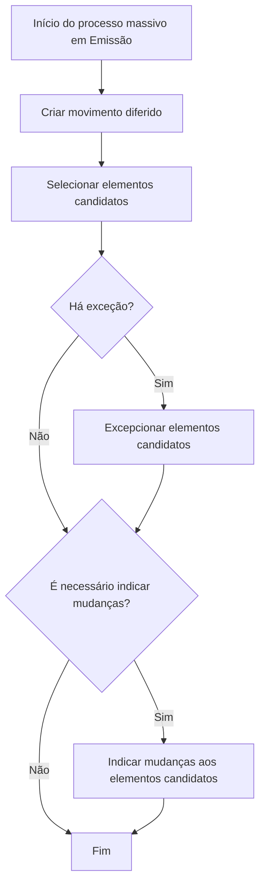

# Processo Massivo em Emissão no REEF Core

## 1. Metadados do Documento
- **Arquivo de Origem:** Não identificado no conteúdo fornecido
- **Tipo de Documento:** Procedimento
- **Domínio / Sistema:** REEF Core / Emissão
- **Público-Alvo:** Operação, analistas funcionais e desenvolvedores
- **Data/Versão Identificada:** Não identificada

---

## 2. Resumo Executivo & Contexto de Negócio

O documento descreve o conceito de **processo massivo** no contexto de Emissão do sistema REEF Core. O REEF Core é apresentado como um conjunto de operações, algumas das quais podem ser executadas imediatamente, em linha, ou de forma diferida no tempo.

Quando uma operação pode ser adiada, o processo permite definir quais elementos serão afetados. Os elementos podem ser únicos ou múltiplos; o exemplo apresentado cita a seleção de várias apólices para execução de um determinado suplemento.

O processo massivo determina três aspectos centrais: qual operação diferida será executada, quais elementos serão impactados e quais modificações esses elementos sofrerão. O objetivo do procedimento é orientar as ações necessárias para que uma operação possa ser posteriormente lançada de forma diferida.

O material não se concentra em uma operação específica. Também não detalha contratos técnicos, APIs, regras de seleção, tipos de exceção, estrutura de dados ou critérios para indicar alterações nos elementos candidatos.

---

## 3. Arquitetura, Componentes & Tecnologias Envolvidas

### Componentes e conceitos identificados

| Componente / Conceito | Descrição sustentada pelo documento |
| :--- | :--- |
| REEF Core | Sistema formado por uma série de operações. |
| Emissão | Contexto no qual o processo massivo é criado. |
| Operação em linha | Operação realizada no momento. |
| Operação diferida | Operação cuja execução pode ocorrer posteriormente. |
| Processo massivo | Processo que define a operação diferida, os elementos afetados e as modificações aplicáveis. |
| Movimento diferido | Etapa inicial de criação para viabilizar uma operação diferida. |
| Elementos candidatos | Elementos selecionados para possível impacto pela operação; o exemplo cita apólices. |
| Exceção | Condição do fluxo que leva ao tratamento de elementos candidatos por exceção. |
| Alterações nos elementos candidatos | Modificações que podem ser indicadas para os elementos selecionados. |



> **Nota de Análise:** O conteúdo não descreve arquitetura de infraestrutura, microsserviços, tecnologias de implementação, métodos HTTP, contratos JSON, bancos de dados, URLs ou ambientes.

---

## 4. Regras de Negócio, Especificações Funcionais & Processos

### Conceito de processo massivo

1. O REEF Core é formado por uma série de operações.
2. Determinadas operações podem ser realizadas:
   - No momento, em linha.
   - De forma diferida no tempo.
3. Quando uma operação pode ser diferida, é possível determinar os elementos afetados pela operação.
4. Uma operação diferida pode afetar:
   - Um único elemento.
   - Vários elementos.
5. O exemplo fornecido descreve a seleção de várias apólices para realizar determinado suplemento.
6. O processo massivo define:
   - A operação diferida que será realizada.
   - Os elementos afetados pela operação.
   - As modificações que os elementos sofrerão.

### Objetivo do procedimento

O objetivo é conhecer as ações necessárias para que uma operação possa ser posteriormente executada de forma diferida. O documento declara expressamente que não se concentra em nenhuma operação específica.

### Fluxo operacional identificado

1. **Criar movimento diferido**
   - É a primeira etapa do fluxo.
   - O conteúdo não detalha os dados obrigatórios, validações ou resultado técnico da criação.

2. **Selecionar elementos candidatos**
   - Os elementos que poderão ser afetados pela operação diferida devem ser selecionados.
   - O documento não informa critérios, filtros, origem dos elementos ou quantidade máxima de elementos candidatos.

3. **Verificar existência de exceção**
   - O fluxo possui uma decisão: “Há exceção?”.
   - Quando houver exceção, os elementos candidatos devem passar pela etapa de exceção.
   - O documento não define o conceito de exceção, os critérios de identificação ou os efeitos sobre a execução posterior.

4. **Excepcionar elementos candidatos**
   - Esta etapa é realizada quando há exceção.
   - O documento não detalha se excepcionar significa excluir, bloquear, alterar ou marcar os elementos candidatos.

5. **Verificar necessidade de indicar mudanças**
   - O fluxo possui uma decisão: “É necessário indicar mudanças?”.
   - Quando necessário, devem ser informadas mudanças aos elementos candidatos.

6. **Indicar mudanças aos elementos candidatos**
   - As alterações a realizar sobre os elementos candidatos devem ser indicadas.
   - O documento não detalha quais campos podem ser alterados, regras de validação, formatos ou efeitos das mudanças.

7. **Finalizar**
   - O processo termina após a decisão sobre a necessidade de indicar mudanças e, quando aplicável, após o registro das mudanças.

---

## 5. Tabelas de Parâmetros, Ambientes e Estruturas de Dados

| Item / Parâmetro | Descrição / Função | Tipo / Valores / Formato | Ambiente / Observações |
| :--- | :--- | :--- | :--- |
| Operação | Ação pertencente ao conjunto de operações do REEF Core. | Não especificado. | Pode ser realizada em linha ou de forma diferida, conforme o documento. |
| Execução em linha | Realização da operação no momento. | Condição de execução. | Sem detalhamento adicional. |
| Execução diferida | Realização da operação posteriormente. | Condição de execução. | Requer o processo massivo descrito. |
| Movimento diferido | Etapa criada no início do processo. | Não especificado. | O documento não informa campos ou regras de criação. |
| Elementos candidatos | Elementos potencialmente afetados pela operação. | Um ou vários elementos. | O exemplo apresentado menciona apólices. |
| Exceção | Decisão condicional no fluxo de processo. | Sim / Não. | Não há definição, classificação ou tratamento técnico detalhado. |
| Mudanças aos elementos candidatos | Alterações aplicáveis aos elementos selecionados. | Sim / Não quanto à necessidade de indicação. | Campos, formatos e regras não são informados. |
| Suplemento | Operação exemplificada para uma série de apólices. | Não especificado. | Mencionado apenas como exemplo. |
| Ambiente | Informações de ambiente, servidor ou URL. | Não especificado. | O conteúdo fornecido não apresenta ambientes, servidores, URLs ou rotas de log. |

---

## 6. Bateria de Perguntas & Respostas para RAG (FAQ Sintético)

### P1: O que é um processo massivo no REEF Core?
**R:** Um processo massivo é o processo que determina qual operação diferida será realizada, quais elementos serão afetados por essa operação e quais modificações esses elementos sofrerão.

### P2: Quais formas de execução de operações são mencionadas para o REEF Core?
**R:** O documento informa que determinadas operações do REEF Core podem ser realizadas no momento, em linha, ou de forma diferida no tempo.

### P3: Uma operação diferida pode afetar mais de um elemento?
**R:** Sim. Quando uma operação pode ser diferida, é permitido determinar os elementos afetados, que podem ser um único elemento ou vários elementos.

### P4: Qual exemplo de elementos afetados por uma operação é apresentado?
**R:** O exemplo apresentado é a seleção de uma série de apólices para realizar um determinado suplemento.

### P5: Qual é a primeira etapa do processo massivo em Emissão?
**R:** A primeira etapa é criar o movimento diferido.

### P6: O que ocorre após a criação do movimento diferido?
**R:** Após criar o movimento diferido, o processo segue para a seleção dos elementos candidatos que poderão ser afetados pela operação.

### P7: O que deve ocorrer quando há uma exceção no fluxo?
**R:** Quando há exceção, o fluxo indica que os elementos candidatos devem ser excepcionados. O documento não detalha o significado operacional ou técnico dessa exceção.

### P8: Quando devem ser indicadas mudanças aos elementos candidatos?
**R:** As mudanças devem ser indicadas quando o fluxo determinar que há necessidade de informar alterações aos elementos candidatos.

### P9: O documento define os campos ou formatos das mudanças aplicáveis aos elementos candidatos?
**R:** Não. O documento apenas indica a etapa de informar mudanças aos elementos candidatos, sem especificar campos, formatos, validações ou regras de negócio adicionais.

### P10: O documento descreve uma operação específica do REEF Core?
**R:** Não. O objetivo declarado é explicar as ações necessárias para lançar posteriormente uma operação de forma diferida, sem se concentrar em nenhuma operação concreta.

### P11: O documento informa APIs, métodos HTTP ou contratos JSON do processo massivo?
**R:** Não. O conteúdo não apresenta APIs, métodos HTTP, contratos JSON, tecnologias de implementação ou interfaces técnicas.

### P12: O fluxo pode terminar sem indicar mudanças aos elementos candidatos?
**R:** Sim. O diagrama apresentado indica que, quando não há necessidade de indicar mudanças, o processo segue diretamente para o fim.

---

## 7. Glossário de Termos, Siglas & Conceitos-Chave

- **REEF Core:** Sistema descrito como formado por uma série de operações.
- **Emissão:** Contexto funcional no qual é criado o processo massivo.
- **Operação em linha:** Operação realizada no momento.
- **Operação diferida:** Operação cuja realização é postergada no tempo.
- **Processo massivo:** Processo que define a operação diferida, os elementos afetados e suas modificações.
- **Movimento diferido:** Etapa inicial do processo para criação de uma execução diferida.
- **Elemento candidato:** Elemento selecionado para possível impacto pela operação diferida.
- **Exceção:** Condição decisória do fluxo que exige excepcionar elementos candidatos; o documento não define seu significado detalhado.
- **Suplemento:** Tipo de operação citado como exemplo para uma série de apólices.
- **Apólice:** Elemento citado como possível alvo de um suplemento.

---

## 8. Notas Críticas, Riscos & Limitações

- O conteúdo não identifica o arquivo de origem, data, versão ou autor.
- O documento não descreve uma operação específica; portanto, não fornece regras particulares de operações de Emissão.
- Não há detalhamento sobre os dados necessários para criar um movimento diferido.
- Não são apresentados critérios para selecionar elementos candidatos.
- O conceito de exceção não é definido, nem são especificadas suas consequências funcionais ou técnicas.
- Não há detalhamento sobre alterações permitidas, campos, validações ou formatos para os elementos candidatos.
- O conteúdo não apresenta contratos de integração, APIs, métodos HTTP, mensagens, URLs, ambientes, servidores, rotas de log ou mecanismos de monitoramento.
- Não são informadas regras de autorização, perfis de acesso, auditoria, reprocessamento ou tratamento de falhas.

---

## 9. Conteúdo Bruto Estruturado (Referência Fiel)

```text
--- [PÁGINA 1 DE 2] ---

CREAR proceso masivo en Emisión
¿En que consiste?
Reef.core está formado por una serie de operaciones. Ciertas operaciones se pueden realizar tanto
en el momento (en línea), como diferidas en el tiempo. Cuando una operación se puede diferir,
además, se permite determinar a qué elementos afectará la operación (puede ser uno o varios
elementos). Por ejemplo, se puede seleccionar una serie de pólizas a las que realizar un
determinado suplemento.
Al proceso que determina qué operación diferida se va a realizar, a qué elementos afectará esa
operación y qué modificaciones sufrirán los elementos, se le denomina proceso masivo.
Objetivo
Conocer que acciones se deben realizar para que posteriormente se pueda lanzar una operación de
forma diferida. Este documento no se centra en ninguna operación en concreto.
Proceso a seguir
SI
NO
SI
NO
CREAR
movimiento
diferido (1)
SELECCIONAR
elementos
candidatos (2)
¿Hay
excepción?
EXCEPCIONAR
elementos
candidatos (3)
¿Hay
que
indicar
cambios? INDICAR cambios
a elementos
candidatos (4)
FIN
1. CREAR movimiento diferido
 /
 RS
Inicio Soluciones APIs Documentación Zeus
ES


--- [PÁGINA 2 DE 2] ---

2. SELECCIONAR elementos candidatos
3. EXCEPCIONAR elementos candidatos
4. INDICAR cambios a realizar sobre los elementos candidatos
```
