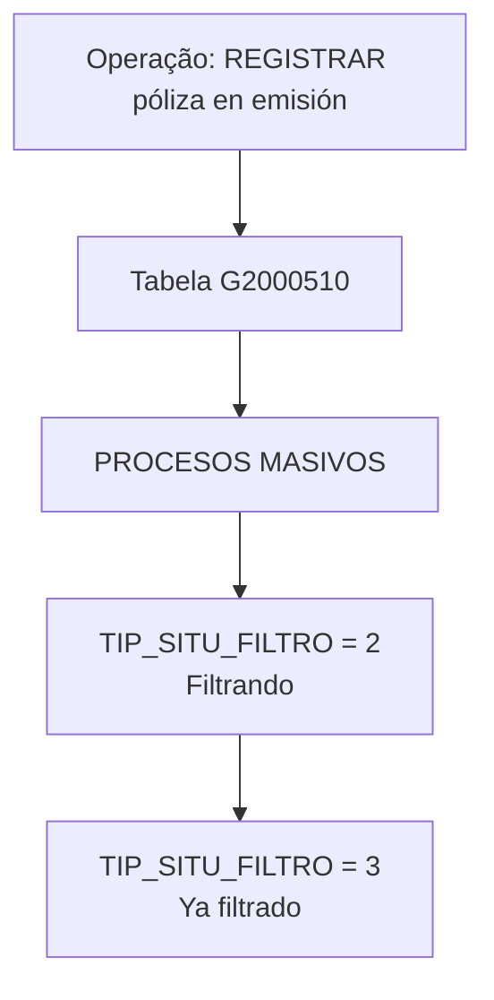

# Registro de Póliza en Emisión — Modelo de Datos y Tabla G2000510 de Procesos Masivos

## 1. Metadados do Documento
- **Arquivo de Origem:** Não identificado
- **Tipo de Documento:** Especificação Técnica
- **Domínio / Sistema:** Registro de póliza em emissão; processos massivos
- **Público-Alvo:** Desenvolvedores, Arquitetos, Operação
- **Data/Versão Identificada:** Não identificada

---

## 2. Resumo Executivo & Contexto de Negócio

O documento descreve, em estado de construção, a operação **“REGISTRAR póliza en emisión”**. O conteúdo identifica o modelo de dados envolvido nessa operação e aponta a tabela **G2000510**, descrita como **PROCESOS MASIVOS**.

A especificação fornecida concentra-se nos campos da tabela G2000510 e na obrigatoriedade de cada coluna para a operação. Os campos apresentados incluem identificadores de companhia, datas, número de ordem, tipo de movimento em lote, usuário e indicadores associados ao processo.

A regra funcional mais detalhada refere-se ao campo **TIP_SITU_FILTRO**. Durante a operação, esse campo assume diferentes valores conforme a etapa de filtragem: valor **2 — Filtrando** e, posteriormente, valor **3 — Ya filtrado**.

O documento também apresenta referências textuais a **“CF”**, **“Home Solutions APIs Documentation Zeus”** e **“EN”**, sem explicar a relação dessas referências com a operação de registro de póliza, a tabela G2000510 ou os processos massivos.

---

## 3. Arquitetura, Componentes & Tecnologias Envolvidas

### Componentes e artefatos identificados

| Componente / Artefato | Descrição sustentada pelo documento |
| :--- | :--- |
| Operação “REGISTRAR póliza en emisión” | Operação em construção para registrar uma póliza em emissão. |
| G2000510 | Tabela identificada como participante da operação. |
| PROCESOS MASIVOS | Descrição associada à tabela G2000510. |
| TIP_SITU_FILTRO | Campo que representa uma situação de filtragem e muda de valor conforme o momento da operação. |
| Home Solutions APIs Documentation Zeus | Referência textual presente no conteúdo bruto, sem detalhamento adicional. |
| CF | Referência textual presente no conteúdo bruto, sem detalhamento adicional. |
| EN | Referência textual presente no conteúdo bruto, sem detalhamento adicional. |



> **Nota de Análise:** O documento não detalha aplicações clientes, APIs, microsserviços, métodos HTTP, contratos JSON, banco de dados, tecnologia de persistência ou integrações externas associadas à tabela G2000510.

---

## 4. Regras de Negócio, Especificações Funcionais & Processos

### Operação identificada
- A operação está indicada como **“EN CONSTRUCCIÓN”**.
- O objetivo operacional explícito é **“REGISTRAR póliza en emisión”**.
- O modelo de dados envolvido inclui a tabela **G2000510 — PROCESOS MASIVOS**.

### Regra de situação de filtragem
1. O campo **TIP_SITU_FILTRO** assume vários valores dependendo do momento da operação.
2. Durante a etapa de filtragem, o valor indicado é **2 — Filtrando**.
3. Posteriormente, após a filtragem, o valor indicado é **3 — Ya filtrado**.
4. O campo **TIP_SITU_FILTRO** é obrigatório.

### Regras de obrigatoriedade identificadas
- São obrigatórios: **COD_CIA**, **FEC_TRATAMIENTO**, **NUM_ORDEN**, **TIP_MVTO_BATCH**, **TIP_SITU_FILTRO**, **MCA_RECALCULA_FECHA** e **COD_USR**.
- Não são obrigatórios: **TXT_ALIAS**, **NOM_PRG_EXCEPCION**, **TIP_FECHA_BASE**, **FEC_ACTU**, **TXT_MCA_PROCESO_ESTANDAR** e **IDN_PROCESO_PERSONALIZADO**.
- Para os campos apresentados, a coluna **CAMBIA VALOR** contém predominantemente o valor **N**. A exceção explícita é **TIP_SITU_FILTRO**, cujo valor é **S**.

> **Nota de Análise:** O documento não descreve o significado dos indicadores `N` e `S` na coluna “CAMBIA VALOR”, exceto pelo comportamento observável de TIP_SITU_FILTRO, que pode mudar conforme a etapa de filtragem.

---

## 5. Tabelas de Parâmetros, Ambientes e Estruturas de Dados

### Tabela envolvida

| Item / Parâmetro | Descrição / Função | Tipo / Valores / Formato | Ambiente / Observações |
| :--- | :--- | :--- | :--- |
| G2000510 | Tabela participante da operação de registrar póliza em emissão. | Tabela de dados | Descrita como `PROCESOS MASIVOS`. |
| PROCESOS MASIVOS | Descrição associada à tabela G2000510. | Descrição textual | Não há detalhamento adicional. |

### Campos identificados na tabela G2000510

| Item / Parâmetro | Descrição / Função | Tipo / Valores / Formato | Ambiente / Observações |
| :--- | :--- | :--- | :--- |
| COD_CIA | Campo da tabela G2000510. | Cambia valor: `N` | Obrigatório: `SI`. |
| FEC_TRATAMIENTO | Campo da tabela G2000510. | Cambia valor: `N` | Obrigatório: `SI`. |
| NUM_ORDEN | Campo da tabela G2000510. | Cambia valor: `N` | Obrigatório: `SI`. |
| TIP_MVTO_BATCH | Campo da tabela G2000510. | Cambia valor: `N` | Obrigatório: `SI`. |
| TXT_ALIAS | Campo da tabela G2000510. | Cambia valor: `N` | Obrigatório: `NO`. |
| TIP_SITU_FILTRO | Situação de filtragem na operação. | Cambia valor: `S`; valores: `2 — Filtrando`, depois `3 — Ya filtrado` | Obrigatório: `SI`. |
| NOM_PRG_EXCEPCION | Campo da tabela G2000510. | Cambia valor: `N` | Obrigatório: `NO`. |
| MCA_RECALCULA_FECHA | Campo da tabela G2000510. | Cambia valor: `N` | Obrigatório: `SI`. |
| TIP_FECHA_BASE | Campo da tabela G2000510. | Cambia valor: `N` | Obrigatório: `NO`. |
| COD_USR | Campo da tabela G2000510. | Cambia valor: `N` | Obrigatório: `SI`. |
| FEC_ACTU | Campo da tabela G2000510. | Cambia valor: `N` | Obrigatório: `NO`. |
| TXT_MCA_PROCESO_ESTANDAR | Campo da tabela G2000510. | Cambia valor: `N` | Obrigatório: `NO`. |
| IDN_PROCESO_PERSONALIZADO | Campo da tabela G2000510. | Cambia valor: `N` | Obrigatório: `NO`. |

### Referências adicionais sem detalhamento

| Item / Parâmetro | Descrição / Função | Tipo / Valores / Formato | Ambiente / Observações |
| :--- | :--- | :--- | :--- |
| CF | Referência textual presente no documento. | Não informado | Sem contexto adicional. |
| Home Solutions APIs Documentation Zeus | Referência textual presente no documento. | Não informado | Sem relação técnica detalhada. |
| EN | Referência textual presente no documento. | Não informado | Sem contexto adicional. |

---

## 6. Bateria de Perguntas & Respostas para RAG (FAQ Sintético)

### P1: Qual é a operação descrita no documento?
**R:** A operação descrita é **“REGISTRAR póliza en emisión”**. O documento informa que essa operação está **“EN CONSTRUCCIÓN”** e identifica a tabela G2000510 como parte do modelo de dados envolvido.

### P2: Qual tabela participa da operação de registrar póliza em emissão?
**R:** A tabela identificada no documento é a **G2000510**, cuja descrição é **PROCESOS MASIVOS**.

### P3: Quais são os valores possíveis documentados para TIP_SITU_FILTRO?
**R:** O documento informa que **TIP_SITU_FILTRO** pode assumir vários valores conforme o momento da operação. Os valores explicitamente documentados são **2 — Filtrando** e, posteriormente, **3 — Ya filtrado**.

### P4: Qual é a sequência de estados documentada para TIP_SITU_FILTRO?
**R:** A sequência explicitamente apresentada é: primeiro **2 — Filtrando**; posteriormente, **3 — Ya filtrado**.

### P5: TIP_SITU_FILTRO é obrigatório na tabela G2000510?
**R:** Sim. O documento marca o campo **TIP_SITU_FILTRO** como obrigatório, com o valor **SI** na coluna de obrigatoriedade.

### P6: Quais campos obrigatórios são identificados para a tabela G2000510?
**R:** Os campos obrigatórios identificados são **COD_CIA**, **FEC_TRATAMIENTO**, **NUM_ORDEN**, **TIP_MVTO_BATCH**, **TIP_SITU_FILTRO**, **MCA_RECALCULA_FECHA** e **COD_USR**.

### P7: TXT_ALIAS é um campo obrigatório?
**R:** Não. O documento registra **TXT_ALIAS** com obrigatoriedade **NO** e valor `N` na coluna **CAMBIA VALOR**.

### P8: NOM_PRG_EXCEPCION é obrigatório para registrar uma póliza em emissão?
**R:** Não. O campo **NOM_PRG_EXCEPCION** está marcado como não obrigatório, com o valor **NO** na coluna de obrigatoriedade.

### P9: Quais campos não obrigatórios são listados no documento?
**R:** Os campos não obrigatórios listados são **TXT_ALIAS**, **NOM_PRG_EXCEPCION**, **TIP_FECHA_BASE**, **FEC_ACTU**, **TXT_MCA_PROCESO_ESTANDAR** e **IDN_PROCESO_PERSONALIZADO**.

### P10: O documento especifica métodos HTTP ou contratos JSON para a operação?
**R:** Não. O documento fornecido não descreve métodos HTTP, endpoints, contratos JSON, APIs, microsserviços ou protocolos de integração para a operação de registrar póliza em emissão.

### P11: O que significa o indicador “S” em CAMBIA VALOR para TIP_SITU_FILTRO?
**R:** O documento mostra `S` para **TIP_SITU_FILTRO** e documenta que esse campo muda conforme a etapa da operação. Entretanto, não apresenta uma definição formal para o indicador `S`.

### P12: O que são “Home Solutions APIs Documentation Zeus”, “CF” e “EN” no documento?
**R:** Esses termos aparecem no conteúdo bruto como referências textuais. O documento não explica seus significados nem estabelece uma relação detalhada entre essas referências, a operação de registro de póliza ou a tabela G2000510.

---

## 7. Glossário de Termos, Siglas & Conceitos-Chave

- **COD_CIA:** Campo da tabela G2000510; o documento não expande seu significado. É obrigatório.
- **COD_USR:** Campo da tabela G2000510; o documento não expande seu significado. É obrigatório.
- **FEC_ACTU:** Campo da tabela G2000510; o documento não expande seu significado. Não é obrigatório.
- **FEC_TRATAMIENTO:** Campo da tabela G2000510; o documento não expande seu significado. É obrigatório.
- **G2000510:** Tabela descrita como **PROCESOS MASIVOS**.
- **IDN_PROCESO_PERSONALIZADO:** Campo da tabela G2000510; o documento não expande seu significado. Não é obrigatório.
- **MCA_RECALCULA_FECHA:** Campo da tabela G2000510; o documento não expande seu significado. É obrigatório.
- **NOM_PRG_EXCEPCION:** Campo da tabela G2000510; o documento não expande seu significado. Não é obrigatório.
- **NUM_ORDEN:** Campo da tabela G2000510; o documento não expande seu significado. É obrigatório.
- **Póliza en emisión:** Objeto da operação de registro mencionada no documento.
- **PROCESOS MASIVOS:** Descrição da tabela G2000510.
- **TIP_FECHA_BASE:** Campo da tabela G2000510; o documento não expande seu significado. Não é obrigatório.
- **TIP_MVTO_BATCH:** Campo da tabela G2000510; o documento não expande seu significado. É obrigatório.
- **TIP_SITU_FILTRO:** Campo obrigatório associado à situação de filtragem; pode assumir os valores 2 — Filtrando e 3 — Ya filtrado.
- **TXT_ALIAS:** Campo da tabela G2000510; não é obrigatório.
- **TXT_MCA_PROCESO_ESTANDAR:** Campo da tabela G2000510; não é obrigatório.

---

## 8. Notas Críticas, Riscos & Limitações

- O documento está explicitamente marcado como **“EN CONSTRUCCIÓN”**, indicando que o conteúdo pode não representar uma especificação final.
- Não há definição funcional para vários campos, incluindo `COD_CIA`, `FEC_TRATAMIENTO`, `NUM_ORDEN`, `TIP_MVTO_BATCH` e `MCA_RECALCULA_FECHA`.
- Não há definição formal para os valores `N` e `S` da coluna **CAMBIA VALOR**.
- Não são apresentados tipos de dados, tamanhos, domínios de valores, chaves, índices, relações entre tabelas ou regras de integridade da tabela G2000510.
- Não há detalhamento de APIs, serviços, integrações, ambientes, URLs, credenciais, logs, tratamento de erros ou mecanismos transacionais.
- As referências **CF**, **Home Solutions APIs Documentation Zeus** e **EN** não possuem explicação contextual no conteúdo fornecido.

---

## 9. Conteúdo Bruto Estruturado (Referência Fiel)

```text
--- [PÁGINA 1 DE 3] ---

EN CONSTRUCCIÓN
REGISTRAR póliza en emisión
Modelo de datos involucrado
Las tablas que intervienen en esta operación son:
G2000510
TABLA DESCRIPCIÓN
G2000510 PROCESOS MASIVOS
COLUMNA CAMBIA
VALOR
MOTIVO/VALOR OBLIGATORIA
COD_CIA N N.A. SI
FEC_TRATAMIENTO N N.A. SI
 / 
 CF
Home Solutions APIs Documentation Zeus
EN


--- [PÁGINA 2 DE 3] ---

COLUMNA CAMBIA
VALOR
MOTIVO/VALOR OBLIGATORIA
NUM_ORDEN N N.A. SI
TIP_MVTO_BATCH N N.A. SI
TXT_ALIAS N N.A. NO
TIP_SITU_FILTRO S En esta
operación toma
varios valores
dependiendo del
momento. Los
valores son 2-
Filtrando y
posteriormente
3-Ya filtrado
SI
NOM_PRG_EXCEPCION N N.A. NO
MCA_RECALCULA_FECHA N N.A. SI
TIP_FECHA_BASE N N.A. NO


--- [PÁGINA 3 DE 3] ---

COLUMNA CAMBIA
VALOR
MOTIVO/VALOR OBLIGATORIA
COD_USR N N.A. SI
FEC_ACTU N N.A. NO
TXT_MCA_PROCESO_ESTANDAR N N.A. NO
IDN_PROCESO_PERSONALIZADO N N.A. NO
```
