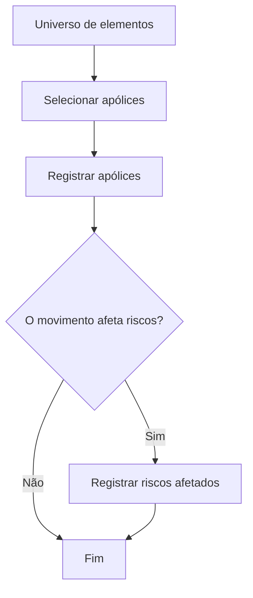

# Seleção e Registro de Elementos Candidatos no Processo Massivo de Emissão

## 1. Metadados do Documento
- **Arquivo de Origem:** Não identificado
- **Tipo de Documento:** Procedimento
- **Domínio / Sistema:** Emissão; processo massivo; Home Solutions APIs Documentation Zeus
- **Público-Alvo:** Operação, negócio e equipes técnicas envolvidas em emissão
- **Data/Versão Identificada:** Não identificada

---

## 2. Resumo Executivo & Contexto de Negócio

O documento descreve a etapa de seleção de elementos candidatos em um processo massivo de emissão, com vínculo à visão técnica. A seleção consiste em incluir os elementos que inicialmente se pretende afetar pelo processamento massivo.

O universo de elementos pode conter apólices (“pólizas”). A partir desse universo, o processo identifica as apólices que devem ser processadas pelo movimento massivo.

O objetivo declarado é conhecer as formas de incluir elementos para que participem do movimento do processo massivo. O fluxo apresentado começa pela seleção de apólices e prossegue com o seu registro.

Após registrar as apólices, o processo verifica se o movimento afeta riscos. Quando o movimento afeta riscos, os riscos afetados devem ser registrados; caso contrário, o fluxo é encerrado.

---

## 3. Arquitetura, Componentes & Tecnologias Envolvidas

Os elementos explicitamente citados são:

- Processo massivo de emissão.
- Movimento aplicado a elementos candidatos.
- Universo de elementos, incluindo apólices.
- Registro de apólices.
- Registro de riscos afetados, condicionado ao impacto do movimento sobre riscos.
- “Home Solutions APIs Documentation Zeus”, citado no conteúdo bruto sem detalhamento adicional.



> **Nota de Análise:** O documento não detalha interfaces, APIs, métodos HTTP, contratos JSON, tecnologias de implementação, ambientes ou responsabilidades técnicas do componente “Home Solutions APIs Documentation Zeus”.

---

## 4. Regras de Negócio, Especificações Funcionais & Processos

1. Os elementos candidatos são os elementos inicialmente pretendidos para impacto pelo processo massivo.
2. A seleção parte de um universo de elementos, sendo as apólices um exemplo explícito de elemento desse universo.
3. As apólices selecionadas devem ser registradas no processo.
4. Após o registro das apólices, deve ser avaliado se o movimento afeta riscos.
5. Se o movimento afetar riscos, os riscos afetados devem ser registrados.
6. Se o movimento não afetar riscos, o processo termina sem etapa de registro de riscos.
7. O objetivo operacional é garantir a inclusão dos elementos que devem compor o movimento no processo massivo.

### Fluxo operacional

1. Selecionar apólices.
2. Registrar apólices.
3. Avaliar se o movimento afeta riscos.
4. Quando a resposta for “Sim”, registrar riscos afetados.
5. Encerrar o processo.

---

## 5. Tabelas de Parâmetros, Ambientes e Estruturas de Dados

| Item / Parâmetro | Descrição / Função | Tipo / Valores / Formato | Ambiente / Observações |
| :--- | :--- | :--- | :--- |
| Elementos candidatos | Elementos inicialmente pretendidos para impacto pelo processo massivo. | Universo de elementos | O documento cita apólices como exemplo. |
| Apólices | Elementos selecionados para participação no movimento massivo. | Pólizas | Devem ser selecionadas e registradas. |
| Movimento | Processo que afeta os elementos candidatos selecionados. | Processo massivo | A afetação a riscos deve ser avaliada. |
| Afeta riscos? | Decisão que determina se riscos afetados precisam ser registrados. | Sim / Não | “Sim” direciona ao registro de riscos; “Não” encerra o fluxo. |
| Riscos afetados | Riscos impactados pelo movimento. | Não detalhado | Devem ser registrados somente quando o movimento afeta riscos. |
| Home Solutions APIs Documentation Zeus | Termo presente no documento bruto. | Não detalhado | Não há descrição funcional ou técnica adicional. |

---

## 6. Bateria de Perguntas & Respostas para RAG (FAQ Sintético)

### P1: O que significa selecionar elementos candidatos no processo massivo?
**R:** Significa incluir os elementos que inicialmente se pretende afetar pelo processo massivo. O documento indica que, dentro do universo de elementos, podem existir apólices que devem ser selecionadas para processamento.

### P2: Qual é o objetivo da seleção de elementos candidatos?
**R:** O objetivo é conhecer as formas de incluir elementos para que esses elementos façam parte do movimento no processo massivo.

### P3: Quais elementos são citados como exemplo no universo de elementos?
**R:** O documento cita apólices, denominadas “pólizas”, como exemplo de elementos pertencentes ao universo que pode ser considerado pelo processo massivo.

### P4: Qual é a primeira etapa do processo apresentado?
**R:** A primeira etapa é selecionar apólices. Essa seleção identifica as apólices que devem ser incluídas no movimento do processo massivo.

### P5: O que acontece depois da seleção de apólices?
**R:** Depois da seleção, as apólices devem ser registradas. Após o registro, o processo verifica se o movimento afeta riscos.

### P6: Quando os riscos afetados devem ser registrados?
**R:** Os riscos afetados devem ser registrados quando a avaliação indicar que o movimento afeta riscos.

### P7: O que acontece quando o movimento não afeta riscos?
**R:** Quando o movimento não afeta riscos, o fluxo é encerrado após o registro das apólices, sem realizar o registro de riscos afetados.

### P8: O documento especifica como registrar apólices ou riscos afetados?
**R:** Não. O documento determina que apólices e, quando aplicável, riscos afetados devem ser registrados, mas não descreve telas, campos, APIs, formatos de dados ou regras de validação para esses registros.

### P9: O documento descreve APIs ou contratos técnicos de integração?
**R:** Não. Embora o texto mencione “Home Solutions APIs Documentation Zeus”, não há detalhamento sobre métodos HTTP, endpoints, payloads, autenticação ou contratos de integração.

### P10: Qual é a condição decisória central do fluxo?
**R:** A condição decisória central é verificar se o movimento afeta riscos. A resposta “Sim” exige o registro dos riscos afetados; a resposta “Não” encerra o processo.

---

## 7. Glossário de Termos, Siglas & Conceitos-Chave

- **Elementos candidatos:** Elementos inicialmente selecionados para serem afetados pelo processo massivo.
- **Emissão:** Contexto funcional citado como relacionado à visão técnica do processo.
- **Movimento:** Processo massivo que afeta os elementos candidatos incluídos.
- **Pólizas / Apólices:** Exemplo de elemento do universo que pode ser selecionado e registrado.
- **Riscos afetados:** Riscos que devem ser registrados quando o movimento os impacta.
- **Home Solutions APIs Documentation Zeus:** Termo citado no documento sem definição adicional.

---

## 8. Notas Críticas, Riscos & Limitações

- O documento não identifica arquivo de origem, data, versão, autoria ou ambiente.
- Não há detalhamento de critérios de seleção das apólices.
- Não são especificados campos, formatos, persistência ou mecanismos de registro de apólices e riscos.
- Não há contratos de integração, URLs, métodos HTTP, tecnologias ou requisitos de segurança.
- O termo “Home Solutions APIs Documentation Zeus” é citado sem explicação de seu papel no fluxo.
- Não são informadas regras para tratamento de erro, duplicidade, reversão ou auditoria do processo massivo.

---

## 9. Conteúdo Bruto Estruturado (Referência Fiel)

```text
--- [PÁGINA 1 DE 2] ---

SELECCIONAR elementos candidatos en
Emisión (enlace con visión técnica)
¿En que consiste?
Es la inclusión de aquellos elementos que inicialmente se pretende afectar en el proceso masivo. Es
decir, del universo de elementos (como pueden ser las pólizas), se extraen aquellos que se quiere
sean procesados.
Objetivo
Conocer las formas en las que se puede incluir elementos para que estos formen parte del
movimiento en el proceso masivo.
Proceso a seguir
SI
NO
SELECCIONAR
pólizas (1)
REGISTRAR
pólizas (2)
¿Afecta el
movimiento
a riesgos? REGISTRAR
riesgos
afectados (3)
FIN
1. SELECCIONAR pólizas
 /
 CF
Home Solutions APIs Documentation Zeus
EN


--- [PÁGINA 2 DE 2] ---

2. REGISTRAR pólizas
3. REGISTRAR riesgos afectados
```
