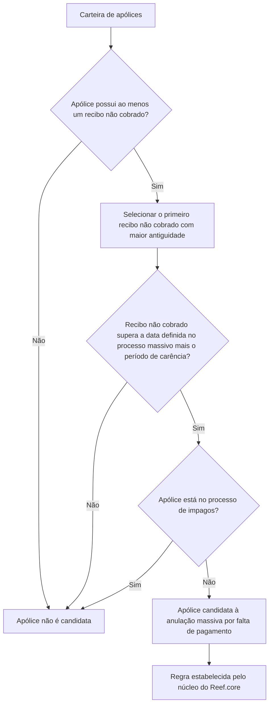

# Filtro de Apólices em Emissão — Anulação por Falta de Pagamento

## 1. Metadados do Documento
- **Arquivo de Origem:** Não identificado
- **Tipo de Documento:** Especificação Técnica
- **Domínio / Sistema:** Reef.core — processo de anulação por falta de pagamento
- **Público-Alvo:** Operação, Negócio e Desenvolvedores
- **Data/Versão Identificada:** Não identificada

---

## 2. Resumo Executivo & Contexto de Negócio

O documento descreve um filtro aplicado durante a emissão de apólices para determinar quais apólices são candidatas a um processo massivo de anulação por falta de pagamento.

A seleção é realizada sobre a carteira de apólices. Uma apólice é candidata quando possui pelo menos um recibo não cobrado até a data definida no processo massivo, acrescida do período de carência estabelecido.

O filtro também impõe uma exclusão: apólices que se encontrem no processo de inadimplência (*impagos*) não devem ser consideradas por este critério. Quando houver mais de um recibo não cobrado, o processo utiliza o primeiro recibo não cobrado com maior antiguidade.

O documento informa que não é necessária ação manual do usuário, pois o filtro já está estabelecido pelo núcleo do Reef.core. Não há detalhamento de parâmetros, interfaces, contratos de integração, métodos HTTP ou persistência de dados.

---

## 3. Arquitetura, Componentes & Tecnologias Envolvidas

| Componente / Termo | Papel identificado |
| :--- | :--- |
| Reef.core | Núcleo que contém o filtro para identificação de apólices candidatas à anulação por falta de pagamento. |
| Carteira | Conjunto de apólices do qual são extraídas as candidatas ao processo massivo. |
| Processo massivo de anulação | Processo que define uma data de referência e avalia recibos não cobrados considerando o período de carência. |
| Processo de inadimplência (*impagos*) | Processo cuja participação exclui a apólice da seleção descrita. |
| Recibo não cobrado | Condição necessária para que uma apólice possa ser candidata à anulação. |



> **Nota de Análise:** O documento cita o núcleo do Reef.core, mas não detalha módulos internos, bancos de dados, serviços, métodos HTTP, contratos JSON, eventos ou tecnologias adicionais.

---

## 4. Regras de Negócio, Especificações Funcionais & Processos

1. O filtro tem a finalidade de determinar quais apólices serão candidatas a um processo massivo de anulação por falta de pagamento.
2. A análise é executada sobre a carteira de apólices.
3. A apólice deve possuir pelo menos um recibo que não tenha sido cobrado.
4. O recibo não cobrado deve estar vencido em relação à data definida pelo processo massivo, considerando adicionalmente o período de carência estabelecido.
5. A apólice não pode estar incluída no processo de inadimplência, denominado *impagos* no documento.
6. Caso existam diversos recibos não cobrados para uma mesma apólice, o processo considera o primeiro recibo não cobrado com maior antiguidade.
7. O usuário não precisa executar qualquer ação manual para aplicar o filtro.
8. O filtro é informado como uma regra já estabelecida pelo núcleo do Reef.core.

> **Nota de Análise:** O texto não informa como são definidos a data do processo massivo, o período de carência, os critérios técnicos para identificar a participação em *impagos* ou a ação executada após a classificação da apólice como candidata.

---

## 5. Tabelas de Parâmetros, Ambientes e Estruturas de Dados

| Item / Parâmetro | Descrição / Função | Tipo / Valores / Formato | Ambiente / Observações |
| :--- | :--- | :--- | :--- |
| Apólice | Unidade avaliada para possível anulação por falta de pagamento. | Não especificado | Pertence à carteira analisada. |
| Recibo não cobrado | Recibo cuja ausência de cobrança pode tornar a apólice candidata. | Não especificado | Deve haver pelo menos um recibo não cobrado. |
| Data definida no processo massivo | Data de referência para avaliar a antiguidade do recibo não cobrado. | Data; formato não especificado | É combinada com o período de carência. |
| Período de carência | Período adicional considerado na elegibilidade da apólice. | Não especificado | Valor não informado no documento. |
| Primeiro recibo não cobrado com maior antiguidade | Recibo utilizado na avaliação quando houver mais de um recibo não cobrado. | Critério de seleção | O documento não define a ordem técnica de identificação. |
| Processo de impagos | Processo de inadimplência cuja presença exclui a apólice do filtro. | Status/processo; formato não especificado | Apólices nesse processo não são candidatas segundo esta regra. |
| Reef.core | Núcleo no qual o filtro está estabelecido. | Sistema/componente | Não requer ação manual do usuário. |
| Ambiente | Não informado. | Não informado | O documento não fornece URLs, servidores ou ambientes. |

---

## 6. Bateria de Perguntas & Respostas para RAG (FAQ Sintético)

### P1: Qual é o objetivo do filtro de apólices em emissão para anulação por falta de pagamento?
**R:** O filtro determina quais apólices serão candidatas a um processo massivo de anulação por falta de pagamento.

### P2: Qual condição de cobrança uma apólice precisa atender para ser candidata à anulação?
**R:** A apólice precisa possuir pelo menos um recibo que não tenha sido cobrado até a data definida no processo massivo, considerando também o período de carência estabelecido.

### P3: Como o período de carência participa da seleção de apólices?
**R:** O período de carência é considerado em conjunto com a data definida no processo massivo para avaliar se um recibo não cobrado possui a antiguidade necessária para tornar a apólice candidata.

### P4: Uma apólice incluída no processo de impagos pode ser selecionada pelo filtro?
**R:** Não. O documento determina que a apólice não pode estar no processo de impagos para ser considerada no filtro de anulação por falta de pagamento.

### P5: Qual recibo é considerado quando uma apólice possui mais de um recibo não cobrado?
**R:** O processo considera o primeiro recibo não cobrado com maior antiguidade.

### P6: É necessário que um operador execute manualmente o filtro no Reef.core?
**R:** Não. O documento informa que nenhuma ação é necessária, pois o filtro já está estabelecido pelo núcleo do Reef.core.

### P7: O documento especifica os métodos HTTP ou contratos JSON do filtro?
**R:** Não. O documento não apresenta métodos HTTP, contratos JSON, endpoints, serviços ou interfaces técnicas associadas ao filtro.

### P8: O documento informa o valor do período de carência?
**R:** Não. O texto apenas afirma que existe um período de carência estabelecido, sem informar valor, unidade de tempo ou origem de parametrização.

### P9: O filtro avalia toda a carteira ou apenas uma apólice individual?
**R:** O objetivo descrito é extrair da carteira as apólices que atendam aos critérios para o processo massivo de anulação por falta de pagamento.

### P10: Onde está implementada a regra de filtragem descrita?
**R:** O documento declara que o filtro é um dos filtros estabelecidos pelo núcleo do Reef.core, sem detalhar o módulo ou componente interno responsável.

---

## 7. Glossário de Termos, Siglas & Conceitos-Chave

- **Apólice / Póliza:** Registro de seguro avaliado como potencial candidato à anulação por falta de pagamento.
- **Carteira:** Conjunto de apólices analisadas pelo processo.
- **Recibo não cobrado:** Recibo que não foi cobrado até a data relevante para o processo.
- **Processo massivo de anulação:** Processo que identifica múltiplas apólices candidatas à anulação.
- **Período de carência:** Período adicional considerado com a data definida no processo massivo.
- **Impagos:** Processo de inadimplência mencionado como condição de exclusão da seleção.
- **Reef.core:** Núcleo do sistema no qual o filtro está estabelecido.

---

## 8. Notas Críticas, Riscos & Limitações

- O documento não identifica arquivo de origem, versão, data, autor ou responsáveis técnicos.
- Não são fornecidos valores, formatos ou fonte de configuração para a data do processo massivo e o período de carência.
- O documento não explica o significado operacional completo do processo de *impagos*, nem como sua associação a uma apólice é determinada.
- Não há detalhamento sobre a execução posterior à identificação de uma apólice candidata, incluindo anulação efetiva, notificações, integrações ou tratamento de exceções.
- Não há informações sobre tecnologias, ambientes, URLs, logs, persistência ou contratos de integração.
- A expressão “primeiro recibo não cobrado com uma antiguidade maior” é apresentada como critério funcional, mas sem especificação de ordenação ou desempate técnico.

---

## 9. Conteúdo Bruto Estruturado (Referência Fiel)

```text
--- [PÁGINA 1 DE 1] ---

FILTRAR póliza en emisión - Anulación por falta
de pago
¿En que consiste?
Determinar qué pólizas serán candidatas en un proceso masivo de Anulación por falta de pago.
Objetivo
Extraer de la cartera aquellas pólizas que dispongan de al menos un recibo que no haya sido
cobrado a la fecha definida en el proceso masivo más el periodo de gracia establecido y que no se
encuentre en el proceso de impagos.
Para este proceso se toma el primer recibo no cobrado con una antigüedad mayor (por si existieran
más recibos sin cobrar).
Proceso a seguir
No es necesario realizar acción alguna ya que este es uno de los filtros que se encuentran
establecidos por el núcleo de Reef.core.
 / 
 CF
Home Solutions APIs Documentation Zeus
EN
```
