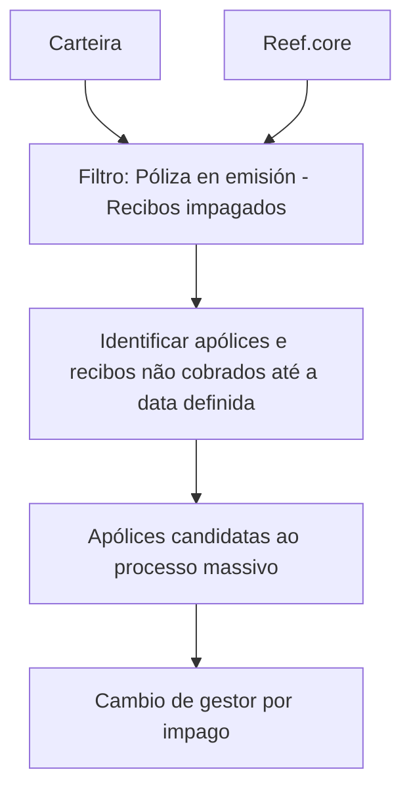
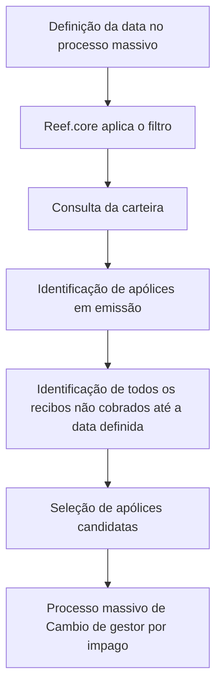

# Filtro de Pólizas en Emisión — Recibos Impagados

## 1. Metadados do Documento
- **Arquivo de Origem:** Não identificado
- **Tipo de Documento:** Procedimento
- **Domínio / Sistema:** Reef.core
- **Público-Alvo:** Operação, Negócio e equipes responsáveis por processos massivos
- **Data/Versão Identificada:** Não identificada

---

## 2. Resumo Executivo & Contexto de Negócio

O documento descreve o filtro **“póliza en emisión - Recibos impagados”**, utilizado para determinar quais apólices podem se tornar candidatas a um processo massivo de **Cambio de gestor por impago**.

O objetivo operacional consiste em extrair, da carteira, as apólices e todos os respectivos recibos que não tenham sido cobrados até a data definida pelo processo massivo. A data de referência é, portanto, um critério essencial para a seleção de recibos impagados.

O filtro não considera o período de graça. Assim, a condição de não cobrança até a data definida é tratada sem aplicação de uma exceção ou tolerância baseada nesse período.

O processo não exige ação manual do usuário. O documento informa que o filtro já está estabelecido pelo núcleo do **Reef.core**, indicando que a regra é executada como comportamento integrado à plataforma.

---

## 3. Arquitetura, Componentes & Tecnologias Envolvidas

| Componente | Papel identificado |
| :--- | :--- |
| Reef.core | Núcleo no qual o filtro de recibos impagados está estabelecido |
| Carteira | Origem das apólices e recibos avaliados |
| Processo massivo de Cambio de gestor por impago | Processo que utiliza a seleção de apólices candidatas |
| Póliza en emisión | Categoria de apólice tratada pelo filtro |
| Recibos impagados | Recibos não cobrados até a data definida no processo massivo |



**Nota de Análise:** O documento informa que o filtro é estabelecido pelo núcleo do Reef.core, mas não detalha interfaces, APIs, métodos HTTP, estruturas de dados, agendamento, critérios adicionais de elegibilidade ou contratos de integração.

---

## 4. Regras de Negócio, Especificações Funcionais & Processos

1. O filtro determina quais apólices serão candidatas em um processo massivo de **Cambio de gestor por impago**.
2. A extração deve considerar apólices pertencentes à carteira.
3. A extração deve incluir todos os recibos associados que não tenham sido cobrados.
4. A cobrança dos recibos deve ser avaliada em relação à data definida no processo massivo.
5. O movimento executado pelo filtro não considera o período de graça.
6. Não é necessário realizar ação manual para aplicar o filtro.
7. O filtro é estabelecido pelo núcleo do sistema **Reef.core**.

### Fluxo funcional identificado



---

## 5. Tabelas de Parâmetros, Ambientes e Estruturas de Dados

| Item / Parâmetro | Descrição / Função | Tipo / Valores / Formato | Ambiente / Observações |
| :--- | :--- | :--- | :--- |
| Póliza en emisión | Apólice avaliada pelo filtro | Apólice | Pode ser candidata ao processo massivo |
| Recibo impagado | Recibo que não foi cobrado | Recibo | Avaliado até a data definida no processo massivo |
| Data definida | Data de corte usada para verificar cobrança | Data | Definida no processo massivo |
| Carteira | Conjunto de apólices e recibos de onde ocorre a extração | Origem de dados | O documento não detalha estrutura ou localização |
| Cambio de gestor por impago | Processo massivo que recebe as apólices candidatas | Processo massivo | O documento não detalha o resultado operacional da mudança |
| Período de graça | Período explicitamente não considerado | Regra de exclusão | Não influencia o movimento |
| Reef.core | Núcleo que contém o filtro | Sistema / núcleo | Não requer ação manual para ativação segundo o documento |

---

## 6. Bateria de Perguntas & Respostas para RAG (FAQ Sintético)

### P1: Qual é a finalidade do filtro “póliza en emisión - Recibos impagados”?
**R:** O filtro determina quais apólices serão candidatas a um processo massivo de Cambio de gestor por impago.

### P2: Quais dados são extraídos da carteira pelo filtro de recibos impagados?
**R:** O filtro extrai da carteira as apólices e todos os recibos que não tenham sido cobrados até a data definida no processo massivo.

### P3: Como é definida a condição de recibo impagado no documento?
**R:** Um recibo é tratado como impagado quando não foi cobrado até a data definida no processo massivo.

### P4: O filtro considera o período de graça da apólice ou do recibo?
**R:** Não. O documento declara expressamente que o movimento não considera o período de graça.

### P5: É necessário executar manualmente o filtro de apólices com recibos impagados?
**R:** Não. O documento informa que não é necessário realizar qualquer ação, pois o filtro já está estabelecido pelo núcleo do Reef.core.

### P6: Qual sistema contém a regra do filtro de recibos impagados?
**R:** A regra está estabelecida pelo núcleo do Reef.core.

### P7: Para qual processo as apólices selecionadas pelo filtro são candidatas?
**R:** As apólices selecionadas são candidatas ao processo massivo de Cambio de gestor por impago.

### P8: O filtro seleciona somente recibos ou também apólices?
**R:** O filtro extrai tanto as apólices da carteira quanto todos os recibos associados que não tenham sido cobrados até a data definida.

### P9: O documento especifica métodos HTTP, APIs ou contratos JSON do filtro?
**R:** Não. O documento identifica o filtro e sua finalidade funcional, mas não descreve métodos HTTP, APIs, contratos JSON ou interfaces técnicas.

### P10: Qual é o critério temporal usado na seleção de recibos?
**R:** O critério temporal é a data definida no processo massivo; são considerados os recibos que não tenham sido cobrados até essa data.

---

## 7. Glossário de Termos, Siglas & Conceitos-Chave

- **Reef.core:** Núcleo do sistema Reef.core no qual o filtro está estabelecido.
- **Póliza en emisión:** Apólice em emissão tratada pelo filtro descrito.
- **Recibos impagados:** Recibos que não foram cobrados até a data definida no processo massivo.
- **Cambio de gestor por impago:** Processo massivo para o qual determinadas apólices são identificadas como candidatas.
- **Carteira:** Conjunto de apólices e recibos a partir do qual ocorre a extração.
- **Período de graça:** Período que não é considerado pelo movimento descrito.

---

## 8. Notas Críticas, Riscos & Limitações

- O documento não detalha os critérios completos que definem uma apólice como candidata além da existência de recibos não cobrados até a data definida.
- O documento não explica o significado operacional, as etapas ou os efeitos do **Cambio de gestor por impago**.
- O documento não apresenta métodos HTTP, APIs, contratos JSON, estruturas de dados, URLs, ambientes ou rotas de logs.
- A não consideração do período de graça é uma restrição funcional explícita e pode influenciar a seleção de apólices com recibos não cobrados.
- Não há detalhamento sobre tratamento de exceções, reprocessamento, auditoria, agendamento ou responsáveis operacionais.
- **Nota de Análise:** O documento lista o filtro no contexto do Reef.core, porém não detalha as regras técnicas internas ou os mecanismos de execução utilizados pelo núcleo.

---

## 9. Conteúdo Bruto Estruturado (Referência Fiel)

```text
--- [PÁGINA 1 DE 1] ---

FILTRAR póliza en emisión - Recibos
impagados
¿En que consiste?
Determinar qué pólizas serán candidatas en un proceso masivo de Cambio de gestor por impago.
Objetivo
Extraer de la cartera aquellas pólizas y todos los recibos que no hayan sido cobrados a la fecha
definida en el proceso masivo. Este movimiento no tiene en cuenta el periodo de gracia
Proceso a seguir
No es necesario realizar acción alguna ya que este es uno de los filtros que se encuentran
establecidos por el núcleo de Reef.core.
 / 
 CF
Home Solutions APIs Documentation Zeus
EN
```
