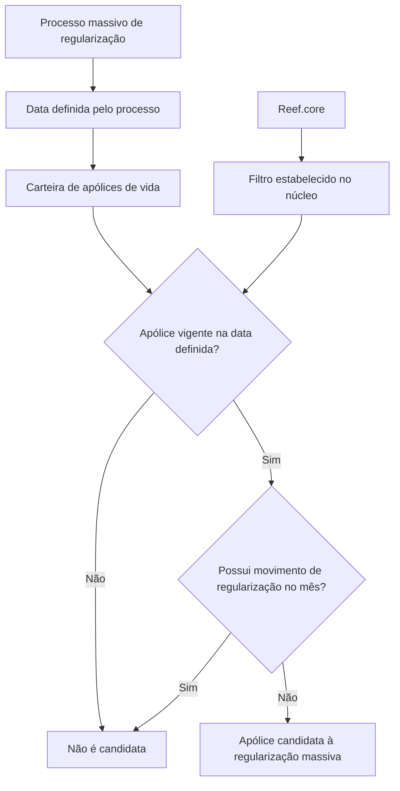

# Filtro de Apólices em Emissão para Regularização de Vida

## 1. Metadados do Documento
- **Arquivo de Origem:** `Não identificado`
- **Tipo de Documento:** `Procedimento`
- **Domínio / Sistema:** `Reef.core — Regularização de apólices de vida`
- **Público-Alvo:** `Operação, Negócio, Desenvolvedores e Arquitetos`
- **Data/Versão Identificada:** `Não identificada`

---

## 2. Resumo Executivo & Contexto de Negócio

O documento descreve o filtro **“FILTRAR póliza en emisión - Regularización vida”**, aplicado ao processo de regularização massiva de apólices de vida. A finalidade declarada é determinar quais apólices serão candidatas a esse processo massivo.

O filtro extrai da carteira as apólices que estejam vigentes na data definida pelo processo massivo. Além da vigência, a apólice não pode possuir movimento de regularização no mês analisado.

A execução não requer ação manual do usuário ou operador. O documento informa que esse filtro já está estabelecido no núcleo do **Reef.core**.

**Nota de Análise:** o conteúdo não detalha critérios adicionais de elegibilidade, fontes de dados, calendário mensal, mecanismo de execução, campos consultados, resultados gerados ou contratos de integração.

---

## 3. Arquitetura, Componentes & Tecnologias Envolvidas

| Componente / Termo | Papel identificado |
| :--- | :--- |
| Reef.core | Núcleo no qual o filtro de regularização está estabelecido. |
| Processo massivo de regularização | Processo que define uma data e avalia apólices da carteira para identificar candidatas. |
| Carteira | Conjunto de apólices do qual são extraídas as apólices elegíveis. |
| Apólices de vida | Objeto de negócio avaliado pelo filtro. |
| Movimento de regularização | Condição de exclusão: a apólice não deve ter movimento de regularização no mês. |



---

## 4. Regras de Negócio, Especificações Funcionais & Processos

1. O processo tem como escopo as **apólices de vida**.
2. A finalidade do filtro é determinar quais apólices são candidatas a um **processo massivo de regularização**.
3. A carteira é avaliada com base em uma **data definida no processo massivo**.
4. Uma apólice deve estar **vigente** na data definida para poder ser extraída da carteira.
5. Uma apólice com **movimento de regularização no mês** não atende ao critério de seleção.
6. Uma apólice candidata deve, simultaneamente:
   - estar vigente na data definida pelo processo massivo; e
   - não ter movimento de regularização no mês.
7. Não é necessário executar ação manual para aplicar o filtro.
8. O filtro faz parte dos filtros estabelecidos pelo núcleo do **Reef.core**.

**Nota de Análise:** o documento não especifica como a vigência é calculada, qual mês é usado como referência, quais estados de apólice são considerados vigentes, nem como o movimento de regularização é identificado.

---

## 5. Tabelas de Parâmetros, Ambientes e Estruturas de Dados

| Item / Parâmetro | Descrição / Função | Tipo / Valores / Formato | Ambiente / Observações |
| :--- | :--- | :--- | :--- |
| Tipo de apólice | Delimita o objeto avaliado pelo filtro. | Apólice de vida. | Aplicável ao processo de regularização de vida. |
| Data definida pelo processo massivo | Data usada para avaliar se uma apólice está vigente. | Data; formato não informado. | Definida pelo processo massivo. |
| Vigência da apólice | Critério obrigatório de inclusão. | A apólice deve estar vigente na data definida. | Regra de elegibilidade. |
| Movimento de regularização no mês | Critério de exclusão. | A apólice não pode possuir movimento no mês. | O documento não define o mês de referência nem o tipo de registro. |
| Resultado do filtro | Identifica apólices elegíveis. | Apólices candidatas à regularização massiva. | Filtro estabelecido no núcleo do Reef.core. |
| Ação operacional | Define a necessidade de intervenção humana. | Nenhuma ação necessária. | Execução tratada como filtro já estabelecido no Reef.core. |

---

## 6. Bateria de Perguntas & Respostas para RAG (FAQ Sintético)

### P1: Qual é o objetivo do filtro “FILTRAR póliza en emisión - Regularización vida”?
**R:** O objetivo é determinar quais apólices de vida serão candidatas a um processo massivo de regularização.

### P2: Quais apólices são extraídas da carteira pelo filtro de regularização de vida?
**R:** O filtro extrai da carteira as apólices de vida que estejam vigentes na data definida no processo massivo e que não tenham movimento de regularização no mês.

### P3: Uma apólice de vida não vigente na data do processo pode ser candidata à regularização?
**R:** Não. A vigência na data definida pelo processo massivo é um critério necessário para que a apólice seja candidata.

### P4: Uma apólice que possui movimento de regularização no mês é selecionada?
**R:** Não. O documento estabelece que a apólice candidata não deve ter movimento de regularização no mês.

### P5: É necessário executar manualmente o filtro de regularização de apólices de vida?
**R:** Não. O documento informa que não é necessário realizar ação alguma, pois o filtro já está estabelecido pelo núcleo do Reef.core.

### P6: Onde está estabelecido o filtro de regularização de vida?
**R:** O filtro é um dos filtros estabelecidos pelo núcleo do Reef.core.

### P7: Qual é o domínio de negócio tratado pelo filtro?
**R:** O domínio tratado é a regularização de apólices de vida, considerando a carteira, a vigência da apólice e a existência de movimento de regularização mensal.

### P8: Qual data é utilizada para verificar a vigência da apólice?
**R:** É utilizada a data definida no processo massivo. O documento não informa quem define essa data nem o seu formato.

### P9: O documento define como identificar um movimento de regularização?
**R:** Não. O documento apenas estabelece que a apólice não deve ter um movimento de regularização no mês, sem detalhar campos, eventos ou registros usados nessa verificação.

### P10: O documento descreve métodos HTTP, APIs ou contratos de integração do Reef.core?
**R:** Não. O conteúdo menciona o núcleo do Reef.core e referências textuais a “Home Solutions APIs Documentation Zeus”, mas não apresenta métodos HTTP, URLs, contratos JSON ou integrações técnicas detalhadas.

---

## 7. Glossário de Termos, Siglas & Conceitos-Chave

- **Apólice de vida:** Apólice pertencente ao escopo do filtro de regularização descrito.
- **Carteira:** Conjunto de apólices do qual são extraídas as candidatas.
- **Filtro:** Regra estabelecida no núcleo do Reef.core para selecionar apólices candidatas.
- **Movimento de regularização:** Movimento cuja presença no mês impede a seleção da apólice.
- **Processo massivo de regularização:** Processo que define uma data e identifica apólices de vida candidatas.
- **Reef.core:** Núcleo citado como responsável por possuir o filtro estabelecido.
- **Vigência:** Condição segundo a qual a apólice deve estar vigente na data definida pelo processo massivo.

---

## 8. Notas Críticas, Riscos & Limitações

- O documento não identifica arquivo de origem, autor, versão, data ou ambiente.
- Não há detalhamento sobre a definição da data usada no processo massivo.
- Não há especificação sobre a regra de cálculo ou consulta da vigência da apólice.
- Não há definição de quais eventos, registros ou campos representam um movimento de regularização.
- Não são apresentados dados de entrada, dados de saída, mensagens de erro, auditoria, logs ou métricas.
- Não são documentadas APIs, métodos HTTP, URLs, contratos ou mecanismos de integração.
- A referência a **“Home Solutions APIs Documentation Zeus”** não contém detalhamento técnico adicional no trecho fornecido.

---

## 9. Conteúdo Bruto Estruturado (Referência Fiel)

```text
--- [PÁGINA 1 DE 1] ---

FILTRAR póliza en emisión - Regularización
vida
¿En que consiste?
Determinar qué pólizas serán candidatas en un proceso masivo de Regularización de pólizas de vida.
Objetivo
Extraer de la cartera aquellas pólizas vigentes a la fecha definida en el proceso masivo que no
tengan un movimiento de regularización en el mes.
Proceso a seguir
No es necesario realizar acción alguna ya que este es uno de los filtros que se encuentran
establecidos por el núcleo de Reef.core.
 / 
 CF
Home Solutions APIs Documentation Zeus
EN
```
