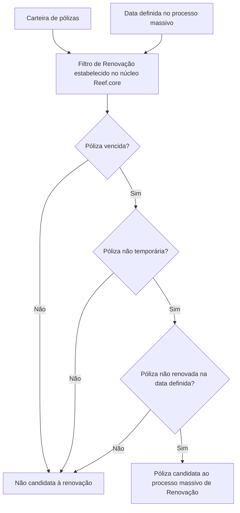

# Filtro de Pólizas en Emisión para Renovación Masiva — Reef.core

## 1. Metadados do Documento
- **Arquivo de Origem:** `Não identificado`
- **Tipo de Documento:** `Procedimento`
- **Domínio / Sistema:** `Reef.core — Renovação de pólizas`
- **Público-Alvo:** `Negócio, Operação e Desenvolvimento`
- **Data/Versão Identificada:** `Não identificada`

---

## 2. Resumo Executivo & Contexto de Negócio

O documento descreve o filtro **“Filtrar póliza en emisión - Renovación”**, utilizado no contexto de um processo massivo de renovação de pólizas. A finalidade declarada é determinar quais pólizas serão candidatas à renovação.

A seleção é realizada sobre a carteira de pólizas. O filtro extrai as pólizas que estejam vencidas, que não sejam temporárias e que ainda não tenham sido renovadas na data definida pelo processo massivo.

O documento informa que não é necessária nenhuma ação operacional para executar ou configurar esse filtro. A regra já está estabelecida no núcleo do sistema **Reef.core**.

Não há detalhamento adicional sobre critérios de priorização entre as pólizas elegíveis, regras de exceção, datas específicas, integrações, métodos de execução ou contratos técnicos.

---

## 3. Arquitetura, Componentes & Tecnologias Envolvidas

Os elementos explicitamente citados são:

| Componente / Termo | Papel identificado no documento |
| :--- | :--- |
| Reef.core | Núcleo no qual o filtro de renovação está estabelecido. |
| Processo massivo de Renovação | Processo que define a data de referência e utiliza o filtro para determinar pólizas candidatas. |
| Carteira de pólizas | Conjunto de pólizas sobre o qual o filtro é aplicado. |
| Home Solutions APIs Documentation Zeus | Texto presente no material de origem; a relação técnica com o filtro não é detalhada. |
| CF | Sigla exibida no material de origem sem definição. |



> **Nota de Análise:** O documento não detalha interfaces, APIs, bancos de dados, métodos HTTP, formatos de dados, jobs, agendamentos ou mecanismos técnicos usados pelo núcleo Reef.core para aplicar o filtro.

---

## 4. Regras de Negócio, Especificações Funcionais & Processos

### Objetivo funcional

Determinar quais pólizas serão candidatas em um processo massivo de renovação.

### Critérios de elegibilidade

Uma póliza deve atender simultaneamente aos critérios abaixo para ser extraída da carteira como candidata ao processo massivo de renovação:

1. A póliza deve estar **vencida**.
2. A póliza deve ser **não temporária**.
3. A póliza deve estar **não renovada** na data definida no processo massivo.

### Regra operacional

- Não é necessário realizar ação adicional para habilitar ou executar o filtro.
- O filtro é um dos filtros já estabelecidos pelo núcleo do **Reef.core**.

### Restrições identificadas

- O documento não define o significado operacional de “vencida”.
- O documento não especifica como a condição “temporária” é determinada.
- O documento não detalha onde ou como a data do processo massivo é definida.
- O documento não apresenta regras para pólizas parcialmente renovadas, canceladas, suspensas ou com dados incompletos.

---

## 5. Tabelas de Parâmetros, Ambientes e Estruturas de Dados

| Item / Parâmetro | Descrição / Função | Tipo / Valores / Formato | Ambiente / Observações |
| :--- | :--- | :--- | :--- |
| Estado de vencimento | Critério para extrair pólizas candidatas. | Póliza vencida. | A definição de “vencida” não é detalhada. |
| Temporalidade | Critério de exclusão do processo de renovação. | Póliza não temporária. | O documento não define os atributos que caracterizam uma póliza temporária. |
| Estado de renovação | Critério para identificar pólizas ainda elegíveis. | Póliza não renovada. | Avaliado na data definida pelo processo massivo. |
| Data do processo massivo | Referência temporal para verificar se a póliza foi renovada. | Data não especificada. | O local de configuração ou origem da data não é informado. |
| Reef.core | Núcleo que contém o filtro. | Sistema / núcleo. | Não requer ação manual segundo o documento. |
| Processo massivo de Renovação | Processo que utiliza o filtro para identificar candidatas. | Processo de negócio. | Não há detalhes sobre execução, frequência ou operador responsável. |
| Home Solutions APIs Documentation Zeus | Texto exibido no material. | Não especificado. | A relação com o filtro não é descrita. |
| CF | Sigla exibida no material. | Não especificado. | Sem definição no conteúdo fornecido. |

---

## 6. Bateria de Perguntas & Respostas para RAG (FAQ Sintético)

### P1: Qual é o objetivo do filtro “Filtrar póliza en emisión - Renovación”?
**R:** O objetivo do filtro é determinar quais pólizas serão candidatas em um processo massivo de renovação.

### P2: Quais pólizas são extraídas da carteira para o processo massivo de renovação?
**R:** São extraídas as pólizas vencidas, não temporárias e não renovadas na data definida pelo processo massivo.

### P3: Uma póliza temporária pode ser candidata ao processo massivo de renovação?
**R:** Não. O documento determina que apenas pólizas não temporárias são extraídas como candidatas ao processo massivo de renovação.

### P4: Uma póliza já renovada na data do processo massivo é elegível para o filtro?
**R:** Não. A póliza precisa estar não renovada na data definida pelo processo massivo para ser candidata à renovação.

### P5: É necessário executar alguma ação manual para aplicar o filtro de renovação?
**R:** Não. O documento informa que não é necessário realizar nenhuma ação, pois o filtro já está estabelecido no núcleo do Reef.core.

### P6: Onde está estabelecido o filtro de pólizas para renovação?
**R:** O filtro está estabelecido no núcleo do sistema Reef.core.

### P7: A data de referência influencia a elegibilidade da póliza?
**R:** Sim. O estado de renovação da póliza é verificado em relação à data definida no processo massivo. A póliza deve estar não renovada nessa data.

### P8: O documento informa como definir a data do processo massivo?
**R:** Não. O documento menciona uma data definida no processo massivo, mas não descreve onde essa data é configurada nem qual sistema a fornece.

### P9: O documento descreve APIs ou contratos técnicos do filtro de renovação?
**R:** Não. Apesar de mencionar “Home Solutions APIs Documentation Zeus”, o material não detalha endpoints, métodos HTTP, contratos JSON ou integrações técnicas relacionadas ao filtro.

### P10: O que acontece com uma póliza vencida que seja temporária?
**R:** A póliza não é candidata ao processo massivo de renovação, pois o filtro exige que a póliza seja vencida e não temporária.

---

## 7. Glossário de Termos, Siglas & Conceitos-Chave

- **Reef.core:** Núcleo do sistema no qual o filtro de renovação está estabelecido.
- **Póliza:** Registro de seguro tratado pela carteira e avaliado pelo filtro de renovação.
- **Renovação:** Processo no qual são determinadas pólizas candidatas para um processo massivo.
- **Processo massivo:** Processo que utiliza uma data definida e aplica o filtro sobre a carteira de pólizas.
- **Póliza vencida:** Condição exigida para a póliza ser candidata; o documento não detalha sua definição operacional.
- **Póliza temporária:** Tipo de póliza excluída da seleção; o documento não detalha sua definição.
- **CF:** Sigla presente no material de origem, sem significado informado.
- **Zeus:** Termo presente em “Home Solutions APIs Documentation Zeus”; o documento não explica seu papel.

---

## 8. Notas Críticas, Riscos & Limitações

- O conteúdo é resumido e não fornece detalhamento técnico de implementação.
- Não há definição formal para os estados “vencida”, “temporária” e “renovada”.
- Não são informados os atributos de dados utilizados para avaliar os critérios do filtro.
- Não há descrição de integrações, APIs, logs, auditoria, tratamento de erros, reprocessamento ou responsáveis operacionais.
- A data definida pelo processo massivo é essencial para a elegibilidade, mas o documento não identifica sua origem, formato ou mecanismo de configuração.
- O termo “Home Solutions APIs Documentation Zeus” aparece no conteúdo, porém sua relação com Reef.core ou com o filtro de renovação não é detalhada.

---

## 9. Conteúdo Bruto Estruturado (Referência Fiel)

```text
--- [PÁGINA 1 DE 1] ---

FILTRAR póliza en emisión - Renovación
¿En que consiste?
Determinar qué pólizas serán candidatas en un proceso masivo de Renovación.
Objetivo
Extraer de la cartera aquellas pólizas vencidas, no temporales y no renovadas a la fecha definida
en el proceso masivo.
Proceso a seguir
No es necesario realizar acción alguna ya que este es uno de los filtros que se encuentran
establecidos por el núcleo de Reef.core.
 / 
 CF
Home Solutions APIs Documentation Zeus
EN
```
