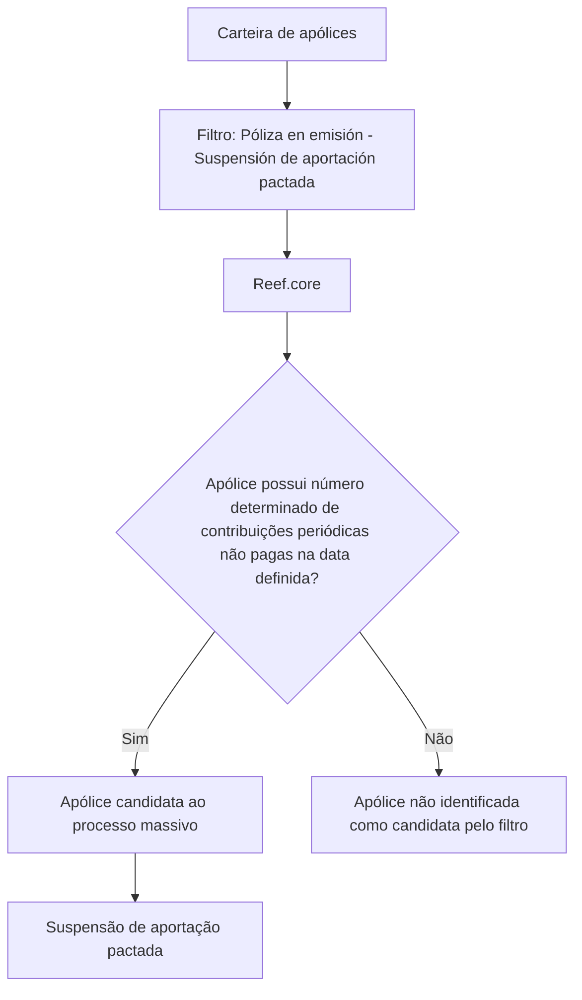

# Filtro de Pólizas en Emisión — Suspensión de Aportación Pactada

## 1. Metadados do Documento
- **Arquivo de Origem:** `Não informado no conteúdo fornecido`
- **Tipo de Documento:** `Especificação Técnica`
- **Domínio / Sistema:** `Reef.core`
- **Público-Alvo:** `Operação, Analistas Funcionais, Desenvolvedores`
- **Data/Versão Identificada:** `Não identificada`

---

## 2. Resumo Executivo & Contexto de Negócio

O documento descreve o filtro **“Póliza en emisión - Suspensión de aportación pactada”**, associado ao núcleo **Reef.core**. O filtro identifica quais apólices em emissão podem ser candidatas a um processo massivo de suspensão de contribuição acordada.

A seleção considera a carteira de apólices e verifica a existência de um número determinado de contribuições periódicas que permanecem sem pagamento na data definida pelo processo massivo. O documento não informa qual é esse número de contribuições nem como a data é configurada.

O processo não exige ação manual. O filtro já está estabelecido no núcleo do sistema Reef.core, indicando que a execução e a aplicação dos critérios são tratadas pelo comportamento predefinido do sistema.

A principal finalidade operacional é extrair, da carteira, as apólices que atendam aos critérios de inadimplência de contribuições periódicas para que possam participar do processo massivo de suspensão de contribuição acordada.

---

## 3. Arquitetura, Componentes & Tecnologias Envolvidas

Componentes e conceitos identificados:

| Componente / Conceito | Papel descrito |
| :--- | :--- |
| `Reef.core` | Núcleo no qual o filtro está estabelecido. |
| Carteira de apólices | Conjunto de apólices analisado pelo processo. |
| Apólices em emissão | Apólices consideradas pelo filtro documentado. |
| Processo massivo | Processo que avalia candidatas à suspensão de contribuição acordada. |
| Contribuições periódicas | Contribuições usadas como critério de seleção quando não pagas. |
| Data definida | Data de referência para avaliar contribuições periódicas não pagas. |



> **Nota de Análise:** O documento não detalha interfaces, métodos HTTP, contratos de integração, banco de dados, tecnologias de implementação, parâmetros configuráveis ou etapas posteriores à identificação da apólice candidata.

---

## 4. Regras de Negócio, Especificações Funcionais & Processos

1. O filtro aplica-se a **pólizas en emisión**.
2. O objetivo do filtro é determinar quais apólices serão candidatas em um processo massivo de **Suspensión de aportación pactada**.
3. A análise é realizada sobre a **carteira de apólices**.
4. Uma apólice é extraída da carteira como candidata quando possui um determinado número de **aportaciones periódicas** sem pagamento.
5. A avaliação de contribuições não pagas é realizada em relação a uma **data definida** no processo massivo.
6. O documento não especifica:
   - O número de contribuições periódicas sem pagamento necessário para qualificação.
   - O formato ou a origem da data definida.
   - Os critérios adicionais eventualmente aplicados.
   - A ação operacional executada após a identificação da apólice candidata.
7. Não é necessária ação manual para utilizar esse filtro.
8. O filtro já está estabelecido pelo núcleo do sistema **Reef.core**.

### Fluxo operacional extraído

1. O processo massivo define uma data de referência.
2. O núcleo Reef.core analisa a carteira de apólices.
3. O filtro verifica as apólices em emissão.
4. O filtro identifica apólices com o número determinado de contribuições periódicas sem pagamento na data definida.
5. As apólices identificadas tornam-se candidatas ao processo massivo de suspensão de contribuição acordada.

---

## 5. Tabelas de Parâmetros, Ambientes e Estruturas de Dados

| Item / Parâmetro | Descrição / Função | Tipo / Valores / Formato | Ambiente / Observações |
| :--- | :--- | :--- | :--- |
| Filtro | Determina apólices candidatas ao processo massivo de suspensão de contribuição acordada. | `Póliza en emisión - Suspensión de aportación pactada` | Estabelecido pelo núcleo Reef.core. |
| Carteira | Conjunto de apólices submetido à extração e avaliação. | Não especificado | Utilizada pelo processo massivo. |
| Apólice em emissão | Tipo de apólice abrangido pelo filtro. | `Póliza en emisión` | Critério explícito de aplicação. |
| Contribuições periódicas | Contribuições cujo não pagamento integra o critério de seleção. | Número determinado, não especificado | Devem estar sem pagamento na data definida. |
| Número de contribuições não pagas | Quantidade necessária para tornar uma apólice candidata. | Não especificado | O documento não apresenta valor, limite ou regra de cálculo. |
| Data definida | Referência temporal para verificar contribuições periódicas sem pagamento. | Não especificado | Associada ao processo massivo. |
| Processo massivo | Processo que trata candidatas à suspensão de contribuição acordada. | `Suspensión de aportación pactada` | Não requer ação manual segundo o documento. |
| Reef.core | Núcleo que contém o filtro. | Sistema / núcleo | Não são detalhadas configurações ou interfaces. |

---

## 6. Bateria de Perguntas & Respostas para RAG (FAQ Sintético)

### P1: Qual é o objetivo do filtro “Póliza en emisión - Suspensión de aportación pactada”?
**R:** O objetivo é determinar quais apólices em emissão serão candidatas em um processo massivo de suspensão de contribuição acordada.

### P2: Qual conjunto de apólices é analisado pelo processo?
**R:** O processo analisa a carteira de apólices para extrair aquelas que atendem aos critérios do filtro.

### P3: Qual condição torna uma apólice candidata à suspensão de contribuição acordada?
**R:** A apólice deve possuir um determinado número de contribuições periódicas sem pagamento na data definida pelo processo massivo.

### P4: O documento informa quantas contribuições periódicas não pagas são necessárias?
**R:** Não. O documento menciona apenas “un determinado número de aportaciones periódicas sin pagar”, sem informar o valor ou limite aplicável.

### P5: É necessária alguma ação manual para executar o filtro?
**R:** Não. O documento declara que não é necessário realizar nenhuma ação, pois o filtro já está estabelecido pelo núcleo Reef.core.

### P6: Em qual sistema ou componente o filtro está estabelecido?
**R:** O filtro está estabelecido no núcleo de Reef.core.

### P7: A data de referência para identificar pagamentos em atraso está detalhada?
**R:** Não. O documento informa que a verificação ocorre na data definida pelo processo massivo, mas não especifica origem, formato ou mecanismo de configuração dessa data.

### P8: O filtro é aplicado a todas as apólices da carteira?
**R:** O documento descreve especificamente apólices em emissão dentro da carteira. Não há detalhamento sobre outros tipos ou estados de apólice.

### P9: O que acontece após uma apólice ser identificada como candidata?
**R:** O documento informa que a apólice será candidata ao processo massivo de suspensão de contribuição acordada, mas não detalha as etapas posteriores, alterações contratuais ou notificações.

### P10: O documento descreve APIs, integrações ou contratos técnicos do filtro?
**R:** Não. O conteúdo não apresenta métodos HTTP, endpoints, contratos JSON, integrações, banco de dados ou interfaces associadas ao filtro.

---

## 7. Glossário de Termos, Siglas & Conceitos-Chave

- **Reef.core:** Núcleo do sistema Reef.core no qual o filtro documentado está estabelecido.
- **Póliza / Apólice:** Entidade da carteira avaliada pelo filtro.
- **Póliza en emisión / Apólice em emissão:** Tipo ou estado de apólice explicitamente abrangido pelo filtro.
- **Aportación pactada / Contribuição acordada:** Contribuição cujo processo de suspensão é tratado pelo fluxo descrito.
- **Aportaciones periódicas / Contribuições periódicas:** Contribuições cujo não pagamento é usado como critério para identificar candidatas.
- **Proceso masivo / Processo massivo:** Processo que identifica e trata apólices candidatas à suspensão de contribuição acordada.
- **Cartera / Carteira:** Conjunto de apólices do qual o processo extrai candidatas.

---

## 8. Notas Críticas, Riscos & Limitações

- O documento não informa o número de contribuições periódicas não pagas necessário para qualificar uma apólice.
- O documento não detalha como a data de referência é definida, configurada ou fornecida ao processo.
- Não há especificação sobre tratamentos de exceção, exclusões, reprocessamento, auditoria ou validações adicionais.
- Não são informados impactos da suspensão de contribuição acordada sobre o ciclo de vida da apólice.
- Não há detalhes sobre APIs, integrações, logs, ambientes, permissões, persistência de dados ou contratos técnicos.
- **Nota de Análise:** O conteúdo é resumido e descreve apenas o objetivo, o critério geral e a inexistência de ação manual para o filtro Reef.core.

---

## 9. Conteúdo Bruto Estruturado (Referência Fiel)

```text
--- [PÁGINA 1 DE 1] ---

FILTRAR póliza en emisión - Suspensión de
aportación pactada
¿En que consiste?
Determinar qué pólizas serán candidatas en un proceso masivo de Suspensión de aportación
pactada.
Objetivo
Extraer de la cartera aquellas pólizas que disponen de un determinado número de aportaciones
periódicas sin pagar a la fecha definida en el proceso masivo.
Proceso a seguir
No es necesario realizar acción alguna ya que este es uno de los filtros que se encuentran
establecidos por el núcleo de Reef.core.
 /
 CF
Home Solutions APIs Documentation Zeus
EN
```
