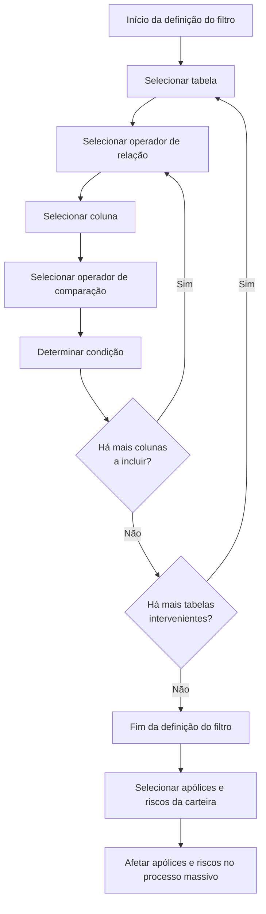

# Filtragem de Apólices em Processos Massivos de Emissão

## 1. Metadados do Documento
- **Arquivo de Origem:** `Não identificado`
- **Tipo de Documento:** `Manual Operacional`
- **Domínio / Sistema:** Módulo de emissão; processos massivos de apólices
- **Público-Alvo:** Operação, analistas funcionais e usuários com conhecimento do modelo de dados do módulo de emissão
- **Data/Versão Identificada:** `Não identificada`

---

## 2. Resumo Executivo & Contexto de Negócio

O documento descreve a ferramenta **“Filtrar póliza en procesos masivos en emisión”**, destinada a determinar as condições usadas para selecionar apólices e respetivos riscos que serão posteriormente afetados por um processo massivo no módulo de emissão.

O objetivo declarado é extrair da carteira somente as apólices sobre as quais se pretende executar a operação massiva que está a ser definida. A filtragem é composta por tabelas, operadores de relação, colunas, operadores de comparação e condições.

A utilização da ferramenta requer conhecimento prévio do modelo de dados do módulo de emissão. As tabelas e colunas disponíveis não são escolhidas livremente pelo utilizador: ambas estão previamente fixadas pelo sistema.

O documento destaca um requisito operacional relevante: a ordem de seleção das tabelas e das colunas influencia diretamente o desempenho do sistema e, consequentemente, o tempo necessário para determinar quais apólices serão selecionadas.

O processo permite combinar condições por meio dos operadores lógicos `AND` e `OR`, além de aplicar operadores de comparação como igualdade, desigualdade, intervalos, padrões textuais e existência. O exemplo apresentado filtra apólices do ramo automóvel, identificado pelo valor `400` na coluna `cod_ramo` da tabela `a2000030`.

---

## 3. Arquitetura, Componentes & Tecnologias Envolvidas

O documento não apresenta arquitetura de infraestrutura, servidores, APIs, bases de dados, URLs, versões de software ou tecnologias de implementação. O conteúdo descreve o fluxo funcional de construção de filtros para processos massivos no módulo de emissão.

### Componentes funcionais identificados

| Componente | Função descrita |
| :--- | :--- |
| Ferramenta de filtragem de apólices | Determina as condições usadas para selecionar apólices e riscos antes de um processo massivo. |
| Módulo de emissão | Módulo cujo modelo de dados deve ser conhecido para utilização da ferramenta. |
| Carteira | Origem das apólices das quais serão extraídas as apólices alvo da operação massiva. |
| Processo massivo | Processo posterior que afetará as apólices e riscos selecionados. |
| Tabela | Estrutura previamente fixada usada para condicionar quais apólices serão consideradas. |
| Operador de relação | Operador lógico usado para relacionar condições: `AND` ou `OR`. |
| Coluna | Campo previamente fixado utilizado para compor uma condição. |
| Operador de comparação | Operador aplicado à coluna selecionada para avaliar a condição. |
| Condição | Valor correspondente ao operador de comparação selecionado. |



> **Nota de Análise:** O documento não detalha como a condição é persistida, como o filtro é executado tecnicamente, quais entidades de risco são selecionadas, nem quais operações massivas podem afetar as apólices resultantes.

---

## 4. Regras de Negócio, Especificações Funcionais & Processos

### Objetivo da filtragem

A ferramenta permite determinar as condições para selecionar apólices e os seus riscos que serão posteriormente afetados num processo massivo. O resultado esperado é extrair da carteira apenas as apólices relevantes para a operação massiva em definição.

### Pré-requisito de utilização

O utilizador deve possuir conhecimento do modelo de dados do módulo de emissão. O documento declara este conhecimento como necessário para utilizar a ferramenta.

### Processo funcional

1. Selecionar a tabela que será utilizada para condicionar as apólices incluídas no processo massivo.
2. Selecionar o operador de relação entre a condição em elaboração e outras condições.
3. Selecionar a coluna da tabela que participará na condição.
4. Selecionar o operador de comparação aplicável à coluna.
5. Determinar o valor da condição correspondente ao operador de comparação selecionado.
6. Avaliar se existem mais colunas a incluir:
   - Se existirem, continuar a construção da seleção.
   - Caso não existam, avaliar se há mais tabelas intervenientes.
7. Avaliar se existem mais tabelas intervenientes:
   - Se existirem, selecionar a próxima tabela e continuar o processo.
   - Caso não existam, finalizar a definição do filtro.

### Regras sobre seleção de tabelas

- A tabela define a estrutura utilizada para condicionar quais apólices serão consideradas no processo massivo.
- As tabelas estão previamente fixadas.
- O utilizador não pode escolher tabelas livremente.
- A ordem de seleção das tabelas participantes influencia diretamente o rendimento do sistema.
- A ordem de seleção das tabelas influencia o tempo necessário para determinar as apólices selecionadas.

### Regras sobre operadores de relação

Os operadores de relação permitidos são:

- `AND`
- `OR`

O documento não define formalmente a semântica lógica de `AND` e `OR`, mas identifica ambos como os operadores permitidos para selecionar as apólices a tratar.

### Regras sobre seleção de colunas

- Após selecionar uma tabela, deve ser selecionada a coluna que será usada para elaborar a condição.
- As colunas, tal como as tabelas, estão previamente fixadas.
- A escolha de colunas não é livre.
- A ordem em que as colunas participantes são selecionadas influencia diretamente o rendimento do sistema.
- A ordem de seleção das colunas influencia o tempo necessário para determinar as apólices selecionadas.

### Regras sobre operadores de comparação

O operador de comparação é selecionado para a coluna escolhida. Os operadores permitidos são:

- `=`
- `!=`
- `<`
- `<=`
- `>`
- `>=`
- `BETWEEN`
- `NOT BETWEEN`
- `LIKE`
- `NOT LIKE`
- `EXISTS`
- `NOT EXISTS`

### Regra para determinação da condição

A condição corresponde ao valor definido para o operador de comparação selecionado. O documento não especifica formatos de dados, obrigatoriedade por operador, valores nulos, precedência entre operadores nem sintaxe adicional para condições compostas.

### Exemplo funcional apresentado

Para selecionar apólices do ramo automóvel, assumindo que o ramo automóvel é identificado pelo código `400`:

- **Tabela:** `a2000030`
- **Relação:** `AND`
- **Coluna:** `cod_ramo`
- **Comparação:** `=`
- **Condição:** `400`

---

## 5. Tabelas de Parâmetros, Ambientes e Estruturas de Dados

### Etapas da construção do filtro

| Item / Parâmetro | Descrição / Função | Tipo / Valores / Formato | Ambiente / Observações |
| :--- | :--- | :--- | :--- |
| Tabela | Define a tabela utilizada para condicionar as apólices incluídas no processo massivo. | Tabela previamente fixada. | A seleção não é livre; a ordem influencia o rendimento e o tempo de seleção. |
| Relação | Relaciona a condição com outras condições da seleção. | `AND`, `OR`. | Operadores permitidos pelo documento. |
| Coluna | Define o campo da tabela utilizado na condição. | Coluna previamente fixada. | A seleção não é livre; a ordem influencia o rendimento e o tempo de seleção. |
| Comparação | Define o operador aplicado à coluna selecionada. | Operadores de comparação permitidos. | Deve ser selecionado antes de determinar a condição. |
| Condição | Define o valor correspondente ao operador de comparação escolhido. | Valor não especificado pelo documento. | O formato depende da coluna e do operador, mas essa dependência não é detalhada. |

### Operadores de relação

| Operador | Descrição / Função | Tipo / Valores / Formato | Ambiente / Observações |
| :--- | :--- | :--- | :--- |
| `AND` | Operador de relação permitido. | Operador lógico. | Utilizado na seleção de apólices a tratar. |
| `OR` | Operador de relação permitido. | Operador lógico. | Utilizado na seleção de apólices a tratar. |

### Operadores de comparação

| Item / Parâmetro | Descrição / Função | Tipo / Valores / Formato | Ambiente / Observações |
| :--- | :--- | :--- | :--- |
| `=` | Igual. | Operador de comparação. | Aplicado à coluna selecionada. |
| `!=` | Distinto. | Operador de comparação. | Aplicado à coluna selecionada. |
| `<` | Menor. | Operador de comparação. | Aplicado à coluna selecionada. |
| `<=` | Menor ou igual. | Operador de comparação. | Aplicado à coluna selecionada. |
| `>` | Maior. | Operador de comparação. | Aplicado à coluna selecionada. |
| `>=` | Maior ou igual. | Operador de comparação. | Aplicado à coluna selecionada. |
| `BETWEEN` | Entre. | Operador de comparação. | Aplicado à coluna selecionada. |
| `NOT BETWEEN` | Não entre. | Operador de comparação. | Aplicado à coluna selecionada. |
| `LIKE` | Como. | Operador de comparação. | Aplicado à coluna selecionada. |
| `NOT LIKE` | Não como. | Operador de comparação. | Aplicado à coluna selecionada. |
| `EXISTS` | Existe. | Operador de comparação. | Aplicado à coluna selecionada. |
| `NOT EXISTS` | Não existe. | Operador de comparação. | O texto original contém “NO EXSITE”; a tabela preserva o significado indicado pelo título do operador. |

### Exemplo de condição para ramo automóvel

| Tabela | Relação | Coluna | Comparação | Condição |
| :--- | :--- | :--- | :--- | :--- |
| `a2000030` | `AND` | `cod_ramo` | `=` | `400` |

### Ambientes, servidores, URLs e logs

| Item / Parâmetro | Descrição / Função | Tipo / Valores / Formato | Ambiente / Observações |
| :--- | :--- | :--- | :--- |
| Ambientes | Não identificados no documento. | Não aplicável. | O documento não informa desenvolvimento, homologação, produção ou outro ambiente. |
| Servidores | Não identificados no documento. | Não aplicável. | Não há nomes, endereços ou configurações de servidores. |
| URLs | Não identificadas no documento. | Não aplicável. | Não há URLs de acesso ou integração. |
| Logs | Não identificados no documento. | Não aplicável. | Não há caminhos, variáveis ou políticas de logging. |

---

## 6. Bateria de Perguntas & Respostas para RAG (FAQ Sintético)

### P1: Qual é o objetivo da ferramenta de filtragem de apólices em processos massivos de emissão?
**R:** A ferramenta determina as condições para selecionar apólices e respetivos riscos que serão posteriormente afetados por um processo massivo. O objetivo é extrair da carteira apenas as apólices sobre as quais se pretende realizar a operação massiva em definição.

### P2: Qual conhecimento é necessário para utilizar a ferramenta de filtragem?
**R:** É necessário possuir conhecimento do modelo de dados do módulo de emissão. O documento apresenta esse conhecimento como imprescindível para usar a ferramenta.

### P3: O utilizador pode selecionar qualquer tabela para compor um filtro?
**R:** Não. As tabelas disponíveis para a seleção estão previamente fixadas, portanto a escolha de tabelas não é livre.

### P4: A ordem de seleção das tabelas influencia o resultado ou o desempenho do processo?
**R:** O documento afirma que a ordem de seleção das tabelas influencia diretamente o rendimento do sistema e o tempo necessário para determinar quais apólices serão selecionadas.

### P5: Quais operadores de relação são permitidos para combinar condições?
**R:** Os operadores de relação permitidos são `AND` e `OR`.

### P6: As colunas utilizadas nas condições podem ser escolhidas livremente?
**R:** Não. As colunas estão previamente fixadas, tal como as tabelas. Além disso, a ordem de seleção das colunas influencia diretamente o rendimento do sistema e o tempo necessário para determinar as apólices selecionadas.

### P7: Quais operadores de comparação podem ser usados na filtragem?
**R:** Os operadores permitidos são `=`, `!=`, `<`, `<=`, `>`, `>=`, `BETWEEN`, `NOT BETWEEN`, `LIKE`, `NOT LIKE`, `EXISTS` e `NOT EXISTS`.

### P8: O que deve ser definido na etapa “Determinar condição”?
**R:** Nessa etapa deve ser definido o valor correspondente ao operador de comparação escolhido para a coluna selecionada.

### P9: Como filtrar apólices do ramo automóvel no exemplo do documento?
**R:** O exemplo usa a tabela `a2000030`, o operador de relação `AND`, a coluna `cod_ramo`, o operador de comparação `=` e a condição `400`, assumindo que `400` identifica o ramo automóvel.

### P10: O documento explica quais métodos HTTP, APIs ou contratos de integração são usados para executar o processo massivo?
**R:** Não. O documento não apresenta métodos HTTP, APIs, contratos JSON, URLs, servidores ou detalhes técnicos de integração para a execução dos processos massivos.

### P11: O documento define a sintaxe exata de valores para operadores como BETWEEN, LIKE ou EXISTS?
**R:** Não. O documento lista os operadores permitidos, mas não especifica sintaxe, formatos de valores, tipos de dados, uso de curingas, subconsultas ou regras particulares para cada operador.

---

## 7. Glossário de Termos, Siglas & Conceitos-Chave

- **Apólice / Póliza:** Entidade selecionada da carteira para posterior afetação num processo massivo.
- **Carteira:** Conjunto de apólices do qual são extraídas as apólices alvo da operação massiva.
- **Coluna:** Campo previamente fixado de uma tabela usado para construir uma condição de filtragem.
- **Condição:** Valor definido de acordo com o operador de comparação selecionado.
- **Emissão:** Módulo referido como contexto funcional e de dados da ferramenta de filtragem.
- **Operador de comparação:** Operador aplicado a uma coluna, como `=`, `BETWEEN` ou `EXISTS`.
- **Operador de relação:** Operador que relaciona condições; os operadores permitidos são `AND` e `OR`.
- **Processo massivo:** Processo que afetará posteriormente as apólices e riscos selecionados.
- **Ramo:** Classificação da apólice; no exemplo, o ramo automóvel é representado pelo valor `400`.
- **Risco:** Elemento associado às apólices que também pode ser afetado pelo processo massivo.
- **Tabela:** Estrutura previamente fixada usada para condicionar a seleção de apólices.
- **`a2000030`:** Nome da tabela usado no exemplo de filtragem por ramo.
- **`cod_ramo`:** Nome da coluna usada no exemplo para identificar o ramo da apólice.

---

## 8. Notas Críticas, Riscos & Limitações

- O uso da ferramenta depende do conhecimento do modelo de dados do módulo de emissão.
- Tabelas e colunas são previamente fixadas; o documento não apresenta a lista de tabelas ou colunas disponíveis.
- A ordem de seleção de tabelas e colunas tem impacto direto no rendimento do sistema e no tempo de determinação das apólices selecionadas.
- O documento não especifica como avaliar a prioridade ou a precedência de condições combinadas por `AND` e `OR`.
- O documento não define a sintaxe, os tipos de dados ou as validações de entrada para cada operador de comparação.
- Não há detalhes sobre mensagens de erro, tratamento de condições inválidas, auditoria, permissões de acesso ou mecanismos de reversão do processo massivo.
- Não há arquitetura técnica de infraestrutura, integrações, APIs, servidores, ambientes, URLs, logs ou contratos de dados.
- O documento menciona que apólices e riscos serão afetados posteriormente, mas não descreve quais operações massivas estão disponíveis nem os seus efeitos.

---

## 9. Conteúdo Bruto Estruturado (Referência Fiel)

```text
--- [PÁGINA 1 DE 3] ---

FILTRAR póliza en procesos masivos en
emisión
¿En que consiste?
Esta herramienta permite determinar las condiciones con las que se desea seleccionar pólizas (y sus
riesgos) a las que posteriormente serán afectadas en un proceso masivo. Es imprescindible conocer
que para utilizar esta herramienta es necesario disponer de conocimiento del modelo de datos del
módulo de emisión.
Objetivo
Extraer de la cartera solo aquellas pólizas con las que se pretende realizar la operación que se está
definiendo.
Proceso a seguir
SI
NO
SI
NOSELECCIONAR
tabla (1)
SELECCIONAR
operador
de
relación (2)
SELECCIONAR
columna (3)
SELECCIONAR
operador
de
comparación (4)
DETERMINAR
condición (5) ¿Hay
más
columnas
que
incluir? ¿Hay
más
tablas
que
intervengan?
FIN
Imagen FILTRAR
 / 
 CF
Home Solutions APIs Documentation Zeus
EN


--- [PÁGINA 2 DE 3] ---

1. Tabla
2. Relación
3. Columna
4. Comparación
5. Condición
SELECCIONAR tabla
Se especifica la tabla que se quiere utilizar con el fin de condicionar qué pólizas han de tomarse en el
proceso masivo. Las tablas están fijadas previamente por lo que no se puede elegir libremente. Es
importante destacar que el orden en el que se eligen las tablas que participarán en la selección
influye directamente en el rendimiento del sistema y por consiguiente en el tiempo que tarde el
proceso en determinar qué pólizas se seleccionan.
SELECCIONAR operador de relación
Se determina el operador que es necesario utilizar con el fin de seleccionar las pólizas a tratar. Los
operadores permitidos son:
OPERADOR
AND
OR
SELECCIONAR columna
Una vez elegida la tabla se debe seleccionar qué columna se utilizará para confeccionar la condición.
Las columnas, al igual que las tablas están previamente fijadas y la elección no es libre. Al igual que
se comentó con la tabla, también es importante destacar que el orden en el que se eligen las
columnas que participarán en la selección influye directamente en el rendimiento del sistema y por
consiguiente en el tiempo que tarde el proceso en determinar qué pólizas se seleccionan.
SELECCIONAR operador de comparación
Se especifica el operador que se utilizará para la columna seleccionada. Los operadores permitidos
son:
OPERADOR DESCRIPCIÓN
= IGUAL


--- [PÁGINA 3 DE 3] ---

OPERADOR DESCRIPCIÓN
!= DISTINTO
< MENOR
<= MENOR O IGUAL
> MAYOR
>= MAYOR O IGUAL
BETWEEN ENTRE
NOT BETWEEN NO ENTRE
LIKE COMO
NOT LIKE NO COMO
EXISTS EXISTE
NOT EXISTS NO EXSITE
DETERMINAR condición
En este punto se determina el valor que correspondería con el operador de comparación elegido.
EJEMPLO
Por ejemplo, si se desea determinar que el ramo de las pólizas a seleccionar es el ramo de automóvil
(suponiendo que el ramo en este ejemplo es el 400), los valores que se determinarían sería:
TABLA RELACIÓN COLUMNA COMPARACIÓN CONDICIÓN
a2000030 AND cod_ramo = 400
```
