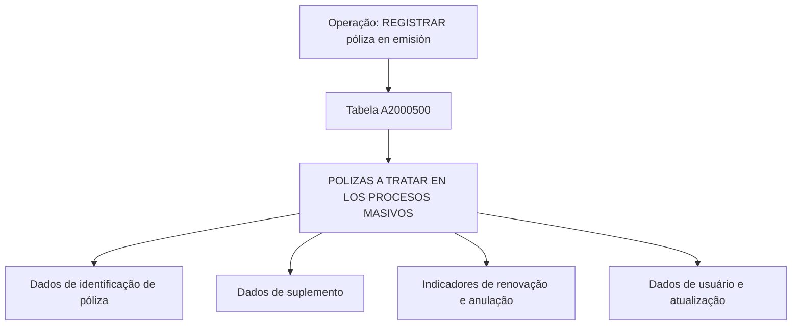

# Registro de Póliza em Emissão — Estrutura de Dados da Tabela A2000500

## 1. Metadados do Documento
- **Arquivo de Origem:** `Não identificado no conteúdo fornecido`
- **Tipo de Documento:** `Especificação Técnica`
- **Domínio / Sistema:** `Registro de póliza em emissão; processos massivos`
- **Público-Alvo:** `Desenvolvedores, Arquitetos, Analistas Funcionais e Operação`
- **Data/Versão Identificada:** `Não identificada`

---

## 2. Resumo Executivo & Contexto de Negócio

O documento descreve a operação **“REGISTRAR póliza en emisión”** e identifica o modelo de dados envolvido nesse processo. A fonte apresenta a tabela **A2000500**, descrita como **“POLIZAS A TRATAR EN LOS PROCESOS MASIVOS”**, ou seja, uma estrutura para pólizas a serem tratadas em processos massivos.

O conteúdo é predominantemente tabular e relaciona colunas da tabela A2000500 a indicadores de alteração, motivo/valor e obrigatoriedade. Entre os dados listados estão identificadores de póliza, contrato, suplemento, companhia, setor, ramo, agente, moeda, usuário, datas e indicadores associados a renovação, anulação e prorrata.

A estrutura inclui campos obrigatórios para o processamento, como `FEC_TRATAMIENTO`, `NUM_ORDEN`, `TIP_MVTO_BATCH`, `COD_CIA`, `COD_SECTOR`, `COD_RAMO`, `NUM_POLIZA`, `NUM_SPTO`, `NUM_APLI`, `TIP_POLIZA_TR`, `MCA_PRIMA_MANUAL`, `TIP_SITU`, `MCA_PRE_RENOVACION`, `MCA_ANULACION_POR_DEUDA`, `COD_USR` e `FEC_ACTU`.

O documento também explicita uma regra aplicável a campos de suplemento: `COD_SPTO`, `SUB_COD_SPTO`, `COD_TIP_SPTO` e `TXT_MOTIVO_SPTO` devem ser informados em suplemento, incluindo renovações. Adicionalmente, `COD_USR_CAPTURA` deve ser informado em qualquer operação.

> **Nota de Análise:** O material não apresenta métodos HTTP, contratos JSON, sistemas integradores, regras de persistência, tipos físicos de dados, chaves, relacionamentos entre tabelas ou comportamento detalhado do processo massivo. Os valores exibidos de forma fragmentada na última coluna foram preservados como extração parcial, sem interpretação adicional.

---

## 3. Arquitetura, Componentes & Tecnologias Envolvidas

O documento identifica os seguintes elementos:

- Operação: `REGISTRAR póliza en emisión`.
- Estrutura principal: tabela `A2000500`.
- Descrição da estrutura: `POLIZAS A TRATAR EN LOS PROCESOS MASIVOS`.
- Contexto operacional: processos massivos.
- Referência textual adicional: `Home Solutions APIs Documentation Zeus`.

Não são detalhadas tecnologias, bancos de dados, microsserviços, APIs, ambientes, servidores, rotas de log ou fluxos de integração.



> **Nota de Análise:** O diagrama representa apenas a relação conceitual explícita entre a operação, a tabela A2000500 e os grupos de campos listados. O documento não especifica fluxo de execução, integração entre sistemas ou persistência.

---

## 4. Regras de Negócio, Especificações Funcionais & Processos

### Operação documentada

A operação apresentada é:

- `REGISTRAR póliza en emisión`.

A tabela informada para essa operação é:

- `A2000500 — POLIZAS A TRATAR EN LOS PROCESOS MASIVOS`.

### Regras de obrigatoriedade identificadas

Os campos marcados como obrigatórios (`SI`) na extração fornecida são:

1. `FEC_TRATAMIENTO`
2. `NUM_ORDEN`
3. `TIP_MVTO_BATCH`
4. `COD_CIA`
5. `COD_SECTOR`
6. `COD_RAMO`
7. `COD_NIVEL1`
8. `COD_NIVEL2`
9. `COD_NIVEL3`
10. `COD_AGT`
11. `COD_MON`
12. `NUM_POLIZA`
13. `NUM_SPTO`
14. `NUM_APLI`
15. `NUM_SPTO_APLI`
16. `TIP_POLIZA_TR`
17. `MCA_PRIMA_MANUAL`
18. `TIP_SITU`
19. `MCA_PRE_RENOVACION`
20. `MCA_ANULACION_POR_DEUDA`
21. `COD_USR`
22. `FEC_ACTU`

### Regras específicas de suplementos

Os campos abaixo possuem a indicação textual:

> `Debe indicarse en suplemento (incluído renovaciones)`

| Campo | Regra extraída |
| :--- | :--- |
| `COD_SPTO` | Deve ser informado em suplemento, incluindo renovações. |
| `SUB_COD_SPTO` | Deve ser informado em suplemento, incluindo renovações. |
| `COD_TIP_SPTO` | Deve ser informado em suplemento, incluindo renovações. |
| `TXT_MOTIVO_SPTO` | Deve ser informado em suplemento, incluindo renovações. |

Na tabela fornecida, esses quatro campos estão marcados como não obrigatórios (`NO`), apesar de possuírem a regra condicional para suplemento e renovação.

### Regra específica de usuário de captura

| Campo | Regra extraída |
| :--- | :--- |
| `COD_USR_CAPTURA` | Deve ser informado em qualquer operação. |

Na tabela fornecida, `COD_USR_CAPTURA` está marcado como não obrigatório (`NO`), mas possui a regra textual de indicação em qualquer operação.

### Limites de detalhamento do processo

O documento não detalha:

- A sequência operacional para registrar uma póliza.
- A origem dos valores dos campos.
- As validações de domínio além das regras textuais de suplemento e captura.
- O significado funcional dos códigos fragmentados na coluna final.
- Os critérios que determinam processos massivos.
- A relação da tabela A2000500 com outras tabelas ou sistemas.

---

## 5. Tabelas de Parâmetros, Ambientes e Estruturas de Dados

### Tabela principal identificada

| Item / Parâmetro | Descrição / Função | Tipo / Valores / Formato | Ambiente / Observações |
| :--- | :--- | :--- | :--- |
| `A2000500` | Pólizas a tratar nos processos massivos. | Não informado. | Estrutura envolvida na operação “REGISTRAR póliza en emisión”. |

### Campos da tabela A2000500

| Item / Parâmetro | Descrição / Função | Tipo / Valores / Formato | Ambiente / Observações |
| :--- | :--- | :--- | :--- |
| `FEC_TRATAMIENTO` | Campo listado para tratamento. | `Cambia valor: S`; obrigatório: `SI`; código extraído: `F / R / P`. | Não há detalhamento adicional. |
| `NUM_ORDEN` | Número de ordem. | `Cambia valor: S`; obrigatório: `SI`; código extraído: `N / P / CF`. | Não há detalhamento adicional. |
| `TIP_MVTO_BATCH` | Tipo de movimento batch. | `Cambia valor: S`; obrigatório: `SI`; código extraído: `T / M`. | Não há detalhamento adicional. |
| `COD_CIA` | Código de companhia. | `Cambia valor: S`; obrigatório: `SI`; código extraído: `C`. | Não há detalhamento adicional. |
| `COD_SECTOR` | Código de setor. | `Cambia valor: S`; obrigatório: `SI`; código extraído: `S`. | Não há detalhamento adicional. |
| `COD_RAMO` | Código de ramo. | `Cambia valor: S`; obrigatório: `SI`; código extraído: `R`. | Não há detalhamento adicional. |
| `COD_NIVEL1` | Código de nível 1. | `Cambia valor: S`; obrigatório: `SI`; código extraído: `N / E / C`. | Não há detalhamento adicional. |
| `COD_NIVEL2` | Código de nível 2. | `Cambia valor: S`; obrigatório: `SI`; código extraído: `N / E / C`. | Não há detalhamento adicional. |
| `COD_NIVEL3` | Código de nível 3. | `Cambia valor: S`; obrigatório: `SI`; código extraído: `N / E / C`. | Não há detalhamento adicional. |
| `COD_AGT` | Código de agente. | `Cambia valor: S`; obrigatório: `SI`; código extraído: `A`. | Não há detalhamento adicional. |
| `COD_MON` | Código de moeda. | `Cambia valor: S`; obrigatório: `SI`; código extraído: `M`. | Não há detalhamento adicional. |
| `NUM_POLIZA_GRUPO` | Número de póliza de grupo. | `Cambia valor: S`; obrigatório: `NO`; código extraído: `P`. | Não há detalhamento adicional. |
| `NUM_CONTRATO` | Número de contrato. | `Cambia valor: S`; obrigatório: `NO`; código extraído: `C`. | Não há detalhamento adicional. |
| `NUM_POLIZA_CLIENTE` | Número de póliza de cliente. | `Cambia valor: S`; obrigatório: `NO`; código extraído: `P`. | Não há detalhamento adicional. |
| `NUM_POLIZA` | Número de póliza. | `Cambia valor: S`; obrigatório: `SI`; código extraído: `P`. | Não há detalhamento adicional. |
| `NUM_POLIZA_TRONADOR` | Número de póliza tronador. | `Cambia valor: S`; obrigatório: `NO`; código extraído: `N / D / (I`. | Extração fragmentada no documento. |
| `NUM_POLIZA_DEFINITIVO` | Número de póliza definitivo. | `Cambia valor: S`; obrigatório: `NO`; código extraído: `N / D`. | Não há detalhamento adicional. |
| `NUM_SPTO` | Número de suplemento. | `Cambia valor: S`; obrigatório: `SI`; código extraído: `N / S`. | Não há detalhamento adicional. |
| `NUM_APLI` | Número de aplicação. | `Cambia valor: S`; obrigatório: `SI`; código extraído: `N / A`. | Não há detalhamento adicional. |
| `NUM_SPTO_APLI` | Número de suplemento de aplicação. | `Cambia valor: S`; obrigatório: `SI`; código extraído: `S / A`. | Não há detalhamento adicional. |
| `TIP_POLIZA_TR` | Tipo de póliza TR. | `Cambia valor: S`; obrigatório: `SI`; código extraído: `T`. | Não há detalhamento adicional. |
| `FEC_EFEC_SPTO` | Data de efetividade do suplemento. | `Cambia valor: S`; obrigatório: `NO`; código extraído: `E / S`. | Não há detalhamento adicional. |
| `FEC_VCTO_SPTO` | Data de vencimento do suplemento. | `Cambia valor: S`; obrigatório: `NO`; código extraído: `V / S`. | Não há detalhamento adicional. |
| `NUM_RECIBO` | Número de recibo. | `Cambia valor: S`; obrigatório: `NO`; código extraído: `R`. | Não há detalhamento adicional. |
| `NUM_RIESGOS` | Número de riscos. | `Cambia valor: S`; obrigatório: `NO`; código extraído: `N / R / T`. | Não há detalhamento adicional. |
| `MCA_PRIMA_MANUAL` | Indicador de prêmio manual. | `Cambia valor: S`; obrigatório: `SI`; código extraído: `P`. | Não há detalhamento adicional. |
| `COD_SPTO` | Código de suplemento. | `Cambia valor: S`; obrigatório: `NO`; código extraído: `S`. | Deve ser informado em suplemento, incluindo renovações. |
| `SUB_COD_SPTO` | Subcódigo de suplemento. | `Cambia valor: S`; obrigatório: `NO`; código extraído: `S`. | Deve ser informado em suplemento, incluindo renovações. |
| `COD_TIP_SPTO` | Código de tipo de suplemento. | `Cambia valor: S`; obrigatório: `NO`; código extraído: `C / S`. | Deve ser informado em suplemento, incluindo renovações. |
| `TXT_MOTIVO_SPTO` | Texto de motivo de suplemento. | `Cambia valor: S`; obrigatório: `NO`; código extraído: `T / D / M / S`. | Deve ser informado em suplemento, incluindo renovações. |
| `MCA_RENUEVA` | Indicador de renovação. | `Cambia valor: S`; obrigatório: `NO`; código extraído: `R / V`. | Não há detalhamento adicional. |
| `MCA_RENUEVA_TMP` | Indicador temporário de renovação. | `Cambia valor: S`; obrigatório: `NO`; código extraído: `R / T / O`. | Não há detalhamento adicional. |
| `MCA_PERIODICIDAD` | Indicador de periodicidade. | `Cambia valor: S`; obrigatório: `NO`; código extraído: `LA / P / (P / LE / T / D`. | Extração fragmentada no documento. |
| `CANT_RENOVACIONES` | Quantidade de renovações. | `Cambia valor: S`; obrigatório: `NO`; código extraído: `N / R / T`. | Não há detalhamento adicional. |
| `MCA_PRORRATA` | Indicador de prorrata. | `Cambia valor: S`; obrigatório: `NO`; código extraído: `C / P`. | Não há detalhamento adicional. |
| `MCA_DEVUELVE_TODO` | Indicador de devolução total. | `Cambia valor: S`; obrigatório: `NO`; código extraído: `D / TO / C / D / E`. | Extração fragmentada no documento. |
| `TIP_SPTO_ACCION` | Tipo de ação de suplemento. | `Cambia valor: S`; obrigatório: `NO`; código extraído: `T / S / R`. | Não há detalhamento adicional. |
| `TIP_AUTORIZA_CT` | Tipo de autorização CT. | `Cambia valor: S`; obrigatório: `NO`; código extraído: `T / A / R / C`. | Não há detalhamento adicional. |
| `TIP_SITU` | Tipo de situação. | `Cambia valor: S`; obrigatório: `SI`; código extraído: `S / Q / LA`. | Não há detalhamento adicional. |
| `COD_EXCEPCION` | Código de exceção. | `Cambia valor: S`; obrigatório: `NO`; código extraído: `E`. | Não há detalhamento adicional. |
| `NOM_EXCEPCION` | Nome de exceção. | `Cambia valor: S`; obrigatório: `NO`; código extraído: `D / E`. | Não há detalhamento adicional. |
| `MCA_PRE_RENOVACION` | Indicador de pré-renovação. | `Cambia valor: S`; obrigatório: `SI`; código extraído: `P / R / P`. | Não há detalhamento adicional. |
| `MCA_ANULACION_POR_DEUDA` | Indicador de anulação por dívida. | `Cambia valor: S`; obrigatório: `SI`; código extraído: `LA / P`. | Não há detalhamento adicional. |
| `MAX_SPTO_VIGENTE` | Máximo de suplemento vigente. | `Cambia valor: S`; obrigatório: `NO`; código extraído: `U / S / V / M / E / P / A / FA`. | Extração fragmentada no documento. |
| `COD_USR` | Código de usuário. | `Cambia valor: S`; obrigatório: `SI`; código extraído: `U / A`. | Não há detalhamento adicional. |
| `COD_USR_CAPTURA` | Código de usuário de captura. | `Cambia valor: S`; obrigatório: `NO`; código extraído: `U / S`. | Deve ser indicado em qualquer operação. |
| `FEC_ACTU` | Data de atualização. | `Cambia valor: S`; obrigatório: `SI`; código extraído: `F / A / LA`. | Não há detalhamento adicional. |
| `NUM_SUBCONTRATO` | Número de subcontrato. | `Cambia valor: S`; obrigatório: `NO`; código extraído: `N / S`. | Não há detalhamento adicional. |
| `HORA_DESDE` | Hora desde. | `Cambia valor: S`; obrigatório: `NO`; código extraído: `H / C`. | Não há detalhamento adicional. |
| `COD_NEGOCIO` | Código de negócio. | `Cambia valor: S`; obrigatório: `NO`; código extraído: `T / (G`. | Extração fragmentada no documento. |
| `NUM_SPTO_ANULADO` | Número de suplemento anulado. | `Cambia valor: S`; obrigatório: `NO`; código extraído: `N / S / A`. | Não há detalhamento adicional. |
| `IDN_VAL` | Identificador de validação. | `Cambia valor: S`; obrigatório: `NO`; código extraído: `ID`. | Não há detalhamento adicional. |

---

## 6. Bateria de Perguntas & Respostas para RAG (FAQ Sintético)

### P1: Qual tabela é utilizada pela operação “REGISTRAR póliza en emisión”?
**R:** A operação “REGISTRAR póliza en emisión” utiliza a tabela `A2000500`, descrita no documento como `POLIZAS A TRATAR EN LOS PROCESOS MASIVOS`.

### P2: Qual é a finalidade declarada para a tabela A2000500?
**R:** A tabela `A2000500` é destinada a pólizas que devem ser tratadas em processos massivos, conforme a descrição literal `POLIZAS A TRATAR EN LOS PROCESOS MASIVOS`.

### P3: Quais campos obrigatórios identificam a companhia, o setor e o ramo?
**R:** Os campos obrigatórios relacionados à identificação organizacional da póliza são `COD_CIA` para companhia, `COD_SECTOR` para setor e `COD_RAMO` para ramo. Os três estão marcados como obrigatórios (`SI`).

### P4: O número de póliza é obrigatório no registro de póliza em emissão?
**R:** Sim. O campo `NUM_POLIZA` está marcado como obrigatório (`SI`) na estrutura da tabela A2000500.

### P5: Quais campos devem ser informados em operações de suplemento, incluindo renovações?
**R:** O documento informa que `COD_SPTO`, `SUB_COD_SPTO`, `COD_TIP_SPTO` e `TXT_MOTIVO_SPTO` devem ser indicados em suplemento, incluindo renovações. Na coluna de obrigatoriedade, esses campos aparecem como `NO`, portanto a exigência apresentada é condicional ao contexto de suplemento.

### P6: Qual campo deve ser indicado em qualquer operação?
**R:** O campo `COD_USR_CAPTURA` deve ser indicado em qualquer operação, conforme a regra textual apresentada no documento.

### P7: Quais campos obrigatórios estão associados ao processamento batch e à ordenação?
**R:** `TIP_MVTO_BATCH` é obrigatório e representa o tipo de movimento batch. `NUM_ORDEN` também é obrigatório e representa o número de ordem. `FEC_TRATAMIENTO` é outro campo obrigatório associado ao tratamento.

### P8: Quais campos obrigatórios estão associados a suplemento e aplicação?
**R:** Os campos obrigatórios relacionados são `NUM_SPTO`, `NUM_APLI` e `NUM_SPTO_APLI`. O documento também marca `TIP_POLIZA_TR` como obrigatório.

### P9: O documento define o formato técnico ou o tipo físico dos campos da tabela A2000500?
**R:** Não. O documento apresenta colunas chamadas `COLUMNA`, `CAMBIA VALOR`, `MOTIVO/VALOR` e `OBLIGATORIA`, mas não especifica tipos físicos como texto, número, data, comprimento, precisão ou domínio permitido para os campos.

### P10: Quais indicadores obrigatórios estão relacionados a renovação e anulação?
**R:** `MCA_PRE_RENOVACION` e `MCA_ANULACION_POR_DEUDA` estão marcados como obrigatórios (`SI`). O documento também lista `MCA_RENUEVA` e `MCA_RENUEVA_TMP`, porém ambos estão marcados como não obrigatórios (`NO`).

### P11: Quais campos de usuário e atualização são obrigatórios?
**R:** `COD_USR` e `FEC_ACTU` são obrigatórios. O campo `COD_USR_CAPTURA` possui uma regra textual que exige sua indicação em qualquer operação, embora esteja marcado como não obrigatório na coluna de obrigatoriedade.

### P12: O documento descreve APIs, endpoints ou contratos de integração para o registro de póliza?
**R:** Não. Apesar de conter a referência textual `Home Solutions APIs Documentation Zeus`, o material não detalha endpoints, métodos HTTP, payloads, respostas, autenticação, integrações ou contratos JSON.

---

## 7. Glossário de Termos, Siglas & Conceitos-Chave

- **A2000500:** Tabela descrita como `POLIZAS A TRATAR EN LOS PROCESOS MASIVOS`.
- **Póliza:** Termo utilizado no documento para o objeto de seguro tratado na operação de emissão.
- **SPTO:** Abreviação presente em campos relacionados a suplemento, como `NUM_SPTO`, `COD_SPTO` e `COD_TIP_SPTO`. O documento não expande formalmente a sigla.
- **MCA:** Prefixo utilizado em diversos campos indicadores, como `MCA_RENUEVA`, `MCA_PRORRATA` e `MCA_PRE_RENOVACION`. O documento não expande formalmente a sigla.
- **COD:** Prefixo usado para campos de código, como `COD_CIA`, `COD_RAMO` e `COD_USR`.
- **NUM:** Prefixo usado para campos numéricos ou identificadores numéricos, como `NUM_POLIZA` e `NUM_CONTRATO`.
- **FEC:** Prefixo usado para campos de data, como `FEC_TRATAMIENTO` e `FEC_ACTU`.
- **TIP:** Prefixo usado para campos de tipo, como `TIP_MVTO_BATCH` e `TIP_SITU`.
- **USR:** Abreviação utilizada nos campos `COD_USR` e `COD_USR_CAPTURA`, relacionados a usuário.
- **Batch:** Termo presente no campo `TIP_MVTO_BATCH`; o documento não detalha a tecnologia ou a rotina batch correspondente.
- **Renovaciones:** Renovações; contexto em que os campos de suplemento devem ser informados.
- **Procesos masivos:** Processos massivos que tratam as pólizas registradas na tabela A2000500.

---

## 8. Notas Críticas, Riscos & Limitações

- O documento não identifica o nome do arquivo de origem, data, versão, autor, sistema proprietário ou ambiente técnico.
- A extração apresenta valores fragmentados em várias linhas na última coluna, inviabilizando a interpretação segura de tipos, tamanhos, domínios ou códigos de negócio.
- Não são fornecidos tipos físicos dos campos, tamanhos, precisão numérica, chaves primárias, chaves estrangeiras, índices ou relacionamentos entre tabelas.
- Não há definição de quais regras determinam quando uma póliza deve ser tratada em processo massivo.
- As regras de suplemento são condicionais, mas o documento não informa qual evento, tipo de movimento ou valor de campo caracteriza uma operação de suplemento.
- `COD_USR_CAPTURA` está marcado como não obrigatório, mas possui texto que exige sua informação em qualquer operação. Essa divergência deve ser esclarecida pela área responsável pela especificação.
- Não há definição funcional para os códigos exibidos de maneira isolada ou truncada, como `C`, `P`, `N`, `S`, `R`, `LA`, `FA` e outros.
- O texto `Home Solutions APIs Documentation Zeus` não é acompanhado de contexto técnico suficiente para estabelecer uma integração ou dependência concreta.

---

## 9. Conteúdo Bruto Estruturado (Referência Fiel)

```text
--- [PÁGINA 1 DE 6] ---

EN CONSTRUCCIÓN
REGISTRAR póliza en emisión
Modelo de datos involucrado
Las tablas que intervienen en esta operación son:
A2000500
TABLA DESCRIPCIÓN
A2000500 POLIZAS A TRATAR EN LOS PROCESOS MASIVOS
COLUMNA CAMBIA
VALOR
MOTIVO/VALOR OBLIGATORIA C
FEC_TRATAMIENTO S N.A. SI F
R
P
NUM_ORDEN S N.A. SI N
P
 / 
 CF
Home Solutions APIs Documentation Zeus
EN


--- [PÁGINA 2 DE 6] ---

COLUMNA CAMBIA
VALOR
MOTIVO/VALOR OBLIGATORIA C
TIP_MVTO_BATCH S N.A. SI T
M
COD_CIA S N.A. SI C
COD_SECTOR S N.A. SI S
COD_RAMO S N.A. SI R
COD_NIVEL1 S N.A. SI N
E
C
COD_NIVEL2 S N.A. SI N
E
C
COD_NIVEL3 S N.A. SI N
E
C
COD_AGT S N.A. SI A
COD_MON S N.A. SI M
NUM_POLIZA_GRUPO S N.A. NO P
NUM_CONTRATO S N.A. NO C
NUM_POLIZA_CLIENTE S N.A. NO P
NUM_POLIZA S N.A. SI P
NUM_POLIZA_TRONADOR S N.A. NO N
D
(I


--- [PÁGINA 3 DE 6] ---

COLUMNA CAMBIA
VALOR
MOTIVO/VALOR OBLIGATORIA C
NUM_POLIZA_DEFINITIVO S N.A. NO N
D
NUM_SPTO S N.A. SI N
S
NUM_APLI S N.A. SI N
A
NUM_SPTO_APLI S N.A. SI S
A
TIP_POLIZA_TR S N.A. SI T
FEC_EFEC_SPTO S N.A. NO E
S
FEC_VCTO_SPTO S N.A. NO V
S
NUM_RECIBO S N.A. NO R
NUM_RIESGOS S N.A. NO N
R
T
MCA_PRIMA_MANUAL S N.A. SI P
COD_SPTO S Debe indicarse
en suplemento
(incluído
renovaciones)
NO S
SUB_COD_SPTO S Debe indicarse
en suplemento
(incluído
renovaciones)
NO S


--- [PÁGINA 4 DE 6] ---

COLUMNA CAMBIA
VALOR
MOTIVO/VALOR OBLIGATORIA C
COD_TIP_SPTO S Debe indicarse
en suplemento
(incluído
renovaciones)
NO C
S
TXT_MOTIVO_SPTO S Debe indicarse
en suplemento
(incluído
renovaciones)
NO T
D
M
S
MCA_RENUEVA S N.A. NO R
V
MCA_RENUEVA_TMP S N.A. NO R
T
O
MCA_PERIODICIDAD S N.A. NO LA
P
(P
LE
T
D
CANT_RENOVACIONES S N.A. NO N
R
T
MCA_PRORRATA S N.A. NO C
P
MCA_DEVUELVE_TODO S N.A. NO D
TO
C
D
E


--- [PÁGINA 5 DE 6] ---

COLUMNA CAMBIA
VALOR
MOTIVO/VALOR OBLIGATORIA C
TIP_SPTO_ACCION S N.A. NO T
S
R
TIP_AUTORIZA_CT S N.A. NO T
A
R
C
TIP_SITU S N.A. SI S
Q
LA
COD_EXCEPCION S N.A. NO E
NOM_EXCEPCION S N.A. NO D
E
MCA_PRE_RENOVACION S N.A. SI P
R
P
MCA_ANULACION_POR_DEUDA S N.A. SI LA
P
MAX_SPTO_VIGENTE S N.A. NO U
S
V
M
E
P
A
FA
COD_USR S N.A. SI U
A


--- [PÁGINA 6 DE 6] ---

COLUMNA CAMBIA
VALOR
MOTIVO/VALOR OBLIGATORIA C
COD_USR_CAPTURA S Debe indicarse
en cualquier
operación
NO U
S
FEC_ACTU S N.A. SI F
A
LA
NUM_SUBCONTRATO S N.A. NO N
S
HORA_DESDE S N.A. NO H
C
COD_NEGOCIO S N.A. NO T
(G
NUM_SPTO_ANULADO S N.A. NO N
S
A
IDN_VAL S N.A. NO ID
```
