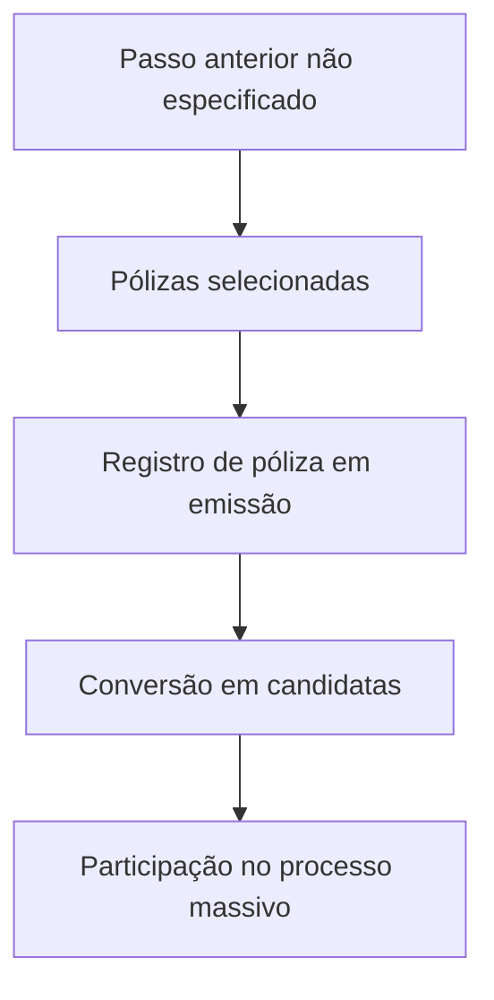

# Registro de Pólizas em Emissão para Processo Massivo

## 1. Metadados do Documento
- **Arquivo de Origem:** Não identificado
- **Tipo de Documento:** Procedimento
- **Domínio / Sistema:** Emissão de pólizas; processo massivo
- **Público-Alvo:** Operação, negócio e equipes técnicas
- **Data/Versão Identificada:** Não identificada

---

## 2. Resumo Executivo & Contexto de Negócio

O conteúdo descreve a etapa **“REGISTRAR póliza en emisión (enlace con visión técnica)”**, relacionada ao registro de pólizas em emissão para participação em um processo massivo.

O objetivo declarado é identificar quais pólizas participarão do processo massivo. Para isso, as pólizas selecionadas são convertidas em candidatas ao processo.

A execução desta etapa não requer ação adicional do usuário ou operador: o documento informa que ela ocorre como consequência do passo anterior. O passo anterior, seus critérios de seleção e os mecanismos técnicos de conversão não são detalhados.

O material contém referências textuais a **CF**, **Home Solutions**, **APIs Documentation** e **Zeus**, mas não explica a função, integração ou responsabilidade desses termos no processo.

---

## 3. Arquitetura, Componentes & Tecnologias Envolvidas

Os componentes ou referências identificadas são:

| Componente / Referência | Papel identificado no conteúdo | Detalhamento disponível |
| :--- | :--- | :--- |
| Emissão de pólizas | Contexto da etapa de registro | A póliza está em emissão e pode ser convertida em candidata ao processo massivo |
| Processo massivo | Processo para o qual as pólizas selecionadas são preparadas | Não detalhado |
| Passo anterior | Evento que desencadeia o registro | Não identificado |
| CF | Referência presente no rodapé/conteúdo | Não detalhado |
| Home Solutions | Referência presente no rodapé/conteúdo | Não detalhado |
| APIs Documentation | Referência presente no rodapé/conteúdo | Não detalhado |
| Zeus | Referência presente no rodapé/conteúdo | Não detalhado |



> **Nota de Análise:** O conteúdo não descreve tecnologias, contratos de API, métodos HTTP, formatos de dados, integrações, servidores ou responsabilidades técnicas de Home Solutions, APIs Documentation, Zeus ou CF.

---

## 4. Regras de Negócio, Especificações Funcionais & Processos

1. A etapa considera pólizas previamente selecionadas.
2. As pólizas selecionadas para um processo massivo devem ser convertidas em candidatas para esse processo.
3. O objetivo operacional é conhecer quais pólizas participarão do processo massivo.
4. Não é necessário executar uma ação adicional nesta etapa.
5. O registro de pólizas em emissão é consequência do passo anterior.
6. O documento não informa:
   - critérios usados para selecionar pólizas;
   - identidade ou funcionamento do passo anterior;
   - regras de elegibilidade;
   - estados anteriores ou posteriores da póliza;
   - responsáveis pela execução;
   - tratamento de falhas, exceções ou reprocessamentos.

---

## 5. Tabelas de Parâmetros, Ambientes e Estruturas de Dados

| Item / Parâmetro | Descrição / Função | Tipo / Valores / Formato | Ambiente / Observações |
| :--- | :--- | :--- | :--- |
| Póliza selecionada | Póliza tomada para participação em processo massivo | Entidade de negócio; atributos não detalhados | Deve ser selecionada em etapa anterior não especificada |
| Póliza candidata | Resultado da conversão de uma póliza selecionada | Estado ou classificação funcional; formato não detalhado | Candidata ao processo massivo |
| Processo massivo | Processo que recebe as pólizas candidatas | Processo operacional; detalhes não informados | Objetivo final da etapa |
| Passo anterior | Gatilho para o registro de pólizas em emissão | Não informado | A etapa atual ocorre como consequência desse passo |
| CF | Referência textual identificada | Não informado | Sem detalhamento adicional |
| Home Solutions | Referência textual identificada | Não informado | Sem detalhamento adicional |
| APIs Documentation | Referência textual identificada | Não informado | Sem URL, contrato ou especificação técnica |
| Zeus | Referência textual identificada | Não informado | Sem detalhamento adicional |

---

## 6. Bateria de Perguntas & Respostas para RAG (FAQ Sintético)

### P1: Em que consiste o registro de póliza em emissão?
**R:** O registro de póliza em emissão consiste em tomar as pólizas selecionadas para um processo massivo e convertê-las em candidatas para esse processo massivo.

### P2: Qual é o objetivo da etapa de registro de pólizas em emissão?
**R:** O objetivo é conhecer quais pólizas participarão do processo massivo.

### P3: É necessário executar algum passo manual para registrar uma póliza em emissão?
**R:** Não. O documento informa que não é necessário seguir nenhum passo, pois a etapa é consequência do passo anterior.

### P4: O que acontece com as pólizas selecionadas para um processo massivo?
**R:** As pólizas selecionadas são convertidas em candidatas para o processo massivo.

### P5: O documento explica como as pólizas são selecionadas?
**R:** Não. O conteúdo menciona pólizas selecionadas, mas não apresenta critérios, regras, filtros ou responsáveis pela seleção.

### P6: Qual é o passo anterior que desencadeia o registro de pólizas?
**R:** O documento apenas informa que o registro é consequência do passo anterior; ele não identifica ou descreve esse passo.

### P7: Quais APIs devem ser utilizadas no processo de registro de pólizas em emissão?
**R:** O conteúdo menciona “APIs Documentation”, mas não especifica APIs, endpoints, métodos HTTP, contratos, autenticação ou payloads.

### P8: Qual é a função de Zeus no processo massivo?
**R:** O termo “Zeus” aparece no conteúdo, porém o documento não define sua função, responsabilidade, integração ou relação com o registro de pólizas.

### P9: O que significa uma póliza candidata no contexto apresentado?
**R:** Uma póliza candidata é uma póliza selecionada que foi convertida para participar do processo massivo.

### P10: Existem regras de exceção, falha ou reprocessamento para o registro de pólizas?
**R:** Não. O documento não descreve regras para erros, exceções, rejeições, reprocessamentos ou auditoria.

---

## 7. Glossário de Termos, Siglas & Conceitos-Chave

- **Póliza:** Entidade de negócio mencionada no documento; corresponde à unidade selecionada e convertida em candidata para o processo massivo.
- **Emissão:** Contexto funcional associado ao registro da póliza.
- **Processo massivo:** Processo que recebe pólizas selecionadas e convertidas em candidatas.
- **Póliza candidata:** Póliza selecionada e preparada para participação no processo massivo.
- **CF:** Sigla ou referência exibida no conteúdo, sem definição disponível.
- **Home Solutions:** Referência exibida no conteúdo, sem definição disponível.
- **APIs Documentation:** Referência a documentação de APIs, sem detalhamento de interfaces ou serviços.
- **Zeus:** Referência exibida no conteúdo, sem definição disponível.

---

## 8. Notas Críticas, Riscos & Limitações

- O conteúdo é resumido e não detalha o passo anterior que dispara o registro.
- Não há critérios de seleção, elegibilidade ou validação das pólizas.
- Não há especificação técnica de APIs, integrações, contratos de dados ou tecnologias.
- Não são informados ambientes, URLs, servidores, credenciais, logs ou mecanismos de monitoramento.
- Não há tratamento documentado para erros, falhas, rejeições ou reprocessamento.
- As referências a **CF**, **Home Solutions**, **APIs Documentation** e **Zeus** não possuem explicação contextual adicional.

---

## 9. Conteúdo Bruto Estruturado (Referência Fiel)

```text
--- [PÁGINA 1 DE 1] ---

REGISTRAR póliza en emisión (enlace con
visión técnica)
¿En que consiste?
Tomar las pólizas seleccionadas para un proceso masivo y convertirlas en candidatas para este
proceso.
Objetivo
Conocer aquellas pólizas que participarían en el proceso masivo.
Proceso a seguir
No es necesario seguir paso alguno, ya que es consecuencia del paso anterior.
 /
 CF
Home Solutions APIs Documentation Zeus
EN
```
