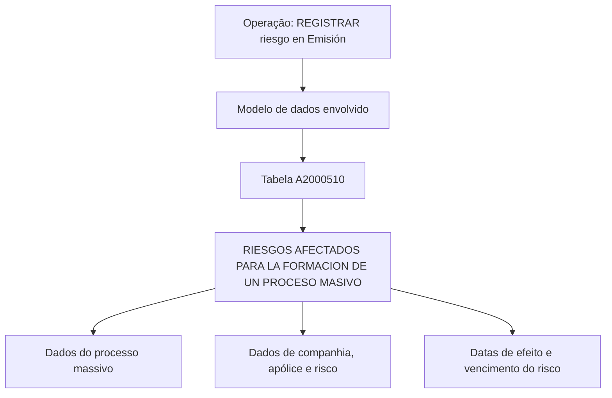

# Registro de Riesgo em Emisión — Modelo de Dados para Processo Massivo

## 1. Metadados do Documento
- **Arquivo de Origem:** Não identificado no conteúdo fornecido
- **Tipo de Documento:** Especificação Técnica
- **Domínio / Sistema:** Registro de risco em *Emisión*
- **Público-Alvo:** Desenvolvedores, Arquitetos, Analistas Funcionais e Operação
- **Data/Versão Identificada:** Não identificada

---

## 2. Resumo Executivo & Contexto de Negócio

O documento descreve o registro de um risco no contexto de **Emisión**, indicando o modelo de dados envolvido em uma operação de processo massivo. A especificação identifica a tabela `A2000510` como estrutura participante da operação.

A tabela `A2000510` é descrita como **“RIESGOS AFECTADOS PARA LA FORMACION DE UN PROCESO MASIVO”**, isto é, riscos afetados para a formação de um processo massivo. O documento apresenta campos associados à identificação do processo, companhia, apólice, risco e vigências do risco.

Todos os campos apresentados possuem `S` na coluna **CAMBIA VALOR**, `N.A.` na coluna **MOTIVO/VALOR** e `SI` na coluna **OBLIGATORIA**. O conteúdo fornecido não explica formalmente o significado da marcação `S`, nem detalha contratos de integração, comandos SQL, APIs, métodos HTTP, regras de persistência ou validações adicionais.

> **Nota de Análise:** O documento cita referências de navegação como `CF`, `Home Solutions`, `APIs Documentation` e `Zeus`, mas não detalha a relação dessas referências com a tabela `A2000510` ou com o processo de registro de risco.

---

## 3. Arquitetura, Componentes & Tecnologias Envolvidas

O conteúdo não apresenta uma arquitetura técnica completa, microsserviços, tecnologias, endpoints, ambientes ou protocolos. A relação estrutural explicitamente apresentada vincula a operação **“REGISTRAR riesgo en Emisión”** à tabela `A2000510`, utilizada na formação de um processo massivo.



### Componentes identificados

| Componente | Categoria | Descrição sustentada pelo documento |
| :--- | :--- | :--- |
| `A2000510` | Tabela | Tabela que intervém na operação de registro de risco para formação de processo massivo. |
| `REGISTRAR riesgo en Emisión` | Operação | Operação indicada como contexto do modelo de dados. |
| Processo massivo | Processo | Processo identificado por data de tratamento, número de ordem e tipo de movimento batch. |
| `CF` | Referência textual | Termo exibido no conteúdo bruto, sem detalhamento adicional. |
| `Home Solutions` | Referência textual | Termo exibido no conteúdo bruto, sem detalhamento adicional. |
| `APIs Documentation` | Referência textual | Termo exibido no conteúdo bruto, sem detalhamento adicional. |
| `Zeus` | Referência textual | Termo exibido no conteúdo bruto, sem detalhamento adicional. |

---

## 4. Regras de Negócio, Especificações Funcionais & Processos

### Operação documentada

1. O documento estabelece o contexto **“REGISTRAR riesgo en Emisión”**.
2. A operação utiliza um modelo de dados que envolve a tabela `A2000510`.
3. A tabela `A2000510` registra riscos afetados para a formação de um processo massivo.
4. O registro do processo massivo contém data de tratamento, número do processo e tipo do processo massivo.
5. O registro também contém companhia, apólice, risco, data de efeito do risco e data de vencimento do risco.
6. Todos os campos listados são marcados como obrigatórios com o valor `SI`.

### Campos obrigatórios documentados

- `FEC_TRATAMIENTO`: data em que é realizado o processo massivo.
- `NUM_ORDEN`: número do processo massivo.
- `TIP_MVTO_BATCH`: tipo do processo massivo.
- `COD_CIA`: companhia.
- `NUM_POLIZA`: apólice.
- `NUM_RIESGO`: risco.
- `FEC_EFEC_RIESGO`: efeito do risco.
- `FEC_VCTO_RIESGO`: vencimento do risco.

> **Nota de Análise:** O documento não descreve a ordem operacional de gravação, as regras de validação de formato, valores permitidos, chaves primárias, chaves estrangeiras, critérios de atualização, tratamento de erro ou comportamento em caso de dados ausentes.

---

## 5. Tabelas de Parâmetros, Ambientes e Estruturas de Dados

### Tabela envolvida

| Item / Parâmetro | Descrição / Função | Tipo / Valores / Formato | Ambiente / Observações |
| :--- | :--- | :--- | :--- |
| `A2000510` | Riscos afetados para a formação de um processo massivo. | Tabela | O documento declara que a tabela intervém na operação. Não há ambiente identificado. |

### Campos da tabela `A2000510`

| Item / Parâmetro | Descrição / Função | Tipo / Valores / Formato | Ambiente / Observações |
| :--- | :--- | :--- | :--- |
| `FEC_TRATAMIENTO` | Data em que é realizado o processo massivo. | CAMBIA VALOR: `S`; MOTIVO/VALOR: `N.A.`; OBLIGATORIA: `SI` | O formato da data não é especificado. |
| `NUM_ORDEN` | Número do processo massivo. | CAMBIA VALOR: `S`; MOTIVO/VALOR: `N.A.`; OBLIGATORIA: `SI` | O tipo numérico ou formato não é especificado. |
| `TIP_MVTO_BATCH` | Tipo do processo massivo. | CAMBIA VALOR: `S`; MOTIVO/VALOR: `N.A.`; OBLIGATORIA: `SI` | Os valores permitidos não são especificados. |
| `COD_CIA` | Companhia. | CAMBIA VALOR: `S`; MOTIVO/VALOR: `N.A.`; OBLIGATORIA: `SI` | O domínio de companhias não é especificado. |
| `NUM_POLIZA` | Apólice. | CAMBIA VALOR: `S`; MOTIVO/VALOR: `N.A.`; OBLIGATORIA: `SI` | O formato da apólice não é especificado. |
| `NUM_RIESGO` | Risco. | CAMBIA VALOR: `S`; MOTIVO/VALOR: `N.A.`; OBLIGATORIA: `SI` | O formato do risco não é especificado. |
| `FEC_EFEC_RIESGO` | Efeito do risco. | CAMBIA VALOR: `S`; MOTIVO/VALOR: `N.A.`; OBLIGATORIA: `SI` | O formato da data não é especificado. |
| `FEC_VCTO_RIESGO` | Vencimento do risco. | CAMBIA VALOR: `S`; MOTIVO/VALOR: `N.A.`; OBLIGATORIA: `SI` | O formato da data não é especificado. |

---

## 6. Bateria de Perguntas & Respostas para RAG (FAQ Sintético)

### P1: Qual tabela participa da operação de registrar risco em Emisión?
**R:** A tabela identificada pelo documento é `A2000510`. Ela é apresentada como uma das tabelas que intervêm na operação de registro de risco em Emisión.

### P2: Qual é a descrição funcional da tabela A2000510?
**R:** A tabela `A2000510` é descrita como `RIESGOS AFECTADOS PARA LA FORMACION DE UN PROCESO MASIVO`, isto é, riscos afetados para a formação de um processo massivo.

### P3: Quais campos identificam o processo massivo na tabela A2000510?
**R:** Os campos ligados à identificação do processo massivo são `FEC_TRATAMIENTO`, que representa a data de realização do processo; `NUM_ORDEN`, que representa o número do processo; e `TIP_MVTO_BATCH`, que representa o tipo do processo massivo.

### P4: O campo FEC_TRATAMIENTO é obrigatório?
**R:** Sim. O campo `FEC_TRATAMIENTO` está marcado com `SI` na coluna `OBLIGATORIA`. O documento o descreve como a data em que é realizado o processo massivo.

### P5: Qual campo armazena o número do processo massivo?
**R:** O campo `NUM_ORDEN` armazena o número do processo massivo. O documento o marca como obrigatório com o valor `SI`.

### P6: Qual campo identifica o tipo de processo massivo?
**R:** O campo `TIP_MVTO_BATCH` identifica o tipo do processo massivo. O documento não informa os valores aceitos para esse campo.

### P7: Quais campos relacionam o registro à companhia, apólice e risco?
**R:** Os campos são `COD_CIA` para a companhia, `NUM_POLIZA` para a apólice e `NUM_RIESGO` para o risco. Os três campos estão marcados como obrigatórios.

### P8: Quais campos representam as datas de vigência do risco?
**R:** O documento lista `FEC_EFEC_RIESGO` como efeito do risco e `FEC_VCTO_RIESGO` como vencimento do risco. Ambos estão marcados como obrigatórios.

### P9: O documento especifica os formatos de data para FEC_TRATAMIENTO, FEC_EFEC_RIESGO e FEC_VCTO_RIESGO?
**R:** Não. O documento descreve o propósito desses campos, mas não informa formatos, máscaras, timezone, regras de conversão ou validações para as datas.

### P10: O documento define valores permitidos para TIP_MVTO_BATCH?
**R:** Não. O documento informa que `TIP_MVTO_BATCH` corresponde ao tipo do processo massivo e que o campo é obrigatório, mas não apresenta uma lista de valores permitidos.

### P11: O documento detalha APIs, endpoints ou contratos JSON para registrar riscos?
**R:** Não. Embora o conteúdo apresente referências textuais a `APIs Documentation`, não há endpoints, métodos HTTP, payloads, contratos JSON, autenticação ou códigos de resposta descritos.

### P12: O que significa o valor S na coluna CAMBIA VALOR?
**R:** O documento registra `S` para todos os campos apresentados na coluna `CAMBIA VALOR`, mas não fornece uma definição explícita para essa marcação. Portanto, não é possível afirmar seu significado além de sua presença nos registros.

---

## 7. Glossário de Termos, Siglas & Conceitos-Chave

- **A2000510:** Identificador da tabela envolvida na operação documentada.
- **CAMBIA VALOR:** Coluna apresentada na especificação para todos os campos, com valor `S`; o significado de `S` não é definido.
- **COD_CIA:** Campo descrito como companhia.
- **Emisión:** Contexto em que ocorre a operação de registrar risco; o documento não fornece uma definição adicional.
- **FEC_EFEC_RIESGO:** Campo descrito como efeito do risco.
- **FEC_TRATAMIENTO:** Campo descrito como a data em que é realizado o processo massivo.
- **FEC_VCTO_RIESGO:** Campo descrito como vencimento do risco.
- **MOTIVO/VALOR:** Coluna apresentada com valor `N.A.` para todos os campos documentados.
- **NUM_ORDEN:** Campo descrito como número do processo massivo.
- **NUM_POLIZA:** Campo descrito como apólice.
- **NUM_RIESGO:** Campo descrito como risco.
- **OBLIGATORIA:** Coluna que indica obrigatoriedade; todos os campos estão marcados com `SI`.
- **Processo massivo:** Processo relacionado à tabela `A2000510`, identificado por data de tratamento, número de ordem e tipo de movimento batch.
- **RIESGOS AFECTADOS PARA LA FORMACION DE UN PROCESO MASIVO:** Descrição da tabela `A2000510`.
- **TIP_MVTO_BATCH:** Campo descrito como tipo do processo massivo.

---

## 8. Notas Críticas, Riscos & Limitações

- O conteúdo não identifica o arquivo de origem, autor, data, versão, ambiente ou sistema corporativo proprietário.
- O conteúdo não informa tipos físicos de dados, tamanhos de campos, formatos de data, valores de domínio, índices, chaves ou relacionamentos entre tabelas.
- O significado de `S` em `CAMBIA VALOR` não é definido.
- O significado operacional de `N.A.` em `MOTIVO/VALOR` não é definido.
- Não há detalhes sobre inserção, atualização, exclusão, transações, auditoria, tratamento de erros ou reprocessamento do processo massivo.
- Não são detalhados endpoints, APIs, serviços, interfaces, contratos, autenticação ou integração com os termos `Home Solutions`, `APIs Documentation` e `Zeus`.
- A descrição de `NUM_ORDEN` está dividida entre as duas páginas no conteúdo bruto; a leitura consolidada indica “NUMERO DEL PROCESO MASIVO”.

---

## 9. Conteúdo Bruto Estruturado (Referência Fiel)

```text
--- [PÁGINA 1 DE 2] ---

EN CONSTRUCCIÓN
REGISTRAR riesgo en Emisión
Modelo de datos involucrado
Las tablas que intervienen en esta operación son:
A2000510
TABLA DESCRIPCIÓN
A2000510 RIESGOS AFECTADOS PARA LA FORMACION DE UN PROCESO MASIVO
COLUMNA CAMBIA
VALOR
MOTIVO/VALOR OBLIGATORIA COMENTARIO
FEC_TRATAMIENTO S N.A. SI FECHA EN LA
QUE SE
REALIZA EL
PROCESO
MASIVO
NUM_ORDEN S N.A. SI NUMERO DEL
PROCESO
 / 
 CF
Home Solutions APIs Documentation Zeus
EN


--- [PÁGINA 2 DE 2] ---

COLUMNA CAMBIA
VALOR
MOTIVO/VALOR OBLIGATORIA COMENTARIO
MASIVO
TIP_MVTO_BATCH S N.A. SI TIPO DEL
PROCESO
MASIVO
COD_CIA S N.A. SI COMPANIA
NUM_POLIZA S N.A. SI POLIZA
NUM_RIESGO S N.A. SI RIESGO
FEC_EFEC_RIESGO S N.A. SI EFECTO DEL
RIESGO
FEC_VCTO_RIESGO S N.A. SI VENCIMIENTO
DEL RIESGO
```
