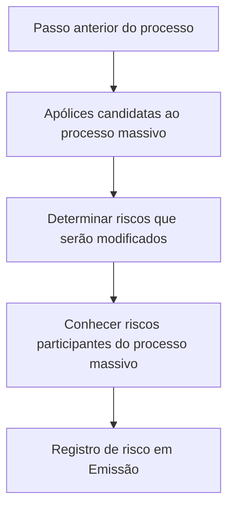

# Registro de Risco em Emissão — Visão Técnica

## 1. Metadados do Documento
- **Arquivo de Origem:** Não identificado
- **Tipo de Documento:** Procedimento
- **Domínio / Sistema:** Emissão; processo massivo de apólices; Home Solutions APIs Documentation Zeus
- **Público-Alvo:** Desenvolvedores, Arquitetos, Operação e Negócio
- **Data/Versão Identificada:** Não identificada

---

## 2. Resumo Executivo & Contexto de Negócio

O documento descreve a etapa **“Registrar risco em Emissão”**, apresentada como uma visão técnica associada a um processo massivo de apólices. O objetivo informado é identificar, entre as apólices candidatas ao processo massivo, quais riscos serão modificados.

A finalidade operacional da etapa é conhecer antecipadamente os riscos que participarão do processo massivo. Essa identificação permite delimitar o conjunto de riscos impactados antes ou durante a execução do processo relacionado à emissão.

O documento estabelece que não existe uma ação adicional a ser executada especificamente nesta etapa. O registro ou a identificação dos riscos ocorre como consequência do passo anterior do processo.

Não há detalhamento sobre contratos de API, métodos HTTP, estruturas de dados, persistência, critérios de elegibilidade das apólices, regras para determinar modificações de risco ou ambientes técnicos. Também não há detalhamento adicional sobre “Home Solutions APIs Documentation Zeus”.

---

## 3. Arquitetura, Componentes & Tecnologias Envolvidas

Os elementos explicitamente citados são:

- **Emissão:** Contexto no qual o risco é registrado.
- **Apólices candidatas ao processo massivo:** Conjunto de apólices analisadas.
- **Riscos:** Entidades que podem ser modificadas e que devem ser identificadas.
- **Processo massivo:** Processo no qual determinados riscos participam.
- **Passo anterior:** Etapa predecessora cuja consequência produz o resultado descrito.
- **Home Solutions APIs Documentation Zeus:** Referência textual presente no documento, sem explicação funcional ou técnica adicional.
- **CF:** Sigla exibida no documento, sem definição contextual.



> **Nota de Análise:** O documento apresenta um fluxo lógico de consequência entre o passo anterior e a identificação de riscos, mas não especifica sistemas responsáveis, integrações, APIs, tecnologias, bancos de dados ou mecanismos de registro.

---

## 4. Regras de Negócio, Especificações Funcionais & Processos

1. O escopo da identificação compreende as **apólices candidatas ao processo massivo**.
2. Entre as apólices candidatas, devem ser determinados os **riscos que serão modificados**.
3. O objetivo da identificação é conhecer os riscos que participarão do processo massivo.
4. Não é necessário executar nenhum passo adicional para registrar ou identificar os riscos nesta etapa.
5. A ocorrência da etapa é consequência do **passo anterior** do processo.
6. O documento não apresenta critérios para:
   - Classificar uma apólice como candidata ao processo massivo.
   - Determinar se um risco será modificado.
   - Definir o tipo de modificação aplicável ao risco.
   - Registrar tecnicamente o risco em Emissão.
   - Tratar erros, exceções, reprocessamentos ou auditoria.

---

## 5. Tabelas de Parâmetros, Ambientes e Estruturas de Dados

| Item / Parâmetro | Descrição / Função | Tipo / Valores / Formato | Ambiente / Observações |
| :--- | :--- | :--- | :--- |
| Registro de risco em Emissão | Etapa descrita para identificar riscos associados a apólices candidatas ao processo massivo. | Processo / atividade | O documento não detalha implementação técnica. |
| Apólices candidatas | Apólices consideradas para participação no processo massivo. | Conjunto de apólices | Não há critérios de candidatura informados. |
| Riscos modificados | Riscos, dentre os associados às apólices candidatas, que sofrerão modificação. | Riscos | Não há regra de identificação ou classificação. |
| Processo massivo | Processo no qual os riscos identificados participarão. | Processo de negócio | Não há detalhamento de execução, entrada ou saída. |
| Passo anterior | Etapa predecessora cuja consequência produz a identificação descrita. | Dependência de processo | Não identificado no conteúdo fornecido. |
| Home Solutions APIs Documentation Zeus | Texto de referência exibido ao final do conteúdo. | Referência / possível portal documental | Não há URL, contratos ou descrição adicional. |
| CF | Sigla presente no documento. | Sigla | Significado não identificado. |
| Idioma | O conteúdo principal está em espanhol. | Texto | Título e organização analítica produzidos em português. |

---

## 6. Bateria de Perguntas & Respostas para RAG (FAQ Sintético)

### P1: Qual é o objetivo de registrar risco em Emissão?
**R:** O objetivo é conhecer quais riscos participarão do processo massivo, identificando, entre as apólices candidatas, aqueles riscos que serão modificados.

### P2: Quais apólices são analisadas no processo de registro de risco em Emissão?
**R:** O documento informa que são analisadas as apólices candidatas ao processo massivo. Os critérios que tornam uma apólice candidata não são detalhados.

### P3: O que deve ser determinado entre as apólices candidatas ao processo massivo?
**R:** Deve-se determinar quais riscos, entre os riscos associados às apólices candidatas, serão modificados.

### P4: É necessário executar uma etapa manual específica para registrar o risco em Emissão?
**R:** Não. O documento afirma que não é necessário seguir nenhum passo, pois a identificação ou o registro ocorre como consequência do passo anterior.

### P5: Qual é a dependência do processo de registro de risco em Emissão?
**R:** A dependência indicada é o passo anterior do processo. O documento não identifica qual é esse passo anterior nem descreve sua implementação.

### P6: O documento define como identificar um risco que será modificado?
**R:** Não. O documento apenas estabelece que os riscos modificados devem ser determinados dentro das apólices candidatas ao processo massivo; não apresenta critérios, regras ou algoritmos para essa determinação.

### P7: O documento especifica APIs, métodos HTTP ou contratos JSON para o registro de risco?
**R:** Não. Embora o texto mencione “Home Solutions APIs Documentation Zeus”, não há métodos HTTP, endpoints, URLs, payloads, respostas ou contratos técnicos descritos.

### P8: O que acontece com os riscos identificados no contexto do processo massivo?
**R:** Os riscos identificados são aqueles que participarão do processo massivo e que serão modificados conforme a finalidade descrita no documento.

### P9: Há informações sobre ambientes, servidores ou configurações de log?
**R:** Não. O conteúdo fornecido não apresenta ambientes, servidores, portas, caminhos de log, variáveis de configuração ou parâmetros operacionais.

### P10: O documento define o significado da sigla CF?
**R:** Não. A sigla “CF” aparece no conteúdo, mas não possui definição explícita no material fornecido.

---

## 7. Glossário de Termos, Siglas & Conceitos-Chave

- **Emissão:** Contexto funcional citado no título da etapa de registro de risco.
- **Apólices candidatas:** Apólices consideradas para análise e possível participação no processo massivo.
- **Processo massivo:** Processo mencionado como destino ou contexto de participação dos riscos identificados.
- **Riscos modificados:** Riscos que, entre as apólices candidatas, serão alterados no processo massivo.
- **CF:** Sigla presente no documento sem significado definido.
- **Home Solutions APIs Documentation Zeus:** Referência textual a documentação de APIs; sem detalhamento adicional no conteúdo analisado.

---

## 8. Notas Críticas, Riscos & Limitações

- O documento não identifica o arquivo de origem, versão, data, autor ou responsável.
- O “passo anterior” é uma dependência central, mas não está descrito.
- Não há critérios de elegibilidade para apólices candidatas ao processo massivo.
- Não há regras que expliquem como determinar quais riscos serão modificados.
- Não há informações sobre persistência, auditoria, rastreabilidade, tratamento de falhas ou reprocessamento.
- A referência a “Home Solutions APIs Documentation Zeus” não contém URL, endpoint, contrato de integração ou especificação técnica.
- A sigla **CF** não é definida.
- **Nota de Análise:** O documento descreve apenas o propósito e a dependência processual da etapa; não oferece detalhamento suficiente para implementação técnica autônoma.

---

## 9. Conteúdo Bruto Estruturado (Referência Fiel)

```text
--- [PÁGINA 1 DE 1] ---

REGISTRAR riesgo en Emisión (enlace con
visión técnica)
¿En que consiste?
De las pólizas candidatas al proceso masivo, determinar aquellos riesgos que se van a ver
modificados.
Objetivo
Conocer aquellos riesgos que participarán en el proceso masivo.
Proceso a seguir
No es necesario seguir paso alguno, ya que es consecuencia del paso anterior.
 / 
 CF
Home Solutions APIs Documentation Zeus
EN
```
