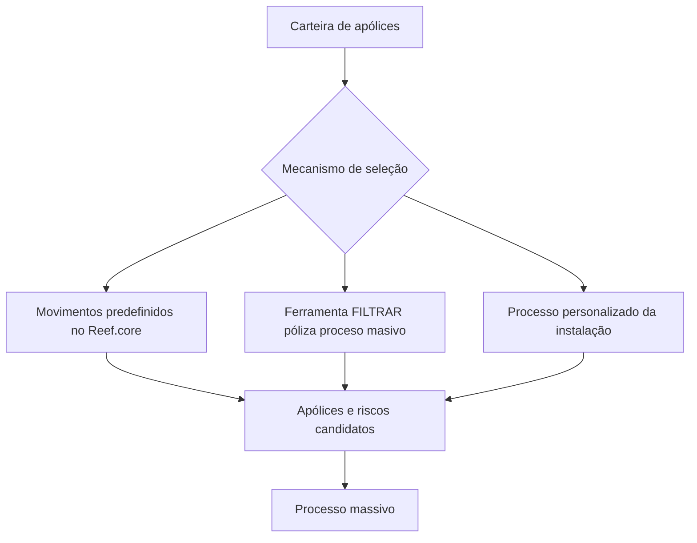
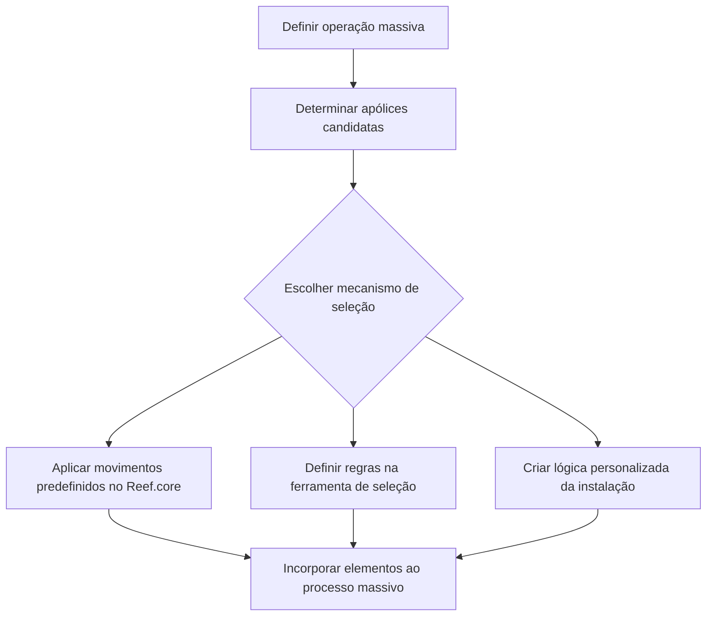

# Seleção de Apólices para Processo Massivo no Reef.core

## 1. Metadados do Documento
- **Arquivo de Origem:** `Não identificado no conteúdo fornecido`
- **Tipo de Documento:** `Procedimento`
- **Domínio / Sistema:** `Reef.core / processos massivos de apólices e riscos`
- **Público-Alvo:** `Negócio, analistas funcionais, desenvolvedores e operação`
- **Data/Versão Identificada:** `Não identificada`

---

## 2. Resumo Executivo & Contexto de Negócio

O documento descreve a etapa de **seleção de apólices em emissão** para participação em um processo massivo. O objetivo declarado é determinar quais apólices serão candidatas a participar da operação massiva em definição.

A seleção deve extrair da carteira exclusivamente as apólices com as quais se pretende realizar a operação. O escopo do texto também inclui a seleção de riscos, quando aplicável, por meio da ferramenta disponível no Reef.core ou por lógica específica da instalação.

O conteúdo apresenta três mecanismos de incorporação de elementos ao processo massivo: movimentos predefinidos no Reef.core, ferramenta de seleção de apólices/riscos e processo personalizado da instalação. Esses mecanismos permitem que apólices e riscos sejam identificados como candidatos antes do processamento massivo.

Os movimentos predefinidos citados incluem renovação, CF, anulação por falta de pagamento, regularização de vida, suspensão de contribuição pactuada e recibos não pagos. O documento não detalha critérios técnicos, campos, contratos, regras de priorização ou métodos de execução para esses movimentos.

---

## 3. Arquitetura, Componentes & Tecnologias Envolvidas

| Componente / Elemento | Papel identificado |
| :--- | :--- |
| Reef.core | Sistema que contém movimentos predefinidos e uma utilidade para definir regras de seleção de apólices e riscos. |
| Processo massivo | Processo que recebe apólices e riscos previamente selecionados como candidatos. |
| Movimentos predefinidos no Reef.core | Mecanismo capaz de determinar inicialmente os elementos participantes do processo massivo. |
| Ferramenta de seleção de apólices/riscos | Utilidade do Reef.core denominada `FILTRAR póliza proceso masivo`, usada para estabelecer regras de seleção. |
| Processo personalizado da instalação | Lógica própria que a instalação pode criar para selecionar apólices e riscos a processar. |
| Carteira | Fonte da qual são extraídas as apólices destinadas à operação definida. |



**Nota de Análise:** O documento menciona o Reef.core e a ferramenta `FILTRAR póliza proceso masivo`, mas não detalha interfaces, métodos HTTP, persistência, regras de precedência, contratos de dados ou integrações externas.

---

## 4. Regras de Negócio, Especificações Funcionais & Processos

### Objetivo da seleção

A seleção de apólices em emissão consiste em determinar quais apólices serão candidatas a participar do processo massivo que está sendo definido.

A operação deve extrair da carteira somente as apólices com as quais se pretende realizar a operação em definição.

### Formas de incorporar elementos ao processo massivo

Existem três formas para que elementos se tornem candidatos e sejam incorporados ao processo massivo:

1. **Movimentos predefinidos no Reef.core**
   - Existem movimentos capazes de determinar os elementos que devem participar inicialmente do processo massivo.
   - Movimentos listados:
     - Renovação.
     - CF.
     - Anulação por falta de pagamento.
     - Regularização de vida.
     - Suspensão de contribuição pactuada.
     - Recibos não pagos.

2. **Ferramenta de seleção de apólices/riscos**
   - O Reef.core disponibiliza uma utilidade para estabelecer regras de seleção.
   - A utilidade seleciona as apólices e os riscos que participarão do processo massivo.
   - O nome apresentado para a utilidade é `FILTRAR póliza proceso masivo`.

3. **Processo personalizado da instalação**
   - Como última opção, a instalação pode criar lógicas próprias.
   - As lógicas próprias selecionam as apólices e os riscos a serem processados.

### Fluxo operacional extraído



**Nota de Análise:** O documento não especifica se os três mecanismos são mutuamente exclusivos, se podem ser combinados, nem como resolver duplicidades de apólices ou riscos selecionados por mais de um mecanismo.

---

## 5. Tabelas de Parâmetros, Ambientes e Estruturas de Dados

| Item / Parâmetro | Descrição / Função | Tipo / Valores / Formato | Ambiente / Observações |
| :--- | :--- | :--- | :--- |
| Seleção de apólices em emissão | Determinar quais apólices serão candidatas ao processo massivo. | Processo funcional. | Não há ambiente identificado. |
| Carteira | Origem das apólices das quais serão extraídas as apólices para a operação. | Conjunto de apólices. | Não há estrutura de dados detalhada. |
| Processo massivo | Processo que recebe os elementos selecionados como candidatos. | Processo operacional. | Não há detalhes de execução. |
| Reef.core | Sistema que fornece movimentos e ferramenta de seleção. | Sistema / plataforma. | Não há versão identificada. |
| Movimentos predefinidos | Determinam inicialmente os elementos participantes do processo massivo. | Mecanismo de seleção. | Movimentos específicos listados abaixo. |
| Renovação | Movimento predefinido capaz de determinar elementos participantes. | Movimento. | Sem critérios adicionais descritos. |
| CF | Movimento predefinido capaz de determinar elementos participantes. | Movimento. | Sigla não expandida no documento. |
| Anulação por falta de pagamento | Movimento predefinido capaz de determinar elementos participantes. | Movimento. | Sem critérios adicionais descritos. |
| Regularização de vida | Movimento predefinido capaz de determinar elementos participantes. | Movimento. | Sem critérios adicionais descritos. |
| Suspensão de contribuição pactuada | Movimento predefinido capaz de determinar elementos participantes. | Movimento. | Sem critérios adicionais descritos. |
| Recibos não pagos | Movimento predefinido capaz de determinar elementos participantes. | Movimento. | Sem critérios adicionais descritos. |
| `FILTRAR póliza proceso masivo` | Utilidade do Reef.core para estabelecer regras de seleção de apólices e riscos. | Ferramenta / utilidade. | Nome preservado no idioma original. |
| Processo personalizado da instalação | Lógica própria para selecionar apólices e riscos a processar. | Mecanismo de seleção customizado. | Apresentado como última opção. |
| Apólices | Elementos da carteira selecionados para participar da operação massiva. | Entidade de negócio. | Sem atributos ou estrutura definidos. |
| Riscos | Elementos que também podem ser selecionados para o processo massivo. | Entidade de negócio. | Sem atributos ou estrutura definidos. |

---

## 6. Bateria de Perguntas & Respostas para RAG (FAQ Sintético)

### P1: Qual é o objetivo da seleção de apólices em emissão?
**R:** O objetivo é determinar quais apólices serão candidatas a participar do processo massivo que está sendo definido.

### P2: O que deve ser extraído da carteira para uma operação massiva?
**R:** Devem ser extraídas da carteira somente as apólices com as quais se pretende realizar a operação em definição.

### P3: Quantas formas o documento apresenta para incorporar elementos ao processo massivo?
**R:** O documento apresenta três formas: movimentos predefinidos no Reef.core, ferramenta de seleção de apólices/riscos e processo personalizado da instalação.

### P4: Qual sistema disponibiliza movimentos predefinidos para identificar participantes do processo massivo?
**R:** O Reef.core disponibiliza movimentos capazes de determinar os elementos que devem participar inicialmente do processo massivo.

### P5: Quais movimentos predefinidos no Reef.core são citados no documento?
**R:** Os movimentos citados são renovação, CF, anulação por falta de pagamento, regularização de vida, suspensão de contribuição pactuada e recibos não pagos.

### P6: Qual é a função da ferramenta `FILTRAR póliza proceso masivo`?
**R:** A ferramenta `FILTRAR póliza proceso masivo` é uma utilidade do Reef.core que permite estabelecer regras para selecionar as apólices e os riscos que participarão do processo massivo.

### P7: A seleção massiva trata apenas apólices?
**R:** Não. O documento informa que a ferramenta de seleção e o processo personalizado podem selecionar tanto apólices quanto riscos para participação ou processamento no processo massivo.

### P8: Quando pode ser usado um processo personalizado da instalação?
**R:** O processo personalizado pode ser usado como última opção, permitindo que a instalação crie lógicas próprias para selecionar as apólices e os riscos a processar.

### P9: O documento define os critérios de seleção da ferramenta de apólices e riscos?
**R:** Não. O documento apenas informa que a utilidade do Reef.core permite estabelecer regras de seleção; não descreve os critérios, campos, filtros ou condições dessas regras.

### P10: O documento explica o significado da sigla CF?
**R:** Não. O documento lista CF como um movimento predefinido no Reef.core, mas não apresenta sua expansão ou significado.

---

## 7. Glossário de Termos, Siglas & Conceitos-Chave

- **Apólice:** Elemento da carteira que pode ser selecionado como candidato para uma operação ou processo massivo.
- **Carteira:** Conjunto de apólices do qual são extraídas aquelas destinadas à operação definida.
- **CF:** Movimento predefinido no Reef.core. O significado da sigla não é detalhado no documento.
- **Emissão:** Contexto indicado pelo título “selecionar apólice em emissão”; o documento não fornece definição adicional.
- **FILTRAR póliza proceso masivo:** Utilidade do Reef.core para estabelecer regras de seleção de apólices e riscos participantes do processo massivo.
- **Movimento predefinido:** Movimento no Reef.core capaz de determinar os elementos que devem participar inicialmente do processo massivo.
- **Processo massivo:** Processo que incorpora apólices e riscos selecionados como candidatos.
- **Processo personalizado da instalação:** Lógica criada pela instalação para selecionar apólices e riscos a processar.
- **Reef.core:** Sistema citado como provedor de movimentos predefinidos e da ferramenta de seleção de apólices/riscos.
- **Risco:** Elemento que pode ser selecionado, juntamente com apólices, para participar do processo massivo.

---

## 8. Notas Críticas, Riscos & Limitações

- O conteúdo não identifica o arquivo de origem, data, versão, autor, ambiente ou responsáveis pelo processo.
- O documento não detalha os critérios funcionais ou técnicos usados para seleção por cada movimento predefinido.
- A sigla **CF** é listada, porém não é expandida nem definida.
- Não foram informados campos de entrada, atributos de apólice, atributos de risco, formatos de dados, integrações, APIs, bancos de dados ou rotas de log.
- Não há detalhamento sobre tratamento de duplicidades quando uma mesma apólice ou risco for selecionado por mais de um mecanismo.
- Não há regras de priorização entre movimentos predefinidos, ferramenta `FILTRAR póliza proceso masivo` e processo personalizado da instalação.
- Não foram apresentados controles de autorização, auditoria, aprovação, reversão ou monitoramento da seleção.
- O processo personalizado é descrito como “última opção”, mas o documento não define condições formais para seu uso.

---

## 9. Conteúdo Bruto Estruturado (Referência Fiel)

```text
--- [PÁGINA 1 DE 2] ---

SELECCIONAR póliza en emisión
¿En que consiste?
Determinar qué pólizas serán candidatas a participar en el proceso masivo que se está definiendo.
Objetivo
Extraer de la cartera solo aquellas pólizas con las que se pretende realizar la operación que se está
definiendo
Proceso a seguir
Existen tres formas en las que los elementos pasen a ser candidatos y se incorporen al proceso
masivo:
1. Movimientos prefijados en Ref.core
2. Herramienta de selección de pólizas/riesgos
3. Proceso personalizado de la instalación
Movimientos prefijados en Reef.core
Existen movimientos que son capaces de determinar los elementos que deben participar inicialmente
en el proceso masivo. Estos movimientos son:
Renovación
 / 
 CF
Home Solutions APIs Documentation Zeus
EN


--- [PÁGINA 2 DE 2] ---

Anulación por falta de pago
Regularización vida
Suspensión aportación pactada
Recibos impagados
Herramienta de selección de pólizas/riesgos
Existe una utilidad en Reef.core que permite establecer las reglas que seleccionen las pólizas y
riesgos que participarían en el proceso masivo FILTRAR póliza proceso masivo.
Proceso personalizado de la instalación
Como última opción, la instalación puede crear sus propias lógicas que seleccionen las pólizas y
riesgos a procesar.
```
