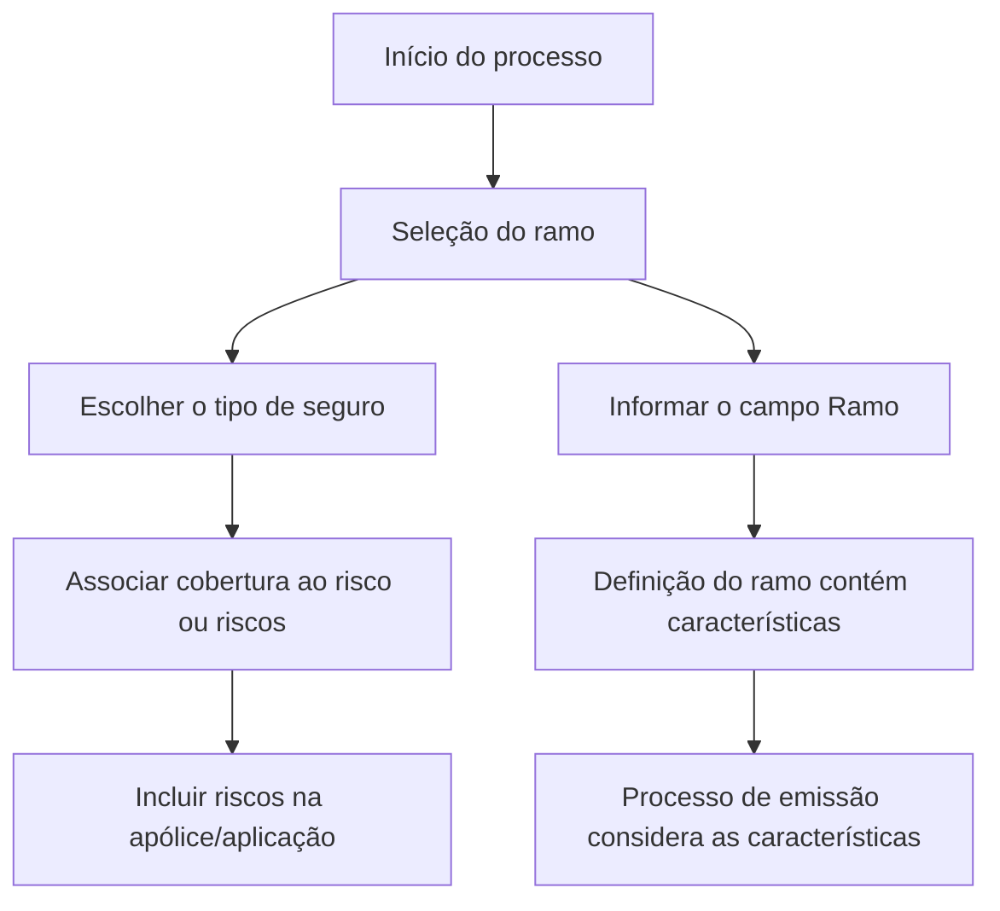

# Seleção do Ramo de Seguro — Informação Requerida no Processo de Emissão

## 1. Metadados do Documento
- **Arquivo de Origem:** Não identificado no conteúdo fornecido
- **Tipo de Documento:** Procedimento / orientação funcional
- **Domínio / Sistema:** Seleção de ramo para seguro; processo de emissão
- **Público-Alvo:** Não identificado no conteúdo fornecido
- **Data/Versão Identificada:** Não identificada

---

## 2. Resumo Executivo & Contexto de Negócio

O documento descreve a etapa de **seleção do ramo** no contexto de emissão de seguros. A seleção do ramo consiste em escolher o tipo de seguro que cobrirá um ou mais riscos incluídos em uma apólice ou aplicação.

A informação requerida apresentada no documento é o campo **Ramo**. Esse campo identifica o tipo de seguro que será realizado sobre o risco ou sobre os riscos tratados no processo.

Segundo o conteúdo extraído, a definição associada ao ramo contém todas as características que o processo de emissão considerará. Portanto, a escolha do ramo é uma informação determinante para o processamento da emissão.

O documento não detalha valores possíveis para ramo, validações, regras de elegibilidade, contratos de integração, métodos HTTP ou comportamento específico do sistema após a seleção.

---

## 3. Arquitetura, Componentes & Tecnologias Envolvidas

O conteúdo não descreve uma arquitetura técnica, microsserviços, banco de dados, APIs, ambientes, tecnologias ou integrações.

Os elementos funcionais e de navegação identificados são:

- **Seleção do ramo:** etapa para escolha do tipo de seguro.
- **Ramo:** informação que identifica o tipo de seguro aplicável ao risco ou riscos.
- **Processo de emissão:** processo que considera as características definidas pelo ramo.
- **Apólice/aplicação:** contexto no qual um ou mais riscos são incluídos.
- **Inicio, Soluciones, APIs, Documentación, Zeus, ES:** termos presentes no rodapé ou navegação do conteúdo extraído; o documento não explica suas funções.



> **Nota de Análise:** O diagrama representa exclusivamente a sequência funcional inferida das frases do documento. Não há detalhamento sobre sistemas, interfaces, APIs, persistência de dados ou responsáveis por cada etapa.

---

## 4. Regras de Negócio, Especificações Funcionais & Processos

### 4.1 Objetivo da seleção do ramo

A seleção do ramo consiste em escolher o tipo de seguro que cobrirá o risco ou os riscos incluídos em uma apólice ou aplicação.

### 4.2 Informação requerida

O documento informa que, no processo descrito, é requerida a informação denominada **Ramo**.

### 4.3 Significado funcional do campo Ramo

O campo **Ramo** identifica o tipo de seguro que será realizado sobre o risco ou sobre os riscos.

### 4.4 Relação entre ramo e emissão

A definição do ramo contém todas as características que o processo de emissão levará em consideração.

### 4.5 Fluxo funcional identificado

1. Um ou mais riscos são considerados para inclusão em uma apólice ou aplicação.
2. Deve ser escolhido o tipo de seguro que cobrirá os riscos.
3. A escolha é identificada pela informação denominada **Ramo**.
4. A definição do ramo contém características aplicáveis ao processo de emissão.
5. O processo de emissão considera todas as características contidas na definição do ramo.

> **Nota de Análise:** O documento não informa quais são as características do ramo, nem apresenta critérios de seleção, obrigatoriedade, campos complementares, mensagens de erro ou fluxos alternativos.

---

## 5. Tabelas de Parâmetros, Ambientes e Estruturas de Dados

| Item / Parâmetro | Descrição / Função | Tipo / Valores / Formato | Ambiente / Observações |
| :--- | :--- | :--- | :--- |
| Ramo | Identifica o tipo de seguro que será realizado sobre o risco ou riscos. | Não especificado. | A definição do ramo contém todas as características consideradas pelo processo de emissão. |
| Risco | Elemento ou elementos a serem cobertos pelo tipo de seguro selecionado. | Não especificado. | Pode haver um risco ou múltiplos riscos. |
| Apólice/aplicação | Contexto em que os riscos são incluídos. | Não especificado. | O documento utiliza a expressão “póliza/aplicación”. |
| Processo de emissão | Processo que considera as características contidas na definição do ramo. | Não especificado. | Não há detalhamento de etapas técnicas, entradas ou saídas. |
| Inicio | Termo presente no conteúdo bruto. | Não especificado. | Possível item de navegação; função não detalhada. |
| Soluciones | Termo presente no conteúdo bruto. | Não especificado. | Possível item de navegação; função não detalhada. |
| APIs | Termo presente no conteúdo bruto. | Não especificado. | O documento não descreve APIs, endpoints ou contratos. |
| Documentación | Termo presente no conteúdo bruto. | Não especificado. | Possível item de navegação; função não detalhada. |
| Zeus | Termo presente no conteúdo bruto. | Não especificado. | Não definido pelo documento. |
| ES | Termo presente no conteúdo bruto. | Não especificado. | Possível indicador de idioma; não confirmado pelo documento. |

---

## 6. Bateria de Perguntas & Respostas para RAG (FAQ Sintético)

### P1: Em que consiste a seleção do ramo no processo de seguros?
**R:** A seleção do ramo consiste em escolher o tipo de seguro que cobrirá o risco ou os riscos incluídos em uma apólice ou aplicação.

### P2: Qual informação é requerida no processo descrito pelo documento?
**R:** A informação requerida apresentada pelo documento é o **Ramo**.

### P3: O que o campo Ramo identifica?
**R:** O campo Ramo identifica o tipo de seguro que será realizado sobre o risco ou sobre os riscos.

### P4: Qual é a relação entre o ramo e o processo de emissão?
**R:** A definição do ramo contém todas as características que o processo de emissão terá em conta.

### P5: A seleção de ramo pode se aplicar a mais de um risco?
**R:** Sim. O documento menciona que o tipo de seguro pode cobrir “o risco ou riscos” incluídos na apólice ou aplicação.

### P6: O documento lista quais tipos de seguro podem ser selecionados no campo Ramo?
**R:** Não. O documento explica a finalidade do ramo, mas não fornece uma lista de tipos de seguro, valores permitidos ou catálogo de ramos.

### P7: Quais características do ramo são consideradas no processo de emissão?
**R:** O documento afirma que a definição do ramo contém todas as características consideradas pelo processo de emissão, mas não especifica quais são essas características.

### P8: O documento descreve validações para a seleção do ramo?
**R:** Não. Não há regras de validação, critérios de obrigatoriedade, mensagens de erro ou condições de rejeição descritas para o campo Ramo.

### P9: O documento descreve APIs relacionadas à seleção do ramo?
**R:** Não. Embora o termo “APIs” apareça no conteúdo bruto, não são descritos endpoints, métodos HTTP, payloads, autenticação ou contratos de integração.

### P10: O que ocorre após a escolha do ramo?
**R:** Com base no conteúdo fornecido, a definição do ramo fornece características que serão consideradas pelo processo de emissão. O documento não detalha etapas posteriores.

---

## 7. Glossário de Termos, Siglas & Conceitos-Chave

- **Ramo:** Informação que identifica o tipo de seguro a ser realizado sobre um risco ou riscos.
- **Seleção do ramo:** Ato de escolher o tipo de seguro que cobrirá o risco ou os riscos incluídos em uma apólice ou aplicação.
- **Risco:** Elemento ou elementos que serão cobertos pelo tipo de seguro escolhido.
- **Apólice:** Contexto citado no documento no qual riscos são incluídos.
- **Aplicação:** Termo citado juntamente com apólice como contexto de inclusão de riscos; não possui definição adicional no conteúdo.
- **Processo de emissão:** Processo que considera as características contidas na definição do ramo.
- **APIs:** Termo presente no conteúdo bruto, sem definição, interface ou contrato técnico descrito.
- **Zeus:** Termo presente no conteúdo bruto, sem definição fornecida.
- **ES:** Termo presente no conteúdo bruto, sem definição fornecida.

---

## 8. Notas Críticas, Riscos & Limitações

- O conteúdo extraído possui apenas uma página e apresenta uma descrição funcional resumida.
- Não foram identificados nome de arquivo, autor, versão, data, sistema responsável ou ambiente operacional.
- O documento não fornece catálogo de ramos, tipos de seguro ou valores válidos para o campo Ramo.
- O documento não detalha as características presentes na definição de ramo que afetam o processo de emissão.
- Não há descrição de regras de validação, obrigatoriedade, tratamento de exceções, permissões, auditoria ou mensagens de erro.
- Embora “APIs” apareça no conteúdo bruto, não há especificação de endpoints, métodos HTTP, parâmetros, autenticação ou contratos JSON.
- Não há arquitetura técnica, diagrama original, integração entre sistemas, infraestrutura, URLs, logs, servidores ou ambientes documentados.
- **Nota de Análise:** O documento lista “Zeus”, mas não detalha se Zeus é um sistema, módulo, produto, ambiente ou item de navegação.

---

## 9. Conteúdo Bruto Estruturado (Referência Fiel)

```text
--- [PÁGINA 1 DE 1] ---

SELECCIÓN DEL RAMO
¿En que consiste?
Elegir el tipo de seguro que va a cubrir al riesgo o riesgos que se incluyan en la póliza/aplicación.
Proceso a seguir
A continuación detalla la información requerida.
Ramo
Identifica el tipo de seguro que se va a realizar sobre el riesgo (o riesgos). La definición contiene
todas las características que el proceso de emisión tendrá en cuenta.
 / 
 RS
Inicio Soluciones APIs Documentación Zeus
ES
```
