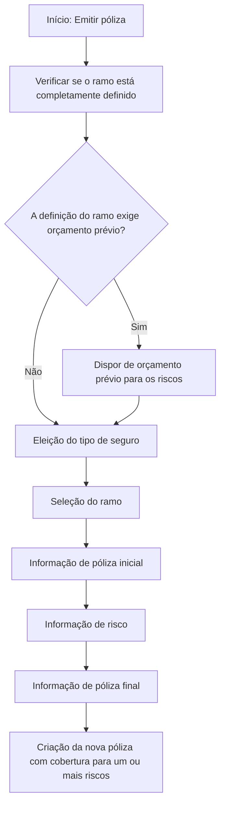

# Emissão de Póliza — Fluxo Funcional de Construção

## 1. Metadados do Documento
- **Arquivo de Origem:** Não identificado no conteúdo fornecido
- **Tipo de Documento:** Procedimento / Especificação Funcional
- **Domínio / Sistema:** Emissão de póliza de seguros
- **Público-Alvo:** Negócio, operação e desenvolvimento
- **Data/Versão Identificada:** Não identificada

---

## 2. Resumo Executivo & Contexto de Negócio

O documento descreve a operação de **emitir uma póliza**, definida como o processo de criação de uma nova póliza destinada a fornecer cobertura para um ou mais riscos. O conteúdo apresenta uma visão funcional do processo e da sequência de blocos de informação a serem preenchidos.

A execução da emissão depende de uma premissa essencial: o **ramo** deve estar completamente definido. Conforme a definição desse ramo, a emissão também pode exigir a existência prévia de um orçamento para os riscos que se pretende cobrir.

O fluxo é organizado em três macroetapas: escolha do tipo de seguro, preenchimento de informações iniciais da póliza e do risco, e preenchimento das informações finais da póliza. A ordem e a presença dos blocos dependem da definição do ramo.

O documento lista os blocos funcionais envolvidos, mas não detalha campos obrigatórios, regras de validação, integrações, métodos HTTP, contratos de dados, responsáveis ou critérios de aprovação para cada bloco.

---

## 3. Arquitetura, Componentes & Tecnologias Envolvidas

O conteúdo fornecido não descreve arquitetura de software, microsserviços, tecnologias, integrações técnicas, ambientes ou ferramentas. A estrutura identificada é exclusivamente um fluxo funcional de emissão de póliza.



### Componentes funcionais identificados

| Componente / Bloco | Descrição sustentada pelo documento |
| :--- | :--- |
| Emitir póliza | Operação que permite criar uma nova póliza para cobertura de um ou mais riscos. |
| Ramo | Elemento que deve estar completamente definido para permitir a operação. |
| Orçamento | Pode ser necessário previamente, conforme a definição do ramo e dos riscos a cobrir. |
| Eleição do tipo de seguro | Primeiro bloco apresentado no processo. |
| Informação de póliza inicial | Bloco de informações iniciais relacionadas à póliza. |
| Informação de risco | Bloco de informações relacionadas ao risco. |
| Informação de póliza final | Bloco final de informações relacionadas à póliza. |

> **Nota de Análise:** O documento não fornece detalhamento técnico sobre sistemas, APIs, tecnologias, bancos de dados, URLs, servidores, autenticação ou mecanismos de integração.

---

## 4. Regras de Negócio, Especificações Funcionais & Processos

### Objetivo da operação

A operação **Emitir póliza** permite criar uma nova póliza que dará cobertura a um ou vários riscos.

### Premissas

1. O ramo deve estar completamente definido antes da realização da operação de emissão.
2. Dependendo da definição do ramo, pode ser necessário possuir previamente um orçamento realizado para o risco ou riscos que serão cobertos.

### Processo funcional

1. Realizar a eleição do tipo de seguro.
2. Selecionar o ramo.
3. Preencher os blocos de informação inicial da póliza.
4. Preencher os blocos de informação do risco.
5. Preencher os blocos de informação final da póliza.
6. A ordem de apresentação dos blocos depende da definição do ramo.

### Blocos de informação de póliza inicial

- Informação básica da póliza.
- Informação geral da póliza.
- Coaseguro.
- Tomador.
- Agentes.
- Intervenções de cliente.
- Atributos.

### Blocos de informação de risco

- Intervenções de cliente.
- Atributos.
- Intervenções de cliente.
- Acessórios.
- Coberturas.
- Textos anexos.

### Blocos de informação de póliza final

- Plano de pagamento.
- Gestor de cobrança.
- Cláusulas.
- Textos anexos.
- Observações.

> **Nota de Análise:** O documento repete “Intervenções de cliente” na seção de informação de risco. O conteúdo não explica se são blocos distintos, uma repetição editorial ou etapas diferentes.

---

## 5. Tabelas de Parâmetros, Ambientes e Estruturas de Dados

| Item / Parâmetro | Descrição / Função | Tipo / Valores / Formato | Ambiente / Observações |
| :--- | :--- | :--- | :--- |
| Póliza | Nova póliza criada pela operação de emissão. | Não especificado. | Destinada à cobertura de um ou mais riscos. |
| Risco | Elemento ou elementos cobertos pela nova póliza. | Um ou vários riscos. | Pode exigir orçamento prévio conforme o ramo. |
| Ramo | Deve estar completamente definido para permitir a emissão. | Não especificado. | Sua definição influencia os blocos apresentados e a necessidade de orçamento. |
| Orçamento | Orçamento realizado previamente sobre o risco ou riscos. | Não especificado. | Pode ser necessário dependendo da definição do ramo. |
| Tipo de seguro | Bloco inicial do processo de emissão. | Não especificado. | Associado à etapa de eleição do tipo de seguro. |
| Informação básica da póliza | Bloco de informação inicial da póliza. | Não especificado. | O documento não detalha campos. |
| Informação geral da póliza | Bloco de informação inicial da póliza. | Não especificado. | O documento não detalha campos. |
| Coaseguro | Bloco de informação inicial da póliza. | Não especificado. | O documento não detalha regras. |
| Tomador | Bloco de informação inicial da póliza. | Não especificado. | O documento não detalha regras. |
| Agentes | Bloco de informação inicial da póliza. | Não especificado. | O documento não detalha regras. |
| Intervenções de cliente | Bloco listado nas informações iniciais e de risco. | Não especificado. | Aparece repetidamente na seção de risco. |
| Atributos | Bloco listado nas informações iniciais e de risco. | Não especificado. | O documento não detalha atributos ou valores. |
| Acessórios | Bloco de informação de risco. | Não especificado. | O documento não detalha campos. |
| Coberturas | Bloco de informação de risco. | Não especificado. | Relacionado ao objetivo de cobrir um ou mais riscos. |
| Textos anexos | Bloco listado nas informações de risco e finais da póliza. | Não especificado. | O documento não informa formato ou finalidade. |
| Plano de pagamento | Bloco de informação final da póliza. | Não especificado. | O documento não informa condições de pagamento. |
| Gestor de cobrança | Bloco de informação final da póliza. | Não especificado. | O documento não define responsabilidades. |
| Cláusulas | Bloco de informação final da póliza. | Não especificado. | O documento não fornece conteúdo ou regras. |
| Observações | Bloco de informação final da póliza. | Não especificado. | O documento não define formato. |

---

## 6. Bateria de Perguntas & Respostas para RAG (FAQ Sintético)

### P1: Em que consiste a operação de emitir uma póliza?
**R:** A operação de emitir uma póliza permite criar uma nova póliza que dará cobertura a um ou mais riscos.

### P2: Qual é a premissa principal para emitir uma póliza?
**R:** Para realizar a operação de emissão, o ramo deve estar completamente definido.

### P3: Quando é necessário possuir um orçamento prévio para emitir uma póliza?
**R:** Dependendo da definição do ramo, pode ser necessário dispor de um orçamento previamente realizado para o risco ou riscos que se pretende cobrir.

### P4: Qual é a primeira etapa apresentada no processo de emissão de póliza?
**R:** A primeira etapa é a eleição do tipo de seguro, incluindo a seleção do ramo.

### P5: Quais blocos fazem parte da informação inicial da póliza?
**R:** A informação inicial da póliza inclui informação básica da póliza, informação geral da póliza, coaseguro, tomador, agentes, intervenções de cliente e atributos.

### P6: Quais informações são tratadas no bloco de informação de risco?
**R:** O bloco de informação de risco lista intervenções de cliente, atributos, intervenções de cliente novamente, acessórios, coberturas e textos anexos.

### P7: Quais blocos são tratados ao final da emissão da póliza?
**R:** A informação final da póliza abrange plano de pagamento, gestor de cobrança, cláusulas, textos anexos e observações.

### P8: A ordem dos blocos do processo de emissão é sempre fixa?
**R:** Não. O documento informa que os blocos de informação e a ordem em que aparecem dependem da definição do ramo.

### P9: O documento especifica os campos que devem ser preenchidos em cada bloco?
**R:** Não. O documento apenas enumera os blocos de informação; não detalha campos, formatos, obrigatoriedade, regras de validação ou valores permitidos.

### P10: O documento descreve integrações técnicas ou APIs para emissão de póliza?
**R:** Não. O conteúdo fornecido não descreve APIs, métodos HTTP, contratos JSON, microsserviços, integrações, bancos de dados ou URLs de ambiente.

---

## 7. Glossário de Termos, Siglas & Conceitos-Chave

- **Póliza:** Documento ou entidade criada pela operação de emissão para fornecer cobertura a um ou mais riscos.
- **Emissão de póliza:** Operação de criação de uma nova póliza.
- **Risco:** Elemento ou elementos para os quais a póliza fornecerá cobertura.
- **Ramo:** Elemento que deve estar completamente definido para permitir a emissão e que influencia o fluxo de informações apresentado.
- **Orçamento:** Registro realizado previamente sobre o risco ou riscos a cobrir, quando exigido pela definição do ramo.
- **Coaseguro:** Bloco de informação inicial da póliza, sem detalhamento adicional no documento.
- **Tomador:** Bloco de informação inicial da póliza, sem detalhamento adicional no documento.
- **Gestor de cobrança:** Bloco de informação final da póliza, sem definição de responsabilidades no documento.
- **Coberturas:** Bloco de informação de risco relacionado ao propósito de cobertura da póliza.

---

## 8. Notas Críticas, Riscos & Limitações

- O documento não identifica nome de arquivo, data, versão, autor, sistema de origem ou responsável pelo processo.
- Não há detalhamento de campos, formatos, obrigatoriedade, validações ou mensagens de erro para os blocos de informação.
- Não são descritas integrações técnicas, APIs, interfaces, tecnologias, ambientes, logs ou mecanismos de autenticação.
- O conceito de “ramo completamente definido” é fundamental, mas seus critérios de completude não são especificados.
- A necessidade de orçamento prévio é condicional à definição do ramo, porém o documento não informa quais ramos exigem orçamento.
- “Intervenções de cliente” aparece repetidamente na informação de risco sem explicação sobre a distinção entre as ocorrências.
- Não há critérios explícitos para concluir, aprovar, rejeitar, cancelar ou reprocessar uma emissão de póliza.

---

## 9. Conteúdo Bruto Estruturado (Referência Fiel)

```text
--- [PÁGINA 1 DE 2] ---

EN CONSTRUCCIÓN
EMITIR póliza
¿En que consiste?
Esta operación permite crear una nueva póliza con la que se dará cobertura a uno o varios riesgos.
Premisas
Para poder realizar esta operación es necesario que el ramo se encuentre completamente definido.
Dependiendo de la definición, es posible que sea necesario disponer de un presupuesto realizado
previamente sobre el riesgo o riesgos que se pretende cubrir.
Proceso a seguir
En este apartado se enumeran los bloques de información y el orden en el que aparecerán (siempre
dependiendo de la definición del ramo).
ELECCIÓN DEL TIPO DE SEGURO
 Selección del ramo
INFORMACIÓN DE PÓLIZA (INICIAL)
 Información básica de la póliza ( )
 Información general de la póliza ( )
 / 
 RS
Inicio Soluciones APIs Documentación Zeus
ES


--- [PÁGINA 2 DE 2] ---

Coaseguro ( )
 Tomador ( )
 Agentes ( )
 Intervenciones de cliente ( )
 Atributos ( )
INFORMACIÓN DE RIESGO
 Intervenciones de cliente ( )
 Atributos ( )
 Intervenciones de cliente ( )
 Accesorios ( )
 Coberturas ( )
 Textos anexos ( )
INFORMACIÓN DE PÓLIZA (FINAL)
 Plan de pago ( )
 Gestor de cobro ( )
 Cláusulas ( )
 Textos anexos ( )
 Observaciones ( )
```
