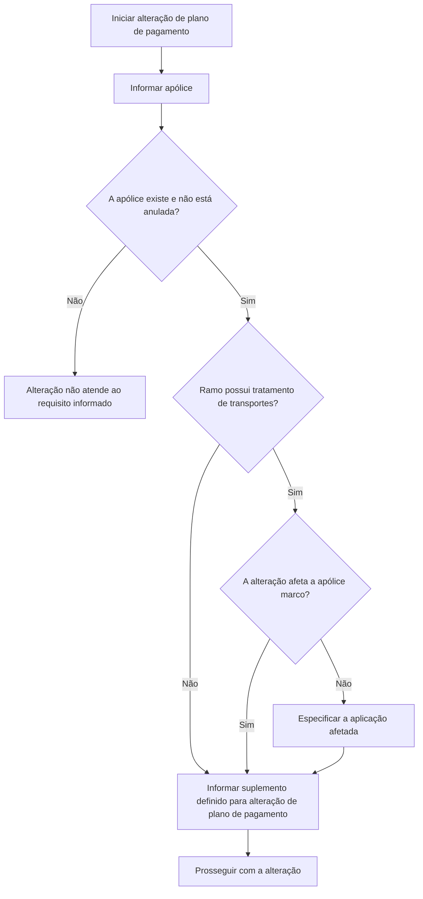

# Alteração de Plano de Pagamento — Informações Prévias e Requisitos

## 1. Metadados do Documento
- **Arquivo de Origem:** `Não identificado — texto bruto fornecido no prompt`
- **Tipo de Documento:** Procedimento
- **Domínio / Sistema:** Alteração de plano de pagamento de apólice/aplicação
- **Público-Alvo:** Operação, Negócio e usuários responsáveis por alterações de apólices
- **Data/Versão Identificada:** Não identificada

---

## 2. Resumo Executivo & Contexto de Negócio

O conteúdo descreve as informações prévias necessárias para realizar uma alteração de plano de pagamento. O processo começa pela identificação da apólice e, quando aplicável, da aplicação que será impactada.

A alteração pretendida é caracterizada como um suplemento. O documento exige que o suplemento informado seja aquele previamente definido para alteração de plano de pagamento.

A apólice informada deve existir e não pode estar anulada. Para ramos configurados com tratamento de transportes, existe uma condição adicional: caso a alteração de plano de pagamento não afete a apólice marco, é obrigatório identificar a aplicação afetada.

O texto não informa métodos HTTP, contratos JSON, telas, validações sistêmicas adicionais, regras de cálculo, identificadores de ambiente ou detalhes técnicos de integração.

---

## 3. Arquitetura, Componentes & Tecnologias Envolvidas

Os elementos funcionais identificados são:

| Componente / Conceito | Função identificada |
| :--- | :--- |
| Apólice | Registro que deve ser identificado para alteração do plano de pagamento. |
| Aplicação | Registro que deve ser informado em uma condição específica de ramos com tratamento de transportes. |
| Apólice marco | Referência usada para determinar se a aplicação precisa ser especificada. |
| Suplemento | Modificação pretendida; deve corresponder ao suplemento definido para alteração de plano de pagamento. |
| Plano de pagamento | Elemento da apólice ou aplicação que será alterado. |
| Ramo com tratamento de transportes | Condição de negócio que exige a identificação da aplicação quando a alteração não afeta a apólice marco. |



> **Nota de Análise:** O documento menciona “Soluciones APIs”, “Documentación Zeus” e “RS” no trecho extraído, mas não explica suas funções, relações técnicas ou significado.

---

## 4. Regras de Negócio, Especificações Funcionais & Processos

1. A alteração de plano de pagamento exige a identificação da apólice e/ou da aplicação afetada.
2. A apólice informada deve corresponder a um número de apólice existente.
3. A apólice informada não pode estar anulada.
4. A modificação pretendida deve ser determinada como um suplemento.
5. O suplemento informado deve ser aquele definido para alteração de plano de pagamento.
6. Quando o ramo estiver declarado com tratamento de transportes, deve-se avaliar se a alteração de plano de pagamento afeta a apólice marco.
7. Quando o ramo possuir tratamento de transportes e a alteração não afetar a apólice marco, a aplicação afetada deve ser especificada.
8. O documento não detalha o comportamento aplicável quando uma apólice não existe, está anulada ou quando o suplemento informado não corresponde ao suplemento de alteração de plano de pagamento.

---

## 5. Tabelas de Parâmetros, Ambientes e Estruturas de Dados

| Item / Parâmetro | Descrição / Função | Tipo / Valores / Formato | Ambiente / Observações |
| :--- | :--- | :--- | :--- |
| Apólice | Identifica a apólice cujo plano de pagamento será alterado. | Número de apólice existente. | Não pode estar anulada. |
| Aplicação | Identifica a aplicação afetada pela alteração. | Não detalhado. | Obrigatória quando o ramo possui tratamento de transportes e a alteração não afeta a apólice marco. |
| Suplemento | Identifica a modificação a ser realizada. | Suplemento definido para alteração de plano de pagamento. | O documento não informa códigos ou catálogo de suplementos. |
| Plano de pagamento | Objeto funcional da alteração. | Não detalhado. | Não há regras de cálculo ou valores descritos. |
| Tratamento de transportes | Condição de classificação do ramo. | Declarado ou não declarado. | Aciona a avaliação sobre apólice marco e aplicação. |
| Apólice marco | Referência para decidir se a aplicação deve ser informada. | Não detalhado. | Aplicável ao tratamento de transportes. |
| RS | Termo presente no texto bruto. | Não detalhado. | Significado não identificado. |
| Soluciones APIs | Termo presente no texto bruto. | Não detalhado. | Não há descrição técnica disponível. |
| Documentación Zeus | Termo presente no texto bruto. | Não detalhado. | Não há descrição técnica disponível. |

---

## 6. Bateria de Perguntas & Respostas para RAG (FAQ Sintético)

### P1: Qual é o objetivo da seção de informações prévias para alteração de plano de pagamento?
**R:** A seção identifica a apólice e/ou a aplicação cujo plano de pagamento será alterado e determina a modificação, caracterizada como um suplemento.

### P2: A apólice informada para alteração de plano de pagamento precisa existir?
**R:** Sim. O número informado deve corresponder a uma apólice existente.

### P3: É permitido alterar o plano de pagamento de uma apólice anulada?
**R:** Não. A apólice utilizada no processo não pode estar anulada.

### P4: O que deve ser informado como suplemento?
**R:** Deve ser informado o suplemento que tenha sido definido como suplemento de alteração de plano de pagamento.

### P5: Quando a aplicação afetada deve ser especificada?
**R:** A aplicação deve ser especificada quando o ramo estiver declarado com tratamento de transportes e a alteração de plano de pagamento não afetar a apólice marco.

### P6: A aplicação sempre é obrigatória na alteração de plano de pagamento?
**R:** O documento não estabelece que a aplicação seja sempre obrigatória. A obrigatoriedade explicitamente descrita ocorre para ramos com tratamento de transportes quando a alteração não afeta a apólice marco.

### P7: O que deve ser avaliado em ramos com tratamento de transportes?
**R:** Deve-se verificar se a alteração de plano de pagamento afeta a apólice marco. Caso não afete, a aplicação impactada precisa ser informada.

### P8: O documento descreve códigos, formatos ou valores possíveis para o suplemento?
**R:** Não. O documento apenas informa que o suplemento deve ser aquele definido para alteração de plano de pagamento, sem fornecer códigos, formatos ou lista de valores.

### P9: O documento detalha APIs, métodos HTTP ou contratos de integração?
**R:** Não. Embora apareçam os termos “Soluciones APIs” e “Documentación Zeus”, o conteúdo não descreve endpoints, métodos HTTP, payloads, contratos JSON ou integrações.

### P10: O que ocorre se a apólice não existir ou estiver anulada?
**R:** O texto estabelece que a apólice deve existir e não estar anulada, mas não detalha mensagens de erro, etapas de rejeição ou tratamento operacional para essas situações.

---

## 7. Glossário de Termos, Siglas & Conceitos-Chave

- **Apólice:** Registro que deve existir e não estar anulado para permitir a alteração de plano de pagamento.
- **Aplicação:** Entidade que deve ser especificada em determinadas alterações de plano de pagamento para ramos com tratamento de transportes.
- **Apólice marco:** Referência utilizada no contexto de ramos com tratamento de transportes.
- **Plano de pagamento:** Elemento sujeito à alteração descrita no procedimento.
- **Ramo:** Classificação de negócio associada à apólice; o documento menciona a condição de ramo com tratamento de transportes.
- **Suplemento:** Modificação definida para efetivar a alteração de plano de pagamento.
- **RS:** Sigla presente no conteúdo bruto sem definição explícita.
- **Soluciones APIs:** Expressão presente no conteúdo bruto sem detalhamento técnico.
- **Documentación Zeus:** Expressão presente no conteúdo bruto sem detalhamento funcional ou técnico.

---

## 8. Notas Críticas, Riscos & Limitações

- O texto fornecido é parcial e possui apenas duas páginas identificadas.
- Não há detalhamento de tela, API, integração, ambiente, autenticação, URLs, logs ou mecanismos de auditoria.
- Não são apresentados códigos de suplemento, formatos de número de apólice, critérios para identificar ramos de transportes ou definição de apólice marco.
- O procedimento estabelece pré-condições para a apólice, mas não informa o tratamento de falhas ou mensagens de validação.
- **Nota de Análise:** O documento lista “Soluciones APIs”, “Documentación Zeus” e “RS”, porém não fornece informações suficientes para definir esses termos com precisão.

---

## 9. Conteúdo Bruto Estruturado (Referência Fiel)

```text
--- [PÁGINA 1 DE 2] ---

ALTERAR plan pago - Información previa
¿En que consiste?
En este apartado se identifica la póliza y/o aplicación a la que se le va a cambiar el plan de pago.
Además, se determina la modificación (suplemento) que se pretende realizar.
Proceso a seguir
A continuación detallan la información requerida.
Póliza
Debe coincidir con un número de póliza que exista y que no se encuentre anulada.
Aplicación
Si el ramo está declarado con el tratamiento de transportes, y el cambio de plan de pago NO afecta a
la póliza marco, se debe especificar a que aplicación afecta el cambio.
Suplemento
 /
 RS
Inicio Soluciones APIs Documentación Zeus
ES


--- [PÁGINA 2 DE 2] ---

Se debe especificar el suplemento que se haya definido como de cambio de plan de pago.
```
