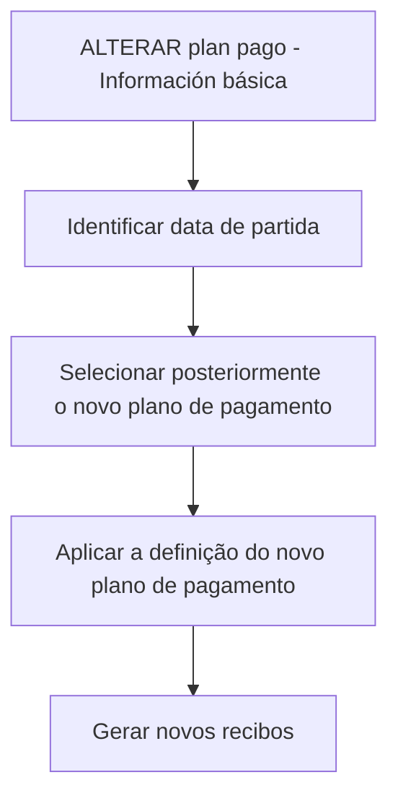

# Alterar Plano Pago — Informação Básica e Geração de Recibos

## 1. Metadados do Documento
- **Arquivo de Origem:** `Não identificado no conteúdo fornecido`
- **Tipo de Documento:** `Procedimento`
- **Domínio / Sistema:** `Alteração de plano de pagamento; geração de recibos`
- **Público-Alvo:** `Negócio, operação e utilizadores responsáveis pela alteração de planos de pagamento`
- **Data/Versão Identificada:** `Não identificada`

---

## 2. Resumo Executivo & Contexto de Negócio

O documento descreve a secção **“ALTERAR plan pago - Información básica”**, dedicada à identificação da data de partida utilizada na geração de recibos associados a um novo plano de pagamento.

A data informada nessa secção serve como base para gerar os novos recibos. A geração deve respeitar a definição do plano de pagamento selecionado posteriormente pelo utilizador ou pelo processo aplicável.

O conteúdo indica que o processo sempre considera a definição do novo plano de pagamento. Portanto, a data de partida não é apresentada como um parâmetro isolado: a sua aplicação está vinculada ao plano de pagamento escolhido posteriormente.

O documento menciona a existência de informação requerida para o processo, mas o conteúdo extraído não apresenta os campos, regras de validação, formatos de data, critérios de seleção do plano, contratos de API ou detalhes operacionais adicionais.

---

## 3. Arquitetura, Componentes & Tecnologias Envolvidas

O conteúdo fornecido não descreve uma arquitetura técnica detalhada, microsserviços, bases de dados, contratos de integração, tecnologias ou ambientes.

Os elementos explicitamente citados são:

- Secção funcional: **ALTERAR plan pago - Información básica**.
- Processo funcional: alteração de plano de pagamento.
- Dado de entrada ou referência: data de partida.
- Resultado do processo: geração de novos recibos.
- Regra de dependência: geração atendendo à definição do plano de pagamento escolhido posteriormente.
- Navegação ou referências visíveis no conteúdo: **Inicio**, **Soluciones**, **APIs**, **Documentación**, **Zeus**, **ES**.



> **Nota de Análise:** O documento não detalha quais sistemas executam a geração de recibos, nem informa APIs, métodos HTTP, tecnologias, persistência de dados, integrações ou responsabilidades entre componentes.

---

## 4. Regras de Negócio, Especificações Funcionais & Processos

### Regras identificadas

1. A secção de informação básica identifica uma data que será usada como data de partida para a geração dos recibos do novo plano de pagamento.
2. A data identificada deve ser tomada como base para a geração dos novos recibos.
3. A geração dos recibos deve atender à definição do plano de pagamento escolhido posteriormente.
4. O processo deve sempre atender à definição do novo plano de pagamento.
5. O documento indica que existe informação requerida para o processo, mas não enumera essa informação no conteúdo extraído.

### Fluxo funcional identificado

1. Aceder à secção **ALTERAR plan pago - Información básica**.
2. Identificar a data que será utilizada como ponto de partida.
3. Escolher posteriormente a definição do novo plano de pagamento.
4. Gerar os novos recibos utilizando a data identificada como base.
5. Aplicar a definição do plano de pagamento escolhido à geração dos novos recibos.

> **Nota de Análise:** O documento não informa se a data pode ser anterior, posterior ou igual à data atual; não define obrigatoriedade, formato, fuso horário, calendário, tratamento de feriados, regras de recálculo ou comportamento para recibos já existentes.

---

## 5. Tabelas de Parâmetros, Ambientes e Estruturas de Dados

| Item / Parâmetro | Descrição / Função | Tipo / Valores / Formato | Ambiente / Observações |
| :--- | :--- | :--- | :--- |
| Data de partida | Data tomada como base para a geração dos novos recibos. | Data; formato não especificado. | Deve ser utilizada segundo a definição do plano de pagamento escolhido posteriormente. |
| Novo plano de pagamento | Definição de plano que orienta o processo de geração dos recibos. | Não especificado. | O processo sempre deve atender à definição do novo plano de pagamento. |
| Novos recibos | Resultado gerado com base na data de partida e na definição do plano de pagamento. | Não especificado. | O documento não detalha estrutura, quantidade, estados ou persistência dos recibos. |
| Informação requerida | Informação mencionada como necessária para o processo. | Não especificado. | A lista de campos requeridos não consta no conteúdo fornecido. |
| Inicio | Elemento textual de navegação visível na extração. | Não especificado. | Sem detalhamento adicional. |
| Soluciones | Elemento textual de navegação visível na extração. | Não especificado. | Sem detalhamento adicional. |
| APIs | Elemento textual de navegação visível na extração. | Não especificado. | O documento não apresenta endpoints, métodos ou contratos de API. |
| Documentación | Elemento textual de navegação visível na extração. | Não especificado. | Sem detalhamento adicional. |
| Zeus | Termo exibido na extração. | Não especificado. | O papel de Zeus não é definido no conteúdo. |
| ES | Indicador textual exibido na extração. | Não especificado. | Possivelmente relacionado ao idioma, mas essa interpretação não é confirmada pelo documento. |

---

## 6. Bateria de Perguntas & Respostas para RAG (FAQ Sintético)

### P1: Qual é a finalidade da secção “ALTERAR plan pago - Información básica”?
**R:** A secção identifica a data que será utilizada como ponto de partida para gerar os recibos associados ao novo plano de pagamento.

### P2: Qual data é utilizada para gerar os novos recibos?
**R:** É utilizada a data identificada na secção de informação básica. O documento afirma que essa data será tomada como base para a geração dos novos recibos.

### P3: A geração de recibos considera apenas a data de partida?
**R:** Não. Além da data de partida, a geração deve atender à definição do novo plano de pagamento escolhido posteriormente.

### P4: Qual plano de pagamento orienta a geração dos novos recibos?
**R:** A geração dos novos recibos deve respeitar a definição do novo plano de pagamento escolhido posteriormente.

### P5: O processo pode ignorar a definição do novo plano de pagamento?
**R:** Não. O documento afirma que o processo sempre atenderá à definição do novo plano de pagamento.

### P6: Quais informações são requeridas para alterar o plano de pagamento?
**R:** O documento informa que existe informação requerida para o processo, mas o conteúdo fornecido não enumera os campos, parâmetros ou documentos necessários.

### P7: O documento especifica o formato da data de partida?
**R:** Não. O documento apenas informa que existe uma data de partida usada como base para gerar os novos recibos; o formato da data não é detalhado.

### P8: O documento descreve APIs para alteração do plano de pagamento?
**R:** Não. Embora o termo “APIs” apareça na extração, não há endpoints, métodos HTTP, contratos JSON, autenticação ou regras de integração descritos.

### P9: O documento explica como os recibos existentes são tratados após a alteração do plano?
**R:** Não. O conteúdo menciona a geração de novos recibos, mas não detalha cancelamento, atualização, substituição ou manutenção de recibos anteriores.

### P10: O que acontece depois de escolher um novo plano de pagamento?
**R:** A data previamente identificada é utilizada como base para gerar novos recibos de acordo com a definição do plano de pagamento escolhido posteriormente.

---

## 7. Glossário de Termos, Siglas & Conceitos-Chave

- **ALTERAR plan pago:** Secção ou funcionalidade mencionada para alteração de plano de pagamento.
- **Data de partida:** Data utilizada como referência inicial para a geração dos novos recibos.
- **Novo plano de pagamento:** Plano cuja definição deve orientar o processo de geração dos recibos.
- **Recibos:** Registos ou documentos gerados com base na data de partida e na definição do novo plano de pagamento.
- **APIs:** Termo exibido na navegação do conteúdo; o documento não define APIs específicas.
- **Zeus:** Termo exibido no conteúdo; o documento não descreve o seu significado ou função.
- **ES:** Termo exibido no conteúdo; sem definição explícita.

---

## 8. Notas Críticas, Riscos & Limitações

- O documento não identifica o arquivo de origem, autor, data, versão ou responsável pelo processo.
- Não há detalhamento dos campos requeridos para a alteração do plano de pagamento.
- Não são especificados formato, validações ou regras de consistência para a data de partida.
- Não há definição de comportamento para recibos existentes, recibos vencidos, duplicidades ou falhas de geração.
- Não são descritas APIs, integrações, componentes técnicos, ambientes, permissões ou mecanismos de auditoria.
- O termo **Zeus** é citado sem contexto funcional ou técnico.
- **Nota de Análise:** O documento apresenta uma regra funcional de alto nível, mas não contém detalhamento suficiente para implementar ou operar tecnicamente o processo sem fontes complementares.

---

## 9. Conteúdo Bruto Estruturado (Referência Fiel)

```text
--- [PÁGINA 1 DE 2] ---

ALTERAR plan pago - Información básica
¿En que consiste?
En este apartado se identifica la fecha que será la de partida para la generación de los recibos del
nuevo plan de pago. Siempre el proceso atenderá la definición del nuevo plan de pago.
Proceso a seguir
A continuación detalla la información requerida.
Efecto
 / 
 RS
Inicio Soluciones APIs Documentación Zeus
ES


--- [PÁGINA 2 DE 2] ---

Esta fecha se tomará como base para la generación de los nuevos recibos atendiendo a la definición
del plan de pago elegido posteriormente.
```
