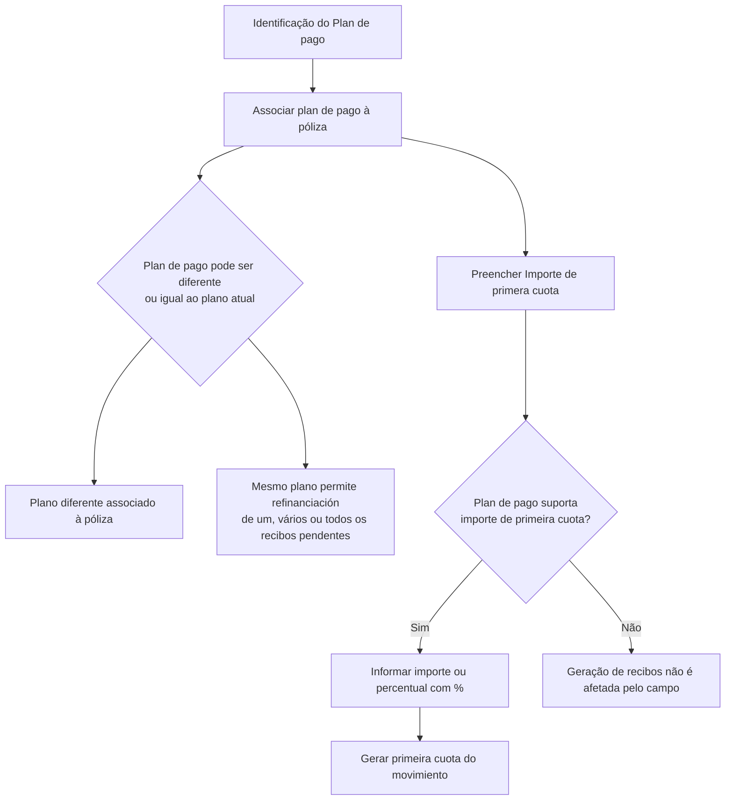

# Plan de Pago — Identificação e Geração da Primeira Cuota

## 1. Metadados do Documento
- **Arquivo de Origem:** Não identificado
- **Tipo de Documento:** Especificação Funcional
- **Domínio / Sistema:** Plan de Pago / Póliza
- **Público-Alvo:** Analistas funcionais, desenvolvedores e operação
- **Data/Versão Identificada:** Não identificada

---

## 2. Resumo Executivo & Contexto de Negócio

O conteúdo descreve a identificação do **plan de pago** que será associado a uma **póliza**. O processo permite selecionar um plano diferente daquele já existente ou manter o plano atualmente associado à apólice.

A manutenção do mesmo plano de pagamento permite realizar uma **refinanciación** de um, vários ou todos os recibos pendentes de cobrança. O documento não detalha critérios adicionais para a refinanciação, contratos de integração, telas ou regras de autorização.

O campo **Importe de primera cuota** possui comportamento condicionado à capacidade do plano de pagamento. Quando suportado, permite informar um valor absoluto ou um percentual, identificado pelo caractere `%`, para definir a primeira parcela do movimento.

Quando o plano de pagamento não suporta essa funcionalidade, o conteúdo do campo **Importe de primera cuota** não altera a geração de recibos.

---

## 3. Arquitetura, Componentes & Tecnologias Envolvidas

O documento menciona os elementos funcionais **Plan de pago**, **Póliza**, **Movimiento**, **Primera cuota** e **Recibos pendientes de cobro**. Não há tecnologias, microsserviços, URLs técnicas, bancos de dados, ambientes, métodos HTTP ou contratos JSON detalhados.



> **Nota de Análise:** O documento não descreve a arquitetura técnica, os componentes de software responsáveis pela associação do plano à póliza ou pela geração de recibos.

---

## 4. Regras de Negócio, Especificações Funcionais & Processos

1. O processo identifica o **plan de pago** que será utilizado.
2. A ação indicada no conteúdo é **MODIFICAR**.
3. Deve ser especificado o plano de pagamento que será associado à póliza.
4. O plano de pagamento selecionado pode:
   - Ser diferente do plano de pagamento já associado à póliza.
   - Ser o mesmo plano de pagamento já associado à póliza.
5. A manutenção do plano de pagamento permite a refinanciação de:
   - Um recibo pendente de cobrança.
   - Vários recibos pendentes de cobrança.
   - A totalidade dos recibos pendentes de cobrança.
6. O uso do campo **Importe de primera cuota** depende exclusivamente de o plano de pagamento permitir essa possibilidade.
7. Quando o plano permite essa funcionalidade:
   - Um importe pode ser informado para a primeira cuota do movimento.
   - Um percentual pode ser informado para a primeira cuota do movimento.
   - O percentual deve conter o sinal `%`.
   - A primeira cuota será gerada pelo importe informado ou pelo importe correspondente ao percentual informado.
8. Quando o plano de pagamento não suporta a funcionalidade de **Importe de primera cuota**, a geração de recibos não é afetada pelo conteúdo desse campo.

---

## 5. Tabelas de Parâmetros, Ambientes e Estruturas de Dados

| Item / Parâmetro | Descrição / Função | Tipo / Valores / Formato | Ambiente / Observações |
| :--- | :--- | :--- | :--- |
| Plan de pago | Plano de pagamento a ser associado à póliza. | Não detalhado. | Pode ser distinto ou igual ao plano já disponível na póliza. |
| Póliza | Entidade à qual o plan de pago será associado. | Não detalhado. | O documento não especifica estrutura, identificador ou ciclo de vida. |
| MODIFICAR | Ação indicada para o processo de plan de pago. | Ação funcional. | O comportamento detalhado da ação não é informado. |
| Refinanciación | Possibilidade associada à manutenção do mesmo plan de pago. | Um, vários ou todos os recibos pendentes de cobro. | Não há detalhamento de cálculos, aprovações ou efeitos financeiros. |
| Importe de primera cuota | Campo que pode definir o importe da primeira parcela do movimento. | Importe absoluto ou percentual. | O uso depende exclusivamente do suporte oferecido pelo plan de pago. |
| Percentual da primeira cuota | Forma percentual de definir o importe da primeira cuota. | Deve conter o sinal `%`. | Gera o importe correspondente ao percentual informado, quando suportado. |
| Movimiento | Movimento cuja primeira cuota pode ser gerada a partir do campo informado. | Não detalhado. | O documento não define tipos de movimento. |
| Recibos | Recibos gerados ou pendentes de cobrança. | Não detalhado. | A geração não é afetada pelo campo quando o plano não suporta a funcionalidade. |
| Ambiente | Dados de ambiente, servidor ou URL. | Não informado. | Não há ambientes técnicos identificados no conteúdo. |

---

## 6. Bateria de Perguntas & Respostas para RAG (FAQ Sintético)

### P1: O que deve ser identificado no processo de Plan de Pago?
**R:** O processo identifica o plan de pago que será utilizado e associado à póliza.

### P2: O plan de pago associado à póliza precisa ser diferente do plano atual?
**R:** Não. O plan de pago pode ser diferente do plano que a póliza já possui ou pode ser o mesmo plano já associado à póliza.

### P3: Qual é a finalidade de manter o mesmo plan de pago da póliza?
**R:** Manter o mesmo plan de pago permite realizar uma refinanciación de um, vários ou da totalidade dos recibos pendentes de cobrança.

### P4: Qual ação é indicada pelo documento para o processo de Plan de Pago?
**R:** O documento indica a ação **MODIFICAR**, mas não detalha etapas adicionais, permissões ou validações específicas dessa ação.

### P5: O que é o campo Importe de primera cuota?
**R:** Importe de primera cuota é um campo cujo uso depende de o plan de pago permitir a definição de um importe ou percentual para a primeira cuota do movimiento.

### P6: Como informar um percentual no campo Importe de primera cuota?
**R:** O percentual deve ser informado com o sinal `%`. Quando o plan de pago suporta a funcionalidade, a primeira cuota do movimiento é gerada pelo importe correspondente ao percentual fornecido.

### P7: O que acontece quando é informado um valor absoluto em Importe de primera cuota?
**R:** Se o plan de pago permitir essa possibilidade, a primeira cuota do movimiento será gerada pelo importe absoluto informado no campo.

### P8: O campo Importe de primera cuota sempre altera a geração de recibos?
**R:** Não. Se o plan de pago não suporta essa funcionalidade, a geração de recibos não será afetada pelo conteúdo do campo Importe de primera cuota.

### P9: O documento define quais planos de pagamento suportam importe ou percentual para a primeira cuota?
**R:** Não. O documento apenas estabelece que o uso do campo depende exclusivamente de o plan de pago permitir essa possibilidade; não lista planos, códigos ou critérios de suporte.

### P10: O documento detalha métodos HTTP, contratos JSON ou integrações técnicas para Plan de Pago?
**R:** Não. O conteúdo não apresenta métodos HTTP, contratos JSON, endpoints, microsserviços ou detalhes de integração técnica.

---

## 7. Glossário de Termos, Siglas & Conceitos-Chave

- **Plan de pago:** Plano de pagamento que será associado à póliza.
- **Póliza:** Entidade que possui ou receberá a associação de um plan de pago.
- **Refinanciación:** Possibilidade de refinanciar um, vários ou todos os recibos pendentes de cobrança quando o mesmo plan de pago é mantido.
- **Recibos pendientes de cobro:** Recibos pendentes de cobrança.
- **Importe de primera cuota:** Campo usado, quando permitido pelo plan de pago, para definir o valor ou percentual da primeira parcela.
- **Primera cuota:** Primeira parcela do movimiento.
- **Movimiento:** Movimento cuja primeira cuota pode ser gerada conforme o importe ou percentual informado.
- **MODIFICAR:** Ação indicada no conteúdo para o processo de plan de pago.

---

## 8. Notas Críticas, Riscos & Limitações

- O documento não identifica arquivo de origem, versão, data, sistema, ambiente ou responsável.
- Não há detalhamento sobre tecnologias, arquitetura técnica, integrações, APIs, URLs, servidores ou logs.
- Não são apresentados códigos, identificadores ou critérios que determinem quais planos de pagamento suportam o campo **Importe de primera cuota**.
- O documento não explica cálculos de refinanciación, consequências financeiras, regras de elegibilidade ou tratamento de erros.
- Não são especificadas validações para valores monetários, limites de percentuais, formatos numéricos ou comportamento para valores inválidos.
- **Nota de Análise:** O conteúdo lista a ação **MODIFICAR**, porém não detalha o fluxo operacional completo dessa ação.

---

## 9. Conteúdo Bruto Estruturado (Referência Fiel)

```text
--- [PÁGINA 1 DE 2] ---

PLAN DE PAGO
¿En que consiste?
En este punto se identifica el plan de pago que se utilizará.
Posibles acciones
 MODIFICAR ( )
Proceso a seguir
A continuación se detalla la información requerida.
Plan de pago
Se debe especificar el plan de pago que se asociará a la póliza. Este plan de pago puede ser distinto
o el mismo que el que la póliza ya dispone. El sentido de que el plan de pago no varíe, es que se
puede realizar una refinanciación de uno, varios o la totalidad de recibos pendientes de cobro.
Ejemplo:
 /
 RS
Inicio Soluciones APIs Documentación Zeus
ES


--- [PÁGINA 2 DE 2] ---

Importe de primera cuota
El uso de este campo depende exclusivamente de si el plan de pago permite esta posibilidad, que no
es más que si se incluye un importe o un porcentaje (debe llevar el signo %), la primera cuota del
movimiento se generará por ese importe o el importe correspondiente al porcentaje (%) dado. Si el
plan de pago no soporta esta funcionalidad, la generación de recibos no se verá afectada por el
contenido de este campo.
Ejemplo:
```
