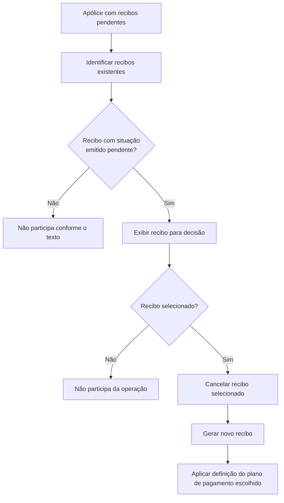

# Operação de Alteração de Plano de Pagamento — Seleção de Recibos

## 1. Metadados do Documento
- **Arquivo de Origem:** Não identificado no conteúdo fornecido
- **Tipo de Documento:** Procedimento funcional
- **Domínio / Sistema:** Alteração de plano de pagamento de apólice; recibos
- **Público-Alvo:** Operação, negócio e desenvolvimento
- **Data/Versão Identificada:** Não identificada

---

## 2. Resumo Executivo & Contexto de Negócio

O conteúdo descreve a etapa de seleção de recibos durante uma operação de alteração de plano de pagamento de uma apólice. A finalidade é identificar quais recibos pendentes existentes na apólice devem participar da alteração.

A operação abrange recibos cuja situação seja **emitido pendente**. O usuário decide quais dos recibos exibidos participarão do processo.

Os recibos selecionados são cancelados. Após o cancelamento, novos recibos são gerados de acordo com a definição do plano de pagamento escolhido.

O texto menciona a ação possível **MODIFICAR**, mas não fornece detalhamento adicional sobre interfaces, serviços, contratos, validações ou regras de cálculo.

---

## 3. Arquitetura, Componentes & Tecnologias Envolvidas

Os componentes ou conceitos identificados são:

- **Apólice:** contexto que contém os recibos pendentes.
- **Recibos:** entidades selecionáveis para a alteração do plano de pagamento.
- **Situação “emitido pendente”:** critério explícito para apresentação e participação dos recibos na operação.
- **Operação de alteração de plano de pagamento:** processo que cancela recibos selecionados e gera novos recibos.
- **Plano de pagamento escolhido:** definição utilizada para gerar os novos recibos.
- **Ação “MODIFICAR”:** ação listada no conteúdo.
- **RS:** termo exibido ao lado de “Recibo”, sem definição adicional.
- **Inicio Soluciones APIs Documentación Zeus:** texto de navegação ou identificação de interface, sem explicação funcional adicional.



> **Nota de Análise:** O conteúdo não detalha sistemas, APIs, métodos HTTP, contratos JSON, tecnologias, ambientes, persistência de dados ou responsáveis pela execução da operação.

---

## 4. Regras de Negócio, Especificações Funcionais & Processos

1. A operação ocorre no contexto de uma **alteração de plano de pagamento** de uma apólice.
2. Devem ser identificados os recibos existentes na apólice que estejam pendentes e intervenham na alteração do plano de pagamento.
3. A seção determina que o usuário escolha quais recibos exibidos participarão da operação.
4. O texto identifica explicitamente os recibos exibidos como aqueles com situação **emitido pendente**.
5. Os recibos selecionados devem ser cancelados.
6. Após o cancelamento dos recibos selecionados, novos recibos devem ser gerados.
7. A geração dos novos recibos deve atender à definição do plano de pagamento escolhido.
8. A ação possível apresentada é **MODIFICAR**.
9. O conteúdo não especifica:
   - regras para impedir ou permitir a seleção de determinados recibos;
   - critérios de ordenação dos recibos;
   - regras de cálculo de parcelas, valores, datas de vencimento ou impostos;
   - tratamento de erros de cancelamento ou geração;
   - comportamento para recibos não selecionados;
   - identificação de usuários, perfis ou permissões;
   - integração com sistemas externos.

---

## 5. Tabelas de Parâmetros, Ambientes e Estruturas de Dados

| Item / Parâmetro | Descrição / Função | Tipo / Valores / Formato | Ambiente / Observações |
| :--- | :--- | :--- | :--- |
| Apólice | Contexto que contém os recibos existentes e pendentes. | Entidade de negócio | Não há identificador ou estrutura detalhada. |
| Recibo | Item que pode participar da alteração de plano de pagamento. | Entidade de negócio | O documento apresenta “Recibo / RS”, sem detalhar o significado de RS. |
| Situação do recibo | Critério para os recibos mostrados na operação. | `emitido pendente` | O texto informa que os recibos exibidos possuem essa situação. |
| Seleção de recibos | Decisão sobre quais recibos participarão da operação. | Selecionado / não selecionado | Não há regras adicionais de seleção. |
| Cancelamento | Consequência aplicada aos recibos selecionados. | Ação de negócio | Não há detalhamento de status resultante, reversão ou auditoria. |
| Geração de novos recibos | Resultado posterior ao cancelamento dos recibos selecionados. | Ação de negócio | Deve atender à definição do plano de pagamento escolhido. |
| Plano de pagamento escolhido | Referência para criação dos novos recibos. | Não detalhado | O documento não apresenta atributos, modalidades ou regras de cálculo. |
| Ação possível | Ação listada no trecho fornecido. | `MODIFICAR` | Não há explicação adicional sobre seu acionamento ou efeitos. |
| RS | Sigla ou campo apresentado junto de “Recibo”. | Não identificado | Sem definição no conteúdo. |
| Zeus | Termo exibido no rodapé ou navegação. | Não identificado | O conteúdo não descreve a função de Zeus. |

---

## 6. Bateria de Perguntas & Respostas para RAG (FAQ Sintético)

### P1: Qual é o objetivo da etapa de recibos na alteração do plano de pagamento?
**R:** O objetivo é identificar quais recibos existentes e pendentes na apólice participam da alteração do plano de pagamento.

### P2: Quais recibos são apresentados para decisão na operação?
**R:** O documento informa que são apresentados os recibos cuja situação é **emitido pendente**.

### P3: O que acontece com os recibos selecionados para a operação?
**R:** Os recibos selecionados são cancelados e, posteriormente, são gerados novos recibos conforme a definição do plano de pagamento escolhido.

### P4: O que ocorre com os recibos que não forem selecionados?
**R:** O conteúdo não especifica o tratamento dos recibos não selecionados; apenas estabelece que os recibos selecionados serão cancelados e substituídos por novos recibos.

### P5: Qual ação possível é apresentada no processo?
**R:** A ação possível apresentada no texto é **MODIFICAR**. O documento não detalha a interface, o gatilho ou regras adicionais dessa ação.

### P6: O documento define quais dados compõem um recibo?
**R:** Não. O conteúdo menciona “Recibo / RS”, mas não descreve campos, identificadores, valores, datas ou estrutura de dados do recibo.

### P7: Como os novos recibos são definidos após o cancelamento?
**R:** Os novos recibos são gerados atendendo à definição do plano de pagamento escolhido. O documento não detalha como essa definição determina parcelas, valores ou vencimentos.

### P8: O processo se aplica a todos os recibos da apólice?
**R:** Não necessariamente. O documento indica que devem ser escolhidos, entre os recibos mostrados com situação **emitido pendente**, aqueles que participarão da operação.

### P9: Há informação sobre APIs ou integrações usadas para cancelar e gerar recibos?
**R:** Não. Embora o texto inclua referências visuais a “APIs” e “Zeus”, não fornece métodos, endpoints, contratos, tecnologias ou fluxos de integração.

### P10: O documento especifica validações para a seleção de recibos?
**R:** Não. A única condição explicitamente apresentada é que os recibos mostrados possuem situação **emitido pendente**.

---

## 7. Glossário de Termos, Siglas & Conceitos-Chave

- **Apólice:** contexto de negócio no qual existem recibos pendentes sujeitos à alteração de plano de pagamento.
- **Recibo:** entidade vinculada à apólice que pode participar da operação.
- **Emitido pendente:** situação explicitamente atribuída aos recibos exibidos para seleção.
- **Plano de pagamento:** definição escolhida que orienta a geração dos novos recibos.
- **MODIFICAR:** ação possível listada no conteúdo.
- **RS:** termo associado a “Recibo”, sem significado definido no trecho fornecido.
- **Zeus:** termo exibido no texto de navegação, sem definição funcional no conteúdo.

---

## 8. Notas Críticas, Riscos & Limitações

- O conteúdo fornecido é resumido e não identifica o arquivo, a versão, a data, o sistema proprietário ou os responsáveis pelo processo.
- Não há especificação sobre regras de cálculo, valores, vencimentos, parcelamento ou efeitos financeiros da alteração de plano de pagamento.
- Não há descrição de validações, autorizações, trilha de auditoria, reversão, exceções ou tratamento de falhas.
- O tratamento de recibos não selecionados não é detalhado.
- As referências a **RS**, **APIs** e **Zeus** não possuem definição técnica ou funcional suficiente para estabelecer relações arquiteturais.
- **Nota de Análise:** O documento lista recibos com situação “emitido pendente”, mas não detalha as transições de estado decorrentes do cancelamento ou da geração de novos recibos.

---

## 9. Conteúdo Bruto Estruturado (Referência Fiel)

```text
--- [PÁGINA 1 DE 2] ---

RECIBOS
¿En que consiste?
En este punto se deben identificar qué recibos, de los existentes en la póliza pendientes, intervienen
en el cambio de plan de pago.
Posibles acciones
 MODIFICAR ( )
Proceso a seguir
A continuación se detalla la información requerida.
Recibo
 /
 RS
Inicio Soluciones APIs Documentación Zeus
ES


--- [PÁGINA 2 DE 2] ---

En este apartado se debe decidir cuales de los recibos que se muestran (aquellos que su situación
es emitido pendiente) participarán en la operación. Aquellos seleccionados se cancelarán y se
generarán nuevos atendiendo a la definición del plan de pago elegido.
```
