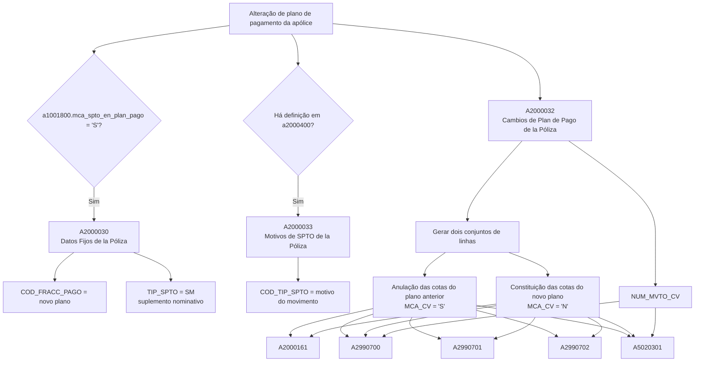

# Alteração de Plano de Pagamento de Apólice — Visão Técnica e Impactos em Tabelas

## 1. Metadados do Documento
- **Arquivo de Origem:** Não informado; conteúdo bruto fornecido pelo solicitante.
- **Tipo de Documento:** Especificação Técnica.
- **Domínio / Sistema:** Apólices, suplementos de apólice, planos de pagamento, recibos/cotas e comissões.
- **Público-Alvo:** Desenvolvedores, Arquitetos, Analistas Funcionais e Operação.
- **Data/Versão Identificada:** Não identificada.

---

## 2. Resumo Executivo & Contexto de Negócio

O documento descreve a visão técnica do processo de **alteração de plano de pagamento de uma apólice**. A alteração gera movimentos em tabelas de dados fixos da apólice, motivos de suplemento, histórico de alterações de plano, conceitos econômicos, recibos/cotas, comissões e histórico de cotas.

O processo está condicionado, em parte, à marca `a1001800.mca_spto_en_plan_pago = 'S'`. Quando essa condição é atendida, a tabela `A2000030` registra o novo plano de pagamento e grava o tipo de suplemento como suplemento nominativo, com valor `SM` em `TIP_SPTO`.

A mudança de plano de pagamento registra um novo movimento em `A2000032` e produz dois conjuntos de linhas nas tabelas econômicas e de cotas: um conjunto para anular as cotas do plano de pagamento anterior e outro conjunto para constituir as cotas do novo plano de pagamento. A distinção entre anulação e constituição é representada principalmente pelo campo `MCA_CV`.

O documento não apresenta contratos de APIs, métodos HTTP, cálculos financeiros, critérios de elegibilidade para alteração de plano ou detalhes sobre as situações “anterior” e “posterior” exibidas nos slides. Esses elementos não devem ser inferidos além do conteúdo disponível.

---

## 3. Arquitetura, Componentes & Tecnologias Envolvidas

### Componentes e tabelas identificados

| Componente / Tabela | Nome descrito no documento | Papel no processo de alteração de plano de pagamento |
| :--- | :--- | :--- |
| `a1001800.mca_spto_en_plan_pago` | Marca de suplemento em plano de pagamento | Condição citada para movimentação da tabela `A2000030`; o valor indicado é `'S'`. |
| `A2000030` | Datos Fijos de la Póliza | Registra o novo plano de pagamento em `COD_FRACC_PAGO` e grava `TIP_SPTO` como suplemento nominativo (`SM`). |
| `A2000033` | Motivos de SPTO de la Póliza | Registra os motivos do movimento por meio de `COD_TIP_SPTO`; há movimento quando existe definição em `a2000400`. |
| `a2000400` | Não detalhado no texto | Fonte de definição cuja existência condiciona a movimentação de `A2000033`. |
| `A2000032` | Cambios de Plan de Pago de la Póliza | Sempre recebe movimentação para registrar a alteração entre plano anterior e novo plano de pagamento. |
| `A2000161` | Conceptos Económicos de Recibo de la Póliza | Sempre gera linhas para anulação das cotas anteriores e constituição das cotas do novo plano. |
| `A2990700` | Recibos/Cuotas de la Póliza | Sempre gera linhas de anulação e constituição das cotas; associa linhas ao movimento de `A2000032`. |
| `A2990701` | Comisiones por Cuota de la Póliza | Sempre gera linhas para anulação e constituição associadas às cotas. |
| `A2990702` | Comisiones Externas por Cuota de la Póliza | Sempre gera linhas para anulação e constituição associadas às cotas. |
| `A5020301` | Movimientos o Histórico de Cuotas | Sempre gera linhas de anulação e constituição; associa linhas ao movimento de `A2000032`. |
| `Home Solutions APIs Documentation Zeus` | Texto de navegação/referência extraído | O documento não detalha a função técnica, integração ou relação operacional deste elemento com a alteração de plano de pagamento. |



---

## 4. Regras de Negócio, Especificações Funcionais & Processos

### Processo de alteração de plano de pagamento

1. A alteração de plano de pagamento movimenta sempre a tabela `A2000032 — CAMBIOS DE PLAN DE PAGO DE LA PÓLIZA`.
2. A tabela `A2000032` identifica o novo plano de pagamento, o plano anterior e a vigência das linhas envolvidas.
3. O valor de `NUM_MVTO_CV` em `A2000032` identifica as linhas geradas pela alteração de plano de pagamento nas tabelas que possuem uma coluna com o mesmo nome.
4. O campo `COD_FRACC_PAGO` em `A2000032` representa o novo plano de pagamento.
5. O campo `COD_FRACC_PAGO_ANT` em `A2000032` representa o plano de pagamento anterior.
6. Para `MCA_VIGENTE` em `A2000032`, a nova linha recebe o valor `'S'`; a linha anterior que possuía valor `'S'` passa a receber o valor `'N'`.

### Regras para dados fixos da apólice

1. A tabela `A2000030 — DATOS FIJOS DE LA PÓLIZA` é movimentada quando `a1001800.mca_spto_en_plan_pago = 'S'`.
2. O campo `COD_FRACC_PAGO` em `A2000030` registra o novo plano de pagamento.
3. O campo `TIP_SPTO` em `A2000030` é gravado como suplemento nominativo, com valor `SM`.

### Regras para motivos de suplemento

1. A tabela `A2000033 — MOTIVOS DE SPTO DE LA POLIZA` é movimentada quando há definição em `a2000400`.
2. O campo `COD_TIP_SPTO` registra os motivos pelos quais o movimento foi realizado.
3. O documento não detalha a estrutura de `a2000400`, os valores permitidos em `COD_TIP_SPTO` ou os critérios que definem os motivos.

### Regras de geração de linhas econômicas, cotas e comissões

1. As tabelas `A2000161`, `A2990700`, `A2990701`, `A2990702` e `A5020301` são movimentadas sempre durante a alteração de plano de pagamento.
2. Cada uma dessas tabelas gera dois conjuntos de linhas:
   - Um conjunto de linhas para a **anulação das cotas do plano de pagamento anterior**.
   - Um conjunto de linhas para a **constituição das cotas do novo plano de pagamento**.
3. Em `A2000161`, `A2990700`, `A2990701`, `A2990702` e `A5020301`, o campo `MCA_CV` recebe:
   - `'S'` quando a linha está anulando uma cota do plano de pagamento anterior.
   - `'N'` quando a linha pertence ao novo plano de pagamento.
4. Em `A2990700` e `A5020301`, o campo `NUM_MVTO_CV` identifica as linhas geradas na alteração de plano e corresponde ao valor de `a2000032.num_mvto_cv`.

### Nota de Análise

> O documento cita “movimento de filas”, “movimento de columnas”, “situación anterior al movimiento” e “situación posterior al movimiento” para as tabelas apresentadas, mas não fornece os valores ou imagens correspondentes a essas situações. Portanto, não é possível reconstruir o estado completo de cada linha antes e depois da alteração.

---

## 5. Tabelas de Parâmetros, Ambientes e Estruturas de Dados

### Condições de movimentação por tabela

| Item / Parâmetro | Descrição / Função | Tipo / Valores / Formato | Ambiente / Observações |
| :--- | :--- | :--- | :--- |
| `A2000030` | Dados fixos da apólice; registra novo plano de pagamento e tipo de suplemento. | Movimentada quando `a1001800.mca_spto_en_plan_pago = 'S'`. | Nenhum ambiente identificado. |
| `A2000033` | Motivos de suplemento da apólice. | Movimentada quando há definição em `a2000400`. | O conteúdo de `a2000400` não é detalhado. |
| `A2000032` | Alterações de plano de pagamento da apólice. | Sempre movimentada. | Registra relação entre plano anterior e novo plano. |
| `A2000161` | Conceitos econômicos de recibo da apólice. | Sempre movimentada; dois conjuntos de linhas. | Anulação do plano anterior e constituição do novo plano. |
| `A2990700` | Recibos/cotas da apólice. | Sempre movimentada; dois conjuntos de linhas. | Possui associação com `a2000032.num_mvto_cv`. |
| `A2990701` | Comissões por cota da apólice. | Sempre movimentada; dois conjuntos de linhas. | Distingue anulação e nova cota por `MCA_CV`. |
| `A2990702` | Comissões externas por cota da apólice. | Sempre movimentada; dois conjuntos de linhas. | Distingue anulação e nova cota por `MCA_CV`. |
| `A5020301` | Movimentos ou histórico de cotas. | Sempre movimentada; dois conjuntos de linhas. | Possui associação com `a2000032.num_mvto_cv`. |

### Campos significativos

| Item / Parâmetro | Descrição / Função | Tipo / Valores / Formato | Ambiente / Observações |
| :--- | :--- | :--- | :--- |
| `a1001800.mca_spto_en_plan_pago` | Controla a condição de movimentação de `A2000030`. | Valor citado: `'S'`. | Não foram documentados outros valores ou semânticas. |
| `A2000030.COD_FRACC_PAGO` | Registra o novo plano de pagamento. | Código de plano de pagamento; formato não detalhado. | Associado à alteração de plano. |
| `A2000030.TIP_SPTO` | Tipo de suplemento registrado no movimento. | `SM`. | `SM` é descrito como suplemento nominativo. |
| `A2000033.COD_TIP_SPTO` | Registra os motivos da realização do movimento. | Código; valores não detalhados. | Aplicável quando existe definição em `a2000400`. |
| `A2000032.NUM_MVTO_CV` | Identifica linhas geradas pela mudança de plano em tabelas que possuem coluna de mesmo nome. | Identificador de movimento; formato não detalhado. | Referenciado por `A2990700.NUM_MVTO_CV` e `A5020301.NUM_MVTO_CV`. |
| `A2000032.COD_FRACC_PAGO` | Registra o novo plano de pagamento. | Código; formato não detalhado. | Representa o plano resultante da alteração. |
| `A2000032.COD_FRACC_PAGO_ANT` | Registra o plano de pagamento anterior. | Código; formato não detalhado. | Representa o plano substituído. |
| `A2000032.MCA_VIGENTE` | Controla a vigência das linhas de alteração de plano. | Nova linha: `'S'`; linha anterior antes vigente: `'N'`. | Há transição explícita de vigência entre linhas. |
| `A2000161.MCA_CV` | Distingue anulação de cota anterior e linha pertencente ao novo plano. | Anulação: `'S'`; novo plano: `'N'`. | Aplicável aos conceitos econômicos de recibo. |
| `A2990700.MCA_CV` | Distingue anulação de cota anterior e linha pertencente ao novo plano. | Anulação: `'S'`; novo plano: `'N'`. | Aplicável a recibos/cotas. |
| `A2990700.NUM_MVTO_CV` | Identifica linhas geradas pela mudança de plano. | Corresponde a `a2000032.num_mvto_cv`. | Aplicável a recibos/cotas. |
| `A2990701.MCA_CV` | Distingue anulação de cota anterior e linha pertencente ao novo plano. | Anulação: `'S'`; novo plano: `'N'`. | Aplicável a comissões por cota. |
| `A2990702.MCA_CV` | Distingue anulação de cota anterior e linha pertencente ao novo plano. | Anulação: `'S'`; novo plano: `'N'`. | Aplicável a comissões externas por cota. |
| `A5020301.MCA_CV` | Distingue anulação de cota anterior e linha pertencente ao novo plano. | Anulação: `'S'`; novo plano: `'N'`. | Aplicável ao histórico de cotas. |
| `A5020301.NUM_MVTO_CV` | Identifica linhas geradas pela mudança de plano. | Corresponde a `a2000032.num_mvto_cv`. | Aplicável aos movimentos ou histórico de cotas. |

---

## 6. Bateria de Perguntas & Respostas para RAG (FAQ Sintético)

### P1: Quais tabelas são sempre movimentadas em uma alteração de plano de pagamento da apólice?
**R:** As tabelas sempre movimentadas são `A2000032`, `A2000161`, `A2990700`, `A2990701`, `A2990702` e `A5020301`. A tabela `A2000032` registra a alteração do plano de pagamento. As demais tabelas geram linhas associadas à anulação das cotas do plano anterior e à constituição das cotas do novo plano.

### P2: Qual condição dispara a movimentação da tabela A2000030?
**R:** A tabela `A2000030 — DATOS FIJOS DE LA PÓLIZA` é movimentada quando `a1001800.mca_spto_en_plan_pago = 'S'`.

### P3: Como o novo plano de pagamento é registrado em A2000030?
**R:** O novo plano de pagamento é registrado no campo `A2000030.COD_FRACC_PAGO`. No mesmo movimento, o campo `A2000030.TIP_SPTO` é gravado como suplemento nominativo, com valor `SM`.

### P4: Quando A2000033 — MOTIVOS DE SPTO DE LA POLIZA é movimentada?
**R:** A tabela `A2000033` é movimentada quando há definição em `a2000400`. O campo significativo apresentado para essa tabela é `COD_TIP_SPTO`, que contém os motivos pelos quais o movimento foi realizado.

### P5: Qual tabela registra o plano de pagamento anterior e o novo plano de pagamento?
**R:** A tabela `A2000032 — CAMBIOS DE PLAN DE PAGO DE LA PÓLIZA` registra ambos. O campo `COD_FRACC_PAGO` representa o novo plano de pagamento e o campo `COD_FRACC_PAGO_ANT` representa o plano de pagamento anterior.

### P6: Como funciona o campo MCA_VIGENTE em A2000032 após uma alteração de plano?
**R:** Em `A2000032`, a nova linha recebe `MCA_VIGENTE = 'S'`. A linha anterior que possuía `MCA_VIGENTE = 'S'` passa a receber o valor `'N'`.

### P7: O que significa MCA_CV = 'S' nas tabelas econômicas, de cotas e comissões?
**R:** O valor `MCA_CV = 'S'` indica que a linha está anulando uma cota pertencente ao plano de pagamento anterior. Essa regra é documentada para `A2000161`, `A2990700`, `A2990701`, `A2990702` e `A5020301`.

### P8: O que significa MCA_CV = 'N' nas linhas geradas pela alteração de plano?
**R:** O valor `MCA_CV = 'N'` indica que a linha pertence ao novo plano de pagamento. O documento utiliza essa regra para os conceitos econômicos de recibo, recibos/cotas, comissões por cota, comissões externas por cota e histórico de cotas.

### P9: Como as linhas de A2990700 são relacionadas à alteração de plano de pagamento?
**R:** Em `A2990700 — RECIBOS/CUOTAS DE LA PÓLIZA`, o campo `NUM_MVTO_CV` identifica as linhas geradas na alteração de plano de pagamento e corresponde ao valor de `a2000032.num_mvto_cv`.

### P10: Como as linhas de A5020301 são relacionadas à alteração de plano de pagamento?
**R:** Em `A5020301 — MOVIMIENTOS O HISTÓRICO DE CUOTAS`, o campo `NUM_MVTO_CV` identifica as linhas geradas pela alteração de plano e corresponde ao valor de `a2000032.num_mvto_cv`.

### P11: Quais tabelas recebem dois conjuntos de linhas durante a alteração de plano?
**R:** `A2000161`, `A2990700`, `A2990701`, `A2990702` e `A5020301` recebem dois conjuntos de linhas: um para anular as cotas do plano anterior e outro para constituir as cotas do novo plano de pagamento.

### P12: O documento define métodos de API, contratos JSON ou endpoints para alteração de plano de pagamento?
**R:** Não. Embora o texto extraído contenha a expressão “Home Solutions APIs Documentation Zeus”, o documento não apresenta endpoints, métodos HTTP, contratos JSON, URLs, autenticação ou detalhes de integração por API.

---

## 7. Glossário de Termos, Siglas & Conceitos-Chave

- **Apólice / Póliza:** Entidade central referenciada pelo documento, associada a plano de pagamento, recibos/cotas, suplementos e comissões.
- **Cota / Cuota:** Parcela associada ao plano de pagamento da apólice.
- **Plano de Pagamento / Plan de Pago:** Estrutura de pagamento da apólice; pode ser alterada pelo processo documentado.
- **SPTO:** Termo presente nos nomes das tabelas e dos campos `TIP_SPTO` e `COD_TIP_SPTO`; o documento não explicita o significado da sigla.
- **Suplemento nominativo:** Classificação registrada em `A2000030.TIP_SPTO` com o valor `SM`.
- **`SM`:** Valor utilizado em `TIP_SPTO` para indicar suplemento nominativo.
- **`MCA_CV`:** Campo que diferencia linhas de anulação de cotas anteriores (`'S'`) e linhas do novo plano de pagamento (`'N'`).
- **`NUM_MVTO_CV`:** Identificador das linhas geradas pela mudança de plano de pagamento; em `A2990700` e `A5020301`, corresponde a `a2000032.num_mvto_cv`.
- **`MCA_VIGENTE`:** Campo de vigência em `A2000032`; a nova linha recebe `'S'` e a linha anteriormente vigente passa a `'N'`.
- **`COD_FRACC_PAGO`:** Campo que representa o novo plano de pagamento.
- **`COD_FRACC_PAGO_ANT`:** Campo que representa o plano de pagamento anterior.
- **`COD_TIP_SPTO`:** Campo que contém os motivos pelos quais o movimento foi realizado.
- **`a2000400`:** Elemento mencionado como fonte de definição para a movimentação de `A2000033`; não possui detalhamento adicional.
- **Movimento de filas:** Expressão do documento para movimentação ou geração de linhas em tabelas.
- **Movimento de columnas:** Expressão do documento para alteração ou preenchimento de colunas significativas; não há detalhamento adicional além dos campos listados.

---

## 8. Notas Críticas, Riscos & Limitações

- O documento não informa o arquivo de origem, autor, data, versão, ambiente, servidor, URL, porta, tecnologia de persistência ou sistema executor do processo.
- O documento não detalha o significado expandido de `SPTO`, `MCA_CV`, `MCA_VIGENTE`, `NUM_MVTO_CV`, `COD_FRACC_PAGO` ou `COD_TIP_SPTO` além do comportamento funcional explicitamente descrito.
- As seções “Situação anterior ao movimento” e “Situação posterior ao movimento” são mencionadas para as tabelas, mas os dados correspondentes não estão presentes no conteúdo bruto fornecido.
- Não há detalhamento dos critérios de validação para uma alteração de plano de pagamento, cálculo de valores, tratamento de erro, transações, reversão, auditoria ou regras de idempotência.
- A relação entre `a2000400` e `A2000033` é apenas condicional: `A2000033` é movimentada quando existe definição em `a2000400`. A estrutura e a regra de consulta de `a2000400` não são apresentadas.
- A referência “Home Solutions APIs Documentation Zeus” aparece no conteúdo extraído, mas não existe especificação suficiente para caracterizá-la como componente de arquitetura, API ou dependência operacional.

---

## 9. Conteúdo Bruto Estruturado (Referência Fiel)

```text
--- [PÁGINA 1 DE 7] ---

ALTERAR plan pago (visión técnica)
Tablas que intervienen
PÓLIZA
 A2000030: DATOS FIJOS DE LA PÓLIZA
 CUANDO
a1001800.mca_spto_en_plan_pago = 'S'
 Movimiento de filas
 Movimiento de columnas
 A2000033: MOTIVOS DE SPTO DE LA
POLIZA
 CUANDO hay definición en a2000400
 Movimiento de filas
 Movimiento de columnas
 A2000032: CAMBIOS DE PLAN DE PAGO
DE LA PÓLIZA
 SIEMPRE
 Movimiento de filas
 Movimiento de columnas
 A2000161: CONCEPTOS ECONÓMICOS
DE RECIBO DE LA PÓLIZA
 SIEMPRE. Genera dos juegos de filas, uno
con la anulación de las cuotas del plan de
pago anterior y otro con la constitución de las
cuotas del nuevo plan de pago
 /
 CF
Home Solutions APIs Documentation Zeus
EN


--- [PÁGINA 2 DE 7] ---

Movimiento de filas
 Movimiento de columnas
 A2990700: RECIBOS/CUOTAS DE LA
PÓLIZA
 SIEMPRE. Genera dos juegos de filas, uno
con la anulación de las cuotas del plan de
pago anterior y otro con la constitución de las
cuotas del nuevo plan de pago
 Movimiento de filas
 Movimiento de columnas
 A2990701: COMISIONES POR CUOTA
DE LA PÓLIZA
 SIEMPRE. Genera dos juegos de filas, uno
con la anulación de las cuotas del plan de
pago anterior y otro con la constitución de las
cuotas del nuevo plan de pago
 Movimiento de filas
 Movimiento de columnas
 A2990702: COMISIONES EXTERNAS
POR CUOTA DE LA PÓLIZA
 SIEMPRE. Genera dos juegos de filas, uno
con la anulación de las cuotas del plan de
pago anterior y otro con la constitución de las
cuotas del nuevo plan de pago
 Movimiento de filas
 Movimiento de columnas
 A5020301: MOVIMIENTOS O HISTÓRICO
DE CUOTAS
 SIEMPRE. Genera dos juegos de filas, uno
con la anulación de las cuotas del plan de
pago anterior y otro con la constitución de las
cuotas del nuevo plan de pago
 Movimiento de filas
 Movimiento de columnas
A2000030 - DATOS FIJOS DE LA PÓLIZA
A2000030 - Movimiento de filas
Situación anterior al movimiento
Situación posterior al movimiento
A2000030 - Columnas significativas en el movimiento


--- [PÁGINA 3 DE 7] ---

COLUMNA COMENTARIO
COD_FRACC_PAGO Nuevo plan de pago
TIP_SPTO Se graba como suplemento nominativo (SM)
Volver al comienzo
A2000033 - MOTIVOS DE SPTO DE LA POLIZA
A2000033 - Movimiento de filas
Situación anterior al movimiento
Situación posterior al movimiento
A2000033 - Columnas significativas en el movimiento
COLUMNA COMENTARIO
COD_TIP_SPTO Motivos por los que se realizó el movimiento
Volver al comienzo
A2000032 - CAMBIOS DE PLAN DE PAGO DE LA PÓLIZA
A2000032 - Movimiento de filas
Situación anterior al movimiento
Situación posterior al movimiento
A2000032 - Columnas significativas en el movimiento


--- [PÁGINA 4 DE 7] ---

COLUMNA COMENTARIO
NUM_MVTO_CV El valor identifica las filas generadas por el cambio de plan de
pago en las tablas con la comumna del mismo nombre
COD_FRACC_PAGO Nuevo plan de pago
COD_FRACC_PAGO_ANT Anterior plan de pago
MCA_VIGENTE La nueva fila toma el valor 'S', la anterior con valor 'S' pasa a
valor 'N'
Volver al comienzo
A2000161 - CONCEPTOS ECONÓMICOS DE RECIBO DE LA
PÓLIZA
A2000161 - Movimiento de filas
Situación anterior al movimiento
Situación posterior al movimiento
A2000161 - Columnas significativas en el movimiento
COLUMNA COMENTARIO
MCA_CV Contiene el valor 'S' cuando la fila está anulando a una cuota del plan de pago
anterior. Si la fila pertenece al nuevo plan de pago, el valor es 'N'
Volver al comienzo


--- [PÁGINA 5 DE 7] ---

A2990700 - RECIBOS/CUOTAS DE LA PÓLIZA
A2990700 - Movimiento de filas
Situación anterior al movimiento
Situación posterior al movimiento
A2990700 - Columnas significativas en el movimiento
COLUMNA COMENTARIO
MCA_CV Contiene el valor 'S' cuando la fila está anulando a una cuota del plan de
pago anterior. Si la fila pertenece al nuevo plan de pago, el valor es 'N'
NUM_MVTO_CV Identifica la filas generadas en el cambio de plan de pago y corresponde
al valor de a2000032.num_mvto_cv
Volver al comienzo
A2990701 - COMISIONES POR CUOTA DE LA PÓLIZA
A2990701 - Movimiento de filas
Situación anterior al movimiento
Situación posterior al movimiento
A2990701 - Columnas significativas en el movimiento


--- [PÁGINA 6 DE 7] ---

COLUMNA COMENTARIO
MCA_CV Contiene el valor 'S' cuando la fila está anulando a una cuota del plan de pago
anterior. Si la fila pertenece al nuevo plan de pago, el valor es 'N'
Volver al comienzo
A2990702 - COMISIONES EXTERNAS POR CUOTA DE LA
PÓLIZA
A2990702 - Movimiento de filas
Situación anterior al movimiento
Situación posterior al movimiento
A2990702 - Columnas significativas en el movimiento
COLUMNA COMENTARIO
MCA_CV Contiene el valor 'S' cuando la fila está anulando a una cuota del plan de pago
anterior. Si la fila pertenece al nuevo plan de pago, el valor es 'N'
Volver al comienzo
A5020301 - MOVIMIENTOS O HISTÓRICO DE CUOTAS
A5020301 - Movimiento de filas
Situación anterior al movimiento
Situación posterior al movimiento
A5020301 - Columnas significativas en el movimiento


--- [PÁGINA 7 DE 7] ---

COLUMNA COMENTARIO
MCA_CV Contiene el valor 'S' cuando la fila está anulando a una cuota del plan de
pago anterior. Si la fila pertenece al nuevo plan de pago, el valor es 'N'
NUM_MVTO_CV Identifica la filas generadas en el cambio de plan de pago y corresponde
al valor de a2000032.num_mvto_cv
Volver al comienzo
```
