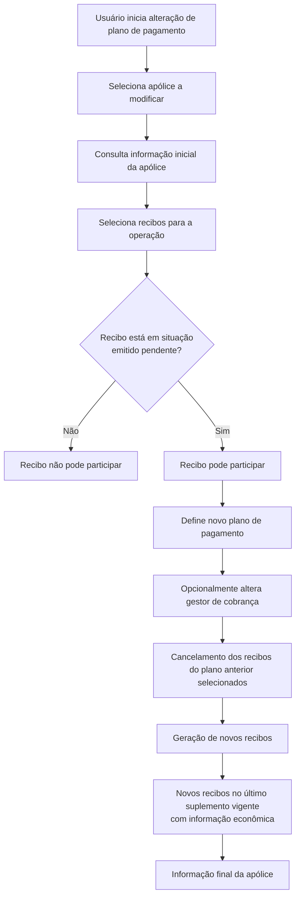

# Alteração de Plano de Pagamento de Apólice — Visão Técnica

## 1. Metadados do Documento
- **Arquivo de Origem:** Não identificado no conteúdo fornecido
- **Tipo de Documento:** Especificação Técnica / Procedimento Funcional
- **Domínio / Sistema:** Alteração de plano de pagamento de apólice; MAPFRE; Soluções APIs; Zeus
- **Público-Alvo:** Analistas funcionais, desenvolvedores, operação e usuários responsáveis pela gestão de apólices
- **Data/Versão Identificada:** Não identificada

---

## 2. Resumo Executivo & Contexto de Negócio

O documento descreve a operação **“ALTERAR Póliza plan pago”**, destinada à renegociação financeira de uma apólice ou aplicação por meio de refinanciamento e/ou alteração do plano de pagamento. A operação é vinculada a uma visão técnica, mas o conteúdo fornecido concentra-se na descrição funcional e na ordem das informações exibidas no processo.

A alteração permite modificar exclusivamente o plano de pagamento e, quando aplicável, o gestor de cobrança. O procedimento não permite modificar outros dados da apólice. Como consequência da mudança, os recibos vinculados ao plano de pagamento anterior são cancelados e novos recibos são gerados conforme a definição do novo plano de pagamento.

A operação pode incidir sobre parte ou sobre a totalidade da dívida, pois o usuário seleciona os recibos que participarão da alteração. Recibos pertencentes ao plano de pagamento atual podem permanecer fora da operação, desde que não tenham sido selecionados.

A elegibilidade de recibos é restrita: somente recibos em situação **“emitido pendente”** podem participar. O documento associa essa condição à existência do recibo em MAPFRE; recibos em situação diferente não podem ser incluídos na operação.

---

## 3. Arquitetura, Componentes & Tecnologias Envolvidas

Os elementos explicitamente citados são:

- **Apólice / aplicação:** entidade sobre a qual ocorre o refinanciamento ou a alteração de plano de pagamento.
- **Plano de pagamento atual:** plano cujos recibos podem ser cancelados para a geração de um novo plano.
- **Novo plano de pagamento:** definição utilizada para gerar novos recibos.
- **Recibos:** itens financeiros selecionáveis pelo usuário; devem estar em situação “emitido pendente”.
- **Último suplemento vigente:** suplemento que gerou informação econômica e no qual os novos recibos são gerados.
- **Gestor de cobrança:** único dado adicional da apólice que pode ser modificado pela operação.
- **MAPFRE:** sistema/ambiente mencionado como condição associada à situação elegível do recibo.
- **Soluções APIs / Zeus:** termos exibidos no trecho de navegação da página; não há detalhamento técnico adicional sobre integrações, endpoints, métodos HTTP ou contratos de dados.



> **Nota de Análise:** O documento não detalha interfaces, APIs, métodos HTTP, contratos JSON, tecnologias de implementação, ambientes técnicos, servidores ou mecanismos de autenticação.

---

## 4. Regras de Negócio, Especificações Funcionais & Processos

### 4.1 Escopo da operação

A operação permite:

1. Refinanciar uma apólice ou aplicação.
2. Alterar o plano de pagamento de uma apólice ou aplicação.
3. Alterar o gestor de cobrança, além do plano de pagamento.
4. Selecionar livremente os recibos que participarão da operação.
5. Financiar parte ou a totalidade da dívida, conforme os recibos selecionados.

A operação não permite modificar outros tipos de informação da apólice, exceto o gestor de cobrança.

### 4.2 Regras para recibos

1. Um recibo só pode participar da alteração se estiver na situação **“emitido pendente”**.
2. O documento estabelece que o recibo elegível deve encontrar-se em **MAPFRE**.
3. Se a situação do recibo for diferente de “emitido pendente”, o recibo não poderá participar da operação.
4. A seleção dos recibos é livre dentro da restrição de elegibilidade.
5. Nem todos os recibos do plano de pagamento atual precisam participar.
6. Os valores dos recibos selecionados são transferidos para o novo plano de pagamento.

### 4.3 Tratamento financeiro

1. Os recibos pertencentes ao plano de pagamento anterior e envolvidos na operação são cancelados.
2. Após o cancelamento, novos recibos são gerados de acordo com a definição do novo plano de pagamento.
3. Os novos recibos são gerados no último suplemento vigente que tenha gerado informação econômica.

### 4.4 Ordem de apresentação das informações

O documento apresenta os blocos de informação na seguinte ordem:

1. **Informação prévia**
   - Seleção da apólice a modificar.
2. **Informação de apólice — inicial**
   - Informação básica da apólice.
3. **Informação de apólice — final**
   - Plano de pagamento.
   - Gestor de cobrança.
   - Recibos.
   - Cláusulas.
   - Textos anexos.
   - Observações.
   - Motivos.

---

## 5. Tabelas de Parâmetros, Ambientes e Estruturas de Dados

| Item / Parâmetro | Descrição / Função | Tipo / Valores / Formato | Ambiente / Observações |
| :--- | :--- | :--- | :--- |
| Operação | Alterar plano de pagamento de apólice ou aplicação | Refinanciamento e/ou mudança de plano de pagamento | Não identificado |
| Apólice a modificar | Apólice selecionada pelo usuário para execução da operação | Entidade de negócio | Selecionada na etapa de informação prévia |
| Plano de pagamento | Informação financeira que pode ser alterada | Plano atual e novo plano | Exibido na informação final da apólice |
| Gestor de cobrança | Informação adicional que pode ser modificada | Não especificado | Exceção à restrição de não alteração de outros dados da apólice |
| Recibo elegível | Recibo que pode integrar a operação | Situação: `emitido pendente` | O documento associa a condição à presença em MAPFRE |
| Recibo não elegível | Recibo impedido de participar da operação | Situação diferente de `emitido pendente` | Não pode participar |
| Recibos selecionados | Recibos cujos valores serão incorporados ao novo plano | Seleção livre entre recibos elegíveis | Pode representar parte ou totalidade da dívida |
| Recibos do plano anterior | Recibos envolvidos no plano de pagamento anterior | Cancelados quando participam da operação | O documento não detalha o mecanismo de cancelamento |
| Novos recibos | Recibos resultantes da nova definição de pagamento | Gerados conforme o novo plano | Gerados no último suplemento vigente com informação econômica |
| Último suplemento vigente | Suplemento utilizado para geração de novos recibos | Suplemento que gerou informação econômica | Não há identificação de versão ou código |
| Informação prévia | Primeiro bloco de informação do processo | Seleção da apólice | Ordem de apresentação definida |
| Informação de apólice inicial | Segundo bloco de informação | Informação básica da apólice | Não detalhada no conteúdo |
| Informação de apólice final | Terceiro bloco de informação | Plano, gestor, recibos, cláusulas, anexos, observações e motivos | Não há definição dos campos internos |
| MAPFRE | Sistema/ambiente citado na regra de elegibilidade | Não especificado | Associado à condição do recibo “emitido pendente” |
| Soluções APIs | Item de navegação apresentado no trecho extraído | Não especificado | Sem detalhamento técnico |
| Zeus | Item de navegação apresentado no trecho extraído | Não especificado | Sem detalhamento técnico |

---

## 6. Bateria de Perguntas & Respostas para RAG (FAQ Sintético)

### P1: O que a operação “ALTERAR Póliza plan pago” permite fazer?
**R:** A operação permite refinanciar uma apólice ou aplicação e/ou alterar o plano de pagamento. Também pode permitir a alteração do gestor de cobrança, mas não permite modificar outros tipos de informação da apólice.

### P2: É possível alterar qualquer informação de uma apólice durante a mudança de plano de pagamento?
**R:** Não. O documento estabelece que não é possível modificar outro tipo de informação da apólice, exceto o gestor de cobrança. A operação é restrita ao refinanciamento, à mudança do plano de pagamento e à possível alteração do gestor de cobrança.

### P3: Quais recibos podem participar da alteração de plano de pagamento?
**R:** Somente recibos em situação **“emitido pendente”** podem participar. O documento afirma que, nessa condição, o recibo deve encontrar-se em MAPFRE. Caso a situação seja diferente, o recibo não poderá ser incluído na operação.

### P4: A alteração de plano de pagamento precisa incluir todos os recibos da apólice?
**R:** Não. O usuário possui liberdade para selecionar os recibos que participarão da operação. Dessa forma, a alteração pode financiar parte ou a totalidade da dívida, e alguns recibos do plano de pagamento atual podem não participar.

### P5: O que acontece com os recibos do plano de pagamento anterior?
**R:** Os recibos pertencentes ao plano de pagamento anterior e envolvidos na operação são cancelados. Em seguida, novos recibos são gerados conforme a definição do novo plano de pagamento.

### P6: Onde são gerados os novos recibos após a alteração do plano de pagamento?
**R:** Os novos recibos são gerados no último suplemento vigente que tenha gerado informação econômica.

### P7: Em qual bloco do processo ocorre a seleção da apólice?
**R:** A seleção da apólice a modificar ocorre no bloco **Informação Prévia**, que é o primeiro bloco listado na ordem do processo.

### P8: Quais informações aparecem na informação final da apólice?
**R:** A informação final da apólice inclui plano de pagamento, gestor de cobrança, recibos, cláusulas, textos anexos, observações e motivos.

### P9: O documento especifica APIs, endpoints ou contratos JSON da operação?
**R:** Não. Embora o trecho apresente referências a “Soluções APIs” e “Zeus”, o conteúdo não detalha métodos HTTP, endpoints, contratos JSON, autenticação, tecnologias de implementação ou fluxos de integração técnica.

### P10: Qual é a condição de elegibilidade associada ao MAPFRE?
**R:** O documento informa que, para um recibo participar, ele deve estar em situação “emitido pendente”, indicando que o recibo deve encontrar-se em MAPFRE. Recibos em outra situação não podem participar.

---

## 7. Glossário de Termos, Siglas & Conceitos-Chave

- **Apólice / Póliza:** entidade de negócio sobre a qual a alteração de plano de pagamento ou refinanciamento é realizada.
- **Plano de pagamento / Plan pago:** definição usada para organizar os recibos e pagamentos vinculados à apólice ou aplicação.
- **Refinanciamento:** possibilidade de financiar novamente parte ou a totalidade da dívida por meio de um novo plano de pagamento.
- **Recibo:** item financeiro associado à apólice, passível de seleção para integração no novo plano de pagamento quando elegível.
- **Emitido pendente:** situação exigida para que um recibo possa participar da operação.
- **MAPFRE:** termo citado como sistema/ambiente em que o recibo elegível deve encontrar-se; o documento não fornece expansão ou descrição adicional.
- **Gestor de cobrança:** informação da apólice que pode ser modificada na operação, além do plano de pagamento.
- **Suplemento vigente:** suplemento utilizado para gerar os novos recibos, desde que tenha gerado informação econômica.
- **Informação econômica:** critério citado para identificar o último suplemento vigente no qual os novos recibos devem ser gerados.
- **Soluções APIs:** item exibido no trecho de navegação; não há detalhamento funcional ou técnico.
- **Zeus:** item exibido no trecho de navegação; não há detalhamento funcional ou técnico.

---

## 8. Notas Críticas, Riscos & Limitações

- A operação possui restrição explícita de elegibilidade: recibos fora da situação **“emitido pendente”** não podem participar.
- A seleção parcial de recibos pode resultar na coexistência de recibos participantes e não participantes do plano de pagamento atual.
- A geração dos novos recibos depende do último suplemento vigente que tenha gerado informação econômica.
- O documento não detalha como o sistema identifica, valida ou recupera o último suplemento vigente.
- O documento não especifica regras de cálculo financeiro, juros, parcelamento, vencimentos, taxas, impostos ou critérios de refinanciamento.
- O documento não descreve tratamento de erros, reversão de cancelamentos, auditoria, permissões, trilhas de aprovação ou integrações técnicas.
- **Nota de Análise:** “Soluções APIs” e “Zeus” são apresentados apenas no trecho de navegação; não há informação suficiente para caracterizá-los como serviços, aplicações, módulos ou APIs da operação.

---

## 9. Conteúdo Bruto Estruturado (Referência Fiel)

```text
--- [PÁGINA 1 DE 2] ---

ALTERAR Póliza plan pago (enlace con visión
técnica)
¿En qué consiste?
Esta operación permite la refinanciación y/o cambio en el plan de pago de una póliza o aplicación. No
es posible modificar otro tipo de información de la póliza (salvo el gestor de cobro). Además, realiza
la cancelación de los recibos pertenecientes al anterior plan de pago y la generación de los recibos
atendiendo a la definición del plan de pago nuevo. Los nuevos recibos los genera en el último
suplemento vigente que generó información económica. Esta operación se realiza sobre los recibos
que el usuario seleccione. Es decir, hay libertad en la elección de recibos, cuyos importes pasarán al
nuevo plan de pago. Puede que haya recibos del actual plan de pago que no intervengan en la
operación, ya que la idea es que exista la posibilidad de financiar parte o la totalidad de la deuda.
Premisas
Para que un recibo pueda intervenir, debe encontrarse en situación emitido pendiente. Es decir, el
recibo debe encontrarse en MAPFRE. Si la situación es distinta, ese recibo no podrá participar en la
operación.
Proceso a seguir
En este apartado se enumeran los bloques de información y el orden en el que aparecerán.
Ejemplo:
 / 
 RS
Inicio Soluciones APIs Documentación Zeus
ES


--- [PÁGINA 2 DE 2] ---

INFORMACIÓN PREVIA
 Selección de la póliza a modificar
INFORMACIÓN DE PÓLIZA (INICIAL)
 Información básica de la póliza ( )
INFORMACIÓN DE PÓLIZA (FINAL)
 Plan de pago ( )
 Gestor de cobro ( )
 Recibos ( )
 Cláusulas (  )
 Textos anexos ( )
 Observaciones ( )
 Motivos ( )
```
