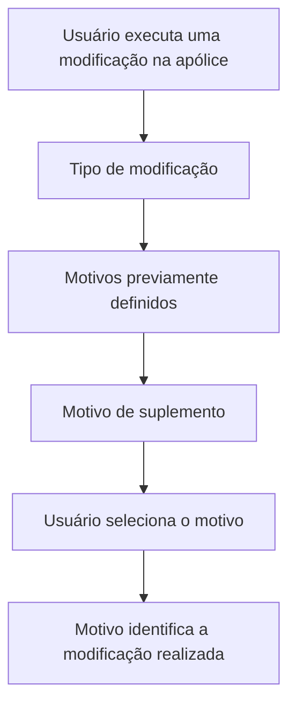

# Motivo de Suplemento — Especificação Funcional de Seleção de Causa para Modificação de Apólice

## 1. Metadados do Documento
- **Arquivo de Origem:** Não identificado; conteúdo fornecido como texto bruto.
- **Tipo de Documento:** Especificação Funcional.
- **Domínio / Sistema:** Modificação de apólice / Suplemento.
- **Público-Alvo:** Desenvolvedores, analistas funcionais, operação e negócio.
- **Data/Versão Identificada:** Não identificada.

---

## 2. Resumo Executivo & Contexto de Negócio

O documento descreve a funcionalidade **Motivo de Suplemento**, utilizada para identificar a causa pela qual uma modificação é realizada em uma apólice. A funcionalidade permite que o usuário selecione um motivo associado à alteração aplicada à apólice.

Os motivos disponíveis não são descritos individualmente no conteúdo fornecido. O documento informa que os motivos são previamente definidos e dependem do tipo de modificação que está sendo executada sobre a apólice.

A interação funcional indicada consiste na seleção de um motivo para identificar a modificação realizada. A seção “Proceso a seguir” informa que a seguir seria detalhada a informação requerida, porém o conteúdo fornecido não contém esse detalhamento.

O texto também apresenta a ação “CREAR”, mas não especifica seu comportamento, critérios de habilitação, dados requeridos, persistência, validações ou consequências no processo de modificação da apólice.

---

## 3. Arquitetura, Componentes & Tecnologias Envolvidas

O conteúdo fornecido não descreve arquitetura de software, serviços, APIs, tecnologias, bancos de dados, integrações, ambientes ou contratos técnicos.

Os elementos funcionais explicitamente identificados são:

| Componente / Elemento | Descrição sustentada pelo documento |
| :--- | :--- |
| Motivo de suplemento | Propriedade que apresenta motivos selecionáveis para o tipo de modificação realizado na apólice. |
| Modificação de apólice | Alteração executada sobre uma apólice, cuja causa deve ser identificada mediante um motivo. |
| Seleção | Ação que permite selecionar o motivo que identifica a modificação realizada. |
| CREAR | Ação listada no documento, sem comportamento detalhado. |
| Zeus | Termo exibido na navegação ou interface; o documento não explica seu papel funcional ou técnico. |



> **Nota de Análise:** O diagrama representa exclusivamente a relação funcional descrita no texto. O documento não detalha sistemas responsáveis, persistência de dados, APIs, validações ou etapas posteriores à seleção.

---

## 4. Regras de Negócio, Especificações Funcionais & Processos

### Regras de negócio identificadas

1. O **Motivo de Suplemento** permite selecionar a causa pela qual uma modificação é realizada em uma apólice.
2. Os motivos que podem ser identificados são previamente definidos.
3. A disponibilidade dos motivos depende do tipo de modificação que está sendo executada.
4. A propriedade **Motivo de suplemento** mostra os motivos que podem ser selecionados para o tipo de modificação realizado na apólice.
5. A ação de **Seleção** permite escolher o motivo que identifica a modificação realizada.
6. A ação **CREAR** é apresentada como possível ação, mas o conteúdo não define seu fluxo, finalidade ou resultado.

### Fluxo funcional extraído

1. Uma modificação é executada sobre uma apólice.
2. O tipo de modificação determina quais motivos previamente definidos podem ser exibidos.
3. A propriedade **Motivo de suplemento** apresenta os motivos disponíveis.
4. O usuário realiza a seleção de um motivo.
5. O motivo selecionado identifica a modificação realizada na apólice.

### Restrições e lacunas documentais

- O documento não informa se a seleção do motivo é obrigatória.
- O documento não informa se pode haver mais de um motivo selecionado.
- O documento não informa os valores possíveis para os motivos.
- O documento não detalha critérios de validação, mensagens de erro ou comportamento para ausência de seleção.
- O documento não detalha a ação **CREAR**.
- O documento não apresenta métodos HTTP, contratos JSON, endpoints, integrações ou modelo de persistência.

---

## 5. Tabelas de Parâmetros, Ambientes e Estruturas de Dados

| Item / Parâmetro | Descrição / Função | Tipo / Valores / Formato | Ambiente / Observações |
| :--- | :--- | :--- | :--- |
| Motivo de suplemento | Exibe os motivos selecionáveis para o tipo de modificação realizado na apólice. | Lista de motivos previamente definidos; valores não informados. | Dependente do tipo de modificação. |
| Tipo de modificação | Contexto que determina os motivos disponíveis para seleção. | Não informado. | Aplicado durante a modificação da apólice. |
| Seleção | Permite escolher o motivo que identifica a modificação realizada. | Controle de seleção; formato não informado. | Não há detalhamento sobre obrigatoriedade ou seleção múltipla. |
| CREAR | Ação possível listada no documento. | Não informado. | Sem descrição de comportamento, condições ou efeitos. |
| Apólice | Entidade de negócio que sofre a modificação identificada por um motivo. | Não informado. | Não há estrutura de dados descrita. |
| Zeus | Termo exibido no conteúdo de navegação/interface. | Não informado. | Papel não detalhado no documento. |

---

## 6. Bateria de Perguntas & Respostas para RAG (FAQ Sintético)

### P1: Qual é a finalidade do campo Motivo de Suplemento?
**R:** O campo ou propriedade **Motivo de Suplemento** permite selecionar a causa pela qual uma modificação é realizada em uma apólice. O motivo selecionado identifica a modificação aplicada.

### P2: Como os motivos de suplemento são disponibilizados para o usuário?
**R:** Os motivos são previamente definidos e são apresentados na propriedade **Motivo de suplemento** de acordo com o tipo de modificação que está sendo realizado na apólice.

### P3: O tipo de modificação influencia os motivos de suplemento disponíveis?
**R:** Sim. O documento informa que os motivos identificáveis dependem do tipo de modificação que está sendo executado na apólice.

### P4: O que acontece ao selecionar um motivo de suplemento?
**R:** A seleção permite escolher o motivo que identifica a modificação realizada na apólice. O documento não detalha etapas posteriores, persistência ou validações associadas à seleção.

### P5: Quais são os valores possíveis para Motivo de Suplemento?
**R:** O documento afirma que os motivos são previamente definidos, mas não apresenta a lista de valores possíveis para **Motivo de Suplemento**.

### P6: A seleção de um motivo de suplemento é obrigatória?
**R:** O conteúdo fornecido não informa se a seleção do motivo é obrigatória, opcional ou condicionada por regras adicionais.

### P7: É possível selecionar mais de um motivo de suplemento?
**R:** O documento menciona a seleção de “el motivo”, no singular, mas não estabelece explicitamente se o componente permite uma única seleção ou múltiplas seleções.

### P8: O que significa a ação CREAR no processo de Motivo de Suplemento?
**R:** A ação **CREAR** aparece na seção de possíveis ações, porém o documento não explica sua finalidade, seus dados de entrada, critérios de execução ou resultado.

### P9: O documento especifica APIs ou contratos técnicos para Motivo de Suplemento?
**R:** Não. O conteúdo não descreve endpoints, métodos HTTP, payloads JSON, serviços, integrações, persistência de dados ou tecnologias associadas à funcionalidade.

### P10: Qual entidade de negócio é alterada pelo processo descrito?
**R:** A entidade de negócio explicitamente mencionada é a **apólice**. O motivo de suplemento identifica a causa de uma modificação realizada nessa apólice.

---

## 7. Glossário de Termos, Siglas & Conceitos-Chave

- **Apólice:** Entidade de negócio mencionada como objeto da modificação.
- **Motivo de suplemento:** Motivo selecionável que identifica a causa de uma modificação realizada em uma apólice.
- **Modificação:** Alteração executada sobre uma apólice.
- **Seleção:** Ação que permite escolher o motivo que identifica a modificação realizada.
- **CREAR:** Ação listada como possível no documento; sem definição funcional adicional.
- **Zeus:** Termo apresentado na interface ou navegação do conteúdo; sem explicação no documento.

---

## 8. Notas Críticas, Riscos & Limitações

- **Detalhamento insuficiente da ação CREAR:** A ação é citada, mas não possui descrição funcional, técnica ou operacional.
- **Ausência de catálogo de motivos:** Os motivos são declarados como previamente definidos, porém seus valores, descrições e critérios de disponibilidade não são apresentados.
- **Ausência de validações:** Não há regras sobre obrigatoriedade, seleção múltipla, mensagens de erro ou tratamento de motivos indisponíveis.
- **Ausência de especificação técnica:** O documento não apresenta APIs, métodos HTTP, contratos, estruturas de dados, persistência, integrações, ambientes ou logs.
- **Ausência de detalhamento processual:** A seção “Proceso a seguir” indica que informações requeridas seriam apresentadas, mas essas informações não constam no texto fornecido.
- **Nota de Análise:** O documento lista o termo “Zeus”, porém não detalha se Zeus é um sistema, módulo, ambiente ou item de navegação.

---

## 9. Conteúdo Bruto Estruturado (Referência Fiel)

```text
--- [PÁGINA 1 DE 2] ---

EN CONSTRUCCIÓN
MOTIVO SUPLEMENTO
En que consiste
Permite seleccionar la causa por la que se realiza una modificación a la póliza.
Los motivos que se pueden identificar están previamente definidos y dependen del tipo de
modificación que se esté ejecutando.
Posibles acciones
 CREAR ( )
Proceso a seguir
A continuación se detalla la información requerida.
 / 
 RS
Inicio Soluciones APIs Documentación Zeus
ES


--- [PÁGINA 2 DE 2] ---

Motivo de suplemento
En esta propiedad se muestran los motivos que pueden ser seleccionados para el tipo de
modificación que se está realizando a la póliza.
Selección (  )
Permite seleccionar el motivo que identifica la modificación realizada.
```
