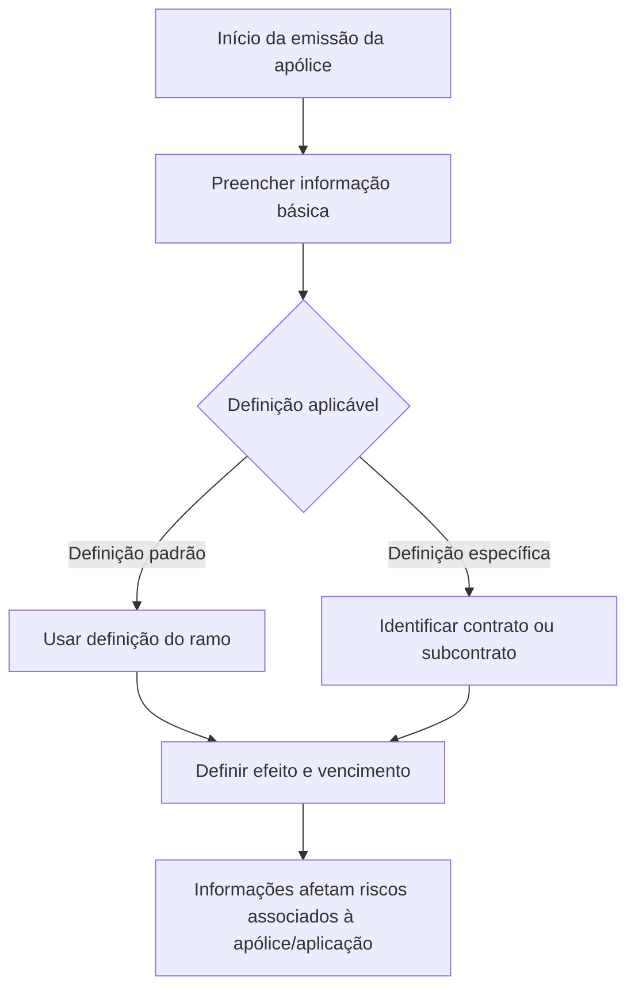

# Emissão de Apólices — Informação Básica, Contrato, Subcontrato e Vigência

## 1. Metadados do Documento
- **Arquivo de Origem:** `Não identificado`
- **Tipo de Documento:** `Manual Operacional`
- **Domínio / Sistema:** `Emissão de apólices de seguros`
- **Público-Alvo:** `Operação, Negócio, Analistas Funcionais`
- **Data/Versão Identificada:** `Não identificada`

---

## 2. Resumo Executivo & Contexto de Negócio

O documento descreve a seção de **informação básica** usada durante a emissão de uma apólice. Essa seção determina se a definição aplicável será a definição padrão do ramo ou uma definição específica associada a contrato ou subcontrato.

As informações básicas definem o efeito e o vencimento da apólice. Segundo o documento, essas informações impactam todos os possíveis riscos associados à apólice ou à aplicação.

O processo apresentado inclui a identificação de apólice de grupo, contrato, subcontrato, número de apólice, tipo de apólice, data de efeito e data de vencimento. O texto caracteriza contrato e subcontrato como mecanismos para aplicar condições especiais ou específicas.

O documento menciona que o número da apólice pode ser atribuído automaticamente ou previamente reservado. Também estabelece que o tipo de apólice é um atributo específico de transportes e que, para ramos com tratamento distinto, o valor é `FIJO`.

---

## 3. Arquitetura, Componentes & Tecnologias Envolvidas

O conteúdo não apresenta arquitetura técnica, microsserviços, contratos de API, tecnologias, servidores, ambientes ou integrações entre sistemas.

Os elementos funcionais identificados são:

| Componente / Conceito | Papel identificado |
| :--- | :--- |
| Informação básica | Área em que se decide entre definição padrão por ramo ou definição específica por contrato/subcontrato. |
| Ramo | Origem da definição padrão aplicável à apólice. |
| Contrato | Identifica condições especiais da apólice. |
| Subcontrato | Define condições específicas para um contrato selecionado. |
| Apólice de grupo | Indica se a apólice emitida adere a um grupo. |
| Riscos | Elementos potencialmente associados à apólice ou aplicação e afetados pelas informações básicas. |
| Zeus | Termo presente na navegação exibida no conteúdo, sem detalhamento funcional ou técnico. |



> **Nota de Análise:** O documento não detalha interfaces, métodos HTTP, contratos JSON, persistência de dados, tecnologia de implementação ou relacionamento técnico entre os itens exibidos na navegação, incluindo `Zeus`.

---

## 4. Regras de Negócio, Especificações Funcionais & Processos

1. A seção de informação básica é o local em que se decide utilizar:
   - a definição padrão do ramo; ou
   - uma definição específica de contrato ou subcontrato.

2. A informação básica também determina:
   - o efeito da apólice;
   - o vencimento da apólice.

3. As informações definidas nessa seção afetam todos os possíveis riscos associados à apólice ou à aplicação.

4. O campo **Póliza grupo** especifica se a apólice a ser emitida adere a um grupo.

5. O campo **Contrato** identifica se a apólice possui condições especiais.

6. O campo **Subcontrato** estabelece se a apólice possui condições específicas para o contrato informado.

7. A configuração de subcontrato somente é possível se houver um contrato selecionado.

8. O campo **Nº de póliza** contém o identificador da apólice em emissão.

9. O número da apólice pode:
   - ser obtido automaticamente; ou
   - ter sido reservado previamente.

10. O campo **Tipo de póliza** é um atributo específico de transportes.

11. Para ramos com tratamento distinto, o valor do tipo de apólice é `FIJO`.

12. A **Fecha de efecto** especifica a data em que começa a cobertura do risco ou dos riscos.

13. A data de efeito pode ser limitada por definição, sem que o documento especifique a regra, a fonte da definição ou os limites aplicáveis.

14. A **Fecha de vencimiento** contém a data em que a apólice vence.

15. A data de vencimento influencia adicionalmente a duração da apólice.

---

## 5. Tabelas de Parâmetros, Ambientes e Estruturas de Dados

| Item / Parâmetro | Descrição / Função | Tipo / Valores / Formato | Ambiente / Observações |
| :--- | :--- | :--- | :--- |
| Informação básica | Define a utilização de definição padrão por ramo ou específica por contrato/subcontrato; determina efeito e vencimento. | Não informado | Afeta possíveis riscos associados à apólice/aplicação. |
| Póliza grupo | Especifica se a apólice em emissão adere a um grupo. | Não informado | Não há valores permitidos detalhados. |
| Contrato | Identifica se a apólice possui condições especiais. | Não informado | Pode habilitar a definição de subcontrato. |
| Subcontrato | Estabelece condições específicas para um contrato. | Não informado | Só é possível se um contrato tiver sido selecionado. |
| Nº de póliza | Identificador da apólice que está sendo emitida. | Número obtido automaticamente ou reservado previamente | Não há formato, tamanho ou regra de unicidade especificados. |
| Tipo de póliza | Atributo específico de transportes. | `FIJO` para ramos com tratamento distinto | Outros valores não são detalhados. |
| Fecha de efecto | Data de início da cobertura do risco ou dos riscos. | Data | Pode ser limitada mediante definição não detalhada. |
| Fecha de vencimiento | Data de vencimento da apólice. | Data | Influencia a duração da apólice. |
| Ramo | Fonte da definição padrão aplicável. | Não informado | O documento não lista ramos ou suas definições. |
| Riscos | Possíveis riscos associados à apólice ou aplicação. | Não informado | São afetados pelas informações básicas. |
| Zeus | Item mencionado na navegação textual. | Não informado | Sem explicação funcional ou técnica. |

---

## 6. Bateria de Perguntas & Respostas para RAG (FAQ Sintético)

### P1: Onde é definida a utilização da definição padrão do ramo ou da definição específica de contrato/subcontrato?
**R:** A decisão é tomada na seção de **informação básica** da emissão da apólice. Essa seção permite determinar se será usada a definição padrão do ramo ou uma definição específica vinculada a contrato ou subcontrato.

### P2: Quais informações da apólice são determinadas na seção de informação básica?
**R:** A seção de informação básica determina a definição aplicável, o efeito da apólice e o vencimento da apólice. O documento informa que essas informações afetam todos os possíveis riscos associados à apólice ou à aplicação.

### P3: O que indica o campo Póliza grupo?
**R:** O campo **Póliza grupo** especifica se a apólice que será emitida adere a um grupo. O documento não detalha os valores possíveis nem o impacto operacional dessa adesão.

### P4: Qual é a finalidade do campo Contrato na emissão de apólice?
**R:** O campo **Contrato** identifica se a apólice possui condições especiais. O documento não especifica quais condições especiais podem existir nem como são configuradas.

### P5: Quando o campo Subcontrato pode ser utilizado?
**R:** O campo **Subcontrato** pode ser utilizado quando houver um contrato selecionado. Ele estabelece condições específicas para o contrato informado.

### P6: Como o número da apólice pode ser atribuído?
**R:** O **Nº de póliza** pode ser obtido automaticamente ou pode ter sido reservado previamente. O texto não descreve o mecanismo de reserva nem a origem da numeração automática.

### P7: Qual é o valor do tipo de apólice para ramos com tratamento distinto?
**R:** Para ramos com tratamento distinto, o valor do campo **Tipo de póliza** é `FIJO`. O documento informa que esse campo é um atributo específico de transportes.

### P8: O que representa a data de efeito da apólice?
**R:** A **Fecha de efecto** representa a data em que começa a cobertura do risco ou dos riscos. Essa data pode ser limitada mediante definição, mas o documento não especifica a definição responsável pela limitação.

### P9: Qual é a influência da data de vencimento na apólice?
**R:** A **Fecha de vencimiento** contém a data em que a apólice vence e também influencia a duração da apólice.

### P10: As informações básicas afetam somente a apólice?
**R:** Não. O documento declara que as informações básicas afetam todos os possíveis riscos associados à apólice ou à aplicação.

---

## 7. Glossário de Termos, Siglas & Conceitos-Chave

- **Apólice / Póliza:** Registro em emissão que possui identificação, condições, datas de efeito e vencimento.
- **Apólice de grupo / Póliza grupo:** Indicador de que a apólice em emissão adere a um grupo.
- **Contrato:** Elemento que identifica se a apólice possui condições especiais.
- **Subcontrato:** Elemento que estabelece condições específicas para um contrato selecionado.
- **Ramo:** Origem da definição padrão que pode ser utilizada na emissão da apólice.
- **Risco:** Risco ou conjunto de riscos cuja cobertura se inicia na data de efeito e que é afetado pelas informações básicas.
- **Efeito:** Início da cobertura da apólice para o risco ou riscos.
- **Vencimento:** Data em que a apólice vence e que influencia sua duração.
- **FIJO:** Valor indicado pelo documento para o tipo de apólice em ramos com tratamento distinto.
- **Zeus:** Termo exibido na navegação do conteúdo original; não há definição adicional no documento.

---

## 8. Notas Críticas, Riscos & Limitações

- O conteúdo é estritamente funcional e não fornece arquitetura técnica, integrações, APIs, banco de dados, ambientes, servidores ou rotas de log.
- O documento não informa os valores válidos, obrigatoriedade, formato ou regras de validação dos campos apresentados.
- A limitação aplicável à data de efeito é mencionada, mas a definição que impõe essa limitação não é identificada.
- O documento não descreve como ocorre a reserva prévia do número da apólice, nem como o identificador é obtido automaticamente.
- O texto informa o valor `FIJO` para ramos com tratamento distinto, mas não define quais ramos se enquadram nessa condição.
- O item `Zeus` aparece apenas na navegação; não há detalhamento sobre seu papel no processo de emissão.

---

## 9. Conteúdo Bruto Estruturado (Referência Fiel)

```text
--- [PÁGINA 1 DE 2] ---

INFORMACIÓN BÁSICA
¿En que consiste?
Lugar donde se decide utilizar la definición estándar (ramo) o específica (contrato o sub-contrato),
además de determinar el efecto y el vencimiento de la póliza. Esta información afecta a todos los
posibles riesgos que se asocien a la póliza/aplicación.
Proceso a seguir
A continuación detalla la información requerida.
Póliza grupo (   )
Especifica si la póliza que se va a emitir se adhiere a un grupo o no.
 /
 RS
Inicio Soluciones APIs Documentación Zeus
ES


--- [PÁGINA 2 DE 2] ---

Contrato (   )
Identifica si la póliza tiene condiciones especiales.
Subcontrato (   )
Establece si la póliza tiene condiciones específicas para el contrato dado. Esto es posible si se ha
seleccionado un contrato.
Nº de póliza (   )
Contiene el identificador de la póliza que se está emitiendo. Este número puede ser tomado de forma
automática o puede haber sido reservado previamente.
Tipo de póliza (   )
Este tipo es un atributo específico de trasportes. Para los ramos con un tratamiento distinto, el valor
es "FIJO".
Fecha de efecto (  )
Especifica la fecha en la que comienza la cobertura al riesgo (o riesgos). Esta fecha puede limitarse
mediante definición.
Fecha de vencimiento (  )
Contiene la fecha en la que la póliza vence. Adicionalmente, testa fecha influye en la duración de la
póliza.
```
