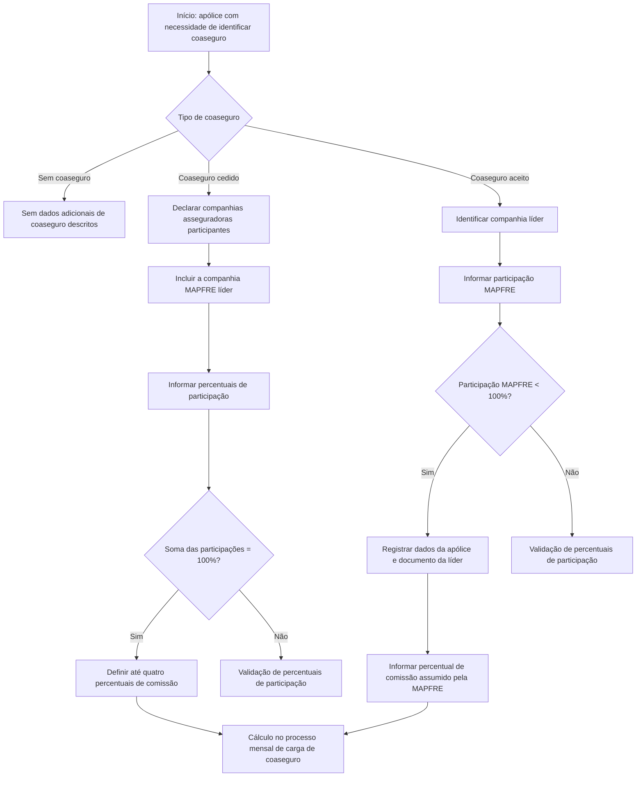

# Coaseguro — Regras Funcionais, Dados Operacionais e Cálculo de Comissões

## 1. Metadados do Documento
- **Arquivo de Origem:** Não identificado
- **Tipo de Documento:** Manual Operacional / Especificação Funcional
- **Domínio / Sistema:** Coaseguro de apólices MAPFRE
- **Público-Alvo:** Negócio, operação, analistas funcionais e desenvolvedores
- **Data/Versão Identificada:** Não identificada

---

## 2. Resumo Executivo & Contexto de Negócio

O documento descreve o tratamento de **coaseguro** em apólices nas quais o risco é compartilhado entre companhias seguradoras. O cenário ocorre quando parte do risco assumido pela companhia líder é cedida a outras companhias designadas pelo tomador do seguro, ou quando a MAPFRE é uma companhia designada, mas não atua como líder.

A modalidade de coaseguro permitida é determinada pela definição do ramo. O processo funcional começa pela identificação do tipo de coaseguro aplicável à apólice: **coaseguro cedido**, **coaseguro aceito** ou **sem coaseguro**.

No coaseguro cedido, devem ser informadas todas as companhias participantes, inclusive a companhia MAPFRE que atua como líder. A distribuição de participação impacta tanto o prêmio quanto os sinistros, e a soma das participações deve ser exatamente igual a 100%.

No coaseguro aceito, a companhia líder é identificada e a participação registrada corresponde apenas à participação da MAPFRE. Nesse caso, o percentual de participação MAPFRE deve ser menor que 100%, pois não representa a distribuição completa entre todas as seguradoras.

O documento também estabelece regras para comissões de coaseguro. Os percentuais de comissão podem cobrir comissão do agente, gastos, recargos ou outros importes acordados. O cálculo é realizado no processo mensal de carga de coaseguro, salvo quando o ramo indicar outro processo externo ao padrão.

---

## 3. Arquitetura, Componentes & Tecnologias Envolvidas

O conteúdo não descreve arquitetura técnica de software, APIs, protocolos, bases de dados, URLs, ambientes ou tecnologias. A estrutura apresentada é funcional e orientada ao fluxo de tratamento do coaseguro em uma apólice MAPFRE.

### Componentes funcionais identificados

| Componente / Conceito | Papel no processo |
| :--- | :--- |
| Apólice | Unidade de seguro à qual o coaseguro é associado. |
| MAPFRE | Companhia que pode atuar como líder no coaseguro cedido ou como participante no coaseguro aceito. |
| Tomador do seguro | Parte que pode designar as companhias participantes do coaseguro. |
| Companhia líder | Companhia que lidera a apólice; no coaseguro aceito, comunica os movimentos da apólice. |
| Companhia asseguradora | Entidade participante do coaseguro; precisa existir previamente como seguradora. |
| Ramo | Definição que determina o tipo de coaseguro permitido e pode indicar processo externo de cálculo de comissão. |
| Quadro de coaseguro | Chave que identifica uma distribuição de coaseguro previamente definida. |
| Processo de carga mensal de coaseguro | Processo padrão no qual são calculadas as comissões de coaseguro. |
| Documento de movimentos | Documento pelo qual a seguradora líder comunica movimentos da apólice no coaseguro aceito. |



> **Nota de Análise:** O documento apresenta o fluxo funcional de coaseguro, mas não detalha sistemas, microsserviços, métodos HTTP, contratos JSON, persistência de dados ou integrações técnicas.

---

## 4. Regras de Negócio, Especificações Funcionais & Processos

### 4.1 Definição de coaseguro

Coaseguro é utilizado nas seguintes situações:

1. Parte do risco assumido pela companhia líder é cedida a outras companhias designadas pelo tomador do seguro.
2. A MAPFRE é uma das companhias designadas pelo tomador do seguro, mas não é a companhia líder.

O tipo de coaseguro permitido é determinado pela definição do ramo.

### 4.2 Identificação do tipo de coaseguro

A apólice deve identificar uma das seguintes modalidades:

- **Coaseguro cedido**
- **Coaseguro aceito**
- **Sem coaseguro**

O campo **Tipo de coaseguro** informa a modalidade aplicável à apólice conforme a forma de participação da MAPFRE.

### 4.3 Quadro de coaseguro

O campo **Quadro de coaseguro** permite registrar a chave que identifica uma distribuição de coaseguro previamente definida.

Quando um quadro de coaseguro é indicado:

1. A informação da distribuição deve ser obtida do quadro informado.
2. A distribuição não pode ser modificada.
3. A distribuição é apresentada somente em modo de consulta.

### 4.4 Coaseguro cedido

O processo de coaseguro cedido contempla as ações:

- Criar
- Modificar
- Excluir

Para cada participação de coaseguro cedido:

1. Todas as companhias asseguradoras participantes devem ser declaradas.
2. A companhia MAPFRE que atua como líder deve ser incluída entre as companhias declaradas.
3. Todas as companhias participantes, incluindo a própria companhia MAPFRE, devem existir previamente como seguradoras.
4. O percentual de participação de cada seguradora afeta tanto o prêmio quanto os sinistros.
5. A soma dos percentuais de participação de todas as seguradoras, incluindo a companhia MAPFRE líder, deve ser sempre igual a 100%.
6. Podem ser considerados até quatro percentuais de comissão distintos.
7. Os percentuais de comissão são usados para repercutir às seguradoras a parte correspondente à comissão do agente, gastos, recargos ou qualquer outro importe.
8. A comissão é calculada com base nos conceitos econômicos definidos para aplicação no cálculo de comissão de coaseguro.
9. O cálculo de comissão é executado dentro do processo de carga mensal de coaseguro.
10. Quando houver outro processo externo ao padrão, esse processo deve ser indicado no ramo.

### 4.5 Coaseguro aceito

No coaseguro aceito:

1. A companhia asseguradora informada identifica a companhia líder da apólice.
2. A companhia líder deve estar previamente definida como companhia asseguradora.
3. O percentual de participação corresponde à participação da MAPFRE no prêmio e nos sinistros da apólice.
4. O percentual de participação MAPFRE deve ser menor que 100%, pois contém apenas a participação da MAPFRE.
5. O número de apólice identifica a apólice na companhia líder.
6. O número de suplemento identifica o número do movimento da apólice na companhia líder.
7. O identificador registra o identificador do documento pelo qual a companhia líder comunica os movimentos da apólice.
8. Dia, mês e ano identificam a data de recebimento do documento que comunica o movimento.
9. O percentual de comissão registra a parcela que a MAPFRE deve assumir relativa à comissão do agente, gastos, recargos ou outro importe acordado.
10. A comissão é calculada com base nos conceitos econômicos determinados na definição aplicável ao cálculo de comissão de coaseguro.
11. O cálculo ocorre no processo mensal de carga de coaseguro, exceto se o ramo indicar um processo externo ao padrão.

> **Nota de Análise:** O documento menciona “validação de percentuais de participação”, mas não descreve mensagens de erro, lógica técnica de validação ou comportamento do sistema diante de valores inválidos.

---

## 5. Tabelas de Parâmetros, Ambientes e Estruturas de Dados

| Item / Parâmetro | Descrição / Função | Tipo / Valores / Formato | Ambiente / Observações |
| :--- | :--- | :--- | :--- |
| Tipo de coaseguro | Indica o coaseguro da apólice conforme a participação da MAPFRE. | Coaseguro cedido; coaseguro aceito; sem coaseguro. | O tipo permitido é determinado pela definição do ramo. |
| Quadro de coaseguro | Registra a chave que identifica uma distribuição de coaseguro previamente definida. | Chave de quadro. | Quando informado, a distribuição é obtida do quadro, não pode ser alterada e é exibida em consulta. |
| Companhia asseguradora — coaseguro cedido | Identifica uma companhia participante do coaseguro da apólice. | Chave de companhia asseguradora. | Devem ser declaradas todas as companhias, incluindo a MAPFRE líder. Todas precisam existir previamente como seguradoras. |
| Percentual de participação — coaseguro cedido | Define a participação da seguradora no prêmio e nos sinistros. | Percentual. | A soma dos percentuais de todas as seguradoras, incluindo MAPFRE líder, deve ser igual a 100%. |
| Percentuais de comissão — coaseguro cedido | Define importes de comissão a repercutir às seguradoras. | Até quatro percentuais distintos. | Pode abranger comissão do agente, gastos, recargos ou outros importes. |
| Companhia asseguradora — coaseguro aceito | Identifica a companhia líder da apólice. | Chave de companhia asseguradora. | A companhia líder deve estar previamente definida como seguradora. |
| Percentual de participação — coaseguro aceito | Define a participação MAPFRE no prêmio e nos sinistros. | Percentual menor que 100%. | O valor representa somente a participação MAPFRE. |
| Número de apólice | Identifica a apólice na companhia líder. | Número / chave de apólice. | Aplicável ao coaseguro aceito. |
| Número de suplemento | Identifica o número do movimento da apólice na companhia líder. | Número de movimento. | Aplicável ao coaseguro aceito. |
| Identificador | Registra o identificador do documento de comunicação de movimentos enviado pela companhia líder. | Identificador de documento. | Aplicável ao coaseguro aceito. |
| Dia | Identifica o dia de recebimento do documento de movimento. | Dia. | Aplicável ao coaseguro aceito. |
| Mês | Identifica o mês de recebimento do documento de movimento. | Mês. | Aplicável ao coaseguro aceito. |
| Ano | Identifica o ano de recebimento do documento de movimento. | Ano. | Aplicável ao coaseguro aceito. |
| Percentual de comissão — coaseguro aceito | Define o percentual que a MAPFRE deve assumir. | Percentual. | Relativo à comissão do agente, gastos, recargos ou outro importe acordado. |
| Conceitos econômicos | Base para cálculo da comissão de coaseguro. | Conceitos definidos na definição aplicável. | O documento não detalha quais conceitos econômicos podem ser configurados. |
| Processo de carga mensal de coaseguro | Executa o cálculo de comissões de coaseguro. | Processo mensal. | Pode existir processo externo ao padrão, indicado no ramo. |

---

## 6. Bateria de Perguntas & Respostas para RAG (FAQ Sintético)

### P1: Quando o coaseguro deve ser utilizado em uma apólice?
**R:** O coaseguro é utilizado quando parte do risco assumido pela companhia líder é cedida a outras companhias designadas pelo tomador do seguro, ou quando a MAPFRE participa como companhia designada, mas não atua como líder da apólice.

### P2: Quais tipos de coaseguro podem ser identificados para uma apólice?
**R:** O documento apresenta três possibilidades: coaseguro cedido, coaseguro aceito e sem coaseguro. O tipo de coaseguro permitido é determinado pela definição do ramo.

### P3: O que ocorre quando um quadro de coaseguro é informado?
**R:** Quando um quadro de coaseguro é informado, a distribuição de coaseguro é obtida do quadro previamente definido. Essa distribuição não pode ser modificada e é exibida somente em modo de consulta.

### P4: Quais companhias devem ser declaradas no coaseguro cedido?
**R:** No coaseguro cedido, devem ser declaradas todas as companhias asseguradoras participantes da apólice, incluindo a companhia MAPFRE que atua como líder. Todas as companhias participantes devem existir previamente como seguradoras.

### P5: Qual é a regra de validação dos percentuais de participação no coaseguro cedido?
**R:** A soma dos percentuais de participação de todas as seguradoras participantes, incluindo a companhia MAPFRE que atua como líder, deve ser sempre igual a 100%.

### P6: O percentual de participação da MAPFRE pode ser 100% no coaseguro aceito?
**R:** Não. No coaseguro aceito, o percentual de participação representa apenas a participação da MAPFRE no prêmio e nos sinistros da apólice; portanto, esse percentual deve ser menor que 100%.

### P7: Para que servem os percentuais de comissão no coaseguro cedido?
**R:** Os percentuais de comissão são utilizados para repercutir às seguradoras a parte correspondente à comissão do agente, gastos, recargos ou qualquer outro importe. O documento prevê até quatro percentuais de comissão distintos.

### P8: Como é calculada a comissão de coaseguro?
**R:** A comissão é calculada com base nos conceitos econômicos definidos para aplicação no cálculo de comissão de coaseguro. O cálculo é realizado dentro do processo de carga mensal de coaseguro, salvo quando o ramo indicar outro processo externo ao padrão.

### P9: Quais dados identificam os movimentos comunicados pela companhia líder no coaseguro aceito?
**R:** No coaseguro aceito, devem ser registrados o número de apólice na companhia líder, o número de suplemento correspondente ao movimento, o identificador do documento comunicado pela líder e o dia, mês e ano de recebimento desse documento.

### P10: O que representa a companhia asseguradora no coaseguro aceito?
**R:** No coaseguro aceito, a companhia asseguradora identifica a companhia líder da apólice. Essa companhia líder deve estar previamente definida como companhia asseguradora.

---

## 7. Glossário de Termos, Siglas & Conceitos-Chave

- **MAPFRE:** Companhia seguradora que pode atuar como líder no coaseguro cedido ou como participante no coaseguro aceito.
- **Coaseguro:** Compartilhamento do risco de uma apólice entre companhias seguradoras.
- **Coaseguro cedido:** Modalidade em que são declaradas todas as companhias participantes, incluindo a MAPFRE como companhia líder.
- **Coaseguro aceito:** Modalidade em que a MAPFRE possui participação em uma apólice liderada por outra companhia seguradora.
- **Companhia líder:** Companhia que lidera a apólice e, no coaseguro aceito, comunica os movimentos da apólice.
- **Tomador do seguro:** Parte que pode designar as companhias participantes do coaseguro.
- **Ramo:** Definição que determina o tipo de coaseguro permitido e pode indicar processo externo de cálculo de comissão.
- **Quadro de coaseguro:** Distribuição de coaseguro previamente definida e identificada por uma chave.
- **Prêmio:** Elemento econômico da apólice afetado pelo percentual de participação de cada seguradora.
- **Sinistros:** Ocorrências ou indenizações da apólice afetadas pelo percentual de participação de cada seguradora.
- **Suplemento:** Número do movimento associado à apólice na companhia líder.
- **Recargos:** Importes que podem compor a comissão assumida ou repercutida no coaseguro.

---

## 8. Notas Críticas, Riscos & Limitações

- O documento não identifica arquivo de origem, data, versão, autor, sistema de origem ou ambiente operacional.
- Não há detalhamento de APIs, serviços, contratos de integração, bancos de dados, telas, permissões ou mecanismos de auditoria.
- O documento menciona validação de percentuais de participação, mas não especifica comportamento de erro, regras de arredondamento, quantidade de casas decimais ou tratamento de inconsistências.
- O documento não detalha quais são os “conceitos econômicos” utilizados na base de cálculo da comissão de coaseguro.
- Não são definidos os critérios para criação, modificação e exclusão no coaseguro cedido, embora essas ações sejam listadas.
- A existência de processo externo ao padrão para cálculo de comissão depende de indicação no ramo; o documento não descreve como essa indicação é configurada ou executada.
- Não há explicação adicional para a modalidade “sem coaseguro”.

---

## 9. Conteúdo Bruto Estruturado (Referência Fiel)

```text
--- [PÁGINA 1 DE 5] ---

COASEGURO
En que consiste
Cuando parte del riesgo que asume la compañía líder se cede a otras compañías que han sido
designadas por el tomador del seguro o, MAPFRE es una de las compañías designadas por el
tomador, pero no es la compañía líder, se utiliza este apartado.
El tipo de coaseguro que se permite lo determina la definición del ramo.
Proceso a seguir
Identificar
tipo coaseguro
Coaseguro
cedido
Coaseguro
aceptado
Sin coaseguro
- Identificar tipo de coaseguro
- Coaseguro cedido
- Coaseguro aceptado
 /
 RS
Inicio Soluciones APIs Documentación Zeus
ES


--- [PÁGINA 2 DE 5] ---

Identificar tipo de coaseguro
A continuación se detalla la información requerida.
Tipo de coaseguro (   )
Indica el coaseguro de la póliza, según la forma en la que participe MAPFRE.
Cuadro de coaseguro (   )
Permite registrar la clave que identifica una distribución de coaseguro previamente definida.
En caso de indicar un cuadro, la información de la distribución se tomará de dicho cuadro y no se
podrá modificar, solamente se mostrará en modo consulta.
Coaseguro cedido
A continuación se detalla la información requerida.
Posibles acciones
 CREAR ( )
 MODIFICAR ( )
 BORRAR ( )


--- [PÁGINA 3 DE 5] ---

Compañía aseguradora (   )
Contiene la clave de la compañía que participa en el coaseguro de la póliza, se deben declarar todas
las compañías aseguradoras, incluida la compañía de MAPFRE que actúa como líder.
Las compañías que participan deben existir previamente como aseguradoras, incluida la propia
compañía MAPFRE.
Porcentaje de participación (  )
Establece la participación que tiene la aseguradora en la póliza, tanto en la prima como en los
siniestros.
La suma de los porcentajes de participación de las aseguradoras, incluida la compañía MAPFRE
que actúa como líder, debe ser siempre igual a 100.
Porcentajes de comisión (  )
Se contemplan hasta cuatro porcentajes de comisión distintos, que se utilizan para repercutir a las
aseguradoras la parte correspondiente a la comisión del agente, a gastos, recargos o cualquier otro
importe.
La comisión se calcula en base a los conceptos económicos, que se determine en la definición, que
aplican para el cálculo de comisión de coaseguro.
El cálculo de las comisiones se hace dentro del proceso de carga mensual de coaseguro. Si existe
otro proceso, externo al estándar, se indicará en el ramo.
Coaseguro aceptado
A continuación se detalla la información requerida.
validación de porcentajes de participación


--- [PÁGINA 4 DE 5] ---

Compañía aseguradora (   )
Identifica la compañía líder de la póliza, que debe estar definida previamente como compañía
aseguradora.
Porcentaje de participación (  )
Establece la participación de la compañía MAPFRE, tanto en la prima como en los siniestros de la
póliza.
El valor de este porcentaje debe ser menor a 100 ya que solo contiene la participación de
MAPFRE.
Número de póliza (  )
Recoge la clave con la que se identifica la póliza en la compañía líder.
Número de suplemento (  )
Indica el número del movimiento que tiene la póliza en la compañía líder.
Identificador (  )
La aseguradora líder comunica los movimientos de la póliza en un documento, en esta propiedad se
recoge el identificador de dicho documento.
Día (  )
Identifica el día de recepción del documento en el que se comunica el movimiento.
Mes (  )
Identifica el mes de recepción del documento en el que se comunica el movimiento.
Año (  )
Identifica el año de recepción del documento en el que se comunica el movimiento.
Porcentajes de comisión (  )
Contiene el porcentaje que debe asumir la compañía MAPFRE, de la comisión del agente, gastos,
recargos o cualquier otro importe que se haya acordado.
validación de porcentajes de participación


--- [PÁGINA 5 DE 5] ---

La comisión se calcula en base a los conceptos económicos, que se determine en la definición,
que aplican para el cálculo de comisión de coaseguro.
El cálculo de las comisiones se hace dentro del proceso de carga mensual de coaseguro. Si existe
otro proceso, externo al estándar, se indicará en el ramo.
cálculo de la comisión
```
