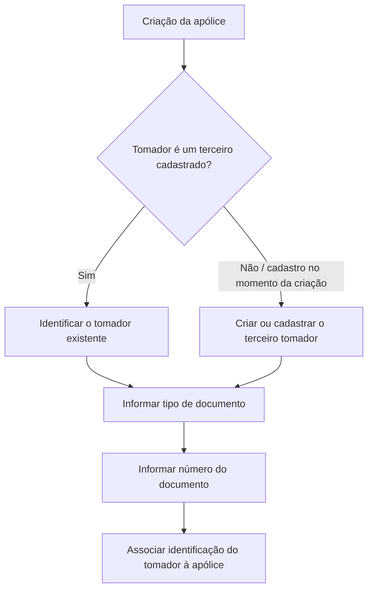

# Identificação do Tomador de Apólice — Procedimento e Dados Requeridos

## 1. Metadados do Documento
- **Arquivo de Origem:** Não identificado
- **Tipo de Documento:** Procedimento
- **Domínio / Sistema:** Criação de apólice / terceiro tomador
- **Público-Alvo:** Operação, negócio e desenvolvedores
- **Data/Versão Identificada:** Não identificada

---

## 2. Resumo Executivo & Contexto de Negócio

O documento descreve o processo de identificação do **tomador da apólice** durante a criação de uma apólice. O tomador deve ser um terceiro previamente cadastrado ou pode ser cadastrado no próprio momento da criação da apólice.

Para identificar o tomador, o procedimento exige informar o tipo de documento de identificação e o número correspondente. Os tipos de documento devem estar previamente definidos em documentação referenciada pelo conteúdo original.

O conteúdo também informa que existe uma consulta que permite acessar, modificar ou criar o tomador. Entretanto, o nome da consulta, a rota, os métodos HTTP, os contratos de entrada e saída e o comportamento completo quando o tomador não existe não foram detalhados no trecho fornecido.

---

## 3. Arquitetura, Componentes & Tecnologias Envolvidas

Componentes e conceitos identificados:

| Componente / Conceito | Papel identificado |
| :--- | :--- |
| Apólice | Entidade cuja criação requer a identificação de um tomador. |
| Tomador | Terceiro associado à apólice e identificado por documento. |
| Terceiro | Cadastro necessário para que uma entidade seja utilizada como tomador. |
| Tipo de documento | Classificação do documento que identifica o tomador. |
| Documento | Número do documento associado ao tipo de documento informado. |
| Consulta | Recurso mencionado para acessar, modificar ou criar o tomador. |
| Soluciones APIs / Documentación Zeus | Elementos textuais presentes no conteúdo bruto, sem detalhamento funcional adicional. |



> **Nota de Análise:** O documento menciona uma consulta para acessar, modificar ou criar o tomador, mas não informa seu nome, endpoint, parâmetros, métodos HTTP ou contratos JSON.

---

## 4. Regras de Negócio, Especificações Funcionais & Processos

1. O tomador da apólice deve ser identificado durante a criação da apólice.
2. O tomador deve ser um terceiro.
3. O terceiro tomador pode ter sido cadastrado antes da criação da apólice.
4. O terceiro tomador também pode ser cadastrado no momento da criação da apólice.
5. O campo de tipo de documento deve indicar o documento usado para identificar o tomador.
6. Os tipos de documento precisam estar previamente definidos conforme documentação referenciada pelo conteúdo original.
7. O campo de documento deve receber o número do documento relacionado ao tipo de documento selecionado.
8. É possível utilizar uma consulta para acessar, modificar ou criar o tomador.
9. O trecho fornecido inicia uma seção intitulada **“Si el tomador no existe”**, mas não apresenta o conteúdo subsequente do processo.

---

## 5. Tabelas de Parâmetros, Ambientes e Estruturas de Dados

| Item / Parâmetro | Descrição / Função | Tipo / Valores / Formato | Ambiente / Observações |
| :--- | :--- | :--- | :--- |
| Tomador | Terceiro que será identificado e associado à apólice. | Terceiro | Pode existir previamente ou ser cadastrado durante a criação da apólice. |
| Tipo de documento do terceiro | Define o documento usado para identificar o tomador. | Não detalhado | Os documentos devem estar previamente definidos em documentação referenciada. |
| Documento | Número de documento relacionado ao tipo de documento. | Não detalhado | Deve corresponder ao campo de tipo de documento. |
| Consulta | Permite acessar, modificar ou criar o tomador. | Não detalhado | Nome, rota e operação técnica não foram informados. |
| Soluciones APIs | Texto presente no rodapé ou navegação do conteúdo. | Não aplicável | Sem detalhamento adicional. |
| Documentación Zeus | Texto presente no rodapé ou navegação do conteúdo. | Não aplicável | Sem detalhamento adicional. |

---

## 6. Bateria de Perguntas & Respostas para RAG (FAQ Sintético)

### P1: O que é o tomador no processo de criação de uma apólice?
**R:** O tomador é o terceiro que deve ser identificado durante a criação da apólice. O documento estabelece que o tomador precisa corresponder a um terceiro cadastrado previamente ou cadastrado no próprio momento da criação da apólice.

### P2: O tomador precisa existir antes da criação da apólice?
**R:** Não necessariamente. O documento informa que o tomador pode ser um terceiro já cadastrado antes da criação da apólice ou pode ser cadastrado no momento em que a apólice é criada.

### P3: Quais informações são exigidas para identificar o tomador?
**R:** O procedimento solicita o tipo de documento do terceiro e o número do documento. O número informado no campo Documento deve estar relacionado ao tipo de documento selecionado.

### P4: Qual é a finalidade do campo tipo de documento do terceiro?
**R:** O campo tipo de documento do terceiro indica qual documento será usado para identificar o tomador da apólice.

### P5: O que deve ser preenchido no campo Documento?
**R:** O campo Documento deve conter o número do documento associado ao tipo de documento informado anteriormente.

### P6: Onde os tipos de documento permitidos são definidos?
**R:** O documento afirma que os tipos de documento devem estar previamente definidos conforme um enlace de referência. O conteúdo fornecido não inclui o endereço nem a lista desses documentos.

### P7: É possível alterar os dados de um tomador?
**R:** Sim. O documento informa que uma consulta pode ser utilizada para acessar o tomador, modificá-lo ou criá-lo. Não há detalhamento sobre como executar essa consulta.

### P8: O documento informa a API ou o endpoint para consulta do tomador?
**R:** Não. O texto apenas menciona a existência de uma consulta para acessar, modificar ou criar o tomador. Não foram apresentados endpoint, URL, método HTTP, autenticação ou contrato de dados.

### P9: O que acontece se o tomador não existir?
**R:** O conteúdo inicia uma seção chamada “Si el tomador no existe”, mas o procedimento correspondente não está presente no trecho fornecido. Só é possível afirmar que o documento prevê esse cenário, sem detalhar suas etapas.

### P10: O número do documento pode ser informado sem o tipo de documento?
**R:** O documento apresenta o número do documento como relacionado ao campo de tipo de documento anterior. Portanto, a identificação descrita requer ambos os dados em conjunto.

---

## 7. Glossário de Termos, Siglas & Conceitos-Chave

- **Apólice:** Entidade cuja criação demanda a identificação de um tomador.
- **Tomador:** Terceiro identificado e relacionado à apólice.
- **Terceiro:** Cadastro de uma entidade que pode assumir o papel de tomador.
- **Tipo de documento:** Classificação do documento usado para identificar o tomador.
- **Documento:** Número do documento associado ao tipo de documento informado.
- **Consulta:** Recurso mencionado para acessar, modificar ou criar o tomador.
- **Zeus:** Termo presente em “Documentación Zeus”; o significado não é detalhado no conteúdo.

---

## 8. Notas Críticas, Riscos & Limitações

- O nome do arquivo de origem não foi fornecido.
- Não foram identificados data, versão, autor ou organização responsável pelo documento.
- A lista de tipos de documento permitidos não está presente no conteúdo fornecido.
- A referência para a documentação de tipos de documento não contém URL visível.
- A consulta para acessar, modificar ou criar o tomador não possui nome, rota, método HTTP, parâmetros, autenticação ou contratos documentados.
- A seção sobre o cenário em que o tomador não existe está incompleta.
- Não há detalhamento sobre validações do documento, unicidade, obrigatoriedade, regras de erro ou persistência do cadastro.

---

## 9. Conteúdo Bruto Estruturado (Referência Fiel)

```text
--- [PÁGINA 1 DE 2] ---

TOMADOR
En que consiste
Identificar quien es el tomador de la póliza. El tomador debe ser un tercero que ha sido dado de alta
previamente a la creación de la póliza o, puede darse de alta en el momento de creación de la póliza.
Proceso a seguir
A continuación detalla la información requerida.
tip de documento del tercero (   )
En este punto se debe indicar el documento con el que se identificará al tomador. Los documentos
deben estar previamente definidos según se indica en el siguiente enlace.
Documento (   )
Este campo alberga el número del documento que está relacionado con el campo anterior.
 /
 RS
Inicio Soluciones APIs Documentación Zeus
ES


--- [PÁGINA 2 DE 2] ---

Se puede utilizar la consulta  para, además de acceder a la consulta, modificarlo o incluso
crearlo.
Si el tomador no existe
```
