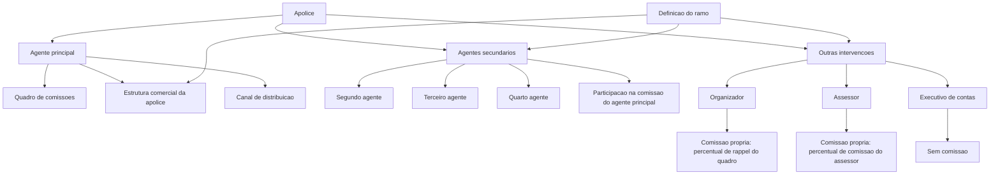
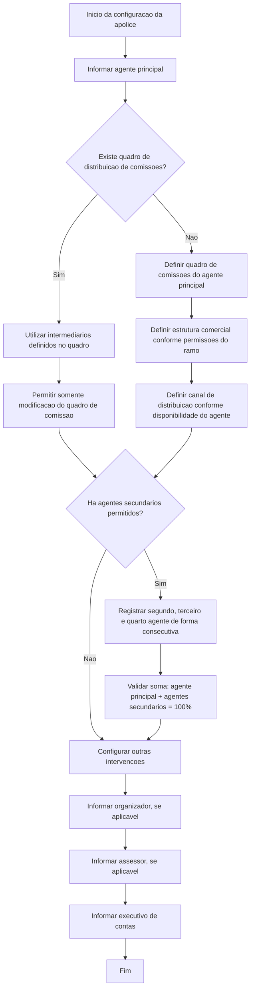

# Gestão de Agentes, Comissões e Intervenções em Apólices

## 1. Metadados do Documento
- **Arquivo de Origem:** Não identificado
- **Tipo de Documento:** Manual Operacional
- **Domínio / Sistema:** Gestão de intermediários, agentes e comissões de apólices
- **Público-Alvo:** Negócio, Operação, Analistas Funcionais e Desenvolvedores
- **Data/Versão Identificada:** Não identificada

---

## 2. Resumo Executivo & Contexto de Negócio

O documento descreve a gestão das figuras que atuam como intermediários em uma apólice e as condições sob as quais essas figuras participam. Todas as figuras intermediárias devem existir previamente como agentes da companhia.

Uma apólice deve ter obrigatoriamente um **agente principal**. O agente principal determina a estrutura comercial da apólice, o canal de distribuição e o quadro de comissões aplicável. Além do agente principal, a apólice pode incluir agentes secundários, organizador, assessor e executivo de contas.

Os agentes secundários podem atuar como segundo, terceiro ou quarto agente. Essas figuras não possuem comissão própria: participam de um percentual da comissão do agente principal. A possibilidade e a quantidade de agentes secundários permitidas dependem da definição do ramo.

As outras intervenções incluem organizador, assessor e executivo de contas. Organizador e assessor possuem comissão própria vinculada ao quadro do agente principal. O executivo de contas não recebe comissão, mas pode ser informado mesmo quando não houver um executivo previamente associado ao agente principal.

O documento também define restrições de modificação de propriedades, tais como quadro de distribuição de comissões, quadro de comissões, estrutura comercial, canais de distribuição e intervenções associadas.

---

## 3. Arquitetura, Componentes & Tecnologias Envolvidas

O documento não apresenta tecnologias, APIs, bancos de dados, servidores, URLs ou microsserviços. O conteúdo descreve um modelo funcional de composição de intermediários em uma apólice.

### Componentes funcionais identificados

| Componente | Função no processo |
| :--- | :--- |
| Apólice | Entidade que registra intermediários, estrutura comercial, canal de distribuição e regras de comissão. |
| Agente principal | Intermediário obrigatório da apólice; determina estrutura comercial, canal de distribuição e quadro de comissões. |
| Agentes secundários | Segundo, terceiro e quarto agentes que participam da comissão do agente principal. |
| Organizador | Intervenção associada ao agente principal, com comissão própria baseada no quadro do agente principal. |
| Assessor | Intervenção associada ao agente principal, com comissão própria baseada no quadro do agente principal. |
| Executivo de contas | Terceiro associado ao agente; não recebe comissão. |
| Quadro de distribuição de comissões | Chave previamente definida que agrupa os intermediários participantes da apólice. |
| Quadro de comissões | Chave associada ao agente principal que define percentuais de comissão das figuras participantes. |
| Estrutura comercial | Estrutura à qual pertence o agente principal e, consequentemente, a apólice. |
| Estrutura de canais de distribuição | Fonte de produção pela qual o agente pode comercializar. |
| Definição do ramo | Configuração que determina permissões, quantidade de agentes secundários e possibilidade de alteração de propriedades. |



> **Nota de Análise:** O documento não detalha implementação técnica, contratos de integração, métodos HTTP, persistência de dados ou tecnologias utilizadas para operacionalizar a gestão de agentes.

---

## 4. Regras de Negócio, Especificações Funcionais & Processos

### 4.1 Regra obrigatória do agente principal

1. Toda apólice deve possuir um agente principal.
2. O agente principal deve existir previamente como agente da companhia.
3. O agente principal determina:
   - A estrutura comercial da apólice.
   - O canal de distribuição da apólice.
   - O quadro de comissões das figuras que participam da apólice.

### 4.2 Regras sobre agentes secundários

1. Os agentes secundários podem atuar como:
   - Segundo agente.
   - Terceiro agente.
   - Quarto agente.
2. Agentes secundários devem existir previamente como agentes da companhia.
3. Agentes secundários não possuem comissão própria.
4. Agentes secundários participam de um percentual da comissão do agente principal.
5. A definição do ramo determina se agentes secundários podem ser registrados na apólice.
6. A definição do ramo determina o número de agentes secundários que podem ser incluídos.
7. Agentes secundários devem ser registrados de maneira consecutiva.
8. Quando um agente secundário não é identificado, nenhum agente secundário posterior pode ser incluído.
9. A participação inicial do agente principal é de 100%.
10. A participação do agente principal diminui à medida que agentes secundários são incluídos.
11. A soma dos percentuais dos agentes secundários e do agente principal deve ser sempre igual a 100%.

### 4.3 Regras sobre organizador

1. O organizador depende do agente principal.
2. O organizador não determina o quadro de comissão.
3. O quadro aplicável ao organizador é o quadro do agente principal.
4. O organizador possui comissão própria.
5. A comissão própria do organizador corresponde a um percentual de rappel do quadro.
6. O organizador não determina a estrutura comercial da apólice.
7. Pode ser indicado um organizador diferente daquele associado por padrão ao agente principal somente quando a definição permitir sua modificação.
8. Quando a definição não permitir modificação do organizador, a propriedade deve ser exibida desabilitada.

### 4.4 Regras sobre assessor

1. O assessor depende do agente principal.
2. O assessor não determina o quadro de comissão.
3. O quadro aplicável ao assessor é o quadro do agente principal.
4. O assessor possui comissão própria.
5. A comissão própria do assessor corresponde ao percentual de comissão do assessor definido no quadro.
6. O assessor não determina a estrutura comercial da apólice.
7. Pode ser indicado um assessor diferente daquele associado por padrão ao agente principal somente quando a definição permitir sua modificação.
8. Quando a definição não permitir modificação do assessor, a propriedade deve ser exibida desabilitada.

### 4.5 Regras sobre executivo de contas

1. O executivo de contas depende do agente principal.
2. O executivo de contas não determina quadro de comissão.
3. O executivo de contas não possui comissão.
4. O executivo de contas não determina a estrutura comercial da apólice.
5. Um executivo de contas pode sempre ser informado, mesmo quando o agente principal não possui um executivo associado.

### 4.6 Regras sobre quadro de distribuição de comissões

1. O quadro de distribuição de comissões identifica a chave que agrupa os intermediários participantes da apólice.
2. O quadro de distribuição deve estar previamente definido.
3. Quando um quadro de distribuição é especificado:
   - Os intermediários identificados no quadro devem ser utilizados.
   - As informações desses intermediários não podem ser modificadas.
   - Apenas o quadro de comissão pode ser modificado.

### 4.7 Regras sobre quadro de comissões

1. O quadro de comissões contém a chave do quadro associada ao agente principal.
2. O quadro de comissões determina os percentuais de comissão das figuras que participam da apólice.
3. O quadro de comissões somente pode ser modificado quando o agente principal possui mais de um quadro de comissão associado.

### 4.8 Regras sobre estrutura comercial

1. O terceiro nível da estrutura comercial identifica a estrutura comercial à qual pertence o agente principal.
2. A estrutura comercial do agente principal é a estrutura comercial da apólice.
3. Quando o agente principal pode emitir em mais de uma estrutura comercial, pode ser selecionada uma estrutura diferente da estrutura padrão.
4. A alteração de estrutura comercial somente é permitida quando a definição do ramo permitir a modificação.
5. Quando a definição do ramo não permitir alteração da estrutura comercial, a propriedade não deve ser habilitada.

### 4.9 Regras sobre canais de distribuição

1. O terceiro nível da estrutura de canais de distribuição identifica a fonte de produção pela qual o agente pode comercializar.
2. Quando o agente pode emitir por mais de um canal, pode ser informada uma fonte de produção diferente daquela definida por padrão para o agente.
3. Quando o agente não pode emitir por mais de um canal, a propriedade não deve ser habilitada.

### 4.10 Fluxo funcional de configuração



---

## 5. Tabelas de Parâmetros, Ambientes e Estruturas de Dados

### 5.1 Formas de atuação e regras de comissão

| Forma de atuação | Origem | Determina quadro de comissão? | Possui comissão própria? | Determina estrutura comercial da apólice? |
| :--- | :--- | :--- | :--- | :--- |
| Agente principal | Livre | Sim | Sim, conforme percentual de comissão do agente definido no quadro | Sim |
| Organizador | Depende do agente principal | Não; utiliza o quadro do agente principal | Sim, conforme percentual de rappel do quadro | Não |
| Assessor | Depende do agente principal | Não; utiliza o quadro do agente principal | Sim, conforme percentual de comissão do assessor definido no quadro | Não |
| Segundo agente | Livre | Não | Não; participa da comissão do agente principal | Não |
| Terceiro agente | Livre | Não | Não; participa da comissão do agente principal | Não |
| Quarto agente | Livre | Não | Não; participa da comissão do agente principal | Não |
| Executivo de contas | Depende do agente principal | Não | Não possui comissão | Não |

> **Nota de Análise:** A tabela original apresenta colunas parcialmente truncadas nas páginas 2 e 3. Os valores acima foram preservados apenas quando explicitamente identificáveis no conteúdo fornecido.

### 5.2 Propriedades principais

| Item / Parâmetro | Descrição / Função | Tipo / Valores / Formato | Ambiente / Observações |
| :--- | :--- | :--- | :--- |
| Quadro de distribuição de comissões | Identifica a chave que agrupa intermediários participantes da apólice. | Chave previamente definida. | Quando informado, utiliza os intermediários do quadro e impede alteração dessas informações; somente o quadro de comissão pode ser modificado. |
| Código de terceiro do agente principal | Identifica a figura que atuará como agente principal da apólice. | Chave de terceiro/agente. | Determina estrutura comercial e canal de distribuição da apólice. |
| Quadro de comissões | Identifica a chave do quadro associado ao agente principal. | Chave de quadro. | Determina percentuais de comissão das figuras da apólice; pode ser modificado somente quando o agente possui mais de um quadro associado. |
| Terceiro nível da estrutura comercial | Identifica a estrutura comercial à qual pertence o agente principal. | Nível de estrutura comercial. | Define a estrutura comercial da apólice; pode ser alterado se o agente emitir em mais de uma estrutura e a definição do ramo permitir alteração. |
| Terceiro nível da estrutura de canais de distribuição | Identifica a fonte de produção pela qual o agente pode comercializar. | Nível de canal de distribuição. | Pode ser selecionada outra fonte de produção se o agente emitir por mais de um canal. |

### 5.3 Propriedades dos agentes secundários

| Item / Parâmetro | Descrição / Função | Tipo / Valores / Formato | Ambiente / Observações |
| :--- | :--- | :--- | :--- |
| Atuação | Identifica a forma de intervenção do agente secundário na apólice. | Segundo agente, terceiro agente ou quarto agente. | O total de agentes permitidos depende da definição do ramo. |
| Código de terceiro | Identifica a chave do agente secundário participante da apólice. | Chave de agente. | Agentes devem existir previamente como agentes da companhia. |
| Porcentagem de participação | Registra a participação do agente secundário sobre a comissão do agente principal. | Percentual. | A soma do percentual do agente principal e dos agentes secundários deve ser igual a 100%. |
| Número de agentes secundários | Define a quantidade de agentes secundários incluídos. | Quantidade permitida pela definição do ramo. | O registro deve ocorrer consecutivamente. |
| Ação modificar | Ação indicada no documento para agentes secundários. | `MODIFICAR` | O documento não detalha o comportamento técnico dessa ação. |

### 5.4 Propriedades de outras intervenções

| Item / Parâmetro | Descrição / Função | Tipo / Valores / Formato | Ambiente / Observações |
| :--- | :--- | :--- | :--- |
| Organizador | Contém a chave do agente identificado como organizador associado ao agente principal. | Chave de agente. | Pode ser diferente do organizador padrão do agente principal quando a definição permitir modificação. |
| Assessor | Contém a chave do agente identificado como assessor associado ao agente principal. | Chave de agente. | Pode ser diferente do assessor padrão do agente principal quando a definição permitir modificação. |
| Executivo | Identifica a chave do executivo de contas associado ao agente. | Chave de executivo/agente. | Sempre pode ser indicado, mesmo que o agente principal não tenha executivo associado. |
| Porcentagem de participação do agente principal | Representa o percentual remanescente da comissão do agente principal. | Percentual; inicia em 100%. | Deve ser reduzido pela participação atribuída aos agentes secundários. |

### 5.5 Ambientes, servidores e URLs

| Item / Parâmetro | Descrição / Função | Tipo / Valores / Formato | Ambiente / Observações |
| :--- | :--- | :--- | :--- |
| Ambientes técnicos | Não identificados. | Não aplicável. | O documento não apresenta ambientes, servidores, URLs, portas ou rotas de logs. |
| Tecnologias | Não identificadas. | Não aplicável. | O documento não detalha tecnologia de implementação. |

---

## 6. Bateria de Perguntas & Respostas para RAG (FAQ Sintético)

### P1: O agente principal é obrigatório em uma apólice?
**R:** Sim. A apólice deve possuir sempre um agente principal. O agente principal identifica a figura que atuará como intermediário principal, determina a estrutura comercial da apólice, o canal de distribuição e o quadro de comissões aplicável às figuras participantes.

### P2: Quais tipos de agentes secundários podem participar de uma apólice?
**R:** Os agentes secundários podem atuar como segundo agente, terceiro agente ou quarto agente. A quantidade de agentes secundários permitida depende da definição do ramo.

### P3: Agentes secundários possuem comissão própria?
**R:** Não. Segundo, terceiro e quarto agentes não possuem comissão própria. Esses agentes participam de um percentual da comissão do agente principal.

### P4: Qual regra deve ser validada para os percentuais dos agentes secundários?
**R:** A soma dos percentuais de participação dos agentes secundários e do agente principal deve ser sempre igual a 100%. O percentual do agente principal começa em 100% e diminui conforme percentuais são atribuídos aos agentes secundários.

### P5: Os agentes secundários podem ser cadastrados em qualquer ordem?
**R:** Não. Os agentes secundários devem ser registrados consecutivamente. Se um dos agentes secundários não for identificado, isso significa que não serão incluídos agentes secundários posteriores.

### P6: Quando o quadro de comissões do agente principal pode ser modificado?
**R:** O quadro de comissões pode ser modificado somente quando o agente principal possui mais de um quadro de comissão associado.

### P7: O que acontece quando é informado um quadro de distribuição de comissões?
**R:** Quando um quadro de distribuição de comissões é especificado, os intermediários definidos previamente nesse quadro são utilizados na apólice. As informações desses intermediários não podem ser modificadas; apenas o quadro de comissão pode ser alterado.

### P8: Em que condição a estrutura comercial da apólice pode ser alterada?
**R:** A estrutura comercial pode ser alterada quando o agente principal pode emitir em mais de uma estrutura comercial e a definição do ramo permite a modificação da estrutura comercial. Caso contrário, a propriedade não deve ser habilitada.

### P9: Quando é possível selecionar um canal de distribuição diferente do padrão do agente?
**R:** Um canal ou fonte de produção diferente pode ser informado quando o agente pode emitir por mais de um canal. Caso contrário, a propriedade correspondente não é habilitada.

### P10: O organizador e o assessor possuem comissão própria?
**R:** Sim. O organizador possui comissão própria correspondente a um percentual de rappel do quadro do agente principal. O assessor possui comissão própria correspondente ao percentual de comissão do assessor definido no quadro do agente principal.

### P11: O organizador e o assessor podem ser alterados em relação aos valores padrão do agente principal?
**R:** Sim, mas somente quando a definição permitir essa modificação. Se a definição não permitir, as propriedades de organizador e assessor devem ser mostradas desabilitadas.

### P12: O executivo de contas recebe comissão?
**R:** Não. O executivo de contas não possui comissão própria e não determina estrutura comercial ou quadro de comissão. Mesmo assim, sempre pode ser informado, inclusive quando o agente principal não possui um executivo associado.

---

## 7. Glossário de Termos, Siglas & Conceitos-Chave

- **Agente principal:** Figura obrigatória da apólice que determina a estrutura comercial, o canal de distribuição e o quadro de comissões.
- **Agente secundário:** Agente que atua como segundo, terceiro ou quarto agente e recebe participação da comissão do agente principal.
- **Apólice:** Entidade na qual são registrados intermediários, comissão, estrutura comercial e canal de distribuição.
- **Assessor:** Figura associada ao agente principal, com comissão própria calculada conforme percentual de comissão do assessor definido no quadro.
- **Canal de distribuição:** Fonte de produção pela qual um agente pode comercializar.
- **Código de terceiro:** Chave que identifica uma figura de agente, agente principal, agente secundário, organizador, assessor ou executivo.
- **Definição do ramo:** Configuração que determina permissões de alteração, existência e quantidade de agentes secundários.
- **Estrutura comercial:** Estrutura organizacional ou comercial à qual pertence o agente principal e, consequentemente, a apólice.
- **Executivo de contas:** Figura associada ao agente que não recebe comissão.
- **Organizador:** Figura associada ao agente principal que possui comissão própria baseada em percentual de rappel do quadro.
- **Percentual de participação:** Percentual da comissão do agente principal atribuído a agentes secundários.
- **Quadro de distribuição de comissões:** Chave que agrupa intermediários participantes da apólice e pode restringir alterações nesses intermediários.
- **Quadro de comissões:** Chave associada ao agente principal que define percentuais de comissão das figuras participantes.
- **Rappel:** Termo utilizado no documento para identificar o percentual de comissão próprio do organizador dentro do quadro.
- **Terceiro nível da estrutura comercial:** Propriedade que identifica a estrutura comercial do agente principal e da apólice.
- **Terceiro nível da estrutura de canais de distribuição:** Propriedade que identifica a fonte de produção pela qual o agente pode comercializar.

---

## 8. Notas Críticas, Riscos & Limitações

- O documento não identifica arquivo de origem, versão, data, autor, sistema responsável ou contexto técnico de implantação.
- O documento não apresenta tecnologias, integrações, APIs, endpoints, contratos JSON, bancos de dados, ambientes, servidores ou procedimentos de auditoria.
- A tabela de formas de atuação nas páginas 2 e 3 está parcialmente truncada na extração original, especialmente em cabeçalhos e na linha referente ao quarto agente.
- Não são detalhadas regras de validação técnica para formato dos códigos de terceiro, valores numéricos, arredondamento ou precisão dos percentuais.
- Não são especificadas mensagens de erro, comportamento de interface, perfis de autorização ou fluxos de aprovação.
- A ação `MODIFICAR` é apresentada para agentes secundários, mas não possui detalhamento funcional ou técnico adicional.
- A definição do ramo é uma dependência crítica para habilitar agentes secundários e alterações de propriedades, mas o documento não descreve onde essa definição é administrada.
- O documento afirma que todas as figuras devem existir previamente como agentes da companhia, mas não descreve o processo de cadastro, consulta ou validação desses agentes.

---

## 9. Conteúdo Bruto Estruturado (Referência Fiel)

```text
--- [PÁGINA 1 DE 7] ---

AGENTE
En que consiste
Identificar las distintas figuras que actúan como intermediarios en la póliza, así como las condiciones
con las que participan.
Estas figuras tienen que existir previamente como agentes de la compañía.
La póliza tiene que tener siempre un agente principal, pero además, pueden existir:
- Agentes secundarios:
Son otros agentes que pueden intervenir en la póliza, aunque no tienen una comisión propia,
participan de un porcentaje de la comisión del agente principal. La definición del ramo indica si se
pueden registrar este tipo de agentes en la póliza.
- Otras intervenciones:
El agente puede estar asociado a otros agentes que actúan como organizador y asesor. Estas figuras
tienen su propia comisión.
Por otro lado, también puede tener asociado otro tercero que actúa como ejecutivo de cuentas. Esta
figura no percibe comisión.
 / 
 RS
Inicio Soluciones APIs Documentación Zeus
ES


--- [PÁGINA 2 DE 7] ---

FORMA DE
ACTUACIÓN
ORIGEN ¿DETERMINA
CUADRO
COMISIÓN?
¿TIENE
COMISIÓN
PROPIA?
¿DETERMINA
ESTRUCTURA
COMERCIAL
DE LA
PÓLIZA?
¿DE
CA
COMER
DE L
Agente
principal
Libre SI SI
(porcentaje
de
comisión
del agente
del cuadro)
SI
Organizador Depende
del
agente
principal
NO
(cuadro del
agente
principal)
SI
(porcentaje
de rappel
del cuadro)
NO
Asesor Depende
del
agente
principal
NO
(cuadro del
agente
principal)
SI
(porcentaje
de
comisión
del asesor
del cuadro)
NO
Segundo
agente
Libre NO NO
(participa
de la
comisión
del agente
principal)
NO
Tercer
agente
Libre NO NO
(participa
de la
comisión
del agente
principal)
NO
Cuarto
agente
Libre NO NO
(participa
NO


--- [PÁGINA 3 DE 7] ---

FORMA DE
ACTUACIÓN
ORIGEN ¿DETERMINA
CUADRO
COMISIÓN?
¿TIENE
COMISIÓN
PROPIA?
¿DETERMINA
ESTRUCTURA
COMERCIAL
DE LA
PÓLIZA?
¿DE
CA
COMER
DE L
de de la
comisión
del agente
principal)
Ejecutivo de
cuenta
Depende
del
agente
principal
NO Sin
comisión
NO
Proceso a seguir
Propiedades
principales
¿Hay agentes
secundarios?
Propiedades de
agentes secundarios
Propiedades de
otras intervenciones
- Propiedades principales
- Propiedades de agentes secundarios
- Propiedades de otras intervenciones
Propiedades principales
A continuación se detalla la información requerida.


--- [PÁGINA 4 DE 7] ---

Cuadro de distribución de las comisiones (   )
Identifica la clave que agrupa los intermediarios que participan en la póliza, definida previamente.
Si se especifica un cuadro de distribución, se tomarán los intermediarios identificados en el cuadro
y no se podrá modificar esta información. Solo se permitirá modificar el cuadro de comisión.
AGENTE PRINCIPAL
Código de tercero (   )
Clave que identifica la figura que actuará como agente principal de la póliza y que determinará la
estructura comercial de la misma, así como el canal de distribución.
Cuadro de comisiones (   )
Esta propiedad contiene la clave del cuadro, asociado al agente principal, que determina los
porcentajes de comisión de las figuras que intervienen en la póliza.
Solo se permite modificar cuando el agente tiene asociado más de un cuadro de comisión.
Tercer nivel de la estructura comercial (   )
Identifica la estructura comercial a la que pertenece el agente principal y que será la estructura
comercial a la que pertenece la póliza.
Si el agente puede emitir en más de una estructura comercial, se podrá seleccionar una estructura
distinta a la que tiene por defecto, siempre que se permita modificar la estructura comercial, según
la definición del ramo, en caso contrario, no se habilita esta propiedad.
Tercer nivel de la estructura de canales de distribución (   )
Esta propiedad identifica la fuente de producción por la que puede comercializar el agente.
Si el agente puede emitir por más de un canal, se podrá indicar una fuente de producción distinta
a la que tiene el agente por defecto, en caso contrario, no se habilita esta propiedad.
¿Cuándo se puede modificar?
¿Cuándo se puede modificar?
¿Cuándo se puede modificar?


--- [PÁGINA 5 DE 7] ---

Propiedades de agentes secundarios
A continuación se detalla la información requerida.
Posibles acciones
 MODIFICAR ( )
AGENTES SECUNDARIOS
Actuación
Identifica la forma de intervención del agente en la póliza, pudiendo ser segundo, tercer o cuarto
agente.
El número de agentes secundarios que se pueden incluir en la póliza depende de la definición del
ramo.
Se deben registrar de forma consecutiva, de manera que si no se identifica uno de estos agentes,
significa que ya no se incluirán más agentes secundarios.
Código de tercero (   )
Identifica la clave de agente, del agente secundario que interviene en la póliza.
Porcentaje de participación (  )
Recoge la participación del agente secundario, sobre la comisión del agente principal.
Número de agentes secundarios


--- [PÁGINA 6 DE 7] ---

El porcentaje de participación del agente principal, que en un inicio es el 100%, irá disminuyendo,
según se vayan incluyendo agentes secundarios, ya que se le resta el porcentaje de participación
de estos.
La suma de los porcentajes de participación de los agentes secundarios y el del agente principal
siempre tiene que ser 100.
Propiedades de otras intervenciones
A continuación se detalla la información requerida.
OTRAS INTERVENCIONES
Organizador (   )
Contiene la clave de agente con la que se identifica el organizador asociado al agente principal.
Se podrá indicar un organizador distinto al que tiene asociado por defecto el agente principal,
siempre que la definición permita su modificación, en caso contrario, esta propiedad se mostrará
inhabilitada.
Asesor (   )
Contiene la clave de agente con la que se identifica el asesor asociado al agente principal.
Se podrá indicar un asesor distinto al que tiene asociado por defecto el agente principal, siempre
que la definición permita su modificación, en caso contrario, esta propiedad se mostrará
inhabilitada.
Ejecutivo (   )
Identifica la clave del ejecutivo de cuentas que se asocia al agente.
Porcentaje de participación del agente principal
¿Cuándo se puede modificar?
¿Cuándo se puede modificar?


--- [PÁGINA 7 DE 7] ---

Siempre se puede indicar un ejecutivo de cuenta, aunque el agente no tenga asociado ninguno.
¿Cuándo se puede modificar?
```
