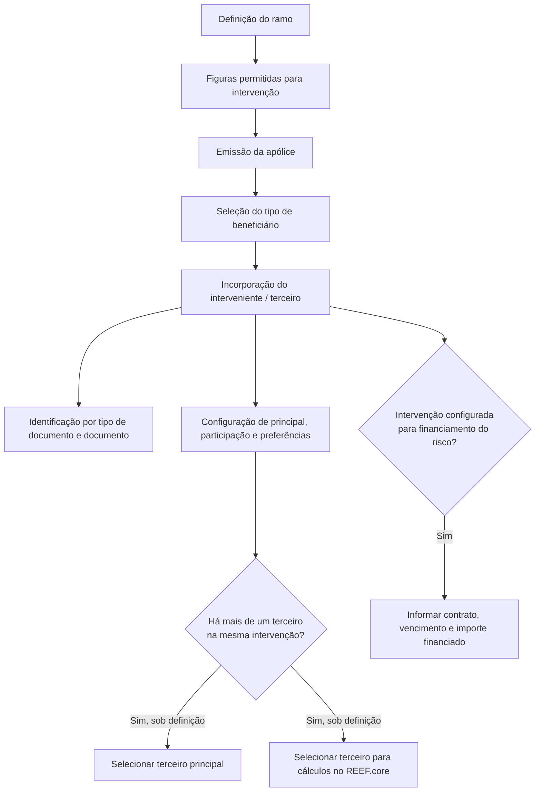

# Gestão de Intervenientes em Apólices — Regras Funcionais e Campos de Configuração no REEF.core

## 1. Metadados do Documento
- **Arquivo de Origem:** Não identificado no conteúdo fornecido
- **Tipo de Documento:** Especificação Funcional
- **Domínio / Sistema:** REEF.core — gestão de intervenientes em apólices/aplicações
- **Público-Alvo:** Analistas funcionais, desenvolvedores, operação e negócio
- **Data/Versão Identificada:** Não identificada

---

## 2. Resumo Executivo & Contexto de Negócio

O documento descreve o processo de gestão de **intervenientes** associados a uma apólice ou aplicação no contexto do REEF.core. Um interveniente é uma pessoa ou terceiro que participa na apólice sob uma figura previamente permitida na definição do ramo.

A definição do ramo estabelece quais figuras podem ser declaradas como intervenientes. Durante a emissão da apólice, é determinado quais pessoas ocuparão essas figuras. O processo suporta ações de criação, modificação, exclusão e inabilitação de intervenientes.

A informação do interveniente inclui identificação documental, seleção de papel ou tipo de beneficiário, definição de terceiro principal, participação percentual, meios de pagamento ou recebimento, endereço, meio de contacto e indicação de pessoa importante (V.I.P.).

O documento também descreve um cenário de financiamento do risco assegurado. Quando essa configuração está presente na intervenção, o processo solicita o contrato, a data de vencimento da operação de financiamento e o valor que permanece financiado.

Não são detalhados contratos de APIs, métodos HTTP, estruturas JSON, persistência de dados, regras de autorização, interfaces de utilizador ou critérios técnicos de integração. O texto menciona referências de navegação como “Soluciones”, “APIs”, “Documentación” e “Zeus”, mas não explica a função técnica dessas referências.

---

## 3. Arquitetura, Componentes & Tecnologias Envolvidas

### Componentes e conceitos identificados

| Componente / Conceito | Papel identificado no documento | Observações |
| :--- | :--- | :--- |
| REEF.core | Sistema utilizado para realizar cálculos associados ao terceiro selecionado. | O documento menciona que o REEF.core utiliza um terceiro para cálculos quando existem múltiplos terceiros na mesma intervenção. |
| Ramo | Configuração que define quais figuras podem ser declaradas como intervenientes. | A definição do ramo antecede a emissão da apólice. |
| Apólice / aplicação | Entidade sobre a qual a operação é executada. | O interveniente pode selecionar meios de pagamento/cobrança, endereço e contacto para uso na apólice/aplicação. |
| Intervenção | Contexto funcional em que terceiros são incorporados. | Pode conter mais de um terceiro e pode ser configurada para financiamento do risco assegurado. |
| Interveniente / terceiro | Pessoa incorporada em uma figura definida no ramo. | Pode ser principal, usado para cálculos, V.I.P. ou financiador do risco assegurado. |
| Consulta de terceiros | Consulta referida para localizar, modificar ou criar o terceiro. | O nome específico da consulta não é apresentado no conteúdo bruto. |
| Documentos | Tipos documentais previamente definidos para identificação do interveniente. | Há referência a um enlace `[tip_docum]`, sem URL ou conteúdo fornecido. |
| Soluciones / APIs / Documentación / Zeus | Termos de navegação ou referências presentes no texto. | O documento não fornece detalhe funcional ou técnico adicional. |



> **Nota de Análise:** O documento apresenta um fluxo funcional, não uma arquitetura técnica de software. Não há detalhes sobre serviços, bancos de dados, APIs, ambientes, protocolos ou tecnologias de implementação.

---

## 4. Regras de Negócio, Especificações Funcionais & Processos

### 4.1 Finalidade da gestão de intervenientes

1. A definição do ramo determina quais figuras podem ser declaradas no ponto de intervenções.
2. Durante a emissão, são determinadas as pessoas que ocuparão as figuras permitidas.
3. Um interveniente representa uma pessoa ou terceiro incorporado em uma figura definida para o ramo.
4. A gestão de intervenientes possui as ações possíveis:
   - Criar.
   - Modificar.
   - Excluir.
   - Inabilitar.

### 4.2 Identificação e incorporação do interveniente

1. O campo **Tipo beneficiario** determina sob qual figura definida no ramo os terceiros serão incorporados.
2. O campo **Tipo de documento** identifica o documento utilizado para identificar o interveniente.
3. Os documentos devem estar previamente definidos.
4. O campo **Documento** recebe o número do documento associado ao tipo de documento selecionado.
5. O texto informa que uma consulta pode ser utilizada para:
   - Aceder à própria consulta.
   - Modificar o terceiro.
   - Criar o terceiro.
6. O nome da consulta não é especificado no conteúdo fornecido.

### 4.3 Regra de terceiro principal

1. Quando existe mais de um terceiro para a mesma intervenção, pode ser permitido, conforme configuração ou definição, que a pessoa que executa a operação selecione qual terceiro será considerado o principal.
2. O documento não define como a condição de principal influencia cálculos, pagamentos, permissões ou outros processos.

### 4.4 Regra de terceiro para cálculos no REEF.core

1. Quando existe mais de um terceiro para uma mesma intervenção, a configuração pode permitir que o operador escolha o terceiro que o REEF.core utilizará para realizar cálculos.
2. O documento não especifica quais cálculos são realizados pelo REEF.core, nem quais campos são utilizados nesses cálculos.

### 4.5 Participação percentual

1. O campo **Porcentaje de participación** pode ser obrigatório conforme a definição configurada.
2. Conforme a definição realizada, a soma dos percentuais declarados pode ter de totalizar **100%**.
3. O documento não especifica:
   - Casas decimais permitidas.
   - Regra de arredondamento.
   - Tratamento de percentuais negativos ou superiores a 100%.
   - Comportamento quando o total não é 100%.

### 4.6 Preferências operacionais do interveniente

O interveniente pode selecionar, entre opções previamente declaradas:

1. **Medio de pago/cobro:** meio de pagamento ou cobrança que o terceiro deseja utilizar na apólice/aplicação.
2. **Dirección:** endereço que o terceiro deseja utilizar na apólice/aplicação.
3. **Medio de contacto:** meio de contacto que o terceiro deseja utilizar na apólice/aplicação.
4. **V.I.P.:** indicador de que o terceiro é considerado uma pessoa importante.

O documento não informa as listas de valores disponíveis, a origem desses cadastros, nem as consequências funcionais da marcação V.I.P.

### 4.7 Dados de financiamento do risco assegurado

Quando a intervenção está configurada para identificar quem está financiando o risco assegurado, devem ser solicitados:

1. **Contrato:** número do contrato.
2. **Fecha de vencimiento de la financiación:** data de vencimento do contrato.
3. **Importe financiado:** valor restante da operação de financiamento.

O documento não especifica formatos de data, moeda, validações financeiras, condições de obrigatoriedade ou relação entre o contrato e a apólice.

---

## 5. Tabelas de Parâmetros, Ambientes e Estruturas de Dados

| Item / Parâmetro | Descrição / Função | Tipo / Valores / Formato | Ambiente / Observações |
| :--- | :--- | :--- | :--- |
| Ação: Criar | Cria um interveniente. | Ação funcional. | O fluxo detalhado de criação não é apresentado. |
| Ação: Modificar | Altera um interveniente existente. | Ação funcional. | O documento também menciona modificação por meio de uma consulta. |
| Ação: Excluir / Borrar | Remove um interveniente. | Ação funcional. | Não são especificadas regras de exclusão. |
| Ação: Inabilitar | Desabilita um interveniente. | Ação funcional. | Não é indicado se a inabilitação preserva o histórico ou impede cálculos. |
| Tipo beneficiario | Determina a figura do ramo sob a qual terceiros serão incorporados. | Campo de seleção; valores não especificados. | As figuras devem estar definidas no ramo. |
| Tipo de documento | Define o tipo de documento que identifica o interveniente. | Campo de seleção; valores não especificados. | Os documentos devem estar previamente definidos; referência `[tip_docum]`. |
| Documento | Armazena o número do documento relacionado ao tipo documental. | Número ou identificador documental; formato não especificado. | Associado ao campo Tipo de documento. |
| Consulta de terceiros | Permite aceder, modificar ou criar o terceiro. | Consulta; nome não informado. | Não há detalhes de interface, endpoint ou permissões. |
| Principal | Indica qual terceiro será considerado principal quando há mais de um terceiro na mesma intervenção. | Indicador ou seleção; formato não especificado. | Disponível sob definição/configuração. |
| Cálculo | Define o terceiro que será utilizado pelo REEF.core para realizar cálculos. | Indicador ou seleção; formato não especificado. | Aplicável quando há múltiplos terceiros e configuração correspondente. |
| Porcentaje de participación | Registra a participação do terceiro. | Percentual; precisão não especificada. | Pode ser obrigatório; em certas definições, o total deve ser 100%. |
| Medio de pago/cobro | Seleciona meio de pagamento ou cobrança do terceiro para a apólice/aplicação. | Campo de seleção; valores não especificados. | Opções devem estar previamente declaradas. |
| Dirección | Seleciona endereço do terceiro para a apólice/aplicação. | Campo de seleção; formato não especificado. | Opções devem estar previamente declaradas. |
| Medio de contacto | Seleciona meio de contacto do terceiro para a apólice/aplicação. | Campo de seleção; valores não especificados. | Opções devem estar previamente declaradas. |
| V.I.P. | Indica se o terceiro é considerado pessoa importante. | Indicador; valores não especificados. | Não há efeitos funcionais detalhados. |
| Contrato | Número do contrato de financiamento. | Número ou identificador de contrato; formato não especificado. | Solicitado quando a intervenção identifica o financiador do risco assegurado. |
| Fecha de vencimiento de la financiación | Data de vencimento do contrato de financiamento. | Data; formato não especificado. | Relacionada ao contrato de financiamento. |
| Importe financiado | Valor restante da operação de financiamento. | Valor monetário; moeda e precisão não especificadas. | Solicitado no contexto de financiamento do risco assegurado. |
| REEF.core | Sistema que utiliza o terceiro escolhido para cálculos. | Sistema corporativo. | Não há versão, URL, ambiente ou contrato técnico informado. |

> **Nota de Análise:** O conteúdo não apresenta URLs de ambientes, nomes de servidores, rotas de log, portas, variáveis de configuração, credenciais, tecnologias de infraestrutura ou parâmetros técnicos de implantação.

---

## 6. Bateria de Perguntas & Respostas para RAG (FAQ Sintético)

### P1: Qual é a finalidade da seção de intervenções de cliente?
**R:** A seção de intervenções determina quais pessoas participam na apólice. A definição do ramo estabelece quais figuras podem ser declaradas, e durante a emissão são definidas as pessoas que ocuparão essas figuras.

### P2: Quais operações podem ser realizadas sobre um interveniente?
**R:** O documento lista quatro ações possíveis sobre intervenientes: criar, modificar, excluir e inabilitar. O conteúdo não detalha pré-requisitos, permissões ou efeitos de cada ação.

### P3: O que o campo “Tipo beneficiario” determina?
**R:** O campo “Tipo beneficiario” determina sobre qual figura previamente definida no ramo os terceiros serão incorporados. Os valores possíveis não são apresentados no documento.

### P4: Como um interveniente é identificado?
**R:** O interveniente é identificado por meio de um tipo de documento e de um número de documento. O tipo documental deve estar previamente definido, e o campo “Documento” armazena o número associado ao tipo selecionado.

### P5: Como localizar, modificar ou criar um terceiro?
**R:** O documento informa que é possível utilizar uma consulta para aceder ao terceiro, modificá-lo ou criá-lo. Contudo, o nome da consulta, a forma de acesso e os critérios de pesquisa não são especificados.

### P6: Quando é possível indicar um terceiro principal?
**R:** Quando há mais de um terceiro para a mesma intervenção, a configuração pode permitir que a pessoa que realiza a operação escolha qual terceiro será considerado principal. O documento não informa quais efeitos decorrem dessa escolha.

### P7: Qual terceiro é utilizado pelo REEF.core em cálculos?
**R:** Quando há mais de um terceiro em uma mesma intervenção e essa possibilidade está configurada, o operador pode escolher qual terceiro será utilizado pelo REEF.core para realizar cálculos. O documento não identifica os cálculos ou fórmulas envolvidos.

### P8: Quando a soma da participação percentual deve ser 100%?
**R:** A soma dos percentuais declarados pode precisar totalizar 100% quando isso tiver sido definido na configuração aplicável. O campo de participação percentual também pode ser obrigatório conforme a definição realizada.

### P9: Quais preferências do interveniente podem ser selecionadas para a apólice ou aplicação?
**R:** O interveniente pode selecionar um meio de pagamento ou cobrança, um endereço e um meio de contacto entre as opções previamente declaradas. Essas escolhas representam os dados que o terceiro deseja utilizar na apólice/aplicação em que a operação está sendo realizada.

### P10: O que significa o indicador V.I.P. do interveniente?
**R:** O indicador V.I.P. informa se o terceiro é considerado uma pessoa importante. O documento não descreve regras de prioridade, tratamento diferenciado, validações ou impactos associados ao indicador.

### P11: Quais dados são solicitados quando o interveniente financia o risco assegurado?
**R:** Quando a intervenção está configurada para indicar o terceiro que financia o risco assegurado, são solicitados o número do contrato, a data de vencimento da operação de financiamento e o valor restante financiado.

### P12: O documento especifica APIs, URLs ou contratos de integração para intervenientes?
**R:** Não. Embora o conteúdo mencione “APIs”, “Documentación” e “Zeus”, não apresenta endpoints, métodos HTTP, contratos JSON, URLs, ambientes, autenticação ou regras técnicas de integração.

---

## 7. Glossário de Termos, Siglas & Conceitos-Chave

- **Apólice / póliza:** Entidade sobre a qual os intervenientes e suas preferências de pagamento, endereço e contacto são aplicados.
- **Cálculo:** Seleção do terceiro que será utilizado pelo REEF.core para realizar cálculos, quando essa possibilidade estiver configurada.
- **Dirección:** Endereço declarado que o terceiro deseja utilizar na apólice/aplicação.
- **Figura:** Papel previamente definido no ramo e que pode ser ocupado por um terceiro durante a emissão.
- **Financiación:** Contexto em que um terceiro financia o risco assegurado e devem ser informados contrato, vencimento e valor financiado.
- **Importe financiado:** Valor que resta da operação de financiamento.
- **Intervenção:** Contexto funcional no qual terceiros são incorporados a figuras permitidas na apólice.
- **Interveniente / interviniente:** Pessoa ou terceiro que participa em uma intervenção associada a uma apólice/aplicação.
- **Medio de contacto:** Meio de contacto escolhido pelo terceiro para utilização na apólice/aplicação.
- **Medio de pago/cobro:** Meio de pagamento ou cobrança escolhido pelo terceiro para utilização na apólice/aplicação.
- **Principal:** Terceiro selecionado como principal quando existe mais de um terceiro na mesma intervenção.
- **Ramo:** Definição que estabelece quais figuras podem ser declaradas em intervenções.
- **REEF.core:** Sistema mencionado como responsável por realizar cálculos utilizando o terceiro selecionado.
- **Tercero:** Pessoa incorporada em uma intervenção, também denominada interveniente.
- **Tipo beneficiario:** Campo que determina a figura sob a qual terceiros são incorporados.
- **Tipo de documento:** Campo que define o tipo documental utilizado para identificar o interveniente.
- **V.I.P.:** Indicador de que o terceiro é considerado uma pessoa importante.

---

## 8. Notas Críticas, Riscos & Limitações

- O arquivo, a data, a versão e a autoria do documento não são identificados no conteúdo fornecido.
- O documento apresenta especificação funcional resumida; não apresenta contratos de APIs, modelos de dados, regras de persistência, telas, permissões ou responsabilidades por equipa.
- A referência `[tip_docum]` é citada, mas o destino do enlace e a lista de documentos permitidos não foram fornecidos.
- A consulta utilizada para aceder, modificar ou criar terceiros é mencionada sem nome, localização, critérios de pesquisa ou regras de acesso.
- A seleção do terceiro principal e do terceiro utilizado para cálculo depende de “definição” ou configuração não detalhada.
- A regra de soma de participação percentual igual a 100% depende de configuração; não são descritas validações de precisão, arredondamento ou tratamento de inconsistências.
- O documento não detalha os cálculos que o REEF.core realiza, mesmo indicando que um terceiro pode ser selecionado para esse fim.
- O indicador V.I.P. é apresentado sem efeitos operacionais, comerciais ou técnicos documentados.
- Os dados de financiamento não possuem regras documentadas para moeda, formato de data, validações, integração com contratos ou cálculo do saldo financiado.
- Não existem informações sobre ambientes, URLs, servidores, logs, observabilidade, segurança, autenticação ou autorização.

---

## 9. Conteúdo Bruto Estruturado (Referência Fiel)

```text
--- [PÁGINA 1 DE 3] ---

INTERVENCIONES DE CLIENTE
En que consiste
En este punto se determina qué personas y de qué forma intervienen en la póliza. Es decir, En la
definición del ramo se declaró qué figuras podían ser declaradas en este punto y en el momento de
emitir se determina cuales son esas personas.
Posibles acciones
 CREAR ( )
 MODIFICAR ( )
 BORRAR ( )
 INHABILITAR ( )
Proceso a seguir
A continuación detalla la información requerida.
 / 
 RS
Inicio Soluciones APIs Documentación Zeus
ES


--- [PÁGINA 2 DE 3] ---

INTERVINIENTE
Tipo beneficiario (  )
Se determina sobre qué figura de las definidas en el ramo se van a incorporar los terceros.
Tipo de documento (  )
En este punto se debe indicar el documento con el que se identificará al interviniente. Los
documentos deben estar previamente definidos según se indica en el siguiente [enlace][tip_docum].
Documento (  )
Este campo alberga el número del documento que está relacionado con el campo anterior.
Se puede utilizar la consulta  para, además de acceder a la propia consulta, poder modificarlo o
incluso crearlo.
Principal (  )
En caso que exista más de un tercero para una misma intervención, es posible (bajo definición) que
la persona que realiza la operación elija cual será el tercero que que se considera como principal.
Cálculo (  )
Si el tercero no existe


--- [PÁGINA 3 DE 3] ---

En caso que exista más de un tercero para una misma intervención, es posible (bajo definición) que
la persona que realiza la operación elija cual será el tercero que utilizará Reef.core a la hora de
realizar cálculos
Porcentaje de participación (  )
Este campo será requerido según la definición realizada y, es posible que la suma de porcentajes
declarados deba ser el 100 por cien si así se ha definido
Medio de pago/cobro (   )
En este punto es posible elegir de entre los distintos medios de pago o cobro declarados, cual es la
que el tercero de la intervención quiere utilizar en la póliza/aplicación sobre la que se está realizando
la operación.
Dirección (   )
En este punto es posible elegir de entre las distintas direcciones declaradas, cual es la que el tercero
de la intervención quiere utilizar en la póliza/aplicación sobre la que se está realizando la operación.
Medio de contacto (   )
En este punto es posible elegir de entre los distintos medios de contacto declarados, cual es el que el
tercero de la intervención quiere utilizar en la póliza/aplicación sobre la que se está realizando la
operación.
V.I.P. (  )
Indicaría si el tercero se considera una persona importante.
INTERVINIENTE
En el caso que se halla configurado en la intervención, se supone que se está indicando quien es el
tercero que está financiando el riesgo asegurado y en este punto se solicita:
Contrato (  )
El número de contrato.
Fecha de vencimiento de la financiación (  )
La fecha de vencimiento del contrato.
Importe financiado (  )
El importe que resta de la financiación.
```
