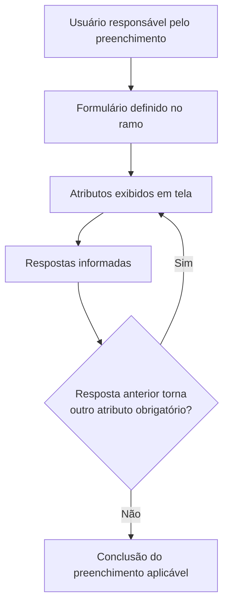

# Formulários de Atributos — Escopo, Preenchimento e Obrigatoriedade Condicional

## 1. Metadados do Documento
- **Arquivo de Origem:** Não identificado
- **Tipo de Documento:** Procedimento
- **Domínio / Sistema:** Formulários de atributos
- **Público-Alvo:** Operação, Negócio e usuários responsáveis pelo preenchimento de formulários
- **Data/Versão Identificada:** Não identificada

---

## 2. Resumo Executivo & Contexto de Negócio

O documento descreve o preenchimento de formulários definidos no ramo. A finalidade operacional é responder aos atributos apresentados em tela para registrar as informações requeridas pelo formulário aplicável.

Os formulários podem ser definidos em diferentes níveis de escopo: apólice, risco, cobertura e ocorrência. Cada escopo determina a quais elementos da apólice o formulário está associado ou afeta.

A quantidade de atributos que requerem resposta não é fixa. A obrigatoriedade de determinados atributos pode depender das respostas informadas em atributos anteriores, portanto não é necessário responder a todos os atributos exibidos.

O conteúdo fornecido não identifica o sistema responsável pela exibição dos formulários, nem detalha campos específicos, regras de validação, contratos técnicos, persistência de dados, perfis de acesso ou integrações.

---

## 3. Arquitetura, Componentes & Tecnologias Envolvidas

O documento cita uma interface que apresenta atributos em tela e um formulário definido no ramo. Não há detalhamento de componentes de software, microsserviços, banco de dados, tecnologias, APIs ou ambientes.



**Nota de Análise:** O fluxo acima representa exclusivamente a sequência funcional descrita: apresentação de atributos, resposta do usuário e possível obrigatoriedade condicional de atributos posteriores.

---

## 4. Regras de Negócio, Especificações Funcionais & Processos

1. O processo consiste em preencher o formulário definido no ramo.
2. Os formulários podem existir em múltiplos níveis de definição.
3. Um formulário no nível de **apólice** afeta todos os riscos da apólice.
4. Um formulário no nível de **risco** afeta cada um dos riscos da apólice.
5. Um formulário no nível de **cobertura** afeta a cobertura do risco ao qual está associado.
6. Um formulário no nível de **ocorrência** afeta a cobertura, o risco ou a apólice aos quais está associado.
7. Os atributos a serem respondidos são apresentados em tela.
8. A quantidade de atributos obrigatórios depende das respostas fornecidas.
9. Um atributo pode deixar de ser obrigatório conforme as respostas dadas em atributos anteriores.
10. Não é obrigatório responder a todos os atributos apresentados.

---

## 5. Tabelas de Parâmetros, Ambientes e Estruturas de Dados

| Item / Parâmetro | Descrição / Função | Tipo / Valores / Formato | Ambiente / Observações |
| :--- | :--- | :--- | :--- |
| Formulário | Estrutura definida no ramo que deve ser preenchida pelo usuário. | Formulário de atributos. | Não há detalhamento do sistema ou ambiente. |
| Atributo | Informação apresentada em tela que pode requerer resposta. | Não especificado. | A obrigatoriedade pode ser condicional. |
| Resposta a atributo anterior | Informação usada para determinar se atributos posteriores serão obrigatórios. | Não especificado. | Regra de dependência funcional descrita sem condições explícitas. |
| Escopo: Apólice | Formulário que afeta todos os riscos da apólice. | Nível de formulário. | Aplicável aos riscos pertencentes à apólice. |
| Escopo: Risco | Formulário que afeta cada risco. | Nível de formulário. | Aplicável individualmente a cada risco. |
| Escopo: Cobertura | Formulário associado a uma cobertura de um risco. | Nível de formulário. | Afeta a cobertura do risco associado. |
| Escopo: Ocorrência | Formulário associado a cobertura, risco ou apólice. | Nível de formulário. | O documento permite associação a um desses três níveis. |
| Sistema / URL / ambiente | Não informado no conteúdo disponível. | Não aplicável. | Não há URLs, servidores, portas ou rotas de log. |

---

## 6. Bateria de Perguntas & Respostas para RAG (FAQ Sintético)

### P1: Em que consiste o processo descrito para formulários de atributos?
**R:** O processo consiste em preencher o formulário definido no ramo, respondendo aos atributos que o sistema apresenta em tela.

### P2: Quais níveis de formulário são identificados no documento?
**R:** O documento identifica quatro níveis de formulário: apólice, risco, cobertura e ocorrência.

### P3: O que um formulário definido no nível de apólice afeta?
**R:** Um formulário no nível de apólice afeta todos os riscos pertencentes à apólice.

### P4: Qual é o escopo de um formulário definido no nível de risco?
**R:** Um formulário definido no nível de risco afeta cada um dos riscos da apólice.

### P5: Como funciona um formulário associado ao nível de cobertura?
**R:** Um formulário no nível de cobertura afeta a cobertura do risco ao qual o formulário está associado.

### P6: A quais elementos um formulário de ocorrência pode estar associado?
**R:** Um formulário de ocorrência pode estar associado a uma cobertura, a um risco ou a uma apólice.

### P7: Todos os atributos exibidos em tela precisam ser respondidos?
**R:** Não. O documento informa que não é necessário responder a todos os atributos, pois alguns podem não ser obrigatórios.

### P8: O que determina a quantidade de atributos que precisam de resposta?
**R:** A quantidade de atributos que precisam de resposta depende das respostas fornecidas pelo usuário, pois atributos posteriores podem ter obrigatoriedade condicionada por respostas anteriores.

### P9: Como a obrigatoriedade condicional de atributos funciona segundo o documento?
**R:** Um atributo pode não ser obrigatório dependendo das respostas dadas a atributos anteriores. O documento não fornece as condições específicas que ativam ou desativam essa obrigatoriedade.

### P10: O documento detalha tipos de dados, validações ou contratos de integração dos atributos?
**R:** Não. O conteúdo apenas descreve o preenchimento, os níveis de escopo dos formulários e a possibilidade de obrigatoriedade condicional entre atributos.

---

## 7. Glossário de Termos, Siglas & Conceitos-Chave

- **Apólice:** Nível de formulário que afeta todos os riscos da apólice.
- **Atributo:** Informação apresentada em tela que pode requerer resposta no formulário.
- **Cobertura:** Nível de formulário que afeta a cobertura do risco ao qual está associado.
- **Formulário:** Estrutura definida no ramo que deve ser respondida pelo usuário.
- **Ocorrência:** Nível de formulário que pode estar associado a uma cobertura, risco ou apólice.
- **Ramo:** Contexto no qual o formulário é definido, conforme o texto-fonte.
- **Risco:** Nível de formulário que afeta cada risco da apólice.

---

## 8. Notas Críticas, Riscos & Limitações

- O arquivo de origem não foi identificado no conteúdo fornecido.
- A segunda página está em branco ou contém apenas elementos visuais/imagem, sem conteúdo textual extraído.
- Não foram especificados os atributos disponíveis, seus tipos de dados, valores permitidos ou mensagens de validação.
- Não foram detalhadas as regras concretas que definem a obrigatoriedade condicional entre atributos.
- Não há informações sobre sistema, APIs, integrações, persistência, ambientes, URLs, logs ou controles de acesso.
- **Nota de Análise:** O documento descreve o comportamento funcional de formulários, mas não detalha a implementação técnica nem os critérios específicos de decisão para cada atributo.

---

## 9. Conteúdo Bruto Estruturado (Referência Fiel)

```text
--- [PÁGINA 1 DE 2] ---

ATRIBUTOS
En que consiste
Cumplimentar el formulario que ha sido definido en el ramo. Los formularios pueden estar definidos
en varios niveles. Estos son:
FORMULARIO DE... ÁMBITO DEL FORMULARIO QUE AFECTA A
Póliza Todos los riesgos de la póliza
Riesgo Cada uno de los riesgos de la póliza
Cobertura Aquella cobertura del riesgo al que está asociado
Ocurrencia Aquella cobertura, riesgo o póliza a la que está asociado
Proceso a seguir
Dar respuesta al formulario que se presenta en pantalla. El número de atributos a los que hay que
responder dependerá de las respuestas que se aporten ya que es posible que algún atributo no sea
obligatorio dependiendo de respuestas dados a atributos anteriores. Es decir, no se tiene porque
contestar a todos.
 / 
 RS
Inicio Soluciones APIs Documentación Zeus
ES


--- [PÁGINA 2 DE 2] ---

[Página em branco ou apenas elementos visuais/imagem]
```
