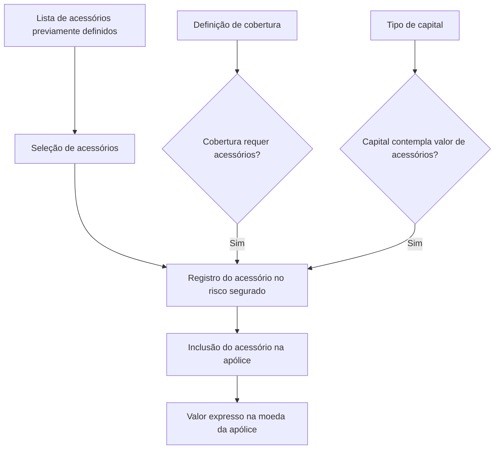
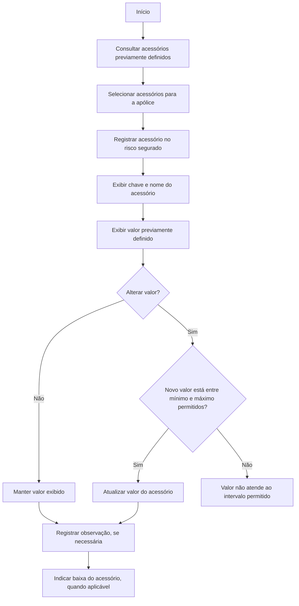

# Gestão de Acessórios no Risco Assegurado da Apólice

## 1. Metadados do Documento
- **Arquivo de Origem:** Não identificado
- **Tipo de Documento:** Manual Operacional / Especificação Funcional
- **Domínio / Sistema:** Gestão de riscos, acessórios e apólices de seguro
- **Público-Alvo:** Não identificado
- **Data/Versão Identificada:** Não identificada

---

## 2. Resumo Executivo & Contexto de Negócio

O documento descreve a funcionalidade **ACCESORIOS**, destinada a registrar no risco segurado os acessórios que estarão cobertos por uma apólice. A inclusão de acessórios está associada à definição de coberturas e capitais da apólice.

As informações sobre acessórios ficam acessíveis quando uma cobertura exige acessórios ou quando o tipo de capital de uma cobertura contempla o valor de acessórios. Portanto, o cadastro de acessórios integra a composição do risco segurado e a configuração de coberturas da apólice.

Os acessórios que podem ser incluídos no risco devem ser previamente definidos. A partir da lista de acessórios definidos, é possível selecionar aqueles que serão incluídos na apólice.

O documento apresenta ações de criação, modificação, exclusão e inabilitação, além dos campos funcionais usados para identificar, descrever, valorar, observar e indicar a permanência do acessório no risco segurado.

---

## 3. Arquitetura, Componentes & Tecnologias Envolvidas

### Componentes funcionais identificados

| Componente | Função identificada |
| :--- | :--- |
| Risco segurado | Entidade na qual os acessórios são registrados. |
| Acessório | Item previamente definido que pode ser incluído no risco segurado. |
| Apólice | Contexto no qual os acessórios selecionados serão incluídos e terão valor expresso na moeda da apólice. |
| Cobertura | Pode exigir acessórios conforme sua definição. |
| Tipo de capital | Pode contemplar o valor de acessórios. |
| Lista de acessórios definidos | Fonte de seleção dos acessórios que podem ser incluídos na apólice. |



> **Nota de Análise:** O documento não descreve tecnologias, interfaces de integração, métodos HTTP, contratos JSON, persistência de dados, autenticação, URLs de ambiente ou componentes técnicos de software.

---

## 4. Regras de Negócio, Especificações Funcionais & Processos

### Objetivo funcional

1. Registrar no risco os acessórios que estarão assegurados na apólice.
2. Disponibilizar as informações de acessórios quando:
   - a definição de alguma cobertura indicar que requer acessórios; ou
   - o tipo de capital de alguma cobertura contemplar o valor de acessórios.
3. Permitir a seleção, para inclusão na apólice, somente entre acessórios previamente definidos.

### Regras de inclusão de acessórios

1. Um acessório deve estar previamente definido para poder ser incluído no risco segurado.
2. A inclusão ocorre a partir de uma lista de acessórios definidos.
3. A lista permite selecionar os acessórios desejados para inclusão na apólice.
4. O acessório selecionado possui uma chave de identificação.
5. O acessório possui uma descrição que o identifica.
6. O valor do acessório é expresso na moeda da apólice.
7. O valor inicialmente exibido é o valor previamente definido para o acessório.
8. O valor do acessório pode ser modificado somente quando o novo valor estiver entre o valor mínimo permitido e o valor máximo permitido.
9. O campo de observação pode registrar informações adicionais relacionadas ao acessório.
10. O indicador de baixa informa se o acessório continua fazendo parte do risco segurado ou se deixou de estar coberto pela apólice.

### Ações listadas no documento

| Ação | Descrição disponível |
| :--- | :--- |
| Criar | Ação listada para a funcionalidade de acessórios. O documento não detalha o procedimento. |
| Modificar | Ação listada para a funcionalidade de acessórios. O documento detalha que o valor pode ser alterado dentro de limites mínimo e máximo permitidos. |
| Excluir | Ação listada para a funcionalidade de acessórios. O documento não detalha os critérios ou efeitos da exclusão. |
| Inabilitar | Ação listada para a funcionalidade de acessórios. O documento não detalha os critérios ou efeitos da inabilitação. |

### Fluxo funcional reconstruído



> **Nota de Análise:** O documento não especifica os valores mínimos e máximos permitidos, a forma de validação do intervalo, o comportamento diante de valor inválido, nem a diferença operacional entre excluir e inabilitar.

---

## 5. Tabelas de Parâmetros, Ambientes e Estruturas de Dados

| Item / Parâmetro | Descrição / Função | Tipo / Valores / Formato | Ambiente / Observações |
| :--- | :--- | :--- | :--- |
| Acessório | Exibe a chave que identifica o acessório selecionado. | Chave identificadora; formato não informado. | Associado ao acessório selecionado. |
| Nome do acessório | Contém a descrição que identifica o acessório. | Texto; formato e tamanho não informados. | Identificação descritiva do acessório. |
| Importe | Contém o valor do acessório. | Valor expresso na moeda da apólice. | Exibe inicialmente o valor previamente definido. Pode ser alterado dentro dos limites mínimo e máximo permitidos. |
| Valor mínimo | Limite inferior para alteração do valor do acessório. | Valor não informado. | Deve ser respeitado na modificação do campo Importe. |
| Valor máximo | Limite superior para alteração do valor do acessório. | Valor não informado. | Deve ser respeitado na modificação do campo Importe. |
| Observação | Armazena informação adicional desejada para o acessório. | Texto; formato e tamanho não informados. | Campo complementar. |
| Baixa | Indica se o acessório continua no risco segurado ou se não está mais coberto pela apólice. | Indicador; valores específicos não informados. | Relacionado à permanência da cobertura do acessório. |
| Criar | Ação disponível para acessórios. | Ação operacional. | Sem procedimento detalhado. |
| Modificar | Ação disponível para acessórios. | Ação operacional. | Inclui alteração de valor dentro dos limites permitidos. |
| Excluir | Ação disponível para acessórios. | Ação operacional. | Sem procedimento ou impactos detalhados. |
| Inabilitar | Ação disponível para acessórios. | Ação operacional. | Sem procedimento ou impactos detalhados. |

> **Nota de Análise:** O documento não apresenta servidores, URLs, ambientes, variáveis de configuração, caminhos de log, formatos de dados ou estruturas de integração.

---

## 6. Bateria de Perguntas & Respostas para RAG (FAQ Sintético)

### P1: Qual é o objetivo da funcionalidade de acessórios?
**R:** A funcionalidade de acessórios permite registrar no risco segurado os acessórios que estarão assegurados na apólice.

### P2: Quando as informações de acessórios ficam acessíveis?
**R:** As informações de acessórios ficam acessíveis quando a definição de alguma cobertura indica que requer acessórios ou quando o tipo de capital de alguma cobertura contempla o valor de acessórios.

### P3: É possível incluir qualquer acessório diretamente em uma apólice?
**R:** Não. Os acessórios que serão incluídos no risco segurado devem estar previamente definidos. A inclusão na apólice ocorre por meio da seleção de itens na lista de acessórios definidos.

### P4: O que o campo “Accesorio” apresenta?
**R:** O campo “Accesorio” mostra a chave que identifica o acessório selecionado.

### P5: Qual é a finalidade do campo “Nombre accesorio”?
**R:** O campo “Nombre accesorio” contém a descrição que identifica o acessório.

### P6: Em qual moeda é informado o valor do acessório?
**R:** O valor do acessório é expresso na moeda da apólice.

### P7: O valor de um acessório pode ser alterado?
**R:** Sim. O valor previamente definido para o acessório pode ser modificado desde que o novo valor esteja entre o valor mínimo permitido e o valor máximo permitido.

### P8: Qual valor é exibido inicialmente no campo de valor do acessório?
**R:** O campo exibe o valor previamente definido para o acessório.

### P9: Para que serve o campo de observação do acessório?
**R:** O campo de observação permite registrar qualquer informação adicional que se queira indicar para o acessório.

### P10: O que significa informar “Baja” para um acessório?
**R:** O indicador “Baja” informa se o acessório continua fazendo parte do risco segurado ou se já não está amparado pela apólice.

### P11: Quais ações são listadas para a gestão de acessórios?
**R:** O documento lista as ações de criar, modificar, excluir e inabilitar acessórios.

### P12: O documento explica a diferença entre excluir e inabilitar um acessório?
**R:** Não. O documento lista as ações de excluir e inabilitar, mas não descreve critérios, regras, efeitos ou diferenças operacionais entre elas.

---

## 7. Glossário de Termos, Siglas & Conceitos-Chave

- **Acessório:** Item associado ao risco segurado que pode ser incluído e assegurado na apólice.
- **Apólice:** Contexto de seguro no qual os acessórios selecionados são incluídos e no qual o valor do acessório é expresso em moeda.
- **Baixa:** Indicador que informa se o acessório continua fazendo parte do risco segurado ou se deixou de estar amparado pela apólice.
- **Capital:** Tipo de capital de uma cobertura que pode contemplar o valor de acessórios.
- **Cobertura:** Elemento da apólice cuja definição pode requerer acessórios.
- **Importe:** Valor monetário do acessório, expresso na moeda da apólice.
- **Risco segurado:** Risco no qual são registrados os acessórios que estarão assegurados na apólice.

---

## 8. Notas Críticas, Riscos & Limitações

- O documento não identifica o sistema, a versão, a data, o arquivo de origem ou o público-alvo.
- Não há detalhamento do procedimento operacional para criar, modificar, excluir ou inabilitar acessórios.
- O documento não informa os valores mínimo e máximo permitidos para alteração do valor do acessório.
- Não há definição dos formatos, obrigatoriedade, tamanhos ou validações dos campos de identificação, descrição e observação.
- Não são descritos comportamentos de erro, mensagens de validação, trilha de auditoria ou regras de autorização.
- Não há especificações de tecnologia, APIs, integração, banco de dados, ambientes, URLs, servidores ou logs.
- Não é possível determinar, com base no conteúdo, a diferença entre exclusão e inabilitação de um acessório.

---

## 9. Conteúdo Bruto Estruturado (Referência Fiel)

```text
--- [PÁGINA 1 DE 2] ---

ACCESORIOS
En que consiste
Registrar en el riesgo los accesorios que estarán asegurados en la póliza.
Esta información estará accesible siempre que la definición de alguna cobertura indique que requiere
accesorios, o bien, el tipo de capital de alguna cobertura contemple el importe de accesorios.
Los accesorios a incluir en el riesgo deben estar definidos previamente. De la lista de accesorios
definidos, se podrán seleccionar los que se quieran incluir en la póliza.
Posibles acciones
 CREAR ( )
 MODIFICAR ( )
 BORRAR ( )
 INHABILITAR ( )
Proceso a seguir
A continuación detalla la información requerida.
 / 
 RS
Inicio Soluciones APIs Documentación Zeus
ES


--- [PÁGINA 2 DE 2] ---

ACCESORIOS
Accesorio
Muestra la clave que identifica el accesorio seleccionado.
Nombre accesorio
Contiene la descripción que identifica el accesorio.
Importe (  )
Contiene el valor del accesorio, expresado en la moneda de la póliza.
En este campo se muestra el valor del accesorio, previamente definido, que podrá modificarse
siempre que el nuevo valor se encuentre entre el valor mínimo y valor máximo permitido.
Observación (  )
Esta propiedad contiene cualquier información adicional que se quiera indicar para el accesorio.
Baja (  )
Indica si el accesorio sigue formando parte del riesgo asegurado, o por el contrario, ya no está
amparado por la póliza.
¿se puede modificar?
```
