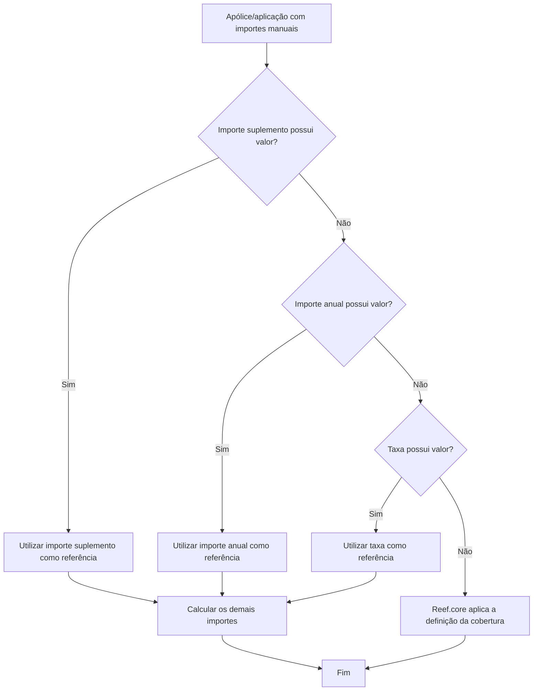

# Coberturas e Determinação de Importes Manuais no Reef.core

## 1. Metadados do Documento
- **Arquivo de Origem:** Não identificado
- **Tipo de Documento:** Manual Operacional
- **Domínio / Sistema:** Reef.core — gestão de coberturas de apólice/aplicação
- **Público-Alvo:** Operação, Negócio, Analistas Funcionais e Desenvolvedores
- **Data/Versão Identificada:** Não identificada

---

## 2. Resumo Executivo & Contexto de Negócio

O documento descreve a operação de coberturas em uma apólice ou aplicação no contexto do sistema Reef.core. São apresentados os campos utilizados para consultar e alterar atributos de cobertura, incluindo contratação, capital/soma assegurada, franquia e moeda da franquia.

A funcionalidade de contratação permite identificar se uma cobertura está contratada ou não. Para coberturas sem soma assegurada, a caixa de verificação é o mecanismo usado pelo operador para indicar a contratação. O mesmo mecanismo também se aplica a coberturas com soma assegurada que não pode ser modificada pelo operador.

O conteúdo detalha o tratamento de importes manuais de prêmio. Quando o ramo permite prêmios manuais e a apólice/aplicação possui essa característica, o Reef.core pode utilizar três campos: importe suplemento, importe anual e taxa. Caso os três campos permaneçam sem valor, o Reef.core calcula o importe conforme a definição da cobertura.

Existe uma precedência obrigatória entre os importes manuais: importe suplemento, importe anual e taxa. O primeiro campo preenchido conforme essa ordem é utilizado como referência para calcular os demais importes. A taxa representa o valor por mil do importe anual sobre a soma assegurada.

---

## 3. Arquitetura, Componentes & Tecnologias Envolvidas

O documento menciona exclusivamente o sistema **Reef.core** como responsável por aplicar a definição de cobertura quando não há valores preenchidos nos campos de importes manuais.

| Componente / Elemento | Papel identificado |
| :--- | :--- |
| Reef.core | Aplica a definição da cobertura para determinar o importe quando importe suplemento, importe anual e taxa não possuem valor. |
| Apólice/aplicação | Entidade que pode possuir a característica de importes manuais. |
| Cobertura | Elemento segurável com atributos como contratação, soma assegurada, franquia, moeda da franquia e valores de prêmio. |
| Ramo | Deve permitir prêmios manuais para que os campos manuais possam ser utilizados. |
| Operador / usuário que realiza a operação | Pode contratar ou descontratar coberturas e, quando permitido, alterar capital, franquia ou moeda da franquia. |



> **Nota de Análise:** O documento não detalha arquitetura de infraestrutura, integrações, métodos HTTP, contratos JSON, bancos de dados, ambientes técnicos ou tecnologias além da menção ao Reef.core.

---

## 4. Regras de Negócio, Especificações Funcionais & Processos

### 4.1. Coluna de cobertura

A coluna **Cobertura** mostra o nome da cobertura.

### 4.2. Opções da cobertura

A coluna **Opções** mostra se existem atributos definidos na cobertura. Quando existem atributos definidos, o operador pode acessar o ícone correspondente.

> **Nota de Análise:** O texto extraído indica a existência de um ícone, mas não preserva sua representação visual nem detalha quais atributos podem ser consultados ou modificados por meio dele.

### 4.3. Regra de contratação

A caixa de verificação **Contratada** possui duas funções:

1. Indicar se a cobertura está contratada ou não contratada.
2. Para coberturas sem soma assegurada, permitir que o operador indique se a cobertura está contratada ou não.

A regra de contratação aplica-se a qualquer tipo de cobertura, incluindo:

- Coberturas com soma assegurada.
- Coberturas sem soma assegurada.
- Coberturas com soma assegurada que não pode ser modificada pelo operador.

### 4.4. Regra de capital ou soma assegurada

Quando a cobertura possui soma assegurada e essa soma pode ser modificada, o operador pode alterar ou incluir a soma assegurada no campo **Capital**.

### 4.5. Regra de franquia

O campo **Franquia** determina a franquia aplicável à cobertura. O operador pode modificar a franquia somente quando:

1. A cobertura possui franquias.
2. O operador possui permissão para modificar a franquia.

### 4.6. Regra de moeda da franquia

O campo **Moeda Franquia** apresenta a moeda em que a franquia está expressa. Quando a moeda pode ser modificada, o operador pode alterá-la.

### 4.7. Condições para uso de importes manuais

Os campos de importes manuais podem ser utilizados somente quando ambas as condições são atendidas:

1. O ramo permite prêmios manuais.
2. A apólice/aplicação possui a característica de importes manuais.

Os campos manuais são:

- Importe suplemento.
- Importe anual.
- Taxa.

Mesmo quando a apólice/aplicação está configurada para importes manuais, o Reef.core aplica a definição da cobertura para calcular o importe caso os três campos estejam sem valor.

### 4.8. Precedência para determinação de importes manuais

A determinação do campo de referência segue a ordem de prioridade abaixo:

1. **Importe suplemento**
2. **Importe anual**
3. **Taxa**

A regra funciona da seguinte forma:

1. Se o campo **Importe suplemento** possui valor, o importe suplemento é utilizado como referência e os demais importes são calculados a partir dele.
2. Se o campo **Importe suplemento** não possui valor e o campo **Importe anual** possui valor, o importe anual é utilizado como referência e os demais importes são calculados a partir dele.
3. Se os campos **Importe suplemento** e **Importe anual** não possuem valor e o campo **Taxa** possui valor, a taxa é utilizada como referência e os demais importes são calculados a partir dela.
4. Se os campos **Importe suplemento**, **Importe anual** e **Taxa** não possuem valor, o Reef.core aplica a definição da cobertura para calcular o importe.

### 4.9. Definições dos campos de importes manuais

- **Importe suplemento:** importe correspondente ao período de vigência do movimento.
- **Importe anual:** custo da cobertura durante um ano.
- **Taxa:** valor por mil que representa o importe anual sobre a soma assegurada.

A fórmula apresentada para a taxa é:

```text
1 taxa := importe anual / soma assegurada * 1000
```

---

## 5. Tabelas de Parâmetros, Ambientes e Estruturas de Dados

| Item / Parâmetro | Descrição / Função | Tipo / Valores / Formato | Ambiente / Observações |
| :--- | :--- | :--- | :--- |
| Cobertura | Mostra o nome da cobertura. | Nome da cobertura. | Coluna da interface. |
| Opções | Mostra se existem atributos definidos na cobertura. | Indicador de existência de atributos e ícone de acesso. | O documento não detalha os atributos nem o comportamento do ícone. |
| Contratada | Indica se a cobertura está contratada ou não. | Caixa de verificação. | Aplica-se a qualquer tipo de cobertura. |
| Contratada | Permite informar contratação para cobertura sem soma assegurada. | Caixa de verificação. | Também se aplica a cobertura com soma assegurada não modificável pelo operador. |
| Capital | Permite alterar ou incluir a soma assegurada. | Valor de soma assegurada. | Disponível quando a cobertura possui soma assegurada modificável. |
| Franquia | Determina a franquia aplicável à cobertura. | Valor de franquia. | Modificável somente se a cobertura possuir franquias e o operador puder alterá-la. |
| Moeda Franquia | Mostra a moeda em que a franquia é expressa. | Moeda. | Modificável somente quando permitido. |
| Importe suplemento | Importe relativo ao período de vigência do movimento. | Importe manual. | Tem maior prioridade entre os campos manuais. |
| Importe anual | Custo da cobertura por um ano. | Importe manual. | Utilizado quando importe suplemento não possui valor. |
| Taxa | Tanto por mil do importe anual em relação à soma assegurada. | `importe anual / soma assegurada * 1000`. | Utilizada quando importe suplemento e importe anual não possuem valor. |
| Definição da cobertura | Regra utilizada pelo Reef.core para determinar o importe. | Regra de cálculo não detalhada. | Aplicada quando os três campos manuais não possuem valor. |
| Ramo | Deve permitir prêmios manuais. | Condição de habilitação. | Necessário para uso dos campos de importes manuais. |
| Apólice/aplicação | Deve possuir característica de importes manuais. | Condição de habilitação. | Necessária para uso dos campos de importes manuais. |

---

## 6. Bateria de Perguntas & Respostas para RAG (FAQ Sintético)

### P1: O que a coluna Cobertura apresenta na operação de coberturas?
**R:** A coluna Cobertura mostra o nome da cobertura associada à apólice ou aplicação.

### P2: Para que serve a caixa de verificação Contratada?
**R:** A caixa de verificação Contratada indica se uma cobertura está contratada ou não. Para coberturas sem soma assegurada, a caixa de verificação é o mecanismo pelo qual o operador informa a contratação. Ela também se aplica a coberturas com soma assegurada que não pode ser modificada pelo operador.

### P3: A regra de contratação é válida apenas para coberturas sem soma assegurada?
**R:** Não. A indicação de contratação aplica-se a qualquer tipo de cobertura, incluindo coberturas com soma assegurada e coberturas sem soma assegurada.

### P4: Quando o operador pode modificar o campo Capital?
**R:** O operador pode alterar ou incluir a soma assegurada no campo Capital quando a cobertura possui soma assegurada e essa soma assegurada pode ser modificada pelo operador.

### P5: Em quais condições a franquia de uma cobertura pode ser alterada?
**R:** A franquia pode ser modificada quando a cobertura possui franquias e o operador que realiza a operação possui permissão para modificá-la.

### P6: Quando a moeda da franquia pode ser modificada?
**R:** A moeda da franquia pode ser alterada somente quando a moeda estiver configurada como modificável para o operador que realiza a operação.

### P7: Quais condições precisam ser atendidas para utilizar importes manuais?
**R:** O uso de importes manuais exige que o ramo permita prêmios manuais e que a apólice/aplicação possua a característica de importes manuais.

### P8: Quais campos podem ser utilizados como importes manuais?
**R:** Os campos de importes manuais são Importe suplemento, Importe anual e Taxa.

### P9: Qual é a prioridade entre importe suplemento, importe anual e taxa?
**R:** A prioridade é: primeiro Importe suplemento, depois Importe anual e, por último, Taxa. O primeiro campo preenchido nessa sequência é utilizado como referência para determinar os demais importes.

### P10: O que acontece se o campo Importe suplemento tiver valor?
**R:** Quando o campo Importe suplemento possui valor, ele é utilizado como referência para calcular os demais importes, sem utilizar Importe anual ou Taxa como referência.

### P11: O que acontece quando importe suplemento, importe anual e taxa estão sem valor?
**R:** Quando os três campos estão sem valor, o Reef.core aplica a definição da cobertura para determinar o importe da prima.

### P12: Como a taxa é definida no documento?
**R:** A taxa é o tanto por mil que representa o importe anual sobre a soma assegurada. A fórmula informada é: `taxa = importe anual / soma assegurada * 1000`.

---

## 7. Glossário de Termos, Siglas & Conceitos-Chave

- **Reef.core:** Sistema mencionado como responsável por aplicar a definição da cobertura quando não existem valores nos campos de importes manuais.
- **Cobertura:** Elemento cujo nome, contratação, soma assegurada, franquia e importes podem ser consultados ou alterados conforme as permissões e características aplicáveis.
- **Contratada:** Estado que indica se uma cobertura está incluída ou não.
- **Soma assegurada / Capital:** Valor associado à cobertura que pode ser alterado quando permitido.
- **Franquia:** Valor aplicável à cobertura, modificável quando a cobertura possui franquias e o operador tem permissão.
- **Moeda franquia:** Moeda em que o valor da franquia é expresso.
- **Importes manuais:** Característica que permite utilizar importe suplemento, importe anual ou taxa para determinar valores de prêmio.
- **Importe suplemento:** Importe correspondente ao período de vigência do movimento.
- **Importe anual:** Custo da cobertura por um ano.
- **Taxa:** Tanto por mil que relaciona importe anual e soma assegurada.
- **Ramo:** Condição funcional que deve permitir prêmios manuais para habilitar o uso de importes manuais.
- **Apólice/aplicação:** Entidade que deve possuir a característica de importes manuais para que os campos manuais possam ser usados.

---

## 8. Notas Críticas, Riscos & Limitações

- O documento não identifica nome do arquivo, autor, versão, data, ambiente, URL ou identificação formal do processo.
- O documento não detalha a definição de cobertura aplicada pelo Reef.core quando os campos de importes manuais estão vazios.
- O documento não informa regras de arredondamento, moeda, precisão decimal, validações de valores negativos, limites de capital ou tratamento para divisão por zero na fórmula da taxa.
- O documento não define quais permissões, perfis ou papéis determinam se o operador pode alterar capital, franquia ou moeda da franquia.
- O texto menciona um ícone na coluna Opções, mas não especifica seu nome, aparência, ação, atributos exibidos ou regras de acesso.
- Não há detalhamento de métodos HTTP, contratos de integração, bancos de dados, logs, rotas operacionais ou ambientes técnicos.

---

## 9. Conteúdo Bruto Estruturado (Referência Fiel)

```text
--- [PÁGINA 1 DE 3] ---

COBERTURAS
En que consiste
Posibles acciones
 MODIFICAR ( )
Proceso a seguir
COBERTURA
Esta columna muestra el nombre de la cobertura.
OPCIONES
Esta columna muestra si existen atributos definidos en la cobertura. En ese caso, si se pulsa sobre el
icono 
 .
CONTRATADA ( )
Esta casilla de verificación tiene dos funciones:
 / 
 RS
Inicio Soluciones APIs Documentación Zeus
ES


--- [PÁGINA 2 DE 3] ---

1. Indica si la cobertura está contratada (
 ) o no (
 ). Esto aplica a cualquier tipo de
cobertura. Es decir, aplica a coberturas que tienen suma asegurada o coberturas que no
disponen de suma asegurada.
2. Para coberturas que NO disponen de suma asegurada (ver tipo de cobertura), esta caja de
verificación es sobre la que actúa el usuario que está realizando la operación para indicar que la
cobertura está contratada (o no). También aplica a coberturas que tienen suma asegurada y esta
no puede ser modificada por el usuario que está realizando la operación.
CAPITAL (  )
En este punto si la cobertura dispone de suma asegurada y este se puede modificar, el usuario que
realiza la operación, puede alterar o incluir la suma asegurada.
FRANQUICIA (   )
Aquí se determina cual será la franquicia que aplicará a la cobertura. Siempre que la cobertura
disponga de franquicias y el usuario que realiza la operación, pueda modificarla.
MONEDA FRANQUICIA (  )
Muestra la moneda en la que está expresada la franquicia. En el caso que la moneda pueda ser
modificada, el usuario que realiza la operación podrá alterarla.
IMPORTES MANUALES
En el caso que el ramo permita primas manuales y la póliza/aplicación disponga de esta carcterística,
se podrán utilizar los siguientes campos. Es importante comentar que, aunque la póliza/aplicación se
haya determinado que los importes son manuales, si los tres campos que se comentan a
continuación, se encuentran sin valor, Reef.core aplicará la definición de la cobertura para hallar el
importe de la prima. También hay que tener en cuenta que se aplica una prioridad a la hora de
determinar cual es el campo que se tomará como referencia si hubiera más de un campo con valor.
El orden es el siguiente
1. Importe suplemento
2. Importe anual
3. Tasa
Esto quiere decir que, si el campo importe suplemento tiene valor, se tomará este y no otro para
hallar el resto de campos. En cambio, si el importe del suplemento está vacío se evaluará el campo
importe anual. Si este tiene valor, se utilizará este para hallar el resto de los campos. Si importe anual
está vacío, se evaluará el campo tasa. Si este tiene valor, se tomará el campo tasa para hallar el
resto de campos. En cambio, si tasa está vacío se aplicará la definición de la cobertura para hallar el
importe.


--- [PÁGINA 3 DE 3] ---

A continuación se muestra el proceso que se sigue para, en caso que la póliza/aplicación tenga
importes manuales hallar el importe
SI
NO
SI
NO
SI
NO
¿El campo
IMPORTE
SUPLEMENTO
tiene valor? ¿El campo
IMPORTE
ANUAL
tiene valor?
¿El campo
TASA
tiene valor?
Este es el importe
que se utiliza Se halla el resto de importes
Se halla el importe según
definición de la cobertura FIN
IMPORTE SUPLEMENTO (  )
Será el importe correspondiente al periodo de vigencia del movimiento. Para más información
acceder a este enlace.
IMPORTE ANUAL (  )
Corresponde al coste de la cobertura por un año. Para más información acceder a este enlace.
TASA (  )
Es el tanto por mil que representa el importe anual sobre la suma asegurada. Es decir:
1 tasa := importe anual / suma asegurada * 1000
```
