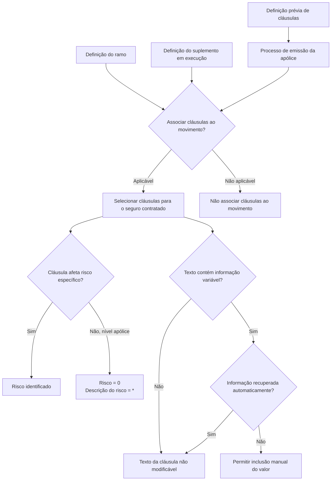

# Gestão de Cláusulas em Movimentos de Apólices de Seguro

## 1. Metadados do Documento
- **Arquivo de Origem:** `Não identificado no conteúdo fornecido`
- **Tipo de Documento:** `Manual Operacional`
- **Domínio / Sistema:** `Emissão e movimentação de apólices de seguro — gestão de cláusulas`
- **Público-Alvo:** `Usuários de emissão de apólices, analistas funcionais, operação e desenvolvedores`
- **Data/Versão Identificada:** `Não identificada`

---

## 2. Resumo Executivo & Contexto de Negócio

O documento descreve a funcionalidade de gestão de cláusulas associadas a apólices de seguro. Cláusulas representam condições que devem ser consideradas conforme as características do risco segurado. Essas condições são definidas previamente à emissão da apólice e, durante a emissão, são selecionadas conforme sua aplicabilidade ao seguro contratado.

A associação de cláusulas depende da definição do ramo de seguro ou da definição do suplemento que está sendo executado. Essas definições determinam se cláusulas devem ou não ser associadas ao movimento da apólice. O conteúdo fornecido não detalha regras específicas por ramo, suplemento, produto ou tipo de risco.

A funcionalidade apresenta ações possíveis de criar, modificar e apagar, sem especificar os critérios operacionais, permissões, telas ou consequências de cada ação. Também apresenta propriedades para identificar o risco afetado, a cláusula, o estado de seleção e a existência de texto variável.

Uma cláusula pode afetar um risco específico ou toda a apólice. Quando a cláusula é aplicável ao nível da apólice, o identificador de risco deve ter valor `0` e a descrição do risco deve ser exibida como asterisco (`*`).

A edição da seleção e do texto da cláusula possui restrições. A seleção pode ser modificada somente quando a definição da cláusula permite atuação do usuário. O texto da cláusula pode ser preenchido manualmente apenas quando contém informação variável que não é recuperada automaticamente; nos demais casos, o texto não pode ser alterado.

---

## 3. Arquitetura, Componentes & Tecnologias Envolvidas

O conteúdo não identifica tecnologias, APIs, microsserviços, bancos de dados, protocolos, URLs, ambientes, métodos HTTP ou contratos de integração. São citados elementos de navegação ou plataforma como `Soluciones`, `APIs`, `Documentación` e `Zeus`, porém o documento não explica suas funções nem estabelece relações técnicas entre esses elementos.

Os componentes funcionais identificados são:

| Componente / Elemento | Papel identificado no documento | Detalhamento disponível |
| :--- | :--- | :--- |
| Definição de cláusula | Determina condições previamente definidas para utilização na emissão da apólice. | Não detalha estrutura, origem ou ciclo de vida da definição. |
| Processo de emissão | Processo no qual são selecionadas cláusulas aplicáveis ao seguro contratado. | Não detalha etapas, sistemas ou usuários responsáveis. |
| Definição de ramo | Pode determinar se cláusulas devem ser associadas ao movimento da apólice. | Não detalha ramos ou regras de associação. |
| Definição de suplemento | Pode determinar se cláusulas devem ser associadas ao movimento da apólice. | Não detalha suplementos ou regras de associação. |
| Movimento da apólice | Contexto em que cláusulas podem ser incluídas, selecionadas ou associadas. | Não detalha tipos de movimento. |
| Risco | Entidade à qual uma cláusula pode estar associada. | Pode ser específico ou representar o nível da apólice. |
| Texto da cláusula | Conteúdo completo da cláusula, eventualmente com informação variável. | A edição depende de condições documentadas. |



> **Nota de Análise:** O documento não detalha a implementação técnica da funcionalidade, os métodos de persistência, integrações, APIs, contratos JSON, mecanismos de autenticação ou permissões por perfil.

---

## 4. Regras de Negócio, Especificações Funcionais & Processos

### 4.1 Finalidade das cláusulas

1. As cláusulas permitem identificar, na apólice, as condições que devem ser consideradas de acordo com as características do risco segurado.
2. As cláusulas são definidas previamente à emissão da apólice.
3. Durante o processo de emissão, devem ser selecionadas as cláusulas aplicáveis ao seguro em contratação.

### 4.2 Determinação da associação de cláusulas

1. A definição do ramo pode determinar se cláusulas devem ser associadas ao movimento da apólice.
2. A definição do suplemento em execução também pode determinar se cláusulas devem ser associadas ao movimento da apólice.
3. O documento não detalha como a definição do ramo ou do suplemento é configurada, consultada ou validada.

### 4.3 Ações possíveis

O documento apresenta as seguintes ações possíveis:

- `CRIAR`
- `MODIFICAR`
- `APAGAR`

> **Nota de Análise:** O documento lista as ações possíveis, mas não detalha condições de habilitação, regras de autorização, efeitos em dados existentes ou fluxos de confirmação.

### 4.4 Associação com risco ou apólice

1. A propriedade **Risco** contém o identificador do risco afetado pela cláusula.
2. Quando a seleção da cláusula não depende de um risco específico e ocorre ao nível da apólice, a propriedade **Risco** deve sempre ter valor `0`.
3. A propriedade **Descrição do risco** mostra o nome pelo qual o risco afetado pela cláusula é identificado.
4. Quando a cláusula não está associada a um risco concreto e afeta toda a apólice, a **Descrição do risco** deve sempre ser apresentada como `*`.

### 4.5 Identificação e seleção da cláusula

1. A propriedade **Cláusula** identifica a chave da cláusula.
2. A propriedade **Nome cláusula** apresenta o título definido para a cláusula.
3. A propriedade **Seleção** indica se a cláusula está selecionada para inclusão no movimento da apólice.
4. A propriedade **Seleção** somente estará habilitada para alteração quando a definição da cláusula permitir que o usuário atue sobre ela.

### 4.6 Texto variável e alteração do texto da cláusula

1. A propriedade **Texto variável** informa se o texto da cláusula contém informação variável.
2. Informação variável corresponde a dados que dependem do movimento da apólice.
3. A propriedade **Texto cláusula** apresenta o texto completo da cláusula.
4. Quando a cláusula possui texto variável e a informação variável não é recuperada automaticamente, é possível incluir manualmente o valor necessário.
5. Em qualquer outro cenário, o texto da cláusula não pode ser modificado.

---

## 5. Tabelas de Parâmetros, Ambientes e Estruturas de Dados

| Item / Parâmetro | Descrição / Função | Tipo / Valores / Formato | Ambiente / Observações |
| :--- | :--- | :--- | :--- |
| Risco | Identificador do risco afetado pela cláusula. | Identificador; valor `0` quando a cláusula é selecionada ao nível da apólice. | O tipo técnico do identificador não é detalhado. |
| Descrição do risco | Nome que identifica o risco afetado pela cláusula. | Texto; valor `*` quando a cláusula afeta toda a apólice. | Aplicável quando não existe associação a risco concreto. |
| Cláusula | Chave que identifica a cláusula. | Chave / identificador. | Formato não detalhado. |
| Nome cláusula | Título definido para a cláusula. | Texto. | Sem regra adicional detalhada. |
| Seleção | Indica se a cláusula está selecionada para inclusão no movimento da apólice. | Indicador de seleção. | Só pode ser modificado quando a definição da cláusula permite atuação do usuário. |
| Texto variável | Indica se o texto da cláusula possui informação variável dependente do movimento da apólice. | Indicador. | Não detalha formato ou valores técnicos. |
| Texto cláusula | Mostra o texto completo da cláusula. | Texto. | Pode receber valor manual somente em condição específica. |
| Valor manual do texto variável | Informação variável inserida manualmente no texto da cláusula. | Valor não especificado. | Permitido quando há texto variável e a informação não é recuperada automaticamente. |
| Definição do ramo | Pode determinar a necessidade de associar cláusulas ao movimento da apólice. | Regra de definição não especificada. | Não há exemplos de ramo. |
| Definição do suplemento | Pode determinar a necessidade de associar cláusulas ao movimento da apólice. | Regra de definição não especificada. | Aplicável ao suplemento em execução. |
| Criar | Ação possível sobre cláusulas. | Ação. | Critérios não detalhados. |
| Modificar | Ação possível sobre cláusulas. | Ação. | Critérios não detalhados. |
| Apagar | Ação possível sobre cláusulas. | Ação. | Critérios não detalhados. |

> **Nota de Análise:** O conteúdo não apresenta URLs, servidores, ambientes, rotas de log, portas, variáveis de configuração ou estruturas técnicas de dados.

---

## 6. Bateria de Perguntas & Respostas para RAG (FAQ Sintético)

### P1: Qual é a finalidade das cláusulas na emissão de uma apólice de seguro?
**R:** As cláusulas identificam as condições que devem ser consideradas na apólice conforme as características do risco segurado. Elas são definidas antes da emissão e, durante a emissão, são selecionadas quando aplicáveis ao seguro contratado.

### P2: Em que momento as cláusulas são definidas e selecionadas?
**R:** As cláusulas são definidas previamente à emissão da apólice. A seleção das cláusulas aplicáveis ocorre no processo de emissão da apólice, de acordo com o seguro que está sendo contratado.

### P3: O que determina se uma cláusula deve ser associada a um movimento da apólice?
**R:** A definição do ramo ou a definição do suplemento que está sendo executado determina se cláusulas devem ou não ser associadas ao movimento da apólice. O documento não especifica as regras internas dessas definições.

### P4: Qual valor deve ser atribuído ao campo Risco quando uma cláusula afeta toda a apólice?
**R:** Quando a seleção da cláusula não depende de um risco específico e é realizada ao nível da apólice, a propriedade **Risco** deve sempre ter valor `0`.

### P5: Como deve ser exibida a descrição do risco para uma cláusula que afeta toda a apólice?
**R:** Quando a cláusula não está associada a um risco concreto e afeta toda a apólice, a propriedade **Descrição do risco** deve sempre ser exibida como um asterisco (`*`).

### P6: O que representa o campo Cláusula?
**R:** O campo **Cláusula** identifica a chave da cláusula. O documento não informa o formato técnico dessa chave.

### P7: Quando o usuário pode alterar a seleção de uma cláusula?
**R:** O usuário pode modificar a propriedade **Seleção** somente quando a definição da cláusula permite que o usuário atue sobre ela. A seleção indica se a cláusula será incluída no movimento da apólice.

### P8: O que significa Texto variável em uma cláusula?
**R:** **Texto variável** indica que o texto da cláusula possui dados dependentes do movimento da apólice. O documento não apresenta exemplos desses dados variáveis.

### P9: Quando o texto de uma cláusula pode ser modificado manualmente?
**R:** O texto pode receber valor manual quando a cláusula possui texto variável e essa informação variável não é recuperada automaticamente. Em qualquer outro caso, o texto da cláusula não pode ser modificado.

### P10: Quais ações possíveis o documento apresenta para a gestão de cláusulas?
**R:** O documento apresenta as ações de criar, modificar e apagar. Não são descritos os critérios, permissões, validações ou consequências operacionais dessas ações.

---

## 7. Glossário de Termos, Siglas & Conceitos-Chave

- **Apólice:** Documento ou contexto de seguro no qual as cláusulas são consideradas e selecionadas.
- **Cláusula:** Condição previamente definida que pode ser considerada e selecionada para um seguro ou movimento de apólice.
- **Definição de cláusula:** Configuração que pode permitir ou restringir a atuação do usuário sobre a seleção da cláusula.
- **Emissão:** Processo em que são selecionadas as cláusulas aplicáveis ao seguro contratado.
- **Informação variável:** Dados do texto da cláusula que dependem do movimento da apólice.
- **Movimento da apólice:** Contexto no qual uma cláusula pode ser incluída ou selecionada.
- **Ramo:** Definição que pode determinar a associação ou não de cláusulas ao movimento da apólice.
- **Risco:** Entidade afetada pela cláusula; quando não há risco específico, a cláusula está ao nível da apólice.
- **Suplemento:** Definição em execução que pode determinar a associação ou não de cláusulas ao movimento da apólice.
- **Texto da cláusula:** Texto completo apresentado para uma cláusula.
- **Zeus:** Termo exibido no conteúdo original, sem definição funcional ou técnica adicional.

---

## 8. Notas Críticas, Riscos & Limitações

- O documento não identifica o nome do arquivo de origem, data, versão, autor, área responsável ou histórico de alterações.
- Não há detalhamento de tecnologia, arquitetura de software, APIs, microsserviços, bancos de dados, integrações, URLs, servidores, ambientes ou logs.
- As ações de criar, modificar e apagar são listadas, mas não possuem fluxo operacional, critérios de autorização, validações ou efeitos descritos.
- O documento não detalha a configuração de ramo, suplemento ou definição de cláusula que determina a associação de cláusulas.
- Não são fornecidos exemplos de cláusulas, riscos, suplementos, textos variáveis ou valores recuperados automaticamente.
- O conteúdo termina com as perguntas “¿Cuándo se puede incluir o excluir una cláusula?” e “¿Cuándo es posible modificar el texto de la cláusula?”, sem apresentar respostas adicionais além das regras previamente descritas.
- A permissão de alteração da seleção depende da definição da cláusula, mas os critérios dessa definição não são especificados.
- A alteração manual do texto depende de informação variável não recuperada automaticamente, porém o mecanismo de recuperação automática não é descrito.

---

## 9. Conteúdo Bruto Estruturado (Referência Fiel)

```text
--- [PÁGINA 1 DE 3] ---

CLÁUSULAS
En que consiste
Identificar en la póliza las condiciones que deben considerarse según las características del riesgo
asegurado.
Las cláusulas se definen de forma previa a la emisión de la póliza. En el proceso de emisión se
seleccionan aquellas cláusulas que aplican para el seguro que se está contratando.
Será la definición del ramo, o la definición del suplemento que se esté ejecutando, las que
determinen si se deben asociar o no cláusulas al movimiento de la póliza.
Posibles acciones
 CREAR ( )
 MODIFICAR ( )
 BORRAR ( )
Proceso a seguir
A continuación detalla la información requerida.
 / 
 RS
Inicio Soluciones APIs Documentación Zeus
ES


--- [PÁGINA 2 DE 3] ---

Riesgo
Contiene el identificador del riesgo al que afecta la cláusula.
Si la selección de la cláusula no depende de un riesgo, es a nivel póliza, esta propiedad tendrá
siempre valor 0.
Descripción del riesgo
Muestra el nombre con el que se identifica el riesgo al que afecta la cláusula. Si la cláusula no se
asocia a ningún riesgo concreto, es decir, afecta a toda la póliza, la descripción será siempre un
asterisco (*).
Cláusula
Identifica la clave de la cláusula.
Nombre cláusula
Muestra el título definido para la cláusula.
Selección ( )
Indica si la cláusula está o no seleccionada para ser incluida en el movimiento de la póliza.


--- [PÁGINA 3 DE 3] ---

Esta propiedad estará habilitada y se podrá modificar cuando la definición de la cláusula permita
que el usuario pueda actuar sobre ella.
Texto variable
Esta propiedad muestra si el texto de la cláusula tiene o no información variable, es decir, datos que
dependen del movimiento de la póliza.
Texto cláusula ( )
Muestra el texto completo de la cláusula.
Cuando la cláusula tiene texto variable y esta información no se recupera de forma automática, es
posible incluir el valor de forma manual. En cualquier otro caso, el texto de la cláusula no se
puede modificar.
¿Cuándo se puede incluir o excluir una cláusula?
¿Cuándo es posible modificar el texto de la cláusula?
```
