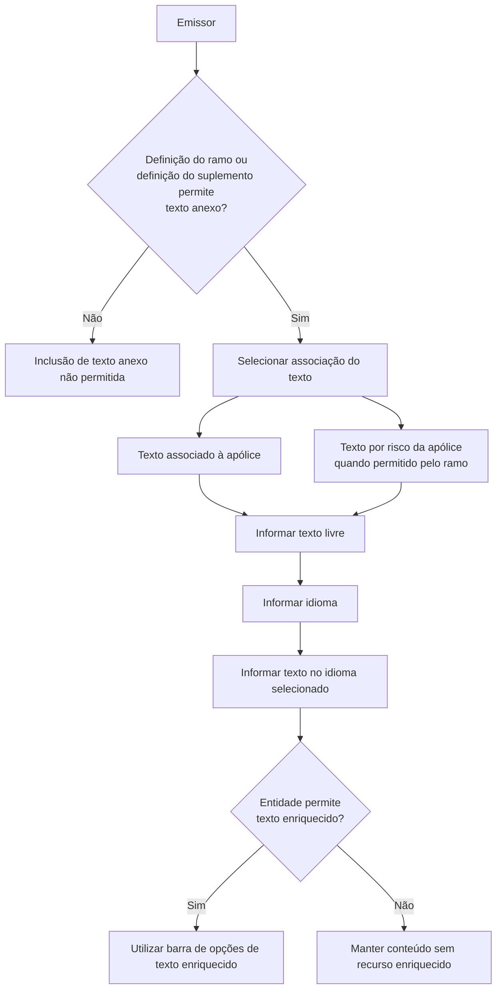

# Gestão de Texto Anexo em Apólices de Seguro

## 1. Metadados do Documento
- **Arquivo de Origem:** Não identificado
- **Tipo de Documento:** Especificação Funcional
- **Domínio / Sistema:** Emissão e modificação de apólices de seguro
- **Público-Alvo:** Emissores de apólices, analistas funcionais e equipes operacionais
- **Data/Versão Identificada:** Não identificada

---

## 2. Resumo Executivo & Contexto de Negócio

O documento descreve a funcionalidade de **texto anexo** para apólices de seguro. Essa funcionalidade permite incluir texto livre para esclarecer conceitos ou registrar aspectos específicos que afetem as condições de uma apólice.

A possibilidade de incluir texto anexo não é universal: a definição do ramo de seguro ou a definição do suplemento em execução determina se a inclusão é permitida. O documento não detalha os critérios internos dessas definições, os ramos existentes nem a forma pela qual essa permissão é configurada.

O texto anexo pode ser associado à apólice como um todo. Quando a definição do ramo permitir, também podem ser registrados textos distintos para cada risco da apólice. O documento lista as ações de criar, modificar e apagar textos anexos.

A funcionalidade suporta anexos em múltiplos idiomas. O emissor informa o idioma e, em seguida, inclui o conteúdo correspondente naquele idioma. Caso a entidade permita, o conteúdo pode ser informado em formato enriquecido, com uma barra de opções disponível para edição.

---

## 3. Arquitetura, Componentes & Tecnologias Envolvidas

O conteúdo disponibilizado não descreve arquitetura de software, tecnologias, APIs, bancos de dados, contratos JSON, métodos HTTP, integrações ou ambientes técnicos.

Os elementos funcionais identificados são:

- **Apólice:** entidade à qual o texto anexo pode ser associado.
- **Risco da apólice:** nível alternativo de associação de texto, quando autorizado pela definição do ramo.
- **Definição do ramo:** definição que determina se o texto anexo pode ser incluído.
- **Definição do suplemento:** definição em execução que também pode determinar a permissão para inclusão.
- **Emissor:** responsável por informar idioma e texto por idioma.
- **Texto enriquecido:** modalidade de conteúdo disponível apenas se a entidade permitir.



> **Nota de Análise:** Os nomes “Inicio”, “Soluciones”, “APIs”, “Documentación” e “Zeus” aparecem no conteúdo bruto como elementos de navegação ou interface. O documento não descreve suas responsabilidades funcionais ou técnicas.

---

## 4. Regras de Negócio, Especificações Funcionais & Processos

### 4.1 Finalidade do texto anexo

1. O texto anexo permite incluir texto livre em uma apólice de seguro.
2. O objetivo do texto livre é esclarecer algum conceito ou indicar algum aspecto específico que afete as condições do seguro.
3. O texto anexo pode ser utilizado durante a emissão da apólice ou durante uma modificação da apólice.

### 4.2 Regras de permissão

1. A definição do ramo pode determinar se é permitido incluir texto anexo.
2. A definição do suplemento em execução pode determinar se é permitido incluir texto anexo.
3. O documento não especifica como a definição do ramo ou a definição do suplemento armazena essa autorização.
4. O documento não especifica mensagens de erro, validações de interface ou comportamento quando a inclusão não for permitida.

### 4.3 Nível de associação do texto

1. O texto anexo pode ser associado à apólice.
2. Quando a definição do ramo permitir, podem ser informados textos diferentes para cada risco da apólice.
3. O documento não define se um texto associado à apólice prevalece sobre um texto associado a um risco, nem se ambos podem coexistir.

### 4.4 Ações disponíveis

O documento lista as seguintes ações sobre texto anexo:

- **Criar**
- **Modificar**
- **Apagar**

> **Nota de Análise:** O material não detalha etapas operacionais, permissões, confirmações, auditoria ou efeitos de cada ação de criar, modificar e apagar.

### 4.5 Idiomas e texto por idioma

1. A propriedade **Idioma** identifica o idioma em que o texto será escrito.
2. Quando são necessários textos anexos em vários idiomas, o emissor deve utilizar a propriedade de idioma para identificar cada idioma.
3. A propriedade **Texto por idioma** recebe o texto correspondente ao idioma previamente indicado.
4. O documento não apresenta a lista de idiomas aceitos, códigos de idioma, regras de obrigatoriedade ou validações de duplicidade.

### 4.6 Texto enriquecido

1. O texto pode ser incluído em formato enriquecido.
2. O formato enriquecido somente está disponível se a entidade permitir.
3. Quando a entidade permitir texto enriquecido, uma barra com opções disponíveis é exibida.
4. O documento não identifica quais opções compõem a barra de texto enriquecido, formatos suportados, limites de conteúdo ou regras de sanitização.

---

## 5. Tabelas de Parâmetros, Ambientes e Estruturas de Dados

| Item / Parâmetro | Descrição / Função | Tipo / Valores / Formato | Ambiente / Observações |
| :--- | :--- | :--- | :--- |
| Texto anexo | Texto livre incluído para esclarecer conceitos ou indicar aspectos que afetem as condições do seguro. | Texto livre. | Pode ser associado à apólice ou, quando permitido, a cada risco da apólice. |
| Texto | Conteúdo livre incluído na emissão da apólice ou em uma modificação. | Texto. | O documento não informa tamanho máximo, obrigatoriedade ou caracteres permitidos. |
| Idioma | Identifica o idioma em que o texto será escrito. | Idioma não especificado. | Utilizado quando são requeridos textos anexos em vários idiomas. |
| Texto por idioma | Conteúdo informado pelo emissor no idioma indicado anteriormente. | Texto. | Depende da seleção prévia da propriedade Idioma. |
| Definição do ramo | Determina se a inclusão de texto anexo é permitida e, quando aplicável, se admite textos distintos por risco. | Definição de negócio não detalhada. | Não há detalhamento de configuração, estrutura ou valores. |
| Definição do suplemento | Pode determinar se a inclusão de texto anexo é permitida durante a execução de um suplemento. | Definição de negócio não detalhada. | Não há detalhamento de configuração, estrutura ou valores. |
| Texto enriquecido | Modalidade de texto com barra de opções disponível. | Formato enriquecido não especificado. | Disponível somente quando a entidade permitir. |
| Criar | Ação listada para texto anexo. | Ação operacional. | Fluxo não detalhado. |
| Modificar | Ação listada para texto anexo. | Ação operacional. | Fluxo não detalhado. |
| Apagar | Ação listada para texto anexo. | Ação operacional. | Fluxo não detalhado. |
| Entidade | Elemento que pode permitir a utilização de texto enriquecido. | Não especificado. | O documento não define a entidade nem a regra de autorização. |

---

## 6. Bateria de Perguntas & Respostas para RAG (FAQ Sintético)

### P1: Qual é a finalidade do texto anexo em uma apólice de seguro?
**R:** O texto anexo permite incluir texto livre para esclarecer algum conceito ou indicar algum aspecto específico que afete as condições do seguro.

### P2: Quem determina se o texto anexo pode ser incluído na apólice?
**R:** A definição do ramo ou a definição do suplemento que está sendo executado determina se é permitido incluir texto anexo.

### P3: O texto anexo pode ser associado somente à apólice?
**R:** Não necessariamente. O texto pode ser associado à apólice e, se a definição do ramo permitir, podem ser informados textos diferentes para cada risco da apólice.

### P4: Quais ações são listadas para a gestão de texto anexo?
**R:** O documento lista as ações de criar, modificar e apagar o texto anexo. O material não detalha os fluxos específicos dessas ações.

### P5: Para que serve a propriedade Idioma?
**R:** A propriedade Idioma identifica o idioma no qual o texto anexo será escrito. Ela é utilizada quando são necessários textos anexos em vários idiomas.

### P6: O que deve ser informado na propriedade Texto por idioma?
**R:** O emissor deve incluir na propriedade Texto por idioma o conteúdo no idioma indicado anteriormente pela propriedade Idioma.

### P7: O texto anexo pode ser utilizado durante uma alteração de apólice?
**R:** Sim. O documento informa que o campo Texto contém o texto livre a incluir na emissão da apólice ou na modificação da apólice.

### P8: Quando o texto enriquecido está disponível?
**R:** O texto pode ser incluído em formato enriquecido sempre que a entidade permitir. Nessa situação, é exibida uma barra com as opções disponíveis.

### P9: Quais opções estão disponíveis na barra de texto enriquecido?
**R:** O documento informa que uma barra com opções disponíveis será apresentada, mas não identifica quais são essas opções.

### P10: O documento especifica métodos HTTP, APIs ou contratos JSON para texto anexo?
**R:** Não. Embora o conteúdo apresente o termo “APIs” em elementos de navegação, não há detalhamento de métodos HTTP, endpoints, contratos JSON, integrações ou especificações técnicas de API.

---

## 7. Glossário de Termos, Siglas & Conceitos-Chave

- **Apólice:** documento ou registro de seguro ao qual o texto anexo pode ser associado.
- **Definição do ramo:** definição que determina a possibilidade de incluir texto anexo e, quando permitido, textos por risco.
- **Definição do suplemento:** definição relacionada ao suplemento em execução que pode determinar a permissão de incluir texto anexo.
- **Emissor:** responsável por incluir o texto e indicar seu idioma.
- **Idioma:** propriedade que identifica a língua usada para redigir o texto anexo.
- **Risco da apólice:** elemento da apólice que pode possuir texto distinto quando a definição do ramo permitir.
- **Texto anexo:** texto livre utilizado para esclarecer conceitos ou indicar aspectos que afetam as condições do seguro.
- **Texto enriquecido:** formato de texto com opções de edição disponibilizadas por uma barra, quando permitido pela entidade.

---

## 8. Notas Críticas, Riscos & Limitações

- O documento não identifica o arquivo de origem, data, versão, autor ou responsável pelo conteúdo.
- O documento não descreve tecnologias, arquitetura de implantação, componentes de software, banco de dados, APIs ou integrações.
- Não há lista de ramos, suplementos, entidades ou regras de configuração que habilitam texto anexo.
- Não foram informados os idiomas aceitos, códigos de idioma, validações, limites de caracteres ou campos obrigatórios.
- Não há definição das opções da barra de texto enriquecido.
- Não há especificação do comportamento das ações criar, modificar e apagar, incluindo controle de acesso, auditoria, confirmação ou recuperação de dados.
- A página 3 não possui conteúdo textual funcional identificável.

---

## 9. Conteúdo Bruto Estruturado (Referência Fiel)

```text
--- [PÁGINA 1 DE 3] ---

TEXTO ANEXO
En que consiste
Permite incluir en la póliza un texto libre, con el fin de aclarar algún concepto o indicar algún aspecto
específico que afecte a las condiciones del seguro.
Serán la definición del ramo, o la definición del suplemento que se esté ejecutando, las que
determinen si se permite incluir o no texto anexo.
El texto puede incluirse asociado a la póliza, o si la definición del ramo lo permite, se pueden indicar
textos distintos por cada riesgo de la póliza.
Posibles acciones
 CREAR ( )
 MODIFICAR ( )
 BORRAR ( )
Proceso a seguir
A continuación detalla la información requerida.
 / 
 RS
Inicio Soluciones APIs Documentación Zeus
ES


--- [PÁGINA 2 DE 3] ---

Texto (  )
Contiene el texto libre que se quiere incluir en la emisión de la póliza o la modificación a la misma.
Idioma (  )
Cuando se requieren textos anexos en varios idiomas, esta propiedad identifica el idioma en el que
se escribirá el texto.
Texto por idioma (  )
En esta propiedad el emisor debe incluir el texto en el idioma que se haya indicado en la propiedad
anterior.
Es posible incluir el texto en formato enriquecido, siempre que la entidad lo permita.
En esta caso, se mostrará la siguiente barra con las opciones disponibles:
Texto enriquecido


--- [PÁGINA 3 DE 3] ---

[Página em branco ou apenas elementos visuais/imagem]
```
