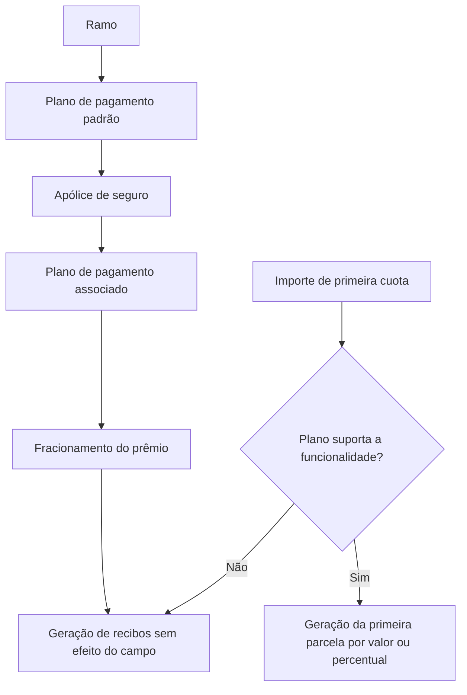

# EN CONSTRUCCIÓN — Plano de Pagamento de Apólice

## 1. Metadados do Documento
- **Arquivo de Origem:** Não identificado
- **Tipo de Documento:** Manual Operacional
- **Domínio / Sistema:** Apólices de seguro — Plano de pagamento
- **Público-Alvo:** Negócio, operação e desenvolvimento
- **Data/Versão Identificada:** Não identificada

---

## 2. Resumo Executivo & Contexto de Negócio

O conteúdo descreve a configuração do **plano de pagamento** associado a uma apólice de seguro. O plano determina como o pagamento do prêmio do seguro será fracionado.

Os planos de pagamento disponíveis são previamente definidos. O documento lista as ações de criar, modificar e excluir, sem detalhar critérios, permissões ou o comportamento operacional de cada ação.

Na criação da apólice, a propriedade de plano de pagamento exibe o plano padrão identificado para o ramo. O documento também descreve o campo **Importe de primeira cuota**, cujo efeito depende exclusivamente de o plano de pagamento suportar essa funcionalidade.

Quando suportado, o campo permite informar um valor ou um percentual — identificado pelo sinal `%` — para gerar a primeira parcela do movimento. Caso o plano não suporte essa funcionalidade, o conteúdo do campo não afeta a geração de recibos.

---

## 3. Arquitetura, Componentes & Tecnologias Envolvidas

O trecho não identifica microsserviços, tecnologias, bancos de dados, integrações, URLs, ambientes ou contratos de API. Os componentes funcionais identificados são:

- Apólice de seguro.
- Ramo.
- Plano de pagamento.
- Prêmio do seguro.
- Movimento.
- Primeira parcela.
- Geração de recibos.



> **Nota de Análise:** O documento não detalha interfaces, métodos HTTP, contratos JSON, persistência de dados, regras de seleção do plano padrão por ramo ou mecanismos técnicos de geração de recibos.

---

## 4. Regras de Negócio, Especificações Funcionais & Processos

1. O plano de pagamento permite identificar qual plano será aplicado à apólice.
2. O plano de pagamento determina como o pagamento do prêmio do seguro será fracionado.
3. Os planos de pagamento disponíveis devem ser definidos previamente.
4. O documento lista as ações possíveis de criar, modificar e excluir um plano de pagamento.
5. Deve ser especificado o plano de pagamento que será associado à apólice.
6. Na criação da apólice, a propriedade apresenta o plano de pagamento padrão identificado para o ramo.
7. O uso do campo **Importe de primeira cuota** depende exclusivamente de o plano de pagamento permitir essa possibilidade.
8. Se o plano permitir essa possibilidade:
   - Um valor pode ser informado para a primeira parcela do movimento.
   - Um percentual pode ser informado para a primeira parcela do movimento.
   - O percentual deve conter o sinal `%`.
   - A primeira parcela é gerada pelo valor informado ou pelo valor correspondente ao percentual informado.
9. Se o plano de pagamento não suportar essa funcionalidade:
   - O conteúdo de **Importe de primeira cuota** não afeta a geração de recibos.

---

## 5. Tabelas de Parâmetros, Ambientes e Estruturas de Dados

| Item / Parâmetro | Descrição / Função | Tipo / Valores / Formato | Ambiente / Observações |
| :--- | :--- | :--- | :--- |
| Plano de pagamento | Identifica o plano associado à apólice e determina o fracionamento do prêmio. | Plano previamente definido. | Exibe inicialmente o plano padrão identificado para o ramo durante a criação da apólice. |
| Plano padrão | Plano de pagamento apresentado ao criar uma apólice. | Não detalhado. | Identificado para o ramo. |
| Importe de primeira cuota | Define o valor ou percentual aplicável à primeira parcela do movimento, quando permitido pelo plano. | Valor ou percentual com sinal `%`. | Não afeta a geração de recibos se o plano não suportar a funcionalidade. |
| Primeira parcela do movimento | Parcela inicial gerada conforme o valor ou percentual informado. | Valor ou valor correspondente ao percentual. | Gerada somente quando o plano suporta a funcionalidade do campo. |
| Geração de recibos | Processo de geração de recibos da apólice. | Não detalhado. | Não é afetado pelo campo de primeira parcela quando a funcionalidade não é suportada. |
| Criar | Ação possível listada para o plano de pagamento. | Não detalhado. | Fluxo não detalhado. |
| Modificar | Ação possível listada para o plano de pagamento. | Não detalhado. | Fluxo não detalhado. |
| Excluir | Ação possível listada para o plano de pagamento. | Não detalhado. | Fluxo não detalhado. |

---

## 6. Bateria de Perguntas & Respostas para RAG (FAQ Sintético)

### P1: O que o plano de pagamento determina em uma apólice de seguro?
**R:** O plano de pagamento determina como o pagamento do prêmio do seguro será fracionado para a apólice.

### P2: Os planos de pagamento são criados automaticamente durante a criação da apólice?
**R:** Não. O documento informa que os planos de pagamento disponíveis são definidos previamente.

### P3: Qual plano de pagamento é mostrado ao criar uma apólice?
**R:** Ao criar a apólice, a propriedade de plano de pagamento mostra o plano de pagamento padrão identificado para o ramo.

### P4: Quais ações o documento lista para o plano de pagamento?
**R:** O documento lista as ações de criar, modificar e excluir, sem fornecer detalhamento adicional sobre seus fluxos ou validações.

### P5: O que deve ser informado no campo de plano de pagamento?
**R:** Deve ser especificado o plano de pagamento que será associado à apólice.

### P6: Para que serve o campo “Importe de primeira cuota”?
**R:** Quando o plano de pagamento suporta essa funcionalidade, o campo permite definir o valor ou percentual que será usado para gerar a primeira parcela do movimento.

### P7: Como informar um percentual no campo “Importe de primeira cuota”?
**R:** O percentual deve ser informado com o sinal `%`.

### P8: O que acontece quando é informado um valor na primeira parcela?
**R:** Se o plano de pagamento permitir a funcionalidade, a primeira parcela do movimento será gerada pelo valor informado.

### P9: O que acontece quando é informado um percentual na primeira parcela?
**R:** Se o plano de pagamento permitir a funcionalidade, a primeira parcela do movimento será gerada pelo valor correspondente ao percentual informado.

### P10: O campo “Importe de primeira cuota” sempre altera a geração de recibos?
**R:** Não. Se o plano de pagamento não suportar essa funcionalidade, o conteúdo do campo não afeta a geração de recibos.

---

## 7. Glossário de Termos, Siglas & Conceitos-Chave

- **Apólice:** Entidade à qual é associado um plano de pagamento.
- **Plano de pagamento:** Plano que determina o fracionamento do pagamento do prêmio do seguro.
- **Prêmio do seguro:** Valor cujo pagamento é fracionado pelo plano de pagamento.
- **Ramo:** Elemento usado para identificar o plano de pagamento padrão durante a criação da apólice.
- **Movimento:** Contexto no qual é gerada a primeira parcela.
- **Primeira cuota:** Primeira parcela do movimento.
- **Recibos:** Registros cuja geração pode ser afetada pelo campo da primeira parcela quando a funcionalidade é suportada.

---

## 8. Notas Críticas, Riscos & Limitações

- O material fornecido está incompleto e termina após a indicação de um exemplo.
- Não há detalhamento sobre os fluxos de criação, modificação ou exclusão.
- Não são informados critérios para identificar o plano padrão por ramo.
- Não são especificadas validações para valores, percentuais, obrigatoriedade do campo ou tratamento de erros.
- Não há definição de métodos HTTP, contratos de API, modelos de dados, ambientes, URLs ou rotas de log.
- Não é detalhado o comportamento da geração de recibos quando a funcionalidade de primeira parcela é suportada além do efeito declarado.

---

## 9. Conteúdo Bruto Estruturado (Referência Fiel)

```text
--- [PÁGINA 1 DE 2] ---

EN CONSTRUCCIÓN
PLAN PAGO
En que consiste
Permite identificar el plan de pago que tendrá la póliza, que será el que determine cómo se va a
fraccionar el pago de la prima del seguro.
Los planes de pago disponibles se definen previamente.
Posibles acciones
 CREAR ( )
 MODIFICAR ( )
 BORRAR ( )
Proceso a seguir
A continuación se detalla la información requerida.
Plan de pago (   )
 / 
 RS
Inicio Soluciones APIs Documentación Zeus
ES


--- [PÁGINA 2 DE 2] ---

Se debe especificar el plan de pago que se asociará a la póliza.
Al crear la póliza, esta propiedad muestra el plan de pago por defecto, identificado para el ramo.
Importe de primera cuota ( )
El uso de este campo depende exclusivamente de si el plan de pago permite esta posibilidad, que no
es más que si se incluye un importe o un porcentaje (debe llevar el signo %), la primera cuota del
movimiento se generará por ese importe o el importe correspondiente al porcentaje (%) dado. Si el
plan de pago no soporta esta funcionalidad, la generación de recibos no se verá afectada por el
contenido de este campo.
Ejemplo:
```
